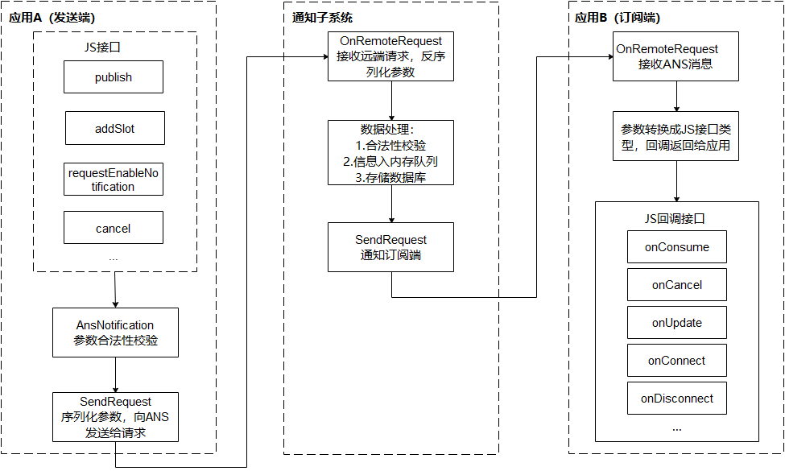

# 订阅通知（仅对系统应用开放）
<!--Kit: Notification Kit-->
<!--Subsystem: Notification-->
<!--Owner: @HuYueRong-->
<!--Designer: @dongqingran-->
<!--Tester: @wanghong1997-->
<!--Adviser: @fang-jinxu-->

应用需要接收通知，必须先发起订阅，通知子系统提供两种接口：订阅所有应用发布的通知和订阅某些应用发布的通知。


系统提供[NotificationSubscriber](../reference/apis-notification-kit/js-apis-inner-notification-notificationSubscriber-sys.md)对象，用于提供订阅成功、通知接收、通知取消、订阅取消等回调接口，将变化信息回调给订阅者。

## 通知订阅原理

通知业务流程由通知子系统、通知发送端、通知订阅端组成。一条通知从通知发送端产生，通过[IPC通信](../ipc/ipc-rpc-overview.md)发送到通知子系统，再由通知子系统分发给通知订阅端。

* 通知发送端：可以是三方应用或系统应用。开发者重点关注。

* 通知订阅端：只能为系统应用，比如通知中心。通知中心默认会订阅手机上所有应用对当前用户的通知。开发者无需关注。

**图1** 通知业务流程  




## 接口说明

通知订阅主要接口如下。详细接口介绍请参见[@ohos.notificationSubscribe (NotificationSubscribe模块)(系统接口)](../reference/apis-notification-kit/js-apis-notificationSubscribe-sys.md)。

**表1** 通知订阅接口介绍

| **接口名** | **描述** |
| -------- | -------- |
| subscribeNotification(subscriber:&nbsp;NotificationSubscriber,&nbsp;info:&nbsp;NotificationSubscribeInfo):&nbsp;Promise&lt;void&gt; | 订阅指定应用通知。|
| subscribeNotification(subscriber:&nbsp;NotificationSubscriber):&nbsp;Promise&lt;void&gt; | 订阅所有通知。    |

**表2** 通知订阅回调接口介绍

详细接口介绍请参见[NotificationSubscriber](../reference/apis-notification-kit/js-apis-inner-notification-notificationSubscriber-sys.md)。

| **接口名** | **描述** |
| -------- | -------- |
| onConsume?: (data:&nbsp;SubscribeCallbackData)&nbsp;=&gt;&nbsp;void  | 通知回调。               |
| onCancel?: (data:&nbsp;SubscribeCallbackData)&nbsp;=&gt;&nbsp;void   | 通知取消回调。           |
| onUpdate?: (data:&nbsp;NotificationSortingMap)&nbsp;=&gt;&nbsp;void  | 通知排序更新回调。       |
| onConnect?: ()&nbsp;=&gt;&nbsp;void                                 | 订阅成功回调。           |
| onDisconnect?: ()&nbsp;=&gt;&nbsp;void                              | 取消订阅回调。           |
| onDestroy?: ()&nbsp;=&gt;&nbsp;void                                  | 与通知子系统断开回调。   |
| onDoNotDisturbChanged?: (mode:&nbsp;notificationManager.DoNotDisturbDate)&nbsp;=&gt;&nbsp;void           | 免打扰时间选项变更回调。 |
| onEnabledNotificationChanged?: (callbackData:&nbsp;EnabledNotificationCallbackData)&nbsp;=&gt;&nbsp;void | 通知开关变更回调。       |
| onBadgeChanged?: (data:&nbsp;BadgeNumberCallbackData)&nbsp;=&gt;&nbsp;void                               | 应用角标个数变化回调。   |
| onBatchCancel?: (data:&nbsp;Array&lt;SubscribeCallbackData&gt;)&nbsp;=&gt;&nbsp;void                               | 批量删除回调。   |
| onEnabledPriorityChanged?: (callbackData:&nbsp;EnabledPriorityNotificationCallbackData)&nbsp;=&gt;&nbsp;void                               | 通知优先级总开关状态变化回调。   |
| onEnabledPriorityByBundleChanged?: (callbackData:&nbsp;EnabledPriorityNotificationByBundleCallbackData)&nbsp;=&gt;&nbsp;void                               | 应用通知优先级开关状态变化回调。   |
| onSystemUpdate?: SystemUpdateCallback            | 系统属性值变化回调。   |
| onEnabledSilentReminderChanged?: EnabledSilentReminderChangedCallback   | 应用通知静默提醒的使能状态变化回调。   |
| onBadgeEnabledChanged?: BadgeEnabledChangedCallback   | 应用角标的使能状态变化回调。   |


## 开发步骤

1. 申请`ohos.permission.NOTIFICATION_SYSTEM_SUBSCRIBER`权限，配置方式请参见[申请应用权限](../security/AccessToken/determine-application-mode.md#system_basic等级应用申请权限的方式)。

2. 导入通知订阅模块。
   
   ```ts
   import { notificationSubscribe, notificationManager } from '@kit.NotificationKit';
   import { BusinessError } from '@kit.BasicServicesKit';
   import { hilog } from '@kit.PerformanceAnalysisKit';

   const TAG: string = '[SubscribeOperations]';
   const DOMAIN_NUMBER: number = 0xFF00;
   ```

3. 创建订阅者对象。
   
   ```ts
   let subscriber: notificationSubscribe.NotificationSubscriber = {
     onConsume: (data:notificationSubscribe.SubscribeCallbackData) => {
       let req: notificationManager.NotificationRequest = data.request;
       hilog.info(DOMAIN_NUMBER, TAG, `onConsume callback. req.id: ${req.id}`);
     },
     onCancel: (data:notificationSubscribe.SubscribeCallbackData) => {
       let req: notificationManager.NotificationRequest = data.request;
       hilog.info(DOMAIN_NUMBER, TAG, `onCancel callback. req.id: ${req.id}`);
     },
     onConnect: () => {
       hilog.info(DOMAIN_NUMBER, TAG, `onConnect callback.`);
     },
     onDisconnect: () => {
       hilog.info(DOMAIN_NUMBER, TAG, `onDisconnect callback.`);
     },
     onDestroy: () => {
       hilog.info(DOMAIN_NUMBER, TAG, `onDestroy callback.`);
     },
     onDoNotDisturbChanged: (mode) => {
       hilog.info(DOMAIN_NUMBER, TAG, `onDoNotDisturbChanged callback. mode: ${JSON.stringify(mode)}`);
     },
     onEnabledNotificationChanged: (callbackData) => {
       hilog.info(DOMAIN_NUMBER, TAG, `onEnabledNotificationChanged callback. callbackData: ${JSON.stringify(callbackData)}`);
     },
     onBadgeChanged: (data) => {
       hilog.info(DOMAIN_NUMBER, TAG, `onBadgeChanged callback. data: ${JSON.stringify(data)}`);
     },
     onBatchCancel: (data) => {
       hilog.info(DOMAIN_NUMBER, TAG, `onBatchCancel callback. data: ${JSON.stringify(data)}`);
     },
     onEnabledPriorityChanged: (callbackData) => {
       hilog.info(DOMAIN_NUMBER, TAG, `onEnabledPriorityChanged callback. callbackData: ${JSON.stringify(callbackData)}`);
     },
     onEnabledPriorityByBundleChanged: (callbackData) => {
       hilog.info(DOMAIN_NUMBER, TAG, `onEnabledPriorityByBundleChanged callback. callbackData: ${JSON.stringify(callbackData)}`);
     },
     onSystemUpdate: (data) => {
       hilog.info(DOMAIN_NUMBER, TAG, `onSystemUpdate callback. data: ${JSON.stringify(data)}`);
     },
     onEnabledSilentReminderChanged: (callbackData) => {
       hilog.info(DOMAIN_NUMBER, TAG, `onEnabledSilentReminderChanged callback. callbackData: ${JSON.stringify(callbackData)}`);
     },
     onBadgeEnabledChanged: (data) => {
       hilog.info(DOMAIN_NUMBER, TAG, `onBadgeEnabledChanged callback. data: ${JSON.stringify(data)}`);
     },
   };
   ```
   
4. 发起通知订阅。
   
   ```ts
   notificationSubscribe.subscribeNotification(subscriber).then(() => {
     hilog.info(DOMAIN_NUMBER, TAG, "subscribeNotification success");
   }).catch((err: BusinessError) => {
     hilog.error(DOMAIN_NUMBER, TAG, `subscribeNotification failed, code is ${err.code}, message is ${err.message}`);
   });
   ```
