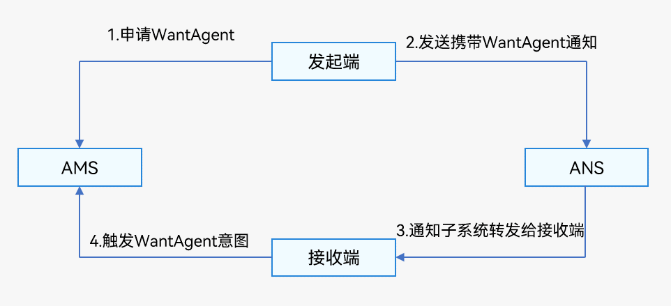

# 为通知添加行为意图

[WantAgent](../reference/apis/js-apis-app-ability-wantAgent.md)提供了封装行为意图的能力，该行为意图是指拉起指定的应用组件及发布公共事件等能力。OpenHarmony支持以通知的形式，将[WantAgent](../reference/apis/js-apis-app-ability-wantAgent.md)从发布方传递至接收方，从而在接收方触发[WantAgent](../reference/apis/js-apis-app-ability-wantAgent.md)中指定的意图。例如在通知消息的发布者发布通知时，通常期望用户可以通过通知栏点击拉起目标应用组件。为了达成这一目标，开发者可以将[WantAgent](../reference/apis/js-apis-app-ability-wantAgent.md)封装至通知消息中，当系统接收到[WantAgent](../reference/apis/js-apis-app-ability-wantAgent.md)后，在用户点击通知栏时触发[WantAgent](../reference/apis/js-apis-app-ability-wantAgent.md)的意图，从而拉起目标应用组件。

为通知添加行为意图的实现方式如下图所示：发布通知的应用向应用组件管理服务AMS（Ability Manager Service）申请[WantAgent](../reference/apis/js-apis-app-ability-wantAgent.md)，然后随其他通知信息一起发送给桌面，当用户在桌面通知栏上点击通知时，触发[WantAgent](../reference/apis/js-apis-app-ability-wantAgent.md)动作。

  **图1** 携带行为意图的通知运行机制  



## 接口说明

具体接口描述，详见[WantAgent接口文档](../reference/apis/js-apis-app-ability-wantAgent.md)。

| | |
| -------- | -------- |
| **接口名** | **描述** |
| getWantAgent(info:&nbsp;WantAgentInfo,&nbsp;callback:&nbsp;AsyncCallback&lt;WantAgent&gt;):&nbsp;void | 创建WantAgent。 |
| trigger(agent:&nbsp;WantAgent,&nbsp;triggerInfo:&nbsp;TriggerInfo,&nbsp;callback?:&nbsp;Callback&lt;CompleteData&gt;):&nbsp;void | 触发WantAgent意图。 |
| cancel(agent:&nbsp;WantAgent,&nbsp;callback:&nbsp;AsyncCallback&lt;void&gt;):&nbsp;void | 取消WantAgent。 |
| getWant(agent:&nbsp;WantAgent,&nbsp;callback:&nbsp;AsyncCallback&lt;Want&gt;):&nbsp;void | 获取WantAgent的want。 |
| equal(agent:&nbsp;WantAgent,&nbsp;otherAgent:&nbsp;WantAgent,&nbsp;callback:&nbsp;AsyncCallback&lt;boolean&gt;):&nbsp;void | 判断两个WantAgent实例是否相等。 |


## 开发步骤

1. [使能通知开关](notification-enable.md)，获得用户授权后，才能使用通知功能。

2. 导入模块。

   ```typescript
   import NotificationManager from '@ohos.notificationManager';
   import wantAgent from '@ohos.app.ability.wantAgent';
   ```

3. 创建WantAgentInfo信息。

   场景一：创建拉起UIAbility的WantAgent的WantAgentInfo信息。

   ```typescript
   let wantAgentObj = null; // 用于保存创建成功的wantAgent对象，后续使用其完成触发的动作。
   
   // 通过WantAgentInfo的operationType设置动作类型
   let wantAgentInfo = {
       wants: [
           {
               deviceId: '',
               bundleName: 'com.example.myapplication',
               abilityName: 'EntryAbility',
               action: '',
               entities: [],
               uri: '',
               parameters: {}
           }
       ],
       operationType: wantAgent.OperationType.START_ABILITY,
       requestCode: 0,
       wantAgentFlags:[wantAgent.WantAgentFlags.CONSTANT_FLAG]
   };
   ```

   场景二：创建发布[公共事件](../application-models/common-event-overview.md)的WantAgent的WantAgentInfo信息。

   ```typescript
   let wantAgentObj = null; // 用于保存创建成功的WantAgent对象，后续使用其完成触发的动作。
   
   // 通过WantAgentInfo的operationType设置动作类型
   let wantAgentInfo = {
       wants: [
           {
               action: 'event_name', // 设置事件名
               parameters: {},
           }
       ],
       operationType: wantAgent.OperationType.SEND_COMMON_EVENT,
       requestCode: 0,
       wantAgentFlags: [wantAgent.WantAgentFlags.CONSTANT_FLAG],
   }
   ```

4. 调用[getWantAgent()](../reference/apis/js-apis-app-ability-wantAgent.md#wantagentgetwantagent)方法进行创建WantAgent。

   ```typescript
   // 创建WantAgent
   wantAgent.getWantAgent(wantAgentInfo, (err, data) => {
       if (err) {
           console.error('[WantAgent]getWantAgent err=' + JSON.stringify(err));
   		return;
       }
       console.info('[WantAgent]getWantAgent success');
       wantAgentObj = data;
   });
   ```

5. 构造NotificationRequest对象，并发布WantAgent通知。

   ```typescript
   // 构造NotificationRequest对象
   let notificationRequest = {
       content: {
           contentType: NotificationManager.ContentType.NOTIFICATION_CONTENT_BASIC_TEXT,
           normal: {
               title: 'Test_Title',
               text: 'Test_Text',
               additionalText: 'Test_AdditionalText',
           },
       },
       id: 1,
       label: 'TEST',
       wantAgent: wantAgentObj,
   }
   
   NotificationManager.publish(notificationRequest, (err) => {
       if (err) {
           console.error(`[ANS] failed to publish, error[${err}]`);
           return;
       }
       console.info(`[ANS] publish success`);
   });
   ```

6. 用户通过点击通知栏上的通知，系统会自动触发WantAgent的动作。
