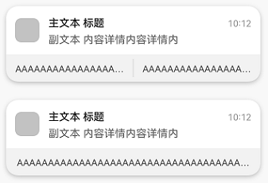
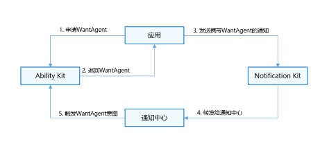

# 为通知添加行为意图

应用向Ability Kit申请[WantAgent](../reference/apis-ability-kit/js-apis-app-ability-wantAgent.md)，并将WantAgent封装至通知中。当发布通知时，用户便可以通过点击通知栏中的消息或按钮，拉起目标应用组件或发布公共事件。

携带了actionButtons的通知示意图如下。



## 运行机制



## 接口说明

| **接口名** | **描述** |
| -------- | -------- |
| [publish](../reference/apis-notification-kit/js-apis-notificationManager.md#notificationmanagerpublish-1)(request: NotificationRequest): Promise\<void\>       | 发布通知。  |
| [getWantAgent](../reference/apis-ability-kit/js-apis-app-ability-wantAgent.md#wantagentgetwantagent)(info:&nbsp;WantAgentInfo,&nbsp;callback:&nbsp;AsyncCallback&lt;WantAgent&gt;):&nbsp;void | 创建WantAgent。 |

## 开发步骤

1. 导入模块。

   ```typescript
   import { notificationManager } from '@kit.NotificationKit';
   import { wantAgent, WantAgent } from '@kit.AbilityKit';
   import { BusinessError } from '@kit.BasicServicesKit';
   import { hilog } from '@kit.PerformanceAnalysisKit';
   
   const TAG: string = '[PublishOperation]';
   const DOMAIN_NUMBER: number = 0xFF00;
   ```

2. 创建WantAgentInfo信息。

   场景一：创建拉起UIAbility的WantAgent的[WantAgentInfo](../reference/apis-ability-kit/js-apis-inner-wantAgent-wantAgentInfo.md)信息。

   ```typescript
   let wantAgentObj:WantAgent; // 用于保存创建成功的wantAgent对象，后续使用其完成触发的动作。
   
   // 通过WantAgentInfo的operationType设置动作类型
   let wantAgentInfo:wantAgent.WantAgentInfo = {
     wants: [
       {
         deviceId: '',
         bundleName: 'com.samples.notification',
         abilityName: 'SecondAbility',
         action: '',
         entities: [],
         uri: '',
         parameters: {}
       }
     ],
     actionType: wantAgent.OperationType.START_ABILITY,
     requestCode: 0,
     actionFlags:[wantAgent.WantAgentFlags.CONSTANT_FLAG]
   };
   ```

   场景二：创建发布[公共事件](../basic-services/common-event/common-event-overview.md)的WantAgent的[WantAgentInfo](../reference/apis-ability-kit/js-apis-inner-wantAgent-wantAgentInfo.md)信息。

   ```typescript
   let wantAgentObj:WantAgent; // 用于保存创建成功的WantAgent对象，后续使用其完成触发的动作。
   
   // 通过WantAgentInfo的operationType设置动作类型
   let wantAgentInfo:wantAgent.WantAgentInfo = {
     wants: [
       {
         action: 'event_name', // 设置事件名
         parameters: {},
       }
     ],
     actionType: wantAgent.OperationType.SEND_COMMON_EVENT,
     requestCode: 0,
     actionFlags: [wantAgent.WantAgentFlags.CONSTANT_FLAG],
   };
   ```

3. 调用[getWantAgent()](../reference/apis-ability-kit/js-apis-app-ability-wantAgent.md#wantagentgetwantagent)方法进行创建WantAgent。

   ```typescript
   // 创建WantAgent
   wantAgent.getWantAgent(wantAgentInfo, (err: BusinessError, data:WantAgent) => {
     if (err) {
       hilog.error(DOMAIN_NUMBER, TAG, `Failed to get want agent. Code is ${err.code}, message is ${err.message}`);
       return;
     }
     hilog.info(DOMAIN_NUMBER, TAG, 'Succeeded in getting want agent.');
     wantAgentObj = data;
   });
   ```

4. 构造NotificationRequest对象，并发布携带WantAgent的通知。

   > **说明：**
   >
   > - 如果封装WantAgent至通知消息中，可以点击通知触发WantAgent。当通知消息存在actionButtons时，点击通知会先显示actionButtons，再次点击通知触发WantAgent。
   >
   > - 如果封装WantAgent至通知按钮中，点击通知后，该通知下方会出现通知按钮，可以点击按钮触发WantAgent。

   ```typescript
   // 构造NotificationActionButton对象
   let actionButton: notificationManager.NotificationActionButton = {
     title: 'Test_Title',
     // wantAgentObj使用前需要保证已被赋值（即步骤3执行完成）
     // 通知按钮的WantAgent
     wantAgent: wantAgentObj
   }
   
   // 构造NotificationRequest对象
   let notificationRequest: notificationManager.NotificationRequest = {
     content: {
       notificationContentType: notificationManager.ContentType.NOTIFICATION_CONTENT_BASIC_TEXT,
       normal: {
         title: 'Test_Title',
         text: 'Test_Text',
         additionalText: 'Test_AdditionalText',
       },
     },
     id: 6,
     // 通知消息的WantAgent
     wantAgent: wantAgentObj,
     // 通知按钮
     actionButtons: [actionButton],
   }
   
   notificationManager.publish(notificationRequest, (err: BusinessError) => {
     if (err) {
       hilog.error(DOMAIN_NUMBER, TAG, `Failed to publish notification. Code is ${err.code}, message is ${err.message}`);
       return;
     }
     hilog.info(DOMAIN_NUMBER, TAG, 'Succeeded in publishing notification.');
   });
   ```
<!--RP1-->

## 示例代码

  - [自定义通知](https://gitee.com/openharmony/applications_app_samples/blob/master/code/BasicFeature/Notification/CustomNotification/README_zh.md)
<!--RP1End-->