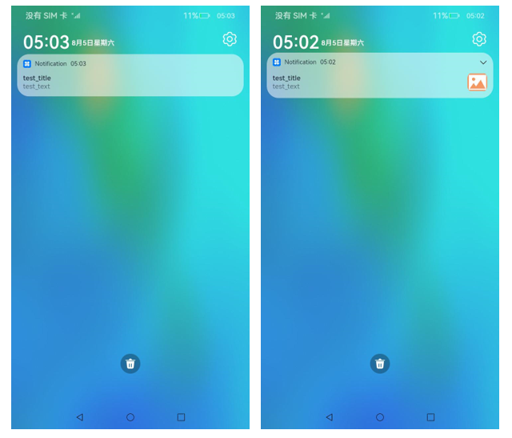
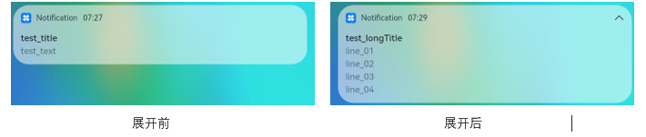

# 发布基础类型通知


基础类型通知主要应用于发送短信息、提示信息、广告推送等，支持普通文本类型、长文本类型、多行文本类型和图片类型。


  **表1** 基础类型通知中的内容分类

| 类型 | 描述 |
| -------- | -------- |
| NOTIFICATION_CONTENT_BASIC_TEXT | 普通文本类型。 |
| NOTIFICATION_CONTENT_LONG_TEXT | 长文本类型。 |
| NOTIFICATION_CONTENT_MULTILINE | 多行文本类型。 |
| NOTIFICATION_CONTENT_PICTURE | 图片类型。 |


目前系统仅通知栏订阅了通知，将通知显示在通知栏里。基础类型通知呈现效果示意图如下所示。


  **图1** 基础类型通知呈现效果示意图  


## 接口说明

通知发布接口如下表所示，不同发布类型通知由[NotificationRequest](../reference/apis/js-apis-notification.md#notificationrequest)的字段携带不同的信息。

| **接口名** | **描述** |
| -------- | -------- |
| publish(request:&nbsp;NotificationRequest,&nbsp;callback:&nbsp;AsyncCallback&lt;void&gt;):&nbsp;void | 发布通知。                 |
| cancel(id:&nbsp;number,&nbsp;label:&nbsp;string,&nbsp;callback:&nbsp;AsyncCallback&lt;void&gt;):&nbsp;void | 取消指定的通知。           |
| cancelAll(callback:&nbsp;AsyncCallback&lt;void&gt;):&nbsp;void; | 取消所有该应用发布的通知。 |


## 开发步骤

1. [使能通知开关](notification-enable.md)，获得用户授权后，才能使用通知功能。

2. 导入模块。
   
   ```ts
   import NotificationManager from '@ohos.notificationManager';
   ```

3. 构造NotificationRequest对象，并发布通知。
   - 普通文本类型通知由标题、文本内容和附加信息三个字段组成，其中标题和文本内容是必填字段，大小均需要小于200字节。
     
      ```ts
      let notificationRequest = {
        id: 1,
        content: {
      	contentType: NotificationManager.ContentType.NOTIFICATION_CONTENT_BASIC_TEXT, // 普通文本类型通知
      	normal: {
      	  title: 'test_title',
      	  text: 'test_text',
      	  additionalText: 'test_additionalText',
      	}
        }
      }
      
      NotificationManager.publish(notificationRequest, (err) => {
          if (err) {
              console.error(`[ANS] failed to publish, error[${err}]`);
              return;
          }
          console.info(`[ANS] publish success`);
      });
      ```

      运行效果如下图所示。
     
     
   - 长文本类型通知继承了普通文本类型的字段，同时新增了长文本内容、内容概要和通知展开时的标题，其中长文本内容不超过1024字节，其他字段小于200字节。通知默认显示与普通文本相同，展开后，标题显示为展开后标题内容，内容为长文本内容。
     
      ```ts
      let notificationRequest = {
        id: 1,
        content: {
      	contentType: NotificationManager.ContentType.NOTIFICATION_CONTENT_LONG_TEXT, // 长文本类型通知
      	longText: {
      	  title: 'test_title',
      	  text: 'test_text',
      	  additionalText: 'test_additionalText',
      	  longText: 'test_longText',
      	  briefText: 'test_briefText',
      	  expandedTitle: 'test_expandedTitle',
      	}
        }
      }
      
      // 发布通知
      NotificationManager.publish(notificationRequest, (err) => {
          if (err) {
              console.error(`[ANS] failed to publish, error[${err}]`);
              return;
          }
          console.info(`[ANS] publish success`);
      });
      ```
   
      运行效果如下图所示。
     
   - 多行文本类型通知继承了普通文本类型的字段，同时新增了多行文本内容、内容概要和通知展开时的标题，其字段均小于200字节。通知默认显示与普通文本相同，展开后，标题显示为展开后标题内容，多行文本内容多行显示。
     
      ```ts
      let notificationRequest = {
        id: 1,
        content: {
      	contentType: NotificationManager.ContentType.NOTIFICATION_CONTENT_MULTILINE, // 多行文本类型通知
      	multiLine: {
      	  title: 'test_title',
      	  text: 'test_text',
      	  briefText: 'test_briefText',
      	  longTitle: 'test_longTitle',
      	  lines: ['line_01', 'line_02', 'line_03', 'line_04'],
      	}
        }
      }
      
      // 发布通知
      NotificationManager.publish(notificationRequest, (err) => {
        if (err) {
      	console.error(`[ANS] failed to publish, error[${err}]`);
      	return;
        }
        console.info(`[ANS] publish success`);
      });
      ```
   
      运行效果如下图所示。
     
   - 图片类型通知继承了普通文本类型的字段，同时新增了图片内容、内容概要和通知展开时的标题，图片内容为PixelMap型对象，其大小不能超过2M。
     
      ```ts
      let notificationPicture: PixelMap = undefined; // 需要获取图片PixelMap信息
      let notificationRequest = {
          id: 1,
          content: {
      	contentType: NotificationManager.ContentType.NOTIFICATION_CONTENT_PICTURE,
      	picture: {
      	  title: 'test_title',
      	  text: 'test_text',
      	  additionalText: 'test_additionalText',
      	  briefText: 'test_briefText',
      	  expandedTitle: 'test_expandedTitle',
      	  picture: notificationPicture
      	}
          }
      }
      
      // 发布通知
      NotificationManager.publish(notificationRequest, (err) => {
          if (err) {
      	console.error(`[ANS] failed to publish, error[${err}]`);
      	return;
          }
          console.info(`[ANS] publish success `);
      });
      ```
   
      运行效果如下图所示。
     
