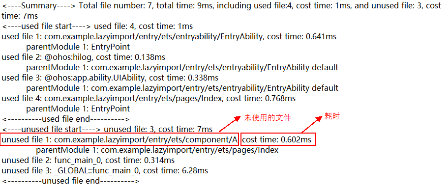

# 延迟加载lazy-import使用指导

随着应用功能持续增加，应用规模不断扩大，依赖的模块文件逐渐变多，应用冷启动加载模块的时间也越来越长。而在实际冷启动过程中执行了很多应用整体依赖但当前未使用的文件，此时可以通过延迟加载 [lazy-import](../quick-start/arkts-lazy-import) 的方法延缓对这些冗余文件的加载，使待加载文件在冷启动阶段不被加载，而在后续导出变量被真正使用时再同步加载执行文件，节省资源以提高应用冷启动性能。

## lazy-import与动态加载的区别

lazy-import与[动态加载](../quick-start/arkts-dynamic-import.md)都可以实现主动延后特定文件的执行时间，帮助设备均摊性能消耗，缓解特定时段性能压力的能力。

|           | 动态加载                                        | lazy-import                                                 |
|-----------|---------------------------------------------|-------------------------------------------------------------|
| 语法示例      | let A = await import("./A");                | import lazy { A } from "./A";                               |
| 性能开销      | 1.创建异步任务开销<br/>2.执行到动态加载时，触发依赖模块的模块解析+源码执行。 | 1.lazy-import的模块解析在冷启动依旧会触发遍历。<br/>2.导入的变量A被使用到时，触发模块的源码执行。 |
| 使用位置      | 代码块/运行逻辑中使用                                 | 需要写在源码开头                                                    |
| 是否可以运行时拼接 | 是                                           | 否                                                           |
| 加载时序      | 异步                                          | 同步                                                          |

开发者在使用动态加载时，需要将静态加载的代码（同步导入）改写成动态加载语法（异步导入），修改量较大。其次如果希望通过动态加载在冷启动阶段产生优化，需要开发者明确感知被动态加载文件不会在冷启动被执行才会有收益，否则会增大冷启动开销（放入异步队列等）。相较于动态加载，使用lazy-import延迟加载，开发者只需要在import语法中增加lazy关键字就可以实现延迟加载，使用更加方便。

## 使用场景

下述例子中A文件被引用，在应用启动到点击按钮的这段时间里，A文件并没有被实际执行，在冷启动阶段加载A文件的行为属于冗余。

```javascript
// A为任意可以被引入的ets文件
import { A } from "./A";

@Entry
@Component
struct Index {
  build() {
    RelativeContainer() {
      Button('点击执行A文件')
        .onClick(() => {
          // 点击后触发A文件的执行
          console.log("执行A文件", A);
        })
    }
    // ...
  }
}
```


通过抓取Trace图查看调用栈可发现，应用在冷启动时加载了A文件。

## 使用方法

### ArkTS冗余文件检测工具

在规避冗余文件时，首先需要筛选出哪些依赖文件在冷启动时未被使用，此时可以使用ArkTS冗余文件检测工具，梳理出冷启动加载过程中未被使用的文件名单。

#### 工具使用
1. 打开模块化日志打印打点开关，重启设备。
    ```shell
    hdc shell param set persist.ark.properties 0x200105c
    hdc shell reboot
    ```
2. 启动应用，启动结束后关闭应用。
3. 下载文件到本地，其中`${bundleName}`为应用名。
   ```shell
   hdc file recv data/app/el2/100/base/${bundleName}/files/${bundleName}_redundant_file.txt D:\
   ```
4. 对上述示例代码获取到的文件进行分析。

   

   大致结构：
   1. Summary ：加载各项文件的总耗时。
   2. used file：冷启动2s内应用使用到的文件。
   3. unused file：冷启动2S内应用没有使用的文件（即冷启动阶段可延迟加载的文件）。

### lazy-import示例

在通过工具筛选出冗余文件后，开发者可选择在引入时添加`lazy`关键字对文件进行标识，表示该文件可被延迟加载。

```javascript
// 此处添加lazy关键字，标记该文件可延迟加载
import lazy { A } from "./A";

@Entry
@Component
struct Index {
  build() {
    RelativeContainer() {
      Button('点击执行A文件')
        .onClick(() => {
          // 点击后触发A文件的执行
          console.log("执行A文件", A);
        })
    }
    // ...
  }
}
```


通过抓取Trace图查看调用栈可发现，使用lazy-import标识后，应用在冷启动时不再加载A文件。

### 注意事项

1. 由于lazy-import的后续加载是同步加载，可能在某些场景阻塞任务执行（比如在点击业务时触发了懒加载，那么运行时会执行冷启动为加载的文件，增加执行耗时，存在掉帧风险），是否使用延迟加载仍需要开发者自行评估。
2. 不推荐开发者在未根据实际业务梳理出可延迟文件时盲目增加延迟加载，过多的延迟加载同样会增大编译及运行时的识别开销。
3. 已经被动态加载的文件同时使用lazy-import时，这些文件会执行lazy标识，在动态加载的then逻辑中同步加载。
关于lazy-import的基础使用方法请参考官方文档：[延迟加载](../quick-start/arkts-lazy-import.md)。

## 性能分析

|     | 加载文件耗时（微秒us） |
|-----|--------------|
| 优化前 | 412us        |
| 优化后 | 350us        |

根据上述优化前后案例Trace图对比分析，使用延迟加载后应用冷启动时不再加载A文件，在资源加载阶段减少因加载冗余文件产生的耗时约15%，提高了应用冷启动性能。（由于案例仅演示场景，优化数据仅做参考，在实际业务中随着引用文件的复杂度提高，引用文件数量增多，优化效果也会随之提升。）