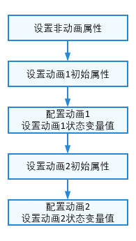
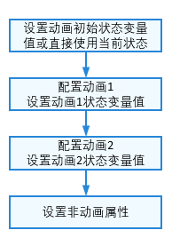
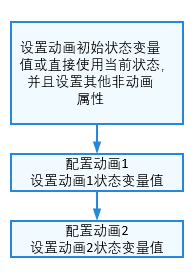

# 应用程序动效能力实践

## 概述
本文介绍如何在开发应用程序时合理地使用动效，来获得更好的性能。主要通过减少布局和属性的变更频次，避免冗余刷新，从而降低性能开销。
基于上述考虑，提供四种较为推荐的动效实现方式：

- 组件转场动画使用transition
- 组件布局改动时使用图形变换属性动画
- 动画参数相同时使用同一个animateTo
- 多次animateTo时统一更新状态变量

## 合理使用动效

### 组件转场动画使用transition
在实现组件出现和消失的动画效果时，通常有两种方式：

- 使用组件动画（animateTo），并在在动画结束回调中增加逻辑处理。
- 直接使用转场动画（transition）。

animateTo需要在动画前后做两次属性更新，而transition只需做一次条件改变更新，性能更好。此外，使用transition，可以避免在结束回调中做复杂逻辑处理，开发实现更容易。因此，推荐优先使用transition。

反例：通过改变透明度属性，从1到0进行隐藏，并在动画结束回调中控制组件的消失。

```typescript
@Entry
@Component
struct MyComponent {
  @State mOpacity: number = 1;
  @State show: boolean = true;
  count: number = 0;
  
  build() {
    Column() {
      Row() {
        if (this.show) {
          Text('value')
            .opacity(this.mOpacity)
        }
      }
      .width('100%')
      .height(100)
      .justifyContent(FlexAlign.Center)
      Text('toggle state')
        .onClick(() => {
          this.count++;
          const thisCount: number = this.count;
          this.show = true;
          // 通过改变透明度属性，对Text控件做隐藏或出现的动画
          animateTo({ duration: 1000, onFinish: () => {
            // 在最后一个动画中，先让Text控件隐藏，再改变条件让Text控件消失
            if (thisCount === this.count && this.mOpacity === 0) {
              this.show = false;
            }
          } }, () => {
            this.mOpacity = this.mOpacity === 1 ? 0 : 1;
          })
        })
    }
  }
}
```

正例：直接使用转场动画，实现Text控件透明度的出现与消失。

```typescript
@Entry
@Component
struct MyComponent {
  @State show: boolean = true;
  
  build() {
    Column() {
      Row() {
        if (this.show) {
          Text('value')
            // 设置id，使转场可打断
            .id('myText')
            .transition(TransitionEffect.OPACITY.animation({ duration: 1000 }))
        }
      }.width('100%')
      .height(100)
      .justifyContent(FlexAlign.Center)
      Text('toggle state')
        .onClick(() => {
          // 通过transition，做透明度的出现或消失动画
          this.show = !this.show;
        })
    }
  }
}
```

### 组件布局改动时使用图形变换属性动画
改动组件的布局显示有两种方式：

- 通过改变布局属性，实现[属性动画](../ui/arkts-attribute-animation-overview.md)：当布局属性发生改变时，界面将重新布局。常见的布局属性有width、height、layoutWeight等。
- 通过改变[图形变换属性](../reference/apis-arkui/arkui-ts/ts-universal-attributes-transformation.md)，实现[属性动画](../ui/arkts-attribute-animation-overview.md)：图形变换是对组件布局结果的变换操作，如平移、旋转、缩放等操作。

界面布局是非常耗时的操作，而当图形变换属性发生变化时，并不会重新触发布局。因此，优先推荐使用图形变换属性来实现组件布局的改动。接下来，采用上述两种方式分别对组件实现放大10倍的效果。

反例：通过设置布局属性width和height，改变组件大小。

```typescript
@Entry
@Component
struct MyComponent {
  @State textWidth: number = 10;
  @State textHeight: number = 10;

  build() {
    Column() {
      Text()
        .backgroundColor(Color.Blue)
        .fontColor(Color.White)
        .fontSize(20)
        .width(this.textWidth)
        .height(this.textHeight)

      Button('布局属性')
        .backgroundColor(Color.Blue)
        .fontColor(Color.White)
        .fontSize(20)
        .margin({ top: 30 })
        .borderRadius(30)
        .padding(10)
        .onClick(() => {
          animateTo({ duration: 1000 }, () => {
            this.textWidth = 100;
            this.textHeight = 100;
          })
        })
    }
}
}
```

在对组件位置或大小变化做动画时，由于布局属性的改变会触发重新测量布局，导致性能开销大。scale属性的改变不会重新触发测量布局，性能开销小。因此，在组件位置大小持续发生变化的场景，如手指缩放的动画场景，推荐使用scale。

正例：通过设置图形变换属性scale，改变组件大小。

```typescript
@Entry
@Component
struct MyComponent {
  @State textScaleX: number = 1;
  @State textScaleY: number = 1;

  build() {
    Column() {
      Text()
        .backgroundColor(Color.Blue)
        .fontColor(Color.White)
        .fontSize(20)
        .width(10)
        .height(10)
        .scale({ x: this.textScaleX, y: this.textScaleY })
        .margin({ top: 100 })

      Button('图形变换属性')
        .backgroundColor(Color.Blue)
        .fontColor(Color.White)
        .fontSize(20)
        .margin({ top: 60 })
        .borderRadius(30)
        .padding(10)
        .onClick(() => {
          animateTo({ duration: 1000 }, () => {
            this.textScaleX = 10;
            this.textScaleY = 10;
          })
        })
    }
}
}
```

### 动画参数相同时使用同一个animateTo
每次animateTo都需要进行动画前后的对比，因此，减少animateTo的使用次数（例如使用同一个animateTo设置组件属性），可以减少该组件更新的次数，从而获得更好的性能。
如果各个属性要做动画的参数相同，推荐将它们放到同一个动画闭包中执行。

反例：相同动画参数的状态变量更新放在不同的动画闭包中。

```typescript
@Entry
@Component
struct MyComponent {
  @State textWidth: number = 200;
  @State color: Color = Color.Red;
  
  func1() {
    animateTo({ curve: Curve.Sharp, duration: 1000 }, () => {
      this.textWidth = (this.textWidth === 100 ? 200 : 100);
    });
  }
  
  func2() {
    animateTo({ curve: Curve.Sharp, duration: 1000 }, () => {
      this.color = (this.color === Color.Yellow ? Color.Red : Color.Yellow);
    });
  }
  
  build() {
    Column() {
      Row()
        .width(this.textWidth)
        .height(10)
        .backgroundColor(this.color)
      Text('click')
        .onClick(() => {
          this.func1();
          this.func2();
        })
    }
    .width('100%')
    .height('100%')
  }
}
```

正例：将相同动画参数的动画合并在一个动画闭包中。

```typescript
@Entry
@Component
struct MyComponent {
  @State textWidth: number = 200;
  @State color: Color = Color.Red;
  
  func() {
    animateTo({ curve: Curve.Sharp, duration: 1000 }, () => {
      this.textWidth = (this.textWidth === 100 ? 200 : 100);
      this.color = (this.color === Color.Yellow ? Color.Red : Color.Yellow);
    });
  }
  
  build() {
    Column() {
      Row()
        .width(this.textWidth)
        .height(10)
        .backgroundColor(this.color)
      Text('click')
        .onClick(() => {
          this.func();
        })
    }
    .width('100%')
    .height('100%')
  }
}
```

### 多次animateTo时统一更新状态变量
animateTo会将执行动画闭包前后的状态进行对比，对差异部分进行动画。为了对比，会在执行animateTo的动画闭包之前，将所有变更的状态变量和脏节点都刷新。
如果多个animateTo之间存在状态更新，会导致执行下一个animateTo之前又存在需要更新的脏节点，可能造成冗余更新。

反例：多个animateTo之间更新状态变量。



以下代码在两个animateTo之间更新组件的其他状态。

```typescript
@Entry
@Component
struct MyComponent {
  @State textWidth: number = 200;
  @State textHeight: number = 50;
  @State color: Color = Color.Red;
  
  build() {
    Column() {
      Row()
        .width(this.textWidth)
        .height(10)
        .backgroundColor(this.color)
      Text('click')
        .height(this.textHeight)
        .onClick(() => {
          this.textWidth = 100;
          // textHeight是非动画属性
          this.textHeight = 100;
          animateTo({ curve: Curve.Sharp, duration: 1000 }, () => {
            this.textWidth = 200;
          });
          this.color = Color.Yellow;
          animateTo({ curve: Curve.Linear, duration: 2000 }, () => {
            this.color = Color.Red;
          });
        })
    }
    .width('100%')
    .height('100%')
  }
}
```

在第一个animateTo前，重新设置了textWidth属性，所以Row组件需要更新一次。在第一个animateTo的动画闭包中，改变了textWidth属性，所以Row组件又需要更新一次并对比产生宽高动画。第二个animateTo前，重新设置了color属性，所以Row组件又需要更新一次。在第二个animateTo的动画闭包中，改变了color属性，所以Row组件再更新一次并产生了背景色动画。Row组件总共更新了4次属性。
此外还更改了与动画无关的状态textHeight，如果不需要改变无关状态，则不应改变造成冗余更新。

正例：统一更新状态变量。

 或 

正例1：在animateTo之前使用原始状态，让动画从原始状态过渡到指定状态，这样也能避免动画在开始时发生跳变。

```typescript
@Entry
@Component
struct MyComponent {
  @State textWidth: number = 100;
  @State textHeight: number = 50;
  @State color: Color = Color.Yellow;
  
  build() {
    Column() {
      Row()
        .width(this.textWidth)
        .height(10)
        .backgroundColor(this.color)
      Text('click')
        .height(this.textHeight)
        .onClick(() => {
          animateTo({ curve: Curve.Sharp, duration: 1000 }, () => {
            this.textWidth = (this.textWidth === 100 ? 200 : 100);
          });
          animateTo({ curve: Curve.Linear, duration: 2000 }, () => {
            this.color = (this.color === Color.Yellow ? Color.Red : Color.Yellow);
          });
        })
    }
    .width('100%')
    .height('100%')
  }
}
```

在第一个animateTo之前，不存在需要更新的脏状态变量和脏节点，无需更新。在第一个animateTo的动画闭包中，改变了textWidth属性，所以Row组件需要更新一次并对比产生宽高动画。在第二个animateTo之前，由于也没有执行额外的语句，不存在需要更新的脏状态变量和脏节点，无需更新。在第二个animateTo的动画闭包中，改变了color属性，所以Row组件再更新一次并产生了背景色动画。Row组件总共更新了2次属性。

正例2：在animateTo之前显式的指定所有需要动画的属性初值，统一更新到节点中，然后再做动画。

```typescript
@Entry
@Component
struct MyComponent {
  @State textWidth: number = 200;
  @State textHeight: number = 50;
  @State color: Color = Color.Red;
  
  build() {
    Column() {
      Row()
        .width(this.textWidth)
        .height(10)
        .backgroundColor(this.color)
      Text('click')
        .height(this.textHeight)
        .onClick(() => {
          this.textWidth = 100;
          this.color = Color.Yellow;
          animateTo({ curve: Curve.Sharp, duration: 1000 }, () => {
            this.textWidth = 200;
          });
          animateTo({ curve: Curve.Linear, duration: 2000 }, () => {
            this.color = Color.Red;
          });
          this.textHeight = 100;
        })
    }
    .width('100%')
    .height('100%')
  }
}
```

在第一个animateTo之前，重新设置了textWidth和color属性，所以Row需要更新一次。在第一个animateTo的动画闭包中，改变了textWidth属性，所以Row组件需要更新一次并对比产生宽高动画。在第二个animateTo之前，由于没有执行额外的语句，不存在需要更新的脏状态变量和脏节点，无需更新。在第二个animateTo的动画闭包中，改变了color属性，所以Row组件再更新一次并产生了背景色动画。Row组件总共更新了3次属性。