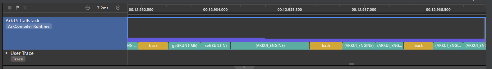
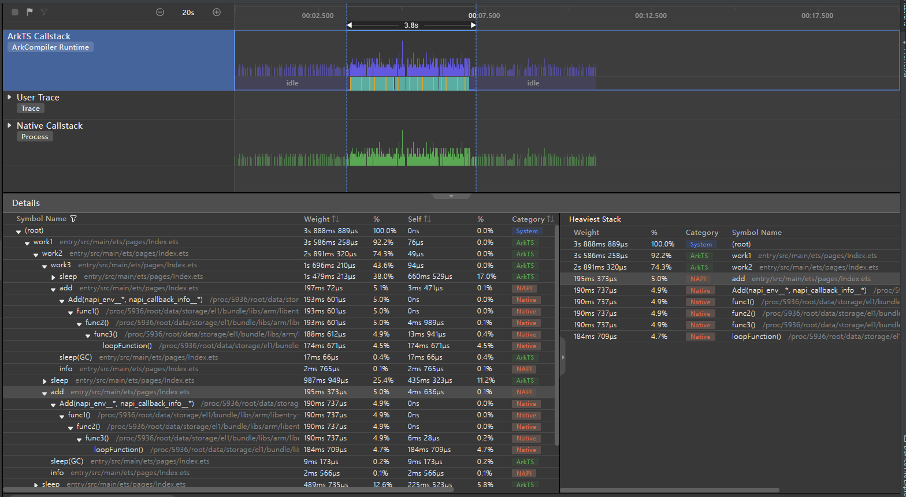
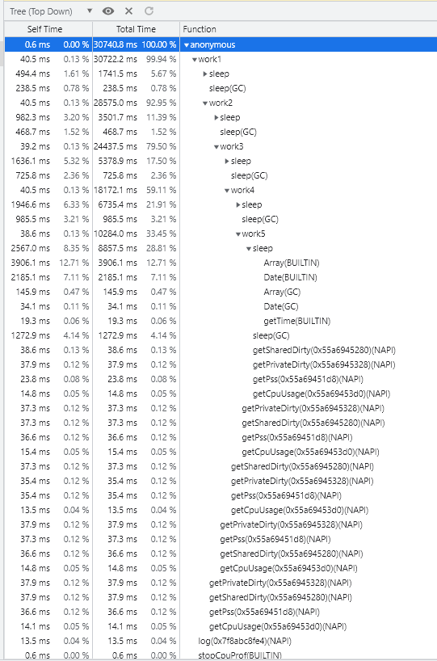
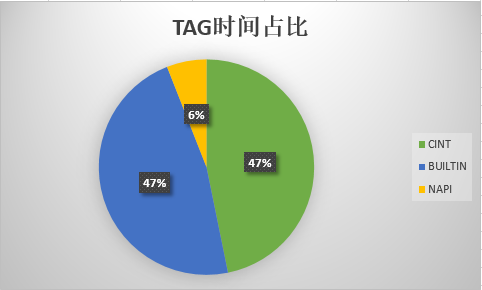
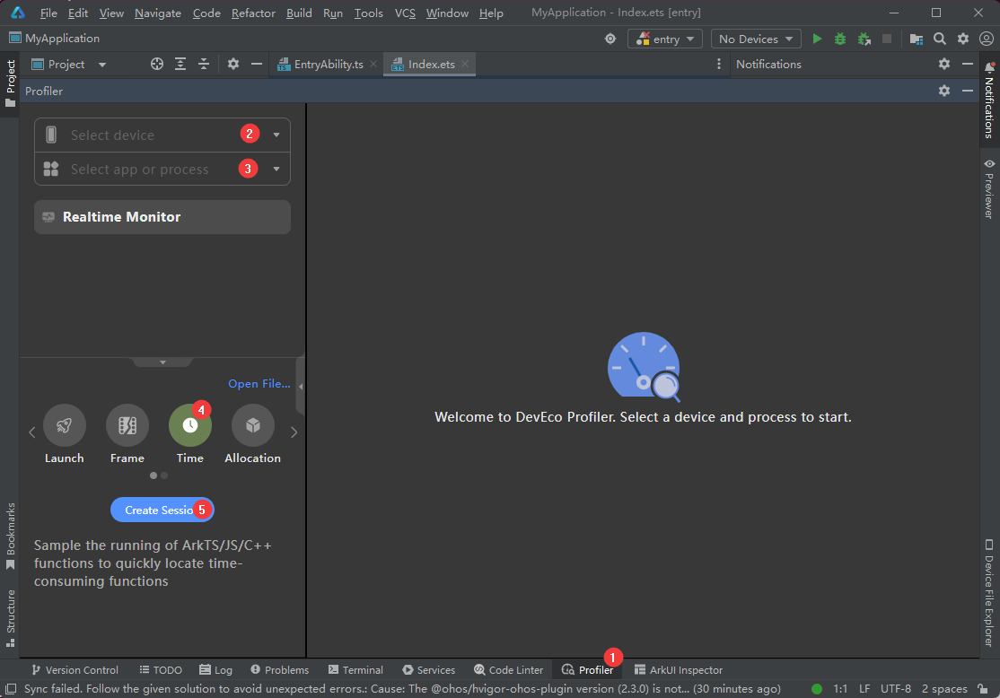

# 应用性能分析工具CPU Profiler的使用指导

<!--Kit: Common-->
<!--Subsystem: Demo&Sample-->
<!--Owner: @mgy917-->
<!--Designer: @jiangwensai-->
<!--Tester: @Lyuxin-->
<!--Adviser: @huipeizi-->

## 简介

本文档介绍应用性能分析工具CPU Profiler的使用方法，该工具为开发者提供性能采样分析手段，可在不插桩情况下获取调用栈上各层函数的执行时间，并展示在时间轴上。

开发者可通过该工具查看TS/JS代码及NAPI代码执行过程中的时序及耗时情况，进而发现热点函数及性能瓶颈，进行应用层性能优化。

## 性能数据分析视图说明

性能数据可以通过**DevEco Studio > Profiler > Time > ArkTS Callstack**和**Chrome浏览器 > JavaScript Profiler**进行展示和分析。前者提供Callstack泳道图、Details图；后者提供时序火焰图（Chart）、比重图（Heavy）、树形图（Tree）。

### DevEco Studio Profiler视图

> **说明：**
>
> 该工具自DevEco Studio 4.0 beta2之后开始提供。请各位开发者将DevEco Studio更新至最新版本，以使用该工具。

**ArkTS Callstack泳道图**

泳道图展示了时间轴上每个时刻正在执行的函数或者正处于的阶段，对于函数来讲可理解为每个时刻调用栈的栈顶。可以通过 **Ctrl+鼠标滚轮** 任意放大和缩小鼠标所在位置的某一段。

NAPI方法在泳道图上被特殊标记为黄色，此类方法会调用到Native代码，在Details图中可查看到该类方法的Native调用栈。

图1 **ArkTS Callstack泳道图**



**Details图**

在泳道图上点击任意时间条，或者选定一个起始和终止范围，工具将在下方Details图中显示此时间条代表的函数或者此范围内所有函数的完整调用链，右侧Heaviest Stack视图展示该范围内耗时最长的调用链。

图2 **阶段耗时详情示意图**



从上图中我们不仅可以看到JS调用栈，还可以看到NAPI接口Native实现部分的C++调用栈。

对于JS方法及开发者自定义的Native方法，双击Details中该方法所在行可跳转到代码行。

> **说明：**
>
> 当前行号尚未完全对齐函数头行号，实际为函数内部可执行代码的第一行。

### Chrome浏览器JavaScript Profiler工具视图

Chrome浏览器JavaScript Profiler工具默认调用V8引擎提供的Profiler工具，可抓取网页JS性能数据。本文提供的TS/JS CPU Profiler工具的性能数据（.cpuprofile）格式与其兼容，可直接导入到该工具进行分析。

在 Chrome 浏览器上打开JavaScript Profiler工具并加载数据文件的操作步骤为：**F12 > More tools > JavaScript Profiler > Load**。

操作步骤示意图如下所示：

图3 **JavaScript Profiler工具入口**


图4 **加载cpuprofile文件**


如果找不到此工具，可勾选下图选项后F12重新打开。

图5 **启用JavaScript Profiler功能**


该工具可将性能分析数据展示在三种视图：时序火焰图（Chart）、比重图（Heavy）、树形图（Tree）。

**时序火焰图（Chart）**

图6 **时序火焰图（Chart）总览**


该视图从时间维度展示应用运行过程中每个时刻的函数调用栈，最为直观，时间轴0时刻代表开始采集，可通过鼠标滚轮放大局部。

图7 **时序火焰图（Chart）详情**


可将鼠标放在某一函数上，展示该函数详细信息，详情中包含以下几个字段：

- **Name**：格式为“函数名（标签）”。函数名表示TS/JS代码函数名，标签信息代表函数类型，具体可见 [函数名标签tag的相关说明](#函数名标签tag的相关说明)。

- **Self Time**：以毫秒（ms）为单位。表示该函数本次调用过程中，除去调用下一级函数所消耗时间后的自身执行耗时。计算方法为该函数本次调用的总耗时减去该函数本次调用下一级所有函数的总时间。

- **Total Time**：以毫秒（ms）为单位。表示该函数本次调用过程中的总耗时，包含调用下一级函数所消耗的时间。

- **URL**：格式为“文件路径：行号”。表示该函数在TS/JS代码中的具体位置，包含所在文件及在该文件中的具体行号，该行号为函数头所在行号。

    > **说明：**
    >
    > - 当前还存在部分函数URL并未进行sourcemap转换的情况，这部分函数的URL在build目录下。
    >
    > - 当前行号尚未完全对齐函数头行号，实际为函数内部可执行代码的第一行。

- **Aggregated self time**：以毫秒（ms）为单位。表示该函数在整个采样过程中历次调用的Self Time的总和（仅限上级调用栈一致的多次调用求和）。

- **Aggregated total time**：以毫秒（ms）为单位。表示该函数在整个采样过程中历次调用的Total Time的总和（仅限上级调用栈一致的多次调用求和）。

**比重图（Heavy）**

比重图列出了所有调用栈的栈顶，可以理解为**时序火焰图从下往上看**，看到的首先是调用链末端函数，以及各自的Self Time时间，将比重图的所有Self Time的比例相加结果为100%。

具体到某一个函数，点击箭头展开，可以看到调用该函数的完整调用链，可能包含多条调用链，指代这些调用链最终都会调用到该函数。

该图表可按照Self Time的大小排序，排在最前面的代表对应函数的Self Time耗时最长，可以作为重点进行分析。

如下两图分别为Chrome浏览器比重图（Heavy）和VSCode比重图（Heavy）对同一`.cpuprofile`文件的解析结果。不难发现，两种解析方式的时间有所差异，该差异是由计算方式的不同导致的。

Chrome浏览器比重图（Heavy）的时间并不是实际时间，而是通过函数的命中率乘以总时间得到；而VSCode比重图（Heavy）的时间是实际耗时。

做精确分析时建议使用VSCode进行解析，直接用VSCode打开`.cpuprofile`文件即可。

图8 **Chrome比重图（Heavy）示例**


图9 **VSCode比重图（Heavy）示例**


**树形图（Tree）**

树形图列出了所有调用栈的栈底，可以理解为**时序火焰图从上往下看**，看到的首先是调用链的起始函数，以及各自的Total Time时间，将树形图的所有Total Time的比例相加结果为100%。

具体到某一个函数，箭头展开，可以看到该函数调用的完整调用链，可能包含多条调用链，指代这些调用链都是从该函数调用下去的。

该图表可按照Total Time的大小排序，排在最前面的代表对应函数的Total Time耗时最长，可以作为重点进行分析。

图10 **树形图（Tree）示例**



### 函数名标签(TAG)的相关说明

各类视图中函数名可能包含(TAG)格式标签，例如func1(AOT)，或者函数名仅为(TAG)格式，例如(program)。

**函数名包含(TAG)标签**

当前支持8类函数名标签，分别是(NAPI)、(ARKUI_ENGINE)、(BUILTIN)、(GC)、(AINT)、(CINT)、(AOT)、(RUNTIME)。可为应用开发者及系统开发者对各部分进行性能分析提供参考。后四种标签通过非命令方式采集时默认不可见，可通过命令 `hdc shell param set persist.ark.properties 0x505c; hdc shell reboot` 打开。

- **(NAPI)** ：系统NativeAPI或者开发者在DevEco Studio上自定义的NativeAPI，例如模板Native C++应用中的 `testNapi.add()`。

- **(ARKUI_ENGINE)**：Native实现的ArkUI组件，例如：`onClick()`，此类函数暂无法提供函数名。

- **(BUILTIN)**：由虚拟机提供的、Native实现的JS标准库接口，例如：`JSON.stringify()`。

- **(GC)**：垃圾回收阶段。

- **(AINT)**：TS/JS方法，该方法通过虚拟机的汇编解释器解释执行。

- **(CINT)**：TS/JS方法，该方法通过虚拟机的C解释器解释执行。

- **(AOT)**：TS/JS方法，该方法通过虚拟机的AOT（Ahead Of Time）编译器提前编译成了机器码，在满足编程规范的前提下可以获得充分编译加速，执行时间比解释执行快。

- **(RUNTIME)**：Native接口（NAPI, ARKUI_ENGINE, BUILTIN）调用该方法时，表示该方法调用到了虚拟机内部运行时代码。

**函数名仅为(TAG)标签**

该类标签代表的是一类特殊节点，并非实际函数，包含三种，分别是(root)、(program)、(idle)，具体含义如下。

- **(root)**：根节点，是program和idle以及所有栈底的父节点，可以理解为main函数的上一层。

- **(program)**：代表程序执行进入纯Native代码阶段，该阶段无JS代码执行，也无JS调用Native或者Native调用JS情况，可能处于系统框架层代码执行阶段。

- **(idle)**：被采集线程无任务执行或处于非running态，未占用CPU。

    > **说明：**
    >
    > 当前尚未统计(idle)阶段，该部分时间包含在(program)阶段中。

**(TAG)标签时间占比统计**

将`cpuprofile`文件以json格式打开，json开头有各个TAG的总时间字段，单位为微秒（us），其中otherTime字段代表(idle)、(root)、(program)三种TAG的总时间。可以据此计算出每种TAG标签的耗时占比，为性能分析提供参考。

图11 **时间占比统计示例**



## 数据采集方法及适用场景

### 各采集工具适用场景及支持情况

| 采集方法       | [DevEco Studio Profiler](#deveco-studio-profiler工具采集) | [JavaScript Profiler](#chrome浏览器javascript-profiler工具采集) | [hdc shell](#hdc-shell命令采集) | [应用代码插桩](#应用代码插桩采集) |
| -------------- | ------------------------------------------------------- | --------------------------------------------------------------- | ------------------------------- | --------------------------------- |
| debug应用      | 支持                                                    | 支持                                                            | 支持                            | 支持                              |
| release应用    | 暂不支持                                                | 暂不支持                                                        | 支持                            | 支持                              |
| 采集主线程     | 支持                                                    | 支持                                                            | 支持                            | 支持                              |
| 采集Worker线程 | 暂不支持                                                | 支持                                                            | 支持                            | 支持                              |
| 采集启动后数据 | 支持                                                    | 支持                                                            | 支持                            | 支持                              |
| 采集冷启动数据 | 暂不支持                                                | 不支持                                                          | 支持                            | 支持                              |

### DevEco Studio Profiler工具采集

1. 启动应用，打开DevEco Studio并确保连接到设备（右上角显示设备SN）。

2. 按照下图所示①-⑤的步骤打开 **Profiler > Time** ，选择设备及应用，创建一个新的Time Session监视器。

   图12 **DevEco Studio Profiler采集指引**

   

3. 点击开始录制按钮，箭头变成方块代表开始录制。

4. 操作应用，复现待分析场景。

5. 再次点击录制按钮，方框变成灰色，结束录制。

6. 选择ArkTS Callstack泳道，框选时间范围或者直接选择函数进行分析，具体可见[DevEco Studio Profiler视图](#deveco-studio-profiler视图)。

### Chrome浏览器JavaScript Profiler工具采集

1. 启动应用，可通过如下命令查看应用线程号。如果要抓Worker线程，列表中会有长线程号（长度是短线程号的两倍），每个Worker线程对应一个长线程号。

    ```shell
    hdc shell "netstat -anp | grep PandaDebugger"
    ```

2. 绑定线程号和端口。多个Worker线程同时采集需各自绑定不同的端口号，打开多个Chrome窗口采集。

    > **说明：**
    >
    > - 建议选择较大端口号避免冲突，这里以9006为例。
    >
    > - 每次断开连接或退出进程后需重新绑定端口号。
    >
    > - 多个Worker线程同时采集需各自绑定不同的端口号，打开多个Chrome窗口采集。

    ```shell
    hdc fport tcp:9006 localabstract:2172PandaDebugger
    ```

   图13 **端口映射**

   

3. 在Chrome浏览器输入网址： `devtools://devtools/bundled/inspector.html?ws=//127.0.0.1:9006` ，端口号与上文一致，点击回车，进入JavaScript Profiler页面。

4. 点击左上角录制按钮，按钮变为红色开始录制。

5. 操作应用，复现待分析场景。

6. 再次点击录制按钮，按钮变为灰色结束录制。

7. 点击左上角性能分析报告，右侧显示性能分析图表，可以选择图表类型，显示数据表或者火焰图，具体可见 [Chrome浏览器JavaScript Profiler工具视图](#chrome浏览器javascript-profiler工具视图)。

    图14 **JavaScript Profile视图布局**

   

### hdc shell命令采集

1. 根据场景设置对应虚拟机参数。

   - 采集冷启动数据

     ```shell
     # 仅采集主线程冷启动
     hdc shell param set persist.ark.properties 0x705c
     # 仅采集Worker线程冷启动
     hdc shell param set persist.ark.properties 0x1505c
     # 同时采集主线程及Worker线程冷启动 
     hdc shell param set persist.ark.properties 0x1705c
     ```

   - 采集启动后任意阶段

     ```shell
     # 仅采集主线程任意阶段
     hdc shell param set persist.ark.properties 0x2505c 
     # 仅采集Worker线程任意阶段
     hdc shell param set persist.ark.properties 0x4505c
     # 同时采集主线程及Worker线程任意阶段 
     hdc shell param set persist.ark.properties 0x6505c
     ```

2. 针对冷启动数据的采集，需设置待采集应用的包名。此处以 `com.ohos.example` 为例。

    ```shell
    hdc shell param set persist.ark.arkbundlename com.ohos.example
    ```

3. 重启设备。

    ```shell
    hdc shell reboot
    ```

4. 启动应用，会在拉起应用前自动开始采集数据。

5. 操作应用，复现待分析场景。

6. 针对启动后任意阶段数据的采集，需使用如下命令，开始采集，其中 `pid` 为应用进程号。

    ```shell
    hdc shell kill -39 pid
    ```

7. 操作应用，复现待分析场景。

8. 停止采集数据，其中 `pid` 为应用进程号。

    ```shell
    hdc shell kill -39 pid
    ```

9. 拉取`cpuprofile`文件。此处以`com.ohos.example`为例，文件实际位置及文件名以实际应用为准。

    > **说明：**
    >
    > 步骤6~8可重复执行多次，会分别采集多个阶段，生成多个`.cpuprofile`文件。
    >
    > 每次采集的次数后缀会加1，初始次数为1。冷启动数据无次数后缀。

    ```shell
    # 主线程：
    # 通常非系统应用抓取后cpuprofile通常存储在/data/app/el2/100/base/<bundle_name>/files/
    hdc file recv /data/app/el2/100/base/com.ohos.example/files/com.ohos.example_次数.cpuprofile ./
    # 系统应用存储在/data/app/el2/0/base/<bundle_name>/files/
    hdc file recv /data/app/el2/0/base/com.ohos.example/files/com.ohos.example_次数.cpuprofile ./
    ```

    ```shell
    # Worker线程：
    # 通常非系统应用cpuprofile通常存储在/data/app/el2/100/base/<bundle_name>/files/
    hdc file recv /data/app/el2/100/base/com.ohos.example/files/com.ohos.example_线程id_次数.cpuprofile ./
    # 系统应用存储在/data/app/el2/0/base/<bundle_name>/files/
    hdc file recv /data/app/el2/0/base/com.ohos.example/files/com.ohos.example_线程id_次数.cpuprofile ./
    ```

10. 将 `com.ohos.example.cpuprofile` 文件导入**Chrome浏览器 > JavaScript Profiler**进行分析，具体可见 [Chrome浏览器JavaScript Profiler工具视图](#chrome浏览器javascript-profiler工具视图)。

    图15 **加载cpuprofile文件**

    

### 应用代码插桩采集

1. 在应用代码中按照如下方式插桩，并打包、安装应用。

    > **说明：**
    >
    > 插桩位置建议选择为不会重复执行的关键位置，例如`onClick`中的首行和末行；若重复执行start、stop，仅有第一次的start、stop会成功执行。

    ```ts
    import hidebug from '@ohos.hidebug';
    // 参数为输出文件的文件名，无需加后缀。该参数为必要参数。
    hidebug.startJsCpuProfiling("filename");
    // code block
    // ...
    // code block
    hidebug.stopJsCpuProfiling("filename");
    ```

2. 启动并操作应用，复现待分析场景，确保插桩代码行能执行到。

3. 拉取`json`文件并将后缀更改为`cpuprofile`。此处以`com.ohos.example`为例，文件实际位置及文件名以实际应用为准。

    ```shell
    # 通常非系统应用抓取后cpuprofile通常存储在/data/app/el2/100/base/<bundle_name>/files/
    hdc file recv /data/app/el2/100/base/com.ohos.example/files/filename.json ./filename.cpuprofile

    # 系统应用存储在/data/app/el2/0/base/<bundle_name>/files/
    hdc file recv /data/app/el2/0/base/com.ohos.example/files/filename.json ./filename.cpuprofile
    ```

4. 将 `filename.cpuprofile` 文件导入**Chrome浏览器 > JavaScript Profiler**进行分析，具体可见 [Chrome浏览器javascript-profiler工具视图](#chrome浏览器javascript-profiler工具视图)。

    图16 **加载cpuprofile文件**

    
