# 应用性能问题分析指导

<!--Kit: Common-->
<!--Subsystem: Demo&Sample-->
<!--Owner: @mgy917-->
<!--Designer: @jiangwensai-->
<!--Tester: @Lyuxin-->
<!--Adviser: @huipeizi-->

## 概述

常见的应用性能问题，开发者可以从丢帧问题（如滑动列表时的丢帧、窗口动画不连贯）和响应速度问题（如应用启动白屏过长、滑动不跟手）两个角度去分析。在分析性能问题之前、验证性能优化方案之时，开发者会需要对应用的性能指标做检测。本文会先说明丢帧和响应速度问题相关的性能指标检测方法，然后再阐述两个角度下，略有不同的问题分析思路。 

本文主要是以Trace数据为切入点进行分析，相应的工具可以使用SmartPerf Host或DevEco Studio内置的Frame等。若开发者需要补充SmartPerf Host工具和Trace相关知识，可以分别参考《[性能优化工具SmartPerf-Host](performance-optimization-using-smartperf-host.md)》和《[常用trace使用指导](common-trace-using-instructions.md)》等应用开发文档。

## 应用性能指标

### 平均帧率
开发者可以通过HiTrace命令工具抓取应用刷新时的Trace信息，并通过SmartPerf Host集成性能工具分析。例如，抓取某应用发生丢帧处的Trace信息如图1，则平均帧率计算过程如下：

**图1 应用丢帧处的Trace数据**

 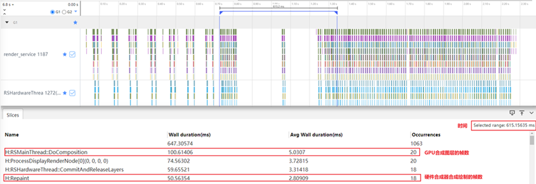

其中，帧率 = Occurrences / Selected range。

| 计算帧率时，可参考的Trace标签	| 含义| 	帧数| 	平均帧率 |
| --- | --- | --- |--- |
| RSMainThread::DoComposition| 	合成渲染树上各节点图层| 	20| 	32.5 |
| Repaint	| 硬件合成器合成绘制 | 	18 | 	29.27 |

如果依据RSMainThread::DoComposition标签，从GPU合成图层的角度，去模拟最终呈现给用户的上屏帧数，平均帧率为32.5FPS。

如果依据Repaint标签，从硬件合成器合成绘制的角度，去模拟最终呈现给用户的上屏帧数，平均帧率为29.27FPS。

可见，不同trace标签的选取，对估算用户真实感知到的平均帧率，是略有不同的。

在了解估算原理后，值得说明的是，SmartPerf Host针对部分标签，已经可以实现框选时间范围内平均帧率的自动计算。例如，框选的范围内存在RSMainThread::DoComposition泳道，平均帧率自动计算效果如图2所示，而其相应的平均帧率算法如下：  

帧数 = 框选时间范围内，完整的DoComposition个数。  
时间 = 框选时间范围内，从第一个完整的DoComposition开始到最后一个完整的DoComposition结束的时间。  

进而通过，平均帧率 = 帧数 / 时间，计算平均帧率。

**图2 SmartPerf Host平均帧率自动计算**

 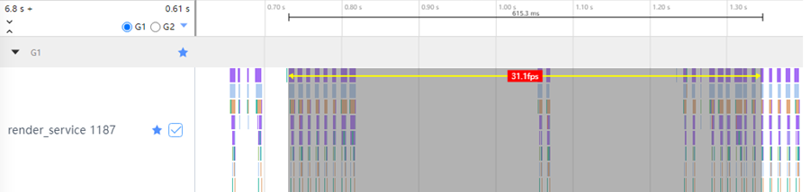

### 完成时延

这里以点击应用tab，做页面跳转的场景为例，通过Trace分析其完成时延。  
在了解如何通过Trace分析应用的完成时延之前，开发者需要简单了解OpenHarmony中图形渲染的流程。在整个渲染流程中，首先由App侧响应用户的屏幕输入事件，由App侧处理完成后再提交给RS侧，由RS侧协调GPU等资源处理后，再将最终的图像送到屏幕上进行显示。图3即该过程中，几个常见的进程/标签名，及其在system侧、App侧、RS侧的时序分布。后文将结合Trace图示例，与标签含义说明，简要描述system侧、App侧、RS侧在图形渲染流程中的行为。

**图3 页面跳转完成时延**

 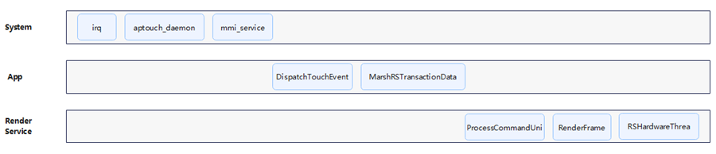

在系统侧，如图4所示，用户点击屏幕后，CPU会收到硬件中断；aptouch进程会响应中断，判断哪些像素被点击、是否是手势；如果是手势，多模会收到手势信号，形成点击事件，执行应用注册的事件回调。

**图4 system侧Trace**

 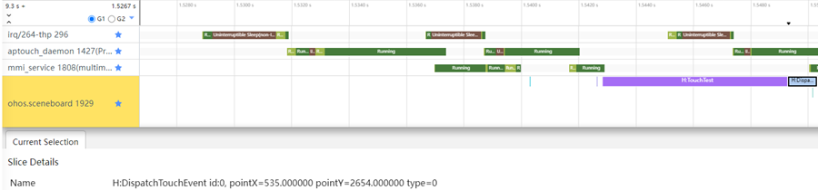
 | 系统侧进程标签 | 	含义 | 
 | --- | 	--- | 
 | irp	 | CPU收到硬件中断 | 
 | aptouch_daemon | 	响应中断，哪些像素被点，判断是不是手势 | 
 | mmi_service	 | 多模收到手势，会执行应用注册的回调 | 

在app侧，如图5所示，应用收到点击，运行onClick中的回调，UI后端引擎会在测量、布局做完后，将组件树信息序列化后传给RS侧。

**图5 app侧Trace**

 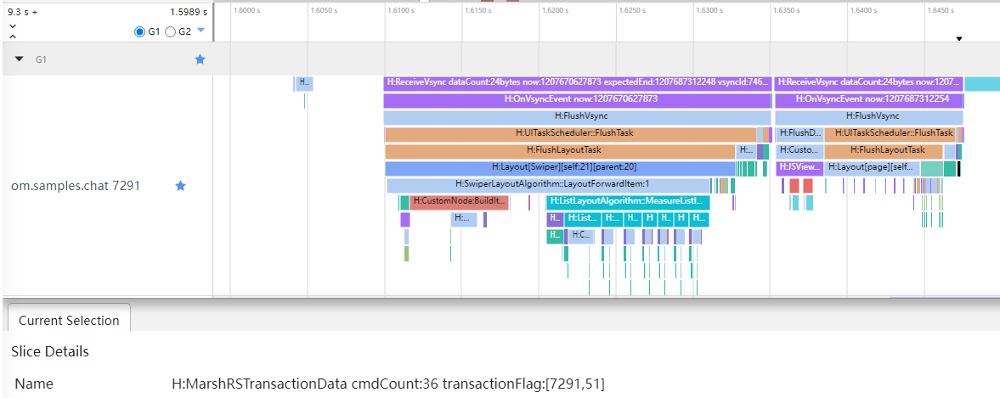
 |APP侧trace标签示例 |	含义 |
 | --- |	--- |
 |DispatchTouchEvent |	应用收到事件，开始运行onClick的回调 |
 |MarshRSTransactionData cmdCount:36 transactionFlag:[7291，51] |	App将组件树信息序列化后发给RS |

图形图像子系统中的Render Service，是负责界面内容绘制的部件，如图6所示，它收到App侧序列化的组件树信息后，将其反序列化，更新统一渲染树后，翻译为GPU绘制指令，最后将GPU绘制好的图层，放到硬件合成器上做合成，层层堆叠，最终显示到屏幕上。

**图6 RS侧Trace**

 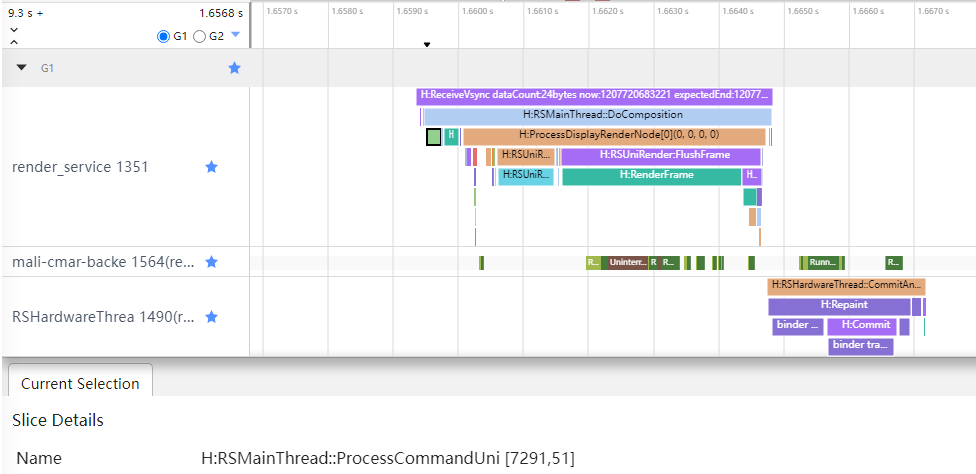

RS侧trace标签示例	含义
RSMainThread::ProcessCommandUni [7291，51]	反序列化组件树信息
RenderFrame	将渲染树翻译为GPU绘制指令
Repaint	硬件合成器合成绘制。

App侧序列化与RS侧反序列化的Trace示例标签中都有 [7291，51]，分别是线程号与帧编号标识。可以看到被处理的帧信息，是按编号在App侧与RS侧一一对应的。  

不同开发者分析问题的目的不同，所关注的问题层级和入口也会不同，因此对响应时间的起点与终点的界定也有可能不同。这里以系统行为的硬件中断为起点，RS侧硬件合成器合成绘制、提交上屏为终点，测量响应时间。

**图7 测量完成时延**

 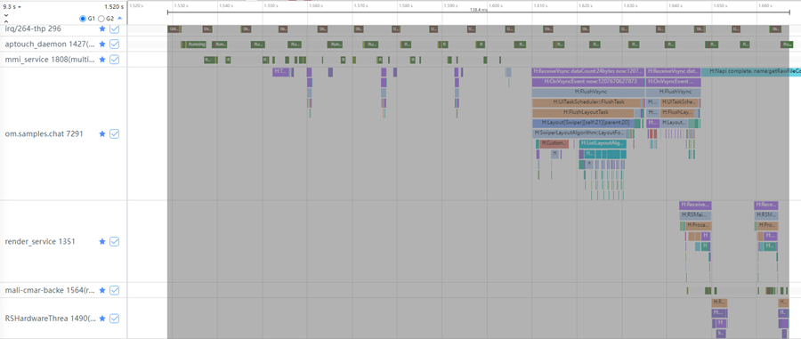

如图7所示，该点击事件完成时延约为138.4ms。

## 应用性能分析

### 丢帧问题分析思路

这里以某应用滑动场景发生丢帧为例，简要说明应用侧问题分析思路。

**信息准备**

**确定问题现象**

用户环境版本、数据量是怎样？用户做了什么操作？是否可以本地复现？复现概率如何？

**抓取所需日志信息**

HiTrace、HiPerf、cpuProfiler、常规log等各类可观测性数据。

**问题分析**

导致应用丢帧的原因非常多，可能是应用本身原因，可能是系统原因，也有可能是硬件层原因。不同卡顿原因在Trace中有不同表现，识别需要大量经验积累。

分析过程，主要是结合App主进程和RenderService渲染进程Trace数据，先排查系统、硬件是否异常，再分析应用本身原因。
1.	看线程状态和运行核，看是否被其他进程抢占资源，排除系统侧运行异常。

    **看线程状态**

    从图8可以看到，应用线程大部分时间处于Running状态，无特殊异常。
    
    **图8 丢帧处应用主线程状态**

    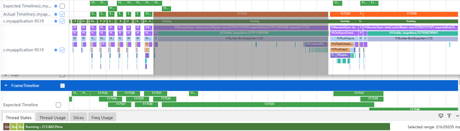
    
    **看运行频率**
    
    查看关键任务是否跑在了小核，以低频运行。从Thread Usage信息栏，如图9所示，可以看到丢帧处应用线程和前面正常帧类似，都主要运行在大核上。其运行频点，可以参考Freq Usage信息栏，如图10所示。
    
    **图9 丢帧处应用主线程运行核**

    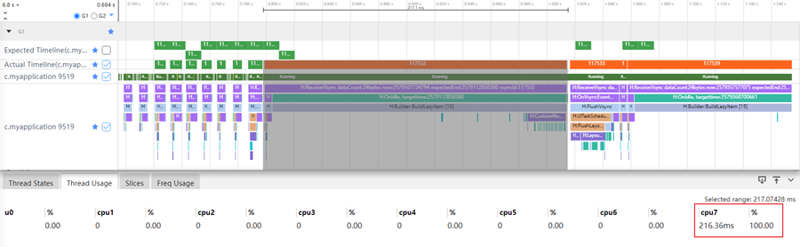

    **图10 Freq Usage频点信息**

    

    出于兼顾高性能、低功耗的需求，多核工程机常采用异构架构设计，根据CPU频率，区分大中小核等。
    
2.	找到 Trace中每一帧耗时的部分，大致定位是App侧问题还是RS侧问题，并结合Trace标签，初步定位原因。  
    从图11中橙色丢帧的位置，可以看到耗时主要在App侧，是BuildLazyItem方法耗时较长导致，可以大致推测，是列表懒加载时，Item里的自定义组件绘制时间较长导致的。

    **图11 应用主线程与RenderService线程的TimeLine**

     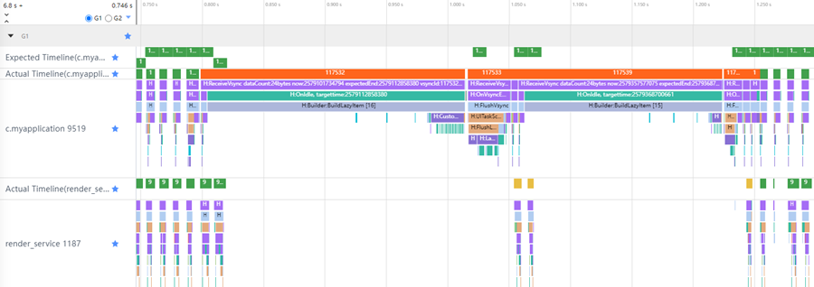

3.	结合cpuProfiler查看ArkTS函数调用栈信息，或其他日志信息，排查应用代码。  
    例如，可以结合DevEco Studio中Frame工具，方便地跳回源码，定位具体是哪一个自定义组件绘制时间较长。

    **图12 Frame工具抓取应用信息图**

     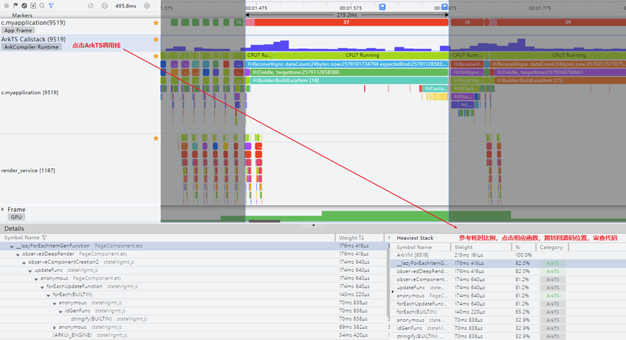

### 解决方案
关于应用的流畅度优化，开发者可以尝试从如下几个方面入手：

- 如果定位是App侧问题，需要进一步审视在UI线程中的处理逻辑，是否过于复杂或低效。  
- 如果定位是RS侧问题，需要进一步审视是否是界面布局过于复杂。  

最终，根据卡顿原因，结合业务场景和API找出适合解决方案，并用Trace等数据验证优化结果。

### 响应速度问题分析思路

这里以冷启动场景的响应速度为例，做具体分析思路的说明。

**信息准备**

**确定问题现象**

用户环境版本、数据量是怎样？用户做了什么操作？体验到了什么现象？是否可以本地复现？

**明确测试标准**

为什么体验到这个现象会觉得性能有问题？衡量响应速度的起点和终点是哪里？

**抓取所需日志信息**

HiTrace、HiPerf、cpuProfiler、常规log等各类可观测性数据。

**问题分析**

分析应用冷启动场景，首先开发者需要简单了解OpenHarmony应用启动流程，如图13所示，大致分为五个阶段：  
**图13 OpenHarmony应用启动流程**

 

1.	AbilityManageService请求AppSpawn创建应用进程。
2.	AppManageService触发应用启动流程、应用进程加载应用包。
3.	AppManageService触发Ability启动流程、应用进程加载Ability资源、根据应用生命周期定义，触发生命周期回调。
4.	创建UI Ability持有的Windows对象。
5.	绘制UI界面首帧。

这五个阶段，对应Trace中的标签信息如下：

| 生命周期	| trace标签| 
| ---	| ---| 
| 创建应用进程	| AppManageService::StartAbility()| 
| 启动应用	| OHOS::AppExecFwk::MainTread::HandleLaunchApplication()| 
| 启动UI Ability	| OHOS::AppExecFwk::MainTread::HandleLaunchAbility()| 
| 创建窗口	| AbilityMonitor::OnWindowStageCreate()| 
| 绘制应用UI界面首诊	| JsRuntime::RunScript() RSMainThread::SendCommands()| 

而实际分析时，开发者可以借助SmartPerf Host提供的AppStartup模板，将各启动阶段自动拆解出来，如图14所示。关于AppStartup模板详细使用方法，请参考《[性能优化工具SmartPerf-Host](performance-optimization-using-smartperf-host.md)》中相关章节。

**图14 AppStartup泳道图展示**

 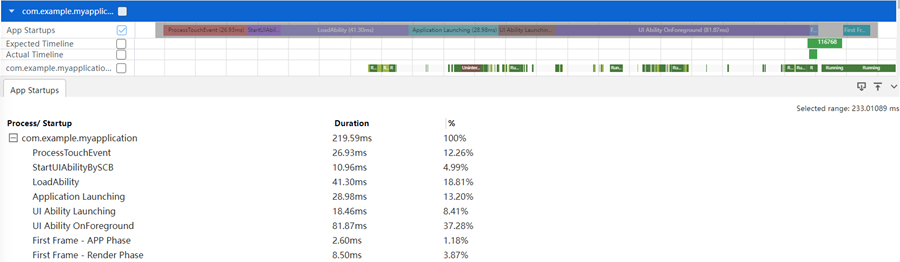

之后，开发者可以结合应用启动各阶段Trace信息，对比应用前一个版本或竞品表现，找出差异点，大致分析是哪阶段时间增加了。

**分析系统耗时点**

如果分析是系统的问题，则查看系统对应的部分，一般情况要优先查看系统是否异常，例如：
- 查看关键任务是否跑在了小核（App线程处于 Running 状态，但是执行耗时变长）。
- 查看频率是否没有跑满 （App线程处于 Running 状态，但是执行耗时变长）。
- 是否是高负载场景：查看 CPU 使用率，是否已经被跑满（App线程有大段的 Runnable 状态）。
- 是否是低内存场景：查看是否低内存 （App线程有大段的 Uninterruptible Sleep 状态）。

**分析应用耗时点**

如果分析是应用的问题，则结合上面耗时的点，查看应用对应的部分，例如：
- 是否某一段方法自身执行耗时比较久（App线程处于 Running 状态）。
- 是否在等待子线程或子进程返回数据（App线程处于 Sleep 状态）。

**解决方案**

一个性能问题点，在复杂应用中，通常会涉及多个问题。首先要把影响最大的因素找出来优化，影响比较小的因素可以先忽略。  
如果判断是系统的原因，首先看应用自身是否可以规避，否则转由系统来处理。  
如果判断是应用自身的原因，可以结合cpuProfiler查看函数调用信息，审查源码，摸索解决之道。  
应用的响应速度优化大多集中在：UI界面、视觉动效、指令逻辑等方面，开发者可以尝试从如下几个方面入手：  

- UI优化：从UI布局渲染角度，加快应用绘制性能，比如减少布局嵌套，减少元素渲染，缓存UI动效等。
- 按需加载优化：根据界面展示或模块加载的需要，延迟加载相关内容，从而减少对首帧页面的性能消耗。
- 并发优化：使用系统并发执行多个任务的能力，减少响应过程中任务执行的整体时间。
- 代码逻辑优化：在相关生命周期中减少冗余、避免耗时，提升执行效率，包括善用数据结构、缓存、优化调整时序等。
- 视觉感知优化：通过交互设计的优化，利用动效动画的形式，在视觉层面提升用户响应速度的感知。
最终，根据延迟原因，结合业务场景和API，找出适合解决方案，并用Trace等数据验证优化结果。

## 总结
文章首先介绍了通过分析Trace的方式，检测应用问题所对应的基础性能指标：  
针对丢帧问题，展示了如何结合Render Service进程下相关线程的Trace标签，估算用户真实感知到的平均帧率。  
针对响应速度问题，展示了如何结合OpenHarmony图形渲染流程相关Trace标签，估算用户真实感知到的点击完成时延。  
文章还从丢帧问题和响应速度问题两个角度，对常见应用性能问题进行分析，总结两个角度共通步骤大致如下：  
1.	信息准备：确定问题现象、明确问题标准、抓取相关可观测性数据。
2.	问题分析：参考相关可观测性数据，先分析排查硬件、系统原因，再分析诊断应用自身原因，大致定位问题。
3.	解决方案：依据问题分析定位，回归代码本身，结合业务场景和API，找出适合解决方案，并使用相关可观测性数据验证优化方案。
