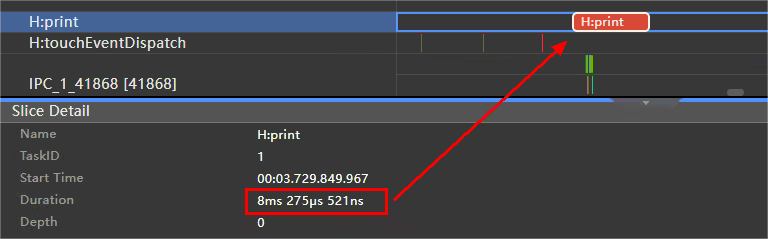
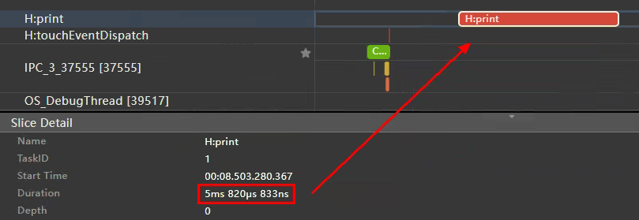

# 应用开发性能优化入门引导

## 概述

在开发应用时，优化应用性能是至关重要的。本文将介绍应用开发过程中常见的一些性能问题，并提供相应的解决方案，配合相关参考示例，帮助开发者解决大部分性能问题。

应用性能分析的方法划分为了**性能分析四要素**，下面将介绍如何使用性能分析四要素，解决应用开发过程中的性能问题。

* **第一要素：合理使用并行化、预加载和缓存**，需要合理地使用并行化、预加载和缓存等方法，例如使用多线程并发、异步并发、Web预加载等能力，提升系统资源利用率，减少主线程负载，加快应用的启动速度和响应速度。

* **第二要素：尽量减少布局的嵌套层数**，在进行页面布局开发时，应该去除冗余的布局嵌套，使用相对布局、绝对定位、自定义布局、Grid、GridRow等扁平化布局，减少布局的嵌套层数，避免系统绘制更多的布局组件，达到优化性能、减少内存占用的目的。

* **第三要素：合理管理状态变量**，应该合理地使用状态变量，精准控制组件的更新范围，控制状态变量关联组件数量，控制对象级状态变量的成员变量关联组件数，减少系统的组件渲染负载，提升应用流畅度。

* **第四要素：合理使用系统接口，避免冗余操作**，应该合理使用系统的高频回调接口，删除不必要的Trace和日志打印，避免注册系统冗余回调，减少系统开销。

## 第一要素：合理使用并行化、预加载和缓存

需要合理地使用并行化、预加载和缓存等方法，提升系统资源利用率，减少主线程负载，加快应用的启动速度和响应速度。

### 使用并行化提升启动速度

自定义组件创建完成之后，在build函数执行之前，将先执行[aboutToAppear](../reference/apis-arkui/arkui-ts/ts-custom-component-lifecycle.md#abouttoappear)生命周期回调函数。此时若在该函数中执行耗时操作，将阻塞UI渲染，增加UI主线程负担。因此，应尽量避免在自定义组件的生命周期内执行高耗时操作。在aboutToAppear生命周期函数内建议只做当前组件的初始化逻辑，对于不需要等待结果的高耗时任务，可以使用多线程处理该任务，通过并发的方式避免主线程阻塞；也可以把耗时操作改为异步并发或延后处理，保证主线程优先处理组件绘制逻辑。

#### 使用多线程执行耗时操作

在日常开发过程中经常会碰到这样的问题：主页的开发场景中有多个Tab页展示不同内容，在首次加载完主页后，切换到第二个Tab页时需要加载和处理网络数据，导致第二个Tab页的页面显示较慢，有较大的完成时延。

碰到此类问题，可以在生命周期aboutToAppear中，使用多线程并发、[高效并发编程](efficient-concurrent-programming.md)、[多线程能力场景化示例实践](multi_thread_capability.md)的方法执行第二个Tab页的网络数据访问解析、数据加载等耗时操作，既可以提前完成数据加载，也不会影响主线程UI绘制和渲染。

使用TaskPool进行耗时操作的示例代码如下：

```typescript
import { IconItemSource } from '../utils/IconItemSource';
import { hiTraceMeter } from '@kit.PerformanceAnalysisKit';
import { loadPicture } from '../utils/IndependentTask';
import { taskpool } from '@kit.ArkTS';

@Component
export struct PageOnePositive {
  @State private text: string = "";
  pathStack: NavPathStack = new NavPathStack();
  @State fontColor: string = '#182431';
  @State selectedFontColor: string = '#007DFF';
  @State currentIndex: number = 0;
  @State selectedIndex: number = 0;
  private controller: TabsController = new TabsController();

  loadPicture(count: number): IconItemSource[] {
    let iconItemSourceList: IconItemSource[] = [];
    // 遍历添加6*count个IconItem的数据
    for (let index = 0; index < count; index++) {
      const numStart: number = index * 6;
      // 此处循环使用6张图片资源
      iconItemSourceList.push(new IconItemSource($r('app.media.bigphoto'), `item${numStart + 1}`));
      iconItemSourceList.push(new IconItemSource($r('app.media.bigphoto'), `item${numStart + 2}`));
      iconItemSourceList.push(new IconItemSource($r('app.media.bigphoto'), `item${numStart + 3}`));
      iconItemSourceList.push(new IconItemSource($r('app.media.bigphoto'), `item${numStart + 4}`));
      iconItemSourceList.push(new IconItemSource($r('app.media.bigphoto'), `item${numStart + 5}`));
      iconItemSourceList.push(new IconItemSource($r('app.media.bigphoto'), `item${numStart + 6}`));
    }
    return iconItemSourceList;
  }

  requestByTaskPool(): void {
    hiTraceMeter.startTrace("responseTime", 1002);
    // 耗时任务,TaskPool执行
    let iconItemSourceList: IconItemSource[] = [];
    // 创建Task
    let lodePictureTask: taskpool.Task = new taskpool.Task(loadPicture, 100000);
    // 执行Task，并返回结果
    taskpool.execute(lodePictureTask).then((res: object) => {
      iconItemSourceList = res as IconItemSource[];
      iconItemSourceList = [];
      // loadPicture方法的执行结果
    })
    hiTraceMeter.finishTrace("responseTime", 1002);
  }

  build() {
    // ...
      Column() {

        Tabs({ barPosition: BarPosition.Start, index: this.currentIndex, controller: this.controller }) {
          // TabContent
          // ...
        }
        // ...
        .onContentWillChange((currentIndex, comingIndex) => {
          if (comingIndex == 1) {
            this.requestByTaskPool();
            let context: Context = this.getUIContext().getHostContext() as Context;
            this.text = context.resourceManager.getStringSync($r('app.string.startup_text2').id);
          }
          return true
        })
        // ...
      }
  }
}
```

其他多线程并发相关文章：

* [利用native的方式实现跨线程调用](native-threads-call-js.md)


#### 使用异步执行耗时操作

问题：在aboutToAppear生命周期函数中，运行了业务数据解析和处理等耗时操作，影响了上一页面点击跳转该页面的响应时延。

可以把耗时操作的执行从同步执行改为异步或者延后执行，[提升应用冷启动速度](improve-application-cold-start-speed.md)，比如使用setTimeOut执行耗时操作，示例如下：

```typescript
import { hilog, hiTraceMeter } from '@kit.PerformanceAnalysisKit';

const DELAYED_TIME: number = 100;
const LARGE_NUMBER: number = 200000;

@Component
export struct PageTwoPositive {
  @State message: string = 'Hello World';
  @State private text: string = "";
  pathStack: NavPathStack = new NavPathStack();
  private count: number = 0;

  aboutToAppear(): void {
    // 在aboutToAppear接口中对耗时间的计算任务进行了异步处理。
    // 耗时操作
    this.computeTaskAsync(); // 异步任务
    let context: Context = this.getUIContext().getHostContext() as Context;
    this.text = context.resourceManager.getStringSync($r('app.string.startup_text4').id);
  }

  computeTask(): void {
    hiTraceMeter.startTrace("responseTime", 1002);
    this.count = 0;
    while (this.count < LARGE_NUMBER) {
      this.count++;
      hilog.info(0x0000, 'count', '%{public}s', JSON.stringify(this.count));
    }
    hiTraceMeter.finishTrace("responseTime", 1002);
  }

  // 运算任务异步处理
  private computeTaskAsync(): void {
    setTimeout(() => {
      // 这里使用setTimeout来实现异步延迟运行
      this.computeTask();
    }, DELAYED_TIME)
  }

  build() {
    // 页面布局 
    // ...
  }
}
```

### 使用预加载提升页面启动和响应速度

应该合理使用系统的预加载能力，例如Web组件的预连接、预加载、预渲染，使用List、Swiper、Grid、WaterFlow等组件的cachedCount属性实现预加载，使用条件渲染实现预加载）等，提升页面的启动和响应速度。

#### 使用Web组件的预连接、预加载、预渲染能力

当遇到Web页面加载慢的场景，可以使用Web组件的预连接、预加载、预渲染能力，使用[Web组件开发性能提升指导](performance-web-import.md)，在应用空闲时间提前进行Web引擎初始化和页面加载，提升下一页面的启动和响应速度。

示例代码如下：

```typescript
import webview from '@ohos.web.webview';

preload() {
  // Web组件引擎初始化
  webview.WebviewController.initializeWebEngine();
  // 启动预连接，连接地址为即将打开的网址
  webview.WebviewController.prepareForPageLoad('https://www.example.com', true, 2);
}
```

#### 使用cachedCount属性实现预加载

推荐在使用List、Swiper、Grid、WaterFlow等组件时，配合使用cachedCount属性实现预加载，详情指导在[WaterFlow高性能开发指导](waterflow_optimization.md)、[Swiper高性能开发指导](swiper_optimization.md)、[Grid高性能开发指导](grid_optimization.md)、[列表场景性能提升实践](list-perf-improvment.md)，示例代码如下所示：

```typescript
  private source: MyDataSource = new MyDataSource();

  build() {
    List() {
      LazyForEach(this.source, item => {
        ListItem() {
          Text("Hello" + item)
            .fontSize(50)
            .onAppear(() => {
              console.info("appear:" + item);
            })
        }
      })
    }.cachedCount(3) // 扩大数值appear日志范围会变大
  }
```

#### 使用条件渲染实现预加载

问题：页面布局复杂度较高，导致跳转该页面的响应时延较高。

可以使用条件渲染的方式进行[合理选择条件渲染和显隐控制](proper-choice-between-if-and-visibility.md)，添加页面的简单骨架图作为默认展示页面，等数据加载完成后再显示最终的复杂布局，加快点击响应速度。

示例代码如下：

```typescript
import skeletonComponent from "./skeletonComponent";
import businessComponent from "./businessComponent";

@State isInitialized: boolean = false;

build() {
  // 当数据未就位时展示骨架图，提升点击响应速度，减少页面渲染时间
  if(!this.isInitialized) {
    // 网络数据未获取前使用骨架图
    skeletonComponent();
  } else {
    // 数据获取后再刷新显示内容
    businessComponent();
  }
}
```

### 使用缓存提升启动速度和滑动帧率

在列表场景中，推荐使用LazyForEach+组件复用+缓存列表项的能力，替代Scroll/ForEach实现滚动列表场景的实现，加快页面启动速度，提升滑动帧率；在一些属性动画的场景下，可以使用renderGroup缓存提升属性动画性能；也可以使用显隐控制对页面进行缓存，加快页面的显示响应速度。

#### 组件复用

应用框架提供了组件复用能力，可复用组件从组件树上移除时，会进入到一个回收缓存区。后续创建新组件节点时，会复用缓存区中的节点，节约组件重新创建的时间。

若业务实现中存在以下场景，并成为UI线程的帧率瓶颈，推荐使用组件复用，具体指导在[组件复用实践](component-recycle.md)、[列表场景性能提升实践](list-perf-improvment.md)、[组件复用总览](component-reuse-overview.md)：

* 列表滚动（本例中的场景）：当应用需要展示大量数据的列表，并且用户进行滚动操作时，频繁创建和销毁列表项的视图可能导致卡顿和性能问题。在这种情况下，使用列表组件的组件复用机制可以重用已经创建的列表项视图，提高滚动的流畅度。
* 动态布局更新：如果应用中的界面需要频繁地进行布局更新，例如根据用户的操作或数据变化动态改变视图结构和样式，重复创建和销毁视图可能导致频繁的布局计算，影响帧率。在这种情况下，使用组件复用可以避免不必要的视图创建和布局计算，提高性能。
* 地图渲染：在地图渲染这种场景下，频繁创建和销毁数据项的视图可能导致性能问题。使用组件复用可以重用已创建的视图，只更新数据的内容，减少视图的创建和销毁，能有效提高性能。

示例代码如下：

```typescript
// xxx.ets
class MyDataSource implements IDataSource {
  private dataArray: string[] = [];
  private listener: DataChangeListener | undefined;
  // ...
}

@Entry
@Component
struct MyComponent {
  private data: MyDataSource = new MyDataSource();

  aboutToAppear() {
    for (let i = 0; i < 1000; i++) {
      this.data.pushData(i.toString());
    }
  }

  build() {
    List({ space: 3 }) {
      LazyForEach(this.data, (item: string) => {
        ListItem() {
          ReusableChildComponent({ item: item })
        }
      }, (item: string) => item)
    }
    .width('100%')
    .height('100%')
  }
}

@Reusable
@Component
struct ReusableChildComponent {
  @State item: string = '';
  // 复用时触发的生命周期
  aboutToReuse(params: ESObject) {
    this.item = params.item;
  }

  build() {
    Row() {
      Text(this.item)
        .fontSize(20)
        .margin({ left: 10 })
    }.margin({ left: 10, right: 10 })
  }
}
```

#### 使用renderGroup缓存提升属性动画性能

页面响应时，可能大量使用属性动画和转场动画，当复杂度达到一定程度之后，就有可能出现卡顿的情况。[renderGroup](reasonable-using-renderGroup.md)是组件通用方法，它代表了渲染绘制的一个组合。

具体原理是在首次绘制组件时，若组件被标记为启用renderGroup状态，将对组件及其子组件进行离屏绘制，将绘制结果合并保存到缓存中。此后当需要重新绘制相同组件时，就会优先使用缓存而不必重新绘制了，从而降低绘制负载，进而加快响应速度。

示例代码如下：

```typescript
// Index.ets
import { IconItem } from './IconItem';

// IconItem相关数据
class IconItemSource {
  image: string | Resource = ''
  text: string | Resource = ''

  constructor(image: string | Resource = '', text: string | Resource = '') {
    this.image = image;
    this.text = text;
  }
}

@Entry
@Component
struct Index {
  private iconItemSourceList: IconItemSource[] = [];

  aboutToAppear() {
    // 遍历添加IconItem的数据
    this.iconItemSourceList.push(
      new IconItemSource($r('app.media.img1'), `label1`),
      new IconItemSource($r('app.media.img2'), `label2`),
      new IconItemSource($r('app.media.img3'), `label3`)
    );
  }

  build() {
    Column() {
      // IconItem放置在grid内
      GridRow() {
        ForEach(this.iconItemSourceList, (item: IconItemSource) => {
          GridCol() {
            IconItem({ image: item.image, text: item.text })
              .transition(TransitionEffect.scale({ x: 0, y: 0 })
                  .animation({ delay: 1000, duration: 1000 })
                  .combine(TransitionEffect.rotate({ z: 1, angle: 180 })
                  .animation({ duration: 1000 }))
              )
          }
        })
      }
    }
  }
}

// IconItem.ets
@Component
export struct IconItem {
  renderGroupFlag: boolean = false;
  image: string | Resource = '';
  text: string | Resource = '';
    
  build() {
    Flex({
      direction: FlexDirection.Column,
      justifyContent: FlexAlign.Center,
      alignContent: FlexAlign.Center
    }) {
      Image(this.image)
      Text(this.text)
      // ...     
    }
    // 在IconItem内开启renderGroup
    .renderGroup(true)
  }
}
```

#### 使用显隐控制进行页面缓存

控制元素显示与隐藏是一种常见的场景，使用Visibility.None、if条件判断等都能够实现该效果。其中if条件判断控制的是组件的创建、布局阶段，Visibility属性控制的是元素在布局阶段是否参与布局渲染。使用时如果使用的方式不当，将引起性能上的问题。
如果会频繁响应显示与隐藏的交互效果，建议使用切换Visibility.None和Visibility.Visible来[合理控制元素显示与隐藏](proper-choice-between-if-and-visibility.md)，在组件无需展示的时候进行缓存，提高性能。

示例代码如下：

```typescript
@State isVisible: boolean = true;

build() {
  Column() {
    Button("Switch visible and hidden").onClick(() => {
        this.isVisible = !this.isVisible;
    })
    Stack() {
      Scroll() {
        Column() {
          Image($r('app.media.icon'))
        }
      }.visibility(this.isVisible ? Visibility.Visible : Visibility.None)// 使用显隐控制切换，不会频繁创建与销毁组件
    }  
  }  
}
```

## 第二要素：尽量减少布局的嵌套层数

在进行页面布局开发时，应该去除冗余的布局嵌套，使用相对布局、绝对定位、自定义布局、Grid、GridRow等扁平化布局，减少布局的嵌套层数，避免系统绘制更多的布局组件，达到[优化布局性能](reduce-view-nesting-levels.md)、减少内存占用的目的。

### 移除冗余节点

应该删除冗余的布局嵌套，例如build最外层的无用容器嵌套、无用的Stack或Column嵌套等，减少布局层数。

#### 删除无用的Stack/Column/Row嵌套

例如可能会在Row容器包含一个同样也是Row容器的子级。这种嵌套实际是多余的，并且会给布局层次结构造成不必要的开销。示例代码如下：

```typescript
// 反例
Row() {
  Row() {
    Text()
    Text()
  }
  Text()
}

// 正例
Row() {
  Text()
  Text()
  Text()
}
```

#### 删除build函数中最外层无用容器嵌套

在开发过程中，布局的实现往往嵌套使用大量的自定义组件，build中冗余的最外层无用容器会大大增强嵌套层级，应该删除。

反例代码如下：

```typescript
@Entry
@Component
struct ComponentA {
  build() {
    Column() {
      ComponentB();
    }
  }
}

@Component
struct ComponentB {
  build() {
    Column() {
      Text('');
    }
  }
}
```

正例代码如下：

```typescript
@Entry
@Component
struct ComponentA {
  build() {
    Column() {
      ComponentB();
    }
  }
}

@Component
struct ComponentB {
  build() {
    Text('');
  }
}
```

### 使用扁平化布局减少节点数

#### 使用Column/Row替代Flex构建线性布局

由于Flex本身带来的二次布局的影响，Flex的性能明显低于Column和Row容器，因此推荐使用Column/Row替代Flex构建线性布局，具体指导在[Flex布局性能提升使用指导](flex-development-performance-boost.md)。

反例代码如下：

```typescript
@Entry
@Component
struct MyComponent {
  build() {
    Flex({ direction: FlexDirection.Column }) {
      Flex().width(300).height(200).backgroundColor(Color.Pink)
      Flex().width(300).height(200).backgroundColor(Color.Yellow)
      Flex().width(300).height(200).backgroundColor(Color.Grey)
    }
  }
}
```

正例代码如下：

```typescript
@Entry
@Component
struct MyComponent {
  build() {
    Column() {
      Row().width(300).height(200).backgroundColor(Color.Pink)
      Row().width(300).height(200).backgroundColor(Color.Yellow)
      Row().width(300).height(200).backgroundColor(Color.Grey)
    }
  }
}
```

#### 使用Flex、List、Grid、RelativeContainer、绝对布局和自定义布局等构建复杂布局

复杂布局提供了场景化的能力，[优化布局性能](reduce-view-nesting-levels.md)可解决一种或者多种布局场景：

* 使用Flex构建弹性布局；
* List既具备线性布局的特点，同时支持懒加载和滑动的能力；
* Grid/GridItem提供了宫格布局的能力，同时也支持懒加载和滑动能力；
* RelativeContainer是一种相对布局，通过描述各个内容组件间相互关系来指导内容元素的布局过程，可从横纵两个方面进行布局描述，是一种二维布局算法。

反例代码如下：

```typescript
@Entry
@Component
struct AspectRatioExample12 {
    @State children: number[] = Array.from(Array<number>(900), (v, k) => k);

    build() {
      Scroll() {
        Grid() {
          ForEach(this.children, (item: number) => {
            GridItem() {
              Stack() {  
                Stack() {  
                  Stack() {  
                    Text(item.toString())  
                  }.size({ width: "100%"})  
                }.backgroundColor(Color.Yellow)  
              }.backgroundColor(Color.Pink)  
            }  
          }, (item: number) => item.toString())  
        }  
        .columnsTemplate('1fr 1fr 1fr 1fr')  
        .columnsGap(0)  
        .rowsGap(0)  
        .size({ width: "100%", height: "100%" })  
    }  
  }  
}
```

正例代码如下：

```typescript
@Entry  
@Component  
struct AspectRatioExample11 {  
  @State children: number[] = Array.from(Array<number>(900), (v, k) => k);  

  build() {  
    Scroll() {  
      Grid() {  
        ForEach(this.children, (item: number) => {  
          GridItem() {  
            Text(item.toString())  
          }.backgroundColor(Color.Yellow)  
        }, (item: number) => item.toString())  
      }  
      .columnsTemplate('1fr 1fr 1fr 1fr')  
      .columnsGap(0)  
      .rowsGap(0)  
      .size({ width: "100%", height: "100%" })  
    }  
  }  
}
```

## 第三要素：合理管理状态变量

应该合理地使用状态变量，[精准控制组件的更新范围](precisely-control-render-scope.md)，控制状态变量关联组件数量上限，控制对象级状态变量的成员变量关联组件数，减少系统的组件渲染负载，提升应用流畅度。

### 精准控制组件的更新范围

在复杂页面开发的场景下，精准控制组件更新的范围对提高应用运行性能尤为重要。应该避免状态变量的滥用引起的容器组件的刷新，进而影响帧率。

#### 使用指定宽高的容器限制刷新范围

当在一个同时指定宽高的容器里改变容器内部的布局，那么只会在该容器内部做布局和测量更新，不会扩散影响到容器外面的组件。

反例代码如下：

```typescript
struct StackExample {
  @State isVisible: boolean = true;
  private data: number[] = [];

  aboutToAppear() {
    for (let i: number = 0; i < Constants.IMAGE_TOTAL_NUM; i++) {
      this.data.push(i);
    }
  }

  build() {
    Column() {
      Button('Switch Hidden and Show').onClick(() => {
        this.isVisible = !this.isVisible;
      })

      Stack() {
        if (this.isVisible) {
          Text('New Page').width(100).height(30).backgroundColor(0xd2cab3)
        }
      }.width(100) // 本案例以Stack容器为例，只指定了宽，会触发父容器组件重新布局计算，引起ForEach中文本测量。

      ForEach(this.data, (item: number) => { // 由于Stack容器没有同时指定宽高，会扩散影响到这一层，引起Text的测量更新。
        Text(`Item value: ${item}`)
          .fontSize($r('app.integer.font_size_20'))
          .width($r('app.string.layout_100_percent'))
          .textAlign(TextAlign.Center)
      }, (item: number) => item.toString())
    }
  }
}
```

正例代码如下：

```typescript
struct StackExample2 {
  @State isVisible: boolean = true;
  private data: number[] = [];

  aboutToAppear() {
    for (let i: number = 0; i < Constants.IMAGE_TOTAL_NUM; i++) {
      this.data.push(i);
    }
  }

  build() {
    Column() { // 父容器
      Button('Switch Hidden and Show').onClick(() => {
        this.isVisible = !this.isVisible;
      })

      Stack() {
        if (this.isVisible) {
          Text('New Page').width(100).height(30).backgroundColor(0xd2cab3)
        }
      }.width(100).height(30) // 在指定宽高的Stack容器内，内部的Text组件变化只会在容器内部做布局和测量更新，不会影响到容器外ForEach中的Text组件。

      ForEach(this.data, (item: number) => { // Stack容器指定了宽高，不会影响到这一层兄弟节点
        Text(`Item value: ${item}`)
          .fontSize($r('app.integer.font_size_20'))
          .width($r('app.string.layout_100_percent'))
          .textAlign(TextAlign.Center)
      }, (item: number) => item.toString())
    }
  }
```
#### 减少不必要的参数层次传递

@State+@Prop、@State+@Link、@State+@Observed+@ObjectLink三种方案的实现方式是逐级向下传递状态，当共享状态的组件间层级相差较大时，会出现状态层层传递的现象。对于没有使用该状态的中间组件而言，这是“额外的消耗”。因此，对于跨越多层的状态变量传递，使用@Provide+@Consume方案更为合理。

反例代码如下：

```typescript
// 父组件
@Component
struct componentParent{
  @State data: Data = {};

  aboutToAppear() {
    // 获取子组件数据
    this.data = getData();
  }

  build() {
    Column() {
      componentSon({ data: this.data })
    }
  }
}

// 子组件
@Component
struct componentSon{
  // 获取传递参数
  @Prop data: Data;

  build() {
    Column() {
      Text(data.text)
      componentGrandSon({ data: this.data })
    }
  }
}

@Component
struct componentGrandSon{
  // 获取传递参数
  @Prop data: Data;

  build() {
    Column() {
      Text(data.text)
    }
  }
}
```

正例代码如下：

```typescript
// 父组件
@Component
struct componentParent{
  @Provide('data') data: Data = {};

  aboutToAppear() {
    // 获取子组件数据
    this.data = getData()
  }

  build() {
    Column() {
      componentSon({ data: this.data })
    }
  }
}

// 子组件
@Component
struct componentSon{
  // 获取传递参数
  @Consume("data") data: Data;

  build() {
    Column() {
      Text(data.text)
      componentGrandSon({ data: this.data })
    }
  }
}

@Component
struct componentGrandSon{
  // 获取传递参数
  @Consume("data") data: Data;

  build() {
    Column() {
      Text(data.text)
    }
  }
}
```

#### 避免滥用@Provide+@Consume

在父子组件关联的场景下，@Provide+@Consume开销要大于@State+@Prop/@Link，因此在该场景下推荐使用@State+@Prop/@Link的组合。

反例代码如下：

```typescript
// 父组件
@Component
struct componentParent{
  @Provide("data") data: Data = {};

  aboutToAppear() {
    // 获取子组件数据
    this.data = getData();
  }

  build() {
    Column() {
      componentSon()
    }
  }
}

// 子组件
@Component
struct componentSon{
  // 获取传递参数
  @Consume("data") data: Data;

  build() {
    Column() {
      Text(data.text)
    }
  }
}
```

正例代码如下：

```typescript
// 父组件
@Component
struct componentParent{
  @State data:Data = {};

  aboutToAppear() {
    // 获取子组件数据
    this.data = getData();
  }

  build() {
    Column() {
      componentSon({ data: this.data })
    }
  }
}

// 子组件
@Component
struct componentSon{
  // 获取传递参数
  @Prop data:Data;

  build() {
    Column() {
      Text(data.text)
    }
  }
}
```

### 精准控制状态变量关联组件数量

应该控制状态变量关联的组件数量，如果一个状态关联过多的组件，当这个变量更新时会引起过多的组件重新绘制渲染，建议关联数量限制在20个以内，达到[精准控制组件的更新范围](precisely-control-render-scope.md)。

#### 控制状态变量关联组件数量

反例代码如下：

```typescript
@Observed
class Translate {
  translateX: number = 20;
}
@Component
struct Title {
  @ObjectLink translateObj: Translate;
  build() {
    Row() {
      Image($r('app.media.icon'))
        .translate({
          x: this.translateObj.translateX // this.translateObj.translateX used in two component both in Row
        })
      Text("Title")
        .translate({
          x: this.translateObj.translateX
        })
    }
  }
}
@Entry
@Component
struct Page {
  @State translateObj: Translate = new Translate();
  build() {
    Column() {
      Title({
        translateObj: this.translateObj
      })
      Stack() {
      }
      .translate({
        x:this.translateObj.translateX // this.translateObj.translateX used in two components both in Column
      })
      Button("move")
        .translate({
          x: this.translateObj.translateX
        })
        .onClick(() => {
          this.getUIContext().animateTo({
            duration: 50
          }, () => {
            this.translateObj.translateX = (this.translateObj.translateX + 50) % 150;
          })
        })
    }
  }
}
```

正例代码如下：

```typescript
@Observed
class Translate {
  translateX: number = 20;
}
@Component
struct Title {
  build() {
    Row() {
      Image($r('app.media.icon'))
      Text("Title")
    }
  }
}
@Entry
@Component
struct Page1 {
  @State translateObj: Translate = new Translate();
  build() {
    Column() {
      Title()
      Stack() {
      }
      Button("move")
        .onClick(() => {
          this.getUIContext().animateTo({
            duration: 50
          }, () => {
            this.translateObj.translateX = (this.translateObj.translateX + 50) % 150;
          })
        })
    }
    .translate({ // the component in Column shares the same property translate
      x: this.translateObj.translateX
    })
  }
}
```

#### 控制对象级状态变量成员数量

应该控制对象级状态变量的成员变量关联的组件数量。开发者封装一个数据结构类用于进行状态变量关联时，应该避免过多的成员变量关联大量ArkUI组件，这种情况下，当这个大对象的一个成员变量更新时，会导致所有关联这个大对象的组件都同时进行刷新，造成不必要的性能损耗，从而影响帧率。

反例代码如下：

```typescript
@Observed
class AnimationParams {
  translateX: number = 0;
  translateY: number = 0;
  alpha: number = 1;
  rotationX: number = 0;
  rotationY: number = 0;
  centerX: number = 0;
  centerY: number = 0;
  angle: number = 0;
  scaleX: number = 1;
  scaleY: number = 1;
}

@Entry
@Component
struct Page {
  @State animationParam: AnimationParams = new AnimationParams();

  build() {
    Column() {
      Row() {
        Image($r('app.media.startIcon'))
          .translate({
            x: this.animationParam.translateX,
            y: this.animationParam.translateY
          })
          .rotate({
            x: this.animationParam.rotationX,
            y: this.animationParam.translateY,
            centerX: this.animationParam.centerX,
            centerY: this.animationParam.centerY,
            angle: this.animationParam.angle
          })
          .opacity(this.animationParam.alpha)
          .scale({
            x: this.animationParam.scaleX,
            y: this.animationParam.scaleY,
            centerX: this.animationParam.centerX,
            centerY: this.animationParam.centerY
          })
          .animation({
            duration: 3000
          })
      }

      Button('点击播放动画')
        .onClick(() => {
          this.animationParam.translateX = 300;
          this.animationParam.translateY = 200;
          this.animationParam.rotationX = 90;
          this.animationParam.rotationY = 90;
          this.animationParam.centerX = 20;
          this.animationParam.centerY = 20;
          this.animationParam.angle = 270;
          this.animationParam.alpha = 0.5;
          this.animationParam.scaleX = 3;
          this.animationParam.scaleY = 3;
        })
    }
  }
}
```

正例代码如下：

```typescript
@Observed
class RotationAnimationParams {
  rotationX: number = 0;
  rotationY: number = 0;
  centerX: number = 0;
  centerY: number = 0;
  angle: number = 0;
}

@Observed
class TranslateAnimationParams {
  translateX: number = 0;
  translateY: number = 0;
}

@Observed
class AlphaAnimationParams {
  alpha: number = 1;
}

@Observed
class ScaleAnimationParams {
  scaleX: number = 1;
  scaleY: number = 1;
  centerX: number = 0;
  centerY: number = 0;
}

@Entry
@Component
struct Page {
  @State rotationAnimation: RotationAnimationParams = new RotationAnimationParams();
  @State translateAnimation: TranslateAnimationParams = new TranslateAnimationParams();
  @State alphaAnimation: AlphaAnimationParams = new AlphaAnimationParams();
  @State scaleAnimation: ScaleAnimationParams = new ScaleAnimationParams();

  build() {
    Column() {
      Row() {
        Image($r('app.media.startIcon'))
          .translate({
            x: this.translateAnimation.translateX,
            y: this.translateAnimation.translateY
          })
          .rotate({
            x: this.rotationAnimation.rotationX,
            y: this.rotationAnimation.rotationY,
            centerX: this.rotationAnimation.centerX,
            centerY: this.rotationAnimation.centerY,
            angle: this.rotationAnimation.angle
          })
          .opacity(this.alphaAnimation.alpha)
          .scale({
            x: this.scaleAnimation.scaleX,
            y: this.scaleAnimation.scaleY,
            centerX: this.scaleAnimation.centerX,
            centerY: this.scaleAnimation.centerY
          })
          .animation({
            duration: 3000
          })
      }

      Button('点击播放动画')
        .onClick(() => {
          this.rotationAnimation.rotationX = 90;
          this.rotationAnimation.rotationY = 90;
          this.rotationAnimation.centerX = 20;
          this.rotationAnimation.centerY = 20;
          this.rotationAnimation.angle = 270;

          this.translateAnimation.translateX = 300;
          this.translateAnimation.translateY = 200;

          this.alphaAnimation.alpha = 0.5;

          this.scaleAnimation.scaleX = 3;
          this.scaleAnimation.scaleY = 3;
          this.scaleAnimation.centerX = 20;
          this.scaleAnimation.centerY = 20;
        })
    }
  }
}
```

### 避免不必要的创建和读取状态变量

避免不必要的创建和读取状态变量，减少性能损耗。

#### 删除冗余的状态变量标记

状态变量的管理有一定的开销，应在合理场景使用，普通的变量用状态变量标记可能会导致性能劣化。

反例代码如下：

```typescript
@Observed
class Translate {
  translateX: number = 20;
}

@Entry
@Component
struct UnnecessaryState1 {
  @State translateObj: Translate = new Translate(); // 变量translateObj没有关联任何UI组件，不应该定义为状态变量
  @State buttonMsg: string = 'I am button'; // 变量buttonMsg没有关联任何UI组件，不应该定义为状态变量

  build() {
  }
}
```
以上示例中变量translateObj、buttonMsg没有关联任何UI组件，不应该定义为状态变量，否则读写状态变量都会影响性能。

```typescript
@Observed
class Translate {
  translateX: number = 20;
}

@Entry
@Component
struct UnnecessaryState2 {
  @State buttonMsg: string = 'I am button';

  build() {
    Column() {
      Button(this.buttonMsg) // 这里只是读取变量buttonMsg的值，没有任何写的操作
    }
  }
}
```
以上示例中变量buttonMsg仅有读取操作，没有修改过，没有修改过的状态变量不应该定义为状态变量，否则读状态变量会影响性能。

正例代码如下：

```typescript
@Observed
class Translate {
  translateX: number = 20;
}

@Entry
@Component
struct NecessaryState {
  @State translateObj: Translate = new Translate(); // 同时存在读写操作，并关联了Button组件，推荐使用状态变量
  buttonMsg: string = 'I am button'; // 仅读取变量buttonMsg的值，没有任何写的操作，直接使用一般变量即可

  build() {
    Column() {
      Button(this.buttonMsg)
        .onClick(() => {
          this.getUIContext().animateTo(
            {
              duration: 50
            }, () => {
            this.translateObj.translateX = (this.translateObj.translateX + 50) % 150; // 点击时给变量translateObj重新赋值
          })
        })
    }.translate({
      x:this.translateObj.translateX // 读取translateObj中的值
    })
  }
}
```
没有关联任何UI组件的状态变量和没有修改过的状态变量不应该定义为状态变量，直接使用一般变量即可，否则会影响性能。

#### 避免在For/while等循环函数中重复读取状态变量

状态变量的读取耗时远大于普通变量的读取耗时，因此要避免重复读取状态变量，而是应该放在循环外面读取，例如在打印For/while循环中打印状态变量的日志信息。

反例代码：

```typescript
import hiTraceMeter from '@ohos.hiTraceMeter';

@Entry
@Component
struct Page {
  @State message: string = '';

  build() {
    Column() {
      Button('点击打印日志')
        .onClick(() => {
          hiTraceMeter.startTrace('print', 1);
          for (let i = 0; i < 10; i++) {
            console.info(this.message);
          }
          hiTraceMeter.finishTrace('print', 1);
        })
    }
  }
}
```
抓取Trace图如下：    
  

正例代码：

```typescript
import hiTraceMeter from '@ohos.hiTraceMeter';

@Entry
@Component
struct Page {
  @State message: string = '';

  build() {
    Column() {
      Button('点击打印日志')
        .onClick(() => {
          hiTraceMeter.startTrace('print', 1); 
          let logMessage: string = this.message;
          for (let i = 0; i < 10; i++) {
            console.info(logMessage);
          }
          hiTraceMeter.finishTrace('print', 1);
        })
    }
  }
}
```
抓取Trace图如下：  


由此可见，使用普通变量代替状态变量在For/while循环中读取，可以减少耗时，因此在For/while循环中频繁读取变量时，可使用普通变量代替状态变量。
## 第四要素：合理使用系统接口，避免冗余操作

应该合理使用系统的高频回调接口，删除不必要的Trace和日志打印，避免冗余操作，减少系统开销，[避免开发过程中的冗余操作](avoiding-redundant-operations.md)。

### 避免在系统高频回调用进行冗余和耗时操作

应该避免在onDidScroll、onAreaChange等系统高频的回调接口中进行冗余和耗时操作，这些接口在系统的每一帧绘制中都会执行回调操作，因此在这些接口中进行冗余和耗时操作会大量消耗系统资源，影响应用运行性能。

#### 避免在系统高频回调用打印Trace

Trace的打印是会额外消耗系统性能的，因此应该避免在这些系统高频回调接口中打印Trace，示例代码如下：

```typescript
// 反例
import { hiTraceMeter } from '@kit.PerformanceAnalysisKit';

@Component
struct NegativeOfOnDidScroll {
  private arr: number[] = [1, 2, 3, 4, 5, 6, 7, 8, 9, 10];

  build() {
    Scroll() {
      ForEach(this.arr, (item: number) => {
        Text("ListItem" + item)
          .width("100%")
          .height("100%")
      }, (item: number) => item.toString())
    }
    .width('100%')
      .height('100%')
      .onDidScroll(() => {
        hiTraceMeter.startTrace("ScrollSlide", 1002);
        // 业务逻辑
        // ...
        hiTraceMeter.finishTrace("ScrollSlide", 1002);
      })
  }
}

// 正例
@Component
struct PositiveOfOnDidScroll {
  private arr: number[] = [1, 2, 3, 4, 5, 6, 7, 8, 9, 10];

  build() {
    Scroll() {
      List() {
        ForEach(this.arr, (item: number) => {
          ListItem() {
            Text("TextItem" + item)
          }
          .width("100%")
          .height(100)
        }, (item: number) => item.toString())
      }
      .divider({ strokeWidth: 3, color: Color.Gray })
    }
    .width('100%')
    .height('100%')
    .onDidScroll(() => {
      // 业务逻辑
      // ...
    })
  }
}
```

#### 避免在系统高频回调用打印日志

日志的打印是会额外消耗系统性能的，特别是有些日志还读取了状态变量的信息，会加剧资源开销，因此应该避免在这些系统高频回调接口中打印日志，示例代码如下：

```typescript
// 反例
import { hilog } from '@kit.PerformanceAnalysisKit';

@Component
struct NegativeOfOnDidScroll {
  private arr: number[] = [1, 2, 3, 4, 5, 6, 7, 8, 9, 10];

  build() {
    Scroll() {
      List() {
        ForEach(this.arr, (item: number) => {
          ListItem() {
            Text("TextItem" + item)
          }
          .width("100%")
          .height(100)
        }, (item: number) => item.toString())
      }
      .divider({ strokeWidth: 3, color: Color.Gray })
    }
    .width('100%')
    .height('100%')
    .onDidScroll(() => {
      hilog.info(1002, 'Scroll', 'TextItem');
      // 业务逻辑
      // ...
    })
  }
}

// 正例
@Component
struct PositiveOfOnDidScroll {
  private arr: number[] = [1, 2, 3, 4, 5, 6, 7, 8, 9, 10];

  build() {
    Scroll() {
      List() {
        ForEach(this.arr, (item: number) => {
          ListItem() {
            Text("TextItem" + item)
          }
          .width("100%")
          .height(100)
        }, (item: number) => item.toString())
      }
      .divider({ strokeWidth: 3, color: Color.Gray })
    }
    .width('100%')
    .height('100%')
    .onDidScroll(() => {
      // 业务逻辑
      // ...
    })
  }
}
```

### 删除冗余Trace和日志打印

Trace和日志打印会比较消耗系统性能，因此应该避免冗余的Trace和日志打印。推荐在Release版本中，尽量删除所有Trace信息，删除Debug日志，减少额外的系统开销。

#### 在Release版本中删除Trace

Trace会比较消耗系统性能，建议在Release版本删除Trace打印。

反例代码如下：

```typescript
@Component
struct NegativeOfTrace {
  aboutToAppear(): void {
    hitrace.startTrace("HITRACE_TAG_APP", 1003);
    // 业务代码
    // ...
    hitrace.finishTrace("HITRACE_TAG_APP", 1003);
  }
  build() {
    // 业务代码
    // ...
  }
}
```

正例代码如下：

```typescript
@Component
struct PositiveOfTrace {
  aboutToAppear(): void {
    // 业务代码
    // ...
  }
  build() {
    // 业务代码
    // ...
  }
}
```

#### 在Release版本中删除Debug日志

虽然在Release版本中不会打印debug级别日志，但是如果在日志的入参中进行了参数拼接，字符串拼接的逻辑还会执行，会有冗余开销，因此为了[避免开发过程中的冗余操作](avoiding-redundant-operations.md)，建议在Release版本删除Debug日志打印。

反例代码如下：

```typescript
@Component
struct NegativeOfDebug {
  @State string1: string = 'a';
  @State string2: string = 'b';

  aboutToAppear(): void {
    hilog.debug(1004, 'Debug', (this.string1 + this.string2));
    // 业务代码
    // ...
  }

  build() {
    // 业务代码
    // ...
  }
}
```

正例代码如下：

```typescript
@Component
struct PositiveOfDebug {
  aboutToAppear(): void {
    // 业务代码
    // ...
  }
  build() {
    // 业务代码
    // ...
  }
}
```

### 避免设置冗余系统回调监听

冗余的系统回调监听，会额外消耗系统开销去做计算和函数回调消耗。比如设置了onAreaChange，就算回调中没有任何逻辑，系统也会在C++侧去计算该组件的大小和位置变化情况，并且把结果回调到TS侧，额外消耗了系统开销。

反例代码如下：

```typescript
@Component
struct NegativeOfOnClick {
  build() {
    Button('Click', { type: ButtonType.Normal, stateEffect: true })
      .onClick(() => {
        hitrace.startTrace("ButtonClick", 1004);
        hilog.info(1004, 'Click', 'ButtonType.Normal');
        hitrace.finishTrace("ButtonClick", 1004);
        // 业务代码
        // ...
      })
      .onAreaChange((oldValue: Area, newValue: Area) => {
        // 无任何代码
      })
  }
}
```

正例代码如下：

```typescript
@Component
struct PositiveOfOnClick {
  build() {
    Button('Click', { type: ButtonType.Normal, stateEffect: true })
      .onClick(() => {
        // 业务代码
        // ...
      })
  }
}
```

## 使用性能工具分析和定位问题

学会合理使用工具进行问题分析和定位，提升问题解决效率。

### 学会使用IDE的Profier工具定位问题

通过使用Profier工具，定位应用开发过程中的各种性能问题，详细的使用方法可以参考文章：[性能分析工具CPU Profiler](application-performance-analysis.md)。

### 使用SmartPerf-Host分析应用性能

[SmartPerf-Host](performance-optimization-using-smartperf-host.md)是一款深入挖掘数据、细粒度展示数据的性能功耗调优工具，可采集CPU调度、频点、进程线程时间片、堆内存、帧率等数据，采集的数据通过泳道图清晰地呈现给开发者，同时通过GUI以可视化的方式进行分析。工具当前为开发者提供了五个分析模板，分别是帧率分析、CPU/线程调度分析、应用启动分析、TaskPool分析、动效分析。

### 使用状态变量组件定位工具分析状态变量关联信息

开发者可以使用[状态变量组件定位工具](state_variable_dfx_pratice.md)获取状态管理相关信息，例如自定义组件拥有的状态变量、状态变量的同步对象和关联组件等，了解状态变量影响UI的范围，写出高性能应用代码。

### 使用常用trace使用指导协助定位性能问题

本文旨在介绍[常用trace使用指导](common-trace-using-instructions.md)，解释它们的含义和用途，并阐述如何通过这些Trace来识别潜在的性能问题。同时，还将详细介绍Trace的工作原理，帮助开发者更好地理解这些Trace及如何实现性能数据的采集和分析。通过本文的阅读，开发者将对Trace有一个深入的了解，为应用程序性能优化提供有力支持。