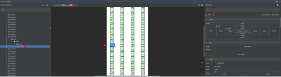
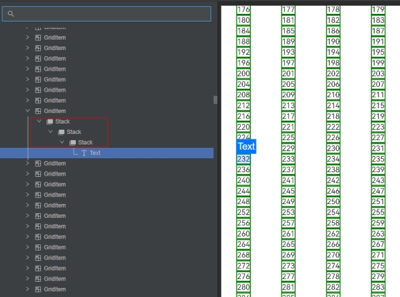

# 页面布局检查器ArkUI Inspector使用指导

DevEco Studio内置ArkUI Inspector工具，开发者可以使用ArkUI Inspector，在DevEco Studio上查看应用在真机上的UI显示效果。利用ArkUI Inspector工具，开发者可以快速定位布局问题或其他UI相关问题，同时也可以观察和了解不同组件之间的布局关系和属性，学习如何通过布局属性来控制组件的显示方式。

## 使用约束

已通过USB连接设备并在设备上打开需要调试的设备。

仅在应用为debug编译模式时使用。

仅支持OpenHarmony API 9及以上版本的Stage工程。

## 场景示例

示例代码使用Grid组件来实现网格布局，在子组件Text组件的外层嵌套了3层Stack容器。

```ts
@Entry
@Component
struct ArkUIInspectorExample {
  @State children: Number[] = Array.from(Array(900), (_: undefined, k: number) => k);

  build() {
    Scroll() {
      Grid() {
        ForEach(this.children, (item: Number) => {
          GridItem() {
            Stack() {
              Stack() {
                Stack() {
                  Text(item.toString()).border({ width: 2, color: Color.Green })
                }
              }
            }
          }
        }, (item: Number) => item.toString())
      }
      .columnsTemplate('1fr 1fr 1fr 1fr')
      .columnsGap(0)
      .rowsGap(0)
      .size({ width: "100%", height: "100%" })
    }
  }
}
```

## 如何使用页面布局检查器

以DevEco Studio 4.0.0.400版本为例，在DevEco Studio菜单栏上单击***\*View\**** > ***\*Tool Windows\**** >***\*ArkUI Inspector\****，或者在DevEco Studio底部工具栏单击

打开ArkUI Inspector工具，如下图所示：



1. 进程选择栏，选择已经在设备上打开的应用进程。点击右侧“Refresh”按钮以刷新当前页面快照，请注意，设备需要处于亮屏状态并且应用需要处于前台运行。

2. 页面组件树区，用于查看组件嵌套状态，当前显示为Text组件。

3. 页面快照区，点击Text组件后，页面组件列表跳转至选中的Text组件。点击右下角“Pan Screen”按钮以拖移屏幕；点击 、 按钮来缩放页面；点击“Zoom to Fit Screen”按钮使页面居中并适应屏幕大小。

4. 组件详情区，展示当前选中Text组件的属性信息，包括组件的坐标、布局信息（Spacing）、尺寸信息（Size）、边框信息（Border）、背景信息（Background）、蒙版信息（Effect）、所有其他属性（All Attributes）。如需精准查找单个属性，可通过页面上方搜索栏进行搜索。

## 问题分析

从页面布局检查器中可以清晰看出，Text组件外部有3层冗余的Stack容器，属于嵌套过多场景。



## 代码优化

针对在页面布局检查器中发现的冗余Stack容器问题，在应用代码中删除多余的Stack容器。

```ts
@Entry
@Component
struct ArkUIInspectorExample {
  @State children: Number[] = Array.from(Array(900), (_: undefined, k: number) => k);

  build() {
    Scroll() {
      Grid() {
        ForEach(this.children, (item: Number) => {
          GridItem() {
            Text(item.toString()).border({ width: 2, color: Color.Green })
          }
        }, (item: Number) => item.toString())
      }
      .columnsTemplate('1fr 1fr 1fr 1fr')
      .columnsGap(0)
      .rowsGap(0)
      .size({ width: "100%", height: "100%" })
    }
  }
}
```

## 优化结果

布局优化后，使用页面布局检查器可以看到页面上的冗余项已经去除。经过测试，页面滑动时刷新一帧的平均时间比优化前减少1ms。


