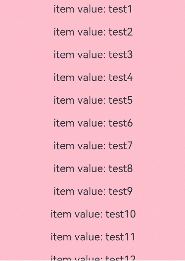
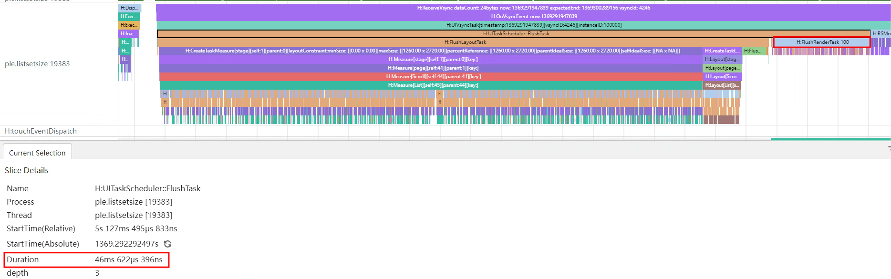
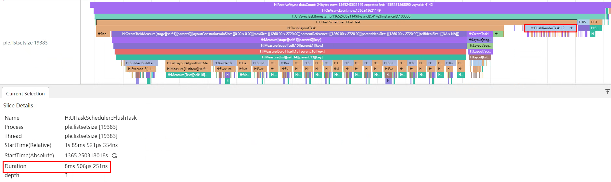
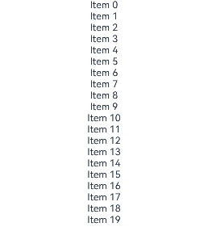

# 性能提升的其他方法

开发者若使用低性能的代码实现功能场景可能不会影响应用的正常运行，但却会对应用的性能造成负面影响。本章节列举出了一些可提升性能的场景供开发者参考，以避免应用实现上带来的性能劣化。

## 设置List组件的宽高

在使用Scroll容器组件嵌套List组件加载长列表时，若不指定List的宽高尺寸，则默认全部加载。

>  **说明：**
>
>  Scroll嵌套List时：
>
>  - List没有设置宽高，会布局List的所有子组件。
>  
>  - List设置宽高，会布局List显示区域内的子组件。
>  
>  - List使用[ForEach](../ui/state-management/arkts-rendering-control-foreach.md)加载子组件时，无论是否设置List的宽高，都会加载所有子组件。
>  
>  - List使用[LazyForEach](../ui/state-management/arkts-rendering-control-lazyforeach.md)加载子组件时，没有设置List的宽高，会加载所有子组件，设置了List的宽高，会加载List显示区域内的子组件。

```ts
class BasicDataSource implements IDataSource {
  private listeners: DataChangeListener[] = [];
  private originDataArray: string[] = [];

  public totalCount(): number {
    return 0;
  }

  public getData(index: number): string {
    return this.originDataArray[index];
  }

  registerDataChangeListener(listener: DataChangeListener): void {
    if (this.listeners.indexOf(listener) < 0) {
      console.info('add listener');
      this.listeners.push(listener);
    }
  }

  unregisterDataChangeListener(listener: DataChangeListener): void {
    const pos = this.listeners.indexOf(listener);
    if (pos >= 0) {
      console.info('remove listener');
      this.listeners.splice(pos, 1);
    }
  }

  notifyDataReload(): void {
    this.listeners.forEach(listener => {
      listener.onDataReloaded();
    })
  }

  notifyDataAdd(index: number): void {
    this.listeners.forEach(listener => {
      listener.onDataAdd(index);
    })
  }

  notifyDataChange(index: number): void {
    this.listeners.forEach(listener => {
      listener.onDataChange(index);
    })
  }

  notifyDataDelete(index: number): void {
    this.listeners.forEach(listener => {
      listener.onDataDelete(index);
    })
  }

  notifyDataMove(from: number, to: number): void {
    this.listeners.forEach(listener => {
      listener.onDataMove(from, to);
    })
  }
}

class MyDataSource extends BasicDataSource {
  private dataArray: Array<string> = new Array(100).fill('test');

  public totalCount(): number {
    return this.dataArray.length;
  }

  public getData(index: number): string {
    return this.dataArray[index];
  }

  public addData(index: number, data: string): void {
    this.dataArray.splice(index, 0, data);
    this.notifyDataAdd(index);
  }

  public pushData(data: string): void {
    this.dataArray.push(data);
    this.notifyDataAdd(this.dataArray.length - 1);
  }
}

@Entry
@Component
struct MyComponent {
  private data: MyDataSource = new MyDataSource();

  build() {
    Scroll() {
      List() {
        LazyForEach(this.data, (item: string, index: number ) => {
          ListItem() {
            Row() {
              Text('item value: ' + item + (index + 1)).fontSize(20).margin(10)
            }
          }
        })
      }
    }
  }
}
```

因此，此场景下建议设置List子组件的宽高。

```ts
class BasicDataSource implements IDataSource {
  private listeners: DataChangeListener[] = [];
  private originDataArray: string[] = [];

  public totalCount(): number {
    return 0;
  }

  public getData(index: number): string {
    return this.originDataArray[index];
  }

  registerDataChangeListener(listener: DataChangeListener): void {
    if (this.listeners.indexOf(listener) < 0) {
      console.info('add listener');
      this.listeners.push(listener);
    }
  }

  unregisterDataChangeListener(listener: DataChangeListener): void {
    const pos = this.listeners.indexOf(listener);
    if (pos >= 0) {
      console.info('remove listener');
      this.listeners.splice(pos, 1);
    }
  }

  notifyDataReload(): void {
    this.listeners.forEach(listener => {
      listener.onDataReloaded();
    })
  }

  notifyDataAdd(index: number): void {
    this.listeners.forEach(listener => {
      listener.onDataAdd(index);
    })
  }

  notifyDataChange(index: number): void {
    this.listeners.forEach(listener => {
      listener.onDataChange(index);
    })
  }

  notifyDataDelete(index: number): void {
    this.listeners.forEach(listener => {
      listener.onDataDelete(index);
    })
  }

  notifyDataMove(from: number, to: number): void {
    this.listeners.forEach(listener => {
      listener.onDataMove(from, to);
    })
  }
}

class MyDataSource extends BasicDataSource {
  private dataArray: Array<string> = new Array(100).fill('test');

  public totalCount(): number {
    return this.dataArray.length;
  }

  public getData(index: number): string {
    return this.dataArray[index];
  }

  public addData(index: number, data: string): void {
    this.dataArray.splice(index, 0, data);
    this.notifyDataAdd(index);
  }

  public pushData(data: string): void {
    this.dataArray.push(data);
    this.notifyDataAdd(this.dataArray.length - 1);
  }
}

@Entry
@Component
struct MyComponent {
  private data: MyDataSource = new MyDataSource();

  build() {
    Scroll() {
      List() {
        LazyForEach(this.data, (item: string, index: number) => {
          ListItem() {
            Text('item value: ' + item + (index + 1)).fontSize(20).margin(10)
          }.width('100%')
        })
      }.width('100%').height(500)
    }.backgroundColor(Color.Pink)
  }
}
```



使用SmartPerf Host工具分别抓取List不设置宽高时和设置宽高时的trace数据。

**List不设置宽高：**



**List设置宽高：**



从trace图可以看出，List不设置宽高时100个子组件全部参与布局，布局时间46.62ms。而给List设置宽高后只有给定高度内的12个子组件参与布局，布局时间减少到8.51ms，大幅提升了首次加载时的性能。

## 使用Column/Row替代Flex

由于Flex容器组件默认情况下存在shrink导致二次布局，这会在一定程度上造成页面渲染上的性能劣化。

```ts
@Entry
@Component
struct FlexBuild {
  private data: string[] = new Array(20).fill('');
  build() {
    Flex({ direction: FlexDirection.Column }) {
      Flex({ direction: FlexDirection.Column }) {
        Flex({ direction: FlexDirection.Column }) {
          Flex({ direction: FlexDirection.Column }) {
            Flex({ direction: FlexDirection.Column }) {
              ForEach(this.data, (item: string, index: number) => {
                Text(`Item ${index}`)
                  .width('100%')
                  .textAlign(TextAlign.Center)
              })
            }
          }
        }
      }
    }
  }
}
```

上述代码可将Flex替换为Column、Row，在保证实现的页面布局效果相同的前提下避免Flex二次布局带来的负面影响。

```ts
@Entry
@Component
struct ColumnAndRowBuild {
  private data: string[] = new Array(20).fill('');
  build() {
    Row() {
      Row() {
        Row() {
          Row() {
            Column() {
              ForEach(this.data, (item: string, index: number) => {
                Text(`Item ${index}`)
                  .width('100%')
                  .textAlign(TextAlign.Center)
              })
            }
          }
        }
      }
    }
  }
}
```



使用SmartPerf Host抓取上述两种不同布局方式示例程序的trace数据，对比其性能消耗，如下表所示。

|对比指标|Flex布局|Column/Row|
|--------|--------|--------|
|Build耗时(ms)|4.27|2.51|
|Measure耗时(ms)|2.98|1.04|
|Layout耗时(ms)|0.34|0.24|

可以看出布局深度和节点数相同的情况下，Flex的性能明显低于Column和Row容器，此时使用Column/Row替换Flex可以显著减少应用布局的性能消耗。

## 减少应用滑动白块

应用通过增大List/Grid控件的cachedCount参数，调整UI的加载范围。cachedCount表示屏幕外List/Grid预加载item的个数。  
如果需要请求网络图片，可以在item滑动到屏幕显示之前，提前下载好内容，从而减少滑动白块。  
如下是使用cachedCount参数的例子：

```ts
@Entry
@Component
struct MyComponent {
  private source: MyDataSource = new MyDataSource();

  build() {
    List() {
      LazyForEach(this.source, (item:number) => {
        ListItem() {
          Text("Hello" + item)
            .fontSize(50)
            .onAppear(() => {
              console.log("appear:" + item);
            })
        }
      })
    }.cachedCount(3) // 扩大数值appear日志范围会变大
  }
}

class MyDataSource implements IDataSource {
  data: number[] = [1, 2, 3, 4, 5, 6, 7, 8, 9, 10, 11, 12, 13, 14, 15];

  public totalCount(): number {
    return this.data.length;
  }

  public getData(index: number): number {
    return this.data[index];
  }

  registerDataChangeListener(listener: DataChangeListener): void {
  }

  unregisterDataChangeListener(listener: DataChangeListener): void {
  }
}
```


**使用说明：**
cachedCount的增加会增大UI的cpu、内存开销。使用时需要根据实际情况，综合性能和用户体验进行调整。

更多关于cachedCount的使用指导，请参考文档[列表场景性能提升实践](list-perf-improvment.md#缓存列表项)。