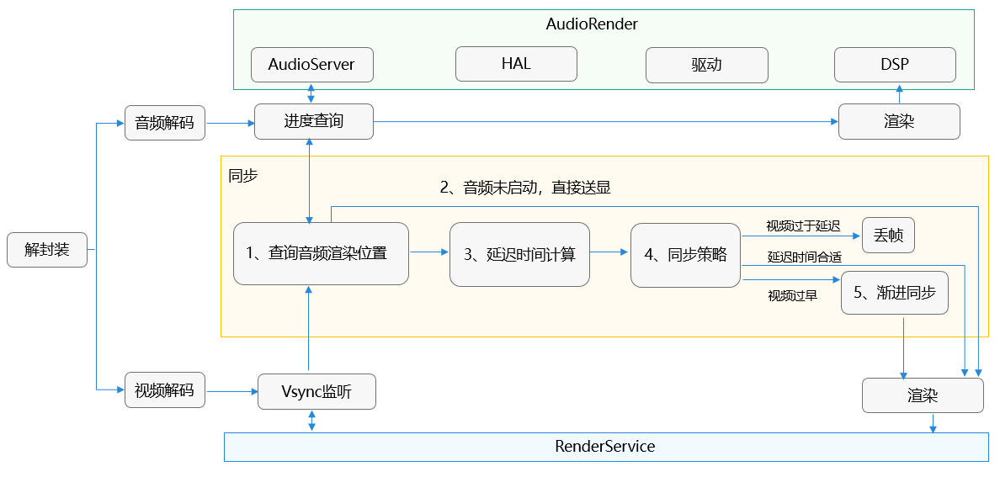

# 音画同步最佳实践

## 概述

精确的音视频同步是媒体播放的关键性能指标之一。通常来说，录音设备上同时录制的音频和视频在播放设备（例如手机，电视，媒体播放器）上播放的时候也需要做到同步，播放时的音视频不同步现象会严重影响用户体验。本文旨在指导第三方视频播放应用正确获取并使用音频相关信息来保证播放时的音视频同步。    
>**说明：**
>- 如果开发者使用自研播放器引擎而非AVPlayer，也可以参考该解决方案思路实现优化。    


| 缩略语     | 英文全名            | 中文解释               |详细解释                           |
| ------------ | :-------------------------------- | ------------------------ |---------------- |
| PTS | Presentation Time Stamp                                               | 送显时间戳 |指音视频数据在播放时应该显示给用户的时间戳。它表示解码后的音视频数据在播放时应该出现在屏幕上或传递给音频输出设备的时间点。PTS用于控制音视频的播放顺序和时序，以确保音视频在正确的时间点进行显示或播放。 |
| DTS | Decoding Time Stamp                                                   | 解码时间戳                         |指音视频数据在解码器中开始解码的时间戳。它表示解码器应该从输入数据流中读取和解码的特定时间点。DTS用于控制解码器的解码顺序，确保音视频数据按照正确的顺序解码。 |


| 帧     | 解释                                                      |
| ------------ | :-----------------------------------------------------------|
| I帧(I-frame) | 内部画面（intra picture）或关键帧（key frame）。I帧是一个全帧压缩的编码帧，包含了一幅完整的图像数据。                                               |
| P帧(P-frame) | 前向预测编码帧（predictive-frame）。P帧不是完整的数据帧，而是只包含与前面I帧或P帧的差异数据。                                                    |
| B帧(B-frame) | 双向预测内插编码帧（bi-directional interpolated prediction frame）。B帧也是一个压缩帧，它同时参考前面的I帧或P帧和后面的P帧来进行编码。                                                   |

## 实现原理 
音视频数据的最小处理单元称为帧。音频流和视频流都被分割成帧，所有帧都被标记为需要按特定的时间戳显示。音频和视频可以独立下载和解码，但具有匹配时间戳的音频和视频帧应同时呈现，以达到音视频（A/V）同步的效果。
### 音画同步标准   
1. 为了衡量音画同步的性能，用对应音频和视频帧实际播放时间的差值作为数值指标，数值大于0ms表示声音提前画面，小于0ms表示声音落后画面。  
2. 最大卡顿时长，单帧图像停滞时间超过100ms的，定义为卡顿一次，连续测试5分钟。  
3. 平均播放帧率，平均每秒播放帧数，不反映每帧显示时长。  

| 时间差范围     | 主观体验                                                      |
| ------------ | :-----------------------------------------------------------|
| [-80ms,25ms] | 无法察觉                                               |
| [-125ms,45ms] | 能够察觉
| [-185ms,90ms] | 无法接受 

>**说明：**
>- 以上标准基于一倍速场景。  

理论上，因为音频通路存在时延，要保证播放时的音视频同步，有三种解决方案可用：     
- 连续播放音频帧：使用音频播放位置作为主时间参考，并将视频播放位置与其匹配。
- 使用系统时间作为参考：将音频和视频播放与系统时间匹配。
- 使用视频播放作为参考：让音频匹配视频。   

三种方案的优缺点对比如下：  
| 方案名称     | 优点                              | 缺点                      |
| ------------ | :----------------------------- | ---------------------------- |
| 连续播放音频帧 | 1. 用户肉眼的敏感度较弱，不易察觉视频微小的调整。 <br>      2. 视频刷新时间的调整相对便捷。                                               | 如果视频帧率不稳定或渲染延迟大，可能导致视频卡顿或跳帧。 |
| 使用系统时间作为参考 | 可以最大限度的保证音频和视频都不发生跳帧行为。                                                   | 1. 需要额外依赖系统时钟，增加了系统复杂性和维护成本。<br>2. 系统时钟的准确性对同步效果影响较大，如果系统时钟不准确，可能导致同步效果大打折扣。                      |
| 使用视频播放作为参考 | 音频可根据视频帧进行调整，减少音频跳帧的情况。                                                   | 1. 音频播放可能会出现等待或加速的情况，相较于视频会对用户的影响更为严重和明显。<br>2. 如果视频帧率不稳定，可能导致音频同步困难。                      |

第一个方案是唯一一个具有连续音频数据流的选项，其没有对音频帧的显示时间、播放速度或持续时间进行任何调整。这些参数的任何调整都很容易被人耳注意到，并导致音频干扰故障。处理这些故障需要对音频重新采样，然而重新采样会导致音调的改变。    
因此，一般的多媒体应用多使用音频播放位置作为主时间参考。以下章节主要以此解决方案进行说明（其他两个选项不在本文档的范围内）。  

### 连续播放音帧方案示意图    
</img>  
音频和视频的管道必须同时以相同的时间戳呈现每帧数据。音频播放位置用作主时间参考，而视频管道只输出与最新渲染音频帧匹配的视频帧。对于所有可能的实现，精确计算最后一次呈现的音频时间戳是至关重要的。[OH_AudioRenderer_GetTimestamp()](../reference/apis-audio-kit/_o_h_audio.md#oh_audiorenderer_gettimestamp) 接口用以查询音频管道各个阶段的音频时间戳和延迟信息，此信息可用于控制视频管道，使视频帧与音频帧匹配。   
基于以上示意图，具体来说，在监听到视频帧的时候，首先去获取当前音频渲染位置，在获取成功的情况下计算该视频帧PTS与当前音频渲染位置的延迟时间，对延迟时间进行如下判断确定送显策略。  
- 视频帧相较于音频渲染位置过早时，视频帧则等待一段时间再送显。
- 延迟时间在可接受的延迟范围内该视频帧立即送显。
- 当视频帧相较于音频渲染位置过晚时则丢弃该视频帧。


## 连续播放音频帧方案
### 场景描述
综合上述三种方案的优缺点对比，此处采用主流的连续播放音频帧方案。使用音频播放位置作为主时间参考，并将视频播放位置与其匹配，使音画同步指标达到用户无法察觉的[-80ms,25ms]范围。    
该解决方案使用：    
- 视频同步到音频（主流方案）。
- 获取音频渲染进度，动态调整视频渲染进度。      

最终实现音画同步[-80ms,25ms]的效果。

### 开发步骤

1. 收到视频帧的时候，通过调用[OH_AudioRenderer_GetTimestamp()](../reference/apis-audio-kit/_o_h_audio.md#oh_audiorenderer_gettimestamp)接口获取音频渲染位置等信息。

    ```c++
    // get audio render position
    int64_t framePosition = 0;
    int64_t timestamp = 0;
    int32_t ret = OH_AudioRenderer_GetTimestamp(audioRenderer, CLOCK_MONOTONIC, &framePosition, ×tamp);
    AVCODEC_SAMPLE_LOGI("VD framePosition: %{public}ld, nowTimeStamp: %{public}ld", framePosition, nowTimeStamp);
    audioTimeStamp = timestamp;
    ```

    >**说明：**
    >- [OH_AudioRenderer_Start()](../reference/apis-audio-kit/_o_h_audio.md#oh_audiorenderer_start)接口执行后到真正写入硬件有一定延迟，因此该接口在调用[OH_AudioRenderer_Start()](../reference/apis-audio-kit/_o_h_audio.md#oh_audiorenderer_start)接口之后过一会才会拿到有效值，期间音频未发声时建议画面帧先按照正常速度播放，后续再逐步追赶音频位置从而提升用户看到画面的起播时延。 
    >- 当framePosition和timestamp以稳定的速度前进后，建议调用[OH_AudioRenderer_GetTimestamp()](../reference/apis-audio-kit/_o_h_audio.md#oh_audiorenderer_gettimestamp)接口的频率不要太频繁。推荐200ms一次，可以每分钟一次，最好不要低于200ms一次。频繁调用可能会带来功耗问题，因此在能保证音画同步效果的情况下，不需要频繁的查询时间戳。 
    >- [OH_AudioRenderer_Flush()](../reference/apis-audio-kit/_o_h_audio.md#oh_audiorenderer_flush)接口执行后，framePosition返回值会重新（从0）开始计算。  
    >- [OH_AudioRenderer_GetFramesWritten()](../reference/apis-audio-kit/_o_h_audio.md#oh_audiorenderer_getframeswritten) 接口在Flush时候不会清空，该接口和[OH_AudioRenderer_GetTimestamp()](../reference/apis-audio-kit/_o_h_audio.md#oh_audiorenderer_gettimestamp)接口并不建议配合使用。 
    >- 音频设备切换过程中[OH_AudioRenderer_GetTimestamp()](../reference/apis-audio-kit/_o_h_audio.md#oh_audiorenderer_gettimestamp)接口返回的framePosition和timestamp保证不会倒退，但由于新设备写入有时延，会出现短暂时间内音频进度无增长，建议画面帧保持流畅播放不要产生卡顿。  
    >- [OH_AudioRenderer_GetTimestamp()](../reference/apis-audio-kit/_o_h_audio.md#oh_audiorenderer_gettimestamp)接口获取的是实际写到硬件的采样帧数，不受倍速影响。对AudioRender设置了倍速的场景下，播放进度计算需要特殊处理，系统保证应用设置完倍速接口后，新写入AudioRender的采样点才会做倍速处理。


2. 音频启动前暂不做音画同步，视频帧直接送显。  

   音频未启动前，timestamp和framePostion返回结果为0。为避免出现卡顿等问题，暂不同步，视频帧直接送显。
    ```c++
    // audio render getTimeStamp error, render it
    if (ret != AUDIOSTREAM_SUCCESS || (timestamp == 0) || (framePosition == 0)) {
        // first frame, render without wait
        videoDecoder->FreeOutputBuffer(bufferInfo.bufferIndex, true);

        std::this_thread::sleep_until(lastPushTime + std::chrono::microseconds(sampleInfo.frameInterval));
        lastPushTime = std::chrono::system_clock::now();
        continue;
    }
    ```
3. 根据视频帧pts和音频渲染位置计算延迟。  

    - audioPlayedTime: 音频帧期望渲染时间。
    - videoPlayedTime: 视频帧期望送显时间。
    - waitTimeUs : 视频帧相对于音频帧延迟时间。

    ```c++
    // after seek, audio render flush, framePosition = 0, then writtenSampleCnt = 0
    int64_t latency = (writtenSampleCnt - framePosition) * 1000 * 1000 / sampleInfo.audioSampleRate;
    AVCODEC_SAMPLE_LOGI("VD latency: %{public}ld writtenSampleCnt: %{public}ld", latency, writtenSampleCnt);

    nowTimeStamp = getCurrentTime();
    int64_t anchordiff = (nowTimeStamp - audioTimeStamp) / 1000;

    int64_t audioPlayedTime = audioBufferPts - latency + anchordiff; // us, audio buffer accelerate render time
    int64_t videoPlayedTime = bufferInfo.attr.pts;                   // us, video buffer expected render time

    // audio render timestamp and now timestamp diff
    int64_t waitTimeUs = videoPlayedTime - audioPlayedTime;
    ```

4. 根据业务延迟做音画同步策略。  

    - [ , -40ms) 视频帧较晚时，丢弃此帧。
    - [-40ms, 0ms) 视频帧直接送显。
    - [0ms, ) 视频帧较早，根据业务需要选择渐进同步。

    ```c++
    // video buffer is too late, drop it
    if (waitTimeUs < WAIT_TIME_US_THRESHOLD_WARNING) {
        dropFrame = true;
        AVCODEC_SAMPLE_LOGE("VD buffer is too late");

    } else {
        AVCODEC_SAMPLE_LOGE("VD buffer is too early waitTimeUs: %{public}ld", waitTimeUs);
        // [0, ), render it with waitTimeUs, max 1s
        // [-40, 0), render it
        if (waitTimeUs > WAIT_TIME_US_THRESHOLD) {
            waitTimeUs = WAIT_TIME_US_THRESHOLD;
        }
        // per frame render time reduced by 33ms
        if (waitTimeUs > sampleInfo.frameInterval + PER_SINK_TIME_THRESHOLD) {
            waitTimeUs = sampleInfo.frameInterval + PER_SINK_TIME_THRESHOLD;
            AVCODEC_SAMPLE_LOGE("VD buffer is too early and reduced 33ms, waitTimeUs: %{public}ld", waitTimeUs);
        }
    }
    ```
5. 进行音画渐进同步。    

   视频帧较早时，等待一段时间送显。   
    ```c++
    if (waitTimeUs > 0) {
        std::this_thread::sleep_for(std::chrono::microseconds(waitTimeUs));
    }
    lastPushTime = std::chrono::system_clock::now();
    ret = videoDecoder->FreeOutputBuffer(bufferInfo.bufferIndex, !dropFrame);
    ```