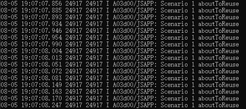
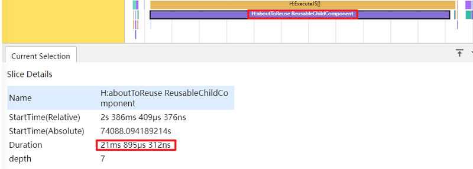
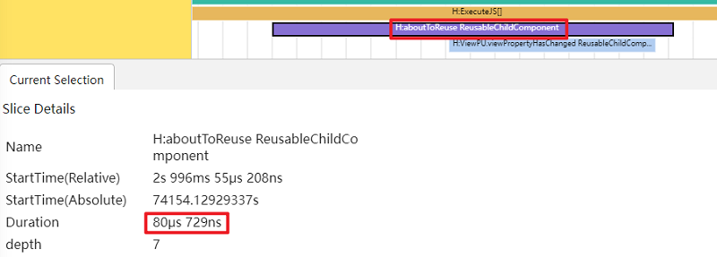
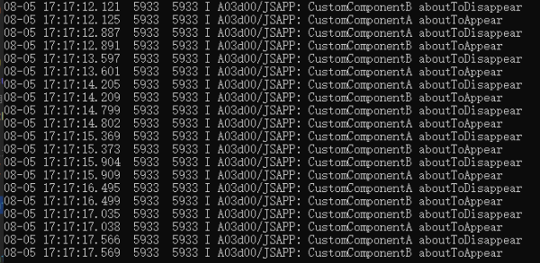
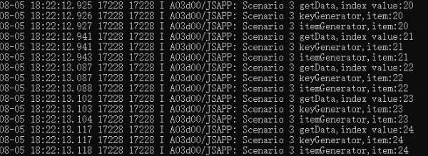
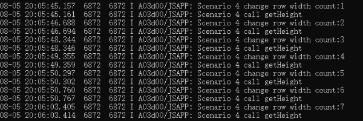
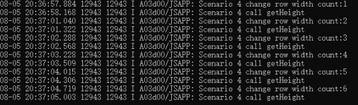
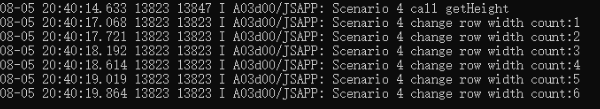

# 避免在滑动场景的高频回调接口中处理耗时操作

## 概述
在滑动场景或者频繁创建和销毁组件等场景中，容易出现应用卡顿丢帧的问题。大多是由于场景中存在高频的接口调用，同时接口中执行了耗时操作，导致应用出现卡顿丢帧的现象，严重影响用户体验。为了帮助开发者优化应用性能，提升用户体验，本文将介绍以下四种需要避免处理耗时操作的高频场景：
- **组件复用时避免在aboutToReuse中执行耗时操作。** 例如，在滑动场景中，使用组件复用通常需要用生命周期回调aboutToReuse去更新组件的状态变量。在滑动时，aboutToReuse会被频繁调用。如果在aboutToReuse中进行了耗时操作，将导致应用出现卡顿丢帧的问题。
- **避免在aboutToAppear，aboutToDisappear中执行耗时操作。** 例如，在需要频繁创建和销毁组件的场景中，如果频繁在组件生命周期回调aboutToAppear，aboutToDisappear中执行耗时操作，会导致应用出现卡顿丢帧的问题。
- **避免在LazyForEach的itemGenerator，keyGenerator，getData中执行耗时操作。** 例如，在懒加载滑动场景中，框架会根据滚动容器可视区域按需创建组件，所以在滑动时框架会频繁调用子组件生成函数itemGenerator，键值生成函数keyGenerator，获取索引数据函数getData。如果在itemGenerator，keyGenerator，getData中执行了耗时操作（比如传入耗时的函数作为入参），就会导致应用出现卡顿丢帧的问题。
- **避免在组件的属性中执行耗时操作。** 在组件单一属性刷新时，组件的其他属性也会同时进行刷新。在需要频繁刷新组件属性的场景中，如果组件中其他不需要刷新的属性使用了耗时的函数作为入参。那么在刷新组件某个属性时，组件中那些实际上不需要去刷新的属性将会去调用耗时函数，导致不必要的性能损耗，同时也会引起应用卡顿丢帧的问题。

## 组件复用时避免在aboutToReuse中执行耗时操作

这里以[Grid懒加载组件复用场景](./grid_optimization.md#场景示例)为例,在aboutToReuse中加入测试日志，观察在滑动Grid时aboutToReuse的调用情况。
```ts
aboutToReuse(params: Record<string, number>) {
  this.item = params.item;
  console.log("Scenario 1 aboutToReuse");
}
```

图1 滑动时的aboutToReuse日志



如图1所示，从日志中可以看出，滑动时框架会频繁调用组件复用的aboutToReuse来更新节点。

下面将基于这种组件复用时滑动会高频调用aboutToReuse的场景，在aboutToReuse中执行耗时操作和不执行耗时操作来分析正反例场景的性能差异。

**反例：**

在aboutToReuse中进行耗时操作。

```ts
...
// 这里用循环函数模拟耗时操作
count(): number {
  let temp: number = 0;
  for (let index = 0; index < 1000000; index++) {
    temp += index;
  }
  return temp;
}

aboutToReuse(params: Record<string, number>) {
  this.item = params.item;
  // 模拟耗时操作
  this.count();
}
...
```

**正例：**

在aboutToReuse中不进行耗时操作。

```ts
...
aboutToReuse(params: Record<string, number>) {
  this.item = params.item;
}
...
```

**效果对比**

下面是使用SmartPerf工具抓取trace来分析滑动时在aboutToReuse中进行耗时操作和不进行耗时操作的性能差异。抓取trace前，需要先打开ArkUI节点树布局详细过程的trace开关，否则抓不到下面提到的trace标签“H:aboutToReuse ReusableChildComponent”。通过`hdc shell`进入命令行交互模式，执行`param set persist.ace.trace.layout.enabled true`命令打开。

图2 反例滑动时单个aboutToReuse耗时



图3 正例滑动时单个aboutToReuse耗时



如图2所示，从反例trace中“H:aboutToReuse ReusableChildComponent”标签可以看出，单个aboutToReuse执行耗时21ms。而从图3正例trace中“H:aboutToReuse ReusableChildComponent”标签看，单个aboutToReuse执行耗时仅80μs。在高频调用aboutToReuse的场景中，如果每次调用aboutToReuse中都去执行耗时操作，将会导致应用性能大幅下降。因此，组件复用时应避免在aboutToReuse中执行耗时操作。


## 避免在aboutToAppear，aboutToDisappear中执行耗时操作

下面是一个使用条件渲染，通过点击按钮切换自定义组件A和B来模拟频繁创建和销毁组件的场景示例。在自定义组件A，B的生命周期回调函数aboutToAppear和aboutToDisappear中加入测试日志，用于观察点击按钮模拟频繁创建和销毁组件场景中的调用情况。
```ts
@Entry
@Component
struct Index {
  // 切换自定义组件标志位
  @State flag: boolean = false;

  build() {
    Column({ space: 10 }) {
      Button('switch custom component').onClick(() => {
        // 点击按钮切换自定义组件
        this.flag = !this.flag;
      })
      // 使用条件渲染，通过点击按钮来模拟频繁创建和销毁组件的场景
      if (this.flag) {
        // 自定义组件A
        CustomComponentA()
      } else {
        // 自定义组件B
        CustomComponentB()
      }
    }.width('100%').height('100%')
  }
}

@Component
struct CustomComponentA {
  aboutToAppear() {
    console.log("CustomComponentA aboutToAppear");
  }

  aboutToDisappear() {
    console.log("CustomComponentA aboutToDisappear");
  }

  build() {
    Column() {
    }.backgroundColor(Color.Blue).width(200).height(200)
  }
}

@Component
struct CustomComponentB {
  aboutToAppear() {
    console.log("CustomComponentB aboutToAppear");
  }

  aboutToDisappear() {
    console.log("CustomComponentB aboutToDisappear");
  }

  build() {
    Column() {
    }.backgroundColor(Color.Red).width(200).height(200)
  }
}
```

图4 点击10次按钮的aboutToAppear和aboutToDisappear日志



模拟频繁创建和销毁组件的场景，进行10次点击按钮切换自定义组件的操作。如图4所示，从日志中可以看出aboutToAppear和aboutToDisappear共调用了20次。因为示例中使用了条件渲染，每次销毁前一个自定义组件都会调用一次aboutToDisappear函数，然后创建新的自定义组件时，又会调用一次aboutToAppear，所以调用较为频繁。

示例中只模拟了条件渲染时两个自定义组件间的频繁创建和销毁组件的场景，但是在实际复杂的应用业务中，可能需要对大量自定义组件进行频繁创建和销毁，因此会出现高频调用aboutToAppear和aboutToDisappear的情况。如果在aboutToAppear和aboutToDisappear中再去进行耗时操作（类似前面的“组件复用时避免在aboutToReuse中执行耗时操作”场景，这里就不再赘述），将会导致应用出现卡顿丢帧的问题。因此，在频繁创建和销毁组件的场景中，应避免在aboutToAppear，aboutToDisappear中执行耗时操作。


## 避免在LazyForEach的itemGenerator，keyGenerator，getData中执行耗时操作

这里还是以前面“组件复用时避免在aboutToReuse中执行耗时操作”场景中Grid懒加载组件复用场景为例，把itemGenerator，keyGenerator参数修改为函数入参itemGeneratorFunc，keyGeneratorFunc。同时在itemGeneratorFunc，keyGeneratorFunc，getData中加入测试日志，观察在懒加载Grid滑动时的调用情况。
```ts
// MyDataSource类实现IDataSource接口
class MyDataSource implements IDataSource {
  private dataArray: number[] = [];

  public pushData(data: number): void {
    this.dataArray.push(data);
  }

  // 数据源的数据总量
  public totalCount(): number {
    return this.dataArray.length;
  }

  // 返回指定索引位置的数据
  public getData(index: number): number {
    console.log("Scenario 3 getData,index value:" + this.dataArray[index]);
    return this.dataArray[index];
  }

  registerDataChangeListener(listener: DataChangeListener): void {
  }

  unregisterDataChangeListener(listener: DataChangeListener): void {
  }
}

@Entry
@Component
struct MyComponent {
  // 数据源
  private data: MyDataSource = new MyDataSource();

  aboutToAppear() {
    for (let i = 1; i < 1000; i++) {
      this.data.pushData(i);
    }
  }
  
  // itemGenerator入参函数
  itemGeneratorFunc(item: number): number {
    console.log("Scenario 3 itemGenerator,item:" + item);
    return item;
  }

  // keyGenerator入参函数
  keyGeneratorFunc(item: number): string {
    console.log("Scenario 3 keyGenerator,item:" + item);
    return JSON.stringify(item);
  }

  build() {
    Column({ space: 5 }) {
      Grid() {
        LazyForEach(this.data, (item: number) => {
          GridItem() {
            // 使用可复用自定义组件
            ReusableChildComponent({ item: this.itemGeneratorFunc(item) })
          }
        }, (item: number) => this.keyGeneratorFunc(item))
      }
      .cachedCount(2) // 设置GridItem的缓存数量
      .columnsTemplate('1fr 1fr 1fr')
      .columnsGap(10)
      .rowsGap(10)
      .margin(10)
      .height(500)
      .backgroundColor(0xFAEEE0)
    }
  }
}

// 自定义组件被@Reusable装饰器修饰，即标志其具备组件复用的能力
@Reusable
@Component
struct ReusableChildComponent {
  @State item: number = 0;

  // aboutToReuse从复用缓存中加入到组件树之前调用，可在此处更新组件的状态变量以展示正确的内容
  aboutToReuse(params: Record<string, number>) {
    this.item = params.item;
  }

  build() {
    Column() {
      Image($r('app.media.icon'))
        .objectFit(ImageFit.Fill)
        .layoutWeight(1)
      Text(`图片${this.item}`)
        .fontSize(16)
        .textAlign(TextAlign.Center)
    }
    .width('100%')
    .height(120)
    .backgroundColor(0xF9CF93)
  }
}
```

图5 懒加载滑动Grid日志



如图5所示，从日志中可以看出，在懒加载Grid滑动时，会频繁调用getData，itemGenerator，keyGenerator。因为滑动时框架会对比item键值，判断是使用缓存节点还是新建节点。因此会先调用getData获取索引位置的数据，并提供给keyGenerator去对比键值，如果需要新建节点就会去调用itemGenerator。因此，在懒加载滑动场景中，会频繁调用getData，itemGenerator，keyGenerator。如果滑动时在这些函数中执行耗时操作，将会导致应用出现卡顿丢帧的问题。

下面是分别在itemGenerator，keyGenerator，getData中执行耗时操作和不执行耗时操作的正反例。由于真实场景的函数中可能存在未知的耗时操作逻辑，因此这里用循环函数模拟耗时操作。

### 避免在LazyForEach的itemGenerator中执行耗时操作

**反例：**

在itemGenerator入参函数中执行耗时操作。

```ts
...
itemGeneratorFunc(item: number): number {
  // 这里用循环函数模拟耗时操作
  let temp: number = 0;
  for (let index = 0; index < 1000000; index++) {
    temp += 1;
  }
  item += temp;
  return item;
}
...
Grid() {
  LazyForEach(this.data, (item: number) => {
    GridItem() {
      // 传入耗时操作函数入参this.itemGeneratorFunc(item)
      ReusableChildComponent({ item: this.itemGeneratorFunc(item) })
    }
  }, (item: number) => JSON.stringify(item))
}
...
```

**正例：**

在aboutToAppear中执行耗时操作。

```ts
// 耗时操作计算的值
private timeConsumingValue: number = 0;

aboutToAppear() {
  ...
  // 执行该异步函数
  this.itemGeneratorFunc();
}

// 这里用循环函数模拟耗时操作
async itemGeneratorFunc() {
  let temp: number = 0;
  for (let index = 0; index < 1000000; index++) {
    temp += 1;
  }
  this.timeConsumingValue = temp;
}
...
Grid() {
  LazyForEach(this.data, (item: number) => {
    GridItem() {
      // 传入耗时操作计算的值
      ReusableChildComponent({ item: item + this.timeConsumingValue })
    }
  }, (item: number) => JSON.stringify(item))
}
...
```

### 避免在LazyForEach的keyGenerator中执行耗时操作

**反例：**

在keyGenerator入参函数中执行耗时操作。

```ts
...
keyGeneratorFunc(item: number): string {
  // 这里用循环函数模拟耗时操作
  let temp: number = 0;
  for (let index = 0; index < 1000000; index++) {
    temp += 1;
  }
  item += temp;
  return JSON.stringify(item);
}
...
Grid() {
  LazyForEach(this.data, (item: number) => {
    GridItem() {
      ReusableChildComponent({ item: item })
    }
  }, (item: number) => this.keyGeneratorFunc(item)) // 传入耗时操作函数入参this.keyGeneratorFunc(item)
}
...
```

**正例：**

在aboutToAppear中执行耗时操作。

```ts
// 耗时操作计算的值
private timeConsumingValue: number = 0;

aboutToAppear() {
  ...
  // 执行该异步函数
  this.keyGeneratorFunc();
}

// 这里用循环函数模拟耗时操作
async keyGeneratorFunc() {
  let temp: number = 0;
  for (let index = 0; index < 1000000; index++) {
    temp += 1;
  }
  this.timeConsumingValue = temp;
}
...
Grid() {
  LazyForEach(this.data, (item: number) => {
    GridItem() {
      // 使用可复用自定义组件
      ReusableChildComponent({ item: item })
    }
  }, (item: number) => JSON.stringify(item + this.timeConsumingValue))
}
...
```

### 避免在LazyForEach的getData中执行耗时操作

**反例：**

在getData中执行耗时操作。

```ts
...
// 返回指定索引位置的数据
public getData(index: number): number {
  // 这里用循环函数模拟耗时操作
  let temp: number = 0;
  for (let index = 0; index < 1000000; index++) {
    temp += 1;
  }
  return this.dataArray[index];
}
...
```

**正例：**

避免在getData中执行耗时操作。

```ts
...
// 返回指定索引位置的数据
public getData(index: number): number {
  // 不在getData中执行耗时操作
  return this.dataArray[index];
}
...
```

**效果对比**

由于上述itemGenerator，keyGenerator，getData滑动场景中正反例的对比效果类似，所以下面只给出itemGenerator正反例的效果对比。

图6 itemGenerator中执行耗时操作的滑动效果


图6是在itemGenerator入参函数中执行耗时操作的滑动效果，可以明显看出滑动时存在卡顿，item节点刷新慢等问题。

图7 itemGenerator中不执行耗时操作的滑动效果


图7是在aboutToAppear中执行耗时操作，把耗时操作计算的值timeConsumingValue传入itemGenerator的滑动效果，可以看出滑动效果流畅，无卡顿问题。

因此，在懒加载滑动场景中，应避免在LazyForEach的itemGenerator，keyGenerator，getData中执行耗时操作，可以有效减少应用卡顿丢帧的问题，提升用户体验。

## 避免在组件的属性中执行耗时操作

下面是一个点击按钮改变Row组件宽度的示例，Row的高度使用getHeight()函数入参形式调用。在getHeight()中加入测试日志，用于观察修改Row宽度时，Row高度属性入参函数的调用情况。
```ts
@Entry
@Component
struct Index {
  // Row宽度
  @State rowWidth: number = 100;
  // 点击按钮改变Row宽度的次数
  private count: number = 0;

  // 获取Row组件高度
  getHeight(): number {
    console.log("Scenario 4 call getHeight");
    return 100;
  }

  build() {
    Column({ space: 10 }) {
      // 点击按钮修改Row组件宽度
      Button('change row width').onClick(() => {
        this.rowWidth = this.rowWidth + 20;
        this.count++;
        console.log("Scenario 4 change row width count:" + this.count);
        if (this.rowWidth > 200) {
          this.rowWidth = 100;
        }
      })
      Row().width(this.rowWidth).height(this.getHeight()).backgroundColor(Color.Blue)
    }.width('100%').height('100%')
  }
}
```

图8 点击按钮改变Row宽度日志



如图8所示，从日志中可以看出，每次点击按钮改变Row组件宽度时，Row的高度也会同时刷新。由此可见，在组件单一属性刷新时，组件的其他属性也会同时进行刷新。因此，在高频刷新组件属性的场景中，将会频繁调用组件所有属性的刷新。

下面通过在组件属性中使用耗时的函数入参调用作为反例，使用[任务池taskpool](../reference/apis-arkts/js-apis-taskpool.md)处理耗时操作后返回结果给Row的高度rowHeight作为正例，来对比组件属性刷新时的性能差异。

**反例：**

在getHeight()中添加耗时操作作为反例。

```ts
...
  // 获取Row组件高度
  getHeight(): number {
    let height: number = 0;
    // 这里用循环函数模拟耗时操作
    for (let index = 0; index < 1000000; index++) {
      height += 0.0001;
    }
    console.log("Scenario 4 call getHeight");
    return height;
  }
...
```

**正例：**

使用任务池taskpool处理耗时操作后返回结果给Row的高度rowHeight作为正例。

```ts
import taskpool from '@ohos.taskpool'; // 任务池

@Concurrent
function getHeight(): number {
  let height: number = 0;
  // 这里用循环函数模拟耗时操作
  for (let index = 0; index < 1000000; index++) {
    height += 0.0001;
  }
  console.log("Scenario 4 call getHeight");
  return height;
}

// 执行getHeight()
taskpool.execute(getHeight).then((value: Object) => {
  AppStorage.setOrCreate('height', value);
});

@Entry
@Component
struct Index {
  // Row宽度
  @State rowWidth: number = 100;
  // Row高度
  @StorageLink('height') rowHeight: number = 0;
  // 点击按钮改变Row宽度的次数
  private count: number = 0;

  build() {
    Column({ space: 10 }) {
      Button('change row width').onClick(() => {
        this.rowWidth = this.rowWidth + 20;
        this.count++;
        console.log("Scenario 4 change row width count:" + this.count);
        if (this.rowWidth > 200) {
          this.rowWidth = 100;
        }
      })
      Row().width(this.rowWidth).height(this.rowHeight).backgroundColor(Color.Blue)
    }.width('100%').height('100%')
  }
}
```

**效果对比**

图9 反例改变Row组件宽度日志



如图9所示，从日志可以看出，每次改变Row组件宽度rowWidth，都会调用一次耗时的Row高度入参函数getHeight()。

图10 正例改变Row组件宽度日志



如图10所示，从日志可以看出，页面加载时通过taskpool方式仅执行一次耗时的getHeight()。然后返回结果直接赋值给Row高度变量rowHeight。修改6次Row组件宽度，不需要再重复调用耗时的getHeight()，有效减少了不必要的性能损耗。

因此，在高频刷新组件属性的场景中，应避免在组件的属性中执行耗时操作（如属性使用耗时的函数入参），能有效减少应用卡顿丢帧的情况，提升用户体验。