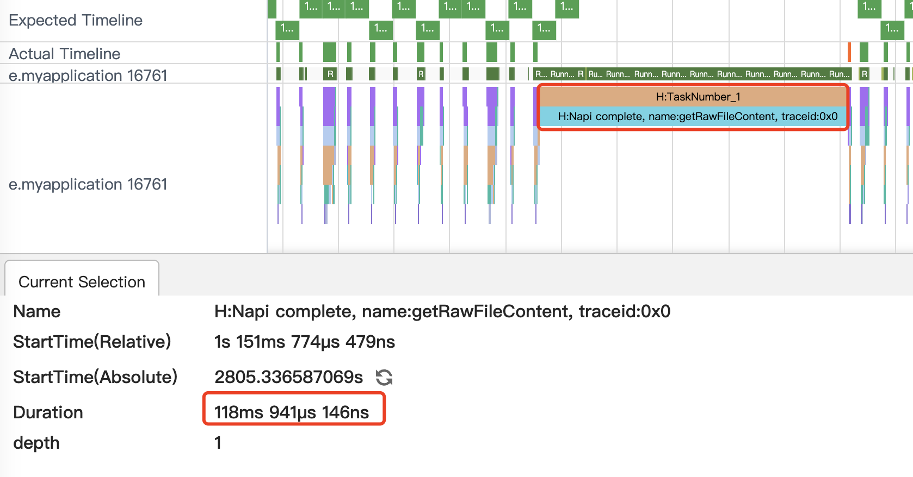
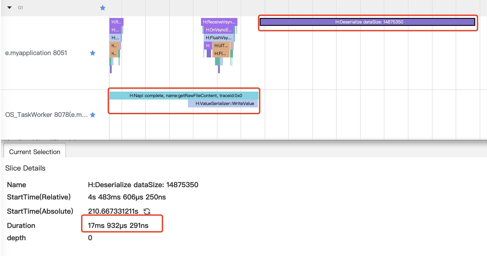
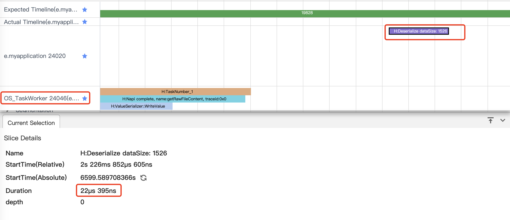

# 避免在主线程中执行耗时操作
## 简介
在应用开发中，经常会调用执行耗时的接口，比如服务端数据接口，本地文件读取接口。如果不进行合理的处理，可能会引起卡顿等性能问题。
## 问题场景
列表无限滑动的场景，在即将触底的时候需要进行数据请求，如果在主线程中直接处理请求数据，可能会导致滑动动画被中断。如果回调函数处理的耗时较长，会直接阻塞主线程，卡顿就会非常明显。使用异步执行的方式进行异步调用，回调函数的执行还是会在主线程，一样会阻塞UI绘制和渲染。场景预览如下，列表滑动过程中，图片会显示延迟。


## 优化示例
### 优化前代码示例
如下代码实现了一个瀑布流，每一个元素都是一张图片，在滑动即将触底时调用异步函数mockRequestData获取新数据，并将数据写入数据源。异步函数mockRequestData用于模拟耗时的网络请求，从rawfile中读取数据，将数据处理后返回。
```ts
  build() {
    Column({ space: 2 }) {
      WaterFlow() {
        LazyForEach(this.dataSource, (item: ModelDetailVO) => {
          FlowItem() {
            Column() {
              Image(item.url)
            }
          }
          .onAppear(() => {
            // 即将触底时提前增加数据
            if (item.id + 10 === this.dataSource.totalCount()) {
              // 通过子线程获取数据，传入当前的数据长度，用于赋给数据的ID值
              this.mockRequestData().then((data: ModelDetailVO[]) => {
                for (let i = 0; i < data.length; i++) {
                  this.dataSource.addLastItem(data[i]);
                }
              })
            }
          })
        }, (item: string) => item)
      }
    }
  }

  async mockRequestData(): Promise<ModelDetailVO[]> {
    let result: modelDetailDTO[] = [];
    // data.json是存在本地的json数据，大小大约20M,模拟从网络端获取数据
    await this.getUIContext().getHostContext()?.resourceManager.getRawFileContent("data.json").then((data: Uint8Array) => {
      // 耗时回调函数
      let jsonData = buffer.from(data).toString();
      let res: responseData = JSON.parse(jsonData);
      result = res.data;
    })
    return this.transArrayDTO2VO(result);
  }
  // ...
```
编译运行后，通过[SmartPerf Host](./performance-optimization-using-smartperf-host.md)工具抓取Trace。如下图所示，其中红色框选的部分就是getRawFileContent的回调耗时。



从图中可以看到，在主线程中出现了大块的耗时，直接导致用户在滑动的时候能感受到明显的卡顿。异步回调函数最后也由主线程执行，所以应该尽量避免在回调函数中执行耗时操作。

### 优化代码

#### 优化思路：使用多线程能力
使用系统自带的[TaskPool](../arkts-utils//taskpool-introduction.md)多线程能力。
```ts
  build() {
    Column({ space: 2 }) {
      WaterFlow() {
        LazyForEach(this.dataSource, (item: ModelDetailVO) => {
          FlowItem() {
            Column() {
              Image(item.url)
            }
          }
          .onAppear(() => {
            // 即将触底时提前增加数据
            if (item.id + 10 === this.dataSource.totalCount()) {
              // 通过子线程获取数据，传入当前的数据长度，用于赋给数据的ID值
              taskpoolExecute(this.dataSource.totalCount(),
                this.getUIContext().getHostContext() as common.UIAbilityContext).then((data: ModelDetailVO[]) => {
                for (let i = 0; i < data.length; i++) {
                  this.dataSource.addLastItem(data[i]);
                }
              })
            }
          })
        }, (item: string) => item)
      }
    }
  }

  // 注意：以下方法和类声明均在组件外声明
  async function taskpoolExecute(index: number, context: Context): Promise<ModelDetailVO[]> {
    // context需要手动传入子线程
    let task: taskpool.Task = new taskpool.Task(mockRequestData, index, context);
    return await taskpool.execute(task) as ModelDetailVO[];
  }

  // 标记并发执行函数
  @Concurrent
  async function mockRequestData(index: number, context: Context): Promise<ModelDetailVO[]> {
    let result: modelDetailDTO[] = [];
    // data.json是存在本地的json数据，大小大约20M,模拟从网络端获取数据
    await context.resourceManager.getRawFileContent("data.json").then((data: Uint8Array) => {
      let jsonData = buffer.from(data).toString();
      let res: responseData = JSON.parse(jsonData);
      result = res.data;
    })
    return transArrayDTO2VO(result, index);
  }
```

在上面的代码里，优化的思路主要是用子线程处理耗时操作，避免在主线程中执行耗时操作影响UI渲染，编译运行后，通过[SmartPerf Host](./performance-optimization-using-smartperf-host.md)工具抓取Trace。如下图所示，原先在主线程中的getRawFileContent的标签转移到了TaskWorker线程。

 

从图中可以看到，主线程阻塞耗时明显减少，同时在右上角出现了新的trace，__H:Deserialize__，这个trace表示在反序列化taskpool线程返回的数据。依然存在一定耗时(17ms) 容易出现丢帧等问题。针对跨线程的序列化耗时问题，系统提供了[@Sendable装饰器](../arkts-utils/arkts-sendable.md#sendable装饰器)来实现内存共享。可以在返回的类对象ModelDetailVO上使用@Sendable装饰器，继续优化性能。

#### 优化思路：可以使用@Sendable装饰器提升数据传输和同步效率
多线程存在线程间通信耗时问题，如果涉及数据较大的情况，可以使用[@Sendable](../arkts-utils/arkts-sendable.md)。

```c++
  build() {
    Column({ space: 2 }) {
      WaterFlow({}) {
        LazyForEach(this.dataSource, (item: ModelDetailVO) => {
          FlowItem() {
            Column() {
              Image(item.url)
            }
          }
          .onAppear(() => {
            // 即将触底时提前增加数据
            if (item.id + 10 === this.dataSource.totalCount()) {
              // 通过子线程获取数据，传入当前的数据长度，用于赋给数据的ID值
              taskpoolExecute(this.dataSource.totalCount(),
                this.getUIContext().getHostContext() as common.UIAbilityContext).then((data: ModelDetailVO[]) => {
                for (let i = 0; i < data.length; i++) {
                  this.dataSource.addLastItem(data[i]);
                }
              })
            }
          })
        }, (item: string) => item)
      }
    }
  }

  // 注意：以下方法和类声明均在组件外声明
  async function taskpoolExecute(index: number, context: Context): Promise<ModelDetailVO[]> {
    // context需要手动传入子线程
    let task: taskpool.Task = new taskpool.Task(mockRequestData, index, context);
    return await taskpool.execute(task) as ModelDetailVO[];
  }

  // 标记并发执行函数
  @Concurrent
  async function mockRequestData(index: number, context: Context): Promise<ModelDetailVO[]> {
    let result: modelDetailDTO[] = [];
    // data.json是存在本地的json数据，大小大约20M,模拟从网络端获取数据
    await context.resourceManager.getRawFileContent("data.json").then((data: Uint8Array) => {
      let jsonData = buffer.from(data).toString();
      let res: responseData = JSON.parse(jsonData);
      result = res.data;
    })
    return transArrayDTO2VO(result, index);
  }
  
  @Sendable
  class ModelDetailVO {
    id: number = 0;
    name: string = "";
    url: string = "";
  }
  
  // ...
```
上面的代码在子线程返回的类对象上使用了@Sendable，系统会使用共享内存的方式处理使用了@Sendable的类，从而降低反序列化的开销。

 

从图中可以看到，反序列化的大小和耗时明显变少。

## 总结
通过上面的示例代码和优化过程，可以看到在主线程的回调函数中处理耗时操作会直接阻塞主线程，用户能感知到明显的卡顿，用子线程配合@Sendable可以有效的优化该场景的性能。
