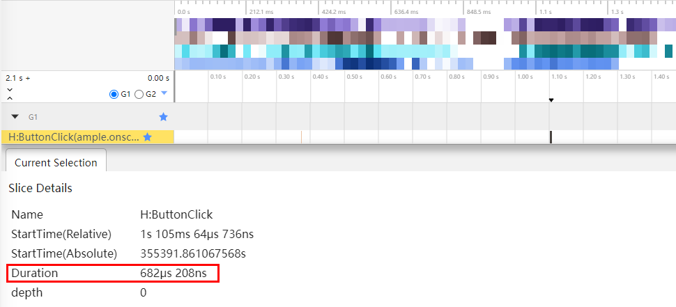

# 避免开发过程中的冗余操作

## 概述

在软件开发流程中，识别并减少冗余操作至关重要。为优化性能，开发者需在开发阶段适度增加日志以辅助调试，而在生产环境中则需避免冗余日志和Trace追踪输出。还需要审查并删除无实际功能的空回调函数，确保回调有明确的目的。通过精简日志、合理规划Trace追踪和严谨处理回调函数，能够有效降低冗余，提升代码质量与运行性能，从而提高软件产品的用户体验。接下来，将进一步探讨关注点及优化方法。

## 避免在系统高频回调用进行冗余和耗时操作

高频回调接口通常是指在应用程序运行过程中会被频繁触发的事件或回调函数，如滚动事件、触摸事件、鼠标事件、拖拽事件以及手势移动过程更新事件等。这类接口的核心特征在于极高的触发频率和对性能的严苛要求。在软件开发阶段，针对这类高频回调接口的性能优化显不可忽视。其中，有效的优化策略是在接口内部避免执行冗余的日志记录、Trace追踪以及耗时操作。系统中常见的高频接口包括但不限于以下几种：

通用事件：

- `onTouch`：触摸事件会在手指触摸动作触发该回调。

- `onItemDragMove`：拖拽在列表元素范围内移动时触发。

- `onDragMove`：拖拽事件会在组件范围内移动时，触发回调。

- `onMouse`：鼠标事件会在当前组件被鼠标按键点击时或者鼠标在组件上悬浮移动时，触发该回调。

- `onVisibleAreaChange`：组件可见区域变化时触发该回调。

- `onAreaChange`：组件区域变化时触发该回调。

特定事件：

- `onDidScroll`：滚动组件滑动时触发，返回当前帧滑动的偏移量和当前滑动状态。（滚动组件中如Scroll、List等）

- `onActionUpdate`：手势移动过程更新事件会在手势移动过程中回调。（在基础手势中如PinchGesture、PinchGesture、RotationGesture等）

**反例：**

下面代码示例演示了在Scroll组件绑定了onDidScroll()滚动事件，是一个高频触发接口。添加冗余的Trace、日志打印和耗时操作。

```typescript
// onDidScroll高频回调场景反例
import { hilog, hiTraceMeter } from '@kit.PerformanceAnalysisKit';

@Component
struct NegativeOfOnDidScroll {
  Scroll() {
    ForEach(this.arr, (item: number) => {
      Text("TextItem" + item)
      .width("100%")
      .height(100)
    }, (item: number) => item.toString())
  }
  .width('100%')
  .height('100%')
  .onDidScroll(() =>{
    hiTraceMeter.startTrace("ScrollSlide", 1001);
    hilog.info(1001, 'Scroll', 'TextItem');
    // 耗时操作
    // ...
    // 业务逻辑
    // ...
    hiTraceMeter.finishTrace("ScrollSlide", 1001);
  })
}
```

**正例：**

在处理Scroll组件的滚动事件回调函数onDidScroll()时，应当避免冗余的Trace追踪、日志记录和耗时操作，以保持代码的简洁高效。在开发调试阶段或为了解决特定问题，加入此类追踪和日志输出指令。进入应用的实际运行环境，尤其是发布版本，应当移除Trace追踪、日志记录和耗时操作，避免对程序性能产生潜在的负面影响，并提升日志信息的针对性和价值。

```typescript
// onDidScroll高频回调场景正例
@Component
struct PositiveOfOnDidScroll {
  Scroll() {
    ForEach(this.arr, (item: number) => {
      Text("ListItem" + item)
      .width("100%")
      .height("100%")
    }, (item: number) => item.toString())
  }
  .width('100%')
  .height('100%')
  .onDidScroll(() =>{
    // 业务逻辑
    // ...
  })
}
```

从下图所示的数据中，在6秒钟的列表滚动期间，Hilog被打印超过300次。这种现象在处理如滚动事件这类高频交互时，容易引发诸多问题。因此，在开发流程中，应当定期对代码进行审查，清理不必要的Trace追踪和日志输出，以防止耗时操作影响项目整体性能，以确保项目的整体性能和效率。


## 删除冗余Trace和日志打印

在开发流程中，日志打印和trace追踪无疑是重要的辅助工具，帮助开发者诊断问题和调试代码。然而，在debug模式与release模式下，对日志和trace的处理应当有所区别。当完成debug调试阶段后，在发布release版本时，应着重关注移除冗余的日志输出和trace追踪，以避免对发布版本的性能产生不利影响。下面将分别从Trace追踪和日志打印两个维度，剖析其在Release版本中的潜在影响：

### 在release版本中删除Trace

在release版本中，通常应当限制或移除Trace追踪功能，Trace务于开发和调试阶段，用于记录和追踪程序执行过程中的详细信息。在release版本中保留Trace可能会引入不必要的性能开销，比如占用额外的CPU资源、内存以及存储空间，尤其是当Trace信息频繁产生时，可能会影响应用程序的性能和响应速度。

**反例：**

反例中，在`aboutToAppear`生命周期中添加了trace追踪，记录和追踪程序执行过程中的详细信息，会引入不必要的性能开销。

```typescript
// Trace场景反例
@Component
struct NegativeOfTrace {
  aboutToAppear() {
    hitrace.startTrace("HITRACE_TAG_APP", 1002);
    // 业务代码
    // ...
    hitrace.finishTrace("HITRACE_TAG_APP", 1002);
  }
}
```

**正例：**

正例中，`aboutToAppear`生命周期函数中已移除了原本存在的Trace追踪。消除不必要的性能开销，确保应用程序在运行时更加高效。

```typescript
// Trace场景正例
@Component
struct PositiveOfTrace {
  aboutToAppear() {
    // 业务代码
    // ...
  }
}
```

### 在release版本中删除debug日志

在开发过程中，开发者利用HiTrace工具所提供的startTrace、finishTrace和traceByValue等接口，可在关键业务逻辑节点实现对系统性能的精准监控与打点。然而，在Release版本的环境中，持续激活这类Trace追踪功能会产生性能成本。因此，在项目进入Release阶段之际，为了确保软件运行效率优化及资源的利用，应当移除调试阶段所启用的Trace追踪功能，以避免对实际运行性能造成影响。

**反例：**

下面是一段用于演示日志执行原理的伪代码实例。在调用debug日志功能时，若待打印参数需要先行构造，那么参数的构建逻辑会在实际调用打印方法前被执行。例如，假设有一个将string1和string2参数拼接后输出的debug日志语句，在实际运行过程中，系统会首先执行字符串拼接操作，然后才执行日志的打印逻辑。

```typescript
// debug日志打印反例
@State string1: string = 'a';
@State string2: string = 'b';
@Component
struct NegativeOfDebug {
  aboutToAppear() {
    hilog.debug(1003, 'Debug', (this.string1 + this.string2));
    // 业务代码
    // ...
}

// 实际调用debug方法前会先将参数拼接为msg，再调用debug方法
const msg = this.string1 + this.string2;
hilog.debug(msg);
```

**正例**：

在打印日志时，通过简化构造逻辑减少状态变量参与并在release模式下移除debug日志来优化性能。

```typescript
// debug日志打印正例
@Component
struct PositiveOfDebug {
  aboutToAppear() {
    // 业务代码
    // ...
  }

  // 业务代码
  // ...
}
```

通过上述案例可以看出，在release模式下，即使debug日志并未实际打印出来，其内部的构造逻辑依旧会被执行，这无疑会造成一定的性能开销。当涉及@state状态变量时，由于这类变量间的双向数据绑定特性，会加剧资源消耗。因此，在开发过程中，开发者应当留意并尽量避免编写这类在非调试状态下并无实际作用的冗余日志逻辑。为了在release模式下优化性能，应积极采取措施减少或移除这类不必要日志构造和打印操作。以下是对debug函数底层实现的一种简化版伪代码描述：

```typescript
// debug函数底层实现
void debug(string& msg){ // msg为string1与string2的拼接结果
    if(isDebug){ // isDebug判读是否为debug模式
      print(msg) // 打印结果
    }
}
```

## 避免设置冗余系统回调监听

在优化回调接口时，若回调函数体内不包含任何业务逻辑代码，可以将其删除。日志输出的影响对系统性能不容忽视。冗余的Trace和日志打印不仅增加性能开销，还降低代码的可读性和维护性，同时推高存储成本。因此，务必采取积极措施，定期审查和清理那些不必要的日志和Trace，以确保系统能够高效、稳定地运行。

**反例：**

下面代码示例演示了，在Button按钮的点击事件回调函数.onClick()中，添加冗余的Trace和日志打印操作；而在.onAreaChange回调中，无任何实际执行的代码逻辑。

```typescript
// onClick回调场景反例
@Component
struct NegativeOfOnClick {
  build() {
    Button('Click', { type: ButtonType.Normal, stateEffect: true })
      .onClick(() => {
        hitrace.startTrace("ButtonClick", 1004);
        hilog.info(1001, 'Click', 'ButtonType.Normal')
        hitrace.finishTrace("ButtonClick", 1004);
        // 业务逻辑
        // ...
      })
      .onAreaChange((oldValue: Area, newValue: Area) => {
        // 无任何代码
      })
   }
}
```

**正例：**

在处理Button按钮的点击事件回调函数onClick()时，应当避免添加无意义的Trace追踪及日志打印，以保持代码的精简和执行效率。仅在开发调试阶段或者定位问题时，才适宜插入这类跟踪和日志输出语句，在应用的正式运行环境下则应去除这些冗余部分，从而防止对程序性能造成潜在影响并提升日志信息的有效性。对于处理.onAreaChange回调函数时无任何业务逻辑代码的情形，可以直接安全地删除该空回调，避免系统对无意义事件做出响应，从而节省资源并提高程序运行效率。

```typescript
// onClick回调场景正例
@Component
struct PositiveOfOnClick {
  build() {
    Button('Click', { type: ButtonType.Normal, stateEffect: true })
      .onClick(() => {
        // 业务逻辑
        // ...
      })
  }
}
```

**冗余日志时间消耗追踪图**

从下图所示数据可以看到，Hilog单次触发的运行耗时大约为600多微秒，尽管这一数值在单个维度上看似较小，但当此类操作在整个项目中累积起来时，其总耗时将会显著增长。因此，应当定期审查并清理不必要的Trace追踪和日志输出，以确保项目的整体性能和效率。



在开发过程中，`onAreaChange`或`onClick`回调函数中仅仅实现了一行日志打印，或者完全没有执行任何实质性业务逻辑，那么建议移除这些冗余回调。这是因为，即使开发者在回调函数内部未进行任何实质性的操作，只要注册了回调接口，如`onAreaChange`，系统底层（C++侧）仍会耗费资源去监测对应事件的发生，例如计算组件的位置或大小变化，并将这些数据传递给arkTs侧。即使这些数据最终在arkTs层没有被有效利用，底层的计算和通信开销已然存在。所以，为了避免不必要的资源消耗，提升应用性能，应当仔细审查并移除这类无实际用途的回调函数注册。这样可以减轻系统负担，提高程序运行效率。

## 总结

在处理日志打印和Trace追踪方面，冗余的操作可能会导致不必要的性能开销，增大内存占用，拖慢程序响应速度，甚至影响界面流畅度。特别是在高频触发的回调接口中，如滚动事件、触摸事件等，每次触发时如果包含冗余的日志打印或Trace追踪，累计起来会对系统性能造成显著影响。

为优化日志输出和Trace追踪，给出以下建议：

- 在正式发布版本中移除或禁用开发阶段使用的DEBUG日志输出和Trace追踪。

- 对于所有类型的回调函数，尤其是高频触发的接口，要特别注意避免在回调体内部执行冗余操作，包括不必要的日志记录和耗时计算。

- 定期审查代码，清理冗余的日志输出和Trace追踪，以提升系统的运行效率和性能表现。

此外，对于日志内容的构造逻辑，即便在release模式下未实际打印出来，也可能被执行，因此需要避免在非调试状态下的冗余日志构造逻辑。只有在需要的时候，才执行相关的计算和日志准备操作，这样既能提高程序性能，又能降低资源消耗，从而打造高质量、高性能的软件产品。
