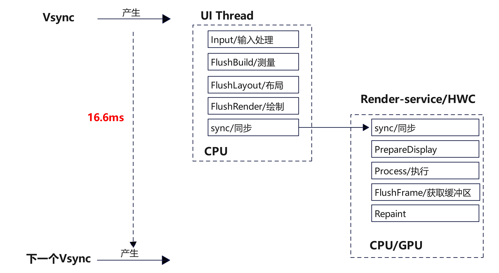
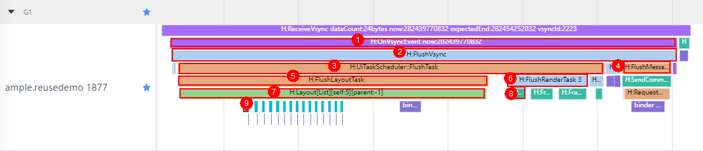
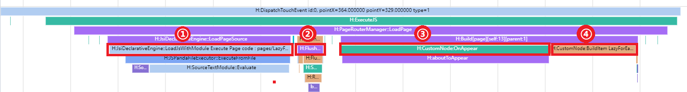
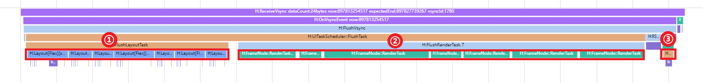
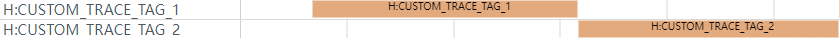

# 常用Trace使用指导

## 概述

OpenHarmony的DFX子系统提供了为应用框架以及系统底座核心模块的性能打点能力，每一处打点即是一个Trace，其上附带了记录执行时间、运行时格式化数据、进程或线程信息等。开发者可以使用[SmartPerf-Host调试工具](../../device-dev/device-test/smartperf-host.md)对Trace进行解析，在其绘制的泳道图中，对应用运行过程中的性能热点进行分析，得出优化方案。本文旨在介绍OpenHarmony中常用的Trace，解释它们的含义和用途，并阐述如何通过这些Trace来识别潜在的性能问题。同时，我们还将详细介绍Trace的工作原理，帮助读者更好地理解这些Trace及如何实现性能数据的采集和分析。通过本文的阅读，读者将对OpenHarmony中的Trace有一个深入的了解，为应用程序性能优化提供有力支持。

## 常用Trace及含义

下面将从渲染流程入手，配合常用场景介绍常用Trace。

### 渲染流程

与其他操作系统相同，OpenHarmony也是由Vsync信号控制每一帧绘制操作的时机。Vsync信号是一个垂直同步信号，它指示显示器在垂直空白期之后开始下一帧的刷新。设备的屏幕以固定的频率发送Vsync信号，以刷新率60Hz举例，则屏幕每隔16.6ms发送一次Vsync信号。在收到Vsync信号后，UI后端引擎开始准备屏幕的下一帧绘制，然后应用程序提交渲染命令，用于描述图形绘制、纹理设置、着色器使用等。一旦应用程序提交了渲染命令，UI后端引擎会将其添加到渲染队列中，并在合适的时机执行这些渲染命令，通常会在后台线程执行，以确保主线程不被长时间阻塞。当这些渲染命令被UI后端引擎执行时，它们会被传递给图形系统Render Service进行处理，图形系统会根据命令进行相应的图形计算和渲染操作，如顶点变换、光照、纹理贴图等。在图形系统完成渲染后，渲染结果将被写入帧缓冲区。帧缓冲区是一个内存区域，存储用于显示器输出的图像数据。一旦帧缓冲区更新完成，UI后端引擎会等待直到下一个Vsync信号到来，这个过程是为了确保渲染结果在显示器垂直消隐之前准备好。当下一个Vsync信号到来时，UI后端引擎将已经准备好的帧缓冲区的内容发送给显示器，显示器根据这些数据刷新自己的像素，至此完成一整个渲染周期。如图1所示。

**图1 渲染流程图**



从Trace角度来看，一帧的渲染流程如下：

（1）Vsync信号到达；

（2）UI后端引擎进行第一帧绘制；

（3）向Render Service通信，传输绘制命令并请求一帧；

（4）Render Service对多个图层进行合并，计算刷新区域，然后进行渲染和绘制本帧；

（5）完成一帧绘制后交给屏幕。

一帧的渲染流程中的UI后端引擎的常用Trace的含义如图2所示。

**图2 UI后端引擎渲染Trace泳道图**



| 序号  | **Trace**                               | **参数说明**         | **描述**                               |
|:--- | --------------------------------------- | ---------------- | ------------------------------------ |
| 1   | OnVsyncEvent now:%" PRIu64 "            | 当前时间戳--纳秒级       | 收到Vsync信号，渲染流程开始                     |
| 2   | FlushVsync                              |                  | 刷新视图同步事件，包括记录帧信息、刷新任务、绘制渲染上下文、处理用户输入 |
| 3   | UITaskScheduler::FlushTask              |                  | 刷新UI界面，包括布局、渲染和动画等                   |
| 4   | FlushMessages                           |                  | 发送消息通知图形侧进行渲染                        |
| 5   | FlushLayoutTask                         |                  | 执行布局任务                               |
| 6   | FlushRenderTask %zu                     | 当前页面上的需要渲染的节点的数量 | 总渲染任务执行                              |
| 7   | Layout                                  |                  | 节点布局                                 |
| 8   | FrameNode::RenderTask                   |                  | 单个渲染任务执行                             |
| 9   | ListLayoutAlgorithm::MeasureListItem:%d | 当前列表项索引          | 计算列表项的布局尺寸                           |

图形图像子系统中的Render Service，是负责界面内容绘制的部件，处理由各个应用提交的统一渲染任务，将不同应用渲染的图层进行合并、送显。在收到每个Vsync周期信号时，首先处理应用提交的指令，包括应用渲染树节点的新增、删除、修改，然后进行动画计算和遮挡计算，以上是为了对统一渲染树进行更新。接下来开始对渲染树执行绘制，首先预处理每个节点，计算绝对位置和脏区信息，然后针对脏区进行绘制，优先使用硬件合成器进行绘制，当遇到无法合成绘制的，交由GPU执行重绘，绘制的所有结果都将存入屏幕缓冲区，最后将绘制结果提交送显、上屏展示。

当Vysnc信号刷新时，如图3所示。

**图3 RS侧渲染Trace泳道图**


| 序号  | Trace                        | 描述           |
|:--- | ---------------------------- | ------------ |
| 1   | RSMainThread::DoComposition  | 合成渲染树上各节点图层  |
| 2   | RSMainThread::ProcessCommand | 处理client端指令  |
| 3   | Animate                      | 动画处理         |
| 4   | RSMainThread::CalcOcclusion  | 遮挡计算         |
| 5   | ProcessDisplayRenderNode[x]  | 单个显示器画面的绘制流程 |
| 6   | ProcessSurfaceNode:x         | 单个节点的合成器处理   |
| 7   | Repaint                      | 硬件合成器合成绘制    |
| 8   | Redraw                       | 无法进行合成，则执行重绘 |
| 9   | RenderFrame                  | GPU执行绘制      |
| 10  | SwapBuffers                  | 刷新屏幕缓冲区      |
| 11  | Commit                       | 绘制结果提交上屏     |

### 懒加载

懒加载使用LazyForEach实现，LazyForEach从提供的数据源中按需迭代数据，并在每次迭代过程中创建相应的组件。当LazyForEach在滚动容器中使用时，框架会根据滚动容器可视区域按需创建组件。当组件滑出可视区域外时，框架会进行组件销毁以降低内存占用。图4抓取的是懒加载过程中一帧的Trace。

**图4 懒加载Trace泳道图**


| **序号** | **Trace**                      | **参数说明**                               | **描述**                                           |
|:------ | ------------------------------ | -------------------------------------- | ------------------------------------------------ |
| 1      | OnIdle, targettime:%" PRId64 " | 时间戳，在这个时间之前完成该任务                       | idle事件循环中检查是否有新的事件需要处理，如果有，则将任务调度器加入UI线程中并执行预测任务 |
| 2      | expiringItem_ count:[%zu]      | 懒加载Item的个数                             | 预构建，包含处理所有懒加载项                                   |
| 3      | List predict                   |                                        | 添加预测布局任务                                         |
| 4      | Builder:BuildLazyItem [%d]     | 需创建的项目索引                               | 在需要时创建项，并进行缓存                                    |
| 5      | Layout[%s][self:%d][parent:%d] | tag标签，当前节点在UINode树中的索引，父节点在UINode树中的索引 | 当前帧节点布局                                          |
| 6      | Build[%s][self:%d][parent:%d]  | tag标签，当前节点在UINode树中的索引，父节点在UINode树中的索引 | 当前帧节点构建                                          |
| 7      | CustomNode:BuildRecycle %s     | JS视图名称                                 | 触发复用渲染                                           |
| 8      | ExecuteJS                      |                                        | 执行JS代码                                           |

### 页面加载

当触发页面加载时，OpenHarmony会创建一个新的页面实例，然后按照特定的程序调用页面的生命周期方法。在生命周期方法中加载页面的布局，然后将数据绑定到页面上的视图元素，使页面能够显示和更新数据。图5抓取的是页面加载中一帧的Trace。

**图5 页面加载帧Trace泳道图**


| **序号** | **Trace**                                                     | **参数说明**                               | **描述**                       |
|:------ | ------------------------------------------------------------- | -------------------------------------- | ---------------------------- |
| 1      | PageRouterManager::RunPage                                    |                                        | 页面路由预处理及加载页面                 |
| 2      | PageRouterManager::LoadPage                                   |                                        | 加载页面并路由                      |
| 3      | JsiDeclarativeEngine::LoadPageSource                          |                                        | 加载一个JavaScript文件并将其解析为ABC字节码 |
| 4      | JsiDeclarativeEngine::LoadJsWithModule Execute Page code : %s | 页面url地址                                | 执行页面代码                       |
| 5      | Build[%s][self:%d][parent:%d]                                 | tag标签，当前节点在UINode树中的索引，父节点在UINode树中的索引 | 当前帧节点构建                      |
| 6      | CustomNode:BuildItem %s                                       | JS视图名称                                 | 渲染子节点然后将其挂载到父节点上             |
| 7      | ViewChangeCallback(%d, %d)                                    | 视图宽，视图高                                | 视图变化回调                       |

## Trace实践

以下示例采用`LazyForEach`的方式遍历列表，并借助[SmartPerf-Host调试工具](../../device-dev/device-test/smartperf-host.md)追踪代码执行流程。
在[代码示例](https://gitee.com/openharmony/applications_app_samples/tree/master/code/Performance/PerformanceLibrary/feature/trace)中，使用一个List容器组件，通过懒加载方式来创建出120个IconView自定义组件。在IconView组件中，使用了Flex容器组件包含Image和Text子组件，形成了图文混合列表。

```ts
// src/main/ets/pages/LazyForEachPage.ets

@Entry
@Component
struct LazyForEachPage {
  private iconItemSourceList = new ListData();
  aboutToAppear() {
    // 添加120个IconItem的数据
    // ......
  }
  build() {
    Column() {
      Text('懒加载示例')
        .fontSize(24)
        .fontColor(Color.Black)
        .fontWeight(FontWeight.Bold)
        .textAlign(TextAlign.Start)
        .width('90%')
        .height(50)
      List({ space: 20 }) {
        LazyForEach(this.iconItemSourceList, (item: IconItemModel) => {
          ListItem() {
            IconItem({ image: item.image, text: item.text })
          }
        }, (item: IconItemModel, index) => index.toString())
      }
      .divider({ strokeWidth: 2, startMargin: 20, endMargin: 20 }) // 每行之间的分界线
      .width('100%')
      .height('100%')
      .layoutWeight(1)
    }
    .width('100%')
    .height('100%')
    .alignItems(HorizontalAlign.Center)
  }
}
```

```ts
// src/main/ets/view/IconView.ets

@Component
export struct IconItem {
  image: string | Resource = '';
  text: string | Resource = '';
  build() {
    Flex({ direction: FlexDirection.Row, justifyContent: FlexAlign.Center, alignContent: FlexAlign.Center }) {
      Image(this.image)
        .height(40)
        .width(40)
        .objectFit(ImageFit.Contain)
        .margin({
          left: 15
        })
      Text(this.text)
        .fontSize(20)
        .fontColor(Color.Black)
        .width(100)
        .height(50)
        .textAlign(TextAlign.Center)
    }
    .width('100%')
    .height(50)
  }
}
```

下面使用[SmartPerf-Host调试工具](../../device-dev/device-test/smartperf-host.md)抓取htrace文件，并生成一个跟踪泳道分析图，来了解示例代码的加载流程。跟踪泳道分析图被分为五个部分，每个部分都标注数字并框选出相应的标签，从而使得整体的过程能够得到更好的理解。

**图6 LazyForEach遍历的列表的泳道分析图**


接下来，逐一解析这五个模块的详情：

**1.加载并路由LazyForEach页面**

**图7 加载并路由LazyForEach页面泳道图**



**①** `H:JsiDeclarativeEngine::LoadPageSource`加载一个 JavaScript 文件，并且解析为 ABC 字节码；

**②** `H:FlushPipelineWithoutAnimation` 清理渲染管道的操作；

**③** `H:CustomNode:OnAppear` 用于构建当前 OnAppear 生命周期的操作，并执行aboutToAppear生命周期函数；

**④** `H:CustomNode:BuildItem LazyForEachPage` 渲染子节点并挂载在 LazyForEachPage 页面上。

**2.对当前帧节点Stage，执行布局任务、执行渲染任务并通知图形侧进行渲染**

**图8 对当前帧节点Stage，执行布局任务、执行渲染任务并通知图形侧进行渲染泳道图**


**①** `H:Layout[stage][self:1][parent:0]` 对当前帧节点Stage，执行布局任务；(Stage作为框架，承载着页面Page节点。因此，标签的呈现会从Stage开始)
   - `H:Measure[%s][self:17][parent:16]` 对Page、Column、Row、Image、Text等组件布局尺寸计算；
   - `H:Builder:BuildLazyItem [0]`和`H:ListLayoutAlgorithm::MeasureListItem:0` 分别为创建一个LazyItem项目和计算列表项的布局尺寸；
   - `H:Layout[%s][self:38][parent:37]` 对Page、Column、Row、Image、Text等组件执行布局任务；

**②** `H:FrameNode::RenderTask` 执行渲染任务；

**③** `H:RequestNextVSync` 请求下一帧Vsync信号。

**3.对当前帧节点Flex，执行布局任务、执行渲染任务并通知图形侧进行渲染**

**图9 对当前帧节点Flex，执行布局任务、执行渲染任务并通知图形侧进行渲染泳道图**



**①** `H:Layout[Flex][self:63][parent:62]`对当前帧节点Flex，执行布局任务；
  - `H:Measure[%s][self:17][parent:16]` 对Image、Text等组件布局尺寸计算；

**②** `H:FrameNode::RenderTask` Flex渲染任务执行；

**③** `H:RequestNextVSync` 请求下一帧Vsync信号。

**4.构建前预处理数据及添加预测布局任务**

**图10 构建前预处理数据及添加预测布局任务泳道图**


**①** `H:Builder:BuildLazyItem [11]`构建前预处理数据了11条数据；

**②** `H:Layout[ListItem][self:76][parent:-1]` 添加一条Flex、Image、Text的预测布局；

**③** `H:FlushMessages` 发送消息通知图形侧进行渲染。

**5.合成渲染树上各节点图层任务**

**图11 合成渲染树上各节点图层任务泳道图**


**①** `H:AcquireBuffer`、`H:ProcessSurfaceNode:EntryView XYWH[0 0 720 1280]`获取屏幕缓冲区并绘制EntryView、SystemUi_StatusBar、SystemUi_NavigationBar等；

**②** `H:Repaint` 硬件合成器合成绘制当前节点树。

## 自定义Trace

开发者可以根据业务需求，使用hiTraceMeter进行自定义Trace打点跟踪，目前支持ArkTS和Native，具体使用细节可参考下方链接：

> [性能打点跟踪开发指导（ArkTS）](../dfx/hitracemeter-guidelines-arkts.md)
> [性能打点跟踪开发指导（Native）](../dfx/hitracemeter-guidelines-ndk.md)

添加自定义Trace后，可在[SmartPerf-Host调试工具](../../device-dev/device-test/smartperf-host.md)上查看，自定义Trace将以独立泳道的形式呈现在对应打点的进程下。
下图两条泳道使用了startTrace和finishTrace方法，表示程序运行过程中，指定标签从调用startTrace到调用finishTrace的耗时统计。图中记录了CUSTOM_TRACE_TAG_1和CUSTOM_TRACE_TAG_2两个标签，先后呈现了2个标签的耗时统计。

**图12 自定义Trace示例**



下图两条泳道使用了TraceByValue方法，表示程序运行过程中，指定Trace在对应时间段内的状态值，状态值含义可按需传参，开发者可以通过鼠标放置在对应数据块上，来查看具体的状态值。图中记录了CUSTOM_TRACE_TAG_2标签在红色方框标识的时间段内，打点状态值为2001。

**图13 自定义状态值示例**


## 性能打点原理

Trace的生成依赖了DFX子系统中的HiTrace组件，其中包含的hiTraceMeter模块为开发者提供系统性能打点接口，具体细节可参考下方链接：

> [HiTrace组件](https://gitee.com/openharmony/hiviewdfx_hitrace)
> [hiTraceMeter模块](../reference/apis-performance-analysis-kit/capi-trace-h.md)

hiTraceMeter拥有两套开始和结束打点接口，实现对逻辑行为的耗时统计。由于耗时统计大多数以方法为单位，所以hiTraceMeter也提供了快速打点单个方法执行耗时的宏定义HITRACE_METER、HITRACE_METER_NAME、HITRACE_METER_FMT，使用它们，只需要在方法起始位置调用即可。这些宏定义依赖了方法内局部变量的生命周期，其原理是在方法开始时构造了一个打点实例，在实例构造函数中调用开始打点接口，当方法执行完毕，打点实例随着方法结束而执行析构，在实例析构函数中调用结束打点接口。

### App中的打点示例

ArkUI框架子系统应用hiTraceMeter的例子，来源于[ArkUI开发框架](https://gitee.com/openharmony/arkui_ace_engine)源码。
以下代码对hiTraceMeter进行接口封装，其原理与HITRACE_METER等相同，依赖方法内局部变量的生命周期实现快速打点。

```cpp
// frameworks/base/log/ace_trace.h

#define ACE_SCOPED_TRACE(fmt, ...) AceScopedTrace aceScopedTrace(fmt, ##__VA_ARGS__)
#define ACE_FUNCTION_TRACE() ACE_SCOPED_TRACE(__func__)

class ACE_FORCE_EXPORT AceScopedTrace final {
public:
    explicit AceScopedTrace(const char* format, ...) __attribute__((__format__(printf, 2, 3)));
    ~AceScopedTrace();

    ACE_DISALLOW_COPY_AND_MOVE(AceScopedTrace);

private:
    bool traceEnabled_ { false };
};
```

以下代码是刷新视图同步事件，包括记录帧信息、刷新任务、绘制渲染上下文、处理用户输入。在方法开头调用宏定义ACE_FUNCTION_TRACE，将函数名FlushVsync作为Trace名称记录下来，并记录函数开始时间，在函数结束时记录函数结束时间，得出执行耗时。

```cpp
// frameworks/core/pipeline/pipeline_context.cpp

void PipelineContext::FlushVsync(uint64_t nanoTimestamp, uint32_t frameCount)
{
    ACE_FUNCTION_TRACE();

    // 此处省略方法内的其他业务逻辑
    // ...
}
```

### RS中的打点示例

图形子系统应用hiTraceMeter的例子，来源于[图形子系统](https://gitee.com/openharmony/graphic_graphic_2d)源码。
以下代码对hiTraceMeter进行接口封装。

```cpp
// utils/log/rs_trace.h

#include "hitrace_meter.h"
#define ROSEN_TRACE_BEGIN(tag, name) StartTrace(tag, name)
#define RS_TRACE_BEGIN(name) ROSEN_TRACE_BEGIN(HITRACE_TAG_GRAPHIC_AGP, name)
#define ROSEN_TRACE_END(tag) FinishTrace(tag)
#define RS_TRACE_END() ROSEN_TRACE_END(HITRACE_TAG_GRAPHIC_AGP)
#define RS_TRACE_NAME(name) HITRACE_METER_NAME(HITRACE_TAG_GRAPHIC_AGP, name)
#define RS_TRACE_NAME_FMT(fmt, ...) HITRACE_METER_FMT(HITRACE_TAG_GRAPHIC_AGP, fmt, ##__VA_ARGS__)
#define RS_ASYNC_TRACE_BEGIN(name, value) StartAsyncTrace(HITRACE_TAG_GRAPHIC_AGP, name, value)
#define RS_ASYNC_TRACE_END(name, value) FinishAsyncTrace(HITRACE_TAG_GRAPHIC_AGP, name, value)
#define RS_TRACE_INT(name, value) CountTrace(HITRACE_TAG_GRAPHIC_AGP, name, value)
#define RS_TRACE_FUNC() RS_TRACE_NAME(__func__)
```

以下代码在显示器画面绘制方法。在方法开头调用宏定义RS_TRACE_NAME，将函数名ProcessDisplayRenderNode与对应的显示器id组合后，作为Trace名称记录下来，同时由于其本质是使用了快速打点单个方法的宏定义HITRACE_METER_NAME，于是只需要调用一次，即可收集到ProcessDisplayRenderNode函数的执行起终点时间，得出执行耗时。

```cpp
// rosen/modules/render_service/core/pipeline/rs_surface_capture_task.cpp

void RSSurfaceCaptureVisitor::ProcessDisplayRenderNode(RSDisplayRenderNode &node)
{
    RS_TRACE_NAME("RSSurfaceCaptureVisitor::ProcessDisplayRenderNode:" +
        std::to_string(node.GetId()));

    // 此处省略方法内的其他业务逻辑
    // ...
}
```