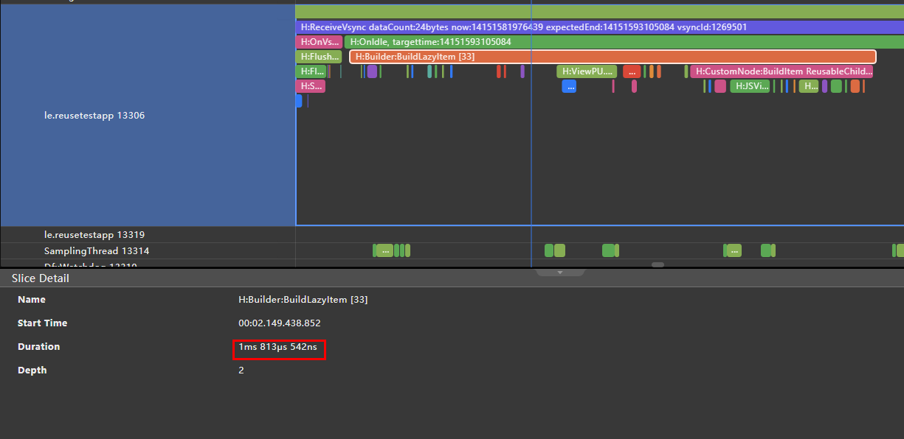

# 组件复用实践

若开发者的应用中存在以下场景，并成为UI线程的帧率瓶颈，应该考虑使用组件复用机制提升应用性能：

1. 滑动场景下对同一类自定义组件的实例进行频繁的创建与销毁。
2. 反复切换条件渲染的控制分支，且控制分支中的组件子树结构比较复杂。

组件复用生效的条件是：

1. 自定义组件被@Reusable装饰器修饰，即表示其具备组件复用的能力。
2. 在一个自定义组件（父）下创建出来的具备组件复用能力的自定义组件（子），在可复用自定义组件从组件树上移除之后，会被加入到其父自定义组件的可复用组件缓存中。
3. 在一个自定义组件（父）下创建可复用的子组件时，若可复用子节点缓存中有对应类型的可复用子组件的实例，会通过更新可复用子组件的方式，快速创建可复用子组件。

## 约束限制

1. @Reusable标识自定义组件具备可复用的能力，它可以被添加到任意的自定义组件上，但是开发者需要小心处理自定义组件的**创建流程**和**更新流程**以确保自定义组件在复用之后能展示出正确的行为。
2. 可复用自定义组件的缓存和复用只能发生在同一父组件下，无法在不同的父组件下复用同一自定义组件的实例。例如，A组件是可复用组件，其也是B组件的子组件，并进入了B组件的可复用组件缓存中，但是在C组件中创建A组件时，无法使用B组件缓存的A组件。
3. @Reusable装饰器只需要对复用子树的根节点进行标记。例如：自定义组件A中有一个自定义子组件B，若需要复用A与B的子树，只需要对A组件添加@Reusable装饰器。
4. 可复用自定义组件中嵌套自定义组件，如果想要对嵌套的子组件的内容进行更新，需要实现对应子组件的aboutToReuse生命周期回调。例如：A组件是可复用的组件，B是A中嵌套的子组件，要想实现对A组件中的B组件内容进行更新，需要在B组件中实现aboutToReuse生命周期回调。
5. 自定义组件的复用带来的性能提升主要体现在节省了自定义组件的JS对象的创建时间并复用了自定义组件的组件树结构，若应用开发者在自定义组件复用的前后使用渲染控制语法显著的改变了自定义组件的组件树结构，那么将无法享受到组件复用带来的性能提升。
6. 组件复用仅发生在存在可复用组件从组件树上移除并再次加入到组件树的场景中，若不存在上述场景，将无法触发组件复用。例如，使用ForEach渲染控制语法创建可复用的自定义组件，由于ForEach渲染控制语法的全展开属性，不能触发组件复用。
7. 组件复用当前不支持嵌套使用。即在可复用的组件的子树中存在可复用的组件，可能导致未定义的结果。

## 生命周期

可复用组件从C++侧的组件树上移除时，自定义组件在ArkUI框架native侧的CustomNode会被挂载到其对应的JSView上。复用发生之后，CustomNode被JSView引用，并触发ViewPU上的aboutToRecycle方法，ViewPU的实例将会被RecycleManager引用。

可复用组件从RecycleManager中重新加入组件树时，会调用前端ViewPU对象上的aboutToReuse生命周期回调。

## 接口说明

组件的生命周期回调，在可复用组件从复用缓存中加入到组件树之前调用，可在其中更新组件的状态变量以展示正确的内容，入参的类型与自定义组件的构造函数入参相同。

```ts
aboutToReuse?(params: { [key: string]: unknown }): void;
```

组件的生命周期回调，在可复用组件从组件树上被加入到复用缓存之前调用。

```ts
aboutToRecycle?(): void;
```

开发者可以使用reuseId为复用组件分配复用组，相同reuseId的组件会在同一个复用组中复用。

```ts
reuseId(id: string);
```

Reusable装饰器，用于声明组件具备可复用的能力。

```ts
declare const Reusable: ClassDecorator;
```

**示例：**

```ts
// xxx.ets
class MyDataSource implements IDataSource {
  private dataArray: string[] = [];
  private listener: DataChangeListener | undefined;

  public totalCount(): number {
    return this.dataArray.length;
  }

  public getData(index: number): string {
    return this.dataArray[index];
  }

  public pushData(data: string): void {
    this.dataArray.push(data);
  }

  public reloadListener(): void {
    this.listener?.onDataReloaded();
  }

  public registerDataChangeListener(listener: DataChangeListener): void {
    this.listener = listener;
  }

  public unregisterDataChangeListener(listener: DataChangeListener): void {
    this.listener = undefined;
  }
}

@Entry
@Component
struct MyComponent {
  private data: MyDataSource = new MyDataSource();

  aboutToAppear() {
    for (let i = 0; i < 1000; i++) {
      this.data.pushData(i.toString());
    }
  }

  build() {
    List({ space: 3 }) {
      LazyForEach(this.data, (item: string) => {
        ListItem() {
          ReusableChildComponent({ item: item })
        }
      }, (item: string) => item)
    }
    .width('100%')
    .height('100%')
  }
}

@Reusable
@Component
struct ReusableChildComponent {
  @State item: string = '';

  aboutToReuse(params: ESObject) {
    this.item = params.item;
  }

  build() {
    Row() {
      Text(this.item)
        .fontSize(20)
        .margin({ left: 10 })
    }.margin({ left: 10, right: 10 })
  }
}
```

## 相关实例

以下为购物片段示例代码，对比使用组件复用前后，应用侧创建自定义组件的收益以及前后的代码写法对比。

### 复用前后代码对比

**复用前：**

```ts
LazyForEach(this.GoodDataOne, (item, index) => {
  GridItem() {
    Column() {
      Image(item.img)
        .height(item.hei)
        .width('100%')
        .objectFit(ImageFit.Fill)

      Text(item.introduce)
        .fontSize(14)
        .padding({ left: 5, right: 5 })
        .margin({ top: 5 })
      Row() {
        Row() {
          Text('￥')
            .fontSize(10)
            .fontColor(Color.Red)
            .baselineOffset(-4)
          Text(item.price)
            .fontSize(16)
            .fontColor(Color.Red)
          Text(item.numb)
            .fontSize(10)
            .fontColor(Color.Gray)
            .baselineOffset(-4)
            .margin({ left: 5 })
        }

        Image($r('app.media.photo63'))
          .width(20)
          .height(10)
          .margin({ bottom: -8 })
      }
      .width('100%')
      .justifyContent(FlexAlign.SpaceBetween)
      .padding({ left: 5, right: 5 })
      .margin({ top: 15 })
    }
    .borderRadius(10)
    .backgroundColor(Color.White)
    .clip(true)
    .width('100%')
    .height(290)
  }
}, (item) => JSON.stringify(item))
```

**复用后：**

组件被复用后，ArkUI框架会将组件构造对应的参数输入给aboutToReuse生命周期回调，开发者需要在aboutToReuse生命周期中对需要进行更新的状态变量进行赋值，ArkUI框架将会基于最新的状态变量值对UI进行展示。

如果同一种自定义组件的不同实例之间存在较大的结构差异，建议使用reuseId对不同的自定义组件实例分别标注复用组，以达到最佳的复用效果。

如果一个自定义组件中，持有对某个大对象或者其他非必要资源的引用，可以在aboutToRecycle生命周期中释放，以免造成内存泄漏。

```ts
LazyForEach(this.GoodDataOne, (item, index) => {
  GridItem() {
    GoodItems({
      boo:item.data.boo,
      img:item.data.img,
      webimg:item.data.webimg,
      hei:item.data.hei,
      introduce:item.data.introduce,
      price:item.data.price,
      numb:item.data.numb,
      index:index
    })
    .reuseId(this.CombineStr(item.type))
  }
}, (item) => JSON.stringify(item))


@Reusable
@Component
struct GoodItems {
  @State img: Resource = $r("app.media.photo61");
  @State webimg?: string = '';
  @State hei: number = 0;
  @State introduce: string = '';
  @State price: string = '';
  @State numb: string = '';
  @LocalStorageLink('storageSimpleProp') simpleVarName: string = '';
  boo: boolean = true;
  index: number = 0;
  controllerVideo: VideoController = new VideoController();

  aboutToReuse(params)
  {
    this.webimg = params.webimg
    this.img = params.img
    this.hei = params.hei
    this.introduce = params.introduce
    this.price = params.price
    this.numb = params.numb
  }

  build() {
    // ...
  }
}
```

### 性能收益

通过DevEco Studio的profiler工具分析复用前后的组件创建时间，可以得到应用使能组件复用后的优化情况，组件创建的时间平均从1800us降低到了570us。




|                | 创建组件时间 |
| -------------- | ------------ |
| 不使能组件复用 | 1813us       |
| 使能组件复用   | 570us        |

## 开发建议

1.建议复用自定义组件时避免一切可能改变自定义组件的组件树结构和可能使可复用组件中产生重新布局的操作以将组件复用的性能提升到最高。

2.建议列表滑动场景下组件复用能力和LazyForEach渲染控制语法搭配使用以达到性能最优效果。

3.开发者需要区分好自定义组件的创建和更新过程中的行为，并注意到自定义组件的复用本质上是一种特殊的组件更新行为，组件创建过程中的流程与生命周期将不会在组件复用中发生，自定义组件的构造参数将通过aboutToReuse生命周期回调传递给自定义组件。例如，aboutToAppear生命周期和自定义组件的初始化传参将不会在组件复用中发生。

4.避免在aboutToReuse生命周期回调中产生耗时操作，最佳实践是仅在aboutToReuse中做自定义组件更新所需的状态变量值的更新。

5.避免在aboutToReuse中对@Link、@StorageLink、@ObjectLink、@Consume等自动更新值的状态变量进行更新，可能触发不必要的组件刷新。

6.避免使用函数作为复用的自定义组件创建时的入参：

由于在组件复用的场景下，每次复用都需要重新创建组件关联的数据对象，导致重复执行入参中的函数来获取入参结果。如果函数中存在耗时操作，会严重影响性能。正反例如下所示：

【反例】

```ts
// 下文中BasicDateSource是实现IDataSource接口的类，具体可参考LazyForEach用法指导
// 此处为复用的自定义组件
@Reusable
@Component
struct ChildComponent {
  @State desc: string = '';
  @State sum: number = 0;

  aboutToReuse(params: Record<string, Object>): void {
    this.desc = params.desc as string;
    this.sum = params.sum as number;
  }

  build() {
    Column() {
      Text('子组件' + this.desc)
        .fontSize(30)
        .fontWeight(30)
      Text('结果' + this.sum)
        .fontSize(30)
        .fontWeight(30)
    }
  }
}

@Entry
@Component
struct Reuse {
  private data: BasicDateSource = new BasicDateSource();

  aboutToAppear(): void {
    for (let index = 0; index < 20; index++) {
      this.data.pushData(index.toString());
    }
  }
    
  // 真实场景的函数中可能存在未知的耗时操作逻辑，此处用循环函数模拟耗时操作
  count(): number {
    let temp: number = 0;
    for (let index = 0; index < 10000; index++) {
      temp += index;
    }
    return temp;
  }

  build() {
    Column() {
      List() {
        LazyForEach(this.data, (item: string) => {
          ListItem() {
            // 此处sum参数是函数获取的，实际开发场景无法预料该函数可能出现的耗时操作，每次进行组件复用都会重复触发此函数的调用
            ChildComponent({ desc: item, sum: this.count() })
          }
          .width('100%')
          .height(100)
        }, (item: string) => item)
      }
    }
  }
}
```

上述反例操作中，复用的子组件参数sum是通过耗时函数生成。该函数在每次组件复用时都需要执行，会造成性能问题，甚至是列表滑动过程中的卡顿丢帧现象。

【正例】

```ts
// 下文中BasicDateSource是实现IDataSource接口的类，具体可参考LazyForEach用法指导
// 此处为复用的自定义组件
@Reusable
@Component
struct ChildComponent {
  @State desc: string = '';
  @State sum: number = 0;

  aboutToReuse(params: Record<string, Object>): void {
    this.desc = params.desc as string;
    this.sum = params.sum as number;
  }

  build() {
    Column() {
      Text('子组件' + this.desc)
        .fontSize(30)
        .fontWeight(30)
      Text('结果' + this.sum)
        .fontSize(30)
        .fontWeight(30)
    }
  }
}

@Entry
@Component
struct Reuse {
  private data: BasicDateSource = new BasicDateSource();
  @State sum: number = 0;

  aboutToAppear(): void {
    for (let index = 0; index < 20; index++) {
      this.data.pushData(index.toString());
    }
    // 执行该异步函数
    this.count();
  }

  // 模拟耗时操作逻辑
  async count() {
    let temp: number = 0;
    for (let index = 0; index < 10000; index++) {
      temp += index;
    }
    // 将结果放入状态变量中
    this.sum = temp;
  }

  build() {
    Column() {
      List() {
        LazyForEach(this.data, (item: string) => {
          ListItem() {
            // 子组件的传参通过状态变量进行
            ChildComponent({ desc: item, sum: this.sum })
          }
          .width('100%')
          .height(100)
        }, (item: string) => item)
      }
    }
  }
}
```

上述正例操作中，通过耗时函数count生成的结果不变，可以将其放到页面初始渲染时执行一次，将结果赋值给this.sum。在复用组件的参数传递时，通过this.sum来进行。
