# 组件复用总览

组件复用是优化用户界面性能，提升应用流畅度的一种核心策略，它通过复用已存在的组件节点而非创建新的节点，大幅度降低了因频繁创建与销毁组件带来的性能损耗，从而确保UI线程的流畅性与响应速度。组件复用针对的是自定义组件，只要发生了相同自定义组件销毁和再创建的场景，都可以使用组件复用。

本文系统地描述了六种复用类型及其应用场景，帮助开发者更好地理解和实施组件复用策略以优化应用性能。

关于组件复用的原理机制可以参考资料[组件复用原理机制](./component_recycle_case.md#组件复用原理机制)，便于理解本文内容。

## 复用类型总览

|复用类型|描述|复用思路|参考文档|
|:--:|--|--|--|
|**标准型**|复用组件之间布局完全相同|标准复用|[组件复用实践](./component-recycle.md)|
|**有限变化型**|复用组件之间有不同，但是类型有限|使用reuseId或者独立成两个自定义组件|[组件复用性能优化指导](./component_recycle_case.md)|
|**组合型**|复用组件之间有不同，情况非常多，但是拥有共同的子组件|将复用组件改为Builder，让内部子组件相互之间复用|[组合型组件复用指导](#组合型)|
|**全局型**|组件可在不同的父组件中复用，并且不适合使用@Builder|使用BuilderNode自定义复用组件池，在整个应用中自由流转|[全局自定义组件复用实现](./node_custom_component_reusable_pool.md)|
|**嵌套型**|复用组件的子组件的子组件存在差异|采用化归思想将嵌套问题转化为上面四种标准类型来解决|/|
|**无法复用型**|组件之间差别很大，规律性不强，子组件也不相同|不建议使用组件复用|/|

## 各个复用类型详解

下文为了方便描述，以一个滑动列表的场景为例，将要复用的自定义组件如ListItem的内容组件，叫做**复用组件**，把它子级的自定义组件叫做**子组件**，把**复用组件**上层的自定义组件叫做**父组件**。为了更直观，下面每一种复用类型都会通过简易的图形展示组件的布局方式，并且为了便于分辨，布局相同的子组件使用同一种形状表示。

### 标准型

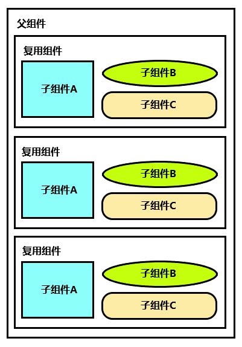

这是一个标准的组件复用场景，一个滚动容器内的复用组件布局相同，只有数据不同。这种类型的组件复用可以直接参考资料[组件复用实践](./component-recycle.md)。

**应用场景案例**


### 有限变化型

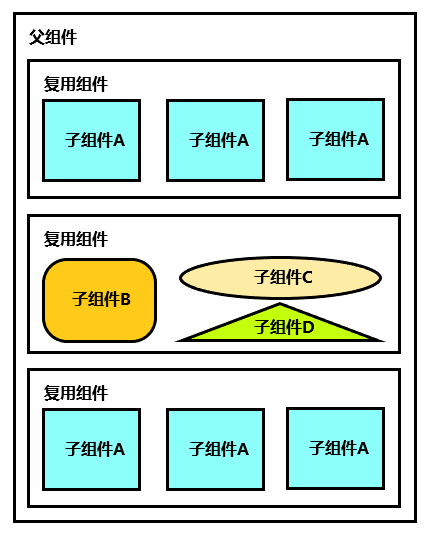

这种类型中复用组件之间存在不同，但是类型有限。如上图所示，容器内的复用组件内部的子组件不一样，但可总结为两种类型，类型 1由三个子组件 A 进行布局拼接而成，类型 2由子组件 B、子组件 C 和子组件 D 进行布局拼接而成。

此时存在以下两种应对措施：

- **类型1和类型2业务逻辑不同**：建议将两种类型的组件使用两个不同的自定义组件，分别进行复用。此时组件复用池内的状态如下图所示，复用组件 1 和复用组件 2 处于不同的复用 list 中。

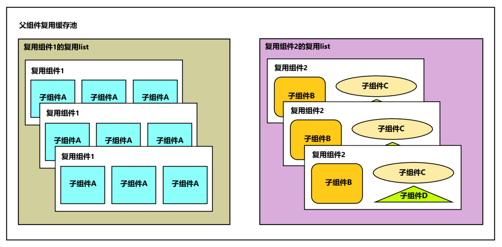

实现方式可参考以下示例代码：

```typescript
class MyDataSource implements IDataSource {
  // ...
}

@Entry
@Component
struct Index {
  private data: MyDataSource = new MyDataSource();

  aboutToAppear() {
    for (let i = 0; i < 1000; i++) {
      this.data.pushData(i);
    }
  }

  build() {
    Column() {
      List({ space: 10 }) {
        LazyForEach(this.data, (item: number) => {
          ListItem() {
            if (item % 2 === 0) {
              ReusableComponentOne({ item: item.toString() })
            } else {
              ReusableComponentTwo({ item: item.toString() })
            }
          }
          .backgroundColor(Color.Orange)
          .width('100%')
        }, (item: number) => item.toString())
      }
      .cachedCount(2)
    }
  }
}

@Reusable
@Component
struct ReusableComponentOne {
  @State item: string = '';

  aboutToReuse(params: ESObject) {
    this.item = params.item;
  }

  build() {
    Column() {
      Text(`Item ${this.item} ReusableComponentOne`)
        .fontSize(20)
        .margin({ left: 10 })
    }.margin({ left: 10, right: 10 })
  }
}

@Reusable
@Component
struct ReusableComponentTwo {
  @State item: string = '';

  aboutToReuse(params: ESObject) {
    this.item = params.item;
  }

  build() {
    Column() {
      Text(`Item ${this.item} ReusableComponentTwo`)
        .fontSize(20)
        .margin({ left: 10 })
    }.margin({ left: 10, right: 10 })
  }
}
```

- **类型1和类型2布局不同，但是很多业务逻辑相同**：在这种情况下，如果将组件分为两个自定义组件进行复用，会存在代码冗余问题。根据系统组件复用原理可知，复用组件是依据 reuseId 来区分复用缓存池的，而自定义组件的名称就是默认的 reuseId。因此，为复用组件显式设置两个 reuseId 与使用两个自定义组件进行复用，对于 ArkUI 而言，复用逻辑完全相同。此时组件复用池内的状态如下图所示。

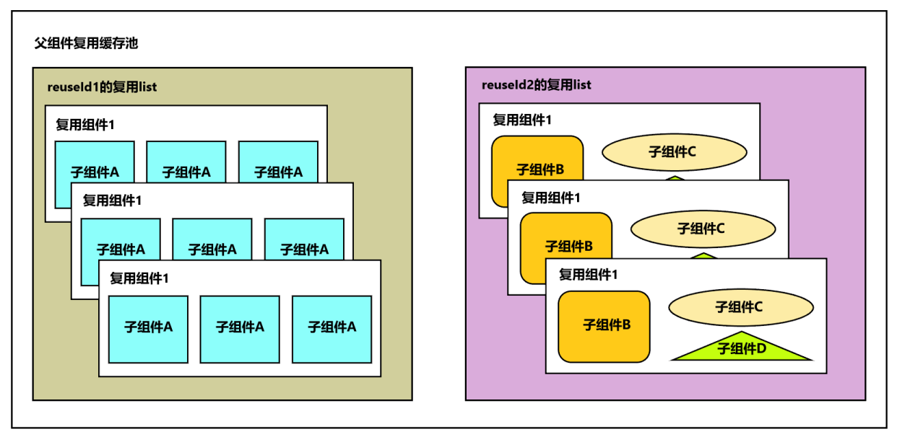

具体实现方式可以参考以下示例：

```typescript
class MyDataSource implements IDataSource {
  // ...
}

@Entry
@Component
struct Index {
  private data: MyDataSource = new MyDataSource();

  aboutToAppear() {
    for (let i = 0; i < 1000; i++) {
      this.data.pushData(i);
    }
  }

  build() {
    Column() {
      List({ space: 10 }) {
        LazyForEach(this.data, (item: number) => {
          ListItem() {
            ReusableComponent({ item: item })
              .reuseId(item % 2 === 0 ? 'ReusableComponentOne' : 'ReusableComponentTwo')
          }
          .backgroundColor(Color.Orange)
          .width('100%')
        }, (item: number) => item.toString())
      }
      .cachedCount(2)
    }
  }
}

@Reusable
@Component
struct ReusableComponent {
  @State item: number = 0;

  aboutToReuse(params: ESObject) {
    this.item = params.item;
  }

  build() {
    Column() {
      if (this.item % 2 === 0) {
        Text(`Item ${this.item} ReusableComponentOne`)
          .fontSize(20)
          .margin({ left: 10 })
      } else {
        Text(`Item ${this.item} ReusableComponentTwo`)
          .fontSize(20)
          .margin({ left: 10 })
      }
    }.margin({ left: 10, right: 10 })
  }
}
```

**应用场景案例**

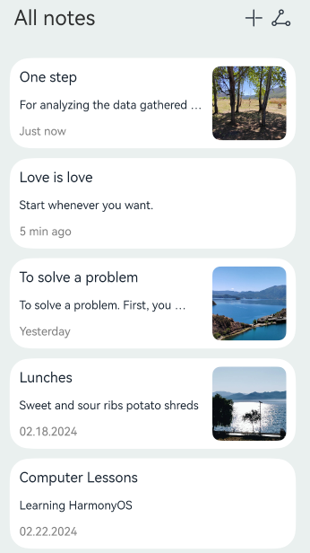

### 组合型

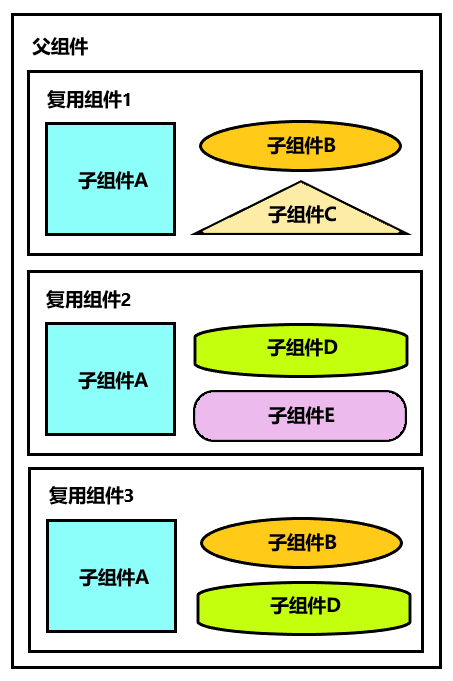

这种类型中复用组件之间存在不同，并且情况非常多，但拥有共同的子组件。如果使用有限变化型的组件复用方式，将所有类型的复用组件写成自定义组件分别复用，那么不同复用组件的复用 list 中相同的子组件之间不能互相复用。对此可以将复用组件转变为 Builder 函数，使复用组件内部共同的子组件的缓存池在父组件上共享。此时组件复用池内的状态如下图所示。

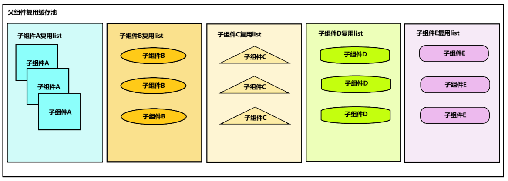

**反例**

下面是使用有限变化型组件复用的一段示例代码：

```typescript
class MyDataSource implements IDataSource {
  // ...
}

@Entry
@Component
struct MyComponent {
  private data: MyDataSource = new MyDataSource();

  aboutToAppear() {
    for (let i = 0; i < 1000; i++) {
      this.data.pushData(i.toString());
    }
  }

  build() {
    List({ space: 40 }) {
      LazyForEach(this.data, (item: string, index: number) => {
        ListItem() {
          if (index % 3 === 0) {
            ReusableComponentOne({ item: item })
          } else if (index % 5 === 0) {
            ReusableComponentTwo({ item: item })
          } else {
            ReusableComponentThree({ item: item })
          }
        }
        .backgroundColor('#cccccc')
        .width('100%')
        .onAppear(()=>{
          console.info(`ListItem ${index} onAppear`);
        })
      })
    }
    .width('100%')
    .height('100%')
    .cachedCount(0)
  }
}

@Reusable
@Component
struct ReusableComponentOne {
  @State item: string = '';

  // 组件的生命周期回调，在可复用组件从复用缓存中加入到组件树之前调用
  aboutToReuse(params: ESObject) {
    console.info(`ReusableComponentOne ${params.item} Reuse ${this.item}`);
    this.item = params.item;
  }

  // 组件的生命周期回调，在可复用组件从组件树上被加入到复用缓存之前调用
  aboutToRecycle(): void {
    console.info(`ReusableComponentOne ${this.item} Recycle`);
  }

  build() {
    Column() {
      ChildComponentA({ item: this.item })
      ChildComponentB({ item: this.item })
      ChildComponentC({ item: this.item })
    }
  }
}

@Reusable
@Component
struct ReusableComponentTwo {
  @State item: string = '';

  aboutToReuse(params: ESObject) {
    console.info(`ReusableComponentTwo ${params.item} Reuse ${this.item}`);
    this.item = params.item;
  }

  aboutToRecycle(): void {
    console.info(`ReusableComponentTwo ${this.item} Recycle`);
  }

  build() {
    Column() {
      ChildComponentA({ item: this.item })
      ChildComponentC({ item: this.item })
      ChildComponentD({ item: this.item })
    }
  }
}

@Reusable
@Component
struct ReusableComponentThree {
  @State item: string = '';

  aboutToReuse(params: ESObject) {
    console.info(`ReusableComponentThree ${params.item} Reuse ${this.item}`);
    this.item = params.item;
  }

  aboutToRecycle(): void {
    console.info(`ReusableComponentThree ${this.item} Recycle`);
  }

  build() {
    Column() {
      ChildComponentA({ item: this.item })
      ChildComponentB({ item: this.item })
      ChildComponentD({ item: this.item })
    }
  }
}

@Component
struct ChildComponentA {
  @State item: string = '';

  aboutToReuse(params: ESObject) {
    console.info(`ChildComponentA ${params.item} Reuse ${this.item}`);
    this.item = params.item;
  }

  aboutToRecycle(): void {
    console.info(`ChildComponentA ${this.item} Recycle`);
  }

  build() {
    Column() {
      Text(`Item ${this.item} Child Component A`)
        .fontSize(20)
        .margin({ left: 10 })
        .fontColor(Color.Blue)
      Grid() {
        ForEach((new Array(20)).fill(''), (item: string,index: number) => {
          GridItem() {
            Image($r('app.media.startIcon'))
              .height(20)
          }
        })
      }
      .columnsTemplate('1fr 1fr 1fr 1fr 1fr')
      .rowsTemplate('1fr 1fr 1fr 1fr')
      .columnsGap(10)
      .width('90%')
      .height(160)
    }
    .margin({ left: 10, right: 10 })
    .backgroundColor(0xFAEEE0)
  }
}

@Component
struct ChildComponentB {
  @State item: string = '';

  aboutToReuse(params: ESObject) {
    this.item = params.item;
  }

  build() {
    Row() {
      Text(`Item ${this.item} Child Component B`)
        .fontSize(20)
        .margin({ left: 10 })
        .fontColor(Color.Red)
    }.margin({ left: 10, right: 10 })
  }
}

@Component
struct ChildComponentC {
  @State item: string = '';

  aboutToReuse(params: ESObject) {
    this.item = params.item;
  }

  build() {
    Row() {
      Text(`Item ${this.item} Child Component C`)
        .fontSize(20)
        .margin({ left: 10 })
        .fontColor(Color.Green)
    }.margin({ left: 10, right: 10 })
  }
}

@Component
struct ChildComponentD {
  @State item: string = '';

  aboutToReuse(params: ESObject) {
    this.item = params.item;
  }

  build() {
    Row() {
      Text(`Item ${this.item} Child Component D`)
        .fontSize(20)
        .margin({ left: 10 })
        .fontColor(Color.Orange)
    }.margin({ left: 10, right: 10 })
  }
}
```

上述代码中由四个子组件按不同的排列组合组成了三种类型的复用组件。为了方便观察组件的缓存和复用情况，将 List 的 cachedCount 设置为0，并在部分自定义组件的生命周期函数中添加日志输出。其中重点观察子组件 ChildComponentA 的缓存和复用。

示例运行效果图如下：

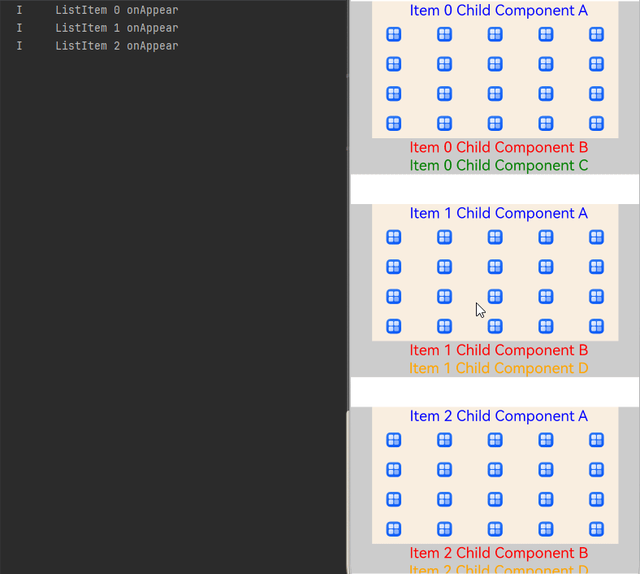

从上图可以看到，列表滑动到 ListItem 0 消失时，复用组件 ReusableComponentOne 和它的子组件 ChildComponentA 都加入了复用缓存。继续向上滑动时，由于 ListItem 4 与 ListItem 0 的复用组件不在同一个复用 list，因此 ListItem 4 的复用组件 ReusableComponentThree 和它的子组件依然会全部重新创建，不会复用缓存中的子组件 ChildComponentA。

此时 ListItem 4 中的子组件 ChildComponentA 的重新创建耗时 6ms387μs499ns。

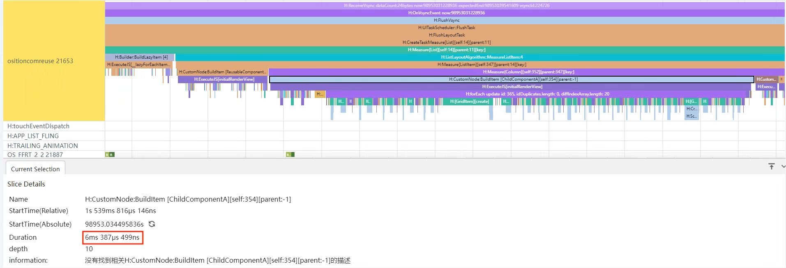

**正例**

按照组合型的组件复用方式，将上述示例中的三种复用组件转变为 Builder 函数后，内部共同的子组件就处于同一个父组件 MyComponent 下。对这些子组件使用组件复用时，它们的缓存池也会在父组件上共享，节省组件创建时的消耗。

修改后的示例代码：

```typescript
class MyDataSource implements IDataSource {
  // ...
}

@Entry
@Component
struct MyComponent {
  private data: MyDataSource = new MyDataSource();

  aboutToAppear() {
    for (let i = 0; i < 1000; i++) {
      this.data.pushData(i.toString())
    }
  }

  @Builder
  itemBuilderOne(item: string) {
    Column() {
      ChildComponentA({ item: item })
      ChildComponentB({ item: item })
      ChildComponentC({ item: item })
    }
  }

  @Builder
  itemBuilderTwo(item: string) {
    Column() {
      ChildComponentA({ item: item })
      ChildComponentC({ item: item })
      ChildComponentD({ item: item })
    }
  }

  @Builder
  itemBuilderThree(item: string) {
    Column() {
      ChildComponentA({ item: item })
      ChildComponentB({ item: item })
      ChildComponentD({ item: item })
    }
  }

  build() {
    List({ space: 40 }) {
      LazyForEach(this.data, (item: string, index: number) => {
        ListItem() {
          if (index % 3 === 0) {
            this.itemBuilderOne(item)
          } else if (index % 5 === 0) {
            this.itemBuilderTwo(item)
          } else {
            this.itemBuilderThree(item)
          }
        }
        .backgroundColor('#cccccc')
        .width('100%')
        .onAppear(() => {
          console.info(`ListItem ${index} onAppear`);
        })
      }, (item: number) => item.toString())
    }
    .width('100%')
    .height('100%')
    .cachedCount(0)
  }
}

@Reusable
@Component
struct ChildComponentA {
  @State item: string = '';

  aboutToReuse(params: ESObject) {
    console.info(`ChildComponentA ${params.item} Reuse ${this.item}`);
    this.item = params.item;
  }

  aboutToRecycle(): void {
    console.info(`ChildComponentA ${this.item} Recycle`);
  }

  build() {
    Column() {
      Text(`Item ${this.item} Child Component A`)
        .fontSize(20)
        .margin({ left: 10 })
        .fontColor(Color.Blue)
      Grid() {
        ForEach((new Array(20)).fill(''), (item: string,index: number) => {
          GridItem() {
            Image($r('app.media.startIcon'))
              .height(20)
          }
        })
      }
      .columnsTemplate('1fr 1fr 1fr 1fr 1fr')
      .rowsTemplate('1fr 1fr 1fr 1fr')
      .columnsGap(10)
      .width('90%')
      .height(160)
    }
    .margin({ left: 10, right: 10 })
    .backgroundColor(0xFAEEE0)
  }
}

@Reusable
@Component
struct ChildComponentB {
  @State item: string = '';

  aboutToReuse(params: ESObject) {
    this.item = params.item;
  }

  build() {
    Row() {
      Text(`Item ${this.item} Child Component B`)
        .fontSize(20)
        .margin({ left: 10 })
        .fontColor(Color.Red)
    }.margin({ left: 10, right: 10 })
  }
}

@Reusable
@Component
struct ChildComponentC {
  @State item: string = '';

  aboutToReuse(params: ESObject) {
    this.item = params.item;
  }

  build() {
    Row() {
      Text(`Item ${this.item} Child Component C`)
        .fontSize(20)
        .margin({ left: 10 })
        .fontColor(Color.Green)
    }.margin({ left: 10, right: 10 })
  }
}

@Reusable
@Component
struct ChildComponentD {
  @State item: string = '';

  aboutToReuse(params: ESObject) {
    this.item = params.item;
  }

  build() {
    Row() {
      Text(`Item ${this.item} Child Component D`)
        .fontSize(20)
        .margin({ left: 10 })
        .fontColor(Color.Orange)
    }.margin({ left: 10, right: 10 })
  }
}
```

示例运行效果图如下：


从效果图可以看出，每一个 ListItem 中的子组件 ChildComponentA 之间都可以触发组件复用。此时 ListItem 4 创建时，子组件 ChildComponentA 复用 ListItem 0 中的子组件 ChildComponentA ，复用仅耗时 864μs583ns。

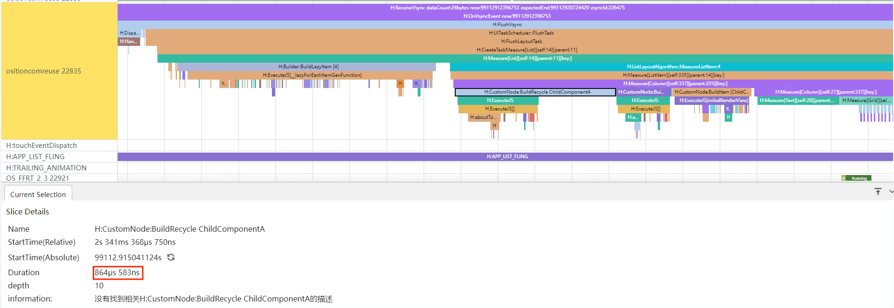

**应用场景案例**


### 全局型

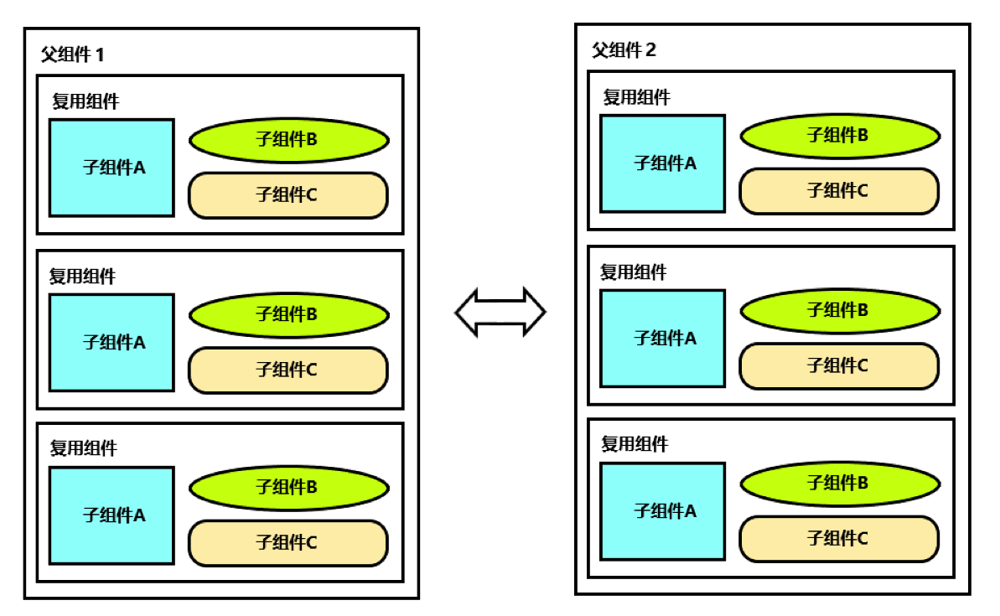

一些场景中组件需要在不同的父组件中复用，并且不适合改为Builder。如上图所示，有时候应用在多个tab页之间切换，tab页之间结构类似，需要在tab页之间复用组件，提升页面切换性能。或者有些应用在组合型场景下，由于复用组件内部含有带状态的业务逻辑，不适合改为Builder函数。

针对这种类型的组件复用场景，可以通过BuilderNode自定义缓存池，将要复用的组件封装在BuilderNode中，将BuilderNode的NodeController作为复用的最小单元，自行管理复用池。具体实现可以参考资料[全局自定义组件复用实现](./node_custom_component_reusable_pool.md)。

这种场景不适用系统自带的复用池，自行管理组件复用。

**应用场景案例**

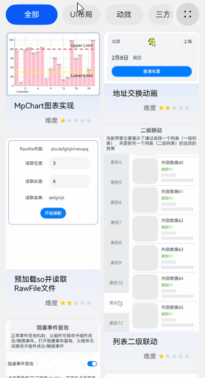

### 嵌套型

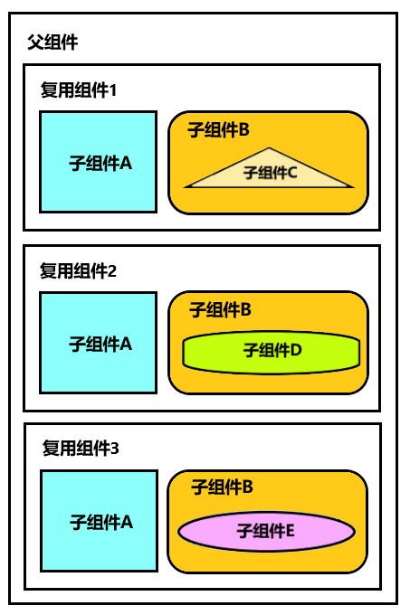

复用组件的子组件的子组件之间存在差异。可以运行化归的思想，将复杂的问题转化为已知的、简单的问题。

嵌套型实际上是上面四种类型的组件，以上图为例，可以通过有限变化型的方案，将子组件B变为子组件B1/B2/B3，这样问题就变成了一个标准的有限变化型。或者通过组合型的方案，将子组件B改为Builder，也可以将问题转化为一个标准有限变化型或者组合型的问题。

### 无法复用型

组件之间差别很大，规律性不强，子组件也不相同的组件之间进行复用。复用的含义就是重复使用相同布局的组件，布局完全不同的情况下，不建议使用组件复用。