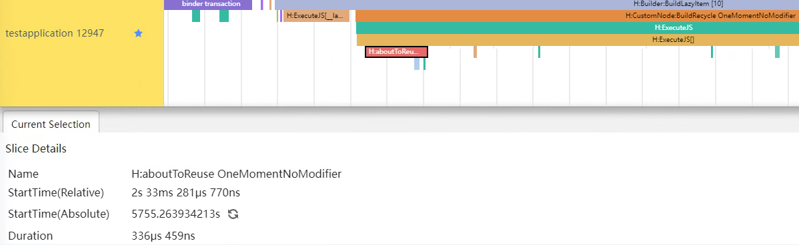
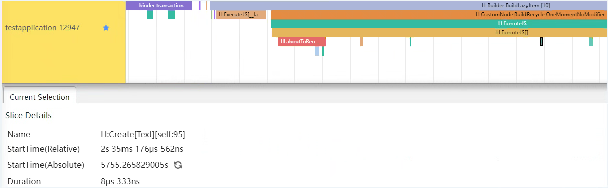
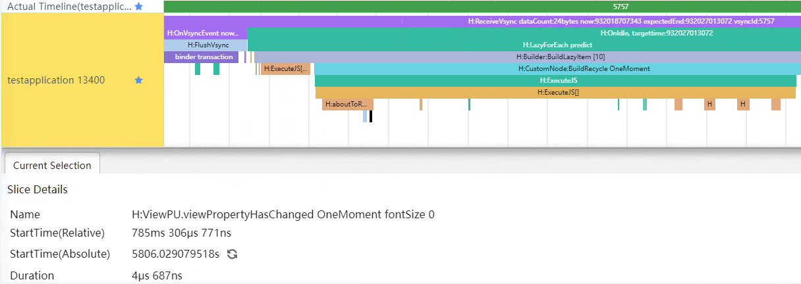
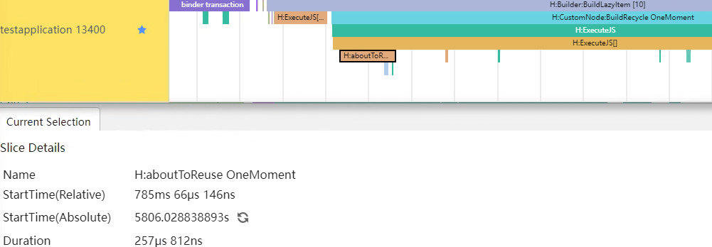
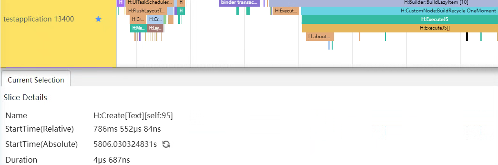
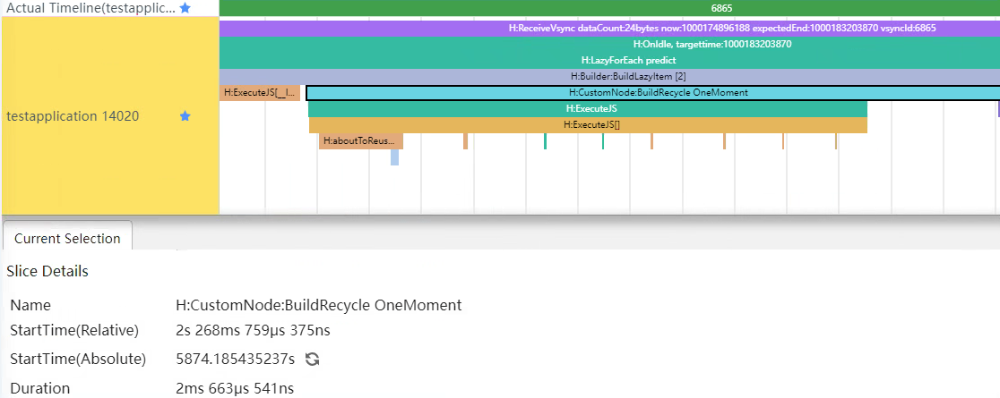
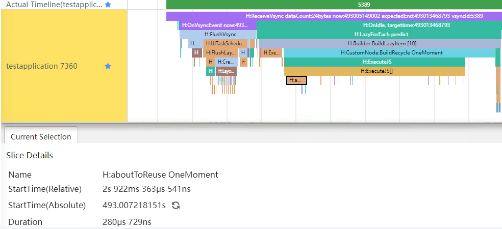

# 组件复用性能优化指导

## 概述

在滑动场景下，常常会对同一类自定义组件的实例进行频繁的创建与销毁。此时可以考虑通过组件复用减少频繁创建与销毁的能耗。组件复用时，可能存在许多影响组件复用效率的操作，本篇文章将重点介绍如何通过**组件复用性能优化四建议**提升复用性能。

组件复用性能优化四建议：

* **减少组件复用的嵌套层级**，如果在复用的自定义组件中再嵌套自定义组件，会存在节点构造的开销，且需要在每个嵌套的子组件中的aboutToReuse方法中实现数据的刷新，造成耗时。
* **优化状态管理，精准控制组件刷新范围**，在复用的场景下，需要控制状态变量的刷新范围，避免扩大刷新范围，降低组件复用的效率。
* **复用组件嵌套结构会变更的场景，使用reuseId标记不同结构的组件构成**，如：使用if else结构来控制组件的创建，会造成组件树结构的大幅变动，降低组件复用的效率。需使用reuseId标记不同的组件结构，提升复用性能。
* **不要使用函数/方法作为复用组件的入参**，复用时会触发组件的构造，如果函数入参中存在耗时操作，会影响复用性能。

## 组件复用原理机制


1. 如上图①中，ListItem N-1滑出可视区域**即将销毁**时，如果标记了@Reusable，就会进入这个自定义组件**所在父组件**的复用缓存区。需注意**在自定义组件首次显示时，不会触发组件复用**。后续创建新组件节点时，会复用缓存区中的节点，节约组件重新创建的时间。尤其是该复用组件具有相同的布局结构，仅有某些数据差异时，通过组件复用可以提高列表页面的加载速度和响应速度。

2. 如上图②中，**复用缓存池是一个Map套Array的数据结构，以reuseId为key**，具有相同reuseId的组件在同一个Array中。如未设置reuseId，则reuseId默认是自定义组件的名字。

3. 如上图③中，发生复用行为时，会自动递归调用复用池中取出的自定义组件的aboutToReuse回调，应用可以在这个时候刷新数据。

   

## 减少组件复用的嵌套层级

在组件复用场景下，过深的自定义组件的嵌套会增加组件复用的使用难度，比如需要逐个实现所有嵌套组件中aboutToReuse回调实现数据更新；因此推荐优先使用@Builder替代自定义组件，减少嵌套层级，利于维护切能提升页面加载速度。正反例如下：

反例：

```ts
@Entry
@Component
struct lessEmbeddedComponent {
  aboutToAppear(): void {
    getFriendMomentFromRawfile();
  }

  build() {
    Column() {
      List({ space: ListConstants.LIST_SPACE }) {
        LazyForEach(momentData, (moment: FriendMoment) => {
          ListItem() {
            OneMomentNoBuilder({moment: moment})
          }
        }, (moment: FriendMoment) => moment.id)
      }
      .cachedCount(Constants.CACHED_COUNT)
    }
  }
}

@Reusable
@Component
export struct OneMomentNoBuilder {
  @Prop moment: FriendMoment;
    
  // 无需对@Prop修饰的变量进行aboutToReuse赋值，因为这些变量是由父组件传递给子组件的。如果在子组件中重新赋值这些变量，会导致重用的组件的内容重新触发状态刷新，从而降低组件的复用性能。
  build() {
    ...
    // 在复用组件中嵌套使用自定义组件
    Row() {
        InteractiveButton({
          imageStr: $r('app.media.ic_share'),
          text: $r('app.string.friendMomentsPage_share')
        })
        Blank()
        InteractiveButton({
          imageStr: $r('app.media.ic_thumbsup'),
          text: $r('app.string.friendMomentsPage_thumbsup')
        })
        Blank()
        InteractiveButton({
          imageStr: $r('app.media.ic_message'),
          text: $r('app.string.friendMomentsPage_message')
        })
    }
    ...
  }
}

@Component
export struct InteractiveButton {
  @State imageStr: ResourceStr;
  @State text: ResourceStr;

  // 嵌套的组件中也需要实现aboutToReuse来进行UI的刷新
  aboutToReuse(params: Record<string, Object>): void {
    this.imageStr = params.imageStr as ResourceStr;
    this.text = params.text as ResourceStr;
  }

  build() {
    Row() {
      Image(this.imageStr)
      Text(this.text)
    }
    .alignItems(VerticalAlign.Center)
  }
}

```

上述反例的操作中，在复用的自定义组件中嵌套了新的自定义组件。ArkUI中使用自定义组件时，在build阶段将在在后端FrameNode树创建一个相应的CustomNode节点，在渲染阶段时也会创建对应的RenderNode节点。会造成组件复用下，CustomNode创建和和RenderNod渲染的耗时。且嵌套的自定义组件InteractiveButton，也需要实现aboutToReuse来进行数据的刷新。

正例：

```ts
@Entry
@Component
struct lessEmbeddedComponent {
  aboutToAppear(): void {
    getFriendMomentFromRawfile();
  }

  build() {
    Column() {
      TopBar()
      List({ space: ListConstants.LIST_SPACE }) {
        LazyForEach(momentData, (moment: FriendMoment) => {
          ListItem() {
            OneMoment({moment: moment})
          }
        }, (moment: FriendMoment) => moment.id)
      }
      .cachedCount(Constants.CACHED_COUNT)
    }
  }
}

@Reusable
@Component
export struct OneMoment {
  @Prop moment: FriendMoment;

  build() {
    ...
    // 使用@Builder，可以减少自定义组件创建和渲染的耗时
    Row() {
        interactiveButton({
          imageStr: $r('app.media.ic_share'),
          text: $r('app.string.friendMomentsPage_share')
        })
        Blank()
        interactiveButton({
          imageStr: $r('app.media.ic_thumbsup'),
          text: $r('app.string.friendMomentsPage_thumbsup')
        })
        Blank()
        interactiveButton({
          imageStr: $r('app.media.ic_message'),
          text: $r('app.string.friendMomentsPage_message')
        })
    }
    ...
  }
}

class Temp {
  imageStr: ResourceStr = '';
  text: ResourceStr = '';
}

@Builder
export function interactiveButton($$: Temp) {
  Row() {
    // 此处使用`${}`来进行按引用传递，让@Builder感知到数据变化，进行UI刷新
    Image($$.imageStr)
    Text($$.text)
  }
}
```

上述正例的操作中，在复用的自定义组件中用@Builder来代替了自定义组件。避免了CustomNode节点创建和RenderNode渲染的耗时。

**优化效果**

在正反例中，针对列表滑动场景中单个列表项中的三个交互按钮，反例中采用了自定义组件方式实现，正例中采用了自定义构建函数方式实现。

优化前，以11号列表项复用过程为例，观察Trace信息，看到该过程中需要逐个实现所有嵌套组件InteractiveButton中aboutToReuse回调，导致复用时间较长，BuildLazyItem耗时7ms。


优化后，11号列表项复用时，不再需要需要逐个实现所有嵌套组件中aboutToReuse回调，BuildLazyItem耗时3ms。可见该示例中，BuildLazyItem优化大约4ms。


所以，Trace数据证明，优先使用@Builder替代自定义组件，减少嵌套层级，可以利于维护切能提升页面加载速度。

## 优化状态管理，精准控制组件刷新范围使用

### 1.使用attributeModifier精准控制组件属性的刷新，避免组件不必要的属性刷新

复用场景常用在高频的刷新场景，精准控制组件的刷新范围可以有效减少主线程渲染负载，提升滑动性能。正反例如下：

反例：

```ts
@Entry
@Component
struct lessEmbeddedComponent {
  aboutToAppear(): void {
    getFriendMomentFromRawfile();
  }

  build() {
    Column() {
      TopBar()
      List({ space: ListConstants.LIST_SPACE }) {
        LazyForEach(momentData, (moment: FriendMoment) => {
          ListItem() {
            OneMomentNoModifier({moment: moment, fontSize: moment.size})
          }
        }, (moment: FriendMoment) => moment.id)
      }
      .cachedCount(Constants.CACHED_COUNT)
    }
  }
}

@Reusable
@Component
export struct OneMomentNoModifier {
  @Prop moment: FriendMoment;
  @State fontSize: number | Resource = $r('app.integer.list_history_userText_fontSize');

  aboutToReuse(params: Record<string, Object>): void {
    this.fontSize = params.fontSize as number;
  }
    
  build() {
    Column() {
      ...
      Text(`${this.moment.userName}`)
      Text(this.moment.text)
        .textAlign(TextAlign.Center)
        .fontStyle(FontStyle.Normal)
        .fontSize(this.fontSize) // 此处使用属性直接进行刷新，会造成Text所有属性都刷新
        .fontColor($r('app.color.title_font_color'))
        .lineHeight($r('app.integer.list_history_userText_line_height'))
        .opacity($r('app.float.opacity_zero_point_six'))
        .margin({ top: $r('app.integer.list_history_userText_margin_top') })
        .fontWeight(30)
        .clip(false)
        .backgroundBlurStyle(BlurStyle.NONE)
        .foregroundBlurStyle(BlurStyle.NONE)
        .borderWidth(1)
        .borderColor(Color.Pink)
        .borderStyle(BorderStyle.Solid)
        .alignRules({
          'top': { 'anchor': '__container__', 'align': VerticalAlign.Top },
          'left': { 'anchor': 'image', 'align': HorizontalAlign.End }
        })
      ...
    }
  }
}
```

上述反例的操作中，通过aboutToReuse对fontSize状态变量更新，进而导致组件的全部属性进行刷新，造成不必要的耗时。可以考虑对需要更新的组件的属性，进行精准刷新，避免不必要的重绘和渲染。

正例：

```ts
export class MyTextModifier implements AttributeModifier<TextAttribute> {
  private fontSize: number | Resource = $r('app.integer.list_history_userText_fontSize');
  private static instance: MyTextModifier;

  constructor() {
  }

  // 采用单例模式，避免为每个组件都创建一个新的修改器，增加创建产生的性能开销
  public static getInstance(): MyTextModifier {
    if (MyTextModifier.instance) {
      return MyTextModifier.instance;
    } else {
      return new MyTextModifier();
    }
  }

  setFontSize(fontSize: number | Resource) {
    this.fontSize = fontSize;
  }
  
  applyNormalAttribute(instance: TextAttribute): void {
    instance.textAlign(TextAlign.Center)
    instance.fontStyle(FontStyle.Normal)
    instance.fontSize(this.fontSize) // 差异化更新
    instance.fontColor($r('app.color.title_font_color'))
    instance.lineHeight($r('app.integer.list_history_userText_line_height'))
    instance.opacity($r('app.float.opacity_zero_point_six'))
    instance.margin({ top: $r('app.integer.list_history_userText_margin_top') })
    instance.fontWeight(30)
    instance.clip(false)
    instance.backgroundBlurStyle(BlurStyle.NONE)
    instance.foregroundBlurStyle(BlurStyle.NONE)
    instance.borderWidth(1)
    instance.borderColor(Color.Pink)
    instance.borderStyle(BorderStyle.Solid)
    instance.alignRules({
      'top': { 'anchor': '__container__', 'align': VerticalAlign.Top },
      'left': { 'anchor': 'image', 'align': HorizontalAlign.End }
    })
  }
}

@Entry
@Component
struct lessEmbeddedComponent {
  aboutToAppear(): void {
    getFriendMomentFromRawfile();
  }

  build() {
    Column() {
      TopBar()
      List({ space: ListConstants.LIST_SPACE }) {
        LazyForEach(momentData, (moment: FriendMoment) => {
          ListItem() {
            OneMomentNoModifier({moment: moment, fontSize: moment.size})
          }
        }, (moment: FriendMoment) => moment.id)
      }
      .cachedCount(Constants.CACHED_COUNT)
    }
  }
}

@Reusable
@Component
export struct OneMomentNoModifier {
  @Prop moment: FriendMoment;
  @State fontSize: number | Resource = $r('app.integer.list_history_userText_fontSize');
  textModifier: MyTextModifier = MyTextModifier.getInstance();

  aboutToReuse(params: Record<string, Object>): void {
    this.fontSize = params.fontSize as number;
    this.textModifier.setFontSize(this.fontSize);
  }

  build() {
    Column() {
      ...
      Text(`${this.moment.userName}`)
      Text(this.moment.text)
        // 采用attributeModifier来对需要更新的fontSize属性进行精准刷新，避免不必要的属性刷新。
        .attributeModifier(this.textModifier)
      ...
     }
  }
}
```

上述正例的操作中，通过attributeModifier属性来对Text组件需要刷新的fontSize属性进行精准刷新，避免Text其它不需要更改的属性的刷新。

**优化效果**

在正反例中，针对列表滑动场景中，单个列表项中Text组件字体大小属性的修改，反例中采用了普通组件属性刷新方式实现，正例中采用了attributeModifier动态属性设置方式实现。

优化前，由`viewPropertyHasChanged OneMomentNoModifier fontSize 1`标签可知，OneMomentNoModifier自定义组件下的状态变量fontSize发生变化，与之相关联的子控件数量为1，即有一个子控件发生了标脏，之后Text全部属性会进行了刷新。


此时，aboutToReuse的耗时，为336μs，Create[Text]耗时为8μs。





在优化后，由`viewPropertyHasChanged OneMomentNoModifier fontSize 0`标签可知，OneMomentNoModifier自定义组件下的状态变量fontSize发生变化，与之相关联的子控件数量为0，即Text没有走常规的标脏，不会刷新全部属性。



优化后的aboutToReuse的耗时，缩短到了257μs，Create[Text]耗时缩短为4μs。





所以，Trace数据证明，精准控制组件的刷新范围可以有效减少主线程渲染负载，提升滑动性能。

说明：因为示例中仅涉及一个Text组件的属性更新，所以优化时间绝对值较小。如果涉及组件较多，性能提升会更明显。

### 2.使用@Link/@ObjectLink替代@Prop减少深拷贝，提升组件创建速度

在父子组件数据同步时，如果仅仅是需要父组件向子组件同步数据，不存在修改子组件的数据变化不同步给父组件的需求。建议使用@Link/@ObjectLink替代@Prop，@Prop在装饰变量时会进行深拷贝，在拷贝的过程中除了基本类型、Map、Set、Date、Array外，都会丢失类型。正反例如下：

反例：

```ts
@Entry
@Component
struct lessEmbeddedComponent {
  aboutToAppear(): void {
    getFriendMomentFromRawfile();
  }

  build() {
    Column() {
      TopBar()
      List({ space: ListConstants.LIST_SPACE }) {
        LazyForEach(momentData, (moment: FriendMoment) => {
          ListItem() {
            OneMoment({moment: moment})
          }
        }, (moment: FriendMoment) => moment.id)
      }
      .cachedCount(Constants.CACHED_COUNT)
    }
  }
}

@Reusable
@Component
export struct OneMoment {
  @Prop moment: FriendMoment;
    
  build() {
    Column() {
      ...
      Text(`${this.moment.userName}`)
      ...
    }
  }
}

export const momentData: FriendMomentsData = new FriendMomentsData(); 
    
export class FriendMoment {
  id: string; 
  userName: string; 
  avatar: string; 
  text: string; 
  size: number; 
  image?: string; 

  constructor(id: string, userName: string, avatar: string, text: string, size: number, image?: string) {
    this.id = id;
    this.userName = userName;
    this.avatar = avatar;
    this.text = text;
    this.size = size;
    if (image !== undefined) {
      this.image = image;
    }
  }
}
```

上述反例的操作中，父子组件之间的数据同步用了@Prop来进行，各@Prop装饰的变量在初始化时都在本地拷贝了一份数据。会增加创建时间及内存的消耗，造成性能问题。

正例：

```ts
@Entry
@Component
struct lessEmbeddedComponent {
  @State momentData: FriendMomentsData = new FriendMomentsData();
  aboutToAppear(): void {
    getFriendMomentFromRawfile();
  }

  build() {
    Column() {
      TopBar()
      List({ space: ListConstants.LIST_SPACE }) {
        LazyForEach(momentData, (moment: FriendMoment) => {
          ListItem() {
            OneMoment({moment: moment})
          }
        }, (moment: FriendMoment) => moment.id)
      }
      .cachedCount(Constants.CACHED_COUNT)
    }
  }
}

@Reusable
@Component
export struct OneMoment {
  @ObjectLink moment: FriendMoment;
    
  build() {
    Column() {
      ...
      Text(`${this.moment.userName}`)
      ...
    }
  }
}
    
@Observed
export class FriendMoment {
  id: string; 
  userName: string; 
  avatar: string; 
  text: string; 
  size: number; 
  image?: string; 

  constructor(id: string, userName: string, avatar: string, text: string, size: number, image?: string) {
    this.id = id;
    this.userName = userName;
    this.avatar = avatar;
    this.text = text;
    this.size = size;
    if (image !== undefined) {
      this.image = image;
    }
  }
}
```

上述正例的操作中，父子组件之间的数据同步用了@ObjectLink来进行，子组件@ObjectLink包装类把当前this指针注册给父组件，会直接将父组件的数据同步给子组件，实现父子组件数据的双向同步，降低子组件创建时间和内存消耗。

**优化效果**

在正反例中，针对列表滑动场景，单个列表项中Text组件字体大小属性的修改，反例中采用了普通组件属性刷新方式实现，正例中采用了attributeModifier动态属性设置方式实现。

优化前，子组件在初始化时都在本地拷贝了一份数据，BuildItem耗时7ms175μs。


优化后，子组件直接同步父组件数据，无需深拷贝，BuildItem耗时缩短为7ms1μs。


所以，Trace数据证明，使用@Link/@ObjectLink替代@Prop减少深拷贝，可以提升组件创建速度。

说明：因为示例中仅涉及一个简单对象FriendMoment的深拷贝，所以优化时间绝对值较小。如果涉及变量较多、对象较复杂，性能提升会更明显。

## 复用组件嵌套结构会变更的场景，使用reuseId标记不同结构的组件构成

在自定义组件复用的场景中，如果使用if/else条件语句来控制布局的结构，会导致在不同逻辑创建不同布局结构嵌套的组件，从而造成组件树结构的不同。此时我们应该使用reuseId来区分不同结构的组件，确保系统能够根据reuseId缓存各种结构的组件，提升复用性能。正反例如下：

反例：

```ts
@Entry
@Component
struct withoutReuseId {
  aboutToAppear(): void {
    getFriendMomentFromRawfile();
  }

  build() {
    Column() {
      TopBar()
      List({ space: ListConstants.LIST_SPACE }) {
        LazyForEach(momentData, (moment: FriendMoment) => {
          ListItem() {
            OneMoment({
              moment: moment,
              fontSize: moment.size
            })
          }
        }, (moment: FriendMoment) => moment.id)
      }
      .cachedCount(Constants.CACHED_COUNT) 
    }
  }
}


@Reusable
@Component
export struct OneMoment {
  @Prop moment: FriendMoment;

  build() {
    Column() {
      ...
      Text(this.moment.text)

      if (this.moment.image !== '') {
        Flex({ wrap: FlexWrap.Wrap }) {
          Image($r(this.moment.image))
          Image($r(this.moment.image))
          Image($r(this.moment.image))
          Image($r(this.moment.image))
        }
      }
      ...
    }
  }
}
```

上述反例的操作中，通过if来控制组件树走不同的分支，分别选择是否创建Flex组件。导致更新if分支时仍然可能走删除重创的逻辑。考虑采用根据不同的分支设置不同的reuseId来提高复用的性能。

正例：

```ts
@Entry
@Component
struct withoutReuseId {
  aboutToAppear(): void {
    getFriendMomentFromRawfile();
  }

  build() {
    Column() {
      TopBar()
      List({ space: ListConstants.LIST_SPACE }) {
        LazyForEach(momentData, (moment: FriendMoment) => {
          ListItem() {
            OneMoment({moment: moment})
              // 使用reuseId进行组件复用的控制
              .reuseId((moment.image !== '') ? 'withImage' : 'noImage')
          }
        }, (moment: FriendMoment) => moment.id)
      }
      .cachedCount(Constants.CACHED_COUNT) 
    }
  }
}re

@Reusable
@Component
export struct OneMoment {
  @Prop moment: FriendMoment;

  build() {
    Column() {
      ...
      Text(this.moment.text)

      if (this.moment.image !== '') {
        Flex({ wrap: FlexWrap.Wrap }) {
          Image($r(this.moment.image))
          Image($r(this.moment.image))
          Image($r(this.moment.image))
          Image($r(this.moment.image))
        }
      }
      ...
    }
  }
}
```

上述正例的操作中，通过reuseId来标识需要复用的组件，省去走if删除重创的逻辑，提高组件复用的效率和性能。

**优化效果**

针对列表滑动场景中单个列表项中的一个包含4个Image组件的Flex容器组件，通过if进行条件渲染，存在不同逻辑创建不同布局结构嵌套的组件的情况，反例中没有使用复用标识reuseId，正例中采用复用标识reuseId区分不同结构的组件。

优化前，2号列表项复用时长为3ms。


优化后，2号列表项复用时长缩短为2ms。



所以，Trace数据证明，针对不同逻辑创建不同布局结构嵌套的组件的情况，通过使用reuseId来区分不同结构的组件，能减少删除重创的逻辑，提高组件复用的效率和性能。

## 避免使用函数/方法作为复用组件创建时的入参

由于在组件复用的场景下，每次复用都需要重新创建组件关联的数据对象，导致重复执行入参中的函数来获取入参结果。如果函数中存在耗时操作，会严重影响性能。正反例如下：

【反例】

```ts
@Entry
@Component
struct withFuncParam {
  aboutToAppear(): void {
    getFriendMomentFromRawfile();
  }
  // 真实场景的函数中可能存在未知的耗时操作逻辑，此处用循环函数模拟耗时操作
  countAndReturn(): number {
    let temp: number = 0;
    for (let index = 0; index < 100000; index++) {
      temp += index;
    }
    return temp;
  }

  build() {
    Column() {
      TopBar()
      List({ space: ListConstants.LIST_SPACE }) {
        LazyForEach(momentData, (moment: FriendMoment) => {
          ListItem() {
            OneMoment({
              moment: moment,
              sum: this.countAndReturn()
            })
          }
        }, (moment: FriendMoment) => moment.id)
      }
      .cachedCount(Constants.CACHED_COUNT) 
    }
  }
}

@Reusable
@Component
export struct OneMoment {
  @Prop moment: FriendMoment;
  @State sum: number = 0;

  aboutToReuse(params: Record<string, Object>): void {
    this.sum = params.sum as number;
  }

  build() {
    Column() {
      ...
      Text(`${this.moment.userName} （${this.moment.id} / ${this.sum}）`)
      ...
    }
  }
}
```

上述反例的操作中，复用的子组件参数sum是通过耗时函数生成。该函数在每次组件复用时都需要执行，会造成性能问题，甚至是列表滑动过程中的卡顿丢帧现象。

【正例】

```ts
@Entry
@Component
struct withFuncParam {
  @State sum: number = 0;
    
  aboutToAppear(): void {
    getFriendMomentFromRawfile();
    // 执行该异步函数
    this.countAndRecord();
  }
  // 真实场景的函数中可能存在未知的耗时操作逻辑，此处用循环函数模拟耗时操作
  async countAndRecord() {
    let temp: number = 0;
    for (let index = 0; index < 100000; index++) {
      temp += index;
    }
    // 将结果放入状态变量中
    this.sum = temp;
  }

  build() {
    Column() {
      TopBar()
      List({ space: ListConstants.LIST_SPACE }) {
        LazyForEach(momentData, (moment: FriendMoment) => {
          ListItem() {
            // 子组件的传参通过状态变量进行
            OneMoment({
              moment: moment,
              sum: this.sum
            })
          }
        }, (moment: FriendMoment) => moment.id)
      }
      .cachedCount(Constants.CACHED_COUNT) 
    }
  }
}

@Reusable
@Component
export struct OneMoment {
  @Prop moment: FriendMoment;
  @State sum: number = 0;

  aboutToReuse(params: Record<string, Object>): void {
    this.sum = params.sum as number;
  }

  build() {
    Column() {
      ...
      Text(`${this.moment.userName} （${this.moment.id} / ${this.sum}）`)
      ...
    }
  }
}
```

上述正例的操作中，通过耗时函数countAndRecord生成的结果不变，可以将其放到页面初始渲染时执行一次，将结果赋值给this.sum。在复用组件的参数传递时，通过this.sum来进行。

**优化效果**

针对列表滑动场景，单个列表项中的一个Text组件，需要依赖复用组件创建时的入参，反例中入参直接传入函数，正例中入参通过状态变量传递。

优化前，aboutToReuse中需要重复执行入参中的函数来获取入参结果，导致耗时较长为4ms。


优化后，aboutToReuse中只是通过变量传参，无需重复执行计算函数，耗时缩短为2ms。



所以，Trace数据证明，避免使用函数/方法作为复用组件创建时的入参，可以减少重复执行入参中的函数所带来的性能消耗。
