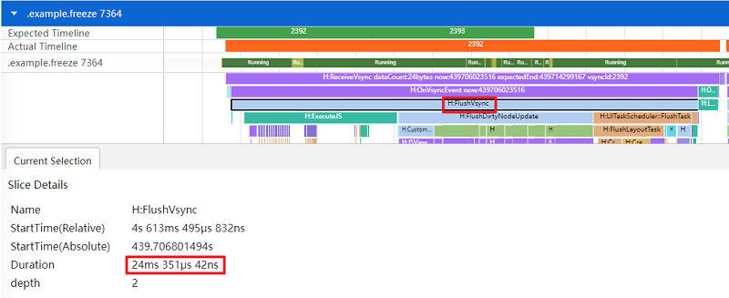
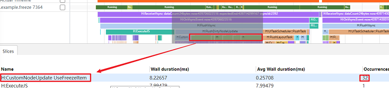
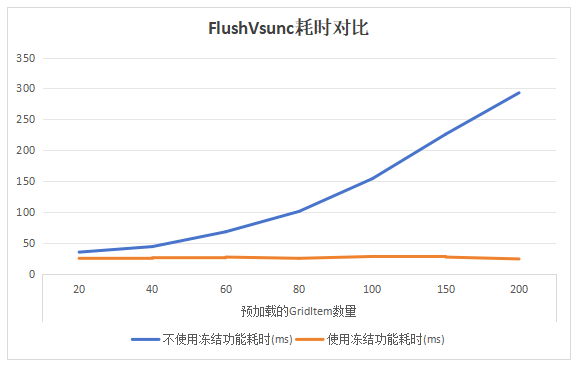

# 合理使用自定义组件冻结功能

## 概述
自定义组件冻结功能是指通过设置[freezeWhenInactive](../quick-start/arkts-create-custom-components.md#freezewheninactive11)属性为true，对非激活页面或者自定义组件进行冻结，使其不响应状态变量引起的UI刷新。当状态变量改变时，处于非激活状态的页面或自定义组件的状态变量将不响应更新，状态变量的@Watch函数不会调用，关联的节点不会刷新。只有当页面或者自定义组件重新激活或者可见时，才会去更新状态变量。本文将介绍冻结功能的原理机制和使用场景，并且通过懒加载场景下使用冻结功能前后的性能对比，帮忙开发者优化页面性能，减少页面渲染的时间，提升用户体验。

## 原理机制
- 组件的激活状态和非激活状态并非等同于可见和不可见。比如堆叠，堆叠在下面的组件虽然不可见，但是是激活状态。
- 需要注意，组件冻结不等于不更新，而是延迟更新，从而来降低某些场景下的UI刷新复杂度。当页面重新可见或者恢复到激活状态时，将对延迟刷新的组件进行刷新。举例而言，对于Navigation，对当前不可见的页面进行冻结，不会触发组件的更新。当返回该页面时，触发@Watch回调进行刷新。所以在pop返回上一个页面时，会刷新在冻结中没有更新的组件，从而可能导致pop的负载上升。
- 所有的冻结都是以自定义组件为最小单位。使用冻结功能后，自定义组件及其所属的系统组件是可以被冻结的，只是设置冻结的最小单位是自定义组件，不能单独冻结某个系统组件。
- @Component({ freezeWhenInactive: true })中freezeWhenInactive的值后端只支持常量，不支持变量形式。

## 适用场景
目前自定义组件冻结功能支持以下四种场景。更多自定义组件冻结的信息，请参考[自定义组件冻结功能](../quick-start/arkts-custom-components-freeze.md)。

**页面路由**：当页面A调用router.pushUrl接口跳转到页面B时，页面A为隐藏不可见状态，此时如果更新页面A中的状态变量，不会触发页面A刷新。

**TabContent**：对Tabs中当前不可见的TabContent进行冻结，不会触发组件的更新。当切换TabContent后，会对需要刷新的组件进行刷新。

**LazyforEach**：对LazyforEach中缓存的自定义组件进行冻结，不会触发组件的更新。

**Navigation**：对当前不可见的页面进行冻结，不会触发组件的更新。当返回该页面时，节点重新变成激活状态，才会进行刷新。

## 场景示例


上图是一个使用Grid懒加载的仿图库长按图片显示复选框的场景。下面将基于该场景对比分析冻结能力使用前后的性能差异。

下面是一个仿图库长按图片显示复选框的示例。为了方便对比，示例中使用isUseFreezeWhenInactive显隐控制是否使用自定义组件冻结功能。通过在自定义组件UseFreezeItem上设置@Component({ freezeWhenInactive: true })，即使用组件冻结功能。自定义组件NotUseFreezeItem不设置freezeWhenInactive属性，则不使用组件冻结功能。

```ts
// 图片类
@Observed
class ImageInfo {
  id: number; // 图片id
  icon: ResourceStr; // 图片
  isSelected: boolean; // 是否选中图片

  constructor(id: number = 0, icon: ResourceStr = '', isSelected: boolean = false) {
    this.id = id;
    this.icon = icon;
    this.isSelected = isSelected;
  }
}

// MyDataSource类实现IDataSource接口
class MyDataSource implements IDataSource {
  private dataArray: ImageInfo[] = [];

  public pushData(data: ImageInfo): void {
    this.dataArray.push(data);
  }

  // 数据源的数据总量
  public totalCount(): number {
    return this.dataArray.length;
  }

  // 返回指定索引位置的数据
  public getData(index: number): ImageInfo {
    return this.dataArray[index];
  }

  registerDataChangeListener(listener: DataChangeListener): void {
  }

  unregisterDataChangeListener(listener: DataChangeListener): void {
  }
}

// 预加载的GridItem的数量
const CACHED_COUNT: number = 200;

@Entry
@Component
struct ImitationGallery {
  // 数据源
  @State data: MyDataSource = new MyDataSource();
  // 选择模式标志位
  @State isSelectedMode: boolean = false;
  // 全选标志位。
  @State isSelectedAll: boolean = false;
  // 选择模式下选中的图片个数
  @State selectCount: number = 0;
  // 图片选中列表。存放选中后的图片id。
  @State @Watch('onSelectChange') selectedList: number[] = [];
  // 是否启用组件冻结功能
  @State isUseFreezeWhenInactive: boolean = false;

  // 监听选中图片的数量
  private onSelectChange() {
    this.selectCount = this.selectedList.length;
  }

  aboutToAppear() {
    // 添加图片数据源
    for (let i = 0; i < 2000; i++) {
      this.data.pushData(new ImageInfo(i, $r('app.media.custom_component_freeze_photo'), false));
    }
  }

  build() {
    Column() {
      Row() {
        if (!this.isSelectedMode) {
          Text("所有照片").fontSize(25).padding({ left: 15 }).fontWeight(FontWeight.Medium)
          Blank()
          Text("是否开启组件冻结").fontSize(15)
          Toggle({ type: ToggleType.Switch, isOn: this.isUseFreezeWhenInactive })
            .margin({ right: 20 })
            .onChange((isOn: boolean) => {
              this.isUseFreezeWhenInactive = isOn ? true : false;
            })
        } else {
          Row() {
            Image($r('app.media.custom_component_freeze_cancel'))
              .margin({ left: 15, right: 15 })
              .width(25)
              .onClick((): void => {
                if (this.isSelectedMode) {
                  // 取消选择模式
                  this.isSelectedMode = false;
                  // 取消所有选中状态
                  for (let i = 0; i < this.selectedList.length; i++) {
                    this.data.getData(this.selectedList[i]).isSelected = false;
                  }
                  // 取消全选
                  this.isSelectedAll = false;
                  this.selectedList = [];
                }
              })
            Text(`已选择${this.selectCount}项`).fontSize(20)
            Blank()
            Image(this.isSelectedAll ? $r('app.media.custom_component_freeze_select_all') : $r('app.media.custom_component_freeze_no_select_all'))
              .width(30)
              .height(30)
              .margin({ right: 20 })
              .onClick(() => {
                if (!this.isSelectedMode) {
                  return;
                }
                // 全选
                if (this.isSelectedAll) {
                  this.isSelectedAll = false;
                  // 取消全选，修改选中状态
                  for (let i = 0; i < this.selectedList.length; i++) {
                    this.data.getData(this.selectedList[i]).isSelected = false;
                  }
                  this.selectedList = [];
                } else {
                  // 全选，添加到图片选中列表
                  this.isSelectedAll = true;
                  this.selectedList = [];
                  for (let i = 0; i < this.data.totalCount(); i++) {
                    this.data.getData(i).isSelected = true;
                    this.selectedList.push(i);
                  }
                }
              })
          }.width('100%')
        }
      }.width('100%').height(48)

      if (this.isUseFreezeWhenInactive) {
        Grid() {
          LazyForEach(this.data, (imageItem: ImageInfo) => {
            GridItem() {
              UseFreezeItem({
                imageItem: imageItem,
                isSelectedMode: this.isSelectedMode,
                selectedList: this.selectedList
              })
            }
          }, (item: string) => item)
        }
        .cachedCount(CACHED_COUNT) // 设置GridItem的缓存数量
        .columnsTemplate('1fr 1fr 1fr 1fr')
        .columnsGap(2)
        .rowsGap(2)
      } else {
        Grid() {
          LazyForEach(this.data, (imageItem: ImageInfo) => {
            GridItem() {
              NotUseFreezeItem({
                imageItem: imageItem,
                isSelectedMode: this.isSelectedMode,
                selectedList: this.selectedList
              })
            }
          }, (item: string) => item)
        }
        .cachedCount(CACHED_COUNT) // 设置GridItem的缓存数量
        .columnsTemplate('1fr 1fr 1fr 1fr')
        .columnsGap(2)
        .rowsGap(2)
      }
    }
  }
}

// 使用组件冻结
@Component({ freezeWhenInactive: true })
struct UseFreezeItem {
  @ObjectLink imageItem: ImageInfo; // 图片信息对象
  @Link isSelectedMode: boolean; // 是否选择模式
  @Link selectedList: number[]; // 图片选中列表。存放选中后的图片id。

  build() {
    Stack() {
      Image(this.imageItem.icon).aspectRatio(1).draggable(false)
      if (this.isSelectedMode) {
        Image(this.imageItem.isSelected ? $r('app.media.custom_component_freeze_checkbox_on') : $r('app.media.custom_component_freeze_checkbox_off'))
          .height(24)
          .width(24)
          .position({ x: '100%', y: '100%' })
          .markAnchor({
            x: 28,
            y: 28
          })
      }
    }
    .width('100%')
    .aspectRatio(1)
    .gesture(LongPressGesture().onAction((event: GestureEvent): void => {
      // 长按进入选择模式。同时选中当前长按的图片
      if (!this.isSelectedMode) {
        this.isSelectedMode = true;
        this.imageItem.isSelected = true;
        this.selectedList.push(this.imageItem.id);
      }
    }))
    .onClick((): void => {
      if (!this.isSelectedMode) {
        return;
      }
      if (this.imageItem.isSelected) {
        // 取消选中，从图片选中列表中删除
        this.imageItem.isSelected = false;
        this.selectedList = this.selectedList.filter(num => num !== this.imageItem.id);
      } else {
        // 选中图片，添加到图片选中列表
        this.imageItem.isSelected = true;
        this.selectedList.push(this.imageItem.id);
      }
    })
  }
}

// 不使用组件冻结
@Component
struct NotUseFreezeItem {
  @ObjectLink imageItem: ImageInfo; // 图片信息对象
  @Link isSelectedMode: boolean; // 是否选择模式
  @Link selectedList: number[]; // 图片选中列表。存放选中后的图片id。

  build() {
    Stack() {
      Image(this.imageItem.icon).aspectRatio(1).draggable(false)
      if (this.isSelectedMode) {
        Image(this.imageItem.isSelected ? $r('app.media.custom_component_freeze_checkbox_on') : $r('app.media.custom_component_freeze_checkbox_off'))
          .height(24)
          .width(24)
          .position({ x: '100%', y: '100%' })
          .markAnchor({
            x: 28,
            y: 28
          })
      }
    }
    .width('100%')
    .aspectRatio(1)
    .gesture(LongPressGesture().onAction((event: GestureEvent): void => {
      // 长按进入选择模式。同时选中当前长按的图片
      if (!this.isSelectedMode) {
        this.isSelectedMode = true;
        this.imageItem.isSelected = true;
        this.selectedList.push(this.imageItem.id);
      }
    }))
    .onClick((): void => {
      if (!this.isSelectedMode) {
        return;
      }
      if (this.imageItem.isSelected) {
        // 取消选中，从图片选中列表中删除
        this.imageItem.isSelected = false;
        this.selectedList = this.selectedList.filter(num => num !== this.imageItem.id);
      } else {
        // 选中图片，添加到图片选中列表
        this.imageItem.isSelected = true;
        this.selectedList.push(this.imageItem.id);
      }
    })
  }
}
```

## 效果对比

下面将通过控制示例页面上“是否开启组件冻结”的开关，使用SmartPerf工具抓取trace来分析自定义组件冻结功能使用前后长按图片显示复选框的性能差异。

### 不开启冻结功能

如图1所示，在Grid预加载GridItem数量设置200的情况下，不开启组件冻结功能，抓取长按图片显示复选框的trace。可以看出显示复选框的UIVsyncTask（执行布局任务、执行渲染任务并通知图形进行渲染）耗时为162ms。其中FlushDirtyNodeUpdate（更新脏节点）耗时104ms,UITaskScheduler::FlushTask（主要是对懒加载的GridItem进行重新布局）耗时28ms。

图1 不开启自定义组件冻结功能


如图2所示，FlushDirtyNodeUpdate里可以看到执行了832个CustomNodeUpdate NotUseFreezeItem（自定义组件节点刷新）任务，这里的832个自定义组件节点指的是屏幕内可见的32个GridItem节点和不可见的800个缓存GridItem节点。

图2 不开启冻结功能后CustomNodeUpdate耗时


### 开启冻结功能

如图3所示，在Grid预加载GridItem数量设置200的情况下，开启组件冻结功能，抓取长按图片显示复选框的trace。可以看出显示复选框的UIVsyncTask耗时仅为32ms。其中FlushDirtyNodeUpdate耗时7ms，UITaskScheduler::FlushTask耗时14ms。和不开启冻结功能相比耗时减少了约80%（性能耗时数据因设备型号版本而异，以实测为准）。

图3 开启自定义组件冻结功能


如图4所示，FlushDirtyNodeUpdate里执行了32个CustomNodeUpdate UseFreezeItem（自定义组件节点刷新）任务，这里的32个自定义组件节点指的是屏幕内可见的所有GridItem节点。和图2相比，可以发现开启冻结功能比不开启冻结功能少执行了800个自定义组件节点的刷新任务，大大缩短了渲染耗时。

图4 开启冻结功能后CustomNodeUpdate耗时


图5为Grid懒加载场景下，设置不同预加载缓存GridItem数量（cachedCount）的UIVsyncTask耗时对比图。可以看出懒加载中设置的预加载缓存GridItem的数量越大，UIVsyncTask耗时越长。

图5 UIVsyncTask耗时对比（性能耗时数据因设备型号版本而异，以实测为准）



通过上述对比可以发现，懒加载场景下开启冻结功能后，仅会刷新屏幕可见的GridItem，屏幕外不可见的缓存GridItem不会刷新，相比不开启冻结功能，大大减少了需要刷新的自定义组件节点数量，有效降低页面重新渲染的耗时。在实际业务场景中，自定义组件布局更为复杂，需要更新的状态变量更多，而合理使用自定义组件冻结功能能有效减少渲染耗时和操作卡顿，提升页面性能，给用户带来更好的体验。