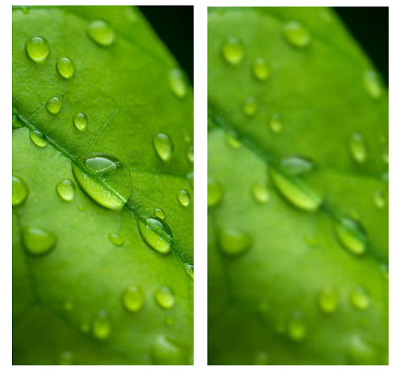
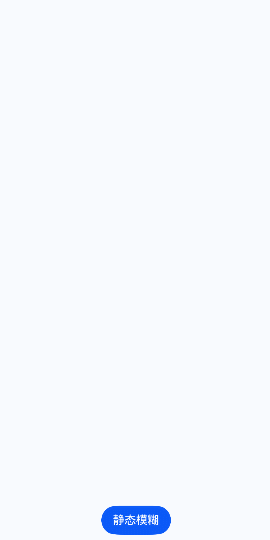
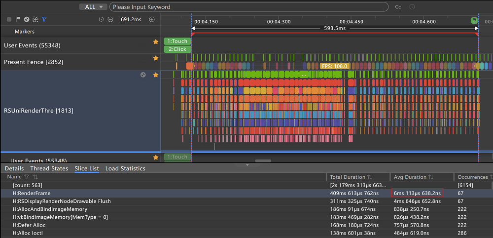
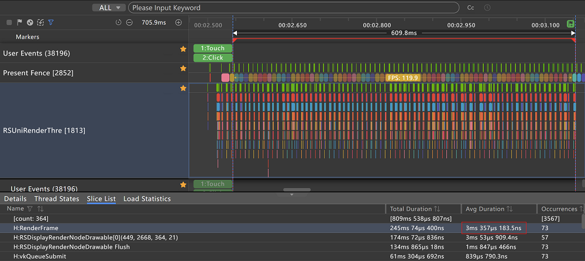

# 图像模糊动效优化：静态模糊与动态模糊的性能对比解析

## 概述

模糊效果是一种常见的图像处理技术，它通过减弱图像细节，去除干扰，使焦点更加鲜明。如下图所示，模糊效果不仅能增强界面空间感，还能清晰区分元素层级，是图像处理领域中一项常用且重要的技术手段。但当这一效果融入动态变化，便催生了模糊动效。模糊动效被广泛应用于页面之间的转场、图像元素的缩放等需要突出内容或改变用户关注点的场景中。

由于模糊算法需要对组件进行精细的像素级处理，当组件需要实时刷新时，这要求在极短的单个视频帧周期内完成模糊化处理。若组件同时还承担着繁重的动画渲染任务，则会进一步加剧计算资源的消耗，容易导致模糊效果处理时间不足，无法按时完成模糊动效，最终引发卡顿、丢帧等不良现象。

因此，随着应用的广泛普及，模糊动效的性能优化愈发显得至关重要。鉴于系统为开发者提供的静态模糊和动态模糊两种动效能力，本文将对比静态与动态模糊在“转场结合图片模糊”的应用场景下的性能差异，建议开发者在组件背景和内容无需实时更新的场景中，推荐使用静态模糊，可以减少应用卡顿与丢帧，提升用户体验。




## 使用场景

在介绍静态模糊和动态模糊之前，需要说明动态模糊和静态模糊的区别在于要模糊的内容是不是动态更新的，如对视频做模糊就是动态模糊，对图片做模糊就是静态模糊。

**静态模糊**：静态模糊是指对输入的静态内容进行模糊处理并获取一张模糊后的图像的模糊。适用于需要为静态图像提供模糊化效果的场景。[Effect Kit](../reference/apis-arkgraphics2d/js-apis-effectKit.md)在Filter图像效果类中提供[blur](../reference/apis-arkgraphics2d/js-apis-effectKit.md#blur)接口，可用于定义模糊半径，数值越大模糊效果越明显。

**动态模糊**：动态模糊是指模糊效果会随着每帧模糊内容和模糊半径的变化，进行实时变化的模糊。适用于模糊内容需要实时刷新和更改的场景。系统针对组件内容、背景的动态模糊提供了两种实现动态模糊的方法：[backgroundBlurStyle](../reference/apis-arkui/arkui-ts/ts-universal-attributes-background.md#backgroundblurstyle9)和[foregroundBlurStyle](../reference/apis-arkui/arkui-ts/ts-universal-attributes-foreground-blur-style.md#foregroundblurstyle)。这两个方法不能指定模糊半径、提亮、饱和度、蒙版颜色等具体参数，只能调用底层将这些参数封装好的[模糊样式](../reference/apis-arkui/arkui-ts/ts-universal-attributes-background.md#blurstyle9)来实现不同风格的模糊效果。同时系统也为开发者提供了能够自定义参数的[backgroundEffect](../reference/apis-arkui/arkui-ts/ts-universal-attributes-background.md#backgroundeffect11)，可以对组件背景实现自定义模糊动效。如果只需要对组件进行简单的模糊处理，系统还提供了与静态模糊类似的简单方法[blur](../reference/apis-arkui/arkui-ts/ts-universal-attributes-image-effect.md#blur)和[backdropBlur](../reference/apis-arkui/arkui-ts/ts-universal-attributes-background.md#backdropblur)，只需要定义模糊半径即可。

## 场景示例

下面将在常见的“转场结合图片模糊”的应用场景下（全屏模态转场拉起一个图片设置模糊的模态页面)，分别采用动态模糊和静态模糊，进行性能分析对比。需要说明，由于静态模糊和动态模糊底层采用的算法不同，动态模糊blur和静态模糊blur设置的模糊半径数值并不等效。为了从效果一致性的维度来更准确的比较两者的性能差异，这里将动态模糊和静态模糊场景的模糊半径的数值尽可能的调整到类似的模糊效果来进行对比。动态模糊blur设置13，静态模糊blur设置3的图片模糊效果较为接近，作为本例中效果一致性较为近似的等效条件。

下面是使用动态模糊对图片进行模糊处理的场景示例。通过直接对Image组件设置blur，为Image添加模糊效果。

```ts
@Entry
@Component
struct Index {
  @State isShowMotionBlur: boolean = false; // 是否显示全屏模态页面

  // 图片设置动态模糊的模态页面
  @Builder
  motionBlurBuilder() {
    Stack({ alignContent: Alignment.Bottom }) {
      Image($r('app.media.test'))
        .width('100%')
        .height('100%')
        .objectFit(ImageFit.Fill)
        .blur(13) // 添加动态模糊效果
      Button('close')
        .fontSize(20)
        .margin(10)
        .onClick(() => {
          this.isShowMotionBlur = false;
        })
    }
    .width('100%')
    .height('100%')
  }

  build() {
    Column({ space: 10 }) {
      Button('动态模糊')
        .margin(10)
        .onClick(() => {
          this.isShowMotionBlur = true;
        })
        .bindContentCover(this.isShowMotionBlur, this.motionBlurBuilder(), {
          modalTransition: ModalTransition.DEFAULT // 全屏模态转场类型。DEFAULT表示上下切换动画
        })
    }
    .width('100%')
    .height('100%')
    .justifyContent(FlexAlign.End)
  }
}
```


下面是使用静态模糊对图片进行模糊处理的场景示例。主要步骤如下：

1.通过createPixelMap创建图片的PixelMap。

2.通过createEffect创建Filter实例。

3.通过Filter图像效果类中的blur，为Image添加模糊效果。

```ts
import { image } from '@kit.ImageKit'; // 导入图片处理模块
import { effectKit } from '@kit.ArkGraphics2D'; // 导入图像效果模块

@Entry
@Component
struct Index {
  @State isShowStaticBlur: boolean = false; // 是否显示全屏模态页面
  @State pixelMap: image.PixelMap | undefined = undefined; // PixelMap实例
  @State imgSource: image.ImageSource | undefined = undefined; // ImageSource实例

  // 静态模糊
  async staticBlur() {
    let context = getContext(this); // 获得当前Ability的Context
    let resourceMgr = context.resourceManager; // 获取resourceManager对象
    const fileData = await resourceMgr.getRawFileContent('test.png'); // 获取rawfile目录下的图片
    let buffer: ArrayBuffer = fileData.buffer.slice(0); // 创建ArrayBuffer实例
    this.imgSource = image.createImageSource(buffer); // 创建图片源实例
    // 创建像素的属性
    let opts: image.InitializationOptions = {
      editable: true, // 是否可编辑
      pixelFormat: 3, // 像素格式。3表示RGBA_8888
      size: {
        // 创建图片大小
        height: 4,
        width: 6
      }
    };
    // 创建PixelMap
    await this.imgSource.createPixelMap(opts).then((pixelMap: image.PixelMap) => {
      const blurRadius = 3; // 模糊半径
      let headFilter = effectKit.createEffect(pixelMap); // 创建Filter实例
      if (headFilter != null) {
        headFilter.blur(blurRadius); // 设置静态模糊。将模糊效果添加到效果链表中
        // 获取已添加链表效果的源图像的image.PixelMap
        headFilter.getEffectPixelMap().then((pixelMap: image.PixelMap) => {
          this.pixelMap = pixelMap;
        });
      }
    })
  }

  // 图片设置静态模糊的模态页面
  @Builder
  staticBlurBuilder() {
    Stack({ alignContent: Alignment.Bottom }) {
      Image(this.pixelMap)
        .width('100%')
        .height('100%')
        .objectFit(ImageFit.Fill)
      Button('close')
        .fontSize(20)
        .margin(10)
        .onClick(() => {
          this.isShowStaticBlur = false;
        })
    }
    .width('100%')
    .height('100%')
  }

  build() {
    Column({ space: 10 }) {
      Button('静态模糊')
        .margin(10)
        .onClick(() => {
          this.isShowStaticBlur = true;
          // 设置静态模糊
          this.staticBlur();
        })
        .bindContentCover(this.isShowStaticBlur, this.staticBlurBuilder(), {
          modalTransition: ModalTransition.DEFAULT // 全屏模态转场类型。DEFAULT表示上下切换动画
        })
    }
    .width('100%')
    .height('100%')
    .justifyContent(FlexAlign.End)
  }
}
```



## 效果对比

下面使用DevEco Studio内置的Profiler中的帧率分析工具Frame抓取点击按钮触发转场过程的trace来分析静态模糊和动态模糊场景下的性能差异。需要说明，由于场景示例通过点击按钮触发转场，所以可以通过User Events（用户输入事件）的Click标签定位到转场过程的起点为Click标签结束位置。转场过程的终点为连续的RenderFrame（执行GPU绘制）标签不再连续的位置。



如上图所示，通过RenderFrame（执行GPU绘制）标签可以看出，动态模糊转场平均渲染耗时为6.113ms。同时从Present Fence（图形上屏信号）标签可以看出动态模糊转场平均帧率为108.0fps。



如上图所示，通过RenderFrame标签可以看出，静态模糊转场平均渲染耗时为3.357ms。同时从Present Fence标签可以看出静态模糊转场平均帧率为119.9fps。和动态模糊转场相比平均渲染耗时减少了约45%（性能耗时数据因应用场景、设备型号版本而异，以实测为准）。

由此可见，在模糊效果类似的条件下，静态模糊的性能要优于动态模糊。这源于底层实现机制的差异：静态模糊只需完成一次性的模糊处理，有效减轻了实时渲染的负担；而动态模糊则需要对每一帧进行连续的模糊计算，尽管在理想情况下能够营造出更为平滑和连贯的视觉过渡效果，但同时也显著增加了渲染的复杂度和资源消耗，若页面过于复杂，反而可能导致卡顿或丢帧现象的发生。