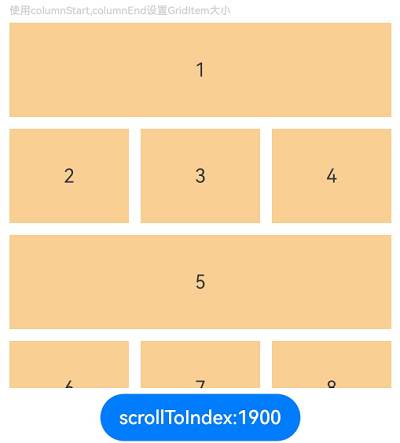
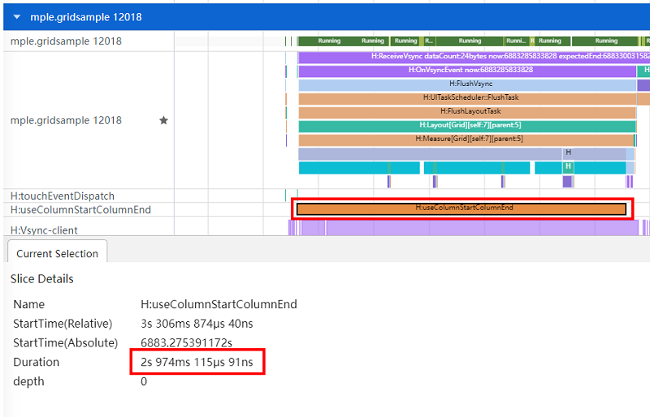
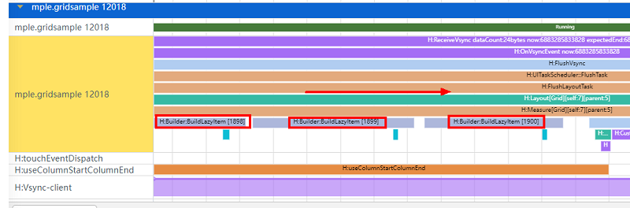

# Grid高性能开发指导

## 概述

在构建大型、复杂应用时，性能优化至关重要。Grid布局作为一种高效布局方式，可以提高页面的均分能力、子组件占比控制能力及自适应布局能力。本文将介绍Grid在高性能开发方面的应用，包括懒加载、cachedCount、组件复用和使用GridLayoutOptions设置GridItem大小等方法，帮助开发者优化Grid布局性能，减少加载和渲染时间，提升用户体验。

## 使用懒加载等方式提升Grid性能

关于懒加载、cachedCount、组件复用的原理机制的介绍请参考[列表场景性能提升实践](./list-perf-improvment.md)。

### 使用场景

**懒加载**：LazyForEach是一种在处理大量数据时提高性能的优化策略。它提供数据按需加载能力，解决一次性加载大量数据耗时长、占用过多资源的问题，可以提升页面响应速度。通常用于List、Grid以及Swiper等容器组件。当Grid需要循环渲染具有相同布局的子组件且需要展示大量数据，一次性加载所有数据的创建、渲染页面产生性能瓶颈时，应该考虑使用LazyForEach懒加载。

**cachedCount**：在Grid组件中，cachedCount用于设置预加载的GridItem的数量，仅在使用LazyForEach懒加载时有效。当Grid懒加载数据项比较耗时，如需要从网络获取视频数据、图片，容易出现滑动白块时，应该考虑使用cachedCount调整GridItem缓存数量。

**组件复用**：组件复用提供可复用组件对象的缓存资源池，通过重复利用已经创建过并缓存的组件对象，降低组件短时间内频繁创建和销毁的开销，从而提升组件渲染效率。当开发者的应用中存在滑动场景下对同一类自定义组件的实例进行频繁的创建与销毁、反复切换条件渲染的控制分支，且控制分支中的组件子树结构比较复杂，并成为UI线程的帧率瓶颈时，应该考虑使用组件复用提高页面的加载速度和响应速度。

### 场景示例

以下是Grid组件关于懒加载、cachedCount、组件复用的一个基本示例：

```ts
// MyDataSource类实现IDataSource接口
class MyDataSource implements IDataSource {
  private dataArray: number[] = [];

  public pushData(data: number): void {
    this.dataArray.push(data);
  }

  // 数据源的数据总量
  public totalCount(): number {
    return this.dataArray.length;
  }

  // 返回指定索引位置的数据
  public getData(index: number): number {
    return this.dataArray[index];
  }

  registerDataChangeListener(listener: DataChangeListener): void {
  }

  unregisterDataChangeListener(listener: DataChangeListener): void {
  }
}

@Entry
@Component
struct MyComponent {
  // 数据源
  private data: MyDataSource = new MyDataSource();

  aboutToAppear() {
    for (let i = 1; i < 1000; i++) {
      this.data.pushData(i);
    }
  }

  build() {
    Column({ space: 5 }) {
      Grid() {
        LazyForEach(this.data, (item: number) => {
          GridItem() {
            // 使用可复用自定义组件
            ReusableChildComponent({ item: item })
          }
        }, (item: string) => item)
      }
      .cachedCount(2) // 设置GridItem的缓存数量
      .columnsTemplate('1fr 1fr 1fr')
      .columnsGap(10)
      .rowsGap(10)
      .margin(10)
      .height(500)
      .backgroundColor(0xFAEEE0)
    }
  }
}

// 自定义组件被@Reusable装饰器修饰，即标志其具备组件复用的能力
@Reusable
@Component
struct ReusableChildComponent {
  @State item: number = 0;

  // aboutToReuse从复用缓存中加入到组件树之前调用，可在此处更新组件的状态变量以展示正确的内容
  // aboutToReuse参数类型已不支持any，这里使用Record指定明确的数据类型。Record用于构造一个对象类型，其属性键为Keys，属性值为Type
  aboutToReuse(params: Record<string, number>) {
    this.item = params.item;
  }

  build() {
    Column() {
      Image($r('app.media.icon'))
        .objectFit(ImageFit.Fill)
        .layoutWeight(1)
      Text(`图片${this.item}`)
        .fontSize(16)
        .textAlign(TextAlign.Center)
    }
    .width('100%')
    .height(120)
    .backgroundColor(0xF9CF93)
  }
}
```

- 使用懒加载可以有效缩短Grid加载和渲染时间，而且在处理大量GridItem时，懒加载可以显著节省内存和CPU资源的消耗。示例中使用LazyForEach进行数据懒加载，Grid布局时会根据可视区域按需创建GridItem组件，并在GridItem滑出可视区域时销毁以降低内存占用。更多懒加载的信息，请参考[LazyForEach：数据懒加载](../ui/state-management/arkts-rendering-control-lazyforeach.md)。

- 使用懒加载方式渲染Grid时，合理使用cachedCount可以让应用有更好的滚动体验，减少滑动时出现的白块。示例中Grid使用cachedCount属性设置GridItem的缓存数量，会在Grid显示区域前后各缓存cachedCount\*列数个GridItem，超出显示和缓存范围的GridItem会被释放。需要注意的是cachedCount的增加会增大CPU、内存开销。使用时需要根据实际情况，综合性能和用户体验进行调整。

- 使用组件复用，在Grid滚动场景和反复切换条件渲染场景下，可以进一步优化GridItem频繁创建和销毁的性能，从而提升页面的加载速度和响应速度。示例中使用@Reusable装饰器修饰GridItem中的自定义组件ReusableChildComponent，即表示其具备组件复用的能力。同时要传递自定义组件的参数给生命周期回调函数aboutToReuse。使用aboutToReuse是为了让Grid在滑动时从复用缓存中加入到组件树之前触发，用于更新组件的状态变量以展示正确的内容。需要注意的是无需在aboutToReuse中对@Link、@StorageLink、@ObjectLink、@Consume等自动更新值的状态变量进行更新，可能触发不必要的组件刷新。更多组件复用的信息，请参考[组件复用实践](./component-recycle.md)。

## 使用GridLayoutOptions提升Grid性能

GridLayoutOptions布局选项，配合rowsTemplate、columnsTemplate仅设置其中一个的Grid使用，可以替代通过columnStart/columnEnd控制GridItem占用多列、rowStart/rowEnd控制GridItem占用多行的场景。

### 使用场景

**删除或拖拽等改变GridItem位置**：Grid中存在大量GridItem，当使用columnStart/columnEnd、rowStart/rowEnd设置GridItem大小，会导致该场景下Grid渲染耗时过长时，应该考虑使用GridLayoutOptions提升性能。使用columnStart/columnEnd、rowStart/rowEnd在重新渲染时会重建所有GridItem节点。而使用GridLayoutOptions则不需要重建，渲染和加载时间更短。

**使用scrollToIndex滑动到指定GridItem**：Grid中存在大量GridItem，当使用columnStart/columnEnd、rowStart/rowEnd设置GridItem大小，该场景下耗时过长时，应该考虑使用GridLayoutOptions提升性能。使用columnStart/columnEnd、rowStart/rowEnd布局，在scrollToIndex滑动指定Index时，Grid会遍历GridItem去查找位置。而使用GridLayoutOptions布局，在scrollToIndex滑动指定Index时，则是通过计算方式去查找位置，查找GridItem位置效率更高。

### 场景示例

下面介绍Grid中使用scrollToIndex滑动到指定位置的场景，其他场景不再赘述。

**反例：**

使用columnStart，columnEnd设置GridItem大小。

```ts
// 导入性能打点模块
import hiTraceMeter from '@ohos.hiTraceMeter';

@Component
struct TextItem {
  @State item: string = "";

  build() {
    Text(this.item)
      .fontSize(16)
      .backgroundColor(0xF9CF93)
      .width('100%')
      .height(80)
      .textAlign(TextAlign.Center)
  }

  aboutToAppear() {
    // 结束打点任务
    hiTraceMeter.finishTrace("useColumnStartColumnEnd", 1);
  }
}

class MyDataSource implements IDataSource {
  private dataArray: string[] = [];

  public pushData(data: string): void {
    this.dataArray.push(data);
  }

  public totalCount(): number {
    return this.dataArray.length;
  }

  public getData(index: number): string {
    return this.dataArray[index];
  }

  registerDataChangeListener(listener: DataChangeListener): void {
  }

  unregisterDataChangeListener(listener: DataChangeListener): void {
  }
}

@Entry
@Component
struct GridExample {
  private datasource: MyDataSource = new MyDataSource();
  scroller: Scroller = new Scroller();

  aboutToAppear() {
    for (let i = 1; i <= 2000; i++) {
      this.datasource.pushData(i + '');
    }
  }

  build() {
    Column({ space: 5 }) {
      Text('使用columnStart,columnEnd设置GridItem大小').fontColor(0xCCCCCC).fontSize(9).width('90%')
      Grid(this.scroller) {
        LazyForEach(this.datasource, (item: string, index: number) => {
          if ((index % 4) === 0) {
            GridItem() {
              TextItem({ item: item })
            }
            .columnStart(0).columnEnd(2)
          } else {
            GridItem() {
              TextItem({ item: item })
            }
          }
        }, (item: string) => item)
      }
      .columnsTemplate('1fr 1fr 1fr')
      .columnsGap(10)
      .rowsGap(10)
      .width('90%')
      .height('40%')

      Button("scrollToIndex:1900").onClick(() => {
        // 开始打点任务
        hiTraceMeter.startTrace("useColumnStartColumnEnd", 1);
        this.scroller.scrollToIndex(1900);
      })
    }.width('100%')
    .margin({ top: 5 })
  }
}
```



**正例：**

使用GridLayoutOptions设置GridItem大小，布局效果和反例保持一致。

```ts
// 导入性能打点模块
import hiTraceMeter from '@ohos.hiTraceMeter';

@Component
struct TextItem {
  @State item: string = "";

  build() {
    Text(this.item)
      .fontSize(16)
      .backgroundColor(0xF9CF93)
      .width('100%')
      .height(80)
      .textAlign(TextAlign.Center)
  }

  aboutToAppear() {
    // 结束打点任务
    hiTraceMeter.finishTrace("useGridLayoutOptions", 1);
  }
}

class MyDataSource implements IDataSource {
  private dataArray: string[] = [];

  public pushData(data: string): void {
    this.dataArray.push(data);
  }

  public totalCount(): number {
    return this.dataArray.length;
  }

  public getData(index: number): string {
    return this.dataArray[index];
  }

  registerDataChangeListener(listener: DataChangeListener): void {
  }

  unregisterDataChangeListener(listener: DataChangeListener): void {
  }
}

@Entry
@Component
struct GridExample {
  private datasource: MyDataSource = new MyDataSource();
  scroller: Scroller = new Scroller();
  private irregularData: number[] = [];
  layoutOptions: GridLayoutOptions = {
    regularSize: [1, 1],
    irregularIndexes: this.irregularData,
  };

  aboutToAppear() {
    for (let i = 1; i <= 2000; i++) {
      this.datasource.pushData(i + '');
      if ((i - 1) % 4 === 0) {
        this.irregularData.push(i - 1);
      }
    }
  }

  build() {
    Column({ space: 5 }) {
      Text('使用GridLayoutOptions设置GridItem大小').fontColor(0xCCCCCC).fontSize(9).width('90%')
      Grid(this.scroller, this.layoutOptions) {
        LazyForEach(this.datasource, (item: string, index: number) => {
          GridItem() {
            TextItem({ item: item })
          }
        }, (item: string) => item)
      }
      .columnsTemplate('1fr 1fr 1fr')
      .columnsGap(10)
      .rowsGap(10)
      .width('90%')
      .height('40%')

      Button("scrollToIndex:1900").onClick(() => {
        // 开始打点任务
        hiTraceMeter.startTrace("useGridLayoutOptions", 1);
        this.scroller.scrollToIndex(1900);
      })
    }.width('100%')
    .margin({ top: 5 })
  }
}
```


### 效果对比

正反例相同的操作步骤：通过点击按钮，在调用scrollToIndex之前使用startTrace开始性能打点跟踪。当Grid查找到指定GridItem位置，准备渲染GridItem节点前，会进入GridItem自定义组件的生命周期回调aboutToAppear，在aboutToAppear里使用finishTrace停止性能打点跟踪。通过性能打点方式，使用startTrace标记调用scrollToIndex作为开始打点的位置，使用finishTrace标记查找到指定位置后准备渲染首个GridItem节点作为结束打点位置，来对比正反例场景下的耗时数据。关于本例中使用性能打点的介绍，请参考[性能打点](../reference/apis-performance-analysis-kit/js-apis-hitracemeter.md)。

下面将通过以上方式使用SmartPerf工具抓取 trace来分析正反例场景的性能差异。

如图1所示，使用columnStart，columnEnd设置GridItem大小的布局方式，从自定义打点标签“H:useColumnStartColumnEndGrid”上可以看出从调用scrollToIndex到查找到指定Index准备构建GridItem节点耗时2974ms。

图1 使用columnStart，columnEnd的打点信息



如图2所示，在“H:useColumnStartColumnEndGrid”打点标签时间段中存在大量的“H:Builder:BuildLazyItem”标签，可以发现Grid在查找指定的Index：1900是依次遍历Index来查找的。

图2 使用columnStart，columnEnd的放大trace标签信息



如图3所示，使用GridLayoutOptions设置GridItem大小的布局方式，从自定义打点标签“H:useGridLayoutOptions”上可以看出从调用scrollToIndex到查找到指定Index准备构建GridItem节点耗时464ms。

图3 使用GridLayoutOptions的打点信息


如图4所示，在“H:useGridLayoutOptions”打点标签时间段中只存在一个“H:Builder:BuildLazyItem”标签，可以发现Grid在查找指定Index：1900是直接一次查找到指定Index的。

图4 使用GridLayoutOptions的放大trace标签信息


通过上述分析可以发现，在相同布局情况下，使用columnStart，columnEnd设置GridItem大小方式，Grid在使用scrollToIndex查找指定Index时，会依次遍历GridItem节点，查找过程耗时较长。而使用GridLayoutOptions设置GridItem大小方式，是直接一次计算找到指定Index，查找过程耗时较短。所以使用GridLayoutOptions设置GridItem大小方式，在使用scrollToIndex滑动指定Index时，能够有效减少Grid加载时间，提升应用性能。