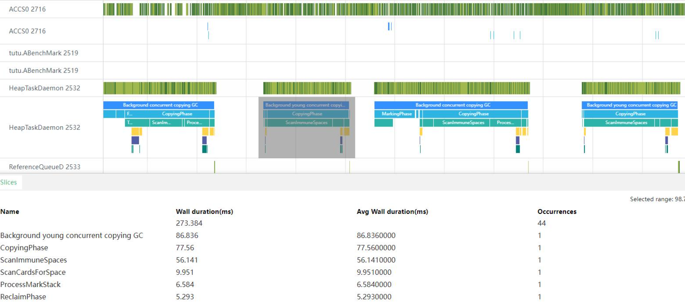

# TS / JS 高性能编程规范及实践

## 1. 概述
本文参考业界标准，并结合 OpenHarmony 应用 TS / JS 部分的性能优化实践经验，从应用编程指南、高性能编程实践、性能优化调试工具等维度，为 OpenHarmony 应用开发者提供参考指导，助力开发者开发出高性能的应用。

本文在[《OpenHarmony应用TS&JS编程指南》](../../../contribute/OpenHarmony-Application-Typescript-JavaScript-coding-guide.md)之上，补充了高性能编程实践建议。

## 2. OpenHarmony 应用 TS & JS 高性能编程实践

高性能编程实践，是在开发过程中逐步总结出来的一些高性能的写法和建议，在业务功能实现过程中，我们要同步思考并理解高性能写法的原理，运用到代码逻辑实现中。

本文中的实践示例代码，会统一标注正例或者反例，正例为推荐写法，反例为不推荐写法。

### 2.1 属性访问

#### 2.1.1 热点循环中常量提取，减少属性访问次数

在实际的应用场景中抽离出来如下用例，其在循环中会大量进行一些常量的访问操作，该常量在循环中不会改变，可以提取到循环外部，减少属性访问的次数。

【反例】

``` TypeScript
// 优化前代码
private getDay(year: number): number {
  /* Year has (12 * 29 =) 348 days at least */
  let totalDays: number = 348;
  for (let index: number = 0x8000; index > 0x8; index >>= 1) {
    // 此处会多次对Time的INFO及START进行查找，并且每次查找出来的值是相同的
    totalDays += ((Time.INFO[year- Time.START] & index) !== 0) ? 1 : 0;
  }
  return totalDays + this.getDays(year);
}
```

可以将 `Time.INFO[year - Time.START]` 进行热点函数常量提取操作，这样可以大幅减少属性的访问次数，性能收益明显，优化后代码如下：

【正例】

``` TypeScript
// 优化后代码
private getDay(year: number): number {
  /* Year has (12 * 29 =) 348 days at least */
  let totalDays: number = 348;
  const info = Time.INFO[year - Time.START]; // 1. 从循环中提取不变量
  for (let index: number = 0x8000; index > 0x8; index >>= 1) {
    if ((info & index) !== 0) {
      totalDays++;
    }
  }
  return totalDays + this.getDays(year);
}
```

### 2.2 属性增删

#### 2.2.1 避免频繁使用 delete

delete 对象的某一个属性会改变其布局，影响运行时优化效果，导致执行性能下降。

> 注：建议不删除对象的任何属性，如果有需要，建议用 map 和 set ，或者引擎实现的高性能容器类。

【反例】

``` TypeScript
class O1 {
  x: string | undefined = "";
  y: string | undefined = "";
}
let obj: O1 = {x: "", y: ""};

obj.x = "xxx";
obj.y = "yyy";
delete obj.x;
```

建议使用如下两种写法之一实现：

【正例】

``` TypeScript
// 例1：将Object中不再使用的属性设置为null
class O1 {
  x: string | null = "";
  y: string | null = "";
}
let obj: O1 = {x: "", y: ""};

obj.x = "xxx";
obj.y = "yyy";
obj.x = null;

// 例2：使用高性能容器类操作属性
import HashMap from '@ohos.util.HashMap'; 
let myMap= new HashMap();

myMap.set("x", "xxx");
myMap.set("y", "yyy");
myMap.remove("x");
```

### 2.3 数值计算

#### 2.3.1 数值计算避免溢出

常见的溢出操作包括如下场景，溢出之后，会导致引擎走入慢速的溢出逻辑分支处理，影响后续的性能。

1. 加法、减法、乘法 不要 int 溢出（大于 INT32_MAX 或小于 INT32_MIN ）；
2. &&（and） >>>（shr），不要 int 溢出（大于 INT32_MAX ）。

### 2.4 数据结构
#### 2.4.1 使用合适的数据结构

在实际的应用场景中抽离出来如下用例，该接口中使用 JSObject 来作为容器去处理 Map 的逻辑，此处应使用 HashMap 来进行处理。

【反例】

``` TypeScript
getInfo(t1, t2) {
  if (!this.check(t1, t2)) {
    return "";
  }
  // 此处使用JS Object作为容器
  let info= {};  
  this.setInfo(info);
  let t1= info[t2];
  return (t1!= null) ? t1: "";
}
setInfo(info) {
  // 接口内部实际上进行的是map的操作
  info[T1] = '七六';   
  info[T2] = '九一';
  ... ...
  info[T3] = '十二';
}
```

代码可以进行如下修改，除了使用引擎中提供的标准内置 map 之外，还可以使用 Ark 提供的高性能容器类。

【正例】

``` TypeScript
import HashMap from '@ohos.util.HashMap'; 

getInfo(t1, t2) {
  if (!this.check(t1, t2)) {
    return "";
  }
  // 此处替换为HashMap作为容器
  let info= new HashMap();
  this.setInfo(info);
  let t1= info.get(t2);
  return (t1!= null) ? t1: "";
}
setInfo(info) {
  // 接口内部实际上进行的是map的操作
  info.set(T1, '七六');   
  info.set(T2, '九一');
  ... ...
  info.set(T3, '十二');
}
```

#### 2.4.2 数值数组推荐使用 TypedArray

如果是涉及纯数值计算的场合，推荐使用 TypedArray 数据结构。

说明：常见的TypedArray包括：

Int8Array，Uint8Array，Uint8ClampedArray，Int16Array，Uint16Array，Int32Array，Uint32Array，Float32Array，Float64Array，BigInt64Array，BigUint64Array。

【正例】

``` TypeScript
const typedArray1 = new Int8Array([1, 2, 3]);  // 针对这一场景，建议不要使用new Array([1, 2, 3])
const typedArray2 = new Int8Array([4, 5, 6]);  // 针对这一场景，建议不要使用new Array([4, 5, 6])
let res = new Int8Array(3);
for (let i = 0; i < 3; i++) {
  res[i] = typedArray1[i] + typedArray2[i];
}
```

#### 2.4.3 避免使用稀疏数组

分配数组时，需要避免使用如下反例中的方式进行处理。

说明：虚拟机在分配超过 1024 大小的数组或者针对稀疏数组，均采用 hash 表来存储元素，相对用偏移来访问数组元素速度较慢。在开发时，尽量避免数组变成稀疏数组。

【反例】

``` TypeScript
// 如下几种情形会变成稀疏数组
// 1. 直接分配100000大小的数组，虚拟机会处理成用hash表来存储元素
let count = 100000;
let result: number[] = new Array(count);

// 2. 分配数组之后直接，在9999处初始化，会变成稀疏数组
let result: number[] = new Array();
result[9999] = 0;

// 3. 删除数组的element属性，虚拟机也会处理成用hash表来存储元素
let result = [0, 1, 2, 3, 4];
delete result[0];
```

### 2.5 对象初始化
#### 2.5.1 使用字面量进行对象创建

通常在代码中，进行一些对象创建的时候，大家会采用如下的方式，这种方式，在前端解析时，不能获取到更多的信息，因此不能为运行时提供优化信息。

【反例】

``` TypeScript
let arr = new Array();  // 创建一个array

let obj = new Object();  // 创建一个普通对象

let oFruit = new Object();
oFruit.color = "red";
oFruit.name = "apple"; // 创建一个对象，并设置属性
```

在要求性能的场合，可以采用如下的方式进行对象创建，这样在运行时可以获得指令级别的优化。

【正例】

``` TypeScript
let arr = [];  // 创建一个array

let obj = {}; // 创建一个普通对象

class O1 {
  color: string = "";
  name: string = "";
}
let oFruit: O1 = {color: "red", name: "apple"};  // 创建一个对象，并设置属性
```

#### 2.5.2 对象构造初始化

对象构造的时候，要提供默认值初始值，不访问未初始化的属性。

【反例】

``` TypeScript
// 不要访问未初始化的属性
class A {
  x：number;
}

// 构造函数中要对属性进行初始化
class A {
  x：number;
  constructor() {
  }
}

let a = new A();
// x使用时还未赋值，这种情况会访问整个原型链
print(a.x);
```

针对 class 的实例的构造，推荐使用如下初始化方式。

【正例】

``` TypeScript
// 推荐一：声明初始化
class A {
  x: number = 0;
}

// 推荐二：构造函数直接赋初值
class A {
  constructor() {
    this.x = 0;
  }
}

let a = new A();
print(a.x);
```

#### 2.5.3 number 正确初始化

number 类型编译器在优化时会区分整型和浮点类型，开发者在初始化时如果预期是整型就初始化成 0 ，浮点型就是 0.0 ，不要把一个 number 类型初始化成 undefined 或者 null 。

【正例】

``` TypeScript
function foo(d: number) : number {
  // 变量i预期是整型，不要声明成undefined/null或0.0，直接初始化为0
  let i: number = 0; 
  i += d;
  return i;
}
```

#### 2.5.4 避免动态添加属性

对象在创建的时候，如果开发者知道后续还需要添加属性，可以提前置为 undefined 。动态添加属性会导致对象布局变化，影响编译器和运行时优化效果。

【反例】

``` TypeScript
// 后续obj需要再添加z属性
class O1 {
  x: string = "";
  y: string = "";
}
let obj: O1 = {"x": xxx, "y": "yyy"};
...
// 这种动态添加方式是不推荐的
obj.z = "zzz";
```
针对这一场景，推荐使用如下写法：

【正例】

``` TypeScript
class O1 {
  x: string = "";
  y: string = "";
  z: string = "";
}
let obj: O1 = {"x": "xxx", "y": "yyy", "z": ""};
...
obj.z = "zzz";
```

#### 2.5.5 调用构造函数的入参要与标注类型匹配

由于 TS 语言类型是一种标注类型，不是编译期强制约束，如果传参的标注类型与实际传的类型不匹配，会影响引擎内部的优化效果。

【反例】

``` TypeScript
class A {
  private a: number | undefined;
  private b: number | undefined;
  private c: number | undefined;
  constructor(a?: number, b?: number, c?: number) {
    this.a = a;
	this.b = b;
	this.c = c;
  }
}
// new的过程中没有传入参数，a，b，c会获取一个undefined的初值，和标注类型不符
let a = new A();
```

针对这一场景，开发者大多数预期该入参类型是 number 类型，需要显式写出来，可以进行如下修改，不然会造成标注的入参是 number ，实际传入的是 undefined 。

【正例】

``` TypeScript
class A {
  private a: number | undefined;
  private b: number | undefined;
  private c: number | undefined;
  constructor(a?: number, b?: number, c?: number) {
    this.a = a;
	this.b = b;
	this.c = c;
  }
}
// 初始化直接传入默认值0
let a = new A(0, 0, 0);
```

#### 2.5.6 不变的变量声明为 const 

不变的变量推荐使用 const 进行初始化。

【反例】

``` TypeScript
// 不要写let N = 10000；
const N = 10000; 

function getN() {
  return N;
}
```

### 2.6 接口及继承

#### 2.6.1 避免使用type类型标注

如果传入的参数类型是 type 类型，实际入参可能是一个 object literal ，也可能是一个 class ，编译器及虚拟机因为类型不固定，无法做编译期假设进而进行相应的优化。

【反例】

``` TypeScript
// type类型无法在编译期确认, 可能是一个object literal，也可能是另一个class Person
type Person = {
  name: string;
  age: number;
};
 
function greet(person: Person) {
  return "Hello " + person.name;
}

// type方式是不推荐的，因为其有如下两种使用方式，type类型无法在编译期确认
// 调用方式一
class O1 {
  name: string = "";
  age: number = 0;
}
let objectliteral: O1 = {name : "zhangsan", age: 20 };
greet(objectliteral );

// 调用方式二
class Person {
  name: string = "zhangsan";
  age: number = 20;
}
let person = new Person();
greet(person);
```

### 2.7 函数调用

#### 2.7.1 声明参数要和实际的参数一致

声明的参数要和实际的传入参数个数及类型一致，如果不传参数，则会当undefined处理，可能造成与实际入参类型不匹配的情况，从而导致运行时走入慢速路径，影响性能。

【反例】

``` TypeScript
function add(a: number, b: number) {
  return a + b;
}
// 参数个数是2，不能给3个
add(1, 2, 3);
// 参数个数是2，不能给1个
add(1);
// 参数类型是number，不能给string
add("hello", "world");
```

2.7.2 函数内部变量尽量使用参数传递
能传递参数的尽量传递参数，不要使用闭包。
说明：闭包作为参数会多一次闭包创建和访问。
【反例】

``` TypeScript
let arr = [0, 1, 2];

function foo() {
  // arr 尽量通过参数传递
  return arr[0] + arr[1];
}
foo();
```

针对这一场景，建议使用如下写法：

【正例】

``` TypeScript
let arr = [0, 1, 2];

function foo(array: Array) : number {
  // arr 尽量通过参数传递
  return array[0] + array[1];
}
foo(arr);
```

### 2.8 函数与类声明

#### 2.8.1 避免动态声明 function 与 class

不建议动态声明 function 和 class 。以如下用例为例，动态声明了class Add 和 Sub，每次调用 foo 都会重新创建 class Add 和 class Sub ，对内存和性能都会有影响。

【反例】

``` TypeScript
function foo(f: boolean) {
  if (f) {
    return class Add{};
  } else {
    return class Sub{};
  }
}
```

针对这一场景，建议使用如下写法：

【正例】

``` TypeScript
class Add{};
class Sub{};
function foo(f: boolean) {
  if (f) {
    return Add;
  } else {
    return Sub;
  }
}
```

## 3. TS/JS性能优化工具使用

### 3.1 性能分析工具介绍

通过如下工具和使用方法，能够帮助开发者查看待分析场景下各阶段的耗时分布情况，并进一步针对耗时情况使用对应的工具做细化分析。

工具使用介绍：
1. 针对应用开发者，推荐使用 OpenHarmony 自带的 Smartperf 工具来进行辅助分析，可以从宏观角度查看应用各个阶段耗时分布情况，快速找到待分析优化模块。
2. 针对第一步分析得到的待优化模块，需要进行进一步分析确认耗时点是在 TS/JS 部分还是 C++ 部分。 C++ 部分耗时模块细化分析建议使用 hiperf 工具；针对 TS 部分耗时，可以使用 CPU Profiler 工具，查看 TS 部分耗时情况。
3. 针对虚拟机开发者，如果需要进一步拆分细化，推荐使用虚拟机提供的RUNTIME_STAT工具。

#### 3.1.1 Smartperf工具使用指导

[Smartperf参考链接](.././../../device-dev/device-test/smartperf-host.md)

以如下某个应用场景使用过程的 trace 为例，可以通过 Smartperf 工具抓取到应用使用阶段的耗时信息，其中大部分为 GC 等操作。如果此接口大部分是应用开发者通过 TS / JS 实现，并且在 trace 中体现此阶段比较耗时，则可以继续使用 CPU Profiler 工具来进一步分析 TS 部分耗时情况。



除了可以查看系统的trace之外，还可以在应用的源码的关键流程中加入一些 trace 点，用于做性能分析。 startTrace 用于记录 trace 起点， finishTrace 用于记录trace终点，在应用中增加 trace 点的方式如下：

``` TypeScript
import hiTraceMeter from '@ohos.hiTraceMeter'; 
... ...
hiTraceMeter.startTrace("fillText1", 100);
... ...
hiTraceMeter.finishTrace("fillText1", 100);
```


应用层面加trace[参考链接](../../dfx/hitracemeter-guidelines.md)

native层面加trace[参考链接](../../dfx/hitracemeter-guidelines.md)。 

#### 3.1.2 hiperf工具使用指导

集成在Smartperf的使用指导[详见此处](https://gitee.com/openharmony-sig/developtools_smartperf_host/blob/master/ide/src/doc/md/quickstart_hiperf.md)

hiperf单独使用指导[详见此处](https://gitee.com/openharmony/developtools_hiperf&E4%BD%BF%E7%94%A8%E8%AF%B4%E6%98%8E)

### 3.2 TS / JS 及 NAPI 层面耗时分析工具

TS / JS 层面耗时主要分为如下几种情况：

1. Ability 的生命周期回调的耗时；
2. 组件的 TS / JS 业务代码的回调的耗时；
3. 应用 TS / JS 逻辑代码耗时。

NAPI层面的耗时主要分为如下几种情况：

1. 由TS/JS业务代码通过调用 JSAPI 产生，该部分耗时逻辑主要由 C / C++ 实现；
2. 由开发者自己通过 NAPI 封装 C / C++ 实现。

说明：当前鸿蒙 JSAPI 大多数由 TS / JS 封装 C++ 的能力实现

针对上面提到的应用中的TS/JS及NAPI两种业务场景的耗时分析，我们提供了 CPU Profiler 工具，用来识别热点函数及耗时代码。

[工具使用指导](./OpenHarmony-application-performance-analysis-tool-CPU-Profiler-user-manual.md)

其可支持的采集方式如下：

1. DevEco Studio连接设备实时采集；
2. hdc shell连接设备进行命令行采集。

可以通过 CPU Profiler 工具，对 TS / JS 中执行的热点函数进行抓取。以应用实际使用场景为例，在此场景中，可以抓到应用中的某一热点函数，在此基础上，针对该接口做进一步分析。

