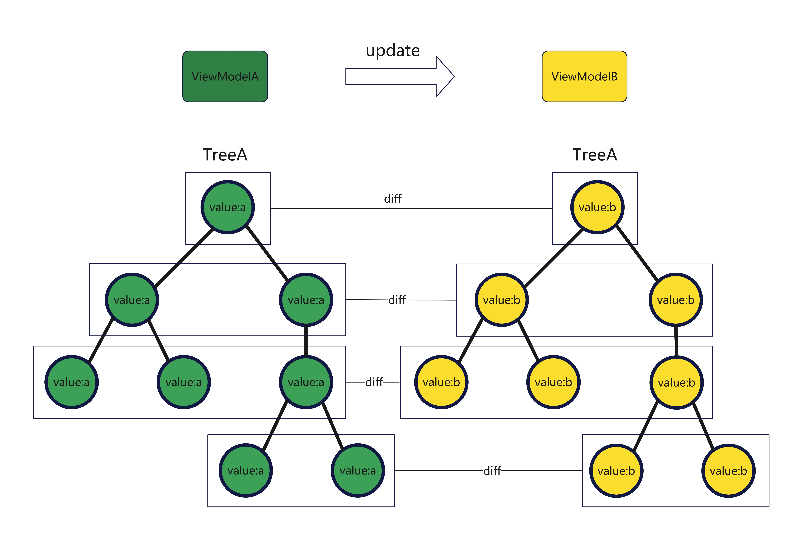
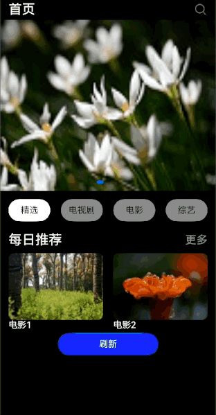
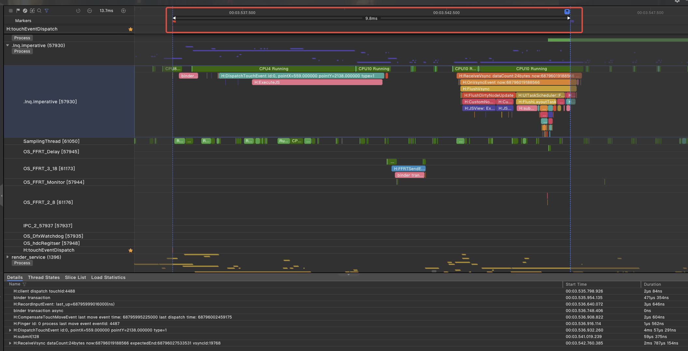
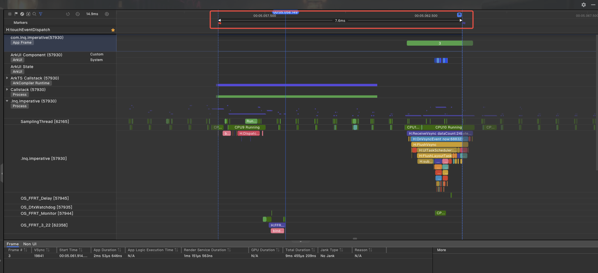

# 使用ArkUI的FrameNode扩展实现动态布局类框架
## 简介
在特定的节假日或活动节点，应用通常需要推送相应主题或内容到首页，但又不希望通过程序更新方式来实现。因此，一般会采用动态布局类框架。动态布局类框架是一种动态生成原生组件树的轻量级框架，可以根据运营需求，在无需重新上架应用的情况下也可以动态地向用户推送新内容。该框架使用了类似于CSS的语法，通过设置不同的样式属性来控制视图的位置、大小、对齐方式等。本文将介绍如何使用ArkUI的FrameNode扩展来实现动态布局类框架，并探讨其带来的性能收益。
## ArkUI的声明式扩展在动态框架对接场景下的优势
### 组件创建更快
在采用声明式前端开发模式时，若使用ArkUI的自定义组件对节点树中的每个节点进行定义，往往会遇到节点创建效率低下的问题。这主要是因为每个节点在JS引擎中都需要分配内存空间来存储应用程序的自定义组件和状态变量。此外，在节点创建过程中，还必须执行组件ID、组件闭包以及状态变量之间的依赖关系收集等操作。相比之下，使用ArkUI的FrameNode扩展，则可以避免创建自定义组件对象和状态变量对象，也无需进行依赖收集，从而显著提升组件创建的速度。
### 组件更新更快
在动态布局类框架的更新场景中，通常存在一个由树形数据结构ViewModelA创建的UI组件树TreeA。当需要使用新的数据结构ViewModelB来更新TreeA时，尽管声明式前端可以实现数据驱动的自动更新，但这一过程中却伴随着大量的diff操作，如图一所示。对于JS引擎而言，在对一个复杂组件树（深度超过30层，包含100至200个组件）执行diff算法时，几乎无法在120Hz的刷新率下保持满帧运行。然而，使用ArkUI的FrameNode扩展，框架能够自主掌控更新流程，实现高效的按需剪枝。特别是针对那些仅服务于少数特定业务的动态布局框架，利用这一扩展，可以实现极其迅速的更新操作。

图一


### 直接操作组件树
使用声明式前端还存在组件树结构更新操作困难的痛点，比如将组件树中的一个子树从当前子节点完整移到另一个子节点，如图二所示。使用声明式前端无法直接调整组件实例的结构关系，只能通过重新渲染整棵组件树的方式实现上述操作。而使用ArkUI的FrameNode扩展，则可以通过操作FrameNode来很方便的操控该子树，将其移植到另一个节点，这样只会进行局部渲染刷新，性能更优。

图二


## 场景示例
下面使用视频首页刷新图片资源作为场景，如图三所示，来介绍如何使用ArkUI的FrameNode扩展来实现。

图三


### ArkUI的声明式扩展使用
一个简化的动态布局类框架的DSL一般会使用JSON、XML等数据交换格式来描述UI，下面使用JSON为例进行说明。
本案例相关核心字段含义如下表所示：
| 标签     | 含义                                                                      |
|---------|---------------------------------------------------------------------------|
| type    |描述UI组件的类型，通常与原生组件存在一一对应的关系，也可能是框架基于原生能力封装的某种组件|
| content |文本，图片类组件的内容                                                         |
| css     |描述UI组件的布局特性                                                          |

1. 定义视频首页UI描述数据如下：
```json
{
  "type": "Column",
  "css": {
    "width": "100%"
  },
  "children": [
    {
      "type": "Row",
      "css": {
        "width": "100%",
        "padding": {
          "left": 15,
          "right": 15
        },
        "margin": {
          "top": 5,
          "bottom": 5
        },
        "justifyContent": "FlexAlign.SpaceBetween"
      },
      "children": [
        {
          "type": "Text",
          "css": {
            "fontSize": 24,
            "fontColor": "#ffffff"
          },
          "content": "首页"
        },
        {
          "type": "Image",
          "css": {
            "width": 24,
            "height": 24
          },
          "content": "app.media.search"
        }
      ]
    },
    {
      "type": "Swiper",
      "css": {
        "width": "100%"
      },
      "children": [
        {
          "type": "Image",
          "css": {
            "height": "40%",
            "width": "100%"
          },
          "content": "app.media.movie1"
        },
        {
          "type": "Image",
          "css": {
            "height": "40%",
            "width": "100%"
          },
          "content": "app.media.movie2"
        },
        {
          "type": "Image",
          "css": {
            "height": "40%",
            "width": "100%"
          },
          "content": "app.media.movie3"
        }
      ]
    },
    {
      "type": "Row",
      "css": {
        "width": "100%",
        "padding": {
          "left": 15,
          "right": 15
        },
        "margin": {
          "top": 15,
          "bottom": 15
        },
        "justifyContent": "FlexAlign.SpaceBetween"
      },
      "children": [
        {
          "type": "Text",
          "css": {
            "width": 75,
            "height": 40,
            "borderRadius": 60,
            "fontColor": "#000000",
            "backgroundColor": "#ffffff"
          },
          "content": "精选"
        },
        {
          "type": "Text",
          "css": {
            "width": 75,
            "height": 40,
            "borderRadius": 60,
            "fontColor": "#000000",
            "backgroundColor": "#808080"
          },
          "content": "电视剧"
        },
        {
          "type": "Text",
          "css": {
            "width": 75,
            "height": 40,
            "borderRadius": 60,
            "fontColor": "#000000",
            "backgroundColor": "#808080"
          },
          "content": "电影"
        },
        {
          "type": "Text",
          "css": {
            "width": 75,
            "height": 40,
            "borderRadius": 60,
            "fontColor": "#000000",
            "backgroundColor": "#808080"
          },
          "content": "综艺"
        }
      ]
    },
    {
      "type": "Row",
      "css": {
        "width": "100%",
        "padding": {
          "left": 15,
          "right": 15
        },
        "margin": {
          "top": 5,
          "bottom": 5
        },
        "justifyContent": "FlexAlign.SpaceBetween"
      },
      "children": [
        {
          "type": "Text",
          "css": {
            "fontSize": 24,
            "fontColor": "#ffffff"
          },
          "content": "每日推荐"
        },
        {
          "type": "Text",
          "css": {
            "fontSize": 20,
            "fontColor": "#ffffff",
            "opacity": 0.5
          },
          "content": "更多"
        }
      ]
    },
    {
      "type": "Row",
      "css": {
        "width": "100%",
        "padding": {
          "left": 15,
          "right": 15
        },
        "margin": {
          "top": 5,
          "bottom": 5
        },
        "justifyContent": "FlexAlign.SpaceBetween"
      },
      "children": [
        {
          "type": "Column",
          "css": {
            "alignItems": "HorizontalAlign.Start"
          },
          "children": [
            {
              "type": "Image",
              "css": {
                "height": 120,
                "width": 170,
                "borderRadius": 10
              },
              "content": "app.media.movie4"
            },
            {
              "type": "Text",
              "css": {
                "fontColor": "#ffffff"
              },
              "content": "电影1"
            }
          ]
        },
        {
          "type": "Column",
          "css": {
            "alignItems": "HorizontalAlign.Start"
          },
          "children": [
            {
              "type": "Image",
              "css": {
                "height": 120,
                "width": 170,
                "borderRadius": 10
              },
              "content": "app.media.movie5"
            },
            {
              "type": "Text",
              "css": {
                "fontColor": "#ffffff"
              },
              "content": "电影2"
            }
          ]
        }
      ]
    },
    {
      "id": "refreshImage",
      "type": "Text",
      "css": {
        "width": 180,
        "height": 40,
        "borderRadius": 60,
        "fontColor": "#ffffff",
        "backgroundColor": "#0000FF"
      },
      "content": "刷新"
    }
  ]
}
```
2. 定义相应数据结构用于接收UI描述数据，如下：
```ts
class VM {
  type?: string;
  content?: string;
  css?: ESObject;
  children?: VM[];
  id?: string;
}
```
3. 自定义DSL解析逻辑，且使用carouselNodes保存轮播图节点，方便后续操作节点更新，如下：
```ts
// 存储图片节点，方便后续直接操作节点
let carouselNodes: typeNode.Image[] = [];

/**
 * 自定义DSL解析逻辑，将UI描述数据解析为组件
 *
 * @param vm
 * @param context
 * @returns
 */
function FrameNodeFactory(vm: VM, context: UIContext): FrameNode | null {
  if (vm.type === "Column") {
    let node = typeNode.createNode(context, "Column");
    setColumnNodeAttr(node, vm.css);
    vm.children?.forEach(kid => {
      let child = FrameNodeFactory(kid, context);
      node.appendChild(child);
    });
    return node;
  } else if (vm.type === "Row") {
    let node = typeNode.createNode(context, "Row");
    setRowNodeAttr(node, vm.css);
    vm.children?.forEach(kid => {
      let child = FrameNodeFactory(kid, context);
      node.appendChild(child);
    });
    return node;
  } else if (vm.type === "Swiper") {
    let node = typeNode.createNode(context, "Swiper");
    node.attribute.width(vm.css.width);
    node.attribute.height(vm.css.height);
    vm.children?.forEach(kid => {
      let child = FrameNodeFactory(kid, context);
      node.appendChild(child);
    });
    return node;
  } else if (vm.type === "Image") {
    let node = typeNode.createNode(context, "Image");
    node.attribute.width(vm.css.width);
    node.attribute.height(vm.css.height);
    node.attribute.borderRadius(vm.css.borderRadius);
    node.attribute.objectFit(ImageFit.Fill);
    node.initialize($r(vm.content));
    carouselNodes.push(node);
    return node;
  } else if (vm.type === "Text") {
    let node = typeNode.createNode(context, "Text");
    node.attribute.fontSize(vm.css.fontSize);
    node.attribute.width(vm.css.width);
    node.attribute.height(vm.css.height);
    node.attribute.width(vm.css.width);
    node.attribute.borderRadius(vm.css.borderRadius);
    node.attribute.backgroundColor(vm.css.backgroundColor);
    node.attribute.fontColor(vm.css.fontColor);
    node.attribute.opacity(vm.css.opacity);
    node.attribute.textAlign(TextAlign.Center);
    // 使用id来标识特殊节点，方便抽出来单独操作
    if (vm.id === 'refreshImage') {
      // 因为frameNode暂时没有Button组件，因此使用Text代替，给该组件绑定点击事件
      node.attribute.onClick(() => {
        carouselNodes[1].initialize($r('app.media.movie6'));
        carouselNodes[2].initialize($r('app.media.movie7'));
        carouselNodes[3].initialize($r('app.media.movie8'));
        carouselNodes[4].initialize($r('app.media.movie9'));
        carouselNodes[5].initialize($r('app.media.movie10'));
        node.attribute.visibility(Visibility.Hidden);
      })
    }
    node.initialize(vm.content);
    return node;
  }
  return null;
}

function setColumnNodeAttr(node: typeNode.Column, css: ESObject) {
  node.attribute.width(css.width);
  node.attribute.height(css.height);
  node.attribute.backgroundColor(css.backgroundColor);
  if (css.alignItems === "HorizontalAlign.Start") {
    node.attribute.alignItems(HorizontalAlign.Start);
  }
}

function setRowNodeAttr(node: typeNode.Row, css: ESObject) {
  node.attribute.width(css.width);
  if (css.padding !== undefined) {
    node.attribute.padding(css.padding as Padding);
  }
  if (css.margin !== undefined) {
    node.attribute.margin(css.margin as Padding);
  }
  node.attribute.justifyContent(FlexAlign.SpaceBetween);
}
```
4. 使用NodeContainer组件嵌套ArkUI的FrameNode扩展和ArkUI的声明式语法，如下：
```ts
/**
 * 继承NodeController，用于绘制组件树
 */
class ImperativeController extends NodeController {
  makeNode(uiContext: UIContext): FrameNode | null {
    return FrameNodeFactory(data, uiContext);
  }
}

@Entry
@Component
struct ImperativePage {
  controller: ImperativeController = new ImperativeController();

  build() {
    Column() {
      NodeContainer(this.controller)
    }
    .height('100%')
    .width('100%')
    .backgroundColor(Color.Black)
  }
}
```
## 性能对比
下面以场景示例中的两种方案实现，通过DevEcho Studio的profile工具抓取Trace进行性能分析比对。
1. 声明式前端开发模式下刷新图片资源场景的完成时延为9.8ms（根据设备和场景不同，数据会有差异，本数据仅供参考），如图四所示。

图四


2. FrameNode扩展模式下刷新图片资源场景的完成时延为7.6ms（根据设备和场景不同，数据会有差异，本数据仅供参考），如图五所示。

图五

## 总结
综上所述，在动态布局类场景下，相对于声明式写法，使用ArkUI的FrameNode扩展更具有优势，能缩短响应时延,带来的性能收益更高。因此对于需要使用动态布局类框架的场景，建议优先使用ArkUI的FrameNode扩展来实现。

