# 提升应用冷启动速度

应用启动时延是影响用户体验的关键要素。当应用启动时，后台没有该应用的进程，这时系统会重新创建一个新的进程分配给该应用， 这个启动方式就叫做冷启动。

## 分析应用冷启动耗时

应用冷启动过程大致可分成以下五个阶段：应用进程创建&初始化、Application&Ability初始化、Ability/AbilityStage生命周期、加载绘制首页、网络数据二次刷新，如下图：

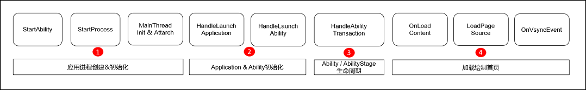

1. **应用进程创建&初始化阶段**：该阶段主要是系统完成应用进程的创建以及初始化的过程，包含了启动页图标(startWindowIcon)的解码。
2. **Application&Ability初始化**：该阶段主要是资源加载、虚拟机创建、Application&Ability相关对象的创建与初始化、依赖模块的加载等。
3. **Ability/AbilityStage生命周期**：该阶段主要是AbilityStage/Ability的启动生命周期，执行相应的生命周期回调。
4. **加载绘制首页**：该阶段主要是加载首页内容、测量布局、刷新组件并绘制。
5. **网络数据二次刷新**：该阶段主要是应用根据业务需要对网络数据进行请求、处理、二次刷新。

可见如果想要提升应用冷启动速度，需要缩短以上几个阶段的耗时。

>**说明：**
>
> 1. 关于本文中示例，可参考：[提升应用冷启动速度示例](https://gitee.com/openharmony/applications_app_samples/tree/OpenHarmony-5.0.0-Release/code/DocsSample/Ability/Performance/Startup)。
> 2. 如何使用SmartPerf工具分析冷启动可参考：[应用冷启动分析](performance-optimization-using-smartperf-host.md)。


## 1、缩短应用进程创建&初始化阶段耗时

该阶段主要是系统完成应用进程的创建以及初始化的过程，包含了启动页图标(startWindowIcon)的解码。

### 设置合适分辨率的startWindowIcon

该优化场景仅支持rk3568开发板。如果启动页图标分辨率过大，解码耗时会影响应用的启动速度，建议启动页图标分辨率不超过256像素*256像素，如下所示：

```json
    "abilities": [
      {
        "name": "EntryAbility",
        "srcEntry": "./ets/entryability/EntryAbility.ets",
        "description": "$string:EntryAbility_desc",
        "icon": "$media:icon",
        "label": "$string:EntryAbility_label",
        "startWindowIcon": "$media:startIcon", // 在这里修改启动页图标，建议不要超过256像素x256像素
        "startWindowBackground": "$color:start_window_background",
        "exported": true,
        "skills": [
          {
            "entities": [
              "entity.system.home"
            ],
            "actions": [
              "action.system.home"
            ]
          }
        ]
      }
    ]
```

下面使用[SmartPerf](https://gitee.com/openharmony/developtools_smartperf_host)工具，对使用优化前的启动页图标（4096像素\*4096像素）及使用优化后的启动页图标（144像素\*144像素）的启动性能进行对比分析。分析阶段的起点为点击应用图标打开应用时触发的触摸事件（即`ProcessTouchEvent`的结束点），阶段终点为应用第一次接到vsync（即`H:ReceiveVsync dataCount:24Bytes now:timestamp expectedEnd:timestamp vsyncId:int`的开始点）。

对比数据如下（性能耗时数据因设备版本而异，以实测为准）：

| 方案          | 阶段时长（毫秒） |
|-------------|:--------:|
| 使用优化前的启动页图标 |  998.6   |
| 使用优化后的启动页图标 |  722.5   |

可见阶段时长已缩短，故设置合适分辨率的startWindowIcon对缩短应用进程创建&初始化阶段耗时是有效的。

## 2、缩短Application&Ability初始化阶段耗时

该阶段主要是资源加载、虚拟机创建、Application&Ability相关对象的创建与初始化、依赖模块的加载等。  
主要耗时点在于资源加载阶段，分为主要的三个步骤：文件加载、依赖模块解析、文件执行。
1. 文件加载：查找并解析所有的文件到模块中记录。
2. 依赖模块解析（实例化）：分配内存空间来存放模块所有导出的变量，但这时候内存中并没有分配变量的值。
3. 文件执行：运行ets文件，将内存中之前未分配值的变量赋为真实的值。

下面将针对这三个阶段可能存在的优化手段进行详细展开说明。

### 减少使用嵌套export *的方式全量导出
应用冷启动过程中，会在**HandleLaunchAbility**中执行冷启动相关.ets文件，所有被主页面import的.ets文件均会被执行，包括数据结构、变量、全局函数的初始化等。首页需要用到的变量及函数等可能来源于其他ets文件，通过export的形式提供给首页使用。  
例：Numbers文件导出`export One`，需要在MainPage.ets中使用，尽量直接导入或者只嵌套一层Index文件，即在MainPage.ets中直接`import { One } from './Numbers'`。避免在Utils文件`export * from './Numbers'`，在SecondPage文件再次`export * from './Utils'`，最后在A文件中`import * from './SecondPage'`。  
以下为示例代码：  
【优化前】存在多层嵌套export *的方式全量导出
```ts
// Numbers.ets
export const One: number = 1;

// ...
// 此处嵌套多层export *

// Utils.ets
export * from './Numbers';

// SecondPage.ets
export * from './Utils';

// Index.ets
import * from './SecondPage';
```
【优化后】不存在嵌套export *，从目标文件中直接import
```ts
// 去掉冗余嵌套的export，即在Index.ets中直接import { One } from './Numbers'。

// Numbers.ets
export const  One: number = 1;

// Index.ets
import { One } from './Numbers';
```
由于依赖模块解析采用深度优先遍历的方式来遍历模块依赖关系图中每一个模块记录，会先从入口文件的第一个导入语句开始一层层往更深层查找，直到最后一个没有导入语句的模块为止，连接好这个模块的导出变量之后会回到上一级的模块继续这个步骤，因此多层export *的使用会导致依赖模块解析、文件执行阶段耗时增长。  
针对上述示例代码关注该阶段耗时差异，对优化前后启动性能进行对比分析。分析阶段的起点为开始加载abc文件（即`H:JSPandaFileExecutor::ExecuteFromAbcFile`），阶段终点为`abc文件`加载完成。

【优化前】存在8层嵌套export *
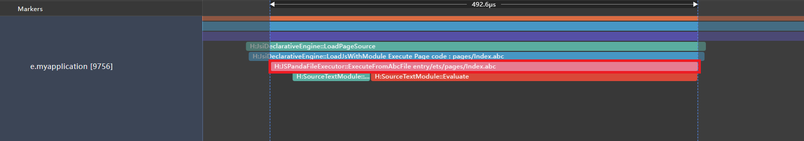

【优化后】不存在嵌套export *，从目标文件中直接import
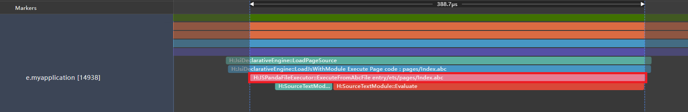

对比数据如下：

| 方案          |  阶段时长（微秒）  |
|-------------|:----------:|
| （优化前）存在8层嵌套export * |   492.6    |
| （优化后）不存在嵌套export *，从目标文件中直接import |   388.7    |

可见阶段时长已缩短。因此减少多层文件的嵌套导出export *可以提升应用冷启动速度。

>**说明：**
>
>本示例中嵌套层次较浅，从时间上观测到的收益不明显，当实际开发过程中可能会涉及到更加复杂的情况，修改后对性能收益会更明显。

### 减少import *的方式全量引用
应用程序加载过程中，需要使用不同模块中的变量或函数，通常应用开发者会将相同类型的变量或函数放在同一个工具类文件当中，使用时通过import的方式引入对应的模块，当工具类中存在较多暴露函数或变量时，推荐直接import对应的变量，可以减少该阶段中.ets文件执行耗时，即减少文件中所有export变量的初始化过程。  
以下为示例代码：  
【优化前】Index.ets中使用 import * as nm from '../utils/Numbers'。
```ts
// Index.ets
import * as nm from '../utils/Numbers'; // 不推荐import *的方式
hilog.info(0x0000, 'testTag', '%{public}d', nm.One); // 此处仅用到变量One

// Numbers.ets
export const One: number = 1;
export const Two: number = 2;
// ...
// 此处省略2000条数据
```

【优化后】Index.ets中使用 import { One } from '../utils/Numbers'。
```ts
// Index.ets
import { One } as nm from '../utils/Numbers'; // 推荐按需引用变量
hilog.info(0x0000, 'testTag', '%{public}d', One); // 此处仅用到变量One

// Numbers.ets
export const One: number = 1;
export const Two: number = 2;
// ...
// 此处省略2000条数据
```
下面对优化前后启动性能进行对比分析，分析阶段的起点为UI Ability Launching开始（即`H:void OHOS::AppExecFwk::MainThread::HandleLaunchAbility(const std::shared_ptr<AbilityLocalRecord> &`)的开始点），阶段终点为UI Ability Launching结束（即`H:void OHOS::AppExecFwk::MainThread::HandleLaunchAbility(const std::shared_ptr<AbilityLocalRecord> &)`的结束点）。

【优化前】使用import * as nm全量引用2000条数据
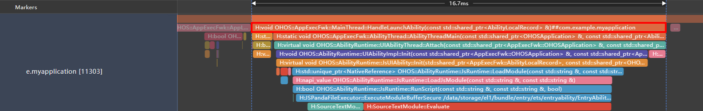

【优化后】使用import { One }按需引用
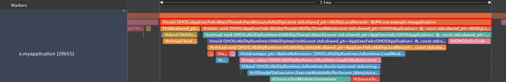

对比数据如下：

| 方案          |   阶段时长（毫秒）    |
|-------------|:-------------:|
| （优化前）使用import * as nm全量引用 |     16.7      |
| （优化后）使用import { One }按需引用 |      7.1      |

可见阶段时长已缩短。因此将非UI耗时操作移至子线程中处理，可以缩短应用冷启动完成时延。

>**说明：**
>
> **此优化方案仅可将冷启动阶段耗时缩短，但是可能导致其他场景耗时增长，即变量初始化过程从冷启动阶段分摊至其他使用阶段**。  
> 例：二级页面使用到Number中Two变量，此方案会使二级页面跳转过程对比优化前耗时更长。

### 减少使用未引用的import模块

应用代码执行前，应用程序必须找到并加载import的所有模块。应用程序启动时会因加载并使用的每个额外第三方框架或模块而增加启动耗时，耗时长短取决于加载的第三方框架或者模块的数量和大小。推荐开发者尽可能使用系统提供的模块，按需加载，来缩短应用程序的启动耗时。

以下为示例代码：

```ts
// 优化减少import的模块
// import { particleAbility, featureAbility, wantConstant } from '@kit.AbilityKit';
// import { FormExtensionAbility } from '@kit.FormKit';
// import { GesturePath, GesturePoint } from '@kit.AccessibilityKit';
// import { distributedAccount, BusinessError, osAccount } from '@kit.BasicServicesKit';
// import { webview } from '@kit.ArkWeb';

import { AbilityConstant, UIAbility, Want } from '@kit.AbilityKit';
import { window } from '@kit.ArkUI';
import { hilog } from '@kit.PerformanceAnalysisKit';

export default class EntryAbility extends UIAbility {
  onCreate(want: Want, launchParam: AbilityConstant.LaunchParam): void {
    // ...
    // webview.WebviewController.initializeWebEngine();
  }
  // ...
}
```

需要说明，这里为了方便对比该阶段导入模块和不导入模块的性能差异，用一个@ohos.web.webview模块进行对比，这里假设@ohos.web.webview模块并非该阶段必须导入的模块。而在实际业务场景中，由于webview初始化时间较长，如果放到页面跳转时再导入该模块进行使用，有可能会劣化页面跳转的完成时延。因此，模块是否能在该阶段进行优化还需要结合具体业务场景进行评估。

下面使用DevEco Studio内置的Profiler中的启动分析工具Launch，对优化import的模块前（导入@ohos.web.webview模块）及优化import的模块后（不导入@ohos.web.webview模块）的启动性能进行对比分析。下面是Launch工具抓取的UI Ability Launching（加载UI Ability）耗时，对比数据如下（性能耗时数据因设备型号版本而异，以实测为准）：

| 方案           | UI Ability Launching阶段时长（毫秒） |
|--------------|:----------------------------:|
| 优化import的模块前 |              26              |
| 优化import的模块后 |              10              |

可见阶段时长已缩短，故减少import的模块对缩短Application&Ability初始化阶段耗时是有效的。这里建议该阶段应减少应用启动时非必要的import模块，按需加载模块，缩短应用程序的启动耗时。

### 合理拆分导出文件，减少冗余文件执行
应用程序加载模块后，需要执行应用侧的.ets文件，对其进行初始化，并执行全局初始化变量、函数。可以将文件分为两类，一类为冷启动强相关文件（如首页展示界面及组件相关文件），一类为非冷启动强相关文件（如跳转后二级页面），在冷启动过程中仅执行冷启动强相关文件，来缩短应用的启动耗时。  
**场景示例：**  
应用存在两个页面，首页Index展示为HAR包中**MainPage.ets**的Text组件，该文件中不包含耗时操作；首页点击Text跳转至**SecondPage**，其中引用了HAR包中的**SubPage.ets**，该文件存在全局函数的耗时操作，会在模块加载时执行。但是HAR包中的导出文件Index.ets同时导出了**MainPage.ets和SubPage.ets**，而首页直接import { MainPage } from 'library/Index'的方式会导致应用在冷启动过程中执行了非冷启动强相关文件**SubPage.ets**，增加了冷启动耗时。

【优化前】加载模块时执行了非冷启动相关文件SubPage.ets

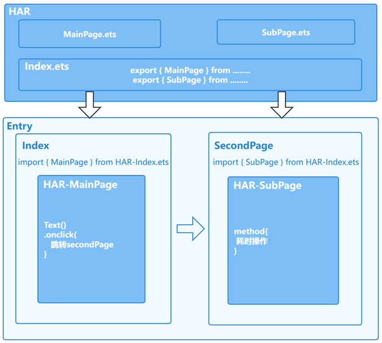

以下为示例代码：
```ts
// entry/src/main/ets/pages/Index.ets
import { MainPage } from 'library/Index'; // 不推荐用法：直接导入了与冷启动非强相关文件SubPage.ets
export struct Index{
  @Provide pathStack: NavPathStack = new NavPathStack();
  build() {
    Navigation(this.pathStack) {
      Row() {
        // 引用HAR的自定义组件
        MainPage()
      }
    }
  }
}

// library/src/main/ets/components/mainpage/MainPage.ets
@Component
export struct MainPage {
  @Consume pathStack: NavPathStack;
  @State message: string = 'HAR MainPage';
  build() {
    Row() {
      Text(this.message)
        .fontSize(32)
        .fontWeight(FontWeight.Bold)
    }.onClick(() => {
      this.pathStack.pushPath({ name: 'SecondPage' });
    })
  }
}

// entry/src/main/ets/pages/SecondPage.ets
import { SubPage } from 'library/Index';
@Builder
export function SecondPageBuilder() {
  SecondPage()
}
@Entry
@Component
struct SecondPage {
  pathStack: NavPathStack = new NavPathStack();
  build() {
    NavDestination() {
      Row() {
        // 引用HAR的自定义组件
        SubPage()
      }
      .height('100%')
    }
    .onReady((context: NavDestinationContext) => {
      this.pathStack = context.pathStack;
    })
  }
}

// library/src/main/ets/components/mainpage/SubPage.ets
// SubPage中的全局耗时函数
const LARGE_NUMBER = 10000000;
function computeTask(): number {
  let count = 0;
  while (count < LARGE_NUMBER) {
    count++;
  }
  return count;
}
let count = computeTask();
// ...

// library/Index.ets
export { MainPage } from './src/main/ets/components/mainpage/MainPage'; // 冷启动强相关文件
export { SubPage } from './src/main/ets/components/mainpage/SubPage'; // 非冷启动强相关文件
```

**【优化方案一】**  
将HAR包的导出文件**Index.ets**进行拆分，**IndexAppStart.ets**文件仅导出首页相关文件，即**MainPage.ets**。**IndexOthers.ets**文件导出非首页相关文件，即**SubPage.ets。**  
**优点**：使用此种方案优化后可以将冷启阶段（加载首页文件）与非冷启阶段（加载非首页文件）需要执行的.ets文件进行完全拆分，类比其他需优化的场景也可以使用本方案进行拆分。  
**缺点**：需保证拆分后IndexAppStart.ets中的导出文件不存在对于IndexOthers.ets中的导出文件的引用。

【图一】拆分HAR导出文件

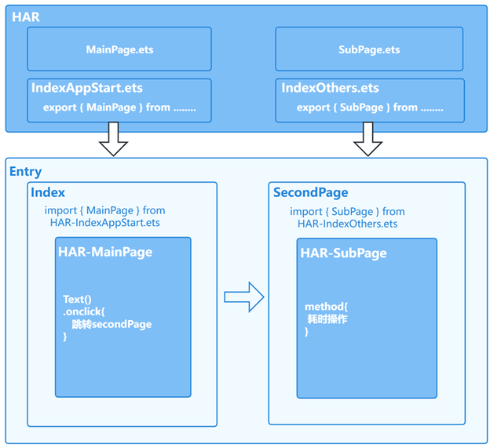

以下为示例代码：
1. 将HAR包的导出文件Index.ets进行拆分，IndexAppStart.ets文件仅导出首页相关文件，IndexOthers.ets文件导出非首页相关文件。
```ts
// library/IndexAppStart.ets
export { MainPage } from './src/main/ets/components/mainpage/MainPage';
// library/IndexOthers.ets
export { SubPage } from './src/main/ets/components/mainpage/SubPage';
```
2. 首页Index从IndexAppStart.ets导入MainPage。
```ts
// Index.ets
import { MainPage } from 'library/IndexAppStart';

@Entry
@Component
struct Index {
  @Provide pathStack: NavPathStack = new NavPathStack();

  build() {
    Navigation(this.pathStack) {
      Row() {
        // 引用HAR的自定义组件
        MainPage()
      }
    }
    .height('100%')
    .width('100%')
  }
}
```
3. 跳转后的页面SecondPage从IndexOthers.ets导入SubPage。
```ts
// SecondPage.ets
import { SubPage } from 'library/IndexOthers';

@Builder
export function SecondPageBuilder() {
  SecondPage()
}

@Entry
@Component
struct SecondPage {
  pathStack: NavPathStack = new NavPathStack();

  build() {
    NavDestination() {
      Row() {
        // 引用HAR的自定义组件
        SubPage()
      }
      .height('100%')
    }
    .onReady((context: NavDestinationContext) => {
      this.pathStack = context.pathStack;
    })
  }
}
```
**【优化方案二】**  
在首页的**Index.ets**文件中导入**MainPage.ets**时使用全路径展开。  
**优点**：不需要新增文件来汇总导出所有冷启阶段文件。  
**缺点**：引用时需要对所有冷启阶段文件进行路径展开，增加开发和维护成本。

【图二】首页导入冷启动文件时使用全路径展开

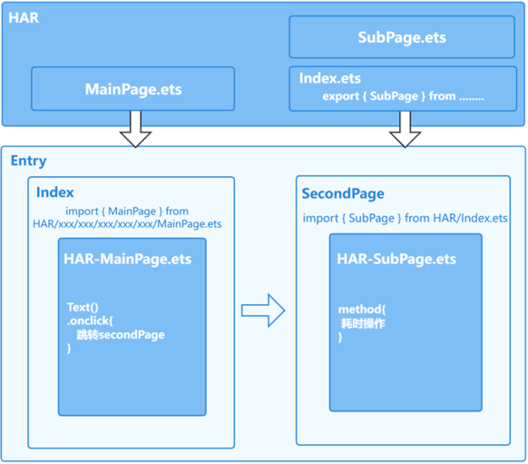

以下为示例代码：
```ts
// Index.ets
import { MainPage } from 'library/src/main/ets/components/mainpage/MainPage';

@Entry
@Component
struct Index {
  @Provide pathStack: NavPathStack = new NavPathStack();

  build() {
    Navigation(this.pathStack) {
      Row() {
        // 引用HAR的自定义组件
        MainPage()
      }
    }
    .height('100%')
    .width('100%')
  }
}
```
>**说明：**
>
>1. **上述两种优化方案默认MainPage中不存在对于SubPage中的import。**
>2. **当存在MainPage对于SubPage的直接import时，需要使用[动态import](../arkts-utils/arkts-dynamic-import.md)方法来进行优化。**
>3. 开发者可自行根据优化方案的优缺点权衡选择合适的优化方案。

下面对优化前后启动性能进行对比分析。阶段起点为`UI Ability Launching`的开始点，阶段终点为应用首帧即`First Frame - App Phase`的开始点。

【优化前】加载模块时执行了非冷启动相关文件  
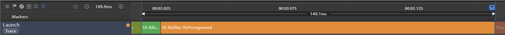

【优化方案一】拆分HAR导出文件   
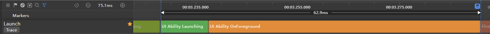

【优化方案二】导入冷启动文件时全路径展开  


优化前后的对比数据如下：

| 方案        |  阶段时长（毫秒）  |
|-----------|:----------:|
| 优化前 |   140.1    |
| 优化方案一（拆分HAR导出文件） |    62.9    |
| 优化方案二（导入冷启动文件时全路径展开） |    61.3    |

可见阶段时长已缩短，因此可以通过拆分HAR包导出的Index.ets文件或导入冷启动文件时路径全展开的方案，减少应用冷启动中.ets文件执行耗时，从而提升应用冷启动速度。

### 使用延迟加载Lazy-Import减少冷启动冗余文件执行

可以通过延迟加载 [lazy-import](../arkts-utils/arkts-lazy-import.md) 延缓对冷启动时暂不执行的冗余文件的加载，而在后续导出变量被真正使用时再同步加载执行文件，节省资源以提高应用冷启动性能。  
详细使用指导请参考[延迟加载lazy-import使用指导](Lazy-Import-Instructions.md)。

### 减少多个HSP/HAP对于相同HAR的引用

在应用开发的过程中，可以使用[HSP](../quick-start/in-app-hsp.md)或[HAR](../quick-start/har-package.md)的共享包方式将同类的模块进行整合，用于实现多个模块或多个工程间共享ArkUI组件、资源等相关代码。    
由于共享包的动态和静态差异，在多HAP/HSP引用相同HAR包的情况下，会存在HAR包中的单例失效，从而影响到应用冷启动的性能。

【优化前】HAP包和HSP包分别引用相同HAR包


如上图所示，工程内存在三个模块，HAP包为应用主入口模块，HSP为应用主界面显示模块，HAR_COMMON集成了所有通用工具类，其中funcResult为func方法的执行结果。  
由于HAP和HSP模块同时引用HAR_COMMON模块时会破坏HAR的单例模式，所以HAP和HSP模块使用**HAR_COMMON**中的**funcResult**时，会导致func方法在两个模块加载时各执行一次，使得文件执行时间耗时增长。  
如果仅从性能的角度考虑，可以使用以下方式进行修改，从而达到缩短冷启动阶段耗时的目的。

【优化后】切换为HAP包和HAR包分别引用相同HAR包


>**说明：**
>
> 1. 在多HAP/HSP引用相同HAR包的情况下，若HSP包和HAR包均能满足业务需求，建议将HSP包改成HAR包。
> 2. 若使用的HSP为集成态HSP，可跳过该优化方案。

以下为示例代码：
1. 在被引用HAR_COMMON包中写入功能示例。
```ts
// har_common/src/main/ets/utils/Utils.ets
const LARGE_NUMBER = 100000000;
function func(): number {
  let count = 0;
  while (count < LARGE_NUMBER) {
    count++;
  }
  return count;
}
export let funcResult = func();
```
2. 分别通过使用HSP包和HAR包来引用该HAR_COMMON包中的功能进行性能对比实验。
- 使用HAP包和HSP包引用该HAR_COMMON包中的功能。  
  HAP包引用HAR_COMMON包中的功能。

  ```ts
  // entry/src/main/ets/pages/Index.ets
  import { MainPage } from 'hsp_library';
  import { funcResult } from 'har_common';
  ```
  HSP包引用HAR_COMMON包中的功能。
  ```ts
  // hsp_library/src/main/ets/pages/MainPage.ets
  import { funcResult } from 'har_common';
  ```
- 使用HAP包和HAR包引用该HAR_COMMON包中的功能。  
  HAP包引用HAR_COMMON包中的功能。
  ```ts
  // entry/src/main/ets/pages/Index.ets
  import { MainPage } from 'har_library';
  import { funcResult } from 'har_common';
  ```
  HAR包引用HAR_COMMON包中的功能。
  ```ts
  // har_library/src/main/ets/pages/MainPage.ets
  import { funcResult } from 'har_common';
  ```
下面对优化前后启动性能进行对比分析。分析阶段的起点为启动Ability（即`H:void OHOS::AppExecFwk::MainThread::HandleLaunchAbility`的开始点），阶段终点为应用第一次接到vsync（即`H:ReceiveVsync dataCount:24Bytes now:timestamp expectedEnd:timestamp vsyncId:int`的开始点）。

【优化前】使用HSP包
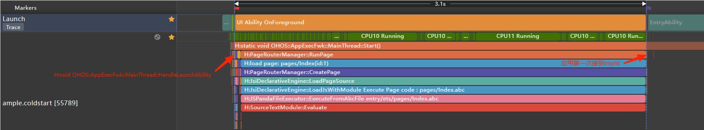

【优化后】使用HAR代替HSP
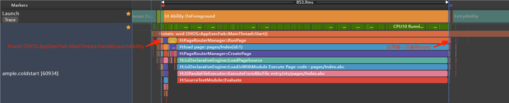

优化前后的对比数据如下：

| 方案               |  阶段时长（毫秒）  |
|------------------|:----------:|
| （优化前）使用HSP包      |    3125    |
| （优化后）使用HAR代替HSP |   853.9    |

从测试数据可以看出，将HSP替换为HAR包后，应用启动的阶段耗时明显缩短。

>**说明：**
>
> 上述示例为凸显出差异，func执行函数循环次数为100000000，开发者实际修改后收益需根据实际情况测试。


## 3、缩短AbilityStage生命周期阶段耗时

该阶段主要是AbilityStage的启动生命周期，执行相应的生命周期回调。

### 避免在AbilityStage生命周期回调接口进行耗时操作

在应用启动流程中，系统会执行AbilityStage的生命周期回调函数。因此，不建议在这些回调函数中执行耗时过长的操作，耗时操作建议通过异步任务延迟处理或者放到其他线程执行。

在这些生命周期回调里，推荐开发者只做必要的操作，详情可以参考：[AbilityStage组件容器](../application-models/abilitystage.md)。

以下为示例代码：

```ts
const LARGE_NUMBER = 10000000;
const DELAYED_TIME = 1000;

export default class MyAbilityStage extends AbilityStage {
  onCreate(): void {
    // 耗时操作
    // this.computeTask();
    this.computeTaskAsync(); // 异步任务
  }

  onAcceptWant(want: Want): string {
    // 仅specified模式下触发
    return 'MyAbilityStage';
  }

  computeTask(): void {
    let count = 0;
    while (count < LARGE_NUMBER) {
      count++;
    }
  }

  private computeTaskAsync(): void {
    setTimeout(() => { // 这里使用setTimeout来实现异步延迟运行
      this.computeTask();
    }, DELAYED_TIME);
  }
}
```

下面使用[SmartPerf](https://gitee.com/openharmony/developtools_smartperf_host)工具，对优化前同步执行耗时操作及优化后异步执行耗时操作的启动性能进行对比分析。分析阶段的起点为启动Ability（即`H:void OHOS::AppExecFwk::MainThread::HandleLaunchAbility`的开始点），阶段终点为应用第一次接到vsync（即`H:ReceiveVsync dataCount:24Bytes now:timestamp expectedEnd:timestamp vsyncId:int`的开始点）。

对比数据如下：

|                        | 阶段开始(秒)   | 阶段结束(秒)   | 阶段时长(秒) |
| ---------------------- | -------------- | -------------- | ------------ |
| 优化前同步执行耗时操作 | 2124.915558194 | 2127.041354575 | 2.125796381  |
| 优化后异步执行耗时操作 | 4186.436835246 | 4186.908777335 | 0.471942089  |

可见阶段时长已缩短，故避免在AbilityStage生命周期回调接口进行耗时操作对缩短AbilityStage生命周期阶段耗时是有效的。

## 4、缩短Ability生命周期阶段耗时

该阶段主要是Ability的启动生命周期，执行相应的生命周期回调。

### 非UI耗时操作并行化
在应用启动流程中，主要聚焦在执行UI相关操作中，为了更快的能显示首页内容，不建议在主线程中执行非UI相关的耗时操作，耗时操作建议通过异步任务进行延迟处理或放到其他子线程中执行，线程并发方案可以参考：[TaskPool和Worker的对比实践](../arkts-utils/multi-thread-concurrency-overview.md)。  
在冷启动过程中如果存在图片下载、网络请求前置数据、数据反序列化等非UI操作可以根据开发者实际情况移至子线程中进行，参考下面文章：[避免在主线程中执行耗时操作](avoid_time_consuming_operations_in_mainthread.md)。

### 避免在Ability生命周期回调接口进行耗时操作

在应用启动流程中，系统会执行Ability的生命周期回调函数。因此，不建议在这些回调函数中执行耗时过长的操作，耗时操作建议通过异步任务延迟处理或者放到其他线程执行。

在这些生命周期回调里，推荐开发者只做必要的操作，下面以UIAbility为例进行说明。关于UIAbility组件生命周期的详细说明，参见[UIAbility组件生命周期](../application-models/uiability-lifecycle.md)。

```ts
const LARGE_NUMBER = 10000000;
const DELAYED_TIME = 1000;

export default class EntryAbility extends UIAbility {
  onCreate(want: Want, launchParam: AbilityConstant.LaunchParam): void {
    hilog.info(0x0000, 'testTag', 'Ability onCreate');
    // 耗时操作
    // this.computeTask();
    this.computeTaskAsync(); // 异步任务
  }

  onDestroy(): void {
    hilog.info(0x0000, 'testTag', 'Ability onDestroy');
  }

  onWindowStageCreate(windowStage: window.WindowStage): void {
    hilog.info(0x0000, 'testTag', 'Ability onWindowStageCreate');

    windowStage.loadContent('pages/Index', (err, data) => {
      if (err.code) {
        hilog.error(0x0000, 'testTag', 'Failed to load the content. Cause: ' + JSON.stringify(err) ?? '');
        return;
      }
      hilog.info(0x0000, 'testTag', 'Succeeded in loading the content. Data: ' + JSON.stringify(data) ?? '');
    });

    // 耗时操作
    // this.computeTask();
    this.computeTaskAsync(); // 异步任务
  }

  onWindowStageDestroy(): void {
    hilog.info(0x0000, 'testTag', 'Ability onWindowStageDestroy');
  }

  onForeground(): void {
    hilog.info(0x0000, 'testTag', 'Ability onForeground');
    // 耗时操作
    // this.computeTask();
    this.computeTaskAsync(); // 异步任务
  }

  onBackground(): void {
    hilog.info(0x0000, 'testTag', 'Ability onBackground');
  }

  computeTask(): void {
    let count = 0;
    while (count < LARGE_NUMBER) {
      count++;
    }
  }

  private computeTaskAsync(): void {
    setTimeout(() => { // 这里使用setTimeout来实现异步延迟运行
      this.computeTask();
    }, DELAYED_TIME);
  }
}
```

下面使用[SmartPerf](https://gitee.com/openharmony/developtools_smartperf_host)工具，对优化前同步执行耗时操作及优化后异步执行耗时操作的启动性能进行对比分析。分析阶段的起点为启动Ability（即`H:void OHOS::AppExecFwk::MainThread::HandleLaunchAbility`的开始点），阶段终点为应用第一次接到vsync（即`H:ReceiveVsync dataCount:24Bytes now:timestamp expectedEnd:timestamp vsyncId:int`的开始点）。

对比数据如下：

| 方案          | 阶段开始(秒)   | 阶段结束(秒)   | 阶段时长(秒) |
|-------------| -------------- | -------------- | ------------ |
| 优化前同步执行耗时操作 | 1954.987630036 | 1957.565964504 | 2.578334468  |
| 优化后异步执行耗时操作 | 4186.436835246 | 4186.908777335 | 0.471942089  |

可见阶段时长已缩短，故避免在Ability生命周期回调接口进行耗时操作对缩短Ability生命周期阶段耗时是有效的。

## 5、缩短加载绘制首页阶段耗时

该阶段主要是加载首页内容、测量布局、刷新组件并绘制。

### 自定义组件生命周期回调接口里避免耗时操作

自定义组件的生命周期变更会调用相应的回调函数。

aboutToAppear函数会在创建自定义组件实例后，页面绘制之前执行，以下代码在aboutToAppear中对耗时间的计算任务进行了异步处理，避免在该接口执行该耗时操作，不阻塞页面绘制。

以下为示例代码：

```ts
const LARGE_NUMBER = 10000000;
const DELAYED_TIME = 1000;

@Entry
@Component
struct Index {
  @State private text: string = "";
  private count: number = 0;

  aboutToAppear() {
    // 耗时操作
    // this.computeTask();
    this.computeTaskAsync(); // 异步任务
    let context = getContext(this) as Context;
    this.text = context.resourceManager.getStringSync($r('app.string.startup_text'));
  }

  build() {
    Column({ space: 10 }) {
      Text(this.text).fontSize(50)
    }
    .width('100%')
    .height('100%')
    .padding(10)
  }

  computeTask(): void {
    this.count = 0;
    while (this.count < LARGE_NUMBER) {
      this.count++;
    }
    let context = getContext(this) as Context;
    this.text = context.resourceManager.getStringSync($r('app.string.task_text'));
  }

  // 运算任务异步处理
  private computeTaskAsync(): void {
    setTimeout(() => { // 这里使用setTimeout来实现异步延迟运行
      this.computeTask();
    }, DELAYED_TIME);
  }
}
```

下面使用[SmartPerf](https://gitee.com/openharmony/developtools_smartperf_host)工具，对优化前同步执行耗时操作及优化后异步执行耗时操作的启动性能进行对比分析。分析阶段的起点为启动Ability（即`H:void OHOS::AppExecFwk::MainThread::HandleLaunchAbility`的开始点），阶段终点为应用第一次接到vsync（即`H:ReceiveVsync dataCount:24Bytes now:timestamp expectedEnd:timestamp vsyncId:int`的开始点）。

对比数据如下：

| 方案          | 阶段开始(秒)   | 阶段结束(秒)   | 阶段时长(秒) |
|-------------| -------------- | -------------- | ------------ |
| 优化前同步执行耗时操作 | 3426.272974492 | 3431.785898837 | 5.512924345  |
| 优化后异步执行耗时操作 | 4186.436835246 | 4186.908777335 | 0.471942089  |

可见阶段时长已缩短，因此在自定义组件生命周期回调接口中避免耗时操作可以缩短加载绘制首页阶段耗时。

## 6、缩短网络数据二次刷新阶段耗时

该阶段主要是应用根据业务需要对网络数据进行请求、处理、二次刷新。

### 网络请求提前发送
当前大多数应用的首页内容需从网络获取，发送网络请求的时机显得尤为重要。应用发送网络请求后等待网络数据的返回，网络请求的这段时间应用可以继续执行启动流程，直到网络数据返回后进行解析，反序列化之后就可以加载首页数据，因此网络请求的发起时机越早，整个冷启动的完成时延阶段越短。

可将网络请求及网络请求前的初始化流程放置在AbilityStage/UIAbility的onCreate()生命周期中，在AbilityStage/UIAbility中仅执行网络相关预处理，等待网络请求发送后可继续执行首页数据准备、UI相关操作。在服务端处理流程相同的情况下，应用可以更早的拿到网络数据并行展示。

【优化前】应用首页框架加载时进行网络数据请求
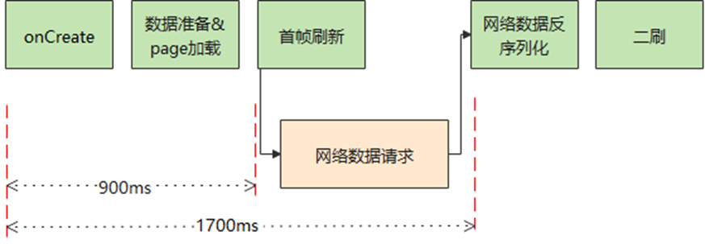

将网络请求提前至AbilityStage/UIAbility生命的onCreate()生命周期回调函数中，可以将首刷或二刷的时间提前，减少用户等待时间。此处为了体现性能收益，将网络请求放到了更早的AbilityStage的onCreate()生命周期回调中。

【优化后】网络请求提前至AbilityStage的onCreate()周期回调中
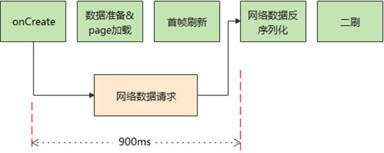

以下为示例代码：  
【优化前】：在首页根组件的onAppear()生命周期回调中发起网络请求。
```ts
// entry/src/main/ets/pages/Index.ets
import { httpRequest } from '../utils/NetRequest';
import { number } from '../utils/Calculator';

AppStorage.link('netData');
PersistentStorage.persistProp('netData', undefined);

@Entry
@Component
struct Index {
  @State message: string = 'Hello World' + number; // 为了体现性能收益，引用耗时函数的执行结果number
  @StorageLink('netData') netData: PixelMap | undefined = undefined;
  build(){
    Row(){
      Image(this.netData)
        .objectFit(ImageFit.Contain)
        .width('50%')
        .height('50%')
    }
    .onAppear(() => {
      // 发送网络请求
      httpRequest();
    })
  }
}

// entry/src/main/ets/utils/NetRequest.ets
import { hiTraceMeter } from '@kit.PerformanceAnalysisKit';
import { http } from '@kit.NetworkKit';
import { BusinessError } from '@kit.BasicServicesKit';
import { image } from '@kit.ImageKit';
// 通过http的request方法从网络下载图片资源
export function httpRequest() {
  hiTraceMeter.startTrace('Http Request', 1);
  http.createHttp()
    // 实际开发需要将"https://www.example1.com/POST?e=f&g=h"替换成为真实要访问的网站地址
    .request('https://www.example1.com/POST?e=f&g=h',
      (error: BusinessError, data: http.HttpResponse) => {
        if (error) {
          // 下载失败时不执行后续逻辑
          return;
        }
        // 处理网络请求返回的数据
        transcodePixelMap(data);
      }
    )
}
// 使用createPixelMap将ArrayBuffer类型的图片装换为PixelMap类型
function transcodePixelMap(data: http.HttpResponse) {
  if (http.ResponseCode.OK === data.responseCode) {
    const imageData: ArrayBuffer = data.result as ArrayBuffer;
    // 通过ArrayBuffer创建图片源实例
    const imageSource: image.ImageSource = image.createImageSource(imageData);
    const options: image.InitializationOptions = {
      'alphaType': 0, // 透明度
      'editable': false, // 是否可编辑
      'pixelFormat': 3, // 像素格式
      'scaleMode': 1, // 缩略值
      'size': { height: 100, width: 100 }
    }; // 创建图片大小
    // 通过属性创建PixelMap
    imageSource.createPixelMap(options).then((pixelMap: PixelMap) => {
      AppStorage.set('netData', pixelMap);
      hiTraceMeter.finishTrace('Http Request', 1);
    });
  }
}

// entry/src/main/ets/utils/Calculator.ets
const LARGE_NUMBER = 100000000;
function computeTask(): number {
  let count = 0;
  while (count < LARGE_NUMBER) {
    count++;
  }
  return count;
}
export let number = computeTask();
```

【优化后】
1. 在NetRequest.ets中进行Http请求以及数据处理。
```ts
// NetRequest.ets
import { hiTraceMeter } from '@kit.PerformanceAnalysisKit';
import { http } from '@kit.NetworkKit';
import { BusinessError } from '@kit.BasicServicesKit';
import { image } from '@kit.ImageKit';
// 通过http的request方法从网络下载图片资源
export function httpRequest() {
  hiTraceMeter.startTrace('Http Request', 1);
  http.createHttp()
    // 实际开发需要将"https://www.example1.com/POST?e=f&g=h"替换成为真实要访问的网站地址
    .request('https://www.example1.com/POST?e=f&g=h',
      (error: BusinessError, data: http.HttpResponse) => {
        if (error) {
          // 下载失败时不执行后续逻辑
          return;
        }
        // 处理网络请求返回的数据
        transcodePixelMap(data);
      }
    )
}

// 使用createPixelMap将ArrayBuffer类型的图片装换为PixelMap类型
function transcodePixelMap(data: http.HttpResponse) {
  if (http.ResponseCode.OK === data.responseCode) {
    const imageData: ArrayBuffer = data.result as ArrayBuffer;
    // 通过ArrayBuffer创建图片源实例
    const imageSource: image.ImageSource = image.createImageSource(imageData);
    const options: image.InitializationOptions = {
      'alphaType': 0, // 透明度
      'editable': false, // 是否可编辑
      'pixelFormat': 3, // 像素格式
      'scaleMode': 1, // 缩略值
      'size': { height: 100, width: 100 }
    }; // 创建图片大小
    // 通过属性创建PixelMap
    imageSource.createPixelMap(options).then((pixelMap: PixelMap) => {
      AppStorage.set('netData', pixelMap);
      hiTraceMeter.finishTrace('Http Request', 1);
    });
  }
}
```
2. 在AbilityStage的onCreate()生命周期回调中发起网络请求。
```ts
// MyAbilityStage.ets
import { AbilityStage, Want } from '@kit.AbilityKit';
import { httpRequest } from '../utils/NetRequest';
export default class MyAbilityStage extends AbilityStage {
  onCreate(): void {
    // 发送网络请求
    httpRequest();
  }

  onAcceptWant(want: Want): string {
    // 仅specified模式下触发
    return 'MyAbilityStage';
  }
}
```
3. 在首页Index.ets中展示请求获取的图片。
```ts
// Index.ets
import { number } from '../utils/Calculator';

AppStorage.link('netData');
PersistentStorage.persistProp('netData', undefined);

@Entry
@Component
struct Index {
  @State message: string = 'Hello World' + number; // 为了体现性能收益，引用耗时函数的执行结果number
  @StorageLink('netData') netData: PixelMap | undefined = undefined;
  build() {
    Row() {
      Image(this.netData)
        .objectFit(ImageFit.Contain)
        .width('50%')
        .height('50%')
    }
    .onDisAppear(() => {
      AppStorage.set('netData', undefined);
    })
    .height('100%')
    .width('100%')
  }
}
```

下面对优化前后启动性能进行对比分析，分析阶段的起点为启动Ability（即`H:void OHOS::AppExecFwk::MainThread::HandleLaunchAbility`的开始点），阶段终点为应用接收到网络数据返回后的首帧刷新（即`H:ReceiveVsync dataCount:24Bytes now:timestamp expectedEnd:timestamp vsyncId:int`的开始点）。

【优化前】优化网络请求时机前
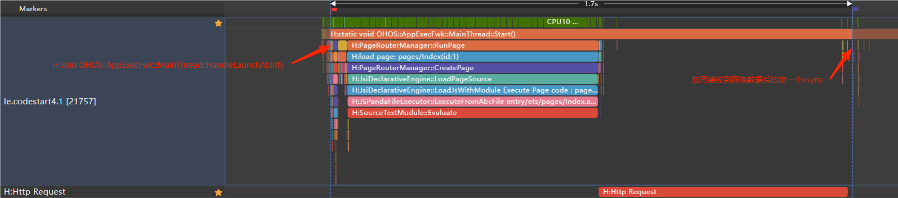

【优化后】优化网络请求时机后


对比数据如下：

| 方案        |  阶段时长(毫秒)  |
|-----------|:----------:|
| 优化网络请求时机前 |    1700    |
| 优化网络请求时机后 |   885.3    |

因此，可以通过提前网络请求的方式减少应用冷启动耗时。

### 使用本地缓存首页数据

使用本地缓存首页数据是优化应用性能的关键一环。它能有效缩短冷启动时的白屏或白块时间，显著提升用户体验。该策略通过预先存储并优先展示缓存中的首页数据，减少了对外部资源（如网络）的依赖，从而加快数据加载速度。当数据更新时，应用则智能地从网络等渠道获取最新内容，确保信息的时效性与准确性。使用本地缓存首页数据，不仅让应用响应更迅速，还显著优化了整体运行流畅度，为用户带来更加顺畅的体验。更多实现细节与性能提升分析，请参见[合理使用缓存提升性能](./reasonable_using_cache_improve_performance.md)。