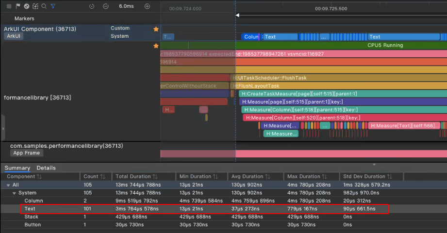
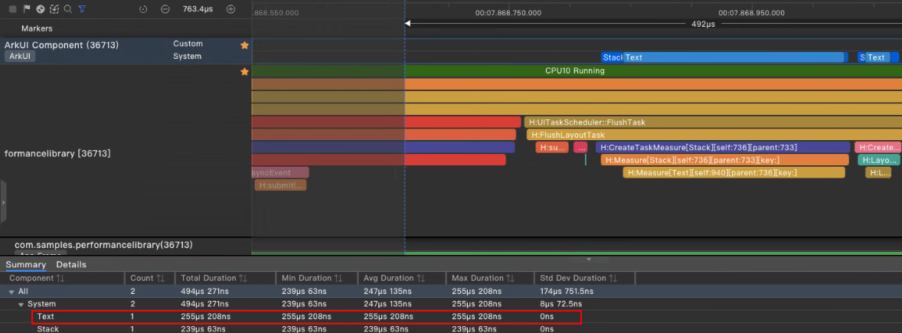

# 提升应用响应速度

应用对用户的输入需要快速反馈，以提升交互体验，因此本文提供了以下方法来提升应用响应速度。

- 避免主线程被非UI任务阻塞
- 减少组件刷新的数量

## 避免主线程被非UI任务阻塞

在应用响应用户输入期间，应用主线程应尽可能只执行UI任务（待显示数据的准备、可见视图组件的更新等），非UI的耗时任务（长时间加载的内容等）建议通过异步任务延迟处理或者分配到其他线程处理。

### 使用组件异步加载特性

当前系统提供的Image组件默认生效异步加载特性，当应用在页面上展示一批本地图片的时候，会先显示空白占位块，当图片在其他线程加载完毕后，再替换占位块。这样图片加载就可以不阻塞页面的显示，给用户带来良好的交互体验。因此，只在加载图片耗时比较短的情况下建议下述代码。 

```typescript
@Entry
@Component
struct ImageExample1 {
  build() {
    Column() {
      Row() {
        Image('resources/base/media/sss001.jpg')
          .border({ width: 1 }).borderStyle(BorderStyle.Dashed).aspectRatio(1).width('25%').height('12.5%')
        Image('resources/base/media/sss002.jpg')
          .border({ width: 1 }).borderStyle(BorderStyle.Dashed).aspectRatio(1).width('25%').height('12.5%')
        Image('resources/base/media/sss003.jpg')
          .border({ width: 1 }).borderStyle(BorderStyle.Dashed).aspectRatio(1).width('25%').height('12.5%')
        Image('resources/base/media/sss004.jpg')
          .border({ width: 1 }).borderStyle(BorderStyle.Dashed).aspectRatio(1).width('25%').height('12.5%')
      }
    // 此处省略若干个Row容器，每个容器内都包含如上的若干Image组件
    }
  }
}
```

建议：在加载图片的耗时比较短的时候，通过异步加载的效果会大打折扣，建议配置Image的syncLoad属性。

```typescript
@Entry
@Component
struct ImageExample2 {
  build() {
    Column() {
      Row() {
        Image('resources/base/media/sss001.jpg')
          .border({ width: 1 }).borderStyle(BorderStyle.Dashed).aspectRatio(1).width('25%').height('12.5%').syncLoad(true)
        Image('resources/base/media/sss002.jpg')
          .border({ width: 1 }).borderStyle(BorderStyle.Dashed).aspectRatio(1).width('25%').height('12.5%').syncLoad(true)
        Image('resources/base/media/sss003.jpg')
          .border({ width: 1 }).borderStyle(BorderStyle.Dashed).aspectRatio(1).width('25%').height('12.5%').syncLoad(true)
        Image('resources/base/media/sss004.jpg')
          .border({ width: 1 }).borderStyle(BorderStyle.Dashed).aspectRatio(1).width('25%').height('12.5%').syncLoad(true)
      }
    // 此处省略若干个Row容器，每个容器内都包含如上的若干Image组件
    }
  }
}
```

### 使用TaskPool线程池异步处理

当前系统提供了[TaskPool线程池](../reference/apis-arkts/js-apis-taskpool.md)，相比worker线程，TaskPool提供了任务优先级设置、线程池自动管理机制，示例如下：

```typescript
import taskpool from '@ohos.taskpool';

@Concurrent
function computeTask(arr: string[]): string[] {
  // 模拟一个计算密集型任务
  let count = 0;
  while (count < 100000000) {
    count++;
  }
  return arr.reverse();
}

@Entry
@Component
struct AspectRatioExample3 {
  @State children: string[] = ['1', '2', '3', '4', '5', '6'];

  aboutToAppear() {
    this.computeTaskInTaskPool();
  }

  async computeTaskInTaskPool() {
    const param = this.children.slice();
    let task = new taskpool.Task(computeTask, param);
    await taskpool.execute(task);
  }

  build() {
    // 组件布局
  }
}
```

### 创建异步任务

以下代码展示了将一个长时间执行的非UI任务通过Promise声明成异步任务，主线程可以先进行用户反馈-绘制初始页面。等主线程空闲时，再执行异步任务。等到异步任务运行完毕后，重绘相关组件刷新页面。

```typescript
@Entry
@Component
struct AspectRatioExample4 {
  @State private children: string[] = ['1', '2', '3', '4', '5', '6'];
  private count: number = 0;

  aboutToAppear() {
    this.computeTaskAsync();  // 调用异步运算函数
  }

  // 模拟一个计算密集型任务
  computeTask() {
    this.count = 0;
    while (this.count < 100000000) {
      this.count++;
    }
    this.children = this.children.reverse();
  }

  computeTaskAsync() {
    setTimeout(() => { // 这里使用setTimeout来实现异步延迟运行
      this.computeTask();
    }, 1000)
  }

  build() {
    // 组件布局
  }
}
```

## 减少刷新的组件数量

应用刷新页面时需要尽可能减少刷新的组件数量，如果数量过多会导致主线程执行测量、布局的耗时过长，还会在自定义组件新建和销毁过程中，多次调用aboutToAppear()、aboutToDisappear()方法，增加主线程负载。

### 使用指定宽高的容器限制刷新范围

反例：如果一个容器没有同时指定宽高，此时改变容器内部的布局，那么该容器外同级的所有组件都会重新做布局计算和测量更新，导致主线程UI刷新耗时过长。

以下代码的Text('New Page')组件被状态变量isVisible控制，isVisible为true时创建，false时销毁。当isVisible发生变化时，由于其外包裹的Stack容器没有同时指定宽高，
因此会扩散影响到容器外ForEach中的Text渲染：

```typescript
@Entry
@Component
struct StackExample {
  @State isVisible: boolean = true;
  private data: number[] = [];

  aboutToAppear() {
    for (let i: number = 0; i < Constants.IMAGE_TOTAL_NUM; i++) {
      this.data.push(i);
    }
  }
  
  build() {
    Column() {
      Button('Switch Hidden and Show').onClick(() => {
        this.isVisible = !(this.isVisible);
      })

      Stack() {
        if (this.isVisible) {
          Text('New Page').width(100).height(30).backgroundColor(0xd2cab3)
        }
      }.width(100) // 本案例以Stack容器为例，只指定了宽，会触发父容器组件重新布局计算，引起ForEach中文本测量。

      ForEach(this.data, (item: number) => { // 由于Stack容器没有同时指定宽高，会扩散影响到这一层，引起Text的测量更新。
        Text(`Item value: ${item}`)
          .fontSize($r('app.integer.font_size_20'))
          .width($r('app.string.layout_100_percent'))
          .textAlign(TextAlign.Center)
      }, (item: number) => item.toString())
    }
  }
}
```


建议：指定Stack宽高，此时Stack组件作为布局计算的边界，内部的变化不会扩散到父容器，进而减少兄弟节点的刷新。

```typescript
@Entry
@Component
struct StackExample2 {
  @State isVisible: boolean = true;
  private data: number[] = [];

  aboutToAppear() {
    for (let i: number = 0; i < Constants.IMAGE_TOTAL_NUM; i++) {
      this.data.push(i);
    }
  }

  build() {
    Column() { // 父容器
      Button('Switch Hidden and Show').onClick(() => {
        this.isVisible = !(this.isVisible);
      })

      Stack() {
        if (this.isVisible) {
          Text('New Page').width(100).height(30).backgroundColor(0xd2cab3)
        }
      }.width(100).height(30) // 在指定宽高的Stack容器内，内部的Text组件变化只会在容器内部做布局和测量更新，不会影响到容器外ForEach中的Text组件。

      ForEach(this.data, (item: number) => { // Stack容器指定了宽高，不会影响到这一层兄弟节点
        Text(`Item value: ${item}`)
          .fontSize($r('app.integer.font_size_20'))
          .width($r('app.string.layout_100_percent'))
          .textAlign(TextAlign.Center)
      }, (item: number) => item.toString())
    }
  }
```
**效果对比**

正反例相同的操作步骤：通过点击按钮，将初始状态为显示的Text('New Page')组件切换为隐藏状态，此时开始抓取耗时，再次点击按钮，将隐藏状态切换为显示状态，此时结束抓取，两次切换间的时间间隔长度，需保证页面渲染完成。

反例：父容器Column内有被只指定了宽的Stack容器包裹的Text组件，其中if条件结果变更会触发创建和销毁该组件，此时会触发父组件兄弟节点重新布局计算，引起ForEach中的文本测量，因此导致主线程UI刷新耗时过长。

当Text('New Page')隐藏状态时开始抓取耗时，此时点击按钮显示Text('New Page')组件时结束抓取，此时引起了兄弟节点中ForEach中的文本测量，Text总共创建个数为stack容器1个Text+兄弟节点中ForEach中的100个Text，共101个，Text总耗时为3ms。



基于上例，将Stack容器指定宽高，相同操作抓取耗时，此时没有引起父组件兄弟节点的布局计算和测量更新，仅有Stack容器中的1个Text创建耗时，Text总耗时为255μs。



可见，对于可以指定宽高的容器可以限制刷新范围。

### 按需加载列表组件的元素

反例：this.arr中的每一项元素都被初始化和加载，数组中的元素有10000个，主线程执行耗时长。

```typescript
@Entry
@Component
struct MyComponent7 {
  @State arr: number[] = Array.from(Array<number>(10000), (v,k) =>k); 
  build() {
    List() {
      ForEach(this.arr, (item: number) => {
        ListItem() {
          Text(`item value: ${item}`)
        }
      }, (item: number) => item.toString())
    }
  }
}
```

建议：这种情况下用LazyForEach替换ForEach，LazyForEach一般只加载可见的元素，避免一次性初始化和加载所有元素。

```typescript
class BasicDataSource implements IDataSource {
  private listeners: DataChangeListener[] = []

  public totalCount(): number {
    return 0
  }

  public getData(index: number): string {
    return ''
  }

  registerDataChangeListener(listener: DataChangeListener): void {
    if (this.listeners.indexOf(listener) < 0) {
      console.info('add listener')
      this.listeners.push(listener)
    }
  }

  unregisterDataChangeListener(listener: DataChangeListener): void {
    const pos = this.listeners.indexOf(listener);
    if (pos >= 0) {
      console.info('remove listener')
      this.listeners.splice(pos, 1)
    }
  }

  notifyDataReload(): void {
    this.listeners.forEach(listener => {
      listener.onDataReloaded()
    })
  }

  notifyDataAdd(index: number): void {
    this.listeners.forEach(listener => {
      listener.onDataAdd(index)
    })
  }

  notifyDataChange(index: number): void {
    this.listeners.forEach(listener => {
      listener.onDataChange(index)
    })
  }

  notifyDataDelete(index: number): void {
    this.listeners.forEach(listener => {
      listener.onDataDelete(index)
    })
  }

  notifyDataMove(from: number, to: number): void {
    this.listeners.forEach(listener => {
      listener.onDataMove(from, to)
    })
  }
}

class MyDataSource extends BasicDataSource {
  private dataArray: string[] = Array.from(Array<number>(10000), (v, k) => k.toString());

  public totalCount(): number {
    return this.dataArray.length
  }

  public getData(index: number): string  {
    return this.dataArray[index]
  }

  public addData(index: number, data: string): void {
    this.dataArray.splice(index, 0, data)
    this.notifyDataAdd(index)
  }

  public pushData(data: string): void {
    this.dataArray.push(data)
    this.notifyDataAdd(this.dataArray.length - 1)
  }
}

@Entry
@Component
struct MyComponent {
  private data: MyDataSource = new MyDataSource()

  build() {
    List() {
      LazyForEach(this.data, (item: string) => {
        ListItem() {
            Text(item).fontSize(20).margin({ left: 10 })
        }
      }, (item:string) => item)
    }
  }
}
```
## 合理使用缓存提升响应速度
缓存可以存储经常访问的数据或资源，当下次需要访问相同数据时，可以直接从缓存中获取，避免了重复的计算或请求，从而加快了响应速度。
### 使用AVPlayer实例缓存提升视频加载速度
AVPlayer实例的创建与销毁都很消耗性能，针对这个问题可以使用实例缓存进行优化，首次加载页面时创建两个实例，在打开新页面时切换空闲实例，通过reset方法重置实例到初始化状态。优化点在于不需要频繁创建销毁实例，且reset方法性能优于release方法。下面以AVPlayer为例列出正反例对比供参考。

反例：打开新页面时创建实例，离开页面时使用release方法销毁实例。
```typescript
import media from '@ohos.multimedia.media';

@Entry
@Component
struct Index {
  private avPlayer: media.AVPlayer | undefined = undefined;
  
  aboutToAppear(): void {
    // 页面创建时初始化AVPlayer实例
    media.createAVPlayer().then((ret) => {
      this.avPlayer = ret;
    });
  }
  
  aboutToDisappear(): void {
    // 离开页面时销毁AVPlayer实例
    if (this.avPlayer) {
      this.avPlayer.release();
    }
    this.avPlayer = undefined;
  }
  
  build() {
    // 组件布局
  }
}
```

正例：首次加载页面时维护两个实例，在切换页面时切换实例，并将之前的实例通过reset方法重置。
```typescript
import media from '@ohos.multimedia.media';

@Entry
@Component
struct Index {
  private avPlayer: media.AVPlayer | undefined = undefined;
  private avPlayerManager: AVPlayerManager = AVPlayerManager.getInstance();

  aboutToAppear(): void {
    this.avPlayerManager.switchPlayer();
    this.avPlayer = this.avPlayerManager.getCurrentPlayer();
  }

  aboutToDisappear(): void {
    this.avPlayerManager.resetCurrentPlayer();
    this.avPlayer = undefined;
  }

  build() {
    // 组件布局
  }
}

class AVPlayerManager {
  private static instance?: AVPlayerManager;

  private player1?: media.AVPlayer;
  private player2?: media.AVPlayer;
  private currentPlayer?: media.AVPlayer;

  public static getInstance(): AVPlayerManager {
    if (!AVPlayerManager.instance) {
      AVPlayerManager.instance = new AVPlayerManager();
    }
    return AVPlayerManager.instance;
  }

  async AVPlayerManager() {
    this.player1 = await media.createAVPlayer();
    this.player2 = await media.createAVPlayer();
  }

  /**
   * 切换页面时切换AVPlayer实例
   */
  switchPlayer(): void {
    if (this.currentPlayer === this.player1) {
      this.currentPlayer = this.player2;
    } else {
      this.currentPlayer = this.player1;
    }
  }

  getCurrentPlayer(): media.AVPlayer | undefined {
    return this.currentPlayer;
  }

  /**
   * 使用reset方法重置AVPlayer实例
   */
  resetCurrentPlayer(): void {
    this.currentPlayer?.pause(() => {
      this.currentPlayer?.reset();
    });
  }
}
```