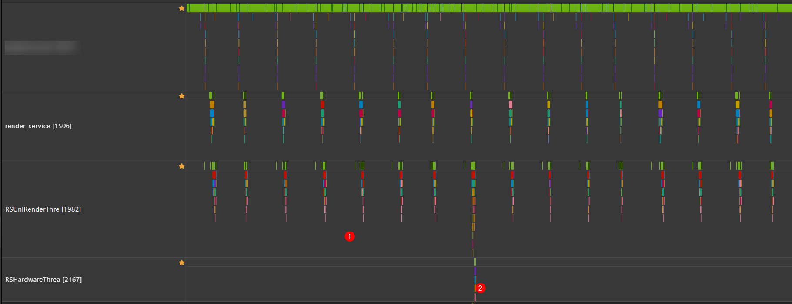
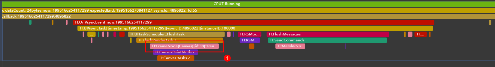
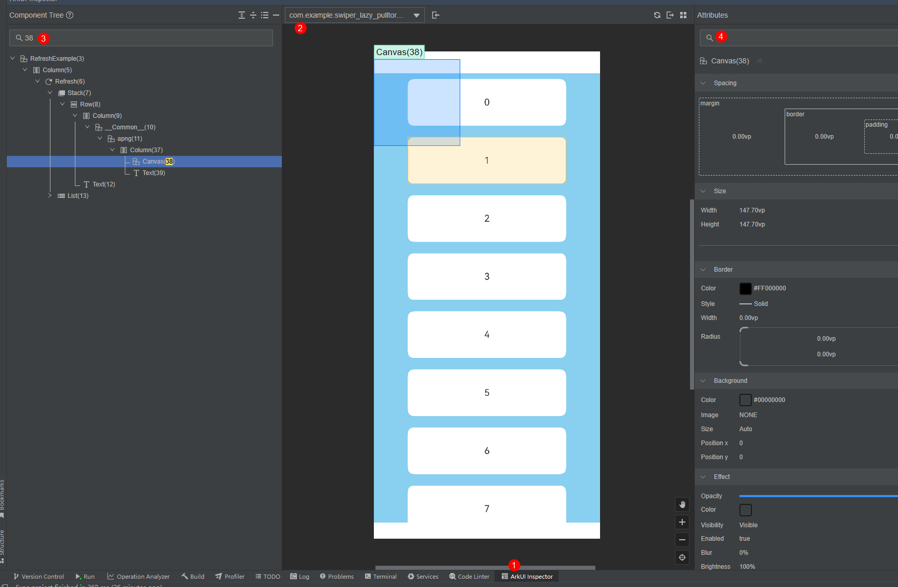

# 冗余刷新类问题解决方案

<!--Kit: Common-->
<!--Subsystem: Demo&Sample-->
<!--Owner: @mgy917-->
<!--Designer: @jiangwensai-->
<!--Tester: @Lyuxin-->
<!--Adviser: @huipeizi-->

## 概述
不可见场景主要分为两类：前一个页面组件未销毁、当前页面部分部件未在显示区域内。冗余刷新是不可见组件的动画未停止导致。

前一个页面未销毁：常出现在Router、Navigation等页面跳转，Tabs、Swiper等组件页面切换等场景。这些组件为了实现性能的高效加载和渲染在设计规格上不会主动销毁前一个页面。

当前组件未在屏幕：常出现在Scroll等类似组件页面元素超出显示屏幕，LazyForEach预加载、组件visibility属性设置Visibility.None等场景。这类场景同样是基于高性能的考虑，允许屏幕外组件预加载。

## 定位方法

### 使用Trace工具
1. 使用[DevEco Profiler工具](https://developer.huawei.com/consumer/cn/doc/best-practices/bpta-optimization-overview#section2012922312284)抓取场景Trace，如果即使在静止状态，Trace仍然每一帧都相应Vsync，则有可能出现不可见刷新问题。


2. 通过Trace中的tag信息可以进一步确定标脏的组件ID。


3. 如果有明确的组件ID则可以直接使用inspector工具确定异常组件，如果组件ID是-1则大概率是空跑问题，可通过场景二分法确定。
### 使用inspector工具

通过使用Trace分析法获取组件ID后可以通过inspector工具或者抓取组件树的方法进一步确定异常组件的位置。
### 场景二分定位法
如果组件不在组件树上，需要复现场景，抓取操作路径上的每个步骤的Trace二分查找，找到异常组件未下树的Trace重复上述两个方法。
## 解决思路

### 接入可见接口法
下方展示了使用[ImageAnimator](../reference/apis-arkui/arkui-ts/ts-basic-components-imageanimator.md)实现的动画组件，通过设置duration实现多个Pixelmap的循环播放。例如，当组件放置在Scroll容器中时，为避免组件划出屏幕导致的不可见空跑问题，可以通过监听组件移出屏幕的事件，修改动画播放状态，从而控制空跑。以下提供了几种接入可见性接口的实现方式，开发者可根据需要选择一种：

[onVisibleAreaChange](../reference/apis-arkui/arkui-ts/ts-universal-component-visible-area-change-event.md#onvisibleareachange)：可直接绑定到组件，当组件可见时每帧进行一次可见性计算，达到阈值时触发回调。
[setOnVisibleAreaApproximateChange](../reference/apis-arkui/arkui-ts/ts-uicommonevent.md#setonvisibleareaapproximatechange)是onVisibleAreaChange()的低频优化版本，可以通过参数设置可见性计算的周期。例如，可以将expectedUpdateInterval设置为500ms。
由于onVisibleAreaChange()在可见时会每帧进行一次计算检测，当组件数量较多、节点层次较深且帧率较高时，使用setOnVisibleAreaApproximateChange()可以减少计算负载，从而显著提升性能和降低功耗。

```ts
import { hilog } from '@kit.PerformanceAnalysisKit';

@Component
struct ImageAnimatorTest {
  private uid: number = -1;
  private index: number = 0;
  @State running: boolean = false;
  @State animState: AnimationStatus = AnimationStatus.Initial;

  // Method 1: use aboutToAppear to register a setOnVisibleAreaApproximateChange
  aboutToAppear(): void {
    this.uid = this.getUniqueId();
    hilog.info(0x0000, 'testTag', `getUniqueId in ImageAnimatorTest aboutAppear is ${this.uid}`);
    let node = this.getUIContext().getFrameNodeByUniqueId(this.uid);
    node?.commonEvent.setOnVisibleAreaApproximateChange(
      { ratios: [0], expectedUpdateInterval: 500 },
      (isVisible, currentRatio) => {
        hilog.info(0x0000, 'testTag',
          `Method aboutToAppear: setOnVisibleAreaApproximateChange isVisible:${isVisible}, currentRatio:${currentRatio}`);
        this.running = isVisible;
      })
  }

  build() {
    Column() {
      ImageAnimator()
        .images([
          { src: $r('app.media.background') },
          { src: $r('app.media.foreground') }
        ])
        .id(`ImageAnimator${this.index}}`)
        .width('100%')
        .height('30%')
        .duration(3000)
        .fillMode(FillMode.None)
        .iterations(-1)
        .state(this.running ? AnimationStatus.Running :
        AnimationStatus.Paused)// Method 2: Directly use onVisibleAreaChange
        .onVisibleAreaChange([0.0, 1.0], (isVisible: boolean, currentRatio: number) => {
          hilog.info(0x0000, 'testTag',
            `Method Direct: onVisibleAreaChange isVisible:${isVisible}, currentRatio:${currentRatio}`);
          if (isVisible && currentRatio >= 1.0) {
            this.running = true;
          }
          if (!isVisible && currentRatio <= 0.0) {
            this.running = false;
          }
        })// Method 3: use onAppear to register a setOnVisibleAreaApproximateChange
        .onAppear(() => {
          let node = this.getUIContext().getFrameNodeById(`ImageAnimator${this.index}`);
          node?.commonEvent.setOnVisibleAreaApproximateChange(
            { ratios: [0], expectedUpdateInterval: 500 },
            (isVisible, currentRatio) => {
              this.running = isVisible;
              hilog.info(0x0000, 'testTag',
                `Method onAppear: setOnVisibleAreaApproximateChange isVisible:${isVisible}, currentRatio:${currentRatio}`);
            }
          )
        })
    }
  }
}
```
### 组件条件卸载下树法
利用if语句下树销毁的特性，通过状态变量控制组件的下树来达到停止动画的效果。
> **说明：**
> 
> [ohos_apng](https://gitcode.com/openharmony-sig/ohos_apng)是以开源库[apng-js](https://github.com/davidmz/apng-js)为参考，基于1.1.2版本，通过重构解码算法，拆分出apng里各个帧图层的数据；使用arkts能力，将每一帧数据组合成imagebitmap，使用定时器调用每一帧数据，通过canvas渲染，从而达到帧动画效果。
>
> ohos_apng需要将开源库手动添加依赖到oh-package.json5中，详见[OpenHarmony JS和TS三方组件使用指导](../../third-party-components/ohpm-third-party-guide.md)。


```ts
import { apng, ApngController } from '@ohos/apng'; //开发者自行导入apng依赖库，详见上述说明。

@Entry
@Component
struct RefreshExample {
  @State isShow: boolean = false;
  controller: ApngController = new ApngController();

  build() {
    Column() {
      Button('change')
        .onClick(() => {
            this.isShow = !this.isShow
          }
        )
      if (this.isShow) {
        apng({
            src: $r('app.media.stack'),
            controller: this.controller
          }).margin({ top: 40 })
        }
      }
  }
}
```

### 状态变量监听法
列表组件下拉刷新时，管理刷新动画的不可见现象。使用Canvas实现的[ohos_apng组件](https://gitcode.com/openharmony-sig/ohos_apng)置于Refresh组件中，默认隐藏。监听Refresh组件的多种状态，通过onStateChange()方法监听RefreshStatus值。当Refresh组件处于收起状态（RefreshStatus为0和4）时，控制apngcontroller停止播放动画；当RefreshStatus处于拉起、回弹等状态（RefreshStatus为1、2和3）时，播放动画。其中，ImageAnimatorTest()的实现可参考[接入可见接口法](#接入可见接口法)中的示例代码。

```ts
// VisibleComponent/entry/src/main/ets/pages/Index.ets
import { apng, ApngController } from '@ohos/apng'; //开发者自行导入apng依赖库，详见上述说明。
import { hilog } from '@kit.PerformanceAnalysisKit';

@Entry
@Component
struct RefreshExample {
  @State isRefreshing: boolean = false;
  @State isRunning: boolean = false;
  @State arr: string[] = ['0', '1', '2', '3', '4', '5', '6', '7', '8', '9', '10'];
  controller: ApngController = new ApngController();

  @Builder
  customRefreshComponent() {
    Stack() {
      Row() {
        Column() {
          apng({
            src: $r('app.media.stack'),
            controller: this.controller
          })
            .margin({ top: 40 })
        }
      }
      .alignItems(VerticalAlign.Center)
    }
    .align(Alignment.Center)
    .clip(true)
    .constraintSize({ minHeight: 32 })
    .width('100%')
  }

  build() {
    Column() {
      Refresh({ refreshing: $$this.isRefreshing, builder: this.customRefreshComponent() }) {
        Scroll() {
          Column() {
            ImageAnimatorTest()
            ForEach(this.arr, (item: string) => {
              ListItem() {
                Text('' + item)
                  .height(80)
                  .fontSize(16)
                  .textAlign(TextAlign.Center)
                  .fontColor(0xF1F3F5)
              }
            }, (item: string) => item)
          }
        }
        .scrollBar(BarState.Off)
      }
      .backgroundColor(0xF1F3F5)
      .pullToRefresh(true)
      .refreshOffset(64)
      .expandSafeArea([SafeAreaType.SYSTEM], [SafeAreaEdge.TOP, SafeAreaEdge.BOTTOM])
      // Use onStateChange and apngcontroller to control play and stop
      .onStateChange((refreshStatus: RefreshStatus) => {
        if (refreshStatus >= 1 && refreshStatus < 4) {
          this.controller.play();
        } else {
          this.controller.stop();
        }
        hilog.info(0x0000, 'testTag', 'Refresh onStatueChange state is ' + refreshStatus);
      })
      .onRefreshing(() => {
        setTimeout(() => {
          this.isRefreshing = false;
        }, 2000)
        hilog.info(0x0000, 'testTag', 'onRefreshing test')
      })
    }
  }
}
```
同理对navigation可以监听onHidden、onShow等事件，对tab可以监听onChange方法停止非当前index页面的动画。

### 合理使用自定义动画
不合理的使用animator、displaysync也会导致冗余刷新问题。主要表现在三方使用Canvas自绘制动画没有在适当时机停止、使用animator开始动画未停止、注册了displaysync未在合适的时机解注册等。
另外，不合理的delay设置也会导致不可见刷新，如开发者使用animator等函数设置延迟3s的动画，同时间隔3.5s再次调用这个动画等。

## 系统组件默认策略
系统组件一般用可见法解决，通过接入onVisibleAreaChange回调在组件不可见时停止动画。当前各个组件适配如下表：

|组件名称|设计动画项|不可见不刷新|是否有启停接口|
| -------- | -------- | -------- | -------- |
|[Image](../reference/apis-arkui/arkui-ts/ts-basic-components-image.md)|Gif、动图动画|已适配|Image不开放，DrawableDescriptor开放|
|[ImageAnimator](../reference/apis-arkui/arkui-ts/ts-basic-components-imageanimator.md)|动画跳帧|未适配|有，参考官方文档|
|[Text](https://developer.huawei.com/consumer/cn/doc/AppGallery-connect-References/clouddb-text-0000001491435996)|跑马灯动画|已适配|overflow模式有启停方式|
|[Swiper](../reference/apis-arkui/arkui-ts/ts-container-swiper.md)|自动轮播动画|已适配|-|
|[LoadingProgress](../reference/apis-arkui/arkui-ts/ts-basic-components-loadingprogress.md)|播放动画|已适配|enableLoading属性可以启停动画|
|[Marquee](../reference/apis-arkui/arkui-ts//ts-basic-components-marquee.md)|跑马灯动画|已适配|用户设置轮播次数|
|[Progress](../reference/apis-arkui/arkui-ts//ts-basic-components-progress.md)|流光动画|已适配|status等属性可以控制动画启停|
|高级组件|当前无自动播放动画|-|-|

> **限制：**
> 组件通过适配onVisibleAreaChange来实现不可见动画停止，受限于当前接口规格，如下场景无法覆盖：
> - 被兄弟节点覆盖无法通知。
> - stack堆叠不通知，Z轴遮挡不通知。
> - PC多窗场景不通知。