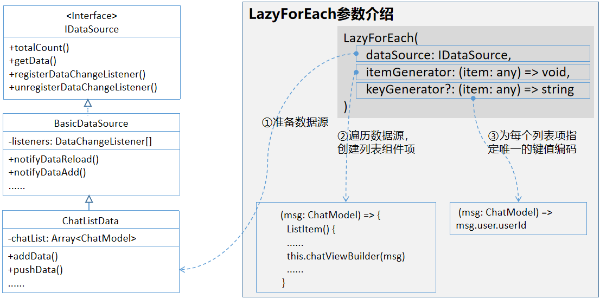
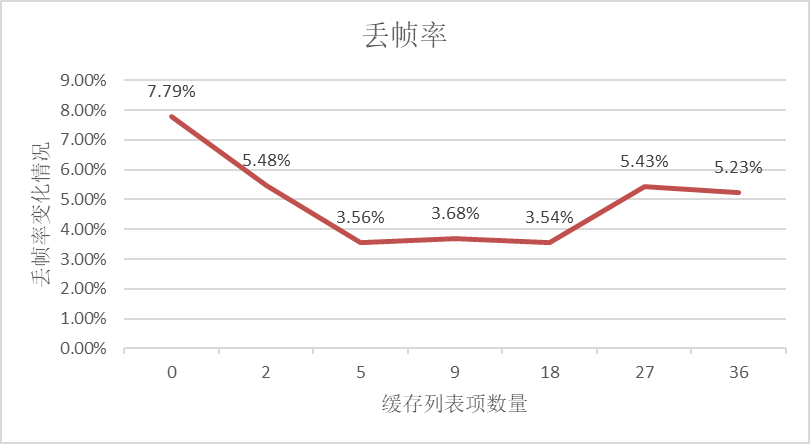
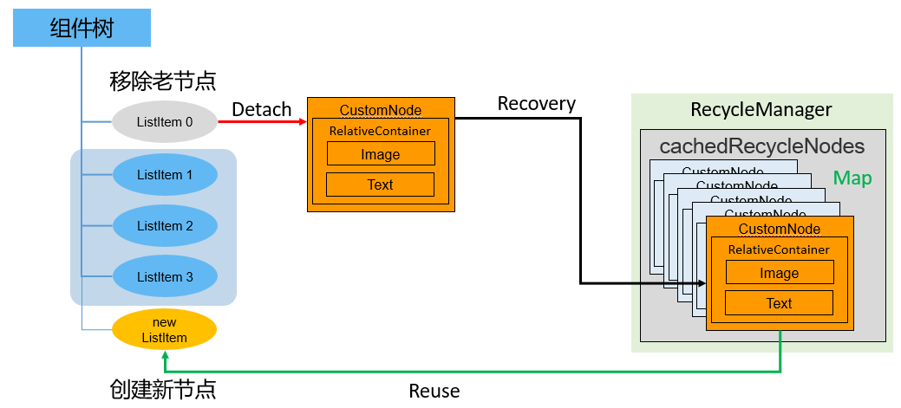
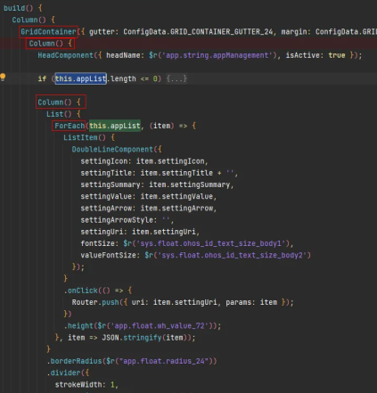
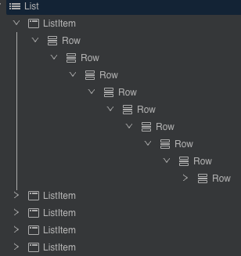
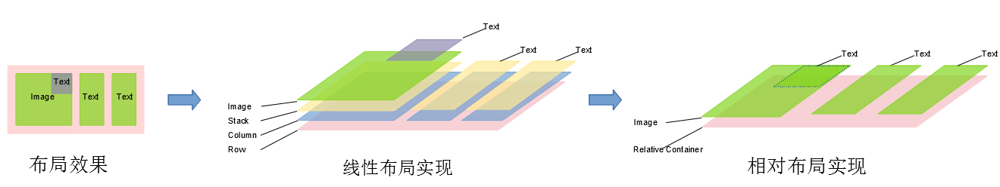

# 列表场景性能提升实践

在应用的UI开发中，使用列表是一种常规场景，因此，对列表性能进行优化是非常重要的。本文将针对应用开发列表场景的性能提升实践方法展开介绍。

## 简介

本文会介绍开发列表场景时的4种推荐优化方法，通过独立使用或组合使用这些优化方法，可以获得在启动时间、内存和系统资源方面的平衡，提升性能和用户体验。

**懒加载**：提供列表数据按需加载能力，解决一次性加载长列表数据耗时长、占用过多资源的问题，可以提升页面响应速度。

**缓存列表项**：提供屏幕可视区域外列表项长度的自定义调节能力，配合懒加载设置可缓存列表项参数，通过预加载数据提升列表滑动体验。

**组件复用**：提供可复用组件对象的缓存资源池，通过重复利用已经创建过并缓存的组件对象，降低组件短时间内频繁创建和销毁的开销，提升组件渲染效率。

**布局优化**：使用扁平化布局方案，减少视图嵌套层级和组件数，避免过度绘制，提升页面渲染效率。

## 懒加载

### 原理机制

应用框架为容器类组件的数据加载和渲染提供了2种方式：

方式1，提供ForEach实现一次性加载全量数据并循环渲染。需要说明，对于List中使用ForEach的场景，系统对ListItem里的内部组件节点进行了优化处理。ForEach虽然还是会构建所有的ListItem节点，但系统仅会构建并渲染当前屏幕可视区域内的ListItem及其内部组件节点。对于超出屏幕可视范围的ListItem，其内部组件节点则不会被构建。

```ts
ForEach(
  arr: Array, // 需要进行数据迭代的列表数组
  itemGenerator: (item: Object, index: number) => void, // 子组件生成函数
  keyGenerator?: (item: Object, index: number) => string // （可选）键值生成函数
)
```

方式2，提供LazyForEach实现延迟加载数据并按需渲染。

```ts
LazyForEach(
  dataSource: IDataSource, // 需要进行数据迭代的数据源
  itemGenerator: (item: Object, index: number) => void, // 子组件生成函数
  keyGenerator?: (item: Object, index: number) => string // (可选)键值生成函数
)
```

ForEach循环渲染的过程如下：

1. 从列表数据源一次性加载全量数据。

2. 为列表数据的每一个元素都创建对应的组件，并全部挂载在组件树上。即，ForEach遍历多少个列表元素，就创建多少个ListItem组件节点并依次挂载在List组件树根节点上。

3. 列表内容显示时，只渲染屏幕可视区内的ListItem组件。可视区外的ListItem组件滑动进入屏幕内时，因为已经完成数据加载和组件创建挂载，直接渲染即可。


ForEach循环渲染在列表数据量大、组件结构复杂的情况下，会出现性能瓶颈。因为要一次性加载所有的列表数据，创建所有组件节点并完成组件树的构建，在数据量大时会非常耗时，从而导致页面启动时间过长。另外，屏幕可视区外的组件虽然不会显示在屏幕上，但是仍然会占用内存。在系统处于高负载的情况下，更容易出现性能问题，极限情况下甚至会导致应用异常退出。   

为了规避上述可能出现的问题，应用框架进一步提供了**懒加载**方式 。

LazyForEach懒加载的原理如下：

1. LazyForEach会根据屏幕可视区能够容纳显示的组件数量按需加载数据。

2. 并根据加载的数据量创建组件，挂载在组件树上，构建出一棵短小的组件树。即，屏幕可以展示多少列表项组件，就按需创建多少个ListItem组件节点挂载在List组件树根节点上。

3. 屏幕可视区只展示部分组件。当可视区外的组件需要在屏幕内显示时，需要从头完成数据加载、组件创建、挂载组件树这一过程，直至渲染到屏幕上。


4. LazyForEach懒加载中的键值生成函数keyGenerator用于给数据源中的每一个数据项生成唯一且固定的键值。键值生成器必须针对每个数据生成唯一的值，如果键值相同，将导致键值相同的UI组件渲染出现问题。

LazyForEach实现了按需加载，针对列表数据量大、列表组件复杂的场景，减少了页面首次启动时一次性加载数据的时间消耗，减少了内存峰值。可以显著提升页面的能效比和用户体验。

### 使用场景和限制

- 如果列表数据较长，一次性加载所有的列表数据创建、渲染页面产生性能瓶颈时，开发者应该考虑使用数据LazyForEach懒加载。

- 如果列表数据较少，数据一次性全量加载不是性能瓶颈时，可以直接使用ForEach。

- 如果使用LazyForEach懒加载，建议在使用LazyForEach进行组件复用的key生成器函数里，不要使用stringify。

限制：ForEach、LazyForEach必须在List、Grid以及Swiper等容器组件内使用，用于循环渲染具有相同布局的子组件。更多懒加载的信息，请参考官方资料[LazyForEach：数据懒加载](../quick-start/arkts-rendering-control-lazyforeach.md)。

LazyForEach懒加载API提供了cachedCount属性，用于配置可缓存列表项数量。除默认加载界面可视部分外，还可以加载屏幕可视区外指定数量（cachedCount）的缓存数据，详见下面“缓存列表项”章节。

### 实现示例

在介绍List、Grid等容器组件下使用LazyForEach懒加载的示例代码之前，首先针对前面介绍的第三点使用场景，给出以下反例来进行说明，帮助开发者更好的理解和使用LazyForEach。

**反例：在使用LazyForEach进行组件复用的key生成器函数里，使用stringify**

```ts
class BasicDataSource implements IDataSource {
  private listeners: DataChangeListener[] = [];
  private originDataArray: string[] = [];

  public totalCount(): number {
    return 0;
  }

  public getData(index: number): string {
    return this.originDataArray[index];
  }

  registerDataChangeListener(listener: DataChangeListener): void {
    if (this.listeners.indexOf(listener) < 0) {
      console.info('add listener');
      this.listeners.push(listener);
    }
  }

  unregisterDataChangeListener(listener: DataChangeListener): void {
    const pos = this.listeners.indexOf(listener);
    if (pos >= 0) {
      console.info('remove listener');
      this.listeners.splice(pos, 1);
    }
  }

  notifyDataReload(): void {
    this.listeners.forEach(listener => {
      listener.onDataReloaded();
    })
  }

  notifyDataAdd(index: number): void {
    this.listeners.forEach(listener => {
      listener.onDataAdd(index);
    })
  }

  notifyDataChange(index: number): void {
    this.listeners.forEach(listener => {
      listener.onDataChange(index);
    })
  }

  notifyDataDelete(index: number): void {
    this.listeners.forEach(listener => {
      listener.onDataDelete(index);
    })
  }
}

class MyDataSource extends BasicDataSource {
  private dataArray: string[] = [];

  public totalCount(): number {
    return this.dataArray.length;
  }

  public getData(index: number): string {
    return this.dataArray[index];
  }

  public addData(index: number, data: string): void {
    this.dataArray.splice(index, 0, data);
    this.notifyDataAdd(index);
  }

  public pushData(data: string): void {
    this.dataArray.push(data);
    this.notifyDataAdd(this.dataArray.length - 1);
  }
}

// 此处为复用的自定义组件
@Reusable
@Component
struct ChildComponent {
  @State desc: string = '';
  @State sum: number = 0;
  @State avg: number = 0;

  aboutToReuse(params: Record<string, Object>): void {
    this.desc = params.desc as string;
    this.sum = params.sum as number;
    this.avg = params.avg as number;
  }

  build() {
    Column() {
      // 这里仅用于ux展示。实际业务会更复杂。
      Text(this.desc).fontSize(16).textAlign(TextAlign.Center)
    }.width('100%')
  }
}

@Entry
@Component
struct ReusableKeyGeneratorUseStringify {
  private data: MyDataSource = new MyDataSource();

  aboutToAppear(): void {
    for (let index = 0; index < 200; index++) {
      this.data.pushData(index.toString())
    }
  }

  build() {
    Column() {
      List() {
        LazyForEach(this.data, (item: string) => {
          ListItem() {
            ChildComponent({ desc: item, sum: 0, avg: 0 })
          }
          .width('100%')
          .height(100)
        }, (item: string) => JSON.stringify(item))
      }
      .height('100%')
      .width('100%')
    }
  }
}
```

在反例中，在使用LazyForEach进行组件复用的key生成器函数里使用了stringify。在实际复杂的业务场景中，懒加载的item数据较大，item数量较多，使用stringify会对整个item对象进行序列化操作最终把item转换成字符串，需要消耗大量的时间和计算资源，从而导致页面性能降低。因此，为了减少页面渲染耗时，提升页面性能，应避免在LazyForEach组件复用的key生成器函数里使用stringify。建议使用简洁的短字符串，如使用item.id，这里假设每个item都有一个唯一的id属性。


以上使用场景的反例介绍是为了帮忙开发者更好的理解和正确使用LazyForEach懒加载。下面将给出正例的基本写法，在List、Grid等容器组件下使用LazyForEach懒加载的示例代码如下：

```ts
// LazyForEach要遍历的数据源，为实现接口IDataSource的实例   
private dataList = ...
build() {
  Column() {
    List() {
      LazyForEach(this.dataList, // 数据源          
        (item: ListItemData) => { // 根据列表项数据生成对应的组件  
          ListItem() {
            this.initItem(item)
          }
        },(item: ListItemData) => item.itemId) // 生成列表项键值
      }
   }
}
```

接下来将结合示例代码，详细介绍LazyForEach懒加载的实现过程，包含下图所示的三部分内容：

1、准备数据源类

2、遍历数据源创建列表组件项

3、为列表项指定唯一的键值编码



代码实现如下。首先，在使用LazyForEach数据懒加载之前，需要实现懒加载数据源接口类IDataSource。数据源接口类提供了获取数据总量，返回指定索引位置的数据，以及注册、注销数据监听器的接口。编写一个实现数据源接口IDataSource的数据源类BasicDataSource，该类包含数据变更监听器DataChangeListener类型的实例变量listeners，用于维护注册的数据变更监听器，在数据变更时调用相应的回调函数。每一个listener实例对应一个ArkUI框架侧的LazyForEach实例，数据源数据发生变更时，listener实例会通知LazyForEach需要触发界面刷新。详细代码请参考[BasicDataSource.ets](https://gitee.com/openharmony/applications_app_samples/blob/master/code/Solutions/IM/Chat/features/chatlist/src/main/ets/viewmodel/BasicDataSource.ets)。

BasicDataSource是一个抽象类，不同的具体列表页面的数据源需要根据业务场景分别实现该抽象类。以聊天列表场景为例，数据源具体类ChatListData实现如下。其中，列表项数组变量chatList: Array用于为List子组件提供数据。ChatModel类表示聊天列表中列表项，包含联系人信息、最后一条消息内容、时间戳、未读消息数量等信息；totalCount()和getData(index: number)是实现数据源接口类IDataSource中定义的方法，用于给LazyForEach提供数据，应用框架会调用这些方法；addData()和pushData()方法为数据源类中定义的方法，可用于给数据源增加数据。需要注意的是，在这2个方法中需要调用notifyDataAdd方法，用于调用DataChangeListener中的接口来触发LazyForEach刷新。

```ts
class ChatListData extends BasicDataSource {  
    /**  
    * 聊天列表项数组  
    */  
    private chatList: Array<ChatModel> = []  
    /**  
    * 数据源的数据总量  
    */  
    public totalCount(): number {  
        return this.chatList.length  
    }  

    /**  
    * 返回指定索引位置的数据  
    */  
    public getData(index: number): ChatModel {  
        return this.chatList[index]  
    }  
    /**  
    * 指定位置添加一条聊天列表数据  
    */  
    public addData(index: number, data: ChatModel): void {  
        this.chatList.splice(index, 0, data)  
        this.notifyDataAdd(index)  
    }  
    /**  
    * 添加一条聊天列表数据  
    */  
    public pushData(data: ChatModel): void {  
        this.chatList.push(data)  
        this.notifyDataAdd(this.chatList.length - 1)  
    }  
}
```

接下来，需要创建示例数据。在自定义组件ChatListDisplayView中，创建一个ChatListData类型的局部变量chatListLazy，并在aboutToAppear()方法中创建示例数据，详细代码请参考[文件ChatListPage.ets](https://gitee.com/openharmony/applications_app_samples/blob/master/code/Solutions/IM/Chat/features/chatlist/src/main/ets/pages/ChatListPage.ets)。

```ts
@Component
export struct ChatListDisplayView {
  private chatListLazy = new ChatListData();
  // ...
  async aboutToAppear(): Promise<void> {
    // ...
    await makeDataLocal(this.chatListLazy, ChatListJsonData.CHAT_LIST_JSON_DATA[i]);
    // ...
  }
}
```

最后，在List组件容器中，使用LazyForEach接口遍历数据源this.chatListLazy循环生成ListItem列表项。其中，chatViewBuilder()方法用于布局页面列表项；代码行(msg: ChatModel) => msg.user.userId使用用户的编码作为列表项唯一的键值编码，用于区分不同的列表项。至此，使用懒加载代码实现完成，可以访问[Chat聊天示例程序](https://gitee.com/openharmony/applications_app_samples/tree/OpenHarmony-5.0.1-Release/code/Solutions/IM/Chat)获取详细代码。

```ts
build() {
  Column() {
    List() {
      // ...
      LazyForEach(this.chatListLazy, (msg: ChatModel) => {
        ListItem() {
          // ...
          this.chatViewBuilder(msg)
          // ...
        }
      }, (msg: ChatModel) => msg.user.userId)
      // ...
    }
  }
}
```

### 效果对比

在聊天示例程序中，通过模拟10000条聊天数据，来对比测试在开启、关闭懒加载时的性能。测试项包含页面启动完成时间和列表滑动时帧率。

使用ForEach一次性加载时，页面启动完成时间为3530ms；开懒加载时，页面启动完成时间为752ms。开启懒加载后，启动完成时间缩短为开启前的21.3%。

使用ForEach一次性加载时，丢帧率为26.64%；开懒加载时，丢帧率降低到2.33%。


## 缓存列表项

### 原理机制

虽然需要尽量避免一次性加载全部列表数据项，但合理的预先缓存当前屏幕上下几页的列表项内容会给用户带来更好的体验，例如通过缓存避免“滑动白块”现象。

LazyForEach懒加载可以通过设置cachedCount属性来指定缓存数量。在设置cachedCount后，除屏幕内显示的ListItem组件外，还会预先将屏幕可视区外指定数量的列表项数据缓存起来。

详细过程如下：

1. 当列表滑动，缓存列表项需要从屏幕可视区外进入可视区内时，只用创建、渲染组件即可，相比不设置cachedCount提升了显示效率。

2. 当列表不断滑动，屏幕可视区外缓存的列表项数量少于cachedCount设置数量时，会触发列表项数据加载事件，继续预加载缓存列表项。比如，如果cachedCount设置为10，滑动到第10项数据展示在屏幕上时，会请求把第11~20列表项数据加载缓存起来。

3. 当上滑下滑间隔进行时，列表数据两个方向的数据都会缓存起来。

4. 如果不显式设置cachedCount，默认缓存1条数据。


### 使用场景和限制

缓存列表适合加载列表项数据比较耗时的场景。比如，需要从网络上获取视频数据、图片并通过ListItem展示。通过预先加载并缓存，缩短渲染前的准备时间，提升列表响应速度。

使用限制为：缓存列表项仅在使用LazyForEach懒加载时有效，ForEach循环渲染会一次性加载全量数据，不需要设置缓存列表项。

### 实现示例

List/Grid容器组件的cachedCount属性用于为LazyForEach懒加载设置列表项ListItem的最少缓存数量。应用可以通过增加cachedCount参数，调整屏幕外预加载项的数量。在示例代码[文件ChatListPage.ets](https://gitee.com/openharmony/applications_app_samples/blob/master/code/Solutions/IM/Chat/features/chatlist/src/main/ets/pages/ChatListPage.ets)中，提供了一个开关用于设置是否使能该属性，如下所示。在设置cachedCount后，当列表界面滑动时，除了获取屏幕上展示的数据，还会额外获取指定数量的列表项数据缓存起来。

```ts
build() {
  Column() {
    List() {
      // ...
      LazyForEach(this.chatListData, (msg: ChatModel) => {
        ListItem() {
          ChatView({ chatItem: msg })
        }
      }, (msg: ChatModel) => msg.user.userId)
    }
    .backgroundColor(Color.White)
    .listDirection(Axis.Vertical)
    // ...
    .cachedCount(this.list_cachedCount ? Constants.CACHED_COUNT : 0) // 缓存列表数量  
  }
}
```

### 效果对比

在示例程序中，屏幕上每页展示9条数据。基于示例程序，测试了不同缓存数量对帧率的影响情况，不设置缓存数量时，丢帧率为7.79%，当逐渐增加缓存数量时，丢帧率降低。当设置当前屏幕展示数量的一半，即缓存5个列表项时，丢帧率最低。再增加缓存数量，丢帧率不再有显著的下降，增加缓存数量太多时，甚至会影响丢帧率。测试数据仅限于示例程序，不同的应用程序设置的最佳缓存数量不一致，需要针对应用程序测试得出最佳缓存数量。



应该如何根据实际场景，设置缓存数量的值呢？ 例如列表项中需要显示网络数据，而网络数据加载较慢，为了提升列表信息的浏览效率和浏览体验，可以适当的多设置一些缓存数量；如果列表中需要加载一些大图或者视频等，这些数据占用的内存较大，为了减少内存占用，需要适当减少缓存数量的设置；因此，在实际场景中，需要不断尝试验证，设置适当的缓存数量，来达到体验和内存的平衡。

## 组件复用

### 原理机制

应用框架提供了组件复用能力，可复用组件从组件树上移除时，会进入到一个回收缓存区。后续创建新组件节点时，会复用缓存区中的节点，节约组件重新创建的时间。尤其在列表等场景下，其自定义子组件具有相同的组件布局结构，列表更新时仅有状态变量等数据差异。通过组件复用可以提高列表页面的加载速度和响应速度。

组件复用机制如下：

1. 标记为@Reusable的组件从组件树上被移除时，组件和其对应的JSView对象都会被放入复用缓存中。

2. 当列表滑动新的ListItem将要被显示，List组件树上需要新建节点时，将会从复用缓存中查找可复用的组件节点。

3. 找到可复用节点并对其进行更新后添加到组件树中。从而节省了组件节点和JSView对象的创建时间。



@Reusable组件复用结合LazyForEach懒加载，可以进一步解决列表滑动场景的瓶颈问题，提供滑动场景下高性能创建组件的方式来提升滑动帧率。

### 使用场景和限制

若业务实现中存在以下场景，并成为UI线程的帧率瓶颈，推荐使用组件复用：

1. 一帧内重复创建多个已经被销毁的自定义组件。

2. 反复切换条件渲染的控制分支，且控制分支中的组件子树结构较重。

组件复用生效的条件是：

- 自定义组件被@Reusable装饰器修饰，即标志其具备组件复用的能力；

- 在一个自定义父组件下创建出来的具备组件复用能力的自定义子组件，在可复用自定义组件从组件树上移除之后，会被加入到其父自定义组件的可复用节点缓存中；

- 在一个自定义父组件下创建可复用的子组件时，若可复用子节点缓存中有对应类型的可复用子组件，会通过更新可复用子组件的方式，快速创建可复用子组件；

- ForEach循环渲染会一次性加载全量数据，因此不支持组件复用。

使用规则如下：

- @Reusable标识自定义组件具备可复用的能力，它可以被添加到任意的自定义组件上，但是开发者需要小心处理自定义组件的创建流程和更新流程以确保自定义组件在复用之后能展示出正确的行为；

- 可复用自定义组件的缓存和复用只能发生在同一父组件下，无法在不同的父组件下复用同一自定义节点的实例。e.g. A组件是可复用组件，其也是B组件的子组件，并进入了B组件的可复用节点缓存中，但是在C组件中创建A组件时，无法使用B组件缓存的A组件；

- 自定义组件的复用带来的性能提升主要体现在节省了自定义组件的JS对象的创建时间并复用了自定义组件的组件树结构，若应用开发者在自定义组件复用的前后使用渲染控制语法显著的改变了自定义组件的组件树结构，那么将无法享受到组件复用带来的性能提升；

- 组件复用仅发生在存在可复用组件从组件树上移除并再次加入到组件树的场景中，若不存在上述场景，将无法触发组件复用。e.g. 使用ForEach渲染控制语法创建可复用的自定义组件，由于ForEach渲染控制语法的全展开属性，不能触发组件复用。

使用建议如下：

建议复用自定义组件时避免一切可能改变自定义组件的组件树结构和可能使可复用组件中产生重新布局的操作以将组件复用的性能提升到最高；

- 建议列表滑动场景下组件复用能力和LazyForEach渲染控制语法搭配使用以达到性能最优效果；

- 开发者需要区分好自定义组件的创建和更新过程中的行为，并注意到自定义组件的复用本质上是一种特殊的组件更新行为，组件创建过程中的流程与生命周期将不会在组件复用中发生，自定义组件的构造参数将通过aboutToReuse生命周期回调传递给自定义组件。e.g. aboutToAppear生命周期和自定义组件的初始化传参将不会在组件复用中发生；

- 避免在aboutToReuse生命周期回调中产生耗时操作，最佳实践是仅在aboutToReuse中做自定义组件更新所需的状态变量值的更新。

### 实现示例

在开发应用时，自定义组件被@Reusable装饰器修饰，表示该自定义组件可以复用。在自定义父组件下创建的可复用组件从组件树上移除后，会被加入父组件的可复用节点缓存里。在父组件再次创建可复用组件时，会通过更新可复用组件的方式，从缓存快速创建可复用组件。使用装饰器@Reusable标记一个组件属于可复用组件后，还需要实现自定义组件的生命周期回调函数aboutToReuse()，其参数为可复用组件的状态变量。调用可复用自定义组件时，父组件会给子组件传递构造数据。

示例代码如下所示：

```ts
/**
  * 可复用且优化布局的聊天页面组件
  */
@Reusable
@Component
struct ReusableOptLayoutChatView {
  @State chatItem: ChatModel = new ChatModel(new ChatContact('', ''), '', '', 0);

  aboutToReuse(params: Record<string, Object>): void {
    this.chatItem = params.chatItem as ChatModel;
    Logger.info(TAG, 'aboutToReuse=' + this.chatItem.toString());
  }

  build() {
    OptLayoutChatView({ chatItem: this.chatItem });
  }
}
```

### 效果对比

在示例程序中，对列表项中的组件进行复用。经测试发现，因本示例复用组件的布局较简单，组件复用对本测试场景没有明显的性能提升效果。在实际场景中，应该如何用好组件复用这个特性呢？在列表项的布局复杂度更高时，组件复用的效果更好。因为更高复杂度的组件布局，初始化时需要消耗更多的系统资源，因此在使用较高复杂的列表布局时，建议使用组件复用这个特性。

## 布局优化

### **常用布局类型**

当前ArkUI应用框架提供了以下两类常用的布局方式：

**线性布局**： 例如Stack、Column、Row和Flex等，会把布局中的组件按照线性方向进行排布，如横向、纵向、Z轴方向等；这种布局使用简单方便、易于理解，但是在复杂的场景下往往会使用更多的组件数和较深的嵌套层次，维护困难，同时也增加了系统的开销；

**高级布局**： 往往可以使用更少的节点数和布局层级，实现更加复杂的布局效果，具有扁平化的特性；包括List、Grid、RelativeContainer等，在列表、宫格和混排布局等场景提供了扁平化的布局方式，例如RelativeContainer可以根据锚点来进行低嵌套层级复杂布局，而List和Grid又支持懒加载等提升性能的方法，同时降低了维护成本；因此，高级布局是更加推荐的布局方法。

### **使用场景和问题**

在开发页面时，我们往往会习惯使用线性布局来实现页面构造，这种布局方法可能会导致组件树和嵌套层数过多的问题，在创建和布局阶段产生较大的性能开销，如下列示例场景：

|  |  |
| -------------------------------- | ------------------------------------- |

布局中存在冗余布局，如build()函数下第一层的Column布局；例如GridContainer下的嵌套结构，使用了多个线性布局Column嵌套，层级较深。 还有下面的场景示例中也存在频繁使用线性布局导致嵌套过深的情况：

|  |  |
| ---------------------------------- | --------------------------------------- |

构建了10、20、30、40、50层的嵌套组件作为列表项，在列表中插入100条该嵌套组件，测试这些嵌套组件在滑动场景下对内存的影响，数据如下所示：


嵌套组件的示意结构如下所示：



从内存数据可以得知，嵌套层级越深，会有更大的系统内存开销。因此在开发过程中，要尽可能减少布局嵌套，使布局更加扁平化。那么应该如何进行布局优化呢？

### **布局优化思路**

对于这些常见问题，将通过优化一个聊天列表项的页面布局，来展示布局优化的方法和思路。使用DevEco Studio集成的ArkUI Inspector等工具可以查看视图布局，场景预览图和优化前的布局结构如下所示：

| **场景预览**                           | **优化前的列表项布局结构**                              |
| ---------------------------------- | -------------------------------------------- |
|  |  |

从场景预览图中可以知道，列表项中包含了图片、消息数、昵称、聊天信息、时间这5个部分的内容；使用线性布局的写法方式，就是一个横向布局Row，嵌套了3个纵向布局Column，由于红色消息字体需要和图片进行重叠，还使用了Stack布局进行堆叠，最终的布局方式就如上图所示，共使用组件10个，嵌套4层，源码如下所示：

```ts
build() {
  Row() {
    Column() {
      Stack({ alignContent: Alignment.TopEnd }) {
        Image(this.chatItem.user.userImage) // 用户头像  
        // ...
        if (this.chatItem.unreadMsgCount > 0) { // 红点消息大于0条时渲染红点  
          Text(`${this.chatItem.unreadMsgCount}`) // 消息数  
        // ...
        }
      }
    }
    .layoutWeight(1)
    .padding({ right: 12 })

    Column() {
      Text(this.chatItem.user.userName) // 昵称  
        .fontColor(Color.Black)
        .fontSize(16)
        .margin({ bottom: 3 })
      Text(this.chatItem.lastMsg) // 聊天消息  
        .fontColor("#999999")
        .maxLines(1)
        .fontSize(14)
        .margin({ top: 5 })
    }
    .alignItems(HorizontalAlign.Start)
    .layoutWeight(3)

    Column() {
      Text(this.chatItem.lastTime) // 时间  
        .width(50)
        .fontColor("#999999")
        .textAlign(TextAlign.End)
        .maxLines(1)
        .fontSize(12)
        .margin({ right: 6, bottom: 27 })
    }
    .padding({ left: 15 })
    .alignItems(HorizontalAlign.End)
    .layoutWeight(1)
  }

  // ...
}
```

其实这4个部分是有明确的相对关系的，如图片和消息数位于列表最左侧，时间位于列表最右侧，而昵称和聊天信息是在图片的右侧，并且上下分布，因此，就可以使用RelativeContainer布局来进行优化，优化后可以把组件数减少到5个，嵌套2层，大大减少了系统开销，源码如下所示：

```ts
build() {
  RelativeContainer() { // 相对布局  
    Image(this.chatItem.user.userImage) // 用户头像  
    // ...
    .alignRules({
      top: { anchor: '__container__', align: VerticalAlign.Top },
      left: { anchor: '__container__', align: HorizontalAlign.Start }
    })
      .syncLoad(this.img_syncLoad ? true : false)
      .id("figure")

    if (this.chatItem.unreadMsgCount > 0) { // 红点消息大于0条时渲染红点  
      Text(`${this.chatItem.unreadMsgCount}`) // 消息数  
      // ...
      .alignRules({
        top: { anchor: '__container__', align: VerticalAlign.Top },
        left: { anchor: '__container__', align: HorizontalAlign.Start }
      })
        .opacity(this.chatItem.unreadMsgCount > 0 ? 1 : 0)
        .id("badge")
    }

    Text(this.chatItem.user.userName) // 昵称  
    // ...
    .alignRules({
      top: { anchor: '__container__', align: VerticalAlign.Top },
      left: { anchor: '__container__', align: HorizontalAlign.Start }
    })
      .id("user")

    Text(this.chatItem.lastTime) // 时间  
    // ...
    .alignRules({
      top: { anchor: '__container__', align: VerticalAlign.Top },
      right: { anchor: '__container__', align: HorizontalAlign.End }
    })
      .id("time")
    Text(this.chatItem.lastMsg) // 聊天信息  
    // ...
    .alignRules({
      top: { anchor: '__container__', align: VerticalAlign.Top },
      left: { anchor: '__container__', align: HorizontalAlign.Start }
    })
      .id("msg")
  }
  // ...
}
```


| **优化情况**    | **组件总数** | **视图嵌套层数** |
| ----------- | -------- | ---------- |
| 优化前，使用线性布局  | 10       | 4          |
| 优化后，使用扁平化布局 | 5        | 2          |

从上述案例中可以看到，选用正确的布局组件，不但去除了中间嵌套的组件层级，减少了组件数量，使代码更易于维护，也避免系统绘制更多的布局组件，达到优化性能、减少内存占用的目的，这就是扁平化布局改造的思路。



系统还提供了更多的扁平化布局方案，例如绝对定位、自定义布局、Grid、GridRow等，适用更多不同的场景，具体的使用方法可以参考[官方文档](../ui/Readme-CN.md)。

## 总结

本文基于[Sample聊天示例应用](https://gitee.com/openharmony/applications_app_samples/tree/OpenHarmony-5.0.1-Release/code/Solutions/IM/Chat)中的聊天列表场景，分析了列表滑动性能的优化方法，包含懒加载、缓存列表项、组件复用、页面布局优化。对每个优化方法详细介绍了原理、使用场景，并基于示例程序给出了优化效果和对比数据。在开发类似列表场景时，可以借鉴这些优化方法。

## 相关实例

可参考以下实例：

- [Sample聊天实例应用（ArkTS）（API12）](https://gitee.com/openharmony/applications_app_samples/tree/OpenHarmony-5.0.1-Release/code/Solutions/IM/Chat)
