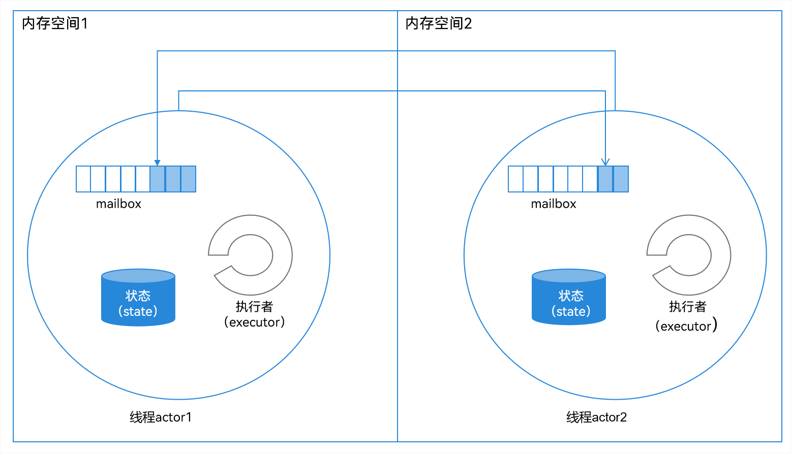
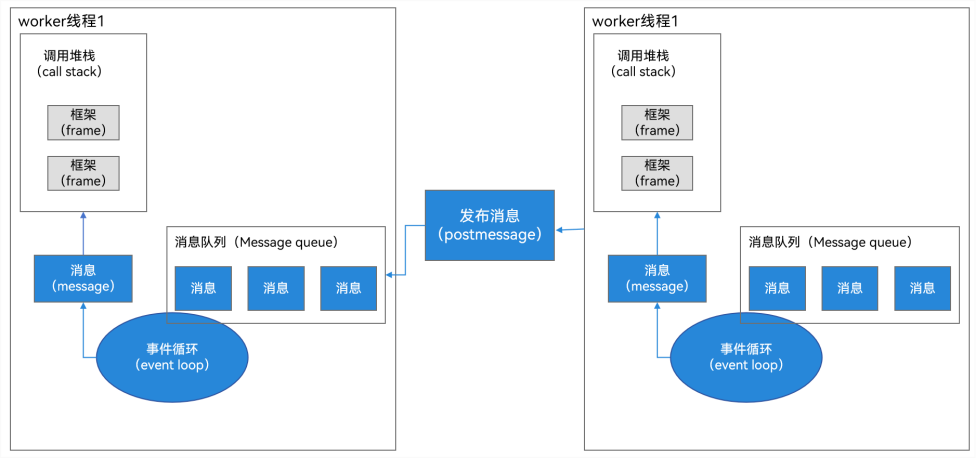
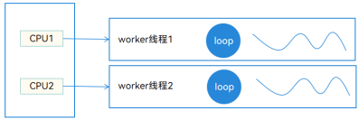
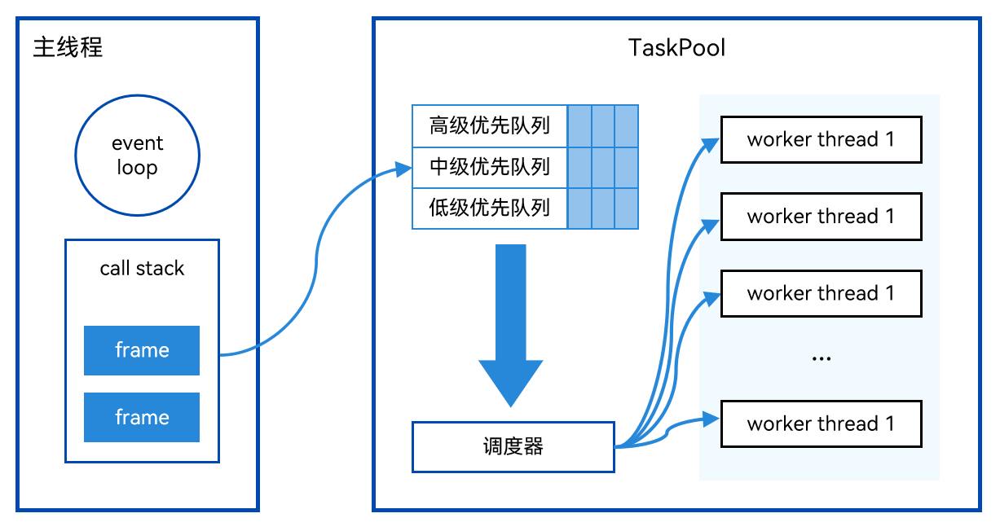
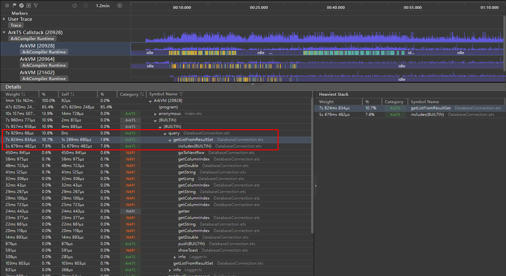
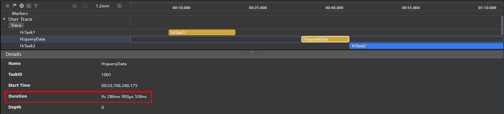
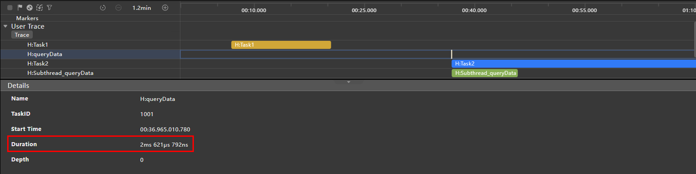
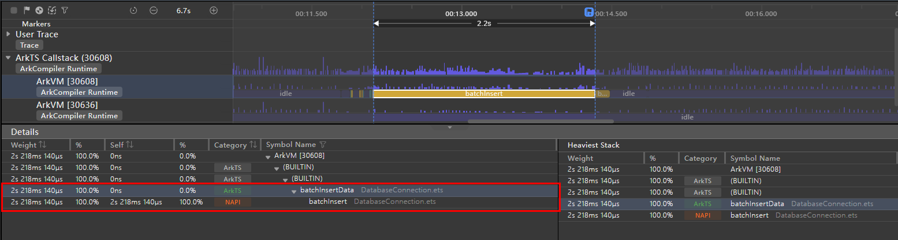

# 多线程能力场景化示例实践

## 简介

应用中的每个[进程](../application-models/process-model-stage.md)都会有一个主线程，主线程主要承担执行UI绘制操作、管理ArkTS引擎实例的创建和销毁、分发和处理事件、管理Ability生命周期等职责，具体可参见[线程模型概述](../application-models/thread-model-stage.md)。因此，开发应用时应当尽量避免将耗时的操作放在主线程中执行。ArkTS提供了**Worker**和**TaskPool**两种多线程并发能力，多线程并发允许在同一时间段内同时执行多段代码，这两个并发的基本能力可参见[TaskPool和Worker的对比](../arkts-utils/taskpool-vs-worker.md)。

在介绍**Worker**和**TaskPool**的详细使用方法前，我们先简单介绍并发模型的相关概念，以便于大家的理解。

## 并发模型概述

并发的意思是多个任务同时执行。并发模型分为两大类：基于内存共享的并发模型和基于消息传递的并发模型。

在基于内存共享的并发模型中，并发线程通过读写内存中的共享对象来进行交互。基于共享内存的并发编程需要满足三条性质：

- 原子性：指一个操作是不可中断的，要么全部执行成功要么全部执行失败。

- 有序性：指程序执行的顺序必须符合预期，不能出现乱序的情况。

- 可见性：指当一个线程修改了共享变量后，其他线程能够立即得知这个修改。

现代程序语言一般通过锁、内存屏障、原子指令来满足这三条性质。基于内存共享的并发模型与底层硬件接近，在能正确撰写并发代码的情况下，可以最大发挥底层硬件性能，实现性能优秀的多线程程序。但是这种并发模型难以掌握，即使资深的程序员也非常容易犯错。典型的基于内存共享并发模型的程序语言有C++ 、Swift和Java等。

在基于消息传递的并发模型中，并发线程的内存相互隔离，需要通过通信通道相互发送消息来进行交互。典型的基于消息传递的并发模型一般有两种：CSP和Actor。

CSP（Communicating Sequential Processes，通信顺序进程）中的计算单元并不能直接互相发送信息。需要通过通道（Channel）作为媒介进行消息传递：发送方需要将消息发送到Channel，而接收方需要从Channel读取消息。与CSP不同，在Actor模型中，每个Actor可以看做一个独立的计算单元，并且相互之间内存隔离，每个Actor中存在信箱（Mail Box），Actor之间可以直接进行消息传递，如下图所示：  

**图1**  Actor消息传递示意图  



CSP与Actor之间的主要区别：

- Actor需要明确指定消息接收方，而CSP中处理单元不用关心这些，只需要把消息发送给Channel，而接收方只需要从Channel读取消息。

- 由于在默认情况下Channel是没有缓存的，因此对Channel的发送（Send）动作是同步阻塞的，直到另外一个持有该Channel引用的执行块取出消息，而Actor模型中信箱本质是队列，因此消息的发送和接收可以是异步的。

典型的基于消息传递的并发模型的程序语言有：Dart、JS和ArkTS。当前系统中Worker和TaskPool都是基于Actor并发模型实现的并发能力。

## Worker

### 基本概念和运作原理

当前系统中的Worker是一个独立的线程，基本概念可参见[TaskPool和Worker的对比](../arkts-utils/taskpool-vs-worker.md)。Worker拥有独立的运行环境，每个Worker线程和主线程一样拥有自己的内存空间、消息队列（MessageQueue）、事件轮询机制（EventLoop）、调用栈（CallStack）等。线程之间通过消息（Massage）进行交互，如下图所示：  

**图2**  线程交互示意图



在多核的情况下（下图中的CPU 1和CPU 2同时工作），多个Worker线程（下图中的worker thread1和worker thread2）可以同时执行，因此Worker线程做到了真正的并发，如下图所示：  

**图3**  Worker线程并发示意图  



### 使用场景和开发示例

对于Worker，有以下适用场景：

- 运行时间超过3分钟的任务，需要使用Worker。

- 有关联的一系列同步任务，例如数据库增、删、改、查等，要保证同一个句柄，需要使用Worker。

以视频解压的场景为例，点击右上角下载按钮，该示例会执行网络下载并监听，下载完成后自动执行解压操作。当视频过大时，可能会出现解压时长超过3分钟耗时的情况，因此我们选用该场景来说明如何使用Worker。

场景预览图如下所示：  

**图4**  场景预览图


使用步骤如下：

1. 宿主线程创建一个Worker线程。通过`new worker.ThreadWorker()`创建Worker实例，示例代码如下：
   
   ```typescript
   // 引入worker模块
   import worker, { MessageEvents } from '@ohos.worker';
   import type common from '@ohos.app.ability.common';
   
   let workerInstance: worker.ThreadWorker = new worker.ThreadWorker('entry/ets/pages/workers/worker.ts', { 
     name: 'FriendsMoments Worker'
   });
   ```

2. 宿主线程给Worker线程发送任务消息。宿主线程通过postMessage方法来发送消息给Worker线程，启动下载解压任务，示例代码如下：   
   
   ```typescript
   // 请求网络数据
   let context: common.UIAbilityContext = getContext(this) as common.UIAbilityContext;
   // 参数中mediaData和isImageData是根据开发者自己的业务需求添加的，其中mediaData为数据路径、isImageData为判断图片或视频的标识
   workerInstance.postMessage({ context, mediaData: this.mediaData, isImageData: this.isImageData });
   ```

3. Worker线程监听宿主线程发送的消息。Worker线程在onmessage中接收到宿主线程的postMessage请求，执行下载解压任务，示例代码如下：
   
   ```typescript
   // 引入worker模块
   import worker, { MessageEvents } from '@ohos.worker';
   
   let workerPort = worker.workerPort;
   // 接收宿主线程的postMessage请求
   workerPort.onmessage = (e: MessageEvents): void => {
     // 下载视频文件
     let context: common.UIAbilityContext = e.data.context;
     let filesDir: string = context.filesDir;
     let time: number = new Date().getTime();
     let inFilePath: string = `${filesDir}/${time.toString()}.zip`;
     let mediaDataUrl: string = e.data.mediaData;
     let urlPart: string = mediaDataUrl.split('.')[1];
     let length: number = urlPart.split('/').length;
     let fileName: string = urlPart.split('/')[length-1];
     let options: zlib.Options = {
       level: zlib.CompressLevel.COMPRESS_LEVEL_DEFAULT_COMPRESSION
     };
     request.downloadFile(context, {
       url: mediaDataUrl,
       filePath: inFilePath
     }).then((downloadTask) => {
       downloadTask.on('progress', (receivedSize: number, totalSize: number) => {
         Logger.info(`receivedSize:${receivedSize},totalSize:${totalSize}`);
       });
       downloadTask.on('complete', () => {
         // 下载完成之后执行解压操作
         zlib.decompressFile(inFilePath, filesDir, options, (errData: BusinessError) => {
           if (errData !== null) {
             ...
             // 异常处理
           }
           let videoPath: string = `${filesDir}/${fileName}/${fileName}.mp4`;
           workerPort.postMessage({ 'isComplete': true, 'filePath': videoPath });
         })
       });
       downloadTask.on('fail', () => {
         ...
         // 异常处理
       });
     }).catch((err) => {
       ...
       // 异常处理
     });
   };
   ```

4. 宿主线程监听Worker线程发送的信息。宿主线程通过onmessage接收到Worker线程发送的消息，并执行下载的结果通知。

5. 释放Worker资源。在业务完成或者页面销毁时，调用workerPort.close()接口主动释放Worker资源，示例代码如下所示：
   
   ```typescript
   workerInstance.onmessage = (e: MessageEvents): void => {
     if (e.data) {
       this.downComplete = e.data['isComplete'];
       this.filePath = e.data['filePath'];
       workerInstance.terminate();
       setTimeout(() => {
         this.downloadStatus = false;
       }, LOADING_DURATION_OPEN);
     }
   };
   ```

## TaskPool

### 基本概念和运作原理

相比使用Worker实现多线程并发，TaskPool更加易于使用，创建开销也少于Worker，并且Worker线程有个数限制，需要开发者自己掌握，TaskPool的基本概念可参见[TaskPool和Worker的对比](../arkts-utils/taskpool-vs-worker.md)。TaskPool作用是为应用程序提供一个多线程的运行环境。TaskPool在Worker之上实现了调度器和Worker线程池，TaskPool根据任务的优先级，将其放入不同的优先级队列，调度器会依据自己实现的调度算法（优先级，防饥饿），从优先级队列中取出任务，放入TaskPool中的Worker线程池，执行相关任务，流程图如下所示：

**图5**  TaskPool流程示意图



TaskPool有如下的特点：

- 轻量化的并行机制。

- 降低整体资源的消耗。

- 提高系统的整体性能。

- 无需关心线程实例的生命周期。

- 可以使用TaskPool API创建后台任务（Task），并对所创建的任务进行如任务执行、任务取消的操作。

- 根据任务负载动态调节TaskPool工作线程的数量，以使任务按照预期时间完成任务。

- 可以设置任务的优先级。

- 可以设置任务组（TaskGroup）将任务关联起来。

### 使用场景和开发示例

TaskPool的适用场景主要分为如下三类：

- 需要设置优先级的任务。

- 需要频繁取消的任务。

- 大量或者调度点较分散的任务。

因为朋友圈场景存在不同好友同时上传视频图片，在频繁滑动时将多次触发下载任务，所以下面将以使用朋友圈加载网络数据并且进行解析和数据处理的场景为例，来演示如何使用TaskPool进行大量或调度点较分散的任务开发和处理。场景的预览图如下所示：  

**图6**  朋友圈场景预览图  


使用步骤如下：

1. 首先import引入TaskPool模块，TaskPool的API介绍可参见[@ohos.taskpool（启动TaskPool）](../reference/apis-arkts/js-apis-taskpool.md)。
   
   ```typescript
   import taskpool from '@ohos.taskpool';
   ```

2. new一个task对象，其中传入被调用的方法和参数。
   
   ```typescript
   ... 
   // 创建task任务项，参数1.任务执行需要传入函数 参数2.任务执行传入函数的参数 （本示例中此参数为被调用的网络地址字符串）
   let task: taskpool.Task = new taskpool.Task(getWebData, jsonUrl);
   ...
   
   // 获取网络数据
   @Concurrent
   async function getWebData(url: string): Promise<Array<FriendMoment>> {
     try {
       let webData: http.HttpResponse = await http.createHttp().request(
         url,
         { header: {
             'Content-Type': 'application/json'
         },
           connectTimeout: 60000, readTimeout: 60000
         })
       if (typeof (webData.result) === 'string') {
         // 解析json字符串
         let jsonObj: Array<FriendMoment> = await JSON.parse(webData.result).FriendMoment;
         let friendMomentBuckets: Array<FriendMoment> = new Array<FriendMoment>();
         // 下方源码省略，主要为数据解析和耗时操作处理
         ...
         return friendMomentBuckets;
       } else {
         // 异常处理
         ...
       }
     } catch (err) {
       // 异常处理
       ...
     }
   }
   ```

3. 之后使用taskpool.execute执行TaskPool任务，将待执行的函数放入TaskPool内部任务队列等待执行。execute需要两个参数：创建的任务对象、等待执行的任务组的优先级，默认值是Priority.MEDIUM。在TaskPool中执行完数据下载、解析和处理后，再返回给主线程中。
   
   ```typescript
   let friendMomentArray: Array<FriendMoment> = await taskpool.execute(task, taskpool.Priority.MEDIUM) as Array<FriendMoment>;
   ```

4. 将新获取的momentData通过AppStorage.setOrCreate传入页面组件中。
   
   ```typescript
   // 获取页面组件中的momentData对象，其中是组件所需的username、image、video等数据
   let momentData = AppStorage.get<FriendMomentsData>('momentData');
   // 循环遍历对象并依次传入momentData
   for (let i = 0; i < friendMomentArray.length; i++) {
     momentData.pushData(friendMomentArray[i]);
   }
   // 将更新的momentData返回给页面组件
   AppStorage.setOrCreate('momentData', momentData);
   ```

## 其他场景示例和方案思考

在日常开发过程中，我们还会碰到一些其他并发场景问题，下面我们介绍了常用并发场景的示例方案推荐。

### Worker线程调用主线程类型的方法

我们在主线程中创建了一个对象，假如类型为MyMath，我们需要把这个对象传递到Worker线程中，然后在Worker线程中执行该类型中的一些耗时操作方法，比如Math中的compute方法，类结构示例代码如下：

```typescript
class MyMath {
  a: number = 0;
  b: number = 1;

  constructor(a: number, b: number) {
    this.a = a;
    this.b = b;
  }

  compute(): number {
    return this.a + this.b;
  }
}
```

主线程代码：

```typescript
private math: MyMath = new MyMath(2, 3); // 初始化a和b的值为2和3
private workerInstance: worker.ThreadWorker;

this.workerInstance = new worker.ThreadWorker("entry/ets/worker/MyWorker.ts");
this.workerInstance.postMessage(this.math); // 发送到Worker线程中，期望执行MyMath中的compute方法，预期值是2+3=5
```

MyMath对象在进行线程传递后，会丢失类中的方法属性，导致我们只是在Worker线程中可以获取到MyMath的数据，但是无法在子系统中直接调用MyMath的compute方法，示意代码如下：

```typescript
const workerPort = worker.workerPort;
workerPort.onmessage = (e: MessageEvents): void => {
  let a = e.data.a;
  let b = e.data.b;
}
```

这种情况下我们可以怎么去实现在Worker线程中调用主线程中类的方法呢？

首先，我们尝试使用强制转换的方式把Worker线程接收到数据强制转换成MyMath类型，示例代码如下：

```typescript
const workerPort = worker.workerPort;
workerPort.onmessage = (e: MessageEvents): void => {
  let math = e.data as MyMath; // 方法一：强制转换
  console.log('math compute:' + math.compute()); // 执行失败，不会打印此日志
}
```

强制转换后执行方法失败，不会打印此日志。因为序列化传输普通对象时，仅支持传递属性，不支持传递其原型及方法。接下来我们尝试第二种方法，根据数据重新初始化一个MyMath对象，然后执行compute方法，示例代码如下：

```typescript
const workerPort = worker.workerPort;
workerPort.onmessage = (e: MessageEvents): void => {
  // 重新构造原类型的对象
  let math = new MyMath(0, 0);
  math.a = e.data.a;
  math.b = e.data.b;
  console.log('math compute:' + math.compute()); // 成功打印出结果：5
}
```

第二种方法成功在Worker线程中调用了MyMath的compute方法。但是这种方式还有弊端，比如每次使用到这个类进行传递，我们就得重新进行构造初始化，而且构造的代码会分散到工程的各处，很难进行维护，于是我们有了第三种改进方案。

第三种方法，我们需要构造一个接口类，包含了我们需要线程间调用的基础方法，这个接口类主要是管理和约束MyMath类的功能规格，保证MyMath类和它的代理类MyMathProxy类在主线程和子线程的功能一致性，示例代码如下：

```typescript
interface MyMathInterface {
  compute():number;
}
```

然后，我们把MyMath类继承这个方法，并且额外构造一个代理类，继承MyMath类，示例代码如下：

```typescript
class MyMath implements MyMathInterface {
  a: number = 0;
  b: number = 1;

  constructor(a: number, b: number) {
    console.log('MyMath constructor a:' + a + ' b:' + b)
    this.a = a;
    this.b = b;
  }

  compute(): number {
    return this.a + this.b;
  }
}

class MyMathProxy implements MyMathInterface {
  private myMath: MyMath;
  constructor(math: MyMath) {
    this.myMath = new MyMath(math.a, math.b);
  }  
  // 代理MyMath类的compute方法
  compute(): number {
    return this.myMath.compute();
  }
}
```

我们在主线程构造并且传递MyMath对象后，在Worker线程中转换成MyMathProxy，即可调用到MyMath的compute方法了，并且无需在多处进行初始化构造，只要把构造逻辑放到MyMathProxy或者MyMath的构造函数中，Worker线程中的示例代码如下：

```typescript
const workerPort = worker.workerPort;
workerPort.onmessage = (e: MessageEvents): void => {
  // 方法三：使用代理类构造对象
  let proxy = new MyMathProxy(e.data)
  console.log('math compute:' + proxy.compute()); // 成功打印出结果：5
}
```

大家可以根据实际场景选择第二种或者第三种方案。

### 在TaskPool线程操作关系型数据库

#### 场景问题

使用移动设备时，核心应用界面（如信息流、历史记录、项目列表）滑动操作频繁出现滞后与卡顿，影响功能访问与操作效率，降低用户体验。滑动性能下降源于潜在的后台耗时任务、资源管理问题等，导致界面帧率下降与反馈失真。需要对系统或应用进行排查优化。

#### 原因分析

在应用程序运行过程中，由于主线程执行数据库查询操作耗时过长，且进行多次此类查询，导致主线程负担加重，无法及时完成界面渲染任务。由此引发的后果是，界面的更新与展示严重受阻，出现明显的卡顿现象，严重影响了用户交互体验与应用程序的整体性能表现。

如下图所示，在对3000条数据进行查询的过程中，整个任务总耗时接近8秒。其中，“getListFromResultSet”函数负责查询结果数据格式化，其执行时间超过1秒；而用于检测数据库元素是否存在重复的“includes”方法，其运行时间超过5秒，这两项操作的显著耗时，成为导致滑动操作卡顿的关键因素。



#### 解决方案

为解决主线程因执行全量联系人查询操作而导致的界面滑动卡顿和渲染阻塞问题，采取以下优化措施：

- 将全量联系人的查询任务移交给TaskPool子线程处理，使其与主线程解耦，确保查询过程不影响主线程的界面更新工作；

- 减少因过度监听事件而引发的不必要的重复数据库查询，从而降低系统资源消耗，提升数据查询效率。

这两项举措旨在协同改善应用程序性能，确保界面的流畅渲染，提升用户使用体验。

#### 代码实现

**1.TaskPool线程池实现**

- TaskPool子线程执行数据库新增操作
  
  函数`taskPoolExecuteInsert` 是异步函数，用于使用线程池 (`taskPool`) 执行联系人数据库的数据新增操作。函数接收 `common.Context` 类型的 `context` 和 `Contact` 类型的 `contact` 参数。函数内部创建一个 `taskPool.Task` 实例，封装插入操作（`insert` 函数）、上下文信息（`context`）和待插入的联系人数据（`contact`）。随后，函数使用 `await` 关键字调用 `taskPool.execute(task)` 异步执行插入任务。如果执行过程中出现异常，函数通过 `catch` 语句捕获异常并使用 `Logger.error` 记录日志。
  
  ```ts
  
  import taskPool from '@ohos.taskpool';
  import common from '@ohos.app.ability.common';
  import { Contact } from '../constant/Contact';
  
  /**
   * 使用TaskPool执行联系人数据库相关的数据新增操作
   */
  export async function taskPoolExecuteInsert(context: common.Context, contact: Contact): Promise<void> {
    try {
      let task: taskPool.Task = new taskPool.Task(insert, context, contact); // insert函数调用 需使用装饰器@Concurrent
      await taskPool.execute(task);
    } catch (err) {
      Logger.error(TAG, 'insert error:' + JSON.stringify(err));
    }
  }
  ```

- TaskPool子线程执行数据库批量新增操作
  
  函数`taskPoolExecuteBatchInsert`为异步操作，利用`taskPool`执行批量添加联系人至数据库的任务。它接受`common.Context`类型的`context`参数和`Array<Contact>`类型的`array`参数。内部，通过创建`taskPool.Task`实例包括`batchInsert`执行函数、`context`及待插入的联系人数据`array`，并利用`await taskPool.execute(task)`异步执行此任务。如果执行过程中出现异常，则在`catch`块中捕获并使用`Logger.error`记录日志。
  
  ```ts
  
  import taskPool from '@ohos.taskpool';
  import common from '@ohos.app.ability.common';
  import { Contact } from '../constant/Contact';
  
  /**
   * 使用TaskPool执行联系人数据库相关的数据批量新增操作
   */
  export async function taskPoolExecuteBatchInsert(context: common.Context, array: Array<Contact>): Promise<void> {
    try {
      let task: taskPool.Task = new taskPool.Task(batchInsert, context, array); // batchInsert函数调用 需使用装饰器@Concurrent
      await taskPool.execute(task);
    } catch (err) {
      Logger.error(TAG, 'batch insert error:' + JSON.stringify(err));
    }
  }
  ```

- TaskPool子线程执行数据库查询操作
  
  异步函数`taskPoolExecuteQuery`接收`common.Context`参数`context`，利用线程池 (`taskPool`)执行联系人数据库的查询操作。其过程包括：创建`taskPool.Task`实例（封装查询操作与传递上下文参数`context`），通过`taskPool.execute`执行该任务，将结果断言为`Array<Contact>`并返回。若执行时出现异常，记录错误日志并返回空的`Contact`数组。
  
  ```ts
  
  import taskPool from '@ohos.taskpool';
  import common from '@ohos.app.ability.common';
  import { Contact } from '../constant/Contact';
  
  /**
   * 使用TaskPool执行联系人数据库相关的查询操作
   */
  export async function taskPoolExecuteQuery(context: common.Context): Promise<Array<Contact>> {
    try {
      let task: taskPool.Task = new taskPool.Task(query, context); // query函数调用 需使用装饰器@Concurrent
      let result: Array<Contact> = await taskPool.execute(task) as Array<Contact>;
      return result;
    } catch (err) {
      Logger.error(TAG, 'query error:' + JSON.stringify(err));
      return [];
    }
  }
  ```

**2.relationalStore数据库实现**

- relationalStore数据库新增方法
  
  异步函数`insertData`用于执行数据库新增操作，接收`common.Context`参数`context`与`Contact`对象。执行流程如下：
  1. 检查`context`是否为空或未定义，若满足条件则记录相应日志。
  
  2. 检查`predicates`（返回带有和表名`TABLE_NAME`匹配的Rdb谓词）是否为空或未定义，若满足条件则记录相应日志。
  
  3. 若`this.rdbStore`未初始化，则异步调用`initRdbStore(context)`进行初始化。
  
  4. 提取`Contact`对象中的各项属性（name、gender、phone、remark、age），构建`ValuesBucket`对象。
  
  5. 若`this.rdbStore`已定义，执行以下操作：
     
     a. 使用`this.rdbStore.insert`方法向表`TABLE_NAME`插入数据，冲突解决策略为`ON_CONFLICT_REPLACE`。
     
     b. 记录日志，显示插入操作完成及返回结果。
  
  综上，该函数主要负责根据提供的`Contact`信息，确保数据库连接后向指定表中插入新数据，并在关键环节记录日志。
  
  ```ts
  
  import rdb from '@ohos.data.relationalStore';
  import type common from '@ohos.app.ability.common';
  import { Contact } from '../constant/Contact';
  import { ValuesBucket } from '@ohos.data.ValuesBucket';
  
  /**
   * 数据库新增操作
   */
  public async insertData(context: common.Context,  Contact: Contact): Promise<void> {
    Logger.info(TAG, 'insert begin');
    if (!context) {
      Logger.info(TAG, 'context is null or undefined');
    }
    if (predicates === null || predicates === undefined) {
      Logger.info(TAG, 'predicates is null or undefined');
    }
    if (!this.rdbStore) {
      await this.initRdbStore(context);
    }
    let value1 = Contact.name;
    let value2 = Contact.gender;
    let value3 = Contact.phone;
    let value4 = Contact.remark;
    let value5 = Contact.age;
    const valueBucket: ValuesBucket = {
      'name': value1,
      'gender': value2,
      'phone': value3,
      'remark': value4,
      'age': value5,
    }
    if (this.rdbStore != undefined) {
      let ret = await this.rdbStore.insert(TABLE_NAME, valueBucket, rdb.ConflictResolution.ON_CONFLICT_REPLACE);
      Logger.info(TAG, `insert done:${ret}`);
    }
  }
  ```

- relationalStore数据库批量新增方法
  
  异步函数`batchInsertData`用于执行数据库批量新增操作，接收`common.Context`参数`context`与`Array<Contact>`类型的`array`参数。执行流程如下：
  1. 检查`context`是否为空或未定义，若满足条件则记录相应日志。
  
  2. 检查`predicates`（返回带有和表名`TABLE_NAME`匹配的Rdb谓词）是否为空或未定义，若满足条件则记录相应日志。
  
  3. 若`this.rdbStore`未初始化，则异步调用`initRdbStore(context)`进行初始化。
  
  4. 提取`Array<Contact>`数组中Contact对象中的各项属性（name、gender、phone、remark、age），构建`ValuesBucket`对象并添加到`ValuesBuckets` 数组当中。
  
  5. 若`this.rdbStore`已定义，执行以下操作：
     
     a. 使用`this.rdbStore.batchInsert`方法向表`TABLE_NAME`批量插入数据。
     
     b. 记录日志，显示插入操作完成及返回结果。
  
  综上，该函数主要负责根据提供的`Array<Contact>`信息，确保数据库连接后向指定表中批量插入新数据，并在关键环节记录日志。
  
  ```ts
  
  import rdb from '@ohos.data.relationalStore';
  import type common from '@ohos.app.ability.common';
  import { Contact } from '../constant/Contact';
  import { ValuesBucket } from '@ohos.data.ValuesBucket';;
  
  /**
     * 批量插入数据库
     */
    public async batchInsertData(context: common.Context, array: Array<Contact>): Promise<void> {
      Logger.info(TAG, 'batch insert begin');
      if (!context) {
        Logger.info(TAG, 'context is null or undefined');
      }
  
      if (predicates === null || predicates === undefined) {
        Logger.info(TAG, 'predicates is null or undefined');
      }
  
      if (!this.rdbStore) {
        await this.initRdbStore(context);
      }
  
      let valueBuckets: Array<ValuesBucket> = [];
      for (let index = 0; index < array.length; index++) {
        let Contact = array[index] as Contact;
        let value1 = Contact.name;
        let value2 = Contact.gender;
        let value3 = Contact.phone;
        let value4 = Contact.remark;
        let value5 = Contact.age;
  
        const valueBucket: ValuesBucket = {
          'name': value1,
          'gender': value2,
          'phone': value3,
          'remark': value4,
          'age': value5,
        }
        valueBuckets.push(valueBucket);
      }
  
      if (this.rdbStore != undefined) {
        let ret = await this.rdbStore.batchInsert(TABLE_NAME, valueBuckets)
        Logger.info(TAG, `batch insert done:${ret}`)
      }
    }
  ```

- relationalStore数据库查询方法
  
  函数`query`负责执行数据库查询操作，接收`common.Context`参数`context`，返回Promise封装的`Contact`数组。执行流程如下：
  1. 检查`context`是否为空或未定义，若满足条件则记录相应日志并直接返回空数组。
  
  2. 检查`predicates`（返回带有和表名`TABLE_NAME`匹配的Rdb谓词）是否为空或未定义，若满足条件则记录相应日志并直接返回空数组。
  
  3. 通过`rdb.getRdbStore(context, STORE_CONFIG)`获取或创建数据库连接（`rdbStore`）。若未成功获取到连接，则异步调用`initRdbStore(context)`进行初始化。
  
  4. 若成功获取到`rdbStore`，执行以下操作：
     
     a. 使用`this.rdbStore.query(predicates, this.columns)`方法根据给定的查询条件`predicates`与列名列表`this.columns`执行查询，获取`rdb.ResultSet`实例。
     
     b. 调用`this.getListFromResultSet(resultSet)`方法处理查询结果集，将其转化为`Contact`数组并返回。
  
  综上，该函数主要负责根据提供的`context`与查询条件`predicates`（若已定义），确保数据库连接后执行查询操作，处理结果并返回`Contact`数组。在关键环节记录日志，若出现输入参数问题或无法成功建立数据库连接，则返回空数组。
  
  ```ts
  
  import rdb from '@ohos.data.relationalStore';
  import type common from '@ohos.app.ability.common';
  
  /**
   * 数据库查询操作
   */
  public async query(context: common.Context): Promise<Array<Contact>> {
    Logger.info(TAG, 'query begin');
    if (!context) {
      Logger.info(TAG, 'context is null or undefined');
      return [];
    }
    if (predicates === null || predicates === undefined) {
      Logger.info(TAG, 'predicates is null or undefined');
      return [];
    }
    this.rdbStore = await rdb.getRdbStore(context, STORE_CONFIG);
    if (!this.rdbStore) {
      await this.initRdbStore(context);
    } else {
      // 默认查询所有列
      let resultSet: rdb.ResultSet = await this.rdbStore.query(predicates, this.columns);
      Logger.info(TAG, 'result is ' + JSON.stringify(resultSet.rowCount))
      // 处理查询到的结果数组
      return this.getListFromResultSet(resultSet);
    }
    return [];
  }
  ```

- relationalStore数据库查询结果处理方法
  
  函数`getListFromResultSet`用于将给定的`rdb.ResultSet`对象解析为`Contact`数组。首先初始化空数组`contacts`，然后逐行遍历结果集。对于每一行，提取各列数据并构建一个`Contact`对象，通过检查数组中是否存在具有相同ID的联系人来防止重复添加。遍历结束后，关闭结果集以释放资源，最后返回包含所有联系人信息的数组。
  
  ```ts
  /**
   * 处理数据格式
   */
  getListFromResultSet(resultSet: rdb.ResultSet): Array<Contact> {
    // 声明结果变量
    let contacts: Array<Contact> = [];
    // 进入结果集的第一行
    resultSet.goToFirstRow();
    // 如果没有结束就继续遍历
    while (!resultSet.isEnded) {
      // 读取各个属性，初始化临时变量contact
      let contact: Contact = {
        'id': resultSet.getDouble(resultSet.getColumnIndex('id')),
        'name': resultSet.getString(resultSet.getColumnIndex('name')),
        'gender': resultSet.getDouble(resultSet.getColumnIndex('gender')),
        'phone': resultSet.getString(resultSet.getColumnIndex('phone')),
        'age': resultSet.getLong(resultSet.getColumnIndex('age')),
        'remark': resultSet.getString(resultSet.getColumnIndex('remark'))
      }
      if (!contacts.includes(contact)) {
        // 如果数据集合中没有这条数据就添加进去
        contacts.push(contact);
      }
      // 进入下一行
      resultSet.goToNextRow();
    }
    // 数据整合完毕就释放资源
    resultSet.close();
    // 返回整合的联系人数据
    return contacts;
  }
  ```

**3.方法调用**

- 插入数据库方法调用
  
  创建Button按钮，点击该按钮时，依次执行3000次数据库插入操作。每次循环中，内部计数器`this.count`递增，其值经JSON.stringify处理后作为`phone`字段值，附着在对象`contact`上，通过`taskPoolExecuteInsert`函数将更新后的`contact`插入到数据库中，同时传入`context`上下文。
  
  ```ts
  Button('insert', { type: ButtonType.Normal, stateEffect: true })
    .borderRadius(8)
    .backgroundColor(0x317aff)
    .width(120)
    .height(40)
    .onClick(() => {
      for (let index = 0; index < 3000; index++) {
        this.count++
        contact.phone = JSON.stringify(this.count);
        // 插入数据库
        taskPoolExecuteInsert(context, contact));
      }
    })
  ```

- 批量插入数据库方法调用
  
  创建Button按钮，会执行以下操作：`this.sourceData`是一个包含3000个`Contact`对象的数组，通过调用`taskPoolExecuteBatchInsert`异步函数，将这3000条联系人数据批量插入至数据库中，同时传入`context`上下文。
  
  ```ts
  Button('batchInsert', { type: ButtonType.Normal, stateEffect: true })
    .borderRadius(8)
    .backgroundColor(0x317aff)
    .width(120)
    .height(40)
    .onClick(() => {
       // 批量插入数据库
       taskPoolExecuteBatchInsert(context, this.sourceData));
    })
  ```

- 查询数据库方法调用
  
  创建Button按钮，点击该按钮时，触发异步数据库查询操作，通过`taskPoolExecuteQuery`函数并传入`context`。查询结果（类型为`Array<Contact>`）返回后，利用`.then()`将所得数据与组件内`dataArray`合并更新。
  
  ```ts
  Button('query', { type: ButtonType.Normal, stateEffect: true })
    .borderRadius(8)
    .backgroundColor(0x317aff)
    .width(120)
    .height(40)
    .onClick(async  () => {
       // 查询数据库
       taskPoolExecuteQuery(context).then((contact: Array<Contact>) => {
       this.dataArray = this.dataArray.concat(contact);
       }); 
     })
  ```

#### 分析比对

**数据库查询操作**

- 主线程中执行查询任务
  
  如下图所示，在主线程的调度中，包含Task1、查询数据库（queryData）以及Task2这三个相继执行的任务。查询数据库操作耗时逾9秒，延缓了后续Task2的启动，从而对主线程的及时响应与整体流畅性产生影响。
  
  

- 子线程中执行查询任务
  
  如下图所示，在主线程的任务调度中，原先是Task1、查询数据库操作(queryData)，以及紧随其后的Task2。为优化性能，现已将查询数据库的操作移至一个单独的子线程Subthread_queryData中执行。此调整后，数据库查询方法的调用仅耗时2毫秒，且Task2与子线程Subthread_queryData得以并行执行，彼此互不干扰。此举有效避免了查询任务对主线程造成的任何阻塞，确保了主线程操作的流畅无阻。
  
  

**数据库批量插入操作**

根据下图展示的批量插入数据库操作追踪详情，处理3000条记录耗时大约2.2秒，大数据批量写入任务的时间消耗。为确保应用程序的流畅操作与即时响应能力，优化策略建议将批量插入操作部署至子线程执行。减轻主线程负担，避免阻塞情况发生，增强用户体验，提高应用运行效率。



#### 结论

运用TaskPool线程池技术创建子线程执行数据库查询任务，可有效避免主线程阻塞，确保其专注于关键操作如界面渲染和用户交互，提升应用流畅度与用户体验。查询结果通过`.then()`异步返回，实现非阻塞处理与列表数据刷新，既充分利用系统资源、加快响应速度，又保持代码结构清晰、易于维护，是一种兼顾效率与可读性的数据库查询优化策略。

同理，数据库的其他操作，包括单条数据插入、批量插入、数据修改及删除等，建议在子线程中执行，以维持应用的流畅互动性。在处理大数据量插入或批量插入任务时，多线程存在线程间通信耗时问题，用[@Sendable](../arkts-utils/arkts-sendable.md)装饰器获取性能提升。该装饰器标记的子线程返回类对象，促使系统采取共享内存策略来处理这些对象，大大减少了反序列化的成本，进一步提升了效率。具体可参考[《避免在主线程中执行耗时操作》](./avoid_time_consuming_operations_in_mainthread.md)。

## 相关实例

针对多线程并发，有以下相关实例可供参考：  

* [聊天实例应用（ArkTS）（API10）](https://gitee.com/openharmony/applications_app_samples/tree/OpenHarmony-5.0.1-Release/code/Solutions/IM/Chat)
