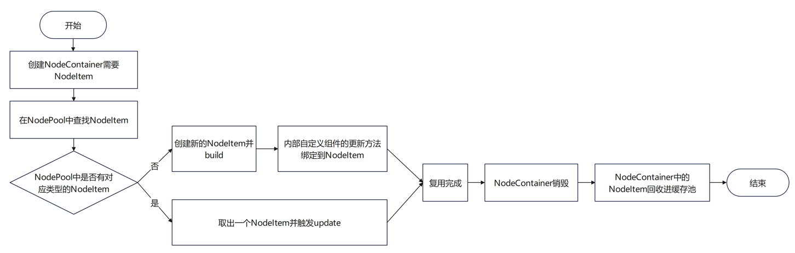
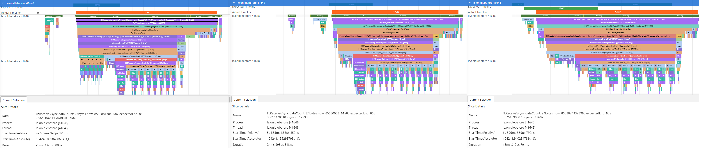
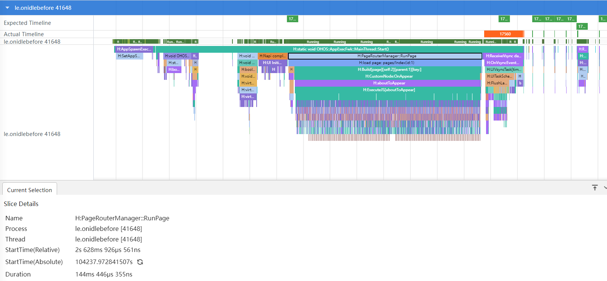
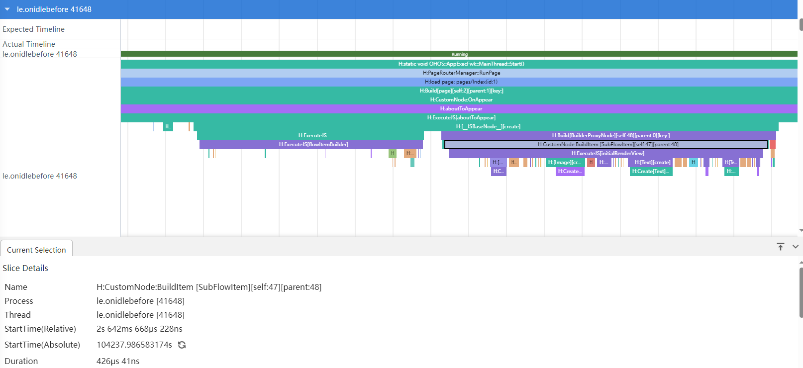
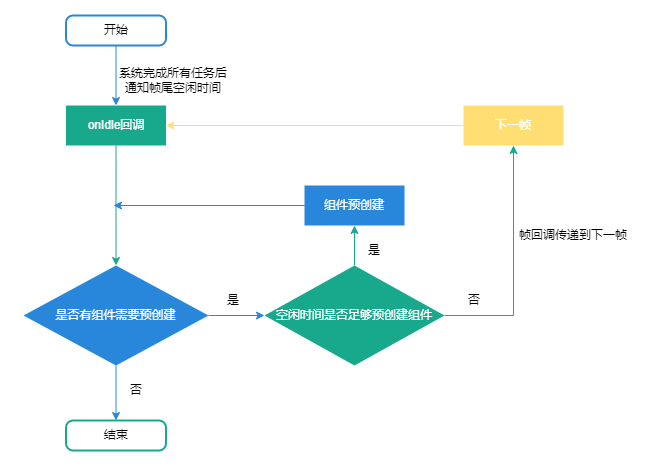
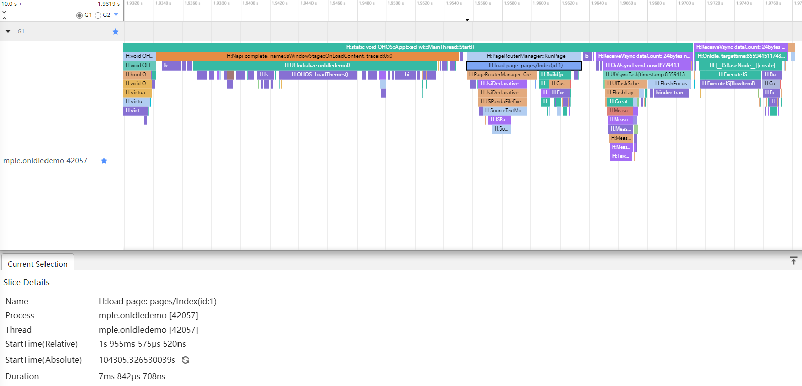
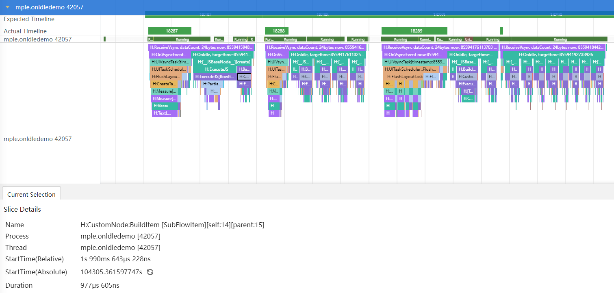

# 全局自定义组件复用实现

## 简介

默认的组件复用行为，是将子组件放在父组件的缓存池里，受到这个限制，不同父组件中的相同子组件无法复用，推荐的解决方案是将父组件改为builder函数，让子组件共享组件复用池，但是由于在一些应用场景下，父组件承载了复杂的带状态的业务逻辑，而builder是无状态的，修改会导致难以维护，因此开发者可以使用BuilderNode自行管理组件复用池。


## 实现思路

1. 将要生成自定义组件地方用[NodeContainer](../reference/apis-arkui/arkui-ts/ts-basic-components-nodecontainer.md#nodecontainer)占位，将NodeContainer内部的[NodeController](../reference/apis-arkui/js-apis-arkui-nodeController.md)按照组件类型分别存储在NodePool中。
2. 每次创建子组件时，优先通过NodePool的getNode方法尝试复用已存在的NodeController组件，若无可复用组件则调用makeNode方法新建；若复用成功，则调用update方法更新组件数据。
3. 当NodeController销毁时，NodeItem回收到NodePool中，供下次使用。

### 组件复用原理

在ArkUI中，当页面退出时，系统默认会销毁页面上的所有节点及其对应的NodeItem实例，以释放资源。为了提升性能和资源利用率，应用侧可以主动保存NodeItem实例。通过这种方法，能够有效延长这些NodeItem实例的生命周期，避免不必要的重建开销，从而在后续页面或组件的创建过程中实现快速复用。

下图为复用池中NodeItem实例跟随NodeContainer组件创建与销毁的复用过程。



### 数据结构

NodeItem继承NodeController，并实现makeNode方法，创建组件。NodePool通过HashMap管理NodeItem的复用和回收。


## 应用场景

在应用开发中，会遇到需要页面切换的场景，比如某些视频APP的首页，就是一个List（标题）+Swiper（列表页面）实现的Tabs切换场景。Swiper中每个页面都使用瀑布流加载视频列表，各个瀑布流中的子组件有可能是相同的布局，为了提升应用性能，就会有跨页面复用子组件的需求。但是在ArkUI提供的常规复用中，复用池是放在父组件中的，这就导致跨页面时无法复用上一个页面瀑布流中的子组件。此时就可以使用[BuilderNode](../reference/apis-arkui/js-apis-arkui-builderNode.md#buildernode)自定义一个全局的组件复用池，根据页面状态创建、回收、复用子组件，实现组件的跨页面复用。

## 组件复用性能对比

下面通过常规复用和自定义组件复用池两种方式，对比组件复用的性能。

### 常规复用

1. 使用List+Swiper实现Tabs页面切换。

   ```ts
   // ...

   List() {
     ForEach(this.arrayTitle, (title: Title, index: number) => {
       ListItem() {
         TitleView({
           title: title, clickListener: () => {
             if (title.isSelected) {
               return;
             }
             this.swiperController.changeIndex(index, true);
             this.arrayTitle[index].isSelected = true;
             this.arrayTitle[this.selectIndex].isSelected = false;
             this.selectIndex = index;
           }
         })
       }
     })
   }
   .height(30)
   .listDirection(Axis.Horizontal)
   
   Swiper(this.swiperController) {
     // 使用LazyForEach，使Swiper页面按需加载，而不是一次全部创建
     LazyForEach(this.array, () => {
       TabComp()
     }, (title: string) => title)
   }
   .loop(false)
   .onChange((index: number) => { 
     if (this.selectIndex !== index) {
       this.arrayTitle[index].isSelected = true;
       this.arrayTitle[this.selectIndex].isSelected = false;
       this.selectIndex = index;
     }
   })
   .cachedCount(0) // 此处设置cachedCount为0，便于性能对比，实际开发中可按需设置
   ```

2. 使用Swiper组件实现轮播图，使用WaterFlow组件实现瀑布流加载数据，并给自定义组件设置reuseId，用于组件复用。

   ```ts
   Scroll(this.scroller) {
     Column({ space: 2 }) {
       SwiperBuilder({images: this.images})
   
       WaterFlow() {
         LazyForEach(this.dataSource, (item: ViewItem, index: number) => {
           FlowItem() {
             FlowItemComp({
               item: item,
               itemHeight: this.itemHeightArray[index % 100],
               itemColor: Color.White,
               updater: (item: ViewItem) => {
                 this.fillNewData(item);
               }
             }).reuseId('reuse_type_')
           }
           .width('100%')
         }, (item: string) => item)
       }
       .nestedScroll({ // 设置嵌套滑动属性
         scrollForward: NestedScrollMode.PARENT_FIRST,
         scrollBackward: NestedScrollMode.SELF_FIRST
       })
     }
   }.width('100%')
   .height('100%')
   ```

3. 实现瀑布流的子组件。

   ```ts
   // 需要添加@Reusable装饰器，并实现aboutToReuse接口用于组件复用时刷新数据
   @Reusable
   @Component
   export struct FlowItemComp {
     // ...
   
     build() {
       // ...
     }
     // 通过aboutToReuse接口刷新复用后的数据
     aboutToReuse(params: ESObject): void {
       this.item = params.item;
       this.itemHeight = params.itemHeight;
       this.itemColor = params.itemColor;
     }
   }
   ```

编译运行后，点击Tabs切换页面，然后抓取Trace，通过图1中选择的区域可以看到，切换Tabs时，每个页面的首帧耗时（从DispatchTouchEvent标签开始，到sendCommands标签结束）都在30-40ms左右。这是因为使用@Reusable的组件复用，是使用了父组件的复用池。FlowItemComp的父组件是WaterFlow，Tab切换时新页面的WaterFlow会被重新创建，这就导致前一个页面的复用池是无法使用的，只能重新创建所有的子组件。

图1 常规复用Trace图


### 自定义组件复用池

1. 使用List+Swiper实现Tabs页面切换。

   ```ts
   Swiper(this.swiperController) {
     LazyForEach(this.array, () => {
       TabNode()
     }, (title: string) => title)
   }
   ```

2. 继承NodeController，实现makeNode，用于组件的创建或刷新，并在组件隐藏时（aboutToDisappear）回收组件。

   ```ts
   export class NodeItem extends NodeController {
     private callback: UpdaterCallback | null = null;
     // ...
     // 父类方法，用于创建子组件
     makeNode(uiContext: UIContext): FrameNode | null {
       if (!this.node) {
         this.node = new BuilderNode(uiContext);
         this.node.build(this.builder, this.data);
       } else {
         this.node.update(this.data);
         this.update(this.data);
       }
   
       return this.node.getFrameNode();
     }
     // 组件隐藏时回收组件
     aboutToDisappear(): void {
       NodePool.getInstance().recycleNode(this.type, this);
     }
   }
   ```

3. 使用单例模式实现复用池，应用内统一管理组件复用

    ```ts
    export class NodePool {
      private static instance: NodePool;
      // ...
    
      private constructor() {
        this.nodePool = new HashMap();
        this.nodeHook = new HashSet();
        this.idGen = 0;
      }
      // 单例模式，可以全局统一管理
      public static getInstance() {
        if (!NodePool.instance) {
          NodePool.instance = new NodePool();
        }
        return NodePool.instance;
      }
    }
    ```

4. 添加getNode方法，根据传入的type参数，获取对应的Node组件，如果未找到，则重新创建

    ```ts
      // 获取Node组件，如果存在type类型的Node组件，则直接使用，否则重新创建
      public getNode(type: string, data: ESObject, builder: WrappedBuilder<ESObject>): NodeItem | undefined {
        let node: NodeItem | undefined = this.nodePool.get(type)?.pop();
        if (!node) {
          node = new NodeItem(builder, data, type);
          this.nodeHook.add(node);
        } else {
          node.data = data;
        }
        node.data.callback = (callback: UpdaterCallback) => {
          if (node) {
            node.registerUpdater(callback);
          }
        }
        return node;
      }
    ```

5. 实现recycleNode方法，回收Node组件

    ```ts
      // 回收Node组件，提供给下次复用
      public recycleNode(type: string, node: NodeItem) {
        let nodeArray: Array<NodeItem> = this.nodePool.get(type);
        if (!nodeArray) {
          nodeArray = new Array();
          this.nodePool.set(type, nodeArray);
        }
        nodeArray.push(node);
      }
    ```

6. 使用NodeContainer占位轮播图组件和瀑布流子组件的位置，在最外层的Swiper切换时，会根据LazyForEach的懒加载机制回收页面，此时会触发NodeItem中的aboutToDisappear方法，将组件回收到复用池中。而新加载的页面则可以通过自定义的组件复用池获取可用的子组件，如果未获取到对应type类型的组件，则会重新创建新的组件，否则直接获取之前回收的子组件进行复用。

   ```ts
   ...
   @Builder
   function FlowItemBuilder(data: ESObject) {
     FlowItemNode({
       item: data.item,
       itemHeight: data.itemHeight,
       itemColor: data.itemColor,
       updater: data.updater,
       callback: data.callback
     })
   }
   
   let flowItemWrapper: WrappedBuilder<ESObject> = wrapBuilder<ESObject>(FlowItemBuilder);
   let swiperWrapper: WrappedBuilder<ESObject> = wrapBuilder<ESObject>(SwiperBuilder);
   
   @Component
   export struct TabNode {
     // 变量声明
     // ...
     build() {
       Scroll(this.scroller) {
         Column({ space: 2 }) {
           NodeContainer(NodePool.getInstance().getNode('reuse_type_swiper_', {
             images: this.images
           }, swiperWrapper))
           WaterFlow() {
             LazyForEach(this.dataSource, (item: ViewItem, index: number) => {
               FlowItem() {
                 NodeContainer(NodePool.getInstance().getNode('reuse_type_', {
                   item: item,
                   itemHeight: this.itemHeightArray[index % 100],
                   itemColor: this.colors[index % 5],
                   updater: (item: ViewItem) => {
                     this.fillNewData(item);
                   },
                   callback: null
                 }, flowItemWrapper))
               }
               .width('100%')
             }, (item: string) => item)
           }
     }
   }
   ```

编译运行后，点击Tabs切换页面，然后抓取Trace，通过图2中的选择区域可以看到，第一个页面的首帧耗时和常规复用是差不多的，但是后面2个页面的耗时大幅减少，只有14ms和17ms左右。这是因为第一个页面创建时自定义复用池里没有被回收的子组件，所以会和常规复用一样，需要直接创建新的子组件。而切换到第三个页面时，第一个页面中的子组件被回收到了自定义复用池NodePool中，当第三个页面被创建时，会先去复用池中查找可用的子组件直接使用，减少了创建子组件的时间。

图2 自定义组件复用池Trace图


### 性能数据对比

| 页面             | 电影   | 电视剧 | 动画   | 体育   |
| :-------------: | :----: | :----: | :----: | :----: |
| 创建耗时（优化前） | 39.5ms | 35.7ms | 29.8ms | 26.5ms |
| 创建耗时（优化后） | 40.3ms | 14.8ms | 17.8ms | 18.3ms |

## 使用onIdle进行组件预创建

在上一个章节的优化示例中，第一次进入首页时耗时依旧较高。这是因为第一次进入时，自定义组件复用池中没有组件可以复用，全部需要重新创建。要解决这个问题，可以提前预创建组件复用池中的组件，减少进入首页的启动耗时。目前，应用冷启动是一个比较好的预创建组件的时机。当组件数量较多时，集中预创建本身也耗时较长，容易导致主线程阻塞。ArkUI中提供了[onIdle回调接口](https://developer.huawei.com/consumer/cn/doc/harmonyos-references-V5/js-apis-arkui-uicontext-V5#onidle12)，可以返回每一帧帧尾的空闲时间，在帧尾空闲时逐步进行预创建是一个比较好的分摊主线程负载的方式。

### 示例代码

下面的代码，模拟了应用冷启动的流程，在应用启动后先进入广告页（Index页面），并在广告页进行组件预创建。

1. 在自定义组件复用池中实现预创建。

   ```ts
   // 继承NodeController，创建可以复用的子组件
   export class NodeItem extends NodeController {
     // ...
   
     // 预创建BuildNode
     prebuild(uiContext: UIContext) {
       this.node = new BuilderNode(uiContext);
       this.node.build(this.builder, this.data);
     }
   }
   
   // 全局组件复用池
   export class NodePool {
     // ...
   
     public preBuild(type: string, item: ESObject, builder: WrappedBuilder<ESObject>, uiContext: UIContext) {
       if (type) {
         let nodeItem: NodeItem | undefined = new NodeItem();
         nodeItem.builder = builder;
         nodeItem.data.data = item;
         nodeItem.type = type;
         // 预创建组件
         nodeItem.prebuild(uiContext);
         // 将预创建的组件回收到复用池中，便于后续复用
         this.recycleNode(type, nodeItem);
       }
     }
   
     // ...
   }
   ```

2. 在广告页中预创建组件。

   ```ts
   @Entry
   @Component
   struct Index {
     // ...
     aboutToAppear(): void {
       // ...
       // 获取模拟数据
       let viewItems: ViewItem[] = [];
       viewItems.push(...furnitureData());
       viewItems.push(...natureData());
       // 遍历模拟数据，预创建对应数量的组件
       viewItems.forEach((item) => {
         NodePool.getInstance()
           .preBuild('reuse_type_', item, flowItemWrapper, this.getUIContext());
       })
     }
   
     // ...
   }
   ```

3. 通过SmartPerfHost工具抓取Trace图，从图3中可以看到提前进行组件预创建后，上一章节中前两个页面的加载耗时已经缩短到了25ms左右，和第三个页面的耗时（18ms）相比差距已明显缩小，这说明提前预创建确实能解决首页因无法复用组件而导致的长耗时问题。

   图3 预创建组件Trace图

   

4. 然后查看冷启动耗时，如图4所示，加载Index页面（H:load page: pages/Index(id:1)）耗时大概144ms左右。

   图4 预创建组件冷启动Trace图-1

   

5. 如图5所示，将图4中的Trace进一步放大后可以看到，加载Index页面时主要耗时都是用于创建子组件（H:CustomNode:BuildItem \[SubFlowItem]\[self:47][parent:48]）。虽然单个组件耗时并不多，只有426μs，但是当数量较多时，总的预创建耗时就会变长，导致主线程阻塞。

   图5 预创建组件冷启动Trace图-2

   

6. 如图6所示，能够看到从桌面点击图标，到进入广告页，有明显的卡顿，这是因为预创建耗时较长，引起了主线程的阻塞。

   图6 预创建组件演示

   

### 优化方案

前文中可以看到，在冷启动时进行预创建，当组件数量较多时，会引起主线程的阻塞，增加冷启动耗时。为了解决这个问题，可以通过onIdle回调方法，将组件预创建分布到每一帧帧尾的空闲时间中执行。这样一来，预创建过程就被平摊在多个周期里执行，避免对冷启动时间的过度影响，进而优化启动速度和用户体验。

### 实现思路

当系统执行完全部任务后，会将帧尾的空闲时间通知到onIdle回调。此时，如果组件复用池中有需要预创建的组件，则判断空闲时间是否足够进行预创建。如果时间充足，则进行组件预创建，否则将onIdle回调传递到下一帧中执行，直到所有的组件全部预创建完成。



### 优化代码

下面的代码，将对组件预创建进行优化，把预创建分摊到帧尾的空闲时间中进行。

1. 通过常规预创建抓取Trace，获取单个组件预创建耗时，示例代码中单个组件预创建耗时最长在1ms左右。

2. 继承抽象类FrameCallback，实现帧回调类，在构造器中传入预创建的数据，并实现onIdle接口。

   ```ts
   export class IdleCallback extends FrameCallback {
     private uiContext: UIContext;
     // 已经创建的子组件数量
     private todoCount: number = 0;
     private viewItems: ViewItem[] = [];
   
     /**
      * @param context 上下文对象，用于将帧回调传递到下一帧
      * @param preBuildData 预创建组件的数据列表，用于确认预创建组件的数量和相关信息，可根据业务需求自行修改或设置固定值
      */
     constructor(context: UIContext, preBuildData: ViewItem[]) {
       super();
       this.uiContext = context;
       this.viewItems = preBuildData;
     }
   ```

3. 系统通过onIdle回调方法，将帧尾空闲时间通过参数idleTimeInNano（单位：ns）传递出来。在接收到帧尾空闲时间后，如果有需要预创建的组件，可根据单个组件的预创建耗时，设置预创建的剩余空闲时间上限（示例代码中设置了1ms）。

   ```
   // onIdle回调，返回帧尾空闲时间idleTimeInNano。
   onIdle(idleTimeInNano: number): void {
   
     // 当预创建的组件数量已经超过模拟数据的数量，则停止预创建
     if (this.todoCount >= this.viewItems.length) {
       return;
     }
     // 当前时间，后续用于计算本帧剩余空闲时间。
     let cur: number = systemDateTime.getTime(true);
     // 帧尾空闲时间，后续用于计算本帧剩余空闲时间。
     let timeLeft = idleTimeInNano;
     // 当帧尾空闲时间大于1ms时，执行预创建。
     // 此处空闲时间限制设置了1ms，即空闲时间少于1ms时，本帧不再进行组件的预创建，而是将帧回调传递到下一帧，开发者可以根据自身业务、组件复杂度进行设置，预留足够的空闲时间。
     while (timeLeft >= 1000000) {
   ```

4. 当剩余空闲时间足够创建组件时，在此帧中进行组件预创建，并不断更新当前帧的剩余空闲时间。

   ```ts
   hiTraceMeter.startTrace('onIdle_prebuild', 1);
   // 进行组件预创建
   NodePool.getInstance()
     .preBuild('reuse_type_', this.viewItems[this.todoCount], flowItemWrapper, this.uiContext);
   hiTraceMeter.finishTrace('onIdle_prebuild', 1);
   // 预创建完成后，更新本帧剩余空闲空闲时间。
   let now = systemDateTime.getTime(true);
   timeLeft = timeLeft - (now - cur);
   cur = now;
   this.todoCount++;
   // 当预创建的组件数量已经超过模拟数据的数量，则停止预创建
   if (this.todoCount >= this.viewItems.length) {
     return;
   }
   ```

5. 当当前帧剩余空闲时间不足以创建组件时，通过postFrameCallback方法，将帧回调传递到下一帧，继续进行剩余组件的预创建。

   ```ts
   // 如果组件预创建没有完成，则将帧回调传递到下一帧，并在下一帧中继续进行组件的预创建。
   if (this.todoCount < this.viewItems.length) {
     this.uiContext.postFrameCallback(this);
   }
   ```

6. 在冷启动时通过帧回调的方式预创建组件。

   ```
   @Entry
   @Component
   struct Index {
     // ...
     aboutToAppear(): void {
       // ...
       // 获取模拟数据
       let viewItems: ViewItem[] = [];
       viewItems.push(...furnitureData());
       viewItems.push(...natureData());
       let context = this.getUIContext();
       // 开启帧回调
       context.postFrameCallback(new IdleCallback(context, viewItems));
     }
   
     // ...
   }
   ```

7. 通过SmartPerfHost工具抓取Trace图，可以查看冷启动耗时。如下图所示，加载Index页面（H:load page: pages/Index(id:1)）耗时大概8ms左右，只有优化前耗时（144ms）的1/18，性能提升明显。而且相比于优化前，H:load page: pages/Index(id:1)标签下面并没有创建组件的耗时标签。

   图7 使用onIdle预创建组件Trace图

   

8. 如图8所示，组件的预创建，被放在了onIdle中执行，并且是在帧尾空闲时间中，并不会影响到帧的正常功能。

   图8 使用onIdle预创建组件空闲时间Trace图

   

9. 通过图9可以看到，从桌面点击图标到广告页的展示，变的更加流畅了。

   图9 使用onIdle预创建组件演示

   

### 性能对比

通过前两个章节可以看到，使用onIdle进行闲时组件预创建时，性能优化效果明显，能够在预创建复用池组件的前提下，减少冷启动时间。

| 优化前 | 144ms |
| ------ | ----- |
| 优化后 | 8ms   |

### 使用约束

1. 开发者需要根据业务准确预估组件预创建耗时，同时将业务逻辑颗粒度拆小，以便能够拆分到多个onIdle时机中完成。例如，单个组件预创建耗时在2ms左右，帧尾空闲时间只有1ms，那么就不能在当前帧进行预创建，而是延迟到下一帧中执行。
2. 需要合理控制自定义组件复用池中组件预创建的数量，否则内存占用较多，可能会影响性能。

## 总结

在父组件内部进行组件复用时，使用常规复用是可以解决问题的，而且使用简单，只需要添加@Reusable装饰器并且实现aboutToReuse。但是由于复用池的局限性，不同的父组件想要复用相同子组件时就会失效。而自定义组件复用池，可以实现跨页面的组件复用，并在闲时对组件进行预创建，加快组件的加载速度。但是实现起来也比较复杂，需要开发者自己维护复用池。

## FAQ

**Q：** 示例代码中为什么不使用ArkUI提供的Tabs+TabContent组件，而是要用List+Swiper组件实现？

**A：** Tabs中不支持使用LazyForEach，只能使用ForEach。如果使用ForEach，那么在页面创建时会将所有的TabContent全部创建，并且切换时无法回收子组件（不会执行aboutToDisappear），这就导致自定义复用池NodePool中是空的，每次创建时都获取不到组件，只能重新创建，使组件复用失去了效果。并且因为多创建了一个NodeContainer组件，耗时会比常规复用更长。

**Q：** NodeController中aboutToDisappear接口，是否和自定义组件生命周期中的aboutToDisappear相同？

**A：** NodeController中aboutToDisappear与自定义组件生命周期的aboutToDisappear含义不同，在复用时也会走到aboutToDisappear，在外层复用场景，会导致重复挂载。

## 参考资料

[场景示例代码](https://gitee.com/harmonyos-cases/cases/tree/master/CommonAppDevelopment/feature/perfermance/customreusablepool)