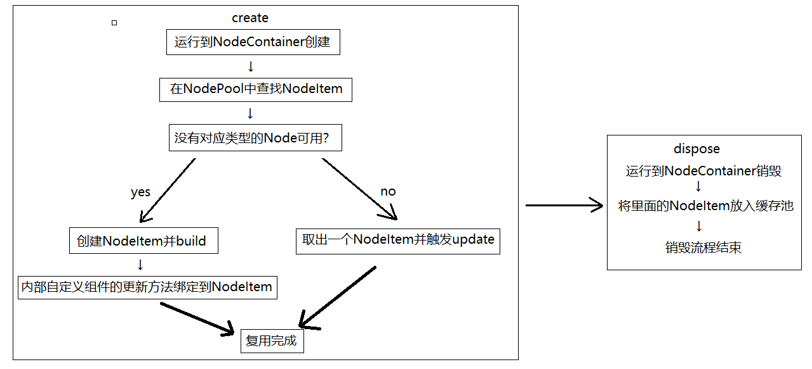
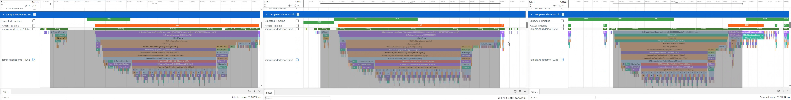
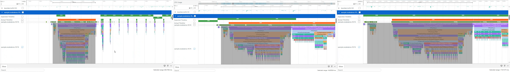

# 全局自定义组件复用实现

## 简介

默认的组件复用行为，是将子组件放在父组件的缓存池里，受到这个限制，不同父组件中的相同子组件无法复用，推荐的解决方案是将父组件改为builder函数，让子组件共享组件复用池，但是由于在一些应用场景下，父组件承载了复杂的带状态的业务逻辑，而builder是无状态的，修改会导致难以维护，因此开发者可以使用BuilderNode自行管理组件复用池。


## 实现思路

1. 将要生成自定义组件地方用[NodeContainer](../reference/apis-arkui/arkui-ts/ts-basic-components-nodecontainer.md#nodecontainer)占位，将NodeContainer内部的[NodeController](../reference/apis-arkui/js-apis-arkui-nodeController.md)按照组件类型分别存储在NodePool中。
2. 每次需要创建子组件时，优先从NodePool中取出一个组件，如果NodePool中没有可复用的组件则重新创建一个，否则就更新一下数据。当NodeController销毁时，回收到NodePool中，供下次使用。

### 数据结构

NodeItem继承NodeController，并实现makeNode方法，创建组件。NodePool通过HashMap管理NodeItem的复用和回收。


### 创建和销毁过程中复用池的流程

1. 在页面中使用NodeContainer占位自定义组件的位置，当运行到此处时在NodePool根据类型查找NodeItem。
2. 没有找到对应类型的NodeItem时创建新的NodeItem，否则取出已有的NodeItem并刷新数据。
3. 当页面被销毁时将NodeItem回收到复用池中，等待下次使用。



## 应用场景

在应用开发中，会遇到需要页面切换的场景，比如某些视频APP的首页，就是一个List（标题）+Swiper（列表页面）实现的Tabs切换场景。Swiper中每个页面都使用瀑布流加载视频列表，各个瀑布流中的子组件有可能是相同的布局，为了提升应用性能，就会有跨页面复用子组件的需求。但是在ArkUI提供的常规复用中，复用池是放在父组件中的，这就导致跨页面时无法复用上一个页面瀑布流中的子组件。此时就可以使用[BuilderNode](../reference/apis-arkui/js-apis-arkui-builderNode.md#buildernode)自定义一个全局的组件复用池，根据页面状态创建、回收、复用子组件，实现组件的跨页面复用。

## 组件复用性能对比

下面通过常规复用和自定义组件复用池两种方式，对比组件复用的性能。

### 常规复用

1. 使用List+Swiper实现Tabs页面切换。

   ```ts
   List() {
     ForEach(this.arrayTitle, (title: Title, index: number) => {
       ListItem() {
         TitleView({
           title: title, clickListener: () => {
             if (title.isSelected) {
               return;
             }
             this.swiperController.changeIndex(index, true);
             this.arrayTitle[index].isSelected = true;
             this.arrayTitle[this.selectIndex].isSelected = false;
             this.selectIndex = index;
           }
         })
       }
     })
   }
   .height(30)
   .listDirection(Axis.Horizontal)
   
   Swiper(this.swiperController) {
     // 使用LazyForEach，使Swiper页面按需加载，而不是一次全部创建
     LazyForEach(this.array, () => {
       TabComp()
     }, (title: string) => title)
   }
   .loop(false)
   .onChange((index: number) => { 
     if (this.selectIndex !== index) {
       this.arrayTitle[index].isSelected = true;
       this.arrayTitle[this.selectIndex].isSelected = false;
       this.selectIndex = index;
     }
   })
   .cachedCount(0) // 此处设置cachedCount为0，便于性能对比，实际开发中可按需设置
   ```

2. 使用Swiper组件实现轮播图，使用WaterFlow组件实现瀑布流加载数据，并给自定义组件设置reuseId，用于组件复用。

   ```ts
   Scroll(this.scroller) {
     Column({ space: 2 }) {
       SwiperBuilder({images: this.images})
   
       WaterFlow() {
         LazyForEach(this.dataSource, (item: ViewItem, index: number) => {
           FlowItem() {
             FlowItemComp({
               item: item,
               itemHeight: this.itemHeightArray[index % 100],
               itemColor: Color.White,
               updater: (item: ViewItem) => {
                 this.fillNewData(item);
               }
             }).reuseId('reuse_type_')
           }
           .width('100%')
         }, (item: string) => item)
       }
       .nestedScroll({ // 设置嵌套滑动属性
         scrollForward: NestedScrollMode.PARENT_FIRST,
         scrollBackward: NestedScrollMode.SELF_FIRST
       })
     }
   }.width('100%')
   .height('100%')
   ```

3. 实现瀑布流的子组件。

   ```ts
   // 需要添加@Reusable装饰器，并实现aboutToReuse接口用于组件复用时刷新数据
   @Reusable
   @Component
   export struct FlowItemComp {
     // ...
   
     build() {
       // ...
     }
     // 通过aboutToReuse接口刷新复用后的数据
     aboutToReuse(params: ESObject): void {
       this.item = params.item;
       this.itemHeight = params.itemHeight;
       this.itemColor = params.itemColor;
     }
   }
   ```

编译运行后，点击Tabs切换页面，然后抓取Trace，通过图1中选择的区域可以看到，切换Tabs时，每个页面的首帧耗时（从DispatchTouchEvent标签开始，到sendCommands标签结束）都在30-40ms左右。这是因为使用@Reusable的组件复用，是使用了父组件的复用池。FlowItemComp的父组件是WaterFlow，Tab切换时新页面的WaterFlow会被重新创建，这就导致前一个页面的复用池是无法使用的，只能重新创建所有的子组件。

图1 常规复用Trace图



### 自定义组件复用池

1. 使用List+Swiper实现Tabs页面切换。

   ```ts
   Swiper(this.swiperController) {
     LazyForEach(this.array, () => {
       TabNode()
     }, (title: string) => title)
   }
   ```

2. 继承NodeController，实现makeNode，用于组件的创建或刷新，并在组件隐藏时（aboutToDisappear）回收组件。

   ```ts
   export class NodeItem extends NodeController {
     private callback: UpdaterCallback | null = null;
     // 变量声明
     // 父类方法，用于创建子组件
     makeNode(uiContext: UIContext): FrameNode | null {
       if (!this.node) {
         this.node = new BuilderNode(uiContext);
         this.node.build(this.builder, this.data);
       } else {
         this.node.update(this.data);
         this.update(this.data);
       }
   
       return this.node.getFrameNode();
     }
     // 组件隐藏时回收组件
     aboutToDisappear(): void {
       NodePool.getInstance().recycleNode(this.type, this);
     }
   }
   ```

3. 使用单例模式实现复用池，应用内统一管理组件复用

    ```ts
    export class NodePool {
      private static instance: NodePool;
      // ...
    
      private constructor() {
        this.nodePool = new HashMap();
        this.nodeHook = new HashSet();
        this.idGen = 0;
      }
      // 单例模式，可以全局统一管理
      public static getInstance() {
        if (!NodePool.instance) {
          NodePool.instance = new NodePool();
        }
        return NodePool.instance;
      }
    }
    ```

4. 添加getNode方法，根据传入的type参数，获取对应的Node组件，如果未找到，则重新创建

    ```ts
      // 获取Node组件，如果存在type类型的Node组件，则直接使用，否则重新创建
      public getNode(type: string, data: ESObject, builder: WrappedBuilder<ESObject>): NodeItem | undefined {
        let node: NodeItem | undefined = this.nodePool.get(type)?.pop();
        if (!node) {
          node = new NodeItem(builder, data, type);
          this.nodeHook.add(node);
        } else {
          node.data = data;
        }
        node.data.callback = (callback: UpdaterCallback) => {
          if (node) {
            node.registerUpdater(callback);
          }
        }
        return node;
      }
    ```

5. 实现recycleNode方法，回收Node组件

    ```ts
      // 回收Node组件，提供给下次复用
      public recycleNode(type: string, node: NodeItem) {
        let nodeArray: Array<NodeItem> = this.nodePool.get(type);
        if (!nodeArray) {
          nodeArray = new Array();
          this.nodePool.set(type, nodeArray);
        }
        nodeArray.push(node);
      }
    ```

6. 使用NodeContainer占位轮播图组件和瀑布流子组件的位置，在最外层的Swiper切换时，会根据LazyForEach的懒加载机制回收页面，此时会触发NodeItem中的aboutToDisappear方法，将组件回收到复用池中。而新加载的页面则可以通过自定义的组件复用池获取可用的子组件，如果未获取到对应type类型的组件，则会重新创建新的组件，否则直接获取之前回收的子组件进行复用。

   ```ts
   @Builder
   function FlowItemBuilder(data: ESObject) {
     FlowItemNode({
       item: data.item,
       itemHeight: data.itemHeight,
       itemColor: data.itemColor,
       updater: data.updater,
       callback: data.callback
     })
   }
   
   let flowItemWrapper: WrappedBuilder<ESObject> = wrapBuilder<ESObject>(FlowItemBuilder);
   let swiperWrapper: WrappedBuilder<ESObject> = wrapBuilder<ESObject>(SwiperBuilder);
   
   @Component
   export struct TabNode {
     // 变量声明
     // ...
     build() {
       Scroll(this.scroller) {
         Column({ space: 2 }) {
           NodeContainer(NodePool.getInstance().getNode('reuse_type_swiper_', {
             images: this.images
           }, swiperWrapper))
           WaterFlow() {
             LazyForEach(this.dataSource, (item: ViewItem, index: number) => {
               FlowItem() {
                 NodeContainer(NodePool.getInstance().getNode('reuse_type_', {
                   item: item,
                   itemHeight: this.itemHeightArray[index % 100],
                   itemColor: this.colors[index % 5],
                   updater: (item: ViewItem) => {
                     this.fillNewData(item);
                   },
                   callback: null
                 }, flowItemWrapper))
               }
               .width('100%')
             }, (item: string) => item)
           }
     }
   }
   ```

编译运行后，点击Tabs切换页面，然后抓取Trace，通过图2中的选择区域可以看到，第一个页面的首帧耗时和常规复用是差不多的，但是后面2个页面的耗时大幅减少，只有14ms和17ms左右。这是因为第一个页面创建时自定义复用池里没有被回收的子组件，所以会和常规复用一样，需要直接创建新的子组件。而切换到第三个页面时，第一个页面中的子组件被回收到了自定义复用池NodePool中，当第三个页面被创建时，会先去复用池中查找可用的子组件直接使用，减少了创建子组件的时间。

图2 自定义组件复用池Trace图



### 性能数据对比

| 页面             | 电影   | 电视剧 | 动画   | 体育   |
| :-------------: | :----: | :----: | :----: | :----: |
| 创建耗时（优化前） | 39.5ms | 35.7ms | 29.8ms | 26.5ms |
| 创建耗时（优化后） | 40.3ms | 14.8ms | 17.8ms | 18.3ms |

## 总结

在父组件内部进行组件复用时，使用常规复用是可以解决问题的，而且使用简单，只需要添加@Reusable装饰器并且实现aboutToReuse。但是由于复用池的局限性，不同的父组件想要复用相同子组件时就会失效。而自定义组件复用池，可以实现跨页面的组件复用，但是实现起来也比较复杂，需要开发者自己维护复用池。

## FAQ

**Q：** 示例代码中为什么不使用ArkUI提供的Tabs+TabContent组件，而是要用List+Swiper组件实现？

**A：** Tabs中不支持使用LazyForEach，只能使用ForEach。如果使用ForEach，那么在页面创建时会将所有的TabContent全部创建，并且切换时无法回收子组件（不会执行aboutToDisappear），这就导致自定义复用池NodePool中是空的，每次创建时都获取不到组件，只能重新创建，使组件复用失去了效果。并且因为多创建了一个NodeContainer组件，耗时会比常规复用更长。

**Q：** 如果想要优化第一个页面的首帧耗时，应该怎么做？

**A：** 可以根据业务需求，提前在复用池中创建一些子组件（比如应用启动时），这样在第一个页面加载时可以略过创建子组件的过程，减少首帧耗时。

**Q：** NodeController中aboutToDisappear接口，是否和自定义组件生命周期中的aboutToDisappear相同？

**A：** NodeController中aboutToDisappear与自定义组件生命周期的aboutToDisappear含义不同，在复用时也会走到aboutToDisappear，在外层复用场景，会导致重复挂载。

## 参考资料

[场景示例代码](https://gitee.com/harmonyos-cases/cases/tree/master/CommonAppDevelopment/feature/perfermance/customreusablepool)