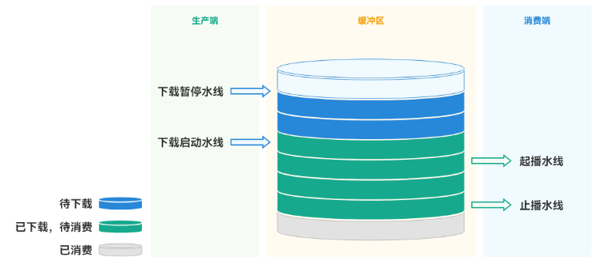
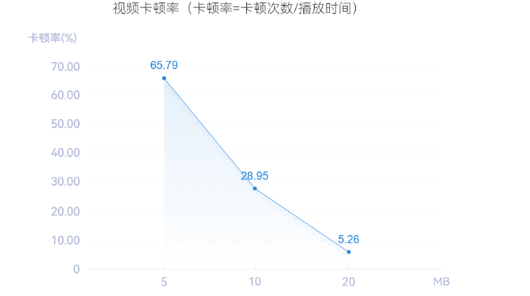

# 在线视频播放卡顿优化实践

## 概述

在观看在线视频时，流畅播放是至关重要的。当使用[AVPlayer](../reference/apis-media-kit/js-apis-media.md#avplayer9)+[XComponent](../reference/apis-arkui/arkui-ts/ts-basic-components-xcomponent.md)渲染播放在线视频时，有时会遇到在线视频播放卡顿的问题。这种情况可能是设备网络环境较差或需要加载高码率片源，导致视频缓冲时间不足，造成在线视频播放卡顿。当视频缓冲时间不足时，设备需要不断地从服务器上下载视频数据，这会导致视频播放卡顿或者停止播放。为了解决这个问题，通过合理地设置[preferredBufferDuration](../reference/apis-media-kit/js-apis-media.md#playbackstrategy12)属性可以增加视频缓冲时间，从而确保视频播放的流畅性。

## 实现原理

### 缓冲区工作过程

对于缓冲区而言，下载线程是生产端，读取线程则是消费端。生产端是将数据写入到缓冲区中，消费端则是从缓冲区读取数据，下面将介绍下缓冲区中的几个水线概念。

缓冲区原理图  




如上图所示：

- 起播水线：限制消费方行为，限制最低消费额度的数值，只有缓冲区达到这个数值后，才允许（通知）读取线程进行数据读取。
- 止播水线：限制消费方行为，保留最低额度的数值（可以类比理解为账户最低余额），避免将缓冲区中的可用数据耗尽。
- 下载启动水线：限制生产方行为，当前读取位置的连续数据低于某个数值时，启动下载，确保消费的连续性。
- 下载暂停水线：限制生产方行为，在缓冲区写满时，暂停下载。

定义各水线的参考值如下。

| **水线**     | 默认值                                                       | 说明                                                         |
| ------------ | :----------------------------------------------------------- | ------------------------------------------------------------ |
| 起播水线     | 若下载速率 >= 码率场景，起播水线取值：0.3秒 * 码率；若下载速率 < 码率场景，起播水线取值：5秒 * 码率；若起播水线小于10KB，取10KB | 在快速起播和顺滑播放间进行一个相对合理的分割，暂不支持修改。 |
| 止播水线     | 单次读取数据量，若小于5KB则取5KB                             | 避免将缓冲区中的可用数据耗尽，暂不支持修改。                 |
| 下载启动水线 | 480KB                                                        | 降低线程启动频率，进行集中下载，降低cpu及指令书消耗，暂不支持修改。 |
| 下载暂停水线 | 缓冲区大小                                                   | 当缓冲区写满时，停止下载，支持修改。                         |

>**说明：**
>
>- 下载速率：单位时间（不小于500ms）内写入缓冲区的数据。（下载速率统计的最小周期是500ms，也就是最少要500ms统计一次）
>- 码率：通过码流描述信息解析出的媒体码率。
>- 当缓冲区写满时，按读取先后顺序依次释放已读数据，可避免缓冲区数据写满造成数据无法下载到缓冲区内。

### 开发流程

[setMediaSource](../reference/apis-media-kit/js-apis-media.md#setmediasource12)中的preferredBufferDuration是AVPlayer的一个属性，用于设置播放器的缓冲区大小。AVPlayer会根据preferredBufferDuration属性的值来决定缓冲区的大小。preferredBufferDuration属性的实现原理是通过设置缓冲区大小来保证播放的流畅性和稳定性，在线视频播放流程如下：

1. 首先，当AVPlayer开始播放时，它会从服务器请求数据，并将其存储到内存中的缓冲区中。
2. 当缓冲区存储量达到播放的标准时，才可以从缓冲区读取下载数据，从而进行视频播放。
3. 视频播放是多线程的，读取和下载为两个线程，正常播放时是一边播放一边下载。当缓冲区数据量低于止播水线时，会暂停播放（停止读取线程读取），等下载一定数据，达到起播水线后，视频恢复播放。

## 合理设置缓冲区大小

为应对弱网及高码率片源的卡顿，用户需根据资源文件的大小设置尽可能大的缓冲区。这样在卡顿时，可以保证缓冲区能够缓存起播水线的数据量，从而避免卡成幻灯片的情况出现，保证卡顿后播放的连续性。

流媒体缓冲区大小设置

| **默认缓冲区大小** | 用户自定义缓冲区大小 |
| ------------------ | -------------------- |
| 20MB               | 5MB ~ 20MB           |

AVPlayer支持用户自定义缓冲区大小，可通过[setMediaSource](../reference/apis-media-kit/js-apis-media.md#setmediasource12)接口设置PlaybackStrategy中的preferredBufferDuration，自定义缓冲区大小。preferredBufferDuration的单位为秒，缓冲区大小将设置为preferredBufferDuration * 1MB。如：preferredBufferDuration设置为20秒，缓冲区大小将设置为20MB。示例可参考[视频播放](../media/media/video-playback.md)。缓冲区的大小是根据资源文件的大小来设置的，缓冲区大小需要大于整个媒体文件大小。如果媒体文件大小超过用户自定义缓冲区最大值20MB，此时可将缓冲区设置为最大值20MB。

```
import { media } from '@kit.MediaKit';
// 创建avPlayer实例对象
let player = await media.createAVPlayer();
let headers: Record<string, string> = {"User-Agent" : "User-Agent-Value"};
let mediaSource : media.MediaSource = media.createMediaSourceWithUrl("http://xxx",  headers);
// 将preferredBufferDuration设置为最大值20MB；preferredWidth为播放策略首选宽度；preferredHeight为播放策略首选高度；preferredHdr为播放策略true是hdr，false非hdr
let playStrategy : media.PlaybackStrategy = {preferredWidth: 1, preferredHeight: 2, preferredBufferDuration: 20, preferredHdr: false};
// 设置媒体来源和播放策略
player.setMediaSource(mediaSource, playStrategy);
```

本文的测试场景为弱网条件下使用AVPlayer+XComponent渲染播放一个大小为56MB的在线视频。

自定义缓冲区大小的卡顿率（注：测试视频大小为56MB，视频暂停超过100ms算一次卡顿）

| **用户自定义缓冲区大小** | **卡顿率（卡顿率=卡顿次数/播放时间）** |
| ------------------------ | -------------------------------------- |
| 5MB                      | 65.79%                                 |
| 10MB                     | 28.95%                                 |
| 20MB                     | 28.95%                                 |

视频卡顿率折线图  




从实验数据可以看出：

1. 当媒体文件大小超过可设置的缓冲区最大值时，可将缓冲区设置为最大值20MB，从而最小程度减少视频卡顿。
2. 当媒体文件大小未超过可设置的缓冲区的范围时，可根据媒体文件的大小来设置缓冲区大小。

>**说明：**
>
>1. 循环播放时，若应用会重新创建下载实例，**则新的实例会重新下载数据**。
>2. 循环播放时，若应用不会重新创建下载实例，且媒体文件大小，小于缓冲区大小，**则会循环读取已下载数据，不会重新触发下载**。
>3. 循环播放时，若应用不会重新创建下载实例，且媒体文件大小，大于缓冲区大小，**则会循环下载数据**。
>

## 常见问题

### 设置preferredBufferDuration后，刚开始视频正常播放，但当用户拖动进度条后，为什么视频卡顿暂停播放？

读取尚未缓存位置的数据，包括用户拖动进度条，及部分特殊片源在播放过程中会来回跳跃下载数据。缓冲区中读取所需的数据量可能会低于止播水线，此时会暂停播放开始缓存数据，缓存至起播水线后继续播放，该缓存时间即为卡顿时间。如果媒体文件未大于20MB，可根据媒体文件的大小来这设置preferredBufferDuration的大小。如果媒体文件的大小大于20MB，只需要设置默认值20MB就能最大程度的减少卡顿。

>**说明：**
>
>因为缓冲区大小所占的是应用内存，假设同时创建10个实例，视频设置的缓冲区为20MB，此时缓冲区所占的应用内存为200MB，对应用性能会有影响。如果根据媒体文件大小设置缓冲区，可以最低程度的减少设置缓冲区对应用性能带来的影响。