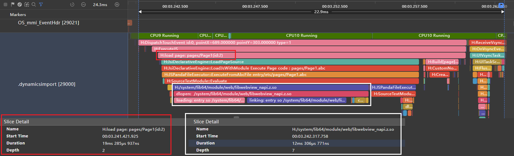
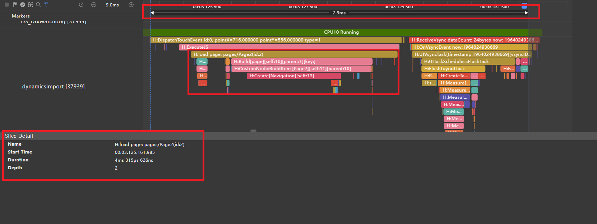
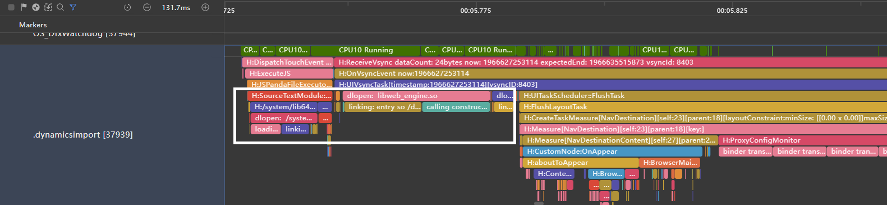

# 运行时动态加载页面提升性能

## 简介

应用在加载页面时，如果引入暂时不需要加载的模块，会导致页面加载缓慢和不必要的内存占用。例如当页面使用Navigation组件时，主页默认加载子页面，此时若子页面使用了Web组件，则会提前加载Web相关的so库，即使并没有进入子页面。

本文推荐使用动态加载解决上述问题，不在进入主页面时就将所有模块都加载进来，而是按需加载模块，增加应用灵活性，提升应用性能。

## 场景示例


下面示例应用通过Navigation组件常规加载与动态加载的对比，介绍如何在跳转时触发加载方法，实现按需加载子模块。

### 常规加载

开发者使用Navigation组件时，通常会在主页引入子页面组件，在按钮中添加方法实现跳转。下述代码展示常规加载示例，通过import引入子组件。

1. 创建子页面，添加一个Web组件，并加载一个在线的H5页面。

   ```
   import { webview } from '@kit.ArkWeb';
   
   @Builder
   export function buildPage() {
     WebViewPage()
   }
   
   @Component
   export struct WebViewPage {
     webController: WebviewController = new webview.WebviewController();
     url: string = 'https://gitee.com/harmonyos-cases/cases';
   
     aboutToAppear(): void {
       webview.WebviewController.initializeWebEngine();
       webview.WebviewController.prepareForPageLoad(this.url, true, 2);
     }
   
     build() {
       Column() {
         Web({ src: this.url, controller: this.webController })
       }
     }
   }
   ```

2. 在主页面的Navigation中添加上一步创建的web组件作为子页面。

   ```
   import { WebViewPage } from './WebViewPage';
   
   @Entry
   @Component
   export struct Page1 {
     pageStack: NavPathStack = new NavPathStack();
   
     @Builder
     pageMap() {
       NavDestination() {
         WebViewPage()
       }
     }
   
     build() {
       Stack() {
         Navigation(this.pageStack) {
           Column() {
             Button('加载页面')
               .onClick(() => {
                 this.pageStack.pushPath({ name: "" });
               })
               .margin({
                 top:30
               })
           }
           .height('100%')
           .width('100%')
         }.navDestination(this.pageMap)
       }
     }
   }
   ```

编译运行后，通过DevEco Studio中的[Profiler工具](application-performance-analysis.md)抓取Trace，可以得到图1。通过图中泳道可以看到，主页面加载完成共耗时22.9ms（从DispatchTouchEvent标签到sendCommands标签，即从点击进入页面到通知系统开始渲染页面）。其中，load page标签表示加载整个页面的时间，共耗时19ms。继续向下可以看到，虽然主页面并没有使用Web组件，但是依旧加载了libwebview_napi.z.so，耗时大概12ms左右。如果用户只是在主页面停留，并没有继续进入子页面，那么这个so库的初始化就是没有必要的，但是依旧产生了耗时，并且占用了一部分的内存，会降低应用的性能。

图1 常规加载主页面泳道图



### 动态加载

由于Navigation组件一次性加载所有模块，使用常规加载会导致主页加载耗时变长。为了减少主页面加载耗时，可以使用动态加载，在实际页面跳转时再按需动态引入子组件，优化用户的首次加载速度体验。下面将使用动态import的方式实现常规加载的功能。

```
@Entry
@Component
export struct Page2 {
  pageStack: NavPathStack = new NavPathStack();
  @BuilderParam page: ESObject;

  @Builder
  pageMap() {
    NavDestination() {
      this.page();
    }
  }

  build() {
    Navigation(this.pageStack) {
      Column() {
        Button('加载页面')
          .onClick(async () => {
            import('./WebViewPage').then((result: ESObject) => {
              this.page = result.buildPage;
              this.pageStack.pushPath({ name: '' });
            })
          })
          .margin({
            top: 30
          })
      }
      .height('100%')
      .width('100%')
    }
    .navDestination(this.pageMap)
  }
}
```

通过代码可以看到，在主页面中并没有直接import子页面，而是在点击事件中使用了动态import的方式加载子页面，再通过NavPathStack.pushPath方法进行了跳转。编译运行后，通过DevEco Studio中的Profiler工具抓取Trace，可以得到图2。通过图中泳道可以看到，使用动态import后，主页面加载耗时只有7.9ms（图2中红框所示），其中load page标签耗时只有4.3ms左右，相较于常规加载，耗时减少了15ms。

继续查看下面的泳道，可以发现相较于常规加载，并没有加载libwebview_napi.z.so的耗时，而是直接开始创建主页中的组件（Build[page]标签）。因为代码里没有直接使用import引入子页面，而是通过动态import的方式将加载子页面的逻辑放在了点击事件里面。只有在进入子页面时才会触发WebView库的加载，如图3中白框所示，实现了按需加载，减少了主页面不必要的耗时和内存占用。

图2 动态加载主页面泳道图



图3 动态加载子页面泳道图



### 性能对比

|         | 主页面加载耗时 | 主页面so加载耗时 |
| ------  | :--------------:   | :--------------:   |
| 常规加载 |     22.9ms     |     12ms     |
| 动态加载 |      7.9ms      |      0ms      |

## 总结

通过上面的示例可以看到，使用动态import能够更灵活地按需加载子页面，减少主页面的加载耗时，提升应用性能和用户体验。当子页面不会被马上使用或者可能占用大量内存时，可以通过动态import的方式进行性能方面的优化。

## 参考链接

[动态import](https://developer.huawei.com/consumer/cn/doc/harmonyos-guides-V5/arkts-dynamic-import-V5)
