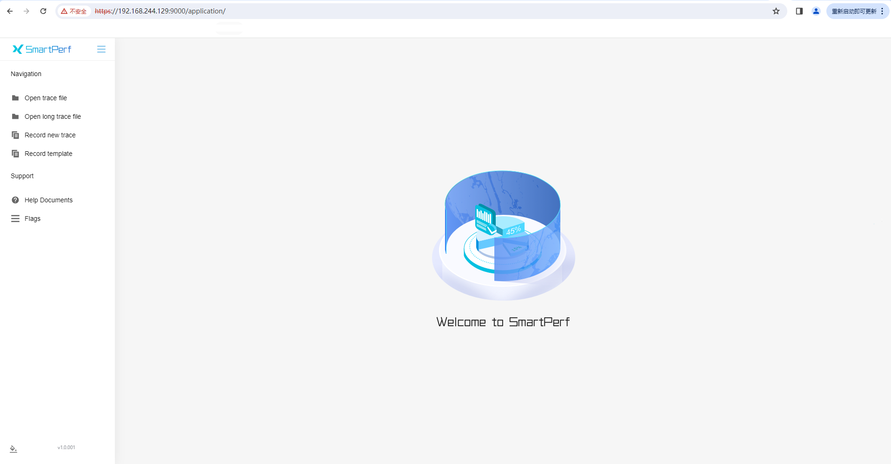
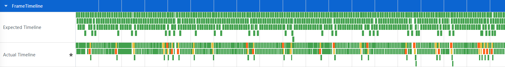
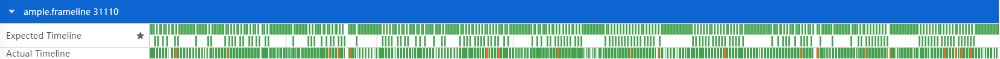
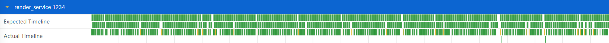
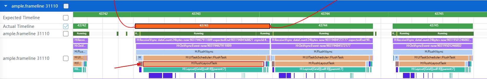
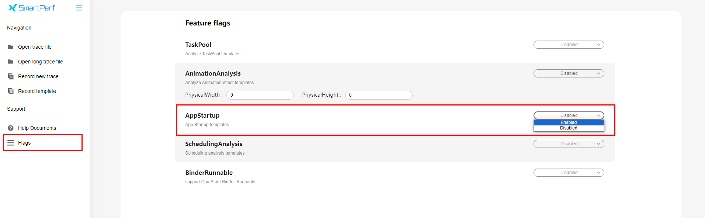
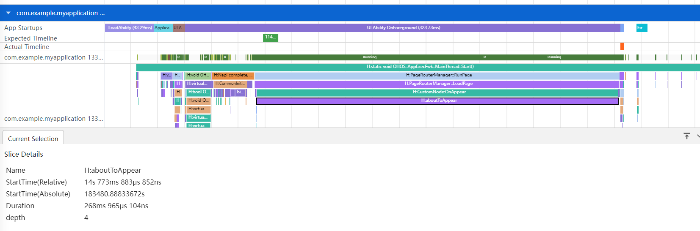

# 使用SmartPerf-Host分析应用性能

## 简介

SmartPerf-Host是一款深入挖掘数据、细粒度展示数据的性能功耗调优工具，可采集CPU调度、频点、进程线程时间片、堆内存、帧率等数据，采集的数据通过泳道图清晰地呈现给开发者，同时通过GUI以可视化的方式进行分析。该工具当前为开发者提供了五个分析模板，分别是帧率分析、CPU/线程调度分析、应用启动分析、TaskPool分析、动效分析。关于工具使用的更多内容可查看[SmartPerf-Host调优工具使用指导](../../device-dev/device-test/smartperf-host.md/)。

本文提供一些性能分析示例，介绍如何使用帧率分析和应用启动分析两个模板采集数据、分析数据，从而发现性能优化点。

## 本地部署

使用SmartPerf-Host进行性能分析前，需要先完成本地部署，本地部署的详细指导请参考[如何编译TraceStreamer](https://gitee.com/openharmony/developtools_smartperf_host/blob/master/trace_streamer/doc/compile_trace_streamer.md)和[SmartPerf-Host编译部署指导](https://gitee.com/openharmony/developtools_smartperf_host/blob/master/ide/README_zh.md)。在本地部署成功后，可通过https://[部署机器ip地址]:9000/application/访问，如下图。

**图1** 本地部署访问页



## 性能分析示例

### **FrameTimeline**帧率分析

SmartPerf-Host提供FrameTimeline帧率分析功能，可以抓取记录每一帧的渲染数据，自动标识其中的卡顿帧，并提供同时段的系统Trace信息，帮助开发者高效分析卡顿位置和原因。

#### 场景示例

如下场景代码使用了Grid来实现了一个网格布局，在应用界面上下滑动时发现有卡顿掉帧现象。下文基于这个场景来介绍FrameTimeline帧率分析功能的使用方式。

```
@Entry  
@Component  
struct Index {  
  @State children: number[] = Array.from<undefined, number>(Array(2000).fill(undefined), (_v: undefined, k) => k);  
  build() {  
    Scroll() {  
      Grid() {  
       ForEach(this.children, (item: number) => {  
          GridItem() {  
            Stack() {  
              Stack() {  
                Stack() {  
                  Text(item.toString())  
                    .fontSize(32)  
                }  
              }  
            }  
          }  
        }, (item: number) => item.toString())  
      }  
      .columnsTemplate('1fr 1fr 1fr 1fr')  
      .columnsGap(0)  
      .rowsGap(0)  
      .size({ width: "100%", height: "100%" })  
    }  
  }  
}
```

#### 抓取数据

下面介绍使用FrameTimeline帧率分析模板抓取数据的步骤：

1. 打开Record template -> Trace template -> FrameTimeline模板的配置开关。

	**图2** FrameTimeline模板配置

	

2. 自定义配置抓取时间、抓取数据大小和结果文件名称。

	**图3** 抓取配置项

	

3. 点击右上角Record开始抓取，同时在设备上复现应用掉帧或卡顿的操作过程，抓取完成后页面会自动加载trace数据。

**说明：** 

- 在数据抓取和分析的过程中，请不要主动退出应用或者设备，否则可能导致分析任务失败。

- 点击Record时，网站上方出现please kill other hdc-server！的提醒，表示设备连接失败，说明设备的hdc连接端口被占用，需要在cmd命令行中执行hdc kill指令，然后再重新连接设备进行抓取。

#### 分析数据

完整的一个渲染流程，首先是App侧响应用户输入完成UI绘制，然后提交给Render Service，由Render Service协调GPU等资源完成渲染、合成和送显操作，在这个过程中App侧和Render Service侧都有可能出现卡顿最终导致丢帧现象。

通过图4、图5、图6三组泳道数据，开发者们可以快速发现丢帧的位置，并完成初步的定界。

**图4** UI + RenderService总耗时

 

  
**图5** UI耗时

 

  
**图6** RenderService耗时

 

- Expected Timeline是理想帧泳道图，Actual Timeline是真实帧泳道图。

- 绿色帧为正常帧，橙色帧为卡顿帧，黄色帧表示RS进程与App进程起止异常。

- UI耗时（图5）显示了应用侧每一帧的处理耗时，方块的长度即为具体的耗时，RenderService耗时（图6）同理。

- App侧帧/RS侧帧卡顿的计算标准为帧的实际结束时间晚于帧的期望结束时间即为卡顿。

- App侧有橙色出现，需要审视UI线程的处理逻辑是否过于复杂或低效，以及是否被其它任务抢占资源。

- RS侧有橙色出现，需要审视界面布局是否过于复杂，可以使用布局检查器ArkUI Inspector工具和HiDumper命令行工具辅助分析定位，相关指导可以参考[使用HiDumper命令行工具优化性能](./performance-optimization-using-hidumper.md/)。
从图5和图6结合来看可以确定场景示例明显属于App侧的帧卡顿。点击卡顿帧进行详细分析，相应的关联帧会通过线连起来，同时在Current Selection显示它的Details信息，如图7。

**图7** App卡顿帧


- Duration表示帧的持续时间。

- Jank Type表示卡顿类型。APP Deadline Missed表示应用侧卡顿。

- FrameTimeLine flows Slice表示链接FrameTimeLine关联帧。

- Preceding flows Slice表示链接RS关联帧。

如下图，展开的应用泳道图中，存在两个名字和Pid一样的泳道，第一个为线程的使用情况，第二个为线程内的方法栈调用情况。结合卡顿帧对应时间段的Trace数据，可以定位到FlushLayoutTask耗时过长，它的作用是重新测量和布局所有的Item。其中Layout[Gird]耗时最久，因此卡顿原因可以确定为Gird布局处理逻辑过于复杂或低效。

**图8** 应用布局绘制trace数据

 

定位到Grid布局代码段，经过分析，去除了冗余的3层stack容器，并将源数据提前处理为布局中需要的string类型，减少布局消耗。同时给Grid添加cachedCount参数结合LazyForEach进行预加载，cachedCount的值设定为一屏能够渲染的GridItem数量。优化后采用同样的方式抓取数据，得到的FrameTimeline泳道数据如图9，并且滑动过程中无卡顿丢帧现象。

**图9** 优化后FrameTimeline泳道图

 

优化后的示例代码如下：

```
class MyDataSource implements IDataSource { // LazyForEach的数据源  
  private list: string[] = [];  
  
  constructor(list: string[]) {  
    this.list = list;  
  }  
  
  totalCount(): number {  
    return this.list.length;  
  }  
  
  getData(index: number): string {  
    return this.list[index];  
  }  
  
  registerDataChangeListener(_: DataChangeListener): void {  
  }  
  
  unregisterDataChangeListener(): void {  
  }  
}  
@Entry  
@Component  
struct Index {  
  @State children: string[] = Array.from<undefined, string>(Array(2000).fill(undefined), (_v: undefined, k) => k.toString());  
  @State data: MyDataSource = new MyDataSource(this.children)  
  build() {  
    Scroll() {  
      Grid() {  
        LazyForEach(this.data, (item: string) => {  
          GridItem() {  
            Text(item)  
              .fontSize(32)  
          }  
        }, (item: string) => item)  
      }  
      .cachedCount(80)  
      .columnsTemplate('1fr 1fr 1fr 1fr')  
      .columnsGap(0)  
      .rowsGap(0)  
      .size({ width: "100%", height: "100%" })  
    }  
  }  
}
```

### **AppStartup**应用启动分析

SmartPerf-Host提供了AppStartup功能，以便于分析应用启动时各个阶段耗时情况。应用启动分析功能主要是提供应用启动分析模板，帮助系统调优人员做应用启动慢场景问题分析，快速查找系统侧启动慢阶段和耗时长调用栈信息。

#### 场景示例

以下示例代码展示AppStartup功能。

```
@Entry  
@Component  
struct Index {  
  @State private text: string = "hello world";  
  private count: number = 0;  
  
  aboutToAppear() {  
    this.computeTask();  
  }  
  
  build() {  
    Column({space: 10}) {  
      Text(this.text).fontSize(50)  
    }  
    .width('100%')  
    .height('100%')  
    .padding(10)  
  }  
  
  computeTask() {  
    this.count = 0;  
    while (this.count < 10000000) {  
      this.count++;  
    }  
  }  
}
```

#### 抓取数据

使用如下步骤进行AppStartup数据的抓取：

1. 切换到Flags页面，将AppStartup选项切换到Enabled，开启AppStartup模板。

	**图10** AppStartup特性开关

	 

2. 切换到Record template页面，点击Trace template，开启AppStartup。

	**图11** AppStartup模板配置

	 

3. Record setting内设置文件名、大小以及抓取时长。

	**图12** 抓取配置项

	 

4. 点击右上角Record开始抓取，同时在设备上打开目标应用。可提前点击StopRecord完成抓取，或者等待时间自动完成抓取。抓取完成后会页面会自动加载trace数据。

	**图13** 停止抓取选项

	 

#### 分析数据

等待分析结果自动生成。点击右上角的筛选按钮，选中AppStartup，便于查看分析。

**图14** 模板数据筛选

 

展开对应应用的泳道，找到应用启动时的时间段。选中AppStartup泳道全部阶段，可以在下方详情内看到具体阶段的耗时情况。

**图15** AppStartup各阶段耗时情况——优化前

 

- ProcessTouchEvent：点击事件输入及处理

- StartUIAbilityBySCB：处理创建进程信息&创建窗口

- LoadAbility：拉起进程

- Application Launching：加载应用

- UI Ability Launching：加载UI Ability

- UI Ability OnForeground：应用进入前台

- First Frame - App Phase：首帧渲染提交-应用

- First Frame - Render Phase：首帧渲染提交-Render Service

上图展示结果显示，执行耗时最长的是UI Ability OnForeground阶段。目前耗时Duration为323ms。

**图16** UI Ability OnForeground阶段耗时——优化前

 

在这个阶段里，通过阶段内下方泳道可以发现生命周期aboutToAppear耗时较长，点击该泳道内容可以看到具体耗时Duration，为268ms，占整个UI Ability OnForeground阶段的82%。

**图17** aboutToAppear耗时——优化前

 

查看代码后发现，在aboutToAppear生命周期函数内执行了耗时的计算任务，导致应用冷启动耗时长。

随后对aboutToAppear内容进行异步延迟处理。优化后代码如下：

```
@Entry  
@Component  
struct Index {  
  @State private text: string = "hello world";  
  private count: number = 0;  
  
  aboutToAppear() {  
    setTimeout(() => {  
      this.computeTask();  
    }, 0)  
  }  
  
  build() {  
    Column({space: 10}) {  
      Text(this.text).fontSize(10)  
    }  
    .width('100%')  
    .height('100%')  
    .padding(10)  
  }  
  
  computeTask() {  
    this.count = 0;  
    while (this.count < 10000000) {  
      this.count++;  
    }  
  }  
}
```

处理后用同样的方式获取一遍数据。

**图18** AppStartup各阶段耗时情况——优化后

 

继续聚焦到aboutToAppear生命周期所在的UI Ability OnForeground阶段，目前耗时Duration为81ms。

**图19** UI Ability OnForeground阶段耗时——优化后

 

在这个阶段里，通过阶段内下方泳道可以发现需要查看的生命周期aboutToAppear，点击该泳道内容可以看到具体耗时Duration，为2ms，目前只占整个UI Ability OnForeground阶段的2.5%。

**图20** aboutToAppear耗时——优化后


<!--no_check-->