# Web组件开发性能提升指导

## 简介

开发者实现在应用中跳转显示网页需要分为两个方面：使用@ohos.web.webview提供Web控制能力；使用Web组件提供网页显示的能力。在实际应用中往往由于各种原因导致首次跳转Web网页或Web组件内跳转时出现白屏、卡顿等情况。本文介绍提升Web首页加载与Web网页间跳转速度的几种方法，并提供[示例源码](https://www.gitee.com/openharmony/applications_app_samples/tree/master/code/Performance/PerformanceLibrary/feature/webPerformance)。

## 优化思路

用户在使用Web组件显示网页时往往会经历四个阶段：无反馈-->白屏-->网页渲染-->完全展示，系统会在各个阶段内分别进行WebView初始化、建立网络连接、接受数据与渲染页面等操作，如图一所示是WebView的启动阶段。

图一 Web组件显示页面的阶段


要优化Web组件的首页加载性能，可以从图例标记的三个阶段来进行优化：

1. 在WebView的初始化阶段：应用打开WebView的第一步是启动浏览器内核，而这段时间由于WebView还不存在，所有后续的步骤是完全阻塞的。因此可以考虑在应用中预先完成初始化WebView，以及在初始化的同时通过预先加载组件内核、完成网络请求等方法，使得WebView初始化不是完全的阻塞后续步骤，从而减小耗时。
2. 在建立连接阶段：当开发者提前知道访问的网页地址，我们可以预先建立连接，进行DNS预解析。
3. 在接收资源数据阶段：当开发者预先知道用户下一页会点击什么页面的时候，可以合理使用缓存和预加载，将该页面的资源提前下载到缓存中。

综上所述，开发者可以通过方法1和2来提升Web首页加载速度，在应用创建Ability的时候，在OnCreate阶段预先初始化内核。随后在onAppear阶段进行预解析DNS、预连接要加载的首页。  
在网页跳转的场景，开发者也可以通过方法3，在onPageEnd阶段预加载下一个要访问的页面，提升Web网页间的跳转和显示速度，如图二所示。

图二 Web组件的生命周期回调函数

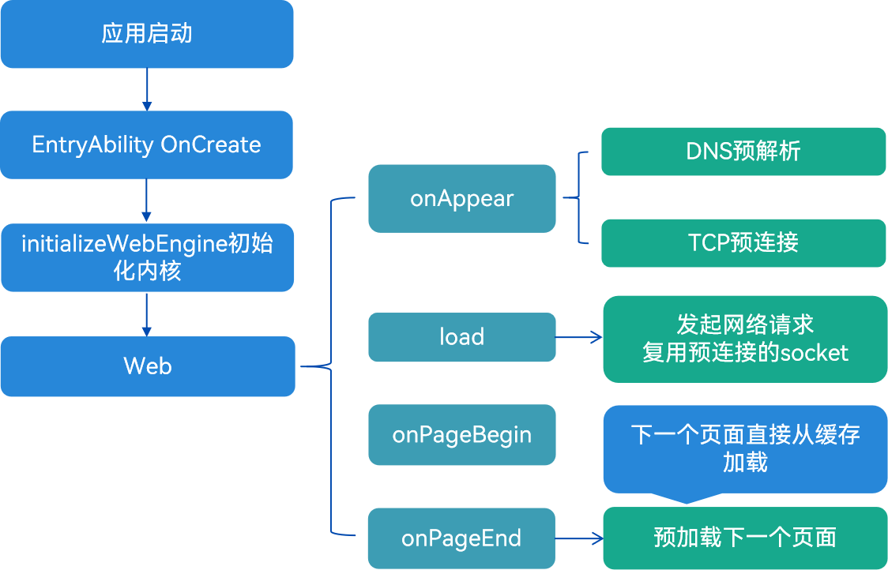

## 优化方法

### 提前初始化内核

**原理介绍**

当应用首次打开时，默认不会初始化浏览器内核，只有当创建WebView实例的时候，才会开始初始化浏览器内核。  
为了能提前初始化WebView实例，@ohos.web.webview提供了initializeWebEngine方法。该方法实现在Web组件初始化之前，通过接口加载Web引擎的动态库文件，从而提前进行Web组件动态库的加载和Web内核主进程的初始化，最终以提高启动性能，减少白屏时间。


**实践案例**

【反例】

在未初始化Web内核前提下，启动加载Web页面

```typescript
import web_webview from '@ohos.web.webview';

@Entry
@Component
struct Index {
  controller: web_webview.WebviewController = new web_webview.WebviewController();

  build() {
    Column() {
      Web({ src: 'https://www.example.com/example.html', controller: this.controller })
        .fileAccess(true)
    }
  }
}
```

性能打点数据如下，getMessageData进程中的Duration为加载页面开始到结束的耗时：

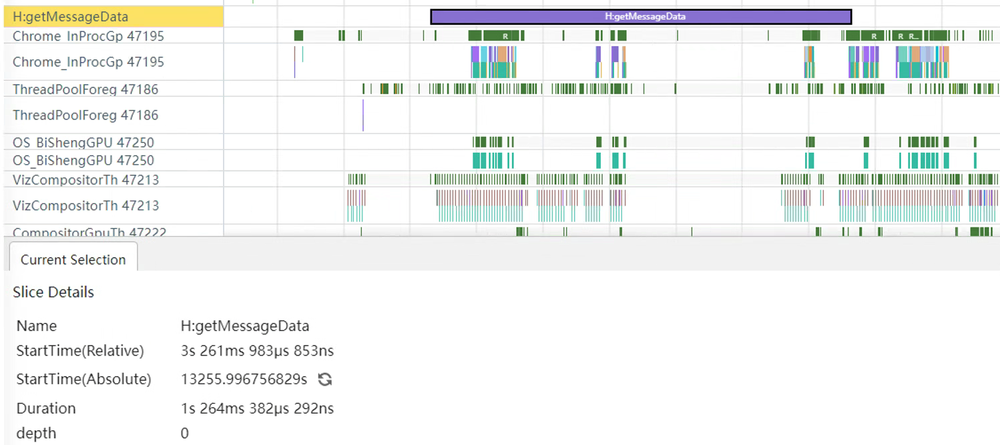


【正例】

在页面开始加载时，调用initializeWebEngine()接口初始化Web内核，具体步骤如下：

1. 初始化Web内核

```typescript
// EntryAbility.ets
import { UIAbility, AbilityConstant, Want } from '@kit.AbilityKit';
import { webview } from '@kit.ArkWeb';

export default class EntryAbility extends UIAbility {
  onCreate(want: Want, launchParam: AbilityConstant.LaunchParam) {
    webview.WebviewController.initializeWebEngine();
  }
}
```

2. 加载Web组件

```typescript
// xxx.ets
import web_webview from '@ohos.web.webview';

@Entry
@Component
struct Index {
  controller: web_webview.WebviewController = new web_webview.WebviewController();

  build() {
    Column() {
      Web({ src: 'https://www.example.com/example.html', controller: this.controller })
        .fileAccess(true)
    }
  }
}
```

性能打点数据如下，getMessageData进程中的Duration为加载页面开始到结束的耗时：

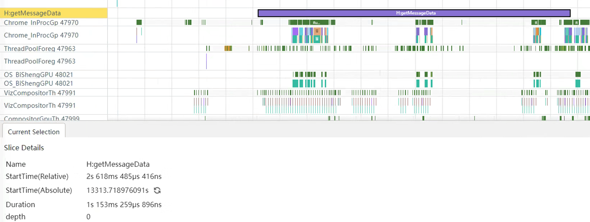


**总结**

| **页面加载方式** | **耗时(局限不同设备和场景，数据仅供参考)**  | **说明** |
| ------ | ------- | ------------------------------------- |
| 直接加载Web页面  | 1264ms | 在加载Web组件时才初始化Web内核，增加启动时间 |
| 提前初始化Web内核  | 1153ms | 加载页面时减少了Web内核初始化步骤，提高启动性能 |


### 预解析DNS、预连接
WebView在onAppear阶段进行预连接socket， 当Web内核真正发起请求的时候会直接复用预连接的socket，如果当前预解析还没完成，真正发起网络请求进行DNS解析的时候也会复用当前正在执行的DNS解析任务。同理即使预连接的socket还没有连接成功，Web内核也会复用当前正在连接中的socket，进而优化资源的加载过程。  
@ohos.web.webview提供了prepareForPageLoad方法实现预连接url，在加载url之前调用此API，对url只进行DNS解析、socket建链操作，并不获取主资源子资源。  
参数：

| 参数名            | 类型      | 说明                                                                                        |
|----------------|---------|-------------------------------------------------------------------------------------------|
| url            | string  | 预连接的url。                                                                                  |
| preconnectable | boolean | 是否进行预连接。如果preconnectable为true，则对url进行dns解析，socket建链预连接；如果preconnectable为false，则不做任何预连接操作。 |
| numSockets     | number  | 要预连接的socket数。socket数目连接需要大于0，最多允许6个连接。              

使用方法如下：

```typescript
// 开启预连接需要先使用上述方法预加载WebView内核。
webview.WebviewController.initializeWebEngine();
// 启动预连接，连接地址为即将打开的网址。
webview.WebviewController.prepareForPageLoad("https://www.example.com", true, 2); 
```


### 预加载下一页
开发者可以在onPageEnd阶段进行预加载，当真正去加载下一个页面的时候，如果预加载已经成功，则相当于直接从缓存中加载页面资源，速度更快。一般来说能够准确预测到用户下一步要访问的页面的时候，可以进行预加载将要访问的页面，比如小说下一页， 浏览器在地址栏输入过程中识别到用户将要访问的页面等。  
@ohos.web.webview提供prefetchPage方法实现在预测到将要加载的页面之前调用，提前下载页面所需的资源，包括主资源子资源，但不会执行网页JavaScript代码或呈现网页，以加快加载速度。  
参数：

| 参数名               | 类型                | 说明             |
|-------------------|-------------------|----------------|
| url               | string            | 预加载的url。       |
| additionalHeaders | Array\<WebHeader> | url的附加HTTP请求头。 |

使用方法如下：
```typescript
// src/main/ets/pages/WebBrowser.ets

import { webview } from '@kit.ArkWeb';

@Entry
@Component
struct WebComponent {
  controller: webview.WebviewController = new webview.WebviewController();

  build() {
    Column() {
       // ...
       Web({ src: 'https://www.example.com', controller: this.controller })
         .onPageEnd((event) => {
           //  ...
           // 在确定即将跳转的页面时开启预加载，url请替换真实地址
           this.controller.prefetchPage('https://www.example.com/nextpage');
         })
         .width('100%')
         .height('80%')
         
       Button('下一页')
         .onClick(() => {
           // ...
           // 跳转下一页
           this.controller.loadUrl('https://www.example.com/nextpage');
         })
    }
  }
}
```

### 预渲染优化

**原理介绍**

预渲染优化适用于Web页面启动和跳转场景，例如，进入首页后，跳转到其他子页。与预连接、预下载不同的是，预渲染需要开发者额外创建一个新的ArkWeb组件，并在后台对其进行预渲染，此时该组件并不会立刻挂载到组件树上，即不会对用户呈现(组件状态为Hidden和InActive)，开发者可以在后续使用中按需动态挂载。

具体原理如下图所示，首先需要定义一个自定义组件封装ArkWeb组件，该ArkWeb组件被离线创建，被包含在一个无状态的节点NodeContainer中，并与相应的NodeController绑定。该ArkWeb组件在后台完成预渲染后，在需要展示该ArkWeb组件时，再通过NodeController将其挂载到ViewTree的NodeContainer中，即通过NodeController绑定到对应的NodeContainer组件。预渲染通用实现的步骤如下：

创建自定义ArkWeb组件：开发者需要根据实际场景创建封装一个自定义的ArkWeb组件，该ArkWeb组件被离线创建。
创建并绑定NodeController：实现NodeController接口，用于自定义节点的创建、显示、更新等操作的管理。并将对应的NodeController对象放入到容器中，等待调用。
绑定NodeContainer组件：将NodeContainer与NodeController进行绑定，实现动态组件页面显示。

图三 预渲染优化原理图

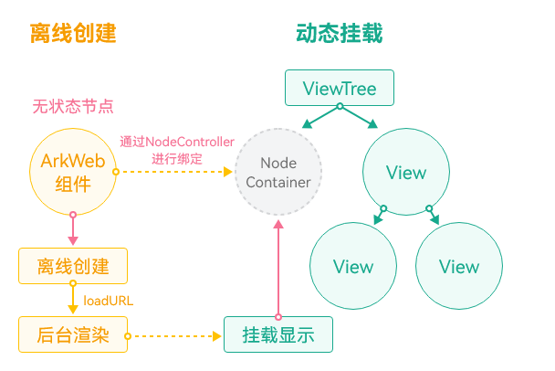

> 说明  
> 预渲染相比于预下载、预连接方案，会消耗更多的内存、算力，仅建议针对高频页面使用，单应用后台创建的ArkWeb组件要求小于200个。

**实践案例**

1. 创建载体，并创建ArkWeb组件
   ```typescript
   // 载体Ability
   // EntryAbility.ets
   import {createNWeb} from "../pages/common";
   import { UIAbility } from '@kit.AbilityKit';
   import { window } from '@kit.ArkUI';
   
   export default class EntryAbility extends UIAbility {
     onWindowStageCreate(windowStage: window.WindowStage): void {
       windowStage.loadContent('pages/Index', (err, data) => {
         // 创建ArkWeb动态组件（需传入UIContext），loadContent之后的任意时机均可创建
         createNWeb("https://www.example.com", windowStage.getMainWindowSync().getUIContext());
         if (err.code) {
           return;
         }
       });
     }
   }
   ```
2. 创建NodeContainer和对应的NodeController，渲染后台ArkWeb组件

    ```typescript
    // 创建NodeController
    // common.ets
    import { UIContext } from '@kit.ArkUI';
    import { webview } from '@kit.ArkWeb';
    import { NodeController, BuilderNode, Size, FrameNode }  from '@kit.ArkUI';
    // @Builder中为动态组件的具体组件内容
    // Data为入参封装类
    // 调用onActive，开启渲染
    @Builder
    function WebBuilder(data:Data) {
      Column() {
        Web({ src: data.url, controller: data.controller })
          .onPageBegin(() => {
            data.controller.onActive();
          })
          .width("100%")
          .height("100%")
      }
    }
    let wrap = wrapBuilder<Data[]>(WebBuilder);
    // 用于控制和反馈对应的NodeContianer上的节点的行为，需要与NodeContainer一起使用
    export class myNodeController extends NodeController {
      private rootnode: BuilderNode<Data[]> | null = null;
      // 必须要重写的方法，用于构建节点数、返回节点挂载在对应NodeContianer中
      // 在对应NodeContianer创建的时候调用、或者通过rebuild方法调用刷新
      makeNode(uiContext: UIContext): FrameNode | null {
        console.info(" uicontext is undifined : "+ (uiContext === undefined));
        if (this.rootnode != null) {
          // 返回FrameNode节点
          return this.rootnode.getFrameNode();
        }
        // 返回null控制动态组件脱离绑定节点
        return null;
      }
      // 当布局大小发生变化时进行回调
      aboutToResize(size: Size) {
        console.info("aboutToResize width : " + size.width  +  " height : " + size.height )
      }
      // 当controller对应的NodeContainer在Appear的时候进行回调
      aboutToAppear() {
        console.info("aboutToAppear")
      }
      // 当controller对应的NodeContainer在Disappear的时候进行回调
      aboutToDisappear() {
        console.info("aboutToDisappear")
      }
      // 此函数为自定义函数，可作为初始化函数使用
      // 通过UIContext初始化BuilderNode，再通过BuilderNode中的build接口初始化@Builder中的内容
      initWeb(url:string, uiContext:UIContext, control:WebviewController) {
        if(this.rootnode != null)
        {
          return;
        }
        // 创建节点，需要uiContext
        this.rootnode = new BuilderNode(uiContext)
        // 创建动态Web组件
        this.rootnode.build(wrap, { url:url, controller:control })
      }
    }
    // 创建Map保存所需要的NodeController
    let NodeMap:Map<string, myNodeController | undefined> = new Map();
    // 创建Map保存所需要的WebViewController
    let controllerMap:Map<string, WebviewController | undefined> = new Map();
    // 初始化需要UIContext 需在Ability获取
    export const createNWeb = (url: string, uiContext: UIContext) => {
      // 创建NodeController
      let baseNode = new myNodeController();
      let controller = new webview.WebviewController() ;
      // 初始化自定义Web组件
      baseNode.initWeb(url, uiContext, controller);
      controllerMap.set(url, controller)
      NodeMap.set(url, baseNode);
    }
    // 自定义获取NodeController接口
    export const getNWeb = (url : string) : myNodeController | undefined => {
      return NodeMap.get(url);
    }
    ```
3. 通过NodeContainer使用已经预渲染的页面

    ```typescript
    // 使用NodeController的Page页
    // Index.ets
    import {createNWeb, getNWeb} from "./common"
   
    @Entry
    @Component
    struct Index {
      build() {
        Row() {
          Column() {
            // NodeContainer用于与NodeController节点绑定，rebuild会触发makeNode
            // Page页通过NodeContainer接口绑定NodeController，实现动态组件页面显示
            NodeContainer(getNWeb("https://www.example.com"))
              .height("90%")
              .width("100%")
          }
          .width('100%')
        }
        .height('100%')
      }
    }
    ```


### 预取POST请求优化

**原理介绍**

预取POST请求适用于Web页面启动和跳转场景，当即将加载的Web页面中存在POST请求且POST请求耗时较长时，会导致页面加载时间增加，可以选择不同时机对POST请求进行预取，消除等待POST请求数据下载完成的耗时，具体有以下两种场景可供参考：

1. 如果是应用首页，推荐在ArkWeb组件创建后或者提前初始化Web内核后，对首页的POST请求进行预取，如onCreate、aboutToAppear。
2. 当前页面完成加载后，可以对用户下一步可能点击页面的POST请求进行预取，推荐在Web组件的生命周期函数onPageEnd及后继时机进行。

注意事项：

1. 本方案能消除POST请求下载耗时，预计收益可能在百毫秒（依赖POST请求的数据内容和当前网络环境）。
2. 预取POST请求行为包括连接和资源下载，连接和资源加载耗时可能达到百毫秒（依赖POST请求的数据内容和当前网络环境），建议开发者为预下载留出足够的时间。
3. 预取POST请求行为相比于预连接会消耗额外的流量、内存，建议针对高频页面使用。
4. POST请求具有一定的即时性，预取POST请求需要指定恰当的有效期。
5. 目前仅支持预取Context-Type为application/x-www-form-urlencoded的POST请求。最多可以预获取6个POST请求。如果要预获取第7个，会自动清除最早预获取的POST缓存。开发者也可以通过clearPrefetchedResource()接口主动清除后续不再使用的预获取资源缓存。
6. 如果要使用预获取的资源缓存，开发者需要在正式发起的POST请求的请求头中增加键值“ArkWebPostCacheKey”，其内容为对应缓存的cacheKey。


**案例实践**


**场景一：加载包含POST请求的首页**

【不推荐用法】

当首页中包含POST请求，且POST请求耗时较长时，不推荐直接加载Web页面

```typescript
// xxx.ets
import { webview } from '@kit.ArkWeb';

@Entry
@Component
struct WebComponent {
  webviewController: webview.WebviewController = new webview.WebviewController();
  
  build() {
    Column() {
      Web({ src: 'https://www.example.com/', controller: this.webviewController })
    }
  }
}
```


【推荐用法】

通过预取POST加载包含POST请求的首页，具体步骤如下：

1. 通过initializeWebEngine()来提前初始化Web组件的内核，然后在初始化内核后调用prefetchResource()预获取将要加载页面中的POST请求。

```typescript
// EntryAbility.ets
import { UIAbility, AbilityConstant, Want } from '@kit.AbilityKit';
import { webview } from '@kit.ArkWeb';

export default class EntryAbility extends UIAbility {
  onCreate(want: Want, launchParam: AbilityConstant.LaunchParam): void {
    console.info('EntryAbility onCreate.');
    webview.WebviewController.initializeWebEngine();
    // 预获取时，需要将"https://www.example1.com/POST?e=f&g=h"替换成为真实要访问的网站地址
    webview.WebviewController.prefetchResource(
      {
        url: 'https://www.example.com/POST?e=f&g=h',
        method: 'POST',
        formData: 'a=x&b=y'
      },
      [{
        headerKey: 'c',
        headerValue: 'z'
      }],
      'KeyX', 500
    );
    AppStorage.setOrCreate('abilityWant', want);
    console.info('EntryAbility onCreate done.');
  }
}
```

2. 通过Web组件，加载包含POST请求的Web页面

```typescript
// xxx.ets
import { webview } from '@kit.ArkWeb';

@Entry
@Component
struct WebComponent {
  webviewController: webview.WebviewController = new webview.WebviewController();
  
  build() {
    Column() {
      Web({ src: 'https://www.example.com/', controller: this.webviewController })
        .onPageEnd(() => {
          // 清除后续不再使用的预获取资源缓存
          webview.WebviewController.clearPrefetchedResource(['KeyX']);
        })
    }
  }
}
```

3. 在页面将要加载的JavaScript文件中，发起POST请求，设置请求响应头ArkWebPostCacheKey为对应预取时设置的cachekey值'KeyX'

```typescript
const xhr = new XMLHttpRequest();
xhr.open('POST', 'https://www.example.com/POST?e=f&g=h', true);
xhr.setRequestHeader('Content-Type', 'application/x-www-form-urlencoded');
xhr.setRequestHeader('ArkWebPostCacheKey', 'KeyX');
xhr.onload = function () {
  if (xhr.status >= 200 && xhr.status < 300) {
    console.info('成功', xhr.responseText);
  } else {
    console.error('请求失败');
  }
}
const formData = new FormData();
formData.append('a', 'x');
formData.append('b', 'y');
xhr.send(formData);
```


**场景二：加载包含POST请求的下一页**

【不推荐用法】

当即将加载的Web页面中包含POST请求，且POST请求耗时较长时，不推荐直接加载Web页面

```typescript
// xxx.ets
import { webview } from '@kit.ArkWeb';

@Entry
@Component
struct WebComponent {
  webviewController: webview.WebviewController = new webview.WebviewController();

  build() {
    Column() {
      // 在适当的时机加载业务用Web组件，本例以Button点击触发为例
      Button('加载页面')
        .onClick(() => {
          // url请替换为真实地址
          this.webviewController.loadUrl('https://www.example1.com/');
        })
      Web({ src: 'https://www.example.com/', controller: this.webviewController })
    }
  }
}
```


【推荐用法】

通过预取POST加载包含POST请求的下一个跳转页面，具体步骤如下：

1. 当前页面完成显示后，使用onPageEnd()对即将要加载页面中的POST请求进行预获取。

```typescript
// xxx.ets
import { webview } from '@kit.ArkWeb';

@Entry
@Component
struct WebComponent {
  webviewController: webview.WebviewController = new webview.WebviewController();

  build() {
    Column() {
      // 在适当的时机加载业务用Web组件，本例以Button点击触发为例
      Button('加载页面')
        .onClick(() => {
          // url请替换为真实地址
          this.controller.loadUrl('https://www.example1.com/');
        })
      Web({ src: 'https://www.example.com/', controller: this.webviewController })
        .onPageEnd(() => {
          // 预获取时，需要将"https://www.example1.com/POST?e=f&g=h"替换成为真实要访问的网站地址
          webview.WebviewController.prefetchResource(
            {
              url: 'https://www.example1.com/POST?e=f&g=h',
              method: 'POST',
              formData: 'a=x&b=y'
            },
            [{
              headerKey: 'c',
              headerValue: 'z'
            }],
            'KeyX', 500
          );
        })
    }
  }
}
```

2. 将要加载的页面中，js正式发起POST请求，设置请求响应头ArkWebPostCacheKey为对应预取时设置的cachekey值'KeyX'

```typescript
const xhr = new XMLHttpRequest();
xhr.open('POST', 'https://www.example1.com/POST?e=f&g=h', true);
xhr.setRequestHeader('Content-Type', 'application/x-www-form-urlencoded');
xhr.setRequestHeader('ArkWebPostCacheKey', 'KeyX');
xhr.onload = function () {
  if (xhr.status >= 200 && xhr.status < 300) {
    console.info('成功', xhr.responseText);
  } else {
    console.error('请求失败');
  }
}
const formData = new FormData();
formData.append('a', 'x');
formData.append('b', 'y');
xhr.send(formData);
```


### JSBridge优化

**适用场景**

应用使用ArkTS、C++语言混合开发，或本身应用架构较贴近于小程序架构，自带C++侧环境，
推荐使用ArkWeb在native侧提供的ArkWeb_ControllerAPI、ArkWeb_ComponentAPI实现JSBridge功能。
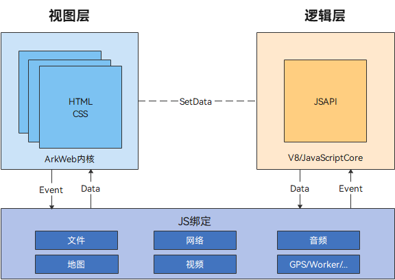

上图为具有普适性的小程序一般架构，其中逻辑层需要应用自带JavaScript运行时，本身已存在C++环境，通过native接口可直接在C++环境中完成与视图层（ArkWeb作为渲染器）的通信，无需再返回ArkTS环境调用JSBridge相关接口。
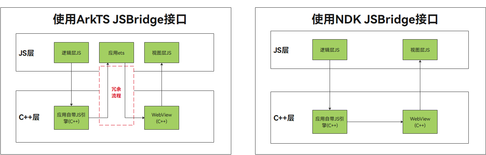
Native JSBridge方案可以解决ArkTS环境的冗余切换，同时允许回调在非UI线程上报，避免造成UI阻塞。

**案例实践**

【反例】

使用ArkTS接口实现JSBridge通信。

应用侧代码：
```typescript
import { webview } from '@kit.ArkWeb';

@Entry
@Component
struct WebComponent {
  webviewController: webview.WebviewController = new webview.WebviewController();

  aboutToAppear() {
    // 配置Web开启调试模式
    webview.WebviewController.setWebDebuggingAccess(true);
  }

  build() {
    Column() {
      Button('runJavaScript')
        .onClick(() => {
          console.info(`现在时间是:${new Date().getTime()}`)
          // 前端页面函数无参时，将param删除。
          this.webviewController.runJavaScript('htmlTest(param)');
        })
      Button('runJavaScriptCodePassed')
        .onClick(() => {
          // 传递runJavaScript侧代码方法。
          this.webviewController.runJavaScript(`function changeColor(){document.getElementById('text').style.color = 'red'}`);
        })
      Web({ src: $rawfile('index.html'), controller: this.webviewController })
    }
  }
}
```

加载的html文件：
```html
<!DOCTYPE html>
<html>
<body>
<button type="button" onclick="callArkTS()">Click Me!</button>
<h1 id="text">这是一个测试信息，默认字体为黑色，调用runJavaScript方法后字体为绿色，调用runJavaScriptCodePassed方法后字体为红色</h1>
<script>
  // 调用有参函数时实现。
  var param = "param: JavaScript Hello World!";
  function htmlTest(param) {
    document.getElementById('text').style.color = 'green';
    document.getElementById('text').innerHTML = `现在时间：${new Date().getTime()}`
    console.info(param);
  }
  // 调用无参函数时实现。
  function htmlTest() {
    document.getElementById('text').style.color = 'green';
  }
  // Click Me！触发前端页面callArkTS()函数执行JavaScript传递的代码。
  function callArkTS() {
    changeColor();
  }
</script>
</body>
</html>
```

点击runJavaScript按钮后触发h5页面htmlTest方法，使得页面内容变更为当前时间戳，如下图所示：


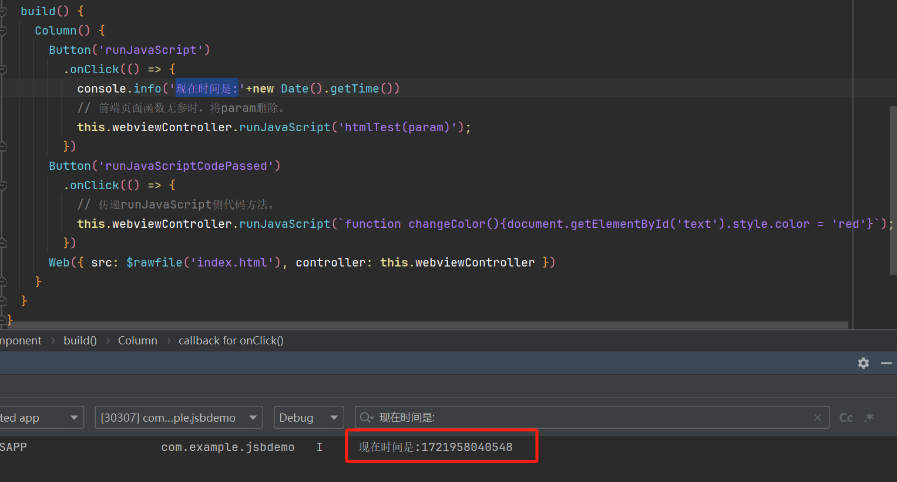

经过多轮测试，可以得出从点击原生button到h5触发htmlTest方法，耗时约7ms~9ms。

【正例】

使用NDK接口实现JSBridge通信。

应用侧代码：
```typescript
import testNapi from 'libentry.so';
import { webview } from '@kit.ArkWeb';

class testObj {
  test(): string {
    console.info('ArkUI Web Component');
    return "ArkUI Web Component";
  }

  toString(): void {
    console.info('Web Component toString');
  }
}

@Entry
@Component
struct Index {
  webTag: string = 'ArkWeb1';
  controller: webview.WebviewController = new webview.WebviewController(this.webTag);
  @State testObjtest: testObj = new testObj();

  aboutToAppear() {
    console.info("aboutToAppear")
    //初始化web ndk
    testNapi.nativeWebInit(this.webTag);
  }

  build() {
    Column() {
      Row() {
        Button('runJS hello')
          .fontSize(12)
          .onClick(() => {
            console.info(`start:---->new Date().getTime()`);
            testNapi.runJavaScript(this.webTag, "runJSRetStr(\"" + "hello" + "\")");
          })
      }.height('20%')

      Row() {
        Web({ src: $rawfile('runJS.html'), controller: this.controller })
          .javaScriptAccess(true)
          .fileAccess(true)
          .onControllerAttached(() => {
            console.info(`${this.controller.getWebId()}`);
          })
      }.height('80%')
    }
  }
}
```

hello.cpp作为应用C++侧业务逻辑代码：
```C
//注册对象及方法，发送脚本到H5执行后的回调，解析存储应用侧传过来的实例等代码逻辑这里不进行展示，开发者根据自身业务场景自行实现。

// 发送JS脚本到H5侧执行
static napi_value RunJavaScript(napi_env env, napi_callback_info info) {
    size_t argc = 2;
    napi_value args[2] = {nullptr};
    napi_get_cb_info(env, info, &argc, args, nullptr, nullptr);

    // 获取第一个参数 webTag
    size_t webTagSize = 0;
    napi_get_value_string_utf8(env, args[0], nullptr, 0, &webTagSize);
    char *webTagValue = new (std::nothrow) char[webTagSize + 1];
    size_t webTagLength = 0;
    napi_get_value_string_utf8(env, args[0], webTagValue, webTagSize + 1, &webTagLength);
    OH_LOG_Print(LOG_APP, LOG_INFO, LOG_PRINT_DOMAIN, "ArkWeb", "ndk OH_NativeArkWeb_RunJavaScript webTag:%{public}s",
                 webTagValue);

    // 获取第二个参数 jsCode
    size_t bufferSize = 0;
    napi_get_value_string_utf8(env, args[1], nullptr, 0, &bufferSize);
    char *jsCode = new (std::nothrow) char[bufferSize + 1];
    size_t byteLength = 0;
    napi_get_value_string_utf8(env, args[1], jsCode, bufferSize + 1, &byteLength);

    OH_LOG_Print(LOG_APP, LOG_INFO, LOG_PRINT_DOMAIN, "ArkWeb",
                 "ndk OH_NativeArkWeb_RunJavaScript jsCode len:%{public}zu", strlen(jsCode));

    // 构造runJS执行的结构体
    ArkWeb_JavaScriptObject object = {(uint8_t *)jsCode, bufferSize, &JSBridgeObject::StaticRunJavaScriptCallback,
                                     static_cast<void *>(jsbridge_object_ptr->GetWeakPtr())};
    controller->runJavaScript(webTagValue, &object);
    return nullptr;
}

EXTERN_C_START
static napi_value Init(napi_env env, napi_value exports) {
    napi_property_descriptor desc[] = {
        {"nativeWebInit", nullptr, NativeWebInit, nullptr, nullptr, nullptr, napi_default, nullptr},
        {"runJavaScript", nullptr, RunJavaScript, nullptr, nullptr, nullptr, napi_default, nullptr},
    };
    napi_define_properties(env, exports, sizeof(desc) / sizeof(desc[0]), desc);
    return exports;
}
EXTERN_C_END

static napi_module demoModule = {
    .nm_version = 1,
    .nm_flags = 0,
    .nm_filename = nullptr,
    .nm_register_func = Init,
    .nm_modname = "entry",
    .nm_priv = ((void *)0),
    .reserved = {0},
};

extern "C" __attribute__((constructor)) void RegisterEntryModule(void) { napi_module_register(&demoModule); }
```

Native侧业务代码entry/src/main/cpp/jsbridge_object.h、entry/src/main/cpp/jsbridge_object.cpp
详见[应用侧与前端页面的相互调用(C/C++)](../web/arkweb-ndk-jsbridge.md)

runJS.html作为应用前端页面：

```html
<!DOCTYPE html>
<html lang="en-gb">
<head>
  <meta name="viewport" content="width=device-width, initial-scale=1.0">
  <title>run javascript demo</title>
</head>
<body>
<h1>run JavaScript Ext demo</h1>
<p id="webDemo"></p>
<br>
<button type="button" style="height:30px;width:200px" onclick="testNdkProxyObjMethod1()">test ndk method1 ! </button>
<br>
<br>
<button type="button" style="height:30px;width:200px" onclick="testNdkProxyObjMethod2()">test ndk method2 ! </button>
<br>

</body>
<script type="text/javascript">

  function testNdkProxyObjMethod1() {
  
    //校验ndk方法是否已经注册到window
    if (window.ndkProxy == undefined) {
      document.getElementById("webDemo").innerHTML = "ndkProxy undefined"
      return "objName undefined"
    }

    if (window.ndkProxy.method1 == undefined) {
      document.getElementById("webDemo").innerHTML = "ndkProxy method1 undefined"
      return "objName  test undefined"
    }

    if (window.ndkProxy.method2 == undefined) {
      document.getElementById("webDemo").innerHTML = "ndkProxy method2 undefined"
      return "objName  test undefined"
    }
    
    //调用ndk注册到window的method1方法，并将结果回显到p标签
    var retStr = window.ndkProxy.method1("hello", "world", [1.2, -3.4, 123.456], ["Saab", "Volvo", "BMW", undefined], 1.23456, 123789, true, false, 0,  undefined);
    document.getElementById("webDemo").innerHTML  = "ndkProxy and method1 is ok, " + retStr;
  }
  
  function testNdkProxyObjMethod2() {
  
    //校验ndk方法是否已经注册到window
    if (window.ndkProxy == undefined) {
      document.getElementById("webDemo").innerHTML = "ndkProxy undefined"
      return "objName undefined"
    }

    if (window.ndkProxy.method1 == undefined) {
      document.getElementById("webDemo").innerHTML = "ndkProxy method1 undefined"
      return "objName  test undefined"
    }

    if (window.ndkProxy.method2 == undefined) {
      document.getElementById("webDemo").innerHTML = "ndkProxy method2 undefined"
      return "objName  test undefined"
    }

    var student = {
      name:"zhang",
      sex:"man",
      age:25
    };
    var cars = [student, 456, false, 4.567];
    let params = "[\"{\\\"scope\\\"]";

    //调用ndk注册到window的method2方法，并将结果回显到p标签
    var retStr = window.ndkProxy.method2("hello", "world", false, cars, params);
    document.getElementById("webDemo").innerHTML  = "ndkProxy and method2 is ok, " + retStr;
  }
  
  function runJSRetStr(data) {
    const d = new Date();
    let time = d.getTime();
    document.getElementById("webDemo").innerHTML = new Date().getTime()
    return JSON.stringify(time)
  }
</script>
</html>
```

点击runJS hello按钮后触发h5页面runJSRetStr方法，使得页面内容变更为当前时间戳。


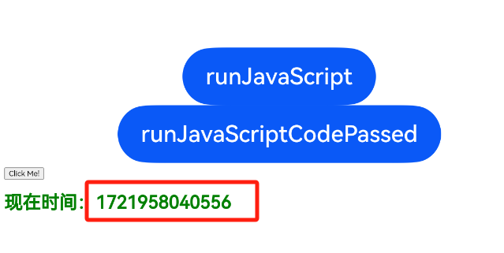

经过多轮测试，可以得出从点击原生button到h5触发runJSRetStr方法，耗时约2ms~6ms。


**总结**

| **通信方式**            | **耗时(局限不同设备和场景，数据仅供参考)** | **说明**            |
|---------------------|--------------------------|-------------------|
| ArkWeb实现与前端页面通信     | 7ms~9ms                  | ArkTS环境冗余切换,耗时较长  |
| ArkWeb、c++实现与前端页面通信 | 2ms~6ms                  | 避免ArkTS环境冗余切换，耗时短 |

JSBridge优化方案适用于ArkWeb应用侧与前端网页通信场景，开发者可根据应用架构选择合适的业务通信机制：

1.应用使用ArkTS语言开发，推荐使用ArkWeb在ArkTS提供的runJavaScriptExt接口实现应用侧至前端页面的通信，同时使用registerJavaScriptProxy实现前端页面至应用侧的通信。

2.应用使用ArkTS、C++语言混合开发，或本身应用结构较贴近于小程序架构，自带C++侧环境，推荐使用ArkWeb在NDK侧提供的OH_NativeArkWeb_RunJavaScript及OH_NativeArkWeb_RegisterJavaScriptProxy接口实现JSBridge功能。

> 说明
> 开发者需根据当前业务区分是否存在C++侧环境（较为显著标志点为当前应用是否使用了Node API技术进行开发，若是则该应用具备C++侧环境）。
> 具备C++侧环境的应用开发，可使用ArkWeb提供的NDK侧JSBridge接口。
> 不具备C++侧环境的应用开发，可使用ArkWeb侧JSBridge接口。


### 异步JSBridge调用

**原理介绍**

异步JSBridge调用适用于H5侧调用原生或C++侧注册得JSBridge函数场景下，将用户指定的JSBridge接口的调用抛出后，不等待执行结果，
以避免在ArkUI主线程负载重时JSBridge同步调用可能导致Web线程等待IPC时间过长，从而造成阻塞的问题。

**实践案例**

使用ArkTS接口实现JSBridge通信

【案例一】

步骤1.只注册同步函数
```typescript
import webview from '@ohos.web.webview';
import { BusinessError } from '@kit.BasicServicesKit';

// 定义ETS侧对象及函数
class TestObj {
  test(testStr:string): string {
    let start = Date.now();
    // 模拟耗时操作
    for(let i = 0; i < 500000; i++) {}
    let end = Date.now();
    console.info('objName.test start: ' + start);
    return 'objName.test Sync function took ' + (end - start) + 'ms';
  }
  asyncTestBool(testBol:boolean): Promise<string> {
    return new Promise((resolve, reject) => {
      let start = Date.now();
      // 模拟耗时操作（异步）
      setTimeout(() => {
        for(let i = 0; i < 500000; i++) {}
        let end = Date.now();
        console.info('objAsyncName.asyncTestBool start: ' + start);
        resolve('objName.asyncTestBool Async function took ' + (end - start) + 'ms');
      }, 0); // 使用0毫秒延迟来模拟立即开始的异步操作
    });
  }
}

class WebObj {
  webTest(): string {
    let start = Date.now();
    // 模拟耗时操作
    for(let i = 0; i < 500000; i++) {}
    let end = Date.now();
    console.info('objTestName.webTest start: ' + start);
    return 'objTestName.webTest Sync function took ' + (end - start) + 'ms';
  }
  webString(): string {
    let start = Date.now();
    // 模拟耗时操作
    for(let i = 0; i < 500000; i++) {}
    let end = Date.now();
    console.info('objTestName.webString start: ' + start);
    return 'objTestName.webString Sync function took ' + (end - start) + 'ms'
  }
}

class AsyncObj {

  asyncTest(): Promise<string> {
    return new Promise((resolve, reject) => {
      let start = Date.now();
      // 模拟耗时操作（异步）
      setTimeout(() => {
        for (let i = 0; i < 500000; i++) {
        }
        let end = Date.now();
        console.info('objAsyncName.asyncTest start: ' + start);
        resolve('objAsyncName.asyncTest Async function took ' + (end - start) + 'ms');
      }, 0); // 使用0毫秒延迟来模拟立即开始的异步操作
    });
  }

  asyncString(testStr:string): Promise<string> {
    return new Promise((resolve, reject) => {
      let start = Date.now();
      // 模拟耗时操作（异步）
      setTimeout(() => {
        for (let i = 0; i < 500000; i++) {
        }
        let end = Date.now();
        console.info('objAsyncName.asyncString start: ' + start);
        resolve('objAsyncName.asyncString Async function took ' + (end - start) + 'ms');
      }, 0); // 使用0毫秒延迟来模拟立即开始的异步操作
    });
  }
}

@Entry
@Component
struct Index {
  controller: webview.WebviewController = new webview.WebviewController();
  @State testObjtest: TestObj = new TestObj();
  @State webTestObj: WebObj = new WebObj();
  @State asyncTestObj: AsyncObj = new AsyncObj();
  build() {
    Column() {
      Button('refresh')
        .onClick(()=>{
          try{
            this.controller.refresh();
          } catch (error) {
            console.error(`ErrorCode:${(error as BusinessError).code},Message:${(error as BusinessError).message}`)
          }
        })
      Button('Register JavaScript To Window')
        .onClick(()=>{
          try {
            //只注册同步函数
            this.controller.registerJavaScriptProxy(this.webTestObj,"objTestName",["webTest","webString"]);
          } catch (error) {
            console.error(`ErrorCode:${(error as BusinessError).code},Message:${(error as BusinessError).message}`)
          }
        })
      Web({src: $rawfile('index.html'),controller: this.controller}).javaScriptAccess(true)
    }
  }
}
```

步骤2.H5侧调用JSBridge函数
```html
<!DOCTYPE html>
<html lang="en">
<head>
  <meta charset="UTF-8">
  <meta name="viewport" content="width=device-width, initial-scale=1.0">
  <title>Document</title>
</head>
<body>
<button type="button" onclick="htmlTest()"> Click Me!</button>
<p id="demo"></p>
<p id="webDemo"></p>
<p id="asyncDemo"></p>
</body>
<script type="text/javascript">
  async function htmlTest() {
    document.getElementById("demo").innerHTML = `测试开始:${new Date().getTime()}\n`;

    const time1 = new Date().getTime()
    objTestName.webString();
    const time2 = new Date().getTime()

    objAsyncName.asyncString()
    const time3 = new Date().getTime()

    objName.asyncTestBool()
    const time4 = new Date().getTime()

    objName.test();
    const time5 = new Date().getTime()

    objTestName.webTest();
    const time6 = new Date().getTime()
    objAsyncName.asyncTest()
    const time7 = new Date().getTime()

    const result = [
      'objTestName.webString()耗时：'+ (time2 - time1),
      'objAsyncName.asyncString()耗时：'+ (time3 - time2),
      'objName.asyncTestBool()耗时：'+ (time4 - time3),
      'objName.test()耗时：'+ (time5 - time4),
      'objTestName.webTest()耗时：'+ (time6 - time5),
      'objAsyncName.asyncTest()耗时：'+ (time7 - time6),
    ]
    document.getElementById("demo").innerHTML = document.getElementById("demo").innerHTML + '\n' + result.join('\n')
  }
</script>
</html>
```

【案例二】

步骤1.使用registerJavaScriptProxy或javaScriptProxy注册异步函数或异步同步共存
```typescript
// registerJavaScriptProxy方式注册
Button('refresh')
  .onClick(()=>{
    try{
      this.controller.refresh();
    } catch (error) {
      console.error(`ErrorCode:${(error as BusinessError).code},Message:${(error as BusinessError).message}`)
    }
  })
Button('Register JavaScript To Window')
  .onClick(()=>{
    try {
      //调用注册接口对象及成员函数，其中同步函数列表必填，空白则需要用[]占位；异步函数列表非必填
      //同步、异步函数都注册
      this.controller.registerJavaScriptProxy(this.testObjtest,"objName",["test"],["asyncTestBool"]);
      //只注册异步函数，同步函数列表处留空
      this.controller.registerJavaScriptProxy(this.asyncTestObj,"objAsyncName",[],["asyncTest","asyncString"]);
    } catch (error) {
      console.error(`ErrorCode:${(error as BusinessError).code},Message:${(error as BusinessError).message}`)
    }
  })
Web({src: $rawfile('index.html'),controller: this.controller}).javaScriptAccess(true)

//javaScriptProxy方式注册
//javaScriptProxy只支持注册一个对象，若需要注册多个对象请使用registerJavaScriptProxy
Web({src: $rawfile('index.html'),controller: this.controller})
  .javaScriptAccess(true)
  .javaScriptProxy({
    object: this.testObjtest,
    name:"objName",
    methodList: ["test","toString"],
    //指定异步函数列表
    asyncMethodList: ["test","toString"],
    controller: this.controller
  })
```

步骤2.H5侧调用JSBridge函数与反例中一致

**总结**

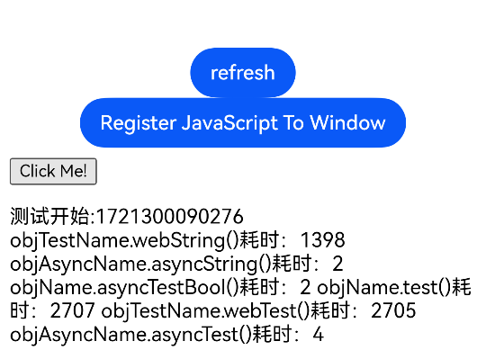

| **注册方法类型** | **耗时(局限不同设备和场景，数据仅供参考)** | **说明**        |
|------------|--------------------------|---------------|
| 同步方法       | 1398ms，2707ms，2705ms     | 同步函数调用会阻塞JS线程 |
| 异步方法       | 2ms，2ms，4ms              | 异步函数调用不阻塞JS线程 |

通过截图可看到async的异步方法不需要等待结果，所以在JS单线程任务队列中不会长时间占用，同步任务需要等待原生主线程同步执行后返回结果。

>JSBridge接口在注册时，即会根据注册调用的接口决定其调用方式（同步/异步）。开发者需根据当前业务区分，
> 是否将其注册为异步函数。
>- 同步函数调用将会阻塞JS的执行，等待调用的JSBridge函数执行结束，适用于需要返回值，或者有时序问题等场景。
>- 异步函数调用时不会等待JSBridge函数执行结束，后续JS可在短时间后继续执行。但JSBridge函数无法直接返回值。
>- 注册在ETS侧的JSBridge函数调用时需要在主线程上执行；NDK侧注册的函数将在其他线程中执行。
>- 异步JSBridge接口与同步接口在JS侧的调用方式一致，仅注册方式不同，本部分调用方式仅作简要示范。

附NDK接口实现JSBridge通信(C++侧注册异步函数):
```c
// 定义JSBridge函数
static void ProxyMethod1(const char* webTag, void* userData) {
    OH_LOG_Print(LOG_APP, LOG_INFO, LOG_PRINT_DOMAIN, "ArkWeb", "Method1 webTag :%{public}s",webTag);
}

static void ProxyMethod2(const char* webTag, void* userData) {
    OH_LOG_Print(LOG_APP, LOG_INFO, LOG_PRINT_DOMAIN, "ArkWeb", "Method2 webTag :%{public}s",webTag);
}

static void ProxyMethod3(const char* webTag, void* userData) {
    OH_LOG_Print(LOG_APP, LOG_INFO, LOG_PRINT_DOMAIN, "ArkWeb", "Method3 webTag :%{public}s",webTag);
}

void RegisterCallback(const char *webTag) {
    int myUserData = 100;
    //创建函数方法结构体
    ArkWeb_ProxyMethod m1 = {
        .methodName = "method1",
        .callback = ProxyMethod1,
        .userData = (void *)&myUserData
    };
    ArkWeb_ProxyMethod m2 = {
        .methodName = "method2",
        .callback = ProxyMethod2,
        .userData = (void *)&myUserData
    };
    ArkWeb_ProxyMethod m3 = {
        .methodName = "method3",
        .callback = ProxyMethod3,
        .userData = (void *)&myUserData
    };
    ArkWeb_ProxyMethod methodList[2] = {m1,m2};
    
    //创建JSBridge对象结构体
    ArkWeb_ProxyObject obj = {
        .objName = "ndkProxy",
        .methodList = methodList,
        .size = 2,
    };
    // 获取ArkWeb_Controller API结构体
    ArkWeb_AnyNativeAPI* apis = OH_ArkWeb_GetNativeAPI(ArkWeb_NativeAPIVariantKind::ARKWEB_NATIVE_CONTROLLER);
    ArkWeb_ControllerAPI* ctrlApi = reinterpret_cast<ArkWeb_ControllerAPI*>(apis);
    
        // 调用注册接口，注册函数
        ctrlApi->registerJavaScriptProxy(webTag, &obj);
    
    ArkWeb_ProxyMethod asyncMethodList[1] = {m3};
    ArkWeb_ProxyObject obj2 = {
        .objName = "ndkProxy",
    .methodList = asyncMethodList,
    .size = 1,
    };
    ctrlApi->registerAsyncJavaScriptProxy(webTag, &obj2)
}
```


### 预编译JavaScript生成字节码缓存（Code Cache）

**原理介绍**

预编译JavaScript生成字节码缓存适用于在页面加载之前提前将即将使用到的JavaScript文件编译成字节码并缓存到本地，在页面首次加载时节省编译时间。

开发者需要创建一个无需渲染的离线Web组件，用于进行预编译，在预编译结束后使用其他Web组件加载对应的业务网页。

注意事项：

1. 仅使用HTTP或HTTPS协议请求的JavaScript文件可以进行预编译操作。
2. 不支持使用了ES6 Module的语法的JavaScript文件生成预编译字节码缓存。
3. 通过配置参数中响应头中的E-Tag、Last-Modified对应的值标记JavaScript对应的缓存版本，对应的值发生变动则更新字节码缓存。
4. 不支持本地JavaScript文件预编译缓存。

**实践案例**

【不推荐用法】

在未使用预编译JavaScript前提下，启动加载Web页面

```typescript
import web_webview from '@ohos.web.webview';

@Entry
@Component
struct Index {
  controller: web_webview.WebviewController = new web_webview.WebviewController();

  build() {
    Column() {
      // 在适当的时机加载业务用Web组件，本例以Button点击触发为例
      Button('加载页面')
        .onClick(() => {
          // url请替换为真实地址
          this.controller.loadUrl('https://www.example.com/b.html');
        })
      Web({ src: 'https://www.example.com/a.html', controller: this.controller })
        .fileAccess(true)
        .onPageBegin((event) => {
          console.info(`load page begin: ${event?.url}`);
        })
        .onPageEnd((event) => {
          console.info(`load page end: ${event?.url}`);
        })
    }
  }
}
```

点击“加载页面”按钮，性能打点数据如下，getMessageData进程中的Duration为加载页面开始到结束的耗时：

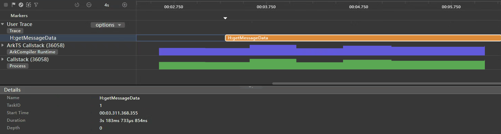


【推荐用法】

使用预编译JavaScript生成字节码缓存，具体步骤如下：

1. 配置预编译的JavaScript文件信息

```typescript
import { webview } from '@kit.ArkWeb';

interface Config {
  url: string,
  localPath: string, // 本地资源路径
  options: webview.CacheOptions
}

@Entry
@Component
struct Index {
  // 配置预编译的JavaScript文件信息
  configs: Array<Config> = [
    {
      url: 'https://www/example.com/example.js',
      localPath: 'example.js',
      options: {
        responseHeaders: [
          { headerKey: 'E-Tag', headerValue: 'aWO42N9P9dG/5xqYQCxsx+vDOoU=' },
          { headerKey: 'Last-Modified', headerValue: 'Web, 21 Mar 2024 10:38:41 GMT' }
        ]
      }
    }
  ]
  // ...
}
```

2. 读取配置，进行预编译

```typescript
Web({ src: 'https://www.example.com/a.html', controller: this.controller })
  .onControllerAttached(async () => {
    // 读取配置，进行预编译
    for (const config of this.configs) {
      let content = await getContext().resourceManager.getRawFileContentSync(config.localPath);

      try {
        this.controller.precompileJavaScript(config.url, content, config.options)
          .then((errCode: number) => {
            console.info('precompile successfully!' );
          }).catch((errCode: number) => {
          console.error('precompile failed.' + errCode);
        })
      } catch (err) {
        console.error('precompile failed!.' + err.code + err.message);
      }
    }
  })
```


点击“加载页面”按钮，性能打点数据如下，getMessageData进程中的Duration为加载页面开始到结束的耗时：

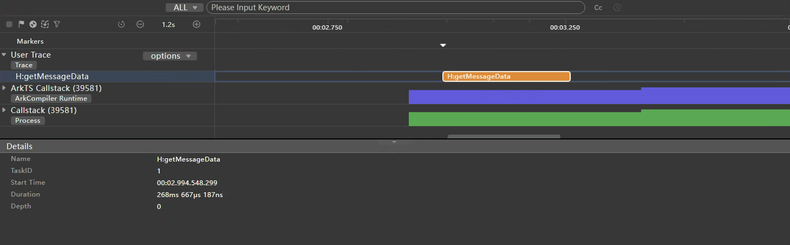


> 说明
>
> 当需要更新本地已经生成的编译字节码时，修改cacheOptions参数中的responseHeaders中的E-Tag或Last-Modified响应头对应的值，再次调用接口即可。


**总结**

| **页面加载方式** | **耗时(局限不同设备和场景，数据仅供参考)**  | **说明** |
| ------ | ------- | ------------------------------------- |
| 直接加载Web页面  | 3183ms | 在触发页面加载时才进行JavaScript编译，增加加载时间 |
| 预编译JavaScript生成字节码缓存  | 268ms | 加载页面前完成预编译JavaScript，节省了跳转页面首次加载的编译时间 |


### 支持自定义协议的JavaScript生成字节码缓存（Code Cache）

**原理介绍**

支持自定义协议的JavaScript生成字节码缓存适用于在页面加载时存在自定义协议的JavaScript文件，支持其生成字节码缓存到本地，在页面非首次加载时节省编译时间。具体操作步骤如下：

1. 开发者首先需要在Web组件运行前，向Web组件注册自定义协议。

2. 其次需要拦截自定义协议的JavaScript，设置ResponseData和ResponseDataID，ResponseData为JavaScript内容，ResponseDataID用于区分JavaScript内容是否发生变更。若JavaScript内容变更，ResponseDataID需要一起变更。


**实践案例**

**场景一 调用ArkTS接口， webview.WebviewController.customizeSchemes(schemes: Array\<WebCustomScheme>): void**

【不推荐用法】

直接加载包含自定义协议的JavaScript的Web页面

```typescript
// xxx.ets
import { webview } from '@kit.ArkWeb';
import { BusinessError } from '@kit.BasicServicesKit';

@Entry
@Component
struct Index {
  controller: webview.WebviewController = new webview.WebviewController();
  // 创建scheme对象，isCodeCacheSupported为false时不支持自定义协议的JavaScript生成字节码缓存
  scheme: webview.WebCustomScheme = { schemeName: 'scheme', isSupportCORS: true, isSupportFetch: true, isCodeCacheSupported: false };
  // 请求数据
  @State jsData: string = 'xxx';

  aboutToAppear(): void {
    try {
      webview.WebviewController.customizeSchemes([this.scheme]);
    } catch (error) {
      const e: BusinessError = error as BusinessError;
      console.error(`ErrorCode: ${e.code}, Message: ${e.message}`);
    }
  }
  build() {
    Column({ space: 10 }) {
      Flex({ direction: FlexDirection.Column, alignItems: ItemAlign.Center, justifyContent: FlexAlign.Center }) {
        Web({
          // 需将'https://www.example.com/'替换为真是的包含自定义协议的JavaScript的Web页面地址
          src: 'https://www.example.com/',
          controller: this.controller
        })
          .fileAccess(true)
          .javaScriptAccess(true)
          .onInterceptRequest(event => {
            const responseResource: WebResourceResponse = new WebResourceResponse();
            // 拦截页面请求
            if (event?.request.getRequestUrl() === 'scheme1://www.example.com/test.js') {
              responseResource.setResponseHeader([
                {
                  headerKey: 'ResponseDataId',
                  // 格式：不超过13位的纯数字。JS识别码，JS有更新时必须更新该字段
                  headerValue: '0000000000001'
                }
              ]);
              responseResource.setResponseData(this.jsData);
              responseResource.setResponseEncoding('utf-8');
              responseResource.setResponseMimeType('application/javascript');
              responseResource.setResponseCode(200);
              responseResource.setReasonMessage('OK');
              return responseResource;
            }
            return null;
          })
      }
    }
  }
}
```

性能打点数据如下，getMessageData进程中的Duration为加载页面开始到结束的耗时：

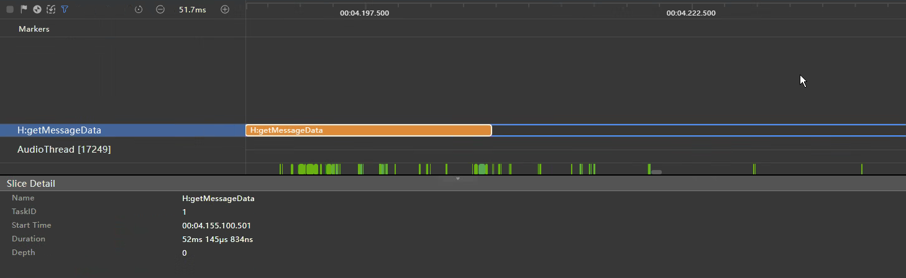


【推荐用法】

支持自定义协议JS生成字节码缓存，具体步骤如下：

1. 将scheme对象属性isCodeCacheSupported设置为true，支持自定义协议的JavaScript生成字节码缓存。

```typescript
scheme: webview.WebCustomScheme = { schemeName: 'scheme', isSupportCORS: true, isSupportFetch: true, isCodeCacheSupported: true };
```

2. 在Web组件运行前，向Web组件注册自定义协议。

> 说明
> 不得与Web内核内置协议相同。

```typescript
// xxx.ets
aboutToAppear(): void {
  try {
    webview.WebviewController.customizeSchemes([this.scheme]);
  } catch (error) {
    const e: BusinessError = error as BusinessError;
    console.error(`ErrorCode: ${e.code}, Message: ${e.message}`);
  }
}
```

3. 拦截自定义协议的JavaScript，设置ResponseData和ResponseDataID。ResponseData为JS内容，ResponseDataID用于区分JS内容是否发生变更。

> 说明
> 若JS内容变更，ResponseDataID需要一起变更。

```typescript
// xxx.ets
Web({
  // 需将'https://www.example.com/'替换为真是的包含自定义协议的JavaScript的Web页面地址
  src: 'https://www.example.com/',
  controller: this.controller
})
  .fileAccess(true)
  .javaScriptAccess(true)
  .onInterceptRequest(event => {
    const responseResource: WebResourceResponse = new WebResourceResponse();
    // 拦截页面请求
    if (event?.request.getRequestUrl() === 'scheme1://www.example.com/test.js') {
      responseResource.setResponseHeader([
        {
          headerKey: 'ResponseDataId',
          // 格式：不超过13位的纯数字。JS识别码，JS有更新时必须更新该字段
          headerValue: '0000000000001'
        }
      ]);
      responseResource.setResponseData(this.jsData2);
      responseResource.setResponseEncoding('utf-8');
      responseResource.setResponseMimeType('application/javascript');
      responseResource.setResponseCode(200);
      responseResource.setReasonMessage('OK');
      return responseResource;
    }
    return null;
  })
```

性能打点数据如下，getMessageData进程中的Duration为加载页面开始到结束的耗时：

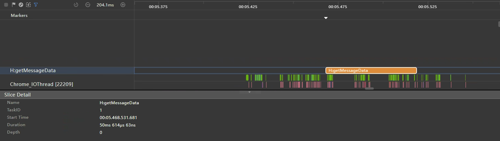


**场景二 调用Native接口，int32_t OH_ArkWeb_RegisterCustomSchemes(const char * scheme, int32_t option)**

【不推荐用法】

通过网络拦截接口对Web组件发出的请求进行拦截，Demo工程构建请参考[拦截Web组件发起的网络请求](../web/web-scheme-handler.md)


性能打点数据如下，getMessageData进程中的Avg Wall Duration为两次加载页面开始到结束的平均耗时：

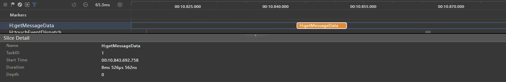


【推荐用法】

支持将自定义协议的JavaScript资源生成code cache，具体步骤如下：

1. 注册三方协议配置时，传入ARKWEB_SCHEME_OPTION_CODE_CACHE_ENABLED参数。

```c
// 注册三方协议的配置，需要在Web内核初始化之前调用，否则会注册失败。
static napi_value RegisterCustomSchemes(napi_env env, napi_callback_info info)
{
  OH_LOG_INFO(LOG_APP, "register custom schemes");
  OH_ArkWeb_RegisterCustomSchemes("custom", ARKWEB_SCHEME_OPTION_STANDARD | ARKWEB_SCHEME_OPTION_CORS_ENABLED | ARKWEB_SCHEME_OPTION_CODE_CACHE_ENABLED);
  return nullptr;
}
```

2. 设置ResponsesDataId。

```c
// 在worker线程中读取rawfile，并通过ResourceHandler返回给Web内核
void RawfileRequest::ReadRawfileDataOnWorkerThread() {
    // ...
    if ('test-cc.js' == rawfilePath()) {
        OH_ArkWebResponse_SetHeaderByName(response(), "ResponseDataID", "0000000000001", true);
    }
    OH_ArkWebResponse_SetCharset(response(), "UTF-8");
}
```

3. 注册三方协议的配置，设置SchemeHandler。

```typescript
// EntryAbility.ets
import { UIAbility, AbilityConstant, Want } from '@kit.AbilityKit';
import { webview } from '@kit.ArkWeb';
import { window } from '@kit.ArkUI';
import testNapi from 'libentry.so';

export default class EntryAbility extends UIAbility {
  onCreate(want: Want, launchParam: AbilityConstant.LaunchParam): void {
    // 注册三方协议的配置
    testNapi.registerCustomSchemes();
    // 初始化Web组件内核，该操作会初始化Brownser进程以及创建BrownserContext
    webview.WebviewController.initializeWebEngine();
    // 设置SchemeHandler
    testNapi.setSchemeHandler();
  }
  // ...
}
```


性能打点数据如下，getMessageData进程中的Avg Wall Duration为两次加载页面开始到结束的平均耗时：

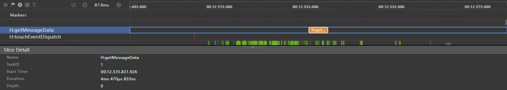


**总结(以Native接口性能数据举例)**

| **页面加载方式** | **耗时(局限不同设备和场景，数据仅供参考)**  | **说明** |
| ------ | ------- | ------------------------------------- |
| 直接加载Web页面  | 8ms | 在触发页面加载时才进行JavaScript编译，增加加载时间 |
| 自定义协议的JavaScript生成字节码缓存  | 4ms | 支持自定义协议头的JS文件在第二次加载JS时生成code cache,节约了第三次及之后的页面加载或跳转的自定义协议JS文件的编译时间，提升了页面加载和跳转的性能 |


### 离线资源免拦截注入

**原理介绍**

离线资源免拦截注入适用于在页面加载之前提前将即将使用到的图片、样式表和脚本资源注入到内存缓存中，在页面首次加载时节省网络请求时间。

注意事项：

1. 开发者需创建一个无需渲染的离线Web组件，用于将资源注入到内存缓存中，使用其他Web组件加载对应的业务网页。
2. 仅使用HTTP或HTTPS协议请求的资源可被注入进内存缓存。
3. 内存缓存中的资源由内核自动管理，当注入的资源过多导致内存压力过大，内核自动释放未使用的资源，应避免注入大量资源到内存缓存中。
4. 正常情况下，资源的有效期由提供的Cache-Control或Expires响应头控制其有效期，默认的有效期为86400秒，即1天。
5. 资源的MIMEType通过提供的参数中的Content-Type响应头配置，Content-Type需符合标准，否则无法正常使用，MODULE_JS必须提供有效的MIMEType，其他类型可不提供。
6. 仅支持通过HTML中的标签加载。
7. 如果业务网页中的script标签使用了crossorigin属性，则必须在接口的responseHeaders参数中设置Cross-Origin响应头的值为anoymous或use-credentials。
8. 当调用web_webview.WebviewController.SetRenderProcessMode(web_webview.RenderProcessMode.MULTIPLE)接口后，应用会启动多渲染进程模式，此方案在此场景下不会生效。
9. 单次调用最大支持注入30个资源，单个资源最大支持10Mb。


**实践案例**

【不推荐用法】

直接加载Web页面

```typescript
import webview from '@ohos.web.webview';

@Entry
@Component
struct Index {
  controller: webview.WebviewController = new webview.WebviewController();

  build() {
    Column() {
      // 在适当的时机加载业务用Web组件，本例以Button点击触发为例
      Button('加载页面')
        .onClick(() => {
          this.controller.loadUrl('https://www.example.com/b.html');
        })
      Web({ src: 'https://www.example.com/a.html', controller: this.controller })
        .fileAccess(true)
    }
  }
}
```

性能打点数据如下，getMessageData进程中的Duration为加载页面开始到结束的耗时：

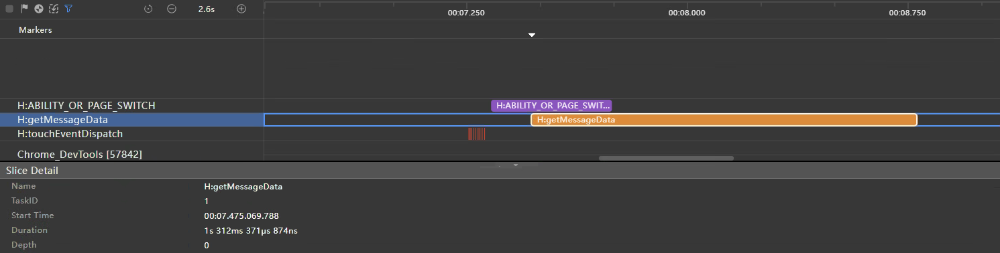


【推荐用法】

使用资源免拦截注入加载Web页面，请参考以下步骤：

1. 创建资源配置

```typescript
interface ResourceConfig {
  urlList: Array<string>;
  type: webview.OfflineResourceType;
  responseHeaders: Array<Header>;
  localPath: string; // 本地资源存放在rawfile目录下的路径
}

const configs: Array<ResourceConfig> = [
  {
    localPath: 'example.png',
    urlList: [
      // 多url场景，第一个url作为资源的源
      'https://www.example.com/',
      'https://www.example.com/path1/example.png',
      'https://www.example.com/path2/example.png'
    ],
    type: webview.OfflineResourceType.IMAGE,
    responseHeaders: [
      { headerKey: 'Cache-Control', headerValue: 'max-age=1000' },
      { headerKey: 'Content-Type', headerValue: 'image/png' }
    ]
  },
  {
    localPath: 'example.js',
    urlList: [
      // 仅提供一个url，这个url既作为资源的源，也作为资源的网络请求地址
      'https://www.example.com/example.js'
    ],
    type: webview.OfflineResourceType.CLASSIC_JS,
    responseHeaders: [
      // 以<script crossorigin='anonymous'/>方式使用，提供额外的响应头
      { headerKey: 'Cross-Origin', headerValue: 'anonymous' }
    ]
  }
];

```

2. 读取配置，注入资源

```typescript
Web({ src: 'https://www.example.com/a.html', controller: this.controller })
  .onControllerAttached(async () => {
    try {
      const resourceMapArr: Array<webview.OfflineResourceMap> = [];
      // 读取配置，从rawfile目录中读取文件内容
      for (const config of this.configs) {
        const buf: Uint8Array = await getContext().resourceManager.getRawFileContentSync(config.localPath);
        resourceMapArr.push({
          urlList: config.urlList,
          resource: buf,
          responseHeaders: config.responseHeaders,
          type: config.type
        });
      }
      // 注入资源
      this.controller.injectOfflineResources(resourceMapArr);
    } catch (err) {
      console.error('error: ' + err.code + ' ' + err.message);
    }
  })
```

性能打点数据如下，getMessageData进程中的Duration为加载页面开始到结束的耗时：

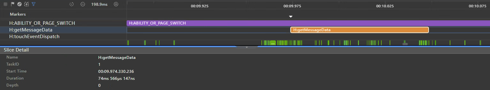

**总结**

| **页面加载方式** | **耗时(局限不同设备和场景，数据仅供参考)**  | **说明** |
| ------ | ------- | ------------------------------------- |
| 直接加载Web页面  | 1312ms | 在触发页面加载时才发起资源请求，增加页面加载时间 |
| 使用离线资源免拦截注入加载Web页面  | 74ms | 将资源预置在内存中，节省了网络请求时间 |


### 资源拦截替换加速

**原理介绍**

资源拦截替换加速在原本的资源拦截替换接口基础上新增支持了ArrayBuffer格式的入参，开发者无需在应用侧进行ArrayBuffer到String格式的转换，可直接使用ArrayBuffer格式的数据进行拦截替换。

> 说明
>
> 本方案与原本的资源拦截替换接口在使用上没有任何区别，开发者仅需在调用WebResourceResponse.setResponseData()接口时传入ArrayBuffer格式的数据即可。


**实践案例**

【不推荐用法】

使用字符串格式的数据做拦截替换

```typescript
import webview from '@ohos.web.webview';

@Entry
@Component
struct Index {
  controller: webview.WebviewController = new webview.WebviewController();
  responseResource: WebResourceResponse = new WebResourceResponse();
  // 这里是string格式数据
  resourceStr: string = 'xxxxxxxxxxxxxxx';

  build() {
    Column() {
      Web({ src: 'https:www.example.com/test.html', controller: this.controller })
        .onInterceptRequest(event => {
          if (event) {
            if (!event.request.getRequestUrl().startsWith('https://www.example.com/')) {
              return null;
            }
          }
          // 使用string格式的数据做拦截替换
          this.responseResource.setResponseData(this.resourceStr);
          this.responseResource.setResponseEncoding('utf-8');
          this.responseResource.setResponseMimeType('text/json');
          this.responseResource.setResponseCode(200);
          this.responseResource.setReasonMessage('OK');
          this.responseResource.setResponseHeader([{ headerKey: 'Access-Control-Allow-Origin', headerValue: '*' }]);
          return this.responseResource;
        })
    }
  }
}
```

资源替换耗时如图所示，getMessageData ... someFunction took后的时间页面加载资源的耗时：


【推荐用法】

使用ArrayBuffer格式的数据做拦截替换

```typescript
import webview from '@ohos.web.webview';

@Entry
@Component
struct Index {
  controller: webview.WebviewController = new webview.WebviewController();
  responseResource: WebResourceResponse = new WebResourceResponse();
  // 这里是ArrayBuffer格式数据
  buffer: ArrayBuffer = new ArrayBuffer(10);

  build() {
    Column() {
      Web({ src: 'https:www.example.com/test.html', controller: this.controller })
        .onInterceptRequest(event => {
          if (event) {
            if (!event.request.getRequestUrl().startsWith('https://www.example.com/')) {
              return null;
            }
          }
          // 使用ArrayBuffer格式的数据做拦截替换
          this.responseResource.setResponseData(this.buffer);
          this.responseResource.setResponseEncoding('utf-8');
          this.responseResource.setResponseMimeType('text/json');
          this.responseResource.setResponseCode(200);
          this.responseResource.setReasonMessage('OK');
          this.responseResource.setResponseHeader([{ headerKey: 'Access-Control-Allow-Origin', headerValue: '*' }]);
          return this.responseResource;
        })
    }
  }
}
```

资源替换耗时如图所示，getMessageData william someFunction took后的时间页面加载资源的耗时：

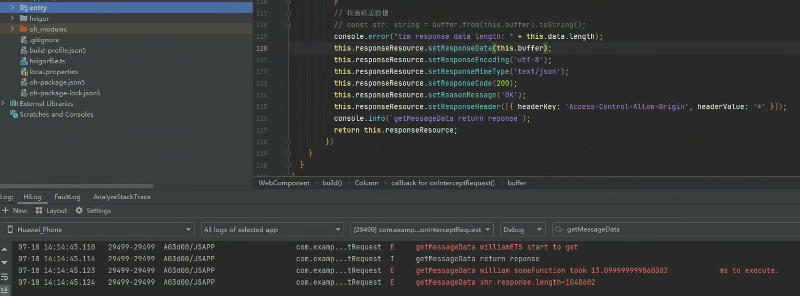


**总结**


| **页面加载方式** | **耗时(局限不同设备和场景，数据仅供参考)**  | **说明** |
| ------ | ------- | ------------------------------------- |
| 使用string格式的数据做拦截替换  | 34ms | Web组件内部数据传输仍需要转换为ArrayBuffer，增加数据处理步骤，增加启动耗时 |
| 使用ArrayBuffer格式的数据做拦截替换  | 13ms | 接口直接支持ArrayBuffer格式，节省了转换时间，同时对ArrayBuffer格式的数据传输方式进行了优化，进一步减少耗时 |

### 预加载优化滑动白块

Web场景应用在加载图片资源时，需要先发起请求，然后解析渲染到屏幕上。在列表滑动过程中，如果等屏幕可视区域出现新图片时才开始发起请求，会因上述加载资源的步骤出现时间差，导致列表中图片出现白块问题，在网络情况不良或应用渲染图片阻塞时，这种情况会更加严重。本章节针对Web场景，在HTML页面中使用预加载策略，使列表滑动前预先加载可视区域外的图片资源，解决可视区域白块问题，提高用户使用体验。

**原理介绍**

滑动白块的产生主要来源于页面滑动场景组件可见和组件上屏刷新之间的时间差，在这两个时间点间，由于网络图片未加载完成，该区域显示的是默认图片即图片白块。图片组件从可见到上屏刷新之间的耗时主要是由图片资源网络请求和解码渲染两部分组成，在这段时间内页面滑动距离是滑动速度(px/ms)*(下载耗时+解码耗时)(ms)，因此只要设置预加载的高度大于滑动距离，就可以保证页面基本无白块。开发者可根据`预加载高度(px)>滑动速度(px/ms)*(下载耗时+解码耗时)(ms)`这一计算公式对应用进行调整，计算出Web页面在设备视窗外需要预加载的图片个数，即可视窗口根元素超过屏幕的高度。

开发者可以使用IntersectionObserver接口，将视窗作为根元素并对其进行观察，当图片滑动进入视窗时替换默认地址为真实地址，触发图片加载。此时适当的扩展视窗高度，就可以实现在图片进入视窗前提前开始加载图片，解决图片未及时加载导致出现白块的问题。

**实践案例**

【不推荐用法】

常规案例使用懒加载的逻辑加载图片，图片组件进入可视区域后再执行加载，滑动过程中列表有大量图片未加载完成产生的白块。


```html
<!DOCTYPE html>
<html>
    <head>
        <title>Image List</title>
    </head>
    <body>
        <ul>
            <li></li>
            <li></li>
            <li></li>
            <li></li>
            <li></li>
            <!-- 添加更多的图片只需要复制并修改src和alt属性即可 -->
        </ul>
    </body>
    <script>
        window.onload = function(){
          // 可视窗口作为根元素，不进行扩展
          const options = {root:document,rootMargin:'0% 0% 0% 0%'}
          // 创建一个IntersectionObserver实例
          const observer = new IntersectionObserver(function(entries,observer){
            entries.forEach(function(entry){
              // 检查图片是否进入可视区域
              if(entry.isIntersecting){
                const image = entry.target;
                // 将数据源的src赋值给img的src
                image.src = image.dataset.src;
                // 停止观察该图片
                observer.unobserve(image);
              }
            })
          },options);
          
          document.querySelectorAll('img').forEach(img => { observer.observe(img) });
        }
    </script>
</html>
```

【推荐用法】

根据上方公式，优化案例设定在400mm/s的速度滑动屏幕，此时可计算应用需预加载0.5个屏幕高度的图片。在常规加载案例中，页面将可视窗口作为根元素，rootMargin属性均为0，可视窗口与设备屏幕高度相等。此时可通过设置`rootMargin`向下方向为50%（即0.5个屏幕高度），扩展可视窗口的高度，使图片在屏幕外提前进入可视窗口。当图片元素进入可视窗口时，会将img标签的data-src属性中保存的图片地址赋值给src属性，从而实现图片的预加载。应用会查询页面上所有具有data-src属性的img标签，并开始观察这些图片。当某张图片进入已拓展高度的可视窗口时，就会执行相应的加载操作，实现页面预渲染更多图片，解决滑动白块问题。

```javascript
// html结构与上方常规案例相同
// 可视区域作为根元素，向下扩展50%的margin长度
const options = {root:document,rootMargin:'0% 0% 50% 0%'};
// 创建IntersectionObserver实例
const observer = new IntersectionObserver(function(entries,observer){
  // ...
},options);

document.querySelectorAll('img').forEach(img => {observer.observe(img)});
```


**总结**

| 图片加载方式      | 说明                                     |
|-------------|----------------------------------------|
| 常规加载（不推荐用法） | 常规案例在列表滑动过程中，由于图片加载未及时导致出现大量白块，影响用户体验。 |
| 预加载（推荐用法）   | 优化案例在拓展0.5个屏幕高度的可视窗口后，滑动时无明显白块，用户体验提升。 |

开发者可使用公式，根据设备屏幕高度和设置滑动屏幕速度预估值，计算出视窗根元素需要扩展的高度，解决滑动白块问题。


## 性能分析

### 场景示例

构建通过点击按钮跳转Web网页和在网页内跳转页面的场景，在点击按钮触发跳转事件、Web组件触发OnPageEnd事件处使用Hilog打点记录时间戳。

**反例**

入口页通过router实现跳转
```javascript
// src/main/ets/pages/WebUninitialized.ets

Button('进入网页')
  .onClick(() => {
    hilog.info(0x0001, "WebPerformance", "UnInitializedWeb");
    router.pushUrl({ url: 'pages/WebBrowser' });
  })
```
Web页使用Web组件加载指定网页
```javascript
// src/main/ets/pages/WebBrowser.ets

Web({ src: 'https://www.example.com', controller: this.controller })
  .domStorageAccess(true)
  .onPageEnd((event) => {
     if (event) {
       hilog.info(0x0001, "WebPerformance", "WebPageOpenEnd");
     }
  })
```

**正例**

入口页提前进行Web组件的初始化和预连接

```typescript
// src/main/ets/pages/WebInitialized.ets

import { webview } from '@kit.ArkWeb';
import { router } from '@kit.ArkUI';
import { hilog } from '@kit.PerformanceAnalysisKit';

@Entry
@Component
struct WebComponent {
  controller: webview.WebviewController = new webview.WebviewController();

  aboutToAppear() {
    webview.WebviewController.initializeWebEngine();
    webview.WebviewController.prepareForPageLoad("https://www.example.com", true, 2);
  }

  build() {
    Column() {
      Button('进入网页')
        .onClick(() => {
          hilog.info(0x0001, "WebPerformance", "InitializedWeb");
          router.pushUrl({ url: 'pages/WebBrowser' });
        })
    }
  }
}
```
Web页加载的同时使用prefetchPage预加载下一页
```typescript
// src/main/ets/pages/WebBrowser.ets

import { webview } from '@kit.ArkWeb';
import { hilog } from '@kit.PerformanceAnalysisKit';

@Entry
@Component
struct WebComponent {
  controller: webview.WebviewController = new webview.WebviewController();

  build() {
    Column() {
      // ...
      Web({ src: 'https://www.example.com', controller: this.controller })
        .domStorageAccess(true)
        .onPageEnd((event) => {
          if (event) {
            hilog.info(0x0001, "WebPerformance", "WebPageOpenEnd");
            this.controller.prefetchPage('https://www.example.com/nextpage');
          }
        })
    }
  }
}
```

### 数据对比

通过分别抓取正反示例的trace数据后使用SmartPerf Host工具分析可以得出以下结论：

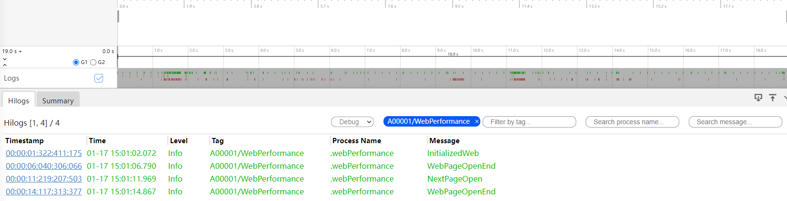

从点击按钮进入Web首页到Web组件触发OnPageEnd事件，表示首页加载完成。对比优化前后时延可以得出，使用提前初始化内核和预解析、预连接可以减少平均100ms左右的加载时间。


从Web首页内点击跳转下一页按钮到Web组件触发OnPageEnd事件，表示页面间跳转完成。对比优化前后时延可以得出，使用预加载下一页方法可以减少平均40~50ms左右的跳转时间。


