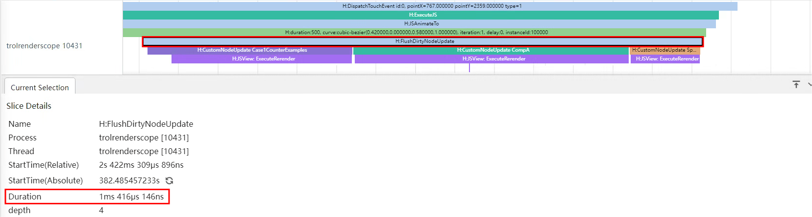
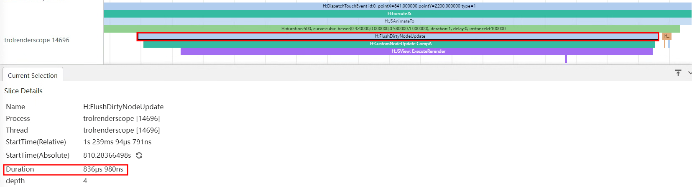
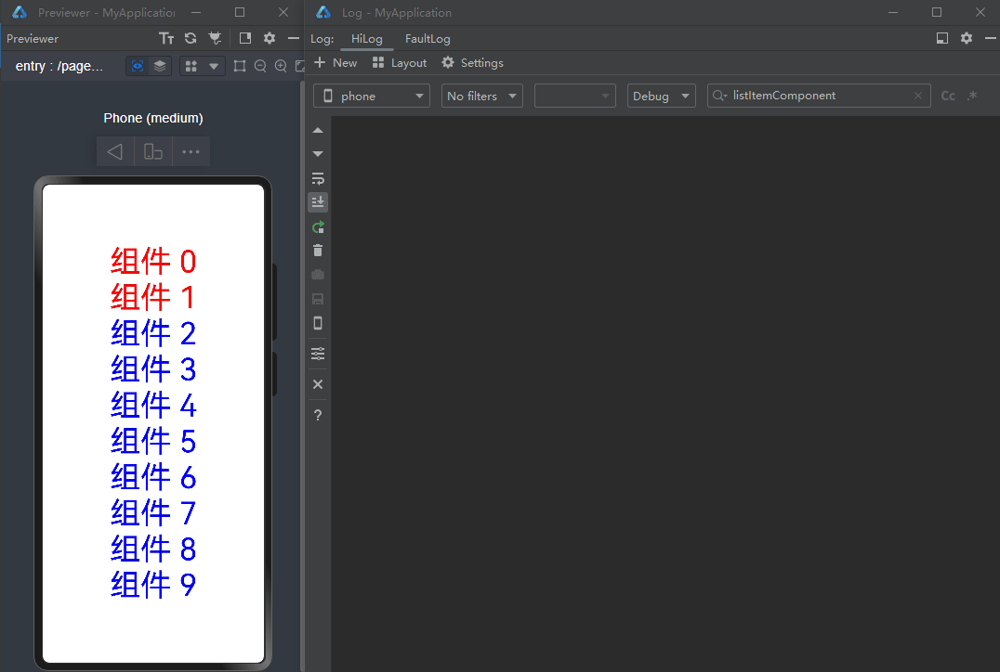
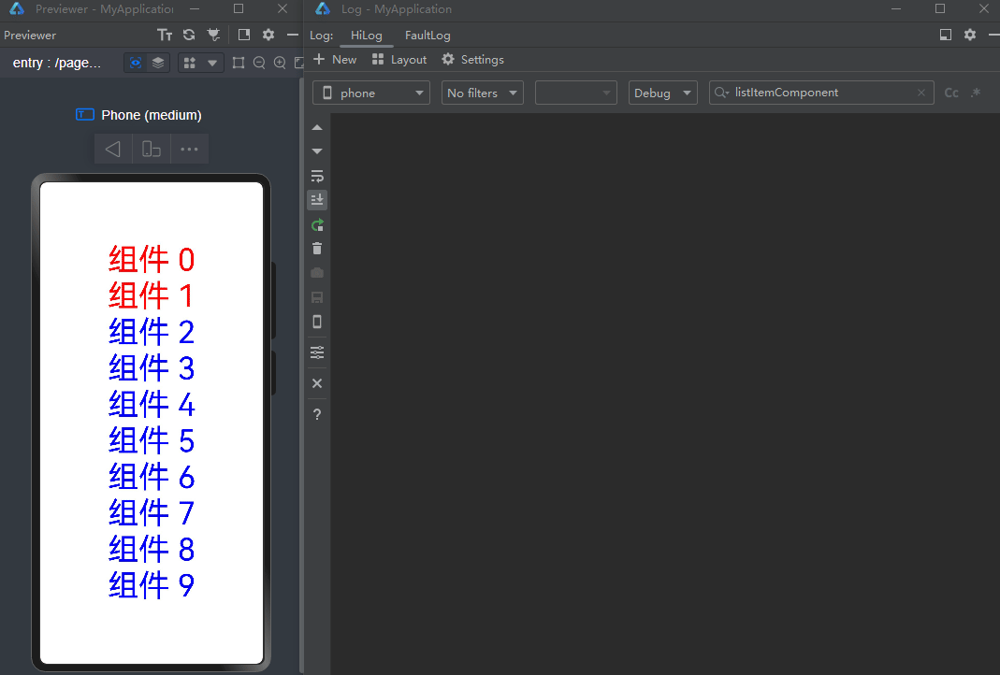
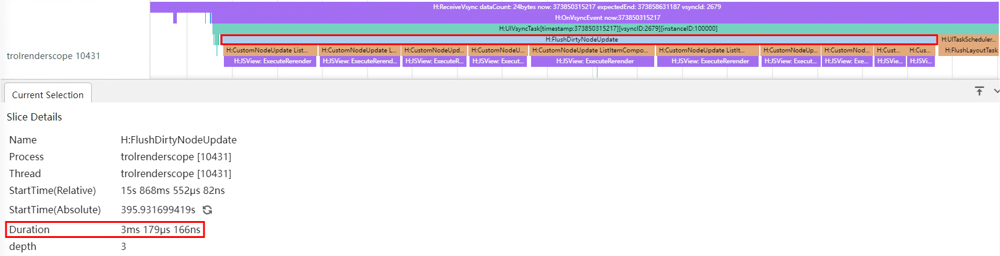
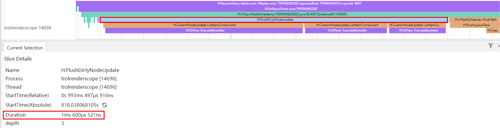

# 精准控制组件的更新范围

在复杂页面开发的场景下，精准控制组件更新的范围对提高应用运行性能尤为重要。

## 多组件关联同一对象的不同属性

在学习本示例之前，需要了解当前状态管理的刷新机制。

```ts
@Observed
class ClassA {
  prop1: number = 0;
  prop2: string = "This is Prop2";
}
@Component
struct CompA {
  @ObjectLink a: ClassA;
  private sizeFont: number = 30; // the private variable does not invoke rendering
  private isRenderText() : number {
    this.sizeFont++; // the change of sizeFont will not invoke rendering, but showing that the function is called
    console.info("Text prop2 is rendered");
    return this.sizeFont;
  }
  build() {
    Column() {
      Text(this.a.prop2) // when this.a.prop2 changes, it will invoke Text rerendering
        .fontSize(this.isRenderText()) //if the Text renders, the function isRenderText will be called
    }
  }
}
@Entry
@Component
struct Page {
  @State a: ClassA = new ClassA();
  build() {
    Row() {
      Column() {
        Text("Prop1: " + this.a.prop1)
          .fontSize(50)
          .margin({ bottom: 20 })
        CompA({a: this.a})
        Button("Change prop1")
          .width(200)
          .margin({ top: 20 })
          .onClick(() => {
            this.a.prop1 = this.a.prop1 + 1 ;
          })
      }
      .width('100%')
    }
    .width('100%')
    .height('100%')
  }
}
```

在上面的示例中，当点击按钮改变prop1的值时，尽管CompA中的组件并没有使用prop1，但是仍然可以观测到关联prop2的Text组件进行了刷新，这体现在Text组件的字体变大，同时控制台输出了“Text prop2 is rendered”的日志上。这说明当改变了一个由@Observed装饰的类的实例对象中的某个属性时（即上面示例中的prop1），会导致所有关联这个对象中某个属性的组件一起刷新，尽管这些组件可能并没有直接使用到该改变的属性（即上面示例中使用prop的Text组件）。这样就会导致一些隐形的“冗余刷新”，当涉及到“冗余刷新”的组件数量很多时，就会大大影响组件的刷新性能。

上文代码运行图示如下：


下面的示例代码为一个较典型的冗余刷新场景。

```ts
@Observed
class UIStyle {
  translateX: number = 0;
  translateY: number = 0;
  scaleX: number = 0.3;
  scaleY: number = 0.3;
  width: number = 336;
  height: number = 178;
  posX: number = 10;
  posY: number = 50;
  alpha: number = 0.5;
  borderRadius: number = 24;
  imageWidth: number = 78;
  imageHeight: number = 78;
  translateImageX: number = 0;
  translateImageY: number = 0;
  fontSize: number = 20;
}
@Component
struct SpecialImage {
  @ObjectLink uiStyle: UIStyle;
  private isRenderSpecialImage() : number { // function to show whether the component is rendered
    console.info("SpecialImage is rendered");
    return 1;
  }
  build() {
    Image($r('app.media.icon'))
      .width(this.uiStyle.imageWidth)
      .height(this.uiStyle.imageHeight)
      .margin({ top: 20 })
      .translate({
        x: this.uiStyle.translateImageX,
        y: this.uiStyle.translateImageY
      })
      .opacity(this.isRenderSpecialImage()) // if the Image is rendered, it will call the function
  }
}
@Component
struct CompA {
  @ObjectLink uiStyle: UIStyle
  // the following functions are used to show whether the component is called to be rendered
  private isRenderColumn() : number {
    console.info("Column is rendered");
    return 1;
  }
  private isRenderStack() : number {
    console.info("Stack is rendered");
    return 1;
  }
  private isRenderImage() : number {
    console.info("Image is rendered");
    return 1;
  }
  private isRenderText() : number {
    console.info("Text is rendered");
    return 1;
  }
  build() {
    Column() {
      // when you compile this code in API9, IDE may tell you that
      // "Assigning the '@ObjectLink' decorated attribute 'uiStyle' to the '@ObjectLink' decorated attribute 'uiStyle' is not allowed. <etsLint>"
      // But you can still run the code by Previewer
      SpecialImage({
        uiStyle: this.uiStyle
      })
      Stack() {
        Column() {
            Image($r('app.media.icon'))
              .opacity(this.uiStyle.alpha)
              .scale({
                x: this.uiStyle.scaleX,
                y: this.uiStyle.scaleY
              })
              .padding(this.isRenderImage())
              .width(300)
              .height(300)
        }
        .width('100%')
        .position({ y: -80 })
        Stack() {
          Text("Hello World")
            .fontColor("#182431")
            .fontWeight(FontWeight.Medium)
            .fontSize(this.uiStyle.fontSize)
            .opacity(this.isRenderText())
            .margin({ top: 12 })
        }
        .opacity(this.isRenderStack())
        .position({
          x: this.uiStyle.posX,
          y: this.uiStyle.posY
        })
        .width('100%')
        .height('100%')
      }
      .margin({ top: 50 })
      .borderRadius(this.uiStyle.borderRadius)
      .opacity(this.isRenderStack())
      .backgroundColor("#FFFFFF")
      .width(this.uiStyle.width)
      .height(this.uiStyle.height)
      .translate({
        x: this.uiStyle.translateX,
        y: this.uiStyle.translateY
      })
      Column() {
        Button("Move")
          .width(312)
          .fontSize(20)
          .backgroundColor("#FF007DFF")
          .margin({ bottom: 10 })
          .onClick(() => {
            animateTo({
              duration: 500
            },() => {
              this.uiStyle.translateY = (this.uiStyle.translateY + 180) % 250;
            })
          })
        Button("Scale")
          .borderRadius(20)
          .backgroundColor("#FF007DFF")
          .fontSize(20)
          .width(312)
          .onClick(() => {
            this.uiStyle.scaleX = (this.uiStyle.scaleX + 0.6) % 0.8;
          })
      }
      .position({
        y:666
      })
      .height('100%')
      .width('100%')

    }
    .opacity(this.isRenderColumn())
    .width('100%')
    .height('100%')

  }
}
@Entry
@Component
struct Page {
  @State uiStyle: UIStyle = new UIStyle();
  build() {
    Stack() {
      CompA({
        uiStyle: this.uiStyle
      })
    }
    .backgroundColor("#F1F3F5")
  }
}
```

在上面的示例中，UIStyle定义了多个属性，并且这些属性分别被多个组件关联。当点击任意一个按钮更改其中的某些属性时，根据上文介绍的机制，会导致所有这些关联uiStyle的组件进行刷新，虽然它们其实并不需要进行刷新（因为组件的属性都没有改变）。通过定义的一系列isRender函数，可以观察到这些组件的刷新。当点击“move”按钮进行平移动画时，由于translateX与translateY的值的多次改变，会导致每一帧都存在冗余刷新的问题，这对应用的性能有着很大的负面影响。

上文代码运行图示如下：


对此，推荐将属性进行拆分，将一个大的属性对象拆分成几个小的属性对象，来减少甚至避免冗余刷新的现象，达到精准控制组件的更新范围。

为了达成这一目的，首先需要了解当前属性更新观测的另一个机制。

下面为示例代码。

```TS
@Observed
class ClassB {
  subProp1: number = 100;
}
@Observed
class ClassA {
  prop1: number = 0;
  prop2: string = "This is Prop2";
  prop3: ClassB = new ClassB();
}
@Component
struct CompA {
  @ObjectLink a: ClassA;
  private sizeFont: number = 30; // the private variable does not invoke rendering
  private isRenderText() : number {
    this.sizeFont++; // the change of sizeFont will not invoke rendering, but showing that the function is called
    console.info("Text prop2 is rendered");
    return this.sizeFont;
  }
  build() {
    Column() {
      Text(this.a.prop2) // when this.a.prop1 changes, it will invoke Text rerendering
        .margin({ bottom: 10 })
        .fontSize(this.isRenderText()) //if the Text renders, the function isRenderText will be called
      Text("subProp1 : " + this.a.prop3.subProp1) //the Text can not observe the change of subProp1
        .fontSize(30)
    }
  }
}
@Entry
@Component
struct Page {
  @State a: ClassA = new ClassA();
  build() {
    Row() {
      Column() {
        Text("Prop1: " + this.a.prop1)
          .margin({ bottom: 20 })
          .fontSize(50)
        CompA({a: this.a})
        Button("Change prop1")
          .width(200)
          .fontSize(20)
          .backgroundColor("#FF007DFF")
          .margin({
            top: 10,
            bottom: 10
          })
          .onClick(() => {
            this.a.prop1 = this.a.prop1 + 1 ;
          })
        Button("Change subProp1")
          .width(200)
          .fontSize(20)
          .backgroundColor("#FF007DFF")
          .onClick(() => {
            this.a.prop3.subProp1 = this.a.prop3.subProp1 + 1;
          })
      }
      .width('100%')
    }
    .width('100%')
    .height('100%')
  }
}
```

在上面的示例中，当点击按钮“Change subProp1”时，可以发现页面并没有进行刷新，这是因为对subProp1的更改并没有被组件观测到。当再次点击“Change prop1”时，可以发现页面进行了刷新，同时显示了prop1与subProp1的最新值。依据ArkUI状态管理机制，状态变量自身只能观察到第一层的变化，所以对于“Change subProp1"，对第二层的属性赋值，是无法观察到的，即对this.a.prop3.subProp1的变化并不会引起组件的刷新，即使subProp1的值其实已经产生了变化。而对this.a.prop1的改变则会引起刷新。

上文代码运行图示如下：


利用这一个机制，可以做到精准控制组件的更新范围。

```ts
@Observed
class ClassB {
  subProp1: number = 100;
}
@Observed
class ClassA {
  prop1: number = 0;
  prop2: string = "This is Prop2";
  prop3: ClassB = new ClassB();
}
@Component
struct CompA {
  @ObjectLink a: ClassA;
  @ObjectLink b: ClassB; // a new objectlink variable
  private sizeFont: number = 30;
  private isRenderText() : number {
    this.sizeFont++;
    console.info("Text prop2 is rendered");
    return this.sizeFont;
  }
  private isRenderTextSubProp1() : number {
    this.sizeFont++;
    console.info("Text subProp1 is rendered");
    return this.sizeFont;
  }
  build() {
    Column() {
      Text(this.a.prop2) // when this.a.prop1 changes, it will invoke Text rerendering
        .margin({ bottom: 10 })
        .fontSize(this.isRenderText()) //if the Text renders, the function isRenderText will be called
      Text("subProp1 : " + this.b.subProp1) // use directly b rather than a.prop3
        .fontSize(30)
        .opacity(this.isRenderTextSubProp1())
    }
  }
}
@Entry
@Component
struct Page {
  @State a: ClassA = new ClassA();
  build() {
    Row() {
      Column() {
        Text("Prop1: " + this.a.prop1)
          .margin({ bottom: 20 })
          .fontSize(50)
        CompA({
          a: this.a,
          b: this.a.prop3
        })
        Button("Change prop1")
          .width(200)
          .fontSize(20)
          .backgroundColor("#FF007DFF")
          .margin({
            top: 10,
            bottom: 10
          })
          .onClick(() => {
            this.a.prop1 = this.a.prop1 + 1 ;
          })
        Button("Change subProp1")
          .width(200)
          .fontSize(20)
          .backgroundColor("#FF007DFF")
          .margin({
            top: 10,
            bottom: 10
          })
          .onClick(() => {
            this.a.prop3.subProp1 = this.a.prop3.subProp1 + 1;
          })
      }
      .width('100%')
    }
    .width('100%')
    .height('100%')
  }
}
```

在上面的示例中，在CompA中定义了一个新的ObjectLink装饰的变量b，并由Page创建CompA时，将a对象中的prop3传入给b，这样就能在子组件CompA中直接使用b，这使得组件实际上和b进行了关联，组件也就能观测到b中的subProp1的变化，当点击按钮“Change subProp1”的时时候，可以只触发相关联的Text的组件的刷新，而不会引起其他的组件刷新（因为其他组件关联的是a），同样的其他对于a中属性的修改也不会导致该Text组件的刷新。

上文代码运行图示如下：


通过这个方法，可以将上文的复杂冗余刷新场景进行属性拆分实现性能优化。

```ts
@Observed
class NeedRenderImage { // properties only used in the same component can be divided into the same new divided class
  public translateImageX: number = 0;
  public translateImageY: number = 0;
  public imageWidth:number = 78;
  public imageHeight:number = 78;
}
@Observed
class NeedRenderScale { // properties usually used together can be divided into the same new divided class
  public scaleX: number = 0.3;
  public scaleY: number = 0.3;
}
@Observed
class NeedRenderAlpha { // properties that may be used in different places can be divided into the same new divided class
  public alpha: number = 0.5;
}
@Observed
class NeedRenderSize { // properties usually used together can be divided into the same new divided class
  public width: number = 336;
  public height: number = 178;
}
@Observed
class NeedRenderPos { // properties usually used together can be divided into the same new divided class
  public posX: number = 10;
  public posY: number = 50;
}
@Observed
class NeedRenderBorderRadius { // properties that may be used in different places can be divided into the same new divided class
  public borderRadius: number = 24;
}
@Observed
class NeedRenderFontSize { // properties that may be used in different places can be divided into the same new divided class
  public fontSize: number = 20;
}
@Observed
class NeedRenderTranslate { // properties usually used together can be divided into the same new divided class
  public translateX: number = 0;
  public translateY: number = 0;
}
@Observed
class UIStyle {
  // define new variable instead of using old one
  needRenderTranslate: NeedRenderTranslate = new NeedRenderTranslate();
  needRenderFontSize: NeedRenderFontSize = new NeedRenderFontSize();
  needRenderBorderRadius: NeedRenderBorderRadius = new NeedRenderBorderRadius();
  needRenderPos: NeedRenderPos = new NeedRenderPos();
  needRenderSize: NeedRenderSize = new NeedRenderSize();
  needRenderAlpha: NeedRenderAlpha = new NeedRenderAlpha();
  needRenderScale: NeedRenderScale = new NeedRenderScale();
  needRenderImage: NeedRenderImage = new NeedRenderImage();
}
@Component
struct SpecialImage {
  @ObjectLink uiStyle : UIStyle;
  @ObjectLink needRenderImage: NeedRenderImage // receive the new class from its parent component
  private isRenderSpecialImage() : number { // function to show whether the component is rendered
    console.info("SpecialImage is rendered");
    return 1;
  }
  build() {
    Image($r('app.media.icon'))
      .width(this.needRenderImage.imageWidth) // !! use this.needRenderImage.xxx rather than this.uiStyle.needRenderImage.xxx !!
      .height(this.needRenderImage.imageHeight)
      .margin({top:20})
      .translate({
        x: this.needRenderImage.translateImageX,
        y: this.needRenderImage.translateImageY
      })
      .opacity(this.isRenderSpecialImage()) // if the Image is rendered, it will call the function
  }
}
@Component
struct CompA {
  @ObjectLink uiStyle: UIStyle;
  @ObjectLink needRenderTranslate: NeedRenderTranslate; // receive the new class from its parent component
  @ObjectLink needRenderFontSize: NeedRenderFontSize;
  @ObjectLink needRenderBorderRadius: NeedRenderBorderRadius;
  @ObjectLink needRenderPos: NeedRenderPos;
  @ObjectLink needRenderSize: NeedRenderSize;
  @ObjectLink needRenderAlpha: NeedRenderAlpha;
  @ObjectLink needRenderScale: NeedRenderScale;
  // the following functions are used to show whether the component is called to be rendered
  private isRenderColumn() : number {
    console.info("Column is rendered");
    return 1;
  }
  private isRenderStack() : number {
    console.info("Stack is rendered");
    return 1;
  }
  private isRenderImage() : number {
    console.info("Image is rendered");
    return 1;
  }
  private isRenderText() : number {
    console.info("Text is rendered");
    return 1;
  }
  build() {
    Column() {
      // when you compile this code in API9, IDE may tell you that
      // "Assigning the '@ObjectLink' decorated attribute 'uiStyle' to the '@ObjectLink' decorated attribute 'uiStyle' is not allowed. <etsLint>"
      // "Assigning the '@ObjectLink' decorated attribute 'uiStyle' to the '@ObjectLink' decorated attribute 'needRenderImage' is not allowed. <etsLint>"
      // But you can still run the code by Previewer
      SpecialImage({
        uiStyle: this.uiStyle,
        needRenderImage: this.uiStyle.needRenderImage //send it to its child
      })
      Stack() {
        Column() {
          Image($r('app.media.icon'))
            .opacity(this.needRenderAlpha.alpha)
            .scale({
              x: this.needRenderScale.scaleX, // use this.needRenderXxx.xxx rather than this.uiStyle.needRenderXxx.xxx
              y: this.needRenderScale.scaleY
            })
            .padding(this.isRenderImage())
            .width(300)
            .height(300)
        }
        .width('100%')
        .position({ y: -80 })

        Stack() {
          Text("Hello World")
            .fontColor("#182431")
            .fontWeight(FontWeight.Medium)
            .fontSize(this.needRenderFontSize.fontSize)
            .opacity(this.isRenderText())
            .margin({ top: 12 })
        }
        .opacity(this.isRenderStack())
        .position({
          x: this.needRenderPos.posX,
          y: this.needRenderPos.posY
        })
        .width('100%')
        .height('100%')
      }
      .margin({ top: 50 })
      .borderRadius(this.needRenderBorderRadius.borderRadius)
      .opacity(this.isRenderStack())
      .backgroundColor("#FFFFFF")
      .width(this.needRenderSize.width)
      .height(this.needRenderSize.height)
      .translate({
        x: this.needRenderTranslate.translateX,
        y: this.needRenderTranslate.translateY
      })

      Column() {
        Button("Move")
          .width(312)
          .fontSize(20)
          .backgroundColor("#FF007DFF")
          .margin({ bottom: 10 })
          .onClick(() => {
            animateTo({
              duration: 500
            }, () => {
              this.needRenderTranslate.translateY = (this.needRenderTranslate.translateY + 180) % 250;
            })
          })
        Button("Scale")
          .borderRadius(20)
          .backgroundColor("#FF007DFF")
          .fontSize(20)
          .width(312)
          .margin({ bottom: 10 })
          .onClick(() => {
            this.needRenderScale.scaleX = (this.needRenderScale.scaleX + 0.6) % 0.8;
          })
        Button("Change Image")
          .borderRadius(20)
          .backgroundColor("#FF007DFF")
          .fontSize(20)
          .width(312)
          .onClick(() => { // in the parent component, still use this.uiStyle.needRenderXxx.xxx to change the properties
            this.uiStyle.needRenderImage.imageWidth = (this.uiStyle.needRenderImage.imageWidth + 30) % 160;
            this.uiStyle.needRenderImage.imageHeight = (this.uiStyle.needRenderImage.imageHeight + 30) % 160;
          })
      }
      .position({
        y: 616
      })
      .height('100%')
      .width('100%')
    }
    .opacity(this.isRenderColumn())
    .width('100%')
    .height('100%')
  }
}
@Entry
@Component
struct Page {
  @State uiStyle: UIStyle = new UIStyle();
  build() {
    Stack() {
      CompA({
        uiStyle: this.uiStyle,
        needRenderTranslate: this.uiStyle.needRenderTranslate, //send all the new class child need
        needRenderFontSize: this.uiStyle.needRenderFontSize,
        needRenderBorderRadius: this.uiStyle.needRenderBorderRadius,
        needRenderPos: this.uiStyle.needRenderPos,
        needRenderSize: this.uiStyle.needRenderSize,
        needRenderAlpha: this.uiStyle.needRenderAlpha,
        needRenderScale: this.uiStyle.needRenderScale
      })
    }
    .backgroundColor("#F1F3F5")
  }
}
```

上文代码运行图示如下：


可以使用SmartPerf Host工具分别抓取优化前后点击“move”按钮时的trace数据，来查看属性拆分的性能收益。

优化前点击move按钮的脏节点更新耗时如下图：



优化后点击move按钮的脏节点更新耗时如下图：



从上面trace图中的“H:FlushDirtyNodeUpdate”标签可以看出，优化前点击“move”按钮的脏节点更新耗时为1ms416μs，而通过拆分属性进行优化后耗时仅836μs，性能提升了大约40.9%。

在上面的示例中将原先大类中的十五个属性拆成了八个小类，并且在组件的属性绑定中也进行了相应的适配。属性拆分遵循以下几点原则：

- 只作用在同一个组件上的多个属性可以被拆分进同一个新类，即示例中的NeedRenderImage。适用于组件经常被不关联的属性改变而引起刷新的场景，这个时候就要考虑拆分属性，或者重新考虑ViewModel设计是否合理。
- 经常被同时使用的属性可以被拆分进同一个新类，即示例中的NeedRenderScale、NeedRenderTranslate、NeedRenderPos、NeedRenderSize。适用于属性经常成对出现，或者被作用在同一个样式上的情况，例如.translate、.position、.scale等（这些样式通常会接收一个对象作为参数）。
- 可能被用在多个组件上或相对较独立的属性应该被单独拆分进一个新类，即示例中的NeedRenderAlpha，NeedRenderBorderRadius、NeedRenderFontSize。适用于一个属性作用在多个组件上或者与其他属性没有联系的情况，例如.opacity、.borderRadius等（这些样式通常相对独立）。

在对属性进行拆分后，对所有使用属性对组件进行绑定的时候，需要使用以下格式：

```ts
.property(this.needRenderXxx.xxx)

// sample
Text("some text")
.width(this.needRenderSize.width)
.height(this.needRenderSize.height)
.opacity(this.needRenderAlpha.alpha)
```

在父组件改变属性的值时，可以通过外层的父类去修改，即：

```ts
// in parent Component
this.parent.needRenderXxx.xxx = x;

//example
this.uiStyle.needRenderImage.imageWidth = (this.uiStyle.needRenderImage.imageWidth + 20) % 60;
```

在子组件本身改变属性的值时，推荐直接通过新类去修改，即：

```ts
// in child Component
this.needRenderXxx.xxx = x;

//example
this.needRenderScale.scaleX = (this.needRenderScale.scaleX + 0.6) % 1
```

属性拆分应当重点考虑变化较为频繁的属性，来提高应用运行的性能。

如果想要在父组件中使用拆分后的属性，推荐新定义一个@State修饰的状态变量配合使用。

```ts
@Observed
class NeedRenderProperty {
  public property: number = 1;
};
@Observed
class SomeClass {
  needRenderProperty: NeedRenderProperty = new NeedRenderProperty();
}
@Entry
@Component
struct Page {
  @State someClass: SomeClass = new SomeClass();
  @State needRenderProperty: NeedRenderProperty = this.someClass.needRenderProperty
  build() {
    Row() {
      Column() {
        Text("property value: " + this.needRenderProperty.property)
          .fontSize(30)
          .margin({ bottom: 20 })
        Button("Change property")
          .onClick(() => {
            this.needRenderProperty.property++;
          })
      }
      .width('100%')
    }
    .width('100%')
    .height('100%')
  }
}
```

## 多组件关联同一数据的条件刷新

多个组件依赖对象中的不同属性时，直接关联该对象会出现改变任一属性所有组件都刷新的现象，可以通过将类中的属性拆分组合成新类的方式精准控制组件刷新。

在多个组件依赖同一个数据源并根据数据源变化刷新组件的情况下，直接关联数据源会导致每次数据源改变都刷新所有组件。为精准控制组件刷新，可以采取以下策略：
  1. 使用 [@Watch](../quick-start/arkts-watch.md) 装饰器：在组件中使用@Watch装饰器监听数据源，当数据变化时执行业务逻辑，确保只有满足条件的组件进行刷新。
  2. 事件驱动更新：对于复杂组件关系或跨层级情况，使用[Emitter](../reference/apis-basic-services-kit/js-apis-emitter.md)自定义事件发布订阅机制。数据源变化时触发相应事件，订阅该事件的组件接收到通知后，根据变化的具体值判断组件是否刷新。

【反例】

在下面的示例代码中，多个组件直接关联同一个数据源，但是未使用@Watch装饰器和Emitter事件驱动更新，导致了冗余的组件刷新。

```ts
@Entry  
@Component  
struct Index {  
  @State currentIndex: number = 0; // 当前选中的列表项下标
  private listData: string[] = [];
  
  aboutToAppear(): void {  
    for (let i = 0; i < 10; i++) {  
      this.listData.push(`组件 ${i}`);  
    }  
  }  
  
  build() {  
    Row() {  
      Column() {  
        List() {  
          ForEach(this.listData, (item: string, index: number) => {  
            ListItem() {  
              ListItemComponent({ item: item, index: index, currentIndex: this.currentIndex })  
            }  
          })  
        }
        .alignListItem(ListItemAlign.Center)
      }  
      .width('100%')  
    }  
    .height('100%')  
  }  
}  
  
@Component  
struct ListItemComponent {  
  @Prop item: string;
  @Prop index: number; // 列表项的下标
  @Link currentIndex: number; 
  private sizeFont: number = 50; 
  
  isRender(): number {  
    console.info(`ListItemComponent ${this.index} Text is rendered`);  
    return this.sizeFont;  
  }  
  
  build() {  
    Column() {  
      Text(this.item)  
        .fontSize(this.isRender())
        // 根据当前列表项下标index与currentIndex的差值来动态设置文本的颜色
        .fontColor(Math.abs(this.index - this.currentIndex) <= 1 ? Color.Red : Color.Blue)  
        .onClick(() => {  
          this.currentIndex = this.index;  
        })  
    }  
  }  
}
```
上述示例中，每个ListItemComponent组件点击Text后会将当前点击的列表项下标index赋值给currentIndex，@Link装饰的状态变量currentIndex会将变化传递给父组件Index和所有ListItemComponent组件。然后，在所有ListItemComponent组件中，根据列表项下标index与currentIndex的差值的绝对值是否小于等于1来决定Text的颜色，如果满足条件，则文本显示为红色，否则显示为蓝色。

下面是运行效果图。


可以看到每次点击后即使其中部分Text组件的颜色并没有发生改变，所有的Text组件也都会刷新。这是由于ListItemComponent组件中的Text组件直接关联了currentIndex，而不是根据currentIndex计算得到的颜色。

针对上述父子组件层级关系的场景，推荐使用状态装饰器@Watch监听数据源。当数据源改变时，在@Watch的监听回调中执行业务逻辑。组件关联回调的处理结果，而不是直接关联数据源。

【正例】

下面是对上述示例的优化，展示如何通过@Watch装饰器实现精准刷新。

```ts
@Entry
@Component
struct Index {
  @State currentIndex: number = 0; // 当前选中的列表项下标
  private listData: string[] = [];


  aboutToAppear(): void {
    for (let i = 0; i < 10; i++) {
      this.listData.push(`组件 ${i}`);
    }
  }

  build() {
    Row() {
      Column() {
        List() {
          ForEach(this.listData, (item: string, index: number) => {
            ListItem() {
              ListItemComponent({ item: item, index: index, currentIndex: this.currentIndex })
            }
          })
        }
        .alignListItem(ListItemAlign.Center)
      }
      .width('100%')
    }
    .height('100%')
  }
}

@Component
struct ListItemComponent {
  @Prop item: string;
  @Prop index: number; // 列表项的下标
  @Link @Watch('onCurrentIndexUpdate') currentIndex: number;
  @State color: Color = Math.abs(this.index - this.currentIndex) <= 1 ? Color.Red : Color.Blue;

  isRender(): number {
    console.info(`ListItemComponent ${this.index} Text is rendered`);
    return 50;
  }

  onCurrentIndexUpdate() {
    // 根据当前列表项下标index与currentIndex的差值来动态修改color的值
    this.color = Math.abs(this.index - this.currentIndex) <= 1 ? Color.Red : Color.Blue;
  }

  build() {
    Column() {
      Text(this.item)
        .fontSize(this.isRender())
        .fontColor(this.color)
        .onClick(() => {
          this.currentIndex = this.index;
        })
    }
  }
}
```
上述代码中，ListItemComponent组件中的状态变量currentIndex使用@Watch装饰，Text组件直接关联新的状态变量color。当currentIndex发生变化时，会触发onCurrentIndexUpdate方法，在其中将表达式的运算结果赋值给状态变量color。只有color的值发生变化时，Text组件才会重新渲染。

运行效果图如下。



【效果对比】

使用SmartPerf Host工具分别抓取正反例中切换选中项的trace数据，通过点击组件2的脏节点更新耗时分析二者的性能差异。

反例点击组件2的脏节点更新耗时如下图：



正例点击组件2的脏节点更新耗时如下图：



从上面的trace图可以看出，反例中点击组件2后十个ListItemComponent组件节点都触发了更新，脏节点更新耗时3ms179μs，而正例只有三个节点触发更新，脏节点更新耗时仅为1ms600μs，性能提升了大约49.7%。

被依赖的数据源仅在父子或兄弟关系的组件中传递时，可以参考上述示例，使用@State/@Link/@Watch装饰器进行状态管理，实现组件的精准刷新。

当组件关系层级较多但都归属于同一个确定的组件树时，推荐使用@Provide/@Consume传递数据，使用@Watch装饰器监听数据变化，在监听回调中执行业务逻辑。参考如下伪代码。

```ts
// in ParentComponent
@Provide @Watch('onCurrentValueUpdate') currentValue: number = 0;
@State parentComponentResult: number = 0;
onCurrentValueUpdate() {
  // 执行业务逻辑
  this.parentComponentResult = X; // X 代表基于业务逻辑需要赋给parentComponentResult的值
}
Component.property(this.parentComponentResult)

// in ChildComponent
@Provide @Watch('onCurrentValueUpdate') currentValue: number = 0;
@State childComponentResult: number = 0;
onCurrentValueUpdate() {
  // 执行业务逻辑
  this.childComponentResult = X; // X 代表基于业务逻辑需要赋给childComponentResult的值
}
Component.property(this.childComponentResult)

// in NestedComponent
@Provide @Watch('onCurrentValueUpdate') currentValue: number = 0;
@State nestedComponentResult: number = 0;
onCurrentValueUpdate() {
  // 执行业务逻辑
  this.nestedComponentResult = X; // X 代表基于业务逻辑需要赋给nestedComponentResult的值
}
Component.property(this.nestedComponentResult)
```

当组件关系复杂或跨越层级过多时，推荐使用 [Emitter](../reference/apis-basic-services-kit/js-apis-emitter.md) 自定义事件发布订阅的方式。当数据源改变时发布事件，依赖该数据源的组件通过订阅事件来获取数据源的改变，完成业务逻辑的处理，从而实现组件的精准刷新。

下面通过部分示例代码介绍使用方式。

ButtonComponent组件作为交互组件触发数据变更，ListItemComponent组件接收数据做相应的UI刷新。

```ts
Column() {
  Row() {
    Column() {
      ButtonComponent()
    }
  }
  Column() {
    Column() {
      List() {
        ForEach(this.listData, (item: string, index: number) => {
          ListItemComponent({ myItem: item, index: index })
        })
      }
      .alignListItem(ListItemAlign.Center)
    }
  }
}
```
由于ButtonComponent组件和ListItemComponent组件的组件关系较为复杂，因此在ButtonComponent组件中的Button回调中，可以使用emitter.emit发送事件，在ListItemComponent组件中订阅事件。在事件触发的回调中接收数据value，通过业务逻辑决定是否修改状态变量color，从而实现精准控制ListItemComponent组件中Text的刷新。

```ts
// in ButtonComponent
Button(`下标是${this.value}的倍数的组件文字变为红色`)
  .onClick(() => {
    let event: emitter.InnerEvent = {
      eventId: 1,
      priority: emitter.EventPriority.LOW
    };
    let eventData: emitter.EventData = {
      data: {
        value: this.value
      }
    };
    // 发送eventId为1的事件，事件内容为eventData
    emitter.emit(event, eventData);
    this.value++;
  })

```

```ts
// in ListItemComponent
@State color: Color = Color.Black;
aboutToAppear(): void {
  let event: emitter.InnerEvent = {
    eventId: 1
  };
  // 收到eventId为1的事件后执行该回调
  let callback = (eventData: emitter.EventData): void => {
    if (eventData.data?.value !== 0 && this.index % eventData.data?.value === 0) {
      this.color = Color.Red;
    }
  };
  // 订阅eventId为1的事件
  emitter.on(event, callback);
}
build() {
  Column() {
    Text(this.myItem)
      .fontSize(this.isRender())
      .fontColor(this.color)
  }
}
```