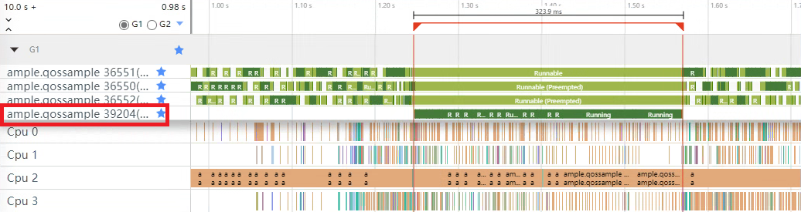

# 高负载场景下线程优先级设置防止关键线程被打断

## 场景介绍

在现代软件开发中，多线程或多进程的并发处理已成为常态。在多线程环境中，不同线程执行的任务具有不同的重要性和紧急程度。在高负载情况下，系统资源（如CPU时间）变得非常宝贵，此时如果关键线程（如UI渲染线程）因被其他非关键线程频频打断而得不到足够的资源和执行时间，从而无法确保其能够连续且及时地完成任务，则可能会导致画面卡顿、延迟等问题，影响用户体验。

## 解决思路 
在系统资源负载较重的时候，为了能够让关键的任务拿到足够的资源，系统会依据任务的重要性，给任务分配相应的时间片，重要性越高的任务，可以分配到越多的时间片。那么开发者在可以识别自己应用中的关键线程的情况下，针对各个线程的任务紧急程度，给与关键线程以相对较高的QoS等级以防止被其他线程打断，从而保证应用的流畅运行和更好的用户体验。 
### QoS   
[服务质量（QoS）](../napi/qos-guidelines.md)一文介绍了QoS的基本概念、原理、相关接口的用法以及各个QoS等级的使用场景及负载特征。 

在操作系统层面，QoS等级是一种用于区分不同线程优先级和服务质量的技术。通常系统会自动识别主线程，并在应用处于前台焦点情况下为其配置高于开放给应用开发者调用的QoS等级，以确保其优先执行。  

与ArkTS端 [taskpool.Priority](../reference/apis-arkts/js-apis-taskpool.md) 的优先级类似，QoS提供的优先级等级也都会相对应的映射到内核的优先级上。不过QoS提供的等级更多，自适应调度策略更强，它们属于两套不同的逻辑。

[FFRT（Function Flow运行时）](../reference/apis-ffrt-kit/_f_f_r_t.md)的QoS提供了ffrt_qos_inherit（-1）到ffrt_qos_user_initiated（3）5个优先等级，它与当前的QoS接口有着同一套底层逻辑。差别在于当前开发所用的QoS接口是直接开放给应用线程的，而FFRT的QoS则是面向任务的优先级配置。关于线程编程模型和任务编程模型的对比详见 [FFRT 开发指导](../napi/ffrt-guidelines.md)。


## 场景示例
下面是一个在高负载情况下，配置了不同QoS等级的两个线程（关键线程）完成相同计算任务所花时间的对比图，从界面的运行结果可以看到在高负载情况下，配置了高优先级的线程执行完计算所花的时间更少一些。

  
具体实现步骤如下：  
1、关键线程执行计算任务前先开启若干线程模拟高负载场景。
```c++
// 开启TASKS个线程模拟系统负载
if (!g_addLoad) {
    std::vector<std::thread> loadThreads;
    for (int i = 0; i < TASKS; i++) {
        // 开启线程执行负载任务
        loadThreads.emplace_back(std::thread(AddLoads, TASKS));
        loadThreads[i].detach();
    }
    g_addLoad = true;
}

```
```c++
// 负载任务
void AddLoads(int n) { 
    // 检查n是否为负数，如果是则退出
    if (!n) {
        OH_LOG_Print(LOG_APP, LOG_ERROR, LOG_PRINT_DOMAIN, "QoS", "invalid input.");
        return;
    }

    int ret = OH_QoS_SetThreadQoS(QoS_Level::QOS_BACKGROUND);
    if (ret) {
        OH_LOG_Print(LOG_APP, LOG_ERROR, LOG_PRINT_DOMAIN, "QoS", "set load thread QoS level failed.");
        return;
    }

    // 绑定到特定CPU
    CPU_set_t mask;
    CPU_SET(*g_affinity, &mask);
    if (sched_setaffinity(0, sizeof(mask), &mask) != 0) {
        OH_LOG_Print(LOG_APP, LOG_ERROR, LOG_PRINT_DOMAIN, "QoS", "bind load thread failed");
        return;
    }
    // 执行负载计算
    for (int i = 0; i < BOUND; i++) {
        for (int j = 0; j < BOUND; j++) {
            int x = (i + j) - n;
            printf("%d", x);
        }
    }
    // 重新初始化负载线程
    g_addLoad = false;
}
```

2、实现高、低QoS等级计算线程所要完成的计算任务（斐波那契数列计算）。先通过 [OH_QoS_SetThreadQoS](../napi/qos-guidelines.md) 接口设置当前线程的QoS等级，再执行 DoFib() 斐波那契数列计算：

```c++
// 执行 斐波那契数列 计算
long long DoFib(double n) {
    if (n == ONE) {
        return ONE;
    }

    if (n == TWO) {
        return TWO;
    }
    return DoFib(n - ONE) + DoFib(n - TWO);
}

void SetQoS(QoS_Level level) {
    // 设置当前线程的QoS等级为level
    int ret = OH_QoS_SetThreadQoS(level); 
    if (!ret) {
        OH_LOG_Print(LOG_APP, LOG_INFO, LOG_PRINT_DOMAIN, "QoS", "set qos level success.");
        //  查询当前的QoS等级
        QoS_Level queryLevel = QoS_Level::QOS_DEFAULT;
        ret = OH_QoS_GetThreadQoS(&queryLevel);
        if (!ret) {
            OH_LOG_Print(LOG_APP, LOG_INFO, LOG_PRINT_DOMAIN, "QoS", "the qos level of current thread : %{public}d",
                         queryLevel);
        } else {
            OH_LOG_Print(LOG_APP, LOG_ERROR, LOG_PRINT_DOMAIN, "QoS", "get qos level failed.");
            return;
        }
    } else {
        OH_LOG_Print(LOG_APP, LOG_ERROR, LOG_PRINT_DOMAIN, "QoS", "get level qos failed!");
        return;
    }

    // 绑定到特定CPU
    CPU_set_t mask;
    CPU_SET(*g_affinity, &mask);
    if (sched_setaffinity(0, sizeof(mask), &mask) != 0) {
        OH_LOG_Print(LOG_APP, LOG_ERROR, LOG_PRINT_DOMAIN, "QoS", "bind qos thread failed");
        return;
    }
    // 统计执行完斐波那契数列计算任务后所耗时间
    auto startTime = std::chrono::system_clock::now();
    // 执行斐波那契数列计算任务
    long long res = DoFib(DEPTH);
    auto endTime = std::chrono::system_clock::now();
    g_durationTime = std::chrono::duration<double, std::milli>(endTime - startTime).count();
    OH_LOG_Print(LOG_APP, LOG_INFO, LOG_PRINT_DOMAIN, "QoS", "calculate res is: %{public}llu", res);

    // 重置线程QoS等级
    ret = OH_QoS_ResetThreadQoS();
    if (!ret) {
        OH_LOG_Print(LOG_APP, LOG_INFO, LOG_PRINT_DOMAIN, "QoS", "reset qos level success.");
    } else {
        OH_LOG_Print(LOG_APP, LOG_ERROR, LOG_PRINT_DOMAIN, "QoS", "reset qos level failed!");
        return;
    }

    // 在重置QoS后，再次查询，此时查询会失败
    QoS_Level queryLevelTwo;
    ret = OH_QoS_GetThreadQoS(&queryLevelTwo);
    if (!ret) {
        OH_LOG_Print(LOG_APP, LOG_INFO, LOG_PRINT_DOMAIN, "QoS", "the qos level after: %{public}d", queryLevelTwo);
        return;
    } else {
        OH_LOG_Print(LOG_APP, LOG_ERROR, LOG_PRINT_DOMAIN, "QoS", "querry qos level failed after reset.");
        return;
    }
}
```

3、然后分别将计算线程设置低（反例）、高（正例）QoS等级来对比两者在相同的高负载情况下完成相同层级的斐波那契数列计算所花时间。

- **反例：** 给计算线程配置低QoS等级 

```c++
static napi_value lowQoSCalculate(napi_env env, napi_callback_info info) {
    g_durationTime = 0;
    // 开启TASKS个线程模拟系统负载
    if (!g_addLoad) {
        std::vector<std::thread> loadThreads;
        for (int i = 0; i < TASKS; i++) {
            // 开启线程执行负载任务
            loadThreads.emplace_back(std::thread(AddLoads, TASKS));
            loadThreads[i].detach();
        }
        g_addLoad = true;
    }

    // 开启 QOS_BACKGROUND 低 QoS 线程进行计算
    QoS_Level level = QoS_Level::QOS_BACKGROUND;
    std::thread task(SetQoS, level);
    task.join();

    // 返回计算耗时
    napi_value res;
    napi_create_double(env, g_durationTime, &res);
    return res;
}

```

计算线程（线程id：39260）设置低QoS等级trace图           
   
如上图所示，计算线程执行完计算任务耗时726.8毫秒。

- **正例：** 给计算线程配置高QoS等级 
 

```c++
static napi_value highQoSCalculate(napi_env env, napi_callback_info info) {
    g_durationTime = 0;
    // 开启TASKS个线程模拟系统负载
    if (!g_addLoad) {
        std::vector<std::thread> loadThreads;
        for (int i = 0; i < TASKS; i++) {
            // 开启线程执行负载任务
            loadThreads.emplace_back(std::thread(AddLoads, TASKS));
            loadThreads[i].detach();
        }
        g_addLoad = true;
    }

    // 开启 QOS_USER_INTERACTIVE 高 QoS 线程进行计算
    QoS_Level level = QoS_Level::QOS_USER_INTERACTIVE;
    std::thread task(SetQoS, level);
    task.join();

    // 返回计算耗时
    napi_value res;
    napi_create_double(env, g_durationTime, &res);
    return res;
}

```

计算线程（线程id：39204）设置高QoS等级trace图    
  
如上图所示，计算线程执行完计算任务耗时323.9毫秒。    

  > **说明：**
  >
  > 该示例只在高负载压力下有效。  
  > 在低负载情况下，由于系统资源相对充足，即使不进行特别的优先级设置，大多数线程也能够得到足够的CPU时间来完成任务，因而效果并不明显。 

## 总结  

| 方案   | 斐波那契数列项数              | 计算耗时     |
| ----------- | -------- | ---------------- |
| 低Qos等级 QOS_BACKGROUND（反例） | 34  | 726.8毫秒 |
| 高Qos等级 QOS_USER_INTERACTIVE（正例）   | 34   | 323.9毫秒   |  

通过上述对比可以发现，**高负载压力下**，高QoS优先级的线程可以更快的执行完计算任务。因此在实践中我们通过合理设置线程优先级，给关键线程以相对较高的QoS等级可以有效地避免关键线程被打断，从而保证应用程序的稳定性和响应性。    
然而，需要注意的是，由于整机的资源是有限的，高QoS等级的线程获取更多的资源，意味着低QoS等级的线程获取的资源会变少，过度提高线程优先级可能导致其他线程饥饿，影响整个系统的稳定运行。因此，线程优先级的设置应当基于具体的应用场景和系统需求，综合考虑各种因素后做出决策。


