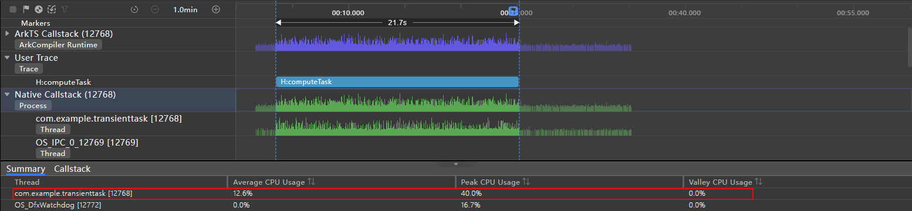

# 合理运行后台任务

## 简介

设备返回主界面、锁屏、应用切换等操作会使应用退至后台。为了降低设备耗电速度、保障用户使用流畅度，系统会对退至后台的应用进行管控，包括进程挂起和进程终止。为了保障后台音乐播放、日历提醒等功能的正常使用，系统提供了受规范约束的后台任务，扩展应用在后台的运行时间。  
本文将介绍各类后台任务的基本概念和适用场景，并且通过对短时任务和长时任务两个场景的性能分析说明合理运行后台任务的必要性。

## 短时任务

应用退至后台一小段时间后，应用进程会被挂起，无法执行对应的任务。如果应用在后台仍需要执行耗时不长的任务，可以申请短时任务，扩展应用在后台的运行时间。

短时任务适用于小文件下载、缓存、信息发送等实时性高、需要临时占用资源执行的任务。详细的开发指导可参考[短时任务](https://docs.openharmony.cn/pages/v4.0/zh-cn/application-dev/task-management/transient-task.md/)。

### 场景示例

下面代码在申请短时任务后执行了一个耗时计算任务。源代码可访问[短时任务示例程序](https://gitee.com/openharmony/applications_app_samples/blob/master/code/Performance/PerformanceLibrary/feature/backgroundTask/src/main/ets/view/TransientTaskView.ets)获取。

```javascript
import backgroundTaskManager from '@ohos.resourceschedule.backgroundTaskManager';
import { BusinessError } from '@ohos.base';
import util from '@ohos.util';
import hiTraceMeter from '@ohos.hiTraceMeter';

const totalTimes: number = 50000000; // 循环次数
const calculateResult: string = 'Total time costed = %s ms.'; // 文本格式

@Entry
@Component
struct Index {
  @State message: string = 'Click button to calculate.';
  private requestId: number = 0;

  // 申请短时任务
  requestSuspendDelay() {
    try {
      let delayInfo = backgroundTaskManager.requestSuspendDelay('compute', () => {
        console.info('Request suspension delay will time out.');
        // 任务即将超时，取消短时任务
        this.cancelSuspendDelay();
      })
      this.requestId = delayInfo.requestId;
    } catch (error) {
      console.error(`requestSuspendDelay failed. code is ${(error as BusinessError).code} message is ${(error as BusinessError).message}`);
    }
  }

  // 取消短时任务
  cancelSuspendDelay() {
    backgroundTaskManager.cancelSuspendDelay(this.requestId);
    console.info('Request suspension delay cancel.');
  }

  // 计算任务
  computeTask(times: number): number {
    let start: number = new Date().getTime();
    let a: number = 1;
    let b: number = 1;
    let c: number = 1;
    for (let i: number = 0; i < times; i++) {
      a = a * Math.random() + b * Math.random() + c * Math.random();
      b = a * Math.random() + b * Math.random() + c * Math.random();
      c = a * Math.random() + b * Math.random() + c * Math.random();
    }
    let end: number = new Date().getTime();
    return end - start;
  }

  // 点击回调
  clickCallback = () => {
    this.requestSuspendDelay();
    hiTraceMeter.startTrace('computeTask', 0); // 开启性能打点
    let timeCost = this.computeTask(totalTimes);
    this.message = util.format(calculateResult, timeCost.toString());
    hiTraceMeter.finishTrace('computeTask', 0); // 结束性能打点
    this.cancelSuspendDelay();
  }

  build() {
    Column() {
      Row(){
        Text(this.message)
      }
      Row() {
        Button('开始计算')
          .onClick(this.clickCallback)
      }
      .width('100%')
      .justifyContent(FlexAlign.Center)
    }
    .width('100%')
    .height('100%')
    .justifyContent(FlexAlign.Center)
  }
}
```

使用 IDE 中的 Time Profiler 获取示例应用从开始计算任务并退到后台执行一分钟内的性能数据。获取到的数据如下图。

图1 短时任务 Time Profiler 泳道图


- ArkTS Callstack：基于时间轴展示 CPU 占用率和状态的变化。
- User Trace：基于时间轴展示当前时段内触发用户自定义打点任务的具体情况。H:computeTask 表示短时任务执行用时。
- Native Callstack：基于时间轴展示 CPU 占用率变化和进程/线程的活动状态以及函数调用栈。

从上图中可以看出，Native Callstack 泳道与 H:computeTask 相对应的时间段内应用进程处于活跃状态，CPU 占用率在较高范围内变化。任务取消后，应用仍然处于运行状态，但是进程的活跃程度和 CPU 占用率都明显下降，直到在几秒后系统将应用挂起，不再占用 CPU。

分别框选任务执行阶段和任务取消后未被挂起阶段对应的 Native Callstack 如下图，查看应用主线程在两个阶段的平均 CPU 占用率和最高 CPU 占用率情况。

图2 任务执行阶段的 CPU 占用率



图3 任务取消后未被挂起阶段的 CPU 占用率


可以看到应用主线程在任务执行阶段的平均 CPU 占用率为 12.6%，最高 CPU 占用率为 40.0%，在任务取消后未被挂起阶段的平均 CPU 占用率为 2.2%，最高 CPU 占用率为 28.6%。

在后台运行短时任务，会占用系统 CPU，在后台执行过多的短时任务就有可能会导致前台的应用卡顿，因此建议非必要情况不使用短时任务，使用时也避免同时申请过多的短时任务。

更多短时任务的使用限制和注意事项可以参考[短时任务约束与限制](https://docs.openharmony.cn/pages/v4.0/zh-cn/application-dev/task-management/transient-task.md/#%E7%BA%A6%E6%9D%9F%E4%B8%8E%E9%99%90%E5%88%B6)。

## 长时任务

应用退至后台后，在后台需要长时间运行用户可感知的任务，如播放音乐、导航等。为防止应用进程被挂起，导致对应功能异常，可以申请长时任务，使应用在后台长时间运行。申请长时任务后，系统会做相应的校验，确保应用在执行相应的长时任务。详细的开发指导可参考[长时任务](https://docs.openharmony.cn/pages/v4.0/zh-cn/application-dev/task-management/continuous-task.md/)。

长时任务支持的类型包括数据传输、音视频播放、录音、定位导航、蓝牙相关、多设备互联、WLAN 相关、音视频通话、计算任务。可以根据下表的场景举例选择相应的长时任务类型。

| 描述                           | 场景举例                             |
| ------------------------------ | ------------------------------------ |
| 数据传输                       | 后台下载大文件，如浏览器后台下载等。 |
| 音视频播放                     | 音乐类应用在后台播放音乐。           |
| 录音                           | 录音机在后台录音。                   |
| 定位导航                       | 导航类应用后台导航。                 |
| 蓝牙相关                       | 通过蓝牙传输分享的文件。             |
| 多设备互联                     | 分布式业务连接。                     |
| WLAN 相关（仅对系统应用开放）  | 通过 WLAN 传输分享的文件。           |
| 音视频通话（仅对系统应用开放） | 系统聊天类应用后台音频电话。         |
| 计算任务（仅对特定设备开放）   | 杀毒软件                             |

- 申请了数据传输的长时任务，系统仅会提升应用进程的优先级，降低系统终止应用进程的概率，但仍然会挂起对应的应用进程。对于上传下载对应的功能，需要调用系统[上传下载代理接口](https://docs.openharmony.cn/pages/v4.0/zh-cn/application-dev/reference/apis/js-apis-request.md/)托管给系统执行，可以参考[文件上传下载性能提升指导](https://docs.openharmony.cn/pages/v4.0/zh-cn/application-dev/performance/improve-file-upload-and-download-performance.md/)。
- 申请音视频播放长时任务必须使用[媒体会话服务](https://docs.openharmony.cn/pages/v4.0/zh-cn/application-dev/media/avsession-overview.md/)，否则无法在后台播放。
- 申请录音类型长时任务，需要有显著的用户提示，必须通过动态授权弹框来提供用户授权界面，请求用户授权麦克风权限。

### 场景示例

下面模拟一个后台定位的场景。应用订阅设备位置变化，每隔一秒获取位置信息，为了保证应用在退到后台后仍然可以使用定位服务，申请了定位类型的长时任务。源代码可访问[长时任务示例程序](https://gitee.com/openharmony/applications_app_samples/blob/master/code/Performance/PerformanceLibrary/feature/backgroundTask/src/main/ets/view/LongTermTaskView.ets)获取。

首先需要在 [module.json5](https://gitee.com/openharmony/applications_app_samples/blob/master/code/Performance/PerformanceLibrary/product/phone/entry/src/main/module.json5) 配置文件中为需要使用长时任务的 EntryAbility 声明任务类型。

```javascript
{
  "module": { 
    // ...
    "abilities": [
      {
        "name": "EntryAbility",
        // 后台模式类型
        "backgroundModes": [
          "location"
        ]
      }
    ],
  }
}
```

需要使用到的相关权限如下：

- ohos.permission.INTERNET
- ohos.permission.LOCATION_IN_BACKGROUND
- ohos.permission.APPROXIMATELY_LOCATION
- ohos.permission.LOCATION
- ohos.permission.KEEP_BACKGROUND_RUNNING

权限申请方式参考[配置文件权限申明](https://docs.openharmony.cn/pages/v4.0/zh-cn/application-dev/security/accesstoken-guidelines.md/#%E9%85%8D%E7%BD%AE%E6%96%87%E4%BB%B6%E6%9D%83%E9%99%90%E5%A3%B0%E6%98%8E)，在 [module.json5](https://gitee.com/openharmony/applications_app_samples/blob/master/code/Performance/PerformanceLibrary/product/phone/entry/src/main/module.json5) 中进行配置。其中部分权限申请以及打开使能通知开关需要用户手动确认。系统为申请的长时任务发布通知栏消息时，应用的使能通知开关必须处于开启状态，否则用户无法感知后台正在运行的长时任务。

后台定位的实现代码如下：

```javascript
import wantAgent, { WantAgent } from '@ohos.app.ability.wantAgent';
import common from '@ohos.app.ability.common';
import backgroundTaskManager from '@ohos.resourceschedule.backgroundTaskManager';
import { BusinessError } from '@ohos.base';
import geolocation from '@ohos.geoLocationManager';
import abilityAccessCtrl from '@ohos.abilityAccessCtrl';
import notificationManager from '@ohos.notificationManager';

const TAG: string = 'BackgroundLocation';

@Entry
@Component
export struct LongTermTaskView {
  @State latitude: number = 0;
  @State longitude: number = 0;

  aboutToAppear() {
    // 请求发送通知的许可
    notificationManager.requestEnableNotification().then(() => {
      console.info(`[EntryAbility] requestEnableNotification success`);
      // 申请定位相关权限
      let atManager = abilityAccessCtrl.createAtManager();
      try {
        atManager.requestPermissionsFromUser(getContext(this), ['ohos.permission.INTERNET',
          'ohos.permission.LOCATION',
          'ohos.permission.LOCATION_IN_BACKGROUND',
          'ohos.permission.APPROXIMATELY_LOCATION'])
          .then((data) => {
            console.info(`[EntryAbility], data: ${JSON.stringify(data)}`);
          })
          .catch((err: BusinessError) => {
            console.info(`[EntryAbility], err: ${JSON.stringify(err)}`);
          })
      } catch (err) {
        console.info(`[EntryAbility], catch err->${JSON.stringify(err)}`);
      }
    }).catch((err: BusinessError) => {
      console.error(`[EntryAbility] requestEnableNotification failed, code is ${err.code}, message is ${err.message}`);
    });
  }

  // 位置变化回调
  locationChange = async (location: geolocation.Location) => {
    console.info(TAG, `locationChange location =${JSON.stringify(location)}`);
    this.latitude = location.latitude;
    this.longitude = location.longitude;
  }

  // 获取定位
  async getLocation() {
    console.info(TAG, `enter getLocation`);
    let requestInfo: geolocation.LocationRequest = {
      priority: geolocation.LocationRequestPriority.FIRST_FIX, // 快速获取位置优先
      scenario: geolocation.LocationRequestScenario.UNSET, // 未设置场景信息
      timeInterval: 1, // 上报位置信息的时间间隔
      distanceInterval: 0, // 上报位置信息的距离间隔
      maxAccuracy: 100 // 精度信息
    };
    console.info(TAG, `on locationChange before`);
    geolocation.on('locationChange', requestInfo, this.locationChange);
    console.info(TAG, `on locationChange end`);
  }

  // 开始长时任务
  startContinuousTask() {
    let context: Context = getContext(this);
    // 通知参数，指定点击长时任务通知后跳转的应用
    let wantAgentInfo: wantAgent.WantAgentInfo = {
      wants: [
        {
          bundleName: (context as common.UIAbilityContext).abilityInfo.bundleName,
          abilityName: (context as common.UIAbilityContext).abilityInfo.name
        }
      ],
      operationType: wantAgent.OperationType.START_ABILITY,
      requestCode: 0,
      wantAgentFlags: [wantAgent.WantAgentFlags.UPDATE_PRESENT_FLAG]
    };
    wantAgent.getWantAgent(wantAgentInfo).then((wantAgentObj: WantAgent) => {
      backgroundTaskManager.startBackgroundRunning(context,
        backgroundTaskManager.BackgroundMode.LOCATION, wantAgentObj).then(() => {
        console.info(`Succeeded in operationing startBackgroundRunning.`);
      }).catch((err: BusinessError) => {
        console.error(`Failed to operation startBackgroundRunning. Code is ${err.code}, message is ${err.message}`);
      });
    });
  }

  // 停止长时任务
  stopContinuousTask() {
    backgroundTaskManager.stopBackgroundRunning(getContext()).then(() => {
      console.info(`Succeeded in operationing stopBackgroundRunning.`);
    }).catch((err: BusinessError) => {
      console.error(`Failed to operation stopBackgroundRunning. Code is ${err.code}, message is ${err.message}`);
    });
  }

  build() {
    Column() {
      Column() {
        Text(this.latitude.toString())
        Text(this.longitude.toString())
      }
      .width('100%')

      Column() {
        Button('开启定位服务')
          .onClick(() => {
            this.startContinuousTask();
            this.getLocation();
          })
        Button('关闭定位服务')
          .onClick(async () => {
            await geolocation.off('locationChange');
            this.stopContinuousTask();
          })
          .margin({ top: 10 })
      }
      .width('100%')
    }
    .width('100%')
    .height('100%')
    .justifyContent(FlexAlign.Center)
  }
}
```

基于上述场景，使用功耗测试工具获取 30min 设备功耗，得到的数据如下表。

| 测试任务             | 测试时长(s) | 归一电流(mA) | 最大电流(mA) | 归一耗电(mAH) |
| -------------------- | ----------- | ------------ | ------------ | ------------- |
| 后台存在定位长时任务 | 1836.4      | 15.52        | 995.72       | 7.92          |
| 后台无任务           | 1839.9      | 0.85         | 404.03       | 0.44          |

- 归一电流：电压处于 3.8V 时的电流平均值。
- 归一耗电的计算方式为：归一电流\*测试时长/3600。3600 表示一小时的秒数。

对比后台存在长时定位任务和不存在长时任务时的功耗数据，当后台存在定位任务持续运行时，设备在 30 分钟内的功耗明显增加。

从功耗角度考虑，应用应该避免过多使用长时任务，针对必须使用长时任务的场景，也可以优化任务执行过程，减少设备功耗。以下是一些优化建议：

- 对定位要求不太高的场景可以适当调整上报时间间隔和上报距离间隔，减少更新频率。

- 尽可能的减少网络请求次数和减小网络请求时间间隔。

- 数据传输中使用高效率的数据格式和解析方法，减少任务执行时间。

更多短时任务的使用限制和注意事项可以参考[短时任务约束与限制](../task-management/transient-task.md#约束与限制)。

## 延迟任务

应用退至后台后，如果需要执行实时性要求不高的任务，可以使用延迟任务。当应用满足设定条件（包括网络类型、充电类型、存储状态、电池状态、定时状态等）时，将任务添加到执行队列，系统会根据内存、功耗、设备温度、用户使用习惯等统一调度拉起应用。

延迟任务适用于软件更新、信息收集、数据处理等场景。详细的开发指导可参考[延迟任务](https://docs.openharmony.cn/pages/v4.0/zh-cn/application-dev/task-management/work-scheduler.md/)。

## 代理提醒

应用退到后台或进程终止后，仍然有一些提醒用户的定时类任务，例如购物类应用抢购提醒等，为满足此类功能场景，系统提供了代理提醒（reminderAgentManager）的能力。当应用退至后台或进程终止后，系统会代理应用做相应的提醒。详细的开发指导可参考[代理提醒](https://docs.openharmony.cn/pages/v4.0/zh-cn/application-dev/task-management/agent-powered-reminder.md/)。

当前支持的提醒类型包括：

- 倒计时：基于倒计时的提醒功能，适用于短时的计时提醒场景，例如抢购倒计时。
- 日历：基于日历的提醒功能，适用于较长时间的日程提醒场景，例如生日提醒。
- 闹钟：基于时钟的提醒功能，适用于闹钟相关场景，例如起床闹钟。

## 总结

合理的选择和使用后台任务对于优化用户体验，减少性能消耗非常重要。以下表格对比总结了各类后台任务的概念、适用场景以及任务执行过程中的应用状态。

| 任务类型 | 概念                                                                                     | 应用退至后台状态                                                                                                                                                    | 适用场景                                                                              |
| -------- | ---------------------------------------------------------------------------------------- | ------------------------------------------------------------------------------------------------------------------------------------------------------------------- | ------------------------------------------------------------------------------------- |
| 无后台   | 不执行任何任务，直接退到后台                                                             | 一小段时间后应用挂起（几秒内）                                                                                                                                      | 通用                                                                                  |
| 短时任务 | 实时性要求高、耗时不长的任务                                                             | 在单次配额内，应用不会被挂起直到取消任务；单次配额超时不取消，应用进程会被终止                                                                                      | 小文件下载、缓存、信息发送等时效性高、需要临时占用资源执行的任务                      |
| 长时任务 | 长时间运行在后台、用户可感知的任务                                                       | 应用不会被挂起直到取消任务，任务结束不取消应用进程会被终止                                                                                                          | 数据传输、音频播放、录音、定位导航、蓝牙、WLAN 相关、多设备互联、音视频通话、计算任务 |
| 延迟任务 | 实时性要求不高、可延迟执行的任务，满足条件后放入执行队列，系统会根据内存、功耗等统一调度 | 应用退到后台时挂起，满足任务设定条件时由系统统一调度拉起应用，创建 Extension 进程执行任务；单次回调最长运行 2 分钟，如果超时不取消，系统会终止对应的 Extension 进程 | 软件更新、信息收集、数据处理等                                                        |
| 代理提醒 | 系统代理应用做出相应提醒                                                                 | 应用挂起或进程终止，满足条件后系统会代理应用做相应的提醒                                                                                                            | 闹钟、倒计时、日历                                                                    |

<!--no_check-->