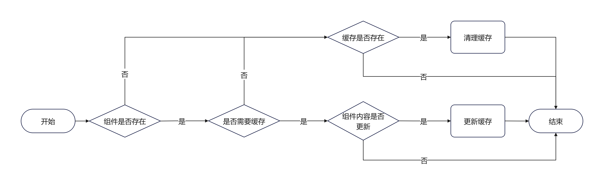
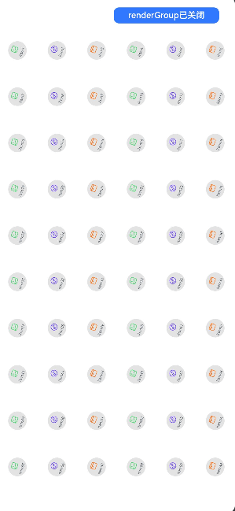
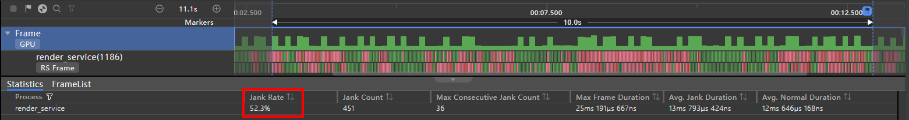
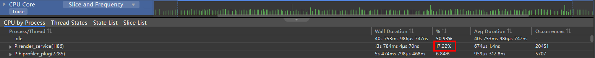
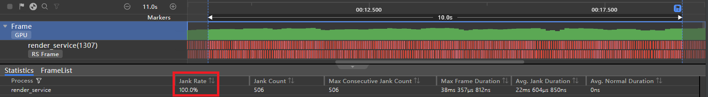
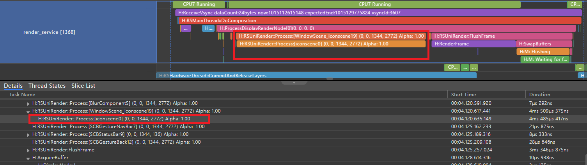
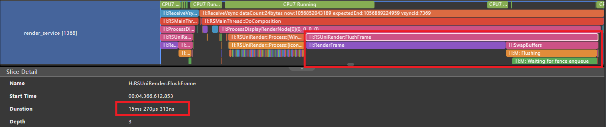

# 合理使用renderGroup

## 概述

在大型业务场景开发过程中，为了提升产品的视觉效果，经常大量使用属性动画和转场动画，当业务场景复杂度达到一定程度之后，就有可能出现卡顿的情况。本文推荐在单一页面上存在大量应用动效的组件时，使用renderGroup方法来解决卡顿问题，从而提升绘制性能。

renderGroup是组件通用方法，它代表了渲染绘制的一个组合。其核心功能就是标记组件，在绘制阶段将组件和其子组件的绘制结果进行合并并缓存，以达到复用的效果，从而降低绘制负载。renderGroup方法通过传参，主动标记组件是否开启缓存复用，其参数说明如下：

| **参数** | **类型**  | **说明**                                |
| ------ | ------- | ------------------------------------- |
| value  | boolean | false：关闭，true：开启。若不调用接口，组件标记默认值为false |

renderGroup本质上使用了用空间换时间的思想，如果缓存能够一直复用，那么就能一直节约绘制时间。要想达到上述的效果，组件每一帧的绘制结果都必须是相同的，也就是说如果组件内部的内容是固定的、不变的、静止的，只有这样，使用renderGroup才能生效。本文基于在内容固定的组件上添加动效这个场景，对组件通用方法renderGroup进行案例分析和性能对比。

## 原理说明

首次绘制组件时，若组件被标记为启用renderGroup状态，将对组件和其子组件进行离屏绘制，将绘制结果进行缓存。此后当需要重新绘制组件时，就会优先使用缓存而不必重新绘制了。从而降低绘制负载，优化渲染性能。

以下流程图展示了单个组件的渲染流程，涉及了缓存管理和使用，当组件树进入渲染管线开始渲染流程时，会对组件树上标脏的组件和其子组件进行递归渲染，若组件缓存存在，则将直接使用缓存进行绘制；若组件被标记为开启renderGroup时，则将进入绘制逻辑，递归绘制其所有子组件，并将绘制结果进行缓存。

图1 组件渲染流程


以下流程图展示了缓存管理上的流程细节。

当同时满足以下三个条件时，将进行缓存更新。

- 组件在当前组件树上
- 组件renderGroup被标记为true
- 组件内容被标脏

当满足以下任意条件时，将进行缓存清理。

- 组件不存在于组件树上
- 组件renderGroup被标记为false

图2 缓存管理流程



## 使用约束

结合上述原理，为了能使renderGroup功能生效，组件存在以下限制。

- 组件内容固定不变
  
  组件和其子组件各属性保持固定，不发生变化。如果组件内容不是固定的，也就是说其子组件中上存在某些属性变化或者样式变化的组件，此时如果使用renderGroup，那么缓存的利用率将大大下降，并且有可能需要不断执行缓存更新逻辑，在这种情况下，不仅不能优化卡顿效果，甚至还可能使卡顿恶化。例如：文本内容使用双向绑定的动态数据；图片资源使用gif格式；使用video组件播放视频。

- 子组件无动效
  
  由组件统一应用动效，其子组件均无动效。如果子组件上也应用动效，那么子组件相对父组件就不再是静止的，每一帧都有可能需要更新缓存，更新逻辑同样需要消耗系统资源。

## 使用场景

当在单一页面上存在大量应用动效的组件，并且这些组件均满足上述约束时，推荐使用renderGroup。

以下展示了一个使用场景的示例，首先场景中每个组件内部使用固定图片和文本内容，其次在每个组件上统一应用旋转和缩放动效，最后在场景中添加60个这样的组件。

图3 使用场景示例

 

## 推荐示例

以下展示了推荐场景的示例代码，分别是组件树结构以及自定义组件IconItem，场景采用grid布局，将多个IconItem放置在组件树上，每个IconItem内部使用固定图片和固定文本表示固定内容的组件。renderGroup方法在自定义组件IconItem内调用，通过开关按钮切换来关闭和开启renderGroup，通过[Profiler](./application-performance-analysis.md) Frame工具进行数据收集，从丢帧率、CPU使用率和GPU使用率三个方面，对比场景示例在关闭和开启renderGroup时的性能差异。

```ts
// Index.ets

import { IconItem } from './IconItem';

// IconItem相关数据
class IconItemSource {
  image: string | Resource = '';
  text: string | Resource = '';

  constructor(image: string | Resource = '', text: string | Resource = '') {
    this.image = image;
    this.text = text;
  }
}

@Entry
@Component
struct Index {
  // renderGroup接口是否开启
  @State renderGroupFlag: boolean = false;
  private iconItemSourceList: IconItemSource[] = [];

  aboutToAppear() {
    // 遍历添加60个IconItem的数据
    for (let index = 0; index < 20; index++) {
      const numStart: number = index * 3;
      // 此处循环使用三张图片资源
      this.iconItemSourceList.push(
        new IconItemSource($r('app.media.album'), `item${numStart + 1}`),
        new IconItemSource($r('app.media.applet'), `item${numStart + 2}`),
        new IconItemSource($r('app.media.cards'), `item${numStart + 3}`),
      );
    }
  }

  build() {
    Column() {
      Row() {
        Row() {
          Text('场景示例')
            .fontSize(24)
            .lineHeight(24)
            .fontColor(Color.Black)
            .fontWeight(FontWeight.Bold)
            .margin({ left: 30 })
        }

        // 动态切换renderGroup功能
        Stack({ alignContent: Alignment.End }) {
          Button(this.renderGroupFlag ? 'renderGroup已开启' : 'renderGroup已关闭', {
            type: ButtonType.Normal,
            stateEffect: true
          })
            .fontSize(12)
            .borderRadius(8)
            .backgroundColor(0x317aff)
            .width(150)
            .height(30)
            .margin({ right: 30 })
            .onClick(() => {
              this.renderGroupFlag = !this.renderGroupFlag;
              AppStorage.setOrCreate('renderGroupFlag', this.renderGroupFlag)
            })
        }
      }
      .height(56)
      .width('100%')
      .backgroundColor(Color.White)
      .justifyContent(FlexAlign.SpaceBetween)

      // IconItem放置在grid内
      GridRow({
        columns: 6,
        gutter: { x: 0, y: 0 },
        breakpoints: { value: ["400vp", "600vp", "800vp"],
          reference: BreakpointsReference.WindowSize },
        direction: GridRowDirection.Row
      }) {
        ForEach(this.iconItemSourceList, (item: IconItemSource) => {
          GridCol() {
            IconItem({ image: item.image, text: item.text })
              .transition(
                TransitionEffect.scale({ x: 0.5, y: 0.5 })
                  .animation({duration: 3000, curve: Curve.FastOutSlowIn, iterations: -1 })
                  .combine(TransitionEffect.rotate({ z: 1, angle: 360 })
                    .animation({ duration: 3000, curve: Curve.Linear, iterations: -1 }))
              )
          }
          .height(70)
          .width('25%')
        })
      }
      .width("100%")
      .height("100%")
    }
    .width('100%')
    .height('100%')
    .alignItems(HorizontalAlign.Center)
  }
}
```

```ts
//  IconItem.ets

@Component
export struct  IconItem  {
  @StorageLink('renderGroupFlag')  renderGroupFlag:  boolean  =  false;
  image:  string  |  Resource  =  '';
  text:  string  |  Resource  =  '';

  build()  {
    Flex({
      direction:  FlexDirection.Column,
      justifyContent:  FlexAlign.Center,
      alignContent:  FlexAlign.Center
    })  {
      Image(this.image)
        .height(20)
        .width(20)
        .objectFit(ImageFit.Contain)
        .margin({  left:  15  })

      Text(this.text)
        .fontSize(10)
        .fontColor("#  182431")
        .margin({  top:  5  })
        .width(50)
        .opacity(0.8)
        .textAlign(TextAlign.Center)
    }
    .backgroundColor('#  e3e3e3')
    .width(50)
    .height(50)
    .borderRadius(25)
    //  在IconItem内调用renderGroup，true为开启，false为关闭
    .renderGroup(this.renderGroupFlag)
  }
}
```

### 丢帧率分析

如图4所示，当关闭renderGroup时，在10秒内丢帧数多达451帧，对应的丢帧率为52.3%，这种高频率丢帧现象可能会导致画面呈现出卡顿感。而从图5中可以看出，在开启renderGroup之后，同样长度的时间段里并没有出现任何一次掉帧的现象。

图4 丢帧率（关闭renderGroup）



图5 丢帧率（开启renderGroup）


### CPU使用率分析

根据图6的数据，在关闭renderGroup的情况下，render_service进程在10秒内所使用的CPU资源百分比为17.22%。而在图7中可以看到，如果启动了renderGroup后，则同一时间内，该进程对CPU的使用率下降到了10.86%。这表明，启用renderGroup可以有效地减轻render_service进程对CPU的负载压力，提高系统性能。

图6 CPU使用率（关闭renderGroup）



图7 CPU使用率（开启renderGroup）


### GPU使用率分析

根据图8所示的数据，在没有开启renderGroup的情况下，GPU瞬时使用率曾一度达到过55%的高度，并且存在较大的波动。相反地，在图9中，可以看到在启动renderGroup后，GPU的使用率稳定在了16%左右，并且波动较小。这一结果表明，在优化GPU使用率方面，开启renderGroup具有更优的表现，并能带来更为稳定的性能表现。

图8 GPU使用率（关闭renderGroup）


图9 GPU使用率（开启renderGroup）


## 不推荐示例

如果在正例场景示例的基础上进行修改，在组件的子组件上应用动效，此时，不再满足子组件无动效的约束。

以下展示了对之前场景示例代码的修改，在自定义组件IconItem内部的系统组件Image上应用透明度渐变动效，renderGroup方法调用方式不变，依然通过Profiler Frame工具进行数据收集，从丢帧率、调用栈两个方面，对比场景示例修改后在关闭和开启renderGroup时的性能差异。

```ts
// IconItem.ets

@Component
export  struct IconItem {
  @StorageLink('renderGroupFlag') renderGroupFlag: boolean = false;
  image: string | Resource = '';
  text: string | Resource = '';

  build() {
    Flex({
      direction: FlexDirection.Column,
      justifyContent: FlexAlign.Center,
      alignContent: FlexAlign.Center
    }) {
      Image(this.image)
        .height(20)
        .width(20)
        .objectFit(ImageFit.Contain)
        .margin({ left: 15 })
          // 系统组件Image应用透明度渐变动效
        .transition(
          TransitionEffect.OPACITY.animation({ duration: 3000, curve: Curve.EaseIn, iterations: -1 })
        )

      Text(this.text)
        .fontSize(10)
        .fontColor("# 182431")
        .margin({ top: 5 })
        .width(50)
        .opacity(0.8)
        .textAlign(TextAlign.Center)
    }
    .backgroundColor('# e3e3e3')
    .width(50)
    .height(50)
    .borderRadius(25)
    // 在IconItem内调用renderGroup，true为开启，false为关闭
    .renderGroup(this.renderGroupFlag)
  }
}
```

### 丢帧率分析

查看丢帧率数据，图10中，在关闭renderGroup时，丢帧率达到了77.0%，丢帧数达到了648帧；图11中，在开启renderGroup时，丢帧率并没有降低，反而升高到了100.0%，也就是每一帧都出现了丢帧，而且此时的丢帧数同时也是总帧数下降到了506帧，总帧数比关闭renderGroup时还要低。

图10 反例场景——组件内部子组件应用动效（关闭renderGroup）


图11 反例场景——组件内部子组件应用动效（开启renderGroup）



### 调用栈分析

在图12中显示了当renderGroup功能关闭时，因为不需要维护缓存，所以在这个情况下，并不会调用到UpdateCacheSurface方法。然而，在图13中，我们可以看到在启动renderGroup功能后，Process这个预渲染的方法开始频繁地调用UpdateCacheSurface方法。这时所有组件的image子组件的每一帧都在发生变化，导致每一帧的各组件缓存都需要被更新，而这每一步都需要通过调用一次UpdateCacheSurface方法来完成。

图12 反例场景——组件内部子组件应用动效，调用栈信息（关闭renderGroup）



图13 反例场景——组件内部子组件应用动效，调用栈信息（开启renderGroup）


接着查看FlushFrame方法，此方法为分发绘制指令给gpu执行绘制操作，图14中，在关闭renderGroup时，渲染耗时3ms左右；图15中，在开启renderGroup时，由于大量的缓存更新需要重新绘制，渲染耗时15ms左右，是关闭时的5倍。

图14 反例场景——组件内部子组件应用动效，FlushFrame耗时（关闭renderGroup）


图15 反例场景——组件内部子组件应用动效，FlushFrame耗时（开启renderGroup）
