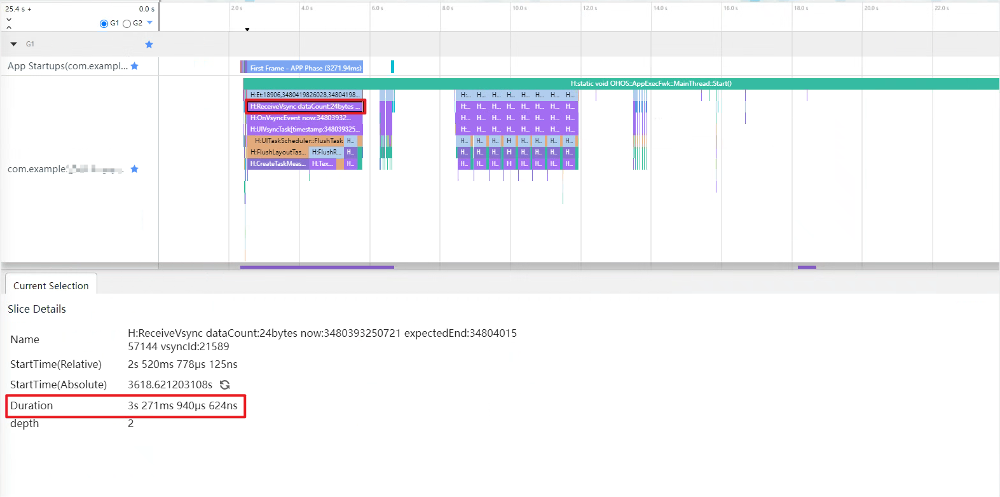
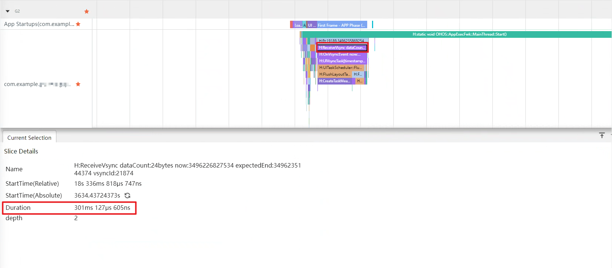

# 合理使用系统提供的接口
<!--Kit: Common-->
<!--Subsystem: Demo&Sample-->
<!--Owner: @mgy917-->
<!--Designer: @jiangwensai-->
<!--Tester: @Lyuxin-->
<!--Adviser: @huipeizi-->

## 简介

在应用开发中，经常会调用系统提供的接口，比如读取本地文件、处理服务端数据等等。若对接口使用不合理，可能引起延迟、卡顿、丢帧等性能问题。本文以如下系统提供的接口为例，总结了使用中的注意事项。

## wordBreak属性

零宽空格（Zero Width Space, ZWSP）是一个特殊的Unicode字符。它是一个不可见的字符，其宽度为零，不占用任何可见空间。在文本处理系统中，尽管它在视觉上是不可见的，但它在文本中确实存在，并可以作为潜在的断点，即允许在此位置断开行。这意味着如果一行文本过长需要自动换行时，文本可以在零宽空格的位置进行折行，而不影响单词的完整性。

虽然零宽空格在许多情况下都是有用的，但它也可能引起问题，特别是在文本处理和数据清洗中。不注意这些看不见的字符可能导致数据的意外错误、搜索失败、数据不一致等问题。因此，在处理来自不同源的文本数据时，了解和考虑这些不可见字符是非常重要的。

避免在文本组件内使用零宽空格(\u200b)的形式来设置断行规则，推荐使用[wordBreak](../reference/apis-arkui/arkui-ts/ts-basic-components-text.md#wordbreak11)，wordBreak在使用性能方面优于零宽空格。例如推荐用法为：Text(this.diskName).wordBreak(WordBreak.BREAK_ALL)。

### 反例

```ts
@CustomDialog
export struct DiskFormatDialog {
  private diskName: string = '';
  private customDialogController: CustomDialogController;
  
  build() {
    Column() {
      Text(this.diskName.split("").join("\u200B"))
      .textAlign(TextAlign.Start)
    }
  }
}
```

通过[SmartPerf Host](performance-optimization-using-smartperf-host.md)工具抓取Trace。启动时ReceiveVsync阶段耗时为3s271ms。



### 正例

```ts
@CustomDialog
export struct DiskFormatDialog {
  private diskName: string = '';
  private customDialogController: CustomDialogController;
    
  build() {
    Column() {
      Text(this.diskName)
      .textAlign(TextAlign.Start)
      .wordBreak(WordBreak.BREAK_ALL)
    }
  }
}
```

通过[SmartPerf Host](performance-optimization-using-smartperf-host.md)工具抓取Trace。启动时ReceiveVsync阶段耗时为301ms。



### 总结

使用零宽空格时（3s271ms）比使用wordBreak时（301ms）耗时更多。所以当需要使用类似方法时，使用wordBreak性能更优。
