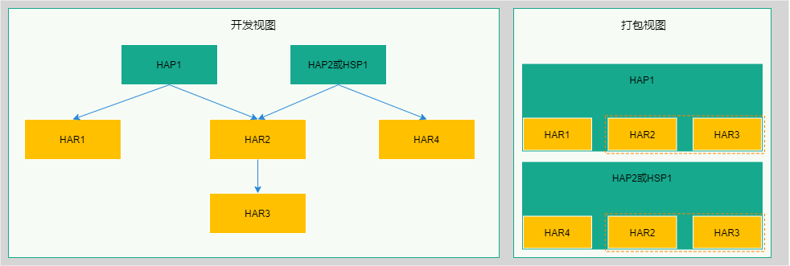

# 减小应用包大小

## 简介

减小应用包大小是提升应用下载、安装体验的重要方式之一。通过压缩、精简或者复用应用中的代码或资源，可以有效降低应用的大小，提升应用下载和安装速度，减少系统空间占用。

开发者可以参考下面三种方法减小应用包大小：

 - 配置so压缩选项，通过压缩so库来减小应用包大小。
 - 应用存在多包（HAP、HSP）的场景时，可以使用[HSP（Harmony Shared Package）](../quick-start/in-app-hsp.md)动态共享包在应用的多个包（HAP、HSP）之间共享代码和资源，消除使用[HAR（Harmony Archive）](../quick-start/har-package.md)静态共享包造成的多包（HAP、HSP）间代码和资源的重复拷贝，从而减小应用包大小。
 - 使用扫描工具扫描分析App、HAP、HSP包，根据输出的检测报告，采取相应措施优化应用。

## 减小应用包大小的方法

### 配置so压缩选项

当前DevEco Studio默认打包应用时不压缩so库文件，配置so压缩选项后，DevEco Studio会将so库文件以压缩形式打包到包中，从而减小应用包大小。

**配置方法**

修改应用模块配置文件module.json5中的[compressNativeLibs](../quick-start/module-configuration-file.md)字段，将值配置为true，重新编译、打包应用。

```json
{
  "module": { 
    // ...
    "compressNativeLibs": true // 标识libs库以压缩存储方式打包
  }
}
```

**so压缩效果**

以DevEco Studio中C++默认库文件为例，压缩前后的文件大小对比如下：

| 文件名                                  | 原始大小       | 压缩后大小     | 压缩率  |
| --------------------------------------- |---------------| -------------- | ----  |
| armeabi-v7a/libc++_shared.so            |1,108k         |386k             | 34%  |

### 多包场景下使用HSP共享代码和资源

当前系统提供了两种共享包，[HAR（Harmony Archive）](../quick-start/har-package.md)静态共享包和[HSP（Harmony Shared Package）](../quick-start/in-app-hsp.md)动态共享包。

HAR与HSP都是为了实现代码和资源的共享，都可以包含代码、C++库、资源和配置文件，最大的不同之处在于：HAR中的代码和资源跟随使用方编译，如果有多个使用方，它们的编译产物中会存在多份相同拷贝；而HSP中的代码和资源可以独立编译，运行时在一个进程中代码也只会存在一份。

在多包场景下，如果应用的多个HAP或HSP包使用HAR包实现代码和资源的共享，那么打包后的每个HAP或HSP包中都会存在一份共享HAR包的拷贝，导致App包中存在冗余代码和资源。如下图示例，应用模块HAP1和HAP2/HSP1都引用了HAR2和HAR3，打包后，App包中HAR2和HAR3存在多份重复拷贝，体积较大。



这种场景下，推荐开发者使用HSP代替HAR实现代码和资源共享。如下图示例，使用HSP2对原应用进行升级改造，打包后，App包中HAR2和HAR3只存在一份拷贝，HAR2、HAR3总大小大于HSP（11k）时，可以减小应用包大小。


### 使用扫描工具分析应用包

[扫描工具](../tools/app-check-tool.md)可用于分析检测应用包，根据不同的参数设定，扫描指定路径的App、HAP、HSP包内容并输出检测结果报告，为开发者优化包结构或排查问题提供数据支撑。目前扫描工具支持以下几种分析统计：

- 扫描重复文件。
- 扫描超出指定大小的文件。
- 统计分析各类型文件的总大小和占比。

根据扫描结果按照如下方式优化应用

1. 重复文件
    - 同一包内有重复资源，删除重复资源。
    - 多包（HAP、HSP）间重复资源，可以使用HSP实现资源的复用。

2. 较大文件
    - 确认是否为应用必需，是否可删除。
    - JPG、PNG、GIF等文件，可以考虑压缩。

3. 特定类型文件
    - so文件，通过配置so压缩选项来实现压缩打包。
    - JPG、PNG、GIF等文件，可以考虑压缩。