# 减少首帧绘制时的冗余操作

## 应用冷启动与加载绘制首页

应用冷启动即当启动应用时，后台没有该应用的进程，这时系统会重新创建一个新的进程分配给该应用。

应用冷启动过程大致可分成以下四个阶段：应用进程创建&初始化、Application&Ability初始化、Ability生命周期、加载绘制首页。

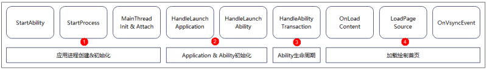

**加载绘制首页**不仅是应用冷启动的四个阶段之一，还是首帧绘制最重要的阶段。而它可以分为三个阶段：加载页面、测量和布局、渲染。本文从这三个阶段入手，分成下面三个场景进行案例优化。

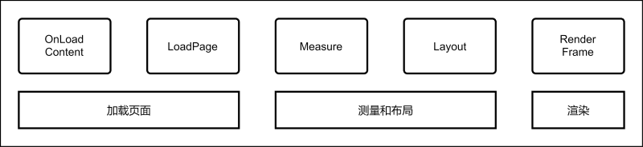

## 减少加载页面时间

减少加载页面时间可以通过按需加载、减少自定义组件生命周期耗时两种方法来实现。

#### 按需加载

按需加载可以避免一次性初始化和加载所有元素，从而使首帧绘制时加载页面阶段的创建列表元素时间大大减少，从而提升性能表现。具体可参考文档[列表场景性能提升实践](list-perf-improvment.md#懒加载)。

**案例：每一个列表元素都被初始化和加载，为了突出效果，方便观察，设定数组中的元素有1000个，使其在加载页面阶段创建列表内元素耗时大大增加。**

```ts
@Entry
@Component
struct AllLoad {
  @State arr: String[] = Array.from(Array<string>(1000), (val,i) =>i.toString());
  build() {
    List() {
      ForEach(this.arr, (item: string) => {
        ListItem() {
          Text(`item value: ${item}`)
            .fontSize(20)
            .margin({ left: 10 })
        }
      }, (item: string) => item.toString())
    }
  }
}
```

**优化：LazyForEach替换ForEach，避免一次性初始化和加载所有元素。**

```ts
class BasicDataSource implements IDataSource {
  private listeners: DataChangeListener[] = [];
  private originDataArray: string[] = [];

  public totalCount(): number {
    return 0;
  }

  public getData(index: number): string {
    return this.originDataArray[index];
  }

  // 注册数据改变的监听器
  registerDataChangeListener(listener: DataChangeListener): void {
    if (this.listeners.indexOf(listener) < 0) {
      console.info('add listener');
      this.listeners.push(listener);
    }
  }

  // 注销数据改变的监听器
  unregisterDataChangeListener(listener: DataChangeListener): void {
    const pos = this.listeners.indexOf(listener);
    if (pos >= 0) {
      console.info('remove listener');
      this.listeners.splice(pos, 1);
    }
  }

  // 通知组件重新加载所有数据
  notifyDataReload(): void {
    this.listeners.forEach(listener => {
      listener.onDataReloaded();
    })
  }

  // 通知组件index的位置有数据添加
  notifyDataAdd(index: number): void {
    this.listeners.forEach(listener => {
      listener.onDataAdd(index);
    })
  }

  // 通知组件index的位置有数据有变化
  notifyDataChange(index: number): void {
    this.listeners.forEach(listener => {
      listener.onDataChange(index);
    })
  }

  // 通知组件删除index位置的数据并刷新LazyForEach的展示内容
  notifyDataDelete(index: number): void {
    this.listeners.forEach(listener => {
      listener.onDataDelete(index);
    })
  }

  // 通知组件数据有移动
  notifyDataMove(from: number, to: number): void {
    this.listeners.forEach(listener => {
      listener.onDataMove(from, to);
    })
  }
}

class MyDataSource extends BasicDataSource {
  private dataArray: string[] = Array.from(Array<string>(1000), (val, i) => i.toString());

  public totalCount(): number {
    return this.dataArray.length;
  }

  public getData(index: number): string {
    return this.dataArray[index];
  }

  public addData(index: number, data: string): void {
    this.dataArray.splice(index, 0, data);
    this.notifyDataAdd(index);
  }

  public pushData(data: string): void {
    this.dataArray.push(data);
    this.notifyDataAdd(this.dataArray.length - 1);
  }
}

@Entry
@Component
struct SmartLoad {
  private data: MyDataSource = new MyDataSource();

  build() {
    List() {
      LazyForEach(this.data, (item: string) => {
        ListItem() {
          Text(`item value: ${item}`)
            .fontSize(20)
            .margin({ left: 10 })
        }
      }, (item:string) => item)
    }
  }
}
```

使用SmartPerf Host工具抓取优化前后的性能数据进行对比。

优化前页面Build耗时：

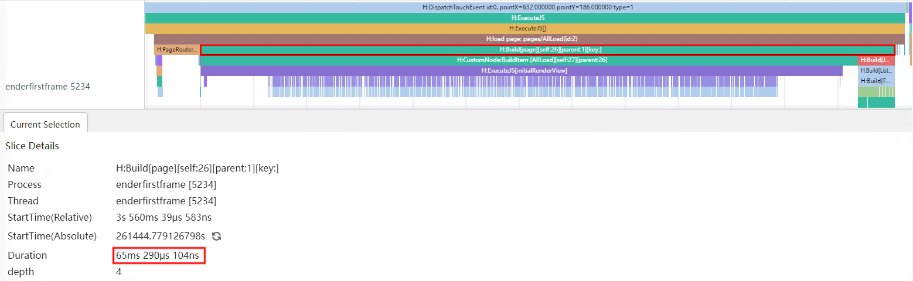

优化后页面Build耗时：

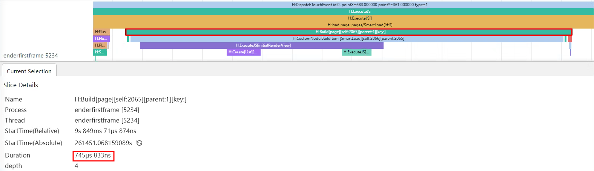

从trace图可以看出，使用ForEach时在Build阶段会创建所有元素，Build耗时65ms290μs，改为使用LazyForEach后Build耗时减少到745μs，性能收益明显。

#### 减少自定义组件生命周期时间

LoadPage阶段需要等待自定义组件生命周期aboutToAppear的高耗时任务完成， 导致LoadPage时间大量增加，阻塞主线程后续的布局渲染，所以自定义组件生命周期的耗时任务应当转为Worker线程任务，优先绘制页面，避免启动时阻塞在startWindowIcon页面。

**案例：自定义组件生命周期存在高耗时任务，阻塞主线程布局渲染。**

```ts
@Entry
@Component
struct TaskSync {
  @State private text: string = '';
  private count: number = 0;

  aboutToAppear() {
    this.text = 'hello world';
    this.computeTask(); // 同步任务
  }

  build() {
    Column({space: 10}) {
      Text(this.text).fontSize(50)
    }
    .width('100%')
    .height('100%')
    .padding(10)
  }

  computeTask() {
    this.count = 0;
    while (this.count < 100000000) {
      this.count++;
    }
    this.text = 'task complete';
  }
}
```

**优化：自定义组件生命周期的耗时任务转为Worker线程任务，优先绘制页面，再将Worker子线程结果发送到主线程并更新到页面。**

```ts
// TaskAsync.ets
import worker from '@ohos.worker';

@Entry
@Component
struct TaskAsync {
  @State private text: string = '';
  private workerInstance:worker.ThreadWorker = new worker.ThreadWorker('entry/ets/workers/worker.ets');

  aboutToAppear() {
    // 处理来自子线程的消息
    this.workerInstance.onmessage = (message)=> {
      console.info(`message from worker: ${JSON.stringify(message)}`);
      this.text = JSON.parse(JSON.stringify(message)).data;
      this.workerInstance.terminate();
    }
    this.text = 'hello world';
    // 执行Worker线程任务
    this.computeTaskAsync();
  }

  build() {
    Column({space: 10}) {
      Text(this.text).fontSize(50)
    }
    .width('100%')
    .height('100%')
    .padding(10)
  }
  private async computeTaskAsync(){
    // 发送消息到子线程
    this.workerInstance.postMessage('hello world')
  }
}
```

```ts
// worker.ets
import worker from '@ohos.worker';

let parentPort = worker.workerPort;

function computeTask(count: number) {
  while (count < 100000000) {
    count++;
  }
  return 'task complete';
}
// 处理来自主线程的消息
parentPort.onmessage = (message) => {
  console.info(`onmessage: ${JSON.stringify(message)}`);
  // 发送消息到主线程
  parentPort.postMessage(computeTask(0));
}
```

使用SmartPerf Host工具抓取优化前后的性能数据进行对比。

优化前loadpage耗时：

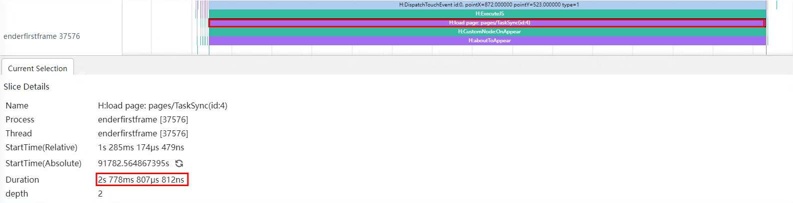

优化后loadpage耗时：


从trace图可以看出，优化前加载页面时loadpage耗时2s778ms807μs，其中主要耗时函数为自定义组件的生命周期函数aboutToAppear，将aboutToAppear中的耗时操作放到worker子线程中执行后，loadpage耗时减少到4ms745μs，页面加载时间大幅减少。

## 减少布局时间

减少布局时间可以通过异步加载和减少视图嵌套层次两种方法来实现。

#### 异步加载

同步加载的操作，使创建图像任务需要在主线程完成，页面布局Layout需要等待创建图像makePixelMap任务的执行，导致布局时间延长。相反，异步加载的操作，在其他线程完成，和页面布局Layout同时开始，且没有阻碍页面布局，所以页面布局更快，性能更好。但是，并不是所有的加载都必须使用异步加载，建议加载尺寸较小的本地图片时将syncLoad设为true，因为耗时较短，在主线程上执行即可。

**案例：使用Image组件同步加载高分辨率图片，阻塞UI线程，增加了页面布局总时间。**

```ts
@Entry
@Component
struct SyncLoadImage {
  @State arr: String[] = Array.from(Array<string>(100), (val,i) =>i.toString());
  build() {
    Column() {
      Row() {
        List() {
          ForEach(this.arr, (item: string) => {
            ListItem() {
              Image($r('app.media.4k'))
                .border({ width: 1 })
                .borderStyle(BorderStyle.Dashed)
                .height(100)
                .width(100)
                .syncLoad(true)
            }
          }, (item: string) => item.toString())
        }
      }
    }
  }
}
```

**优化：使用Image组件默认的异步加载方式加载图片，不阻塞UI线程，降低页面布局时间。**

```ts
@Entry
@Component
struct AsyncLoadImage {
  @State arr: String[] = Array.from(Array<string>(100), (val,i) =>i.toString());
    build() {
      Column() {
        Row() {
          List() {
            ForEach(this.arr, (item: string) => {
              ListItem() {
                Image($r('app.media.4k'))
                  .border({ width: 1 })
                  .borderStyle(BorderStyle.Dashed)
                  .height(100)
                  .width(100)
              }
            }, (item: string) => item.toString())
          }
        }
      }
  }
}
```

使用SmartPerf Host工具抓取优化前后的性能数据进行对比。

优化前布局耗时：

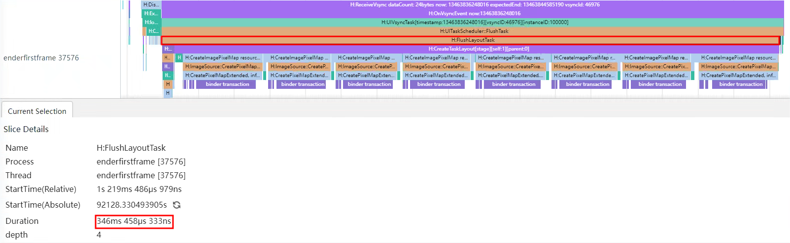

优化后布局耗时：

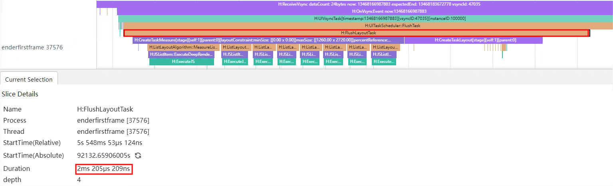

在优化前的trace图中可以看到，同步加载的每一张图片在参与布局时都会执行CreateImagePixelMap去创建图像，导致页面布局时间过长，FlushLayoutTask阶段耗时346ms458μs。图像使用异步加载进行优化后，页面布局时不再执行创建图像的任务，FlushLayoutTask阶段耗时减少到了2ms205μs，页面布局更快。

#### 减少视图嵌套层次

视图的嵌套层次会影响应用的性能。通过减少不合理的容器组件，可以使布局深度降低，布局时间减少，优化布局性能，提升用户体验。

**案例：通过Grid网格容器一次性加载1000个网格，并且额外使用3层Flex容器模拟不合理的深嵌套场景使布局时间增加。**

```ts
@Entry
@Component
struct Depth1 {
  @State number: Number[] = Array.from(Array<number>(1000), (val, i) => i);
  scroller: Scroller = new Scroller();

  build() {
    Column() {
      Grid(this.scroller) {
        ForEach(this.number, (item: number) => {
          GridItem() {
            Flex() {
              Flex() {
                Flex() {
                  Text(item.toString())
                    .fontSize(16)
                    .backgroundColor(0xF9CF93)
                    .width('100%')
                    .height(80)
                    .textAlign(TextAlign.Center)
                    .border({width:1})
                }
              }
            }
          }
        }, (item:string) => item)
      }
      .columnsTemplate('1fr 1fr 1fr 1fr 1fr')
      .columnsGap(0)
      .rowsGap(0)
      .size({ width: '100%', height: '100%' })
    }
  }
}
```

**优化：通过Grid网格容器一次性加载1000个网格，去除额外的不合理的布局容器，降低布局时间。**

```ts
@Entry
@Component
struct Depth2 {
  @State number: Number[] = Array.from(Array<number>(1000), (val, i) => i);
  scroller: Scroller = new Scroller();

  build() {
    Column() {
      Grid(this.scroller) {
        ForEach(this.number, (item: number) => {
          GridItem() {
            Text(item.toString())
              .fontSize(16)
              .backgroundColor(0xF9CF93)
              .width('100%')
              .height(80)
              .textAlign(TextAlign.Center)
              .border({width:1})
          }
        }, (item:string) => item)
      }
      .columnsTemplate('1fr 1fr 1fr 1fr 1fr')
      .columnsGap(0)
      .rowsGap(0)
      .size({ width: '100%', height: '100%' })
    }
  }
}
```

使用SmartPerf Host工具抓取优化前后的性能数据进行对比。

优化前布局耗时：

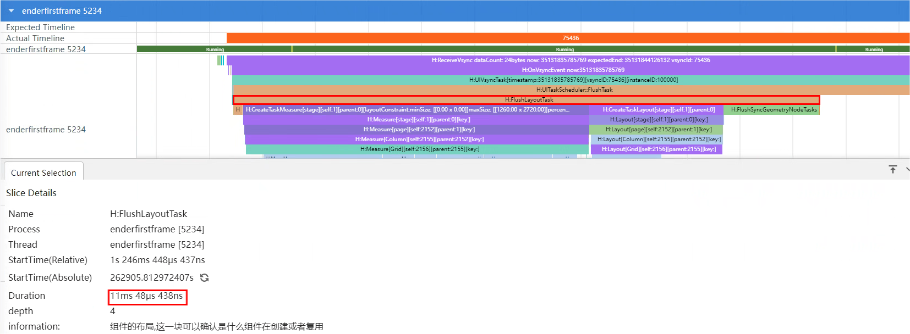

优化后布局耗时：

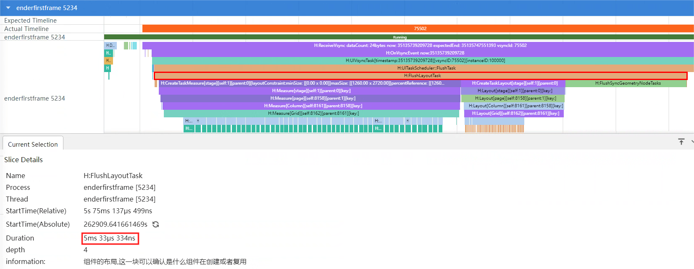

根据trace图对比优化前后的布局时长，优化前FlushLayoutTask阶段耗时11ms48μs，优化后FlushLayoutTask耗时减少到5ms33μs，布局时间明显减少。

## 减少渲染时间

减少渲染时间可以通过条件渲染替代显隐控制的方法来实现。

#### 条件渲染

使用Visibility、if条件判断都可以控制元素显示与隐藏，但是初次加载时使用visibility隐藏元素也会创建对应组件内容，因此加载绘制首页时，如果组件初始不需要显示，建议使用条件渲染替代显隐控制，以减少渲染时间。关于条件渲染和显隐控制更多内容可以参考[合理选择条件渲染和显隐控制](./proper-choice-between-if-and-visibility.md)。

**案例：初次渲染通过visibility属性隐藏Image组件，为了突出效果，方便观察，设置Image的数量为1000个。**

```ts
@Entry
@Component
struct VisibilityExample {
  private data: number[] = Array.from(Array<number>(1000), (val, i) => i);

  build() {
    Column() {
      // 隐藏不参与占位
      Text('None').fontSize(9).width('90%').fontColor(0xCCCCCC)
      Column() {
        ForEach(this.data, () => {
          Image($r('app.media.4k'))
            .width(20)
            .height(20)
        })
      }
      .visibility(Visibility.None)
    }.width('100%').margin({ top: 5 })
  }
}
```

**优化：通过条件渲染替代显隐控制。**

```ts
@Entry
@Component
struct IsVisibleExample {
  @State isVisible: boolean = false;
  private data: number[] = Array.from(Array<number>(1000), (val, i) => i);

  build() {
    Column() {
      // 隐藏不参与占位
      Text('None').fontSize(9).width('90%').fontColor(0xCCCCCC)
      if (this.isVisible) {
        Column() {
          ForEach(this.data, () => {
            Image($r('app.media.4k'))
              .width(20)
              .height(20)
          })
        }
      }
    }.width('100%').margin({ top: 5 })
  }
}
```

使用SmartPerf Host工具抓取优化前后的性能数据进行对比。

优化前页面Build耗时：

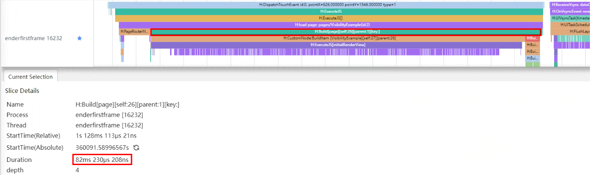

优化前render_service首帧耗时：

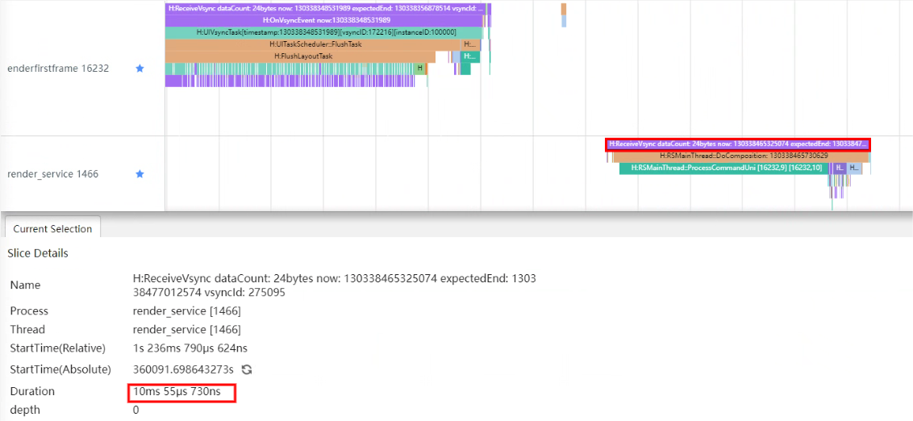

优化后Build耗时：

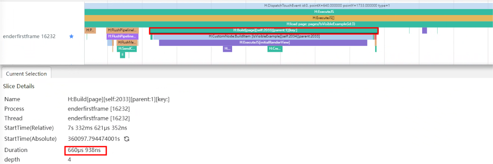

优化后render_service首帧耗时：

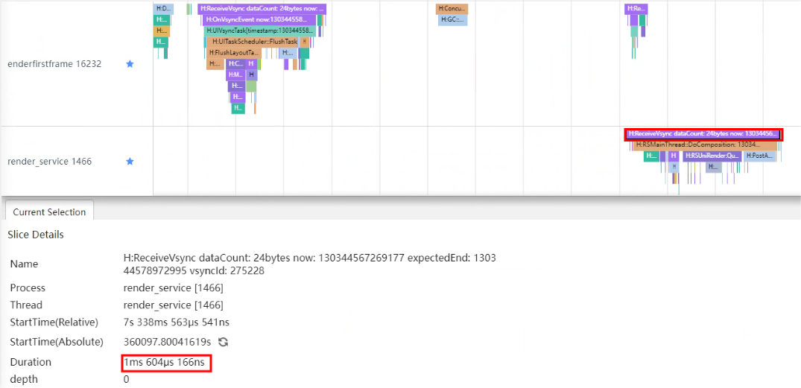

**说明**：在App泳道找到页面加载后第一个ReceiveVsync，其中的Trace标签H:MarshRSTransactionData携带参数transactionFlag，在render_service泳道找到相同transactionFlag的标签H:RSMainThread::ProcessCommandUni，其所属的ReceiveVsync时长就是render_service首帧耗时。

从trace图可以看出，优化前使用Visibility.None隐藏图片后在Build阶段仍然有Image元素创建，Build耗时82ms230μs，使用if else隐藏图片后Build阶段耗时减少到660μs，显著减少页面加载耗时。同时优化前应用的render_service首帧耗时为10ms55μs，而优化后减少到了1ms604μs，渲染时间明显减少。