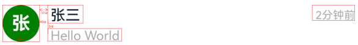
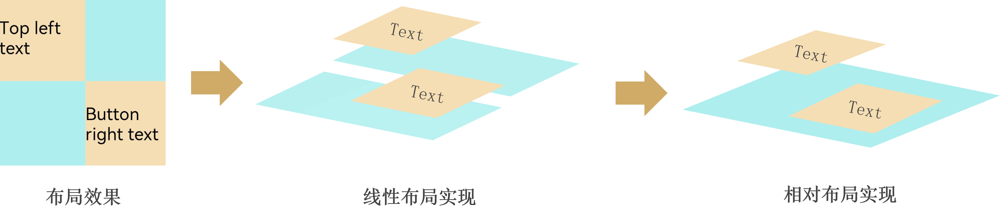

# 优化布局性能

## 背景介绍

应用开发中的用户界面（UI）布局是用户与应用程序交互的关键部分。使用不同类型的布局可以将页面排布的更加美观，但也容易带来不合理的布局。不合理的布局虽然能在界面显示上达到相同效果，但是过度的布局计算，界面嵌套带来了渲染和计算的大量开销，造成性能的衰退，本文重点介绍了几种常见的布局功能和适用场景，同时提供了几种优化布局结构的方法。

## 常用布局

布局是UI的必要元素，它定义了组件在界面中的位置。ArkUI框架提供了多种布局方式，除了基础的[线性布局](../ui/arkts-layout-development-linear.md)（[Row](../reference/arkui-ts/ts-container-row.md)/[Column](../reference/arkui-ts/ts-container-column.md)）、[层叠布局](../ui/arkts-layout-development-stack-layout.md)（[Stack](../reference/arkui-ts/ts-container-stack.md)）、[弹性布局](../ui/arkts-layout-development-flex-layout.md)（[Flex](../reference/arkui-ts/ts-container-flex.md)）、[相对布局](../ui/arkts-layout-development-relative-layout.md)（[RelativeContainer](../reference/arkui-ts/ts-container-relativecontainer.md)）、[栅格布局](../ui/arkts-layout-development-grid-layout.md)（[GridCol](../reference/arkui-ts/ts-container-gridcol.md)）外，也提供了相对复杂的[列表](../ui/arkts-layout-development-create-list.md)（[List](../reference/arkui-ts/ts-container-list.md)）、[网格](../ui/arkts-layout-development-create-grid.md)（[Grid](../reference/arkui-ts/ts-container-grid.md)/[GridItem](../reference/arkui-ts/ts-container-griditem.md)）、[轮播](../ui/arkts-layout-development-create-looping.md)（[Swiper](../reference/arkui-ts/ts-container-swiper.md)）。

## 优化布局结构

### 减少嵌套层级

布局的嵌套层次过深会导致在创建节点及进行布局时耗费更多时间。因此开发者在开发时，应避免冗余的嵌套或者使用扁平化布局来优化嵌套层次。

**避免冗余的嵌套**

冗余的嵌套会带来不必要的组件节点，加深组件树的层级。例如，内部容器和外部容器是相同的布局方向，内部容器形成的布局效果可以用外部容器代替，对于这类冗余的容器，应该尽量优化，减少嵌套深度。

反例：

使用了Grid来实现一个网格，但在外层套了3层包含不同属性参数的Stack容器：

```ts
@Entry
@Component
struct AspectRatioExample12 {
    @State children: Number[] = Array.from(Array<number>(900), (v, k) => k);
    
    build() {
      Scroll() {
      Grid() {
        ForEach(this.children, (item: Number[]) => {
          GridItem() {
            Stack() {  
              Stack() {  
                Stack() {  
                  Text(item.toString())  
                }.size({ width: "100%"})  
              }.backgroundColor(Color.Yellow)  
            }.backgroundColor(Color.Pink)  
          }  
        }, (item: string) => item)  
      }  
      .columnsTemplate('1fr 1fr 1fr 1fr')  
      .columnsGap(0)  
      .rowsGap(0)  
      .size({ width: "100%", height: "100%" })  
    }  
  }  
}

```

通过查看组件树结构，发现三层Stack容器设置了不同的属性参数，可以使用GridItem的属性参数实现同样的UI效果。因此，三层Stack容器是冗余的容器，可以去掉，只留下GridItem作为组件节点。


```
└─┬Scroll
  └─┬Grid
    ├─┬GridItem
    │ └─┬Stack
    │   └─┬Stack
    │     └─┬Stack
    │       └──Text
    ├──GridItem
    ├──GridItem
```

正例：

通过减少冗余的Stack容器嵌套，每个GridItem的组件数比上面少了3个：

```ts
@Entry  
@Component  
struct AspectRatioExample11 {  
  @State children: Number[] = Array.from(Array<number>(900), (v, k) => k);  
  
  build() {  
    Scroll() {  
      Grid() {  
        ForEach(this.children, (item: Number[]) => {  
          GridItem() {  
            Text(item.toString())  
          }.backgroundColor(Color.Yellow)  
        }, (item: string) => item)  
      }  
      .columnsTemplate('1fr 1fr 1fr 1fr')  
      .columnsGap(0)  
      .rowsGap(0)  
      .size({ width: "100%", height: "100%" })  
    }  
  }  
}
```

通过查看该组件树层级结构如下：

```
└─┬Scroll
  └─┬Grid
    ├─┬GridItem
    │ └──Text
    ├──GridItem
    ├──GridItem
```

**使用扁平化布局优化嵌套层级**

开发者在实现自适应布局的时候，常使用Flex来达到弹性效果，这可能会造成多级嵌套。建议采用相对布局RelativeContainer进行扁平化布局，有效减少容器的嵌套层级，减少组件的创建时间。

例如，以下是一个自适应的效果：


反例：

下述代码使用线性布局实现以上UI：

```ts
@Entry  
@Component  
struct MyComponent {  
  build() {
    Row() {  
      Column() {  
        Flex({ justifyContent: FlexAlign.Center, alignItems: ItemAlign.Center }) {  
          Text('张')  
          // 属性参数见正例  
        }  
        .width("40vp")  
        .height("40vp")  
      }.height("100%").justifyContent(FlexAlign.Center)  
      //body  
      Flex({ direction: FlexDirection.Column, justifyContent: FlexAlign.Start }) {  
          Flex({ direction: FlexDirection.Column, justifyContent: FlexAlign.Center }) {  
          Flex({ direction: FlexDirection.Row,  
            justifyContent: FlexAlign.SpaceBetween, alignItems: ItemAlign.Center }) {  
            //Phone number or first name  
            Text('张三')  
             // 属性参数见正例  

            //Date Time  
            Text('2分钟前')  
             // 属性参数见正例 
             }  
          .width("100%").height(22)  
  
          Row() {  
            Text() {  
              //Content Abbreviations for Latest News  
              Span('Hello World'.replace(new RegExp("/[\r\n]/g"), " "))  
                .fontSize("14fp")  
                .fontColor('# 66182431')  
            }  
            .maxLines(1)  
            .textOverflow({ overflow: TextOverflow.Ellipsis })  
          }  
          .alignSelf(ItemAlign.Start)  
          .alignItems(VerticalAlign.Top)  
          .width("100%")  
          .height(19)  
          .margin({ top: "2vp" })  
        }.width("100%")  
        .height("100%")  
      }  
      .layoutWeight(1)  
      .height("100%")  
      .padding({ left: "12vp" })  
    }  
    .alignItems(VerticalAlign.Top)  
    .width("100%")  
    .height("100%")  
  }  
}
```

通过查看该组件树层级结构如下：

```
└─┬Row
  ├──┬Column
  │  └─┬Flex
  │    └──Text
  └─┬Flex
    └─┬Flex
      │ └─┬Flex
      │   ├──Text
      │   └──Text
      └─┬Row
        └──Text
```

为了将4个元素放到合适的位置，开发者使用了11个组件，树深度为5，实际上是不合理的。

分析元素之间的布局关系可以得到如下：



正例：

从上图得到一个明确的相对布局位置关系，该场景可以使用相对布局的形式来优化，具体代码实现如下：

```ts
@Entry  
@Component  
struct MyComponent {  
  build() {  
    Row() {  
      RelativeContainer() {  
        Text('张')  
          .fontSize('20.0vp')  
          .fontWeight(FontWeight.Bold)  
          .fontColor(Color.White)  
          .height('40vp')  
          .width('40vp')  
          .textAlign(TextAlign.Center)  
          .clip(new Circle({ width: '40vp', height: '40vp' }))  
          .backgroundColor(Color.Green)  
          .alignRules({  
            center: { anchor: "__container__", align: VerticalAlign.Center },  
            left: { anchor: "__container__", align: HorizontalAlign.Start }  
          })  
          .id('head')  
        Text('张三')  
          .fontSize('16.0fp')  
          .textOverflow({ overflow: TextOverflow.Ellipsis })  
          .fontColor('# ff182431')  
          .maxLines(1)  
          .fontWeight(FontWeight.Medium)  
          .padding({ left: '12vp' })  
          .height(22)  
          .alignRules({  
            top: { anchor: 'head', align: VerticalAlign.Top },  
            left: { anchor: 'head', align: HorizontalAlign.End }  
          })  
          .id('name')  
        Text('2分钟前')  
          .fontColor('# 66182431')  
          .fontSize('12fp')  
          .maxLines(1)  
          .height(22)  
          .alignRules({  
            top: { anchor: 'head', align: VerticalAlign.Top },  
            right: { anchor: '__container__', align: HorizontalAlign.End }  
          })  
          .id("time")  
        Text() {  
          //Content Abbreviations for Latest News  
          Span('Hello World'.replace(new RegExp("/[\r\n]/g"), " "))  
            .fontSize('14fp')  
            .fontColor('# 66182431')  
        }  
        .maxLines(1)  
        .textOverflow({ overflow: TextOverflow.Ellipsis })  
        .width('100%')  
        .height(19)  
        .margin({ top: '2vp' })  
        .padding({ left: '12vp' })  
        .alignRules({  
          top: { anchor: 'name', align: VerticalAlign.Bottom },  
          left: { anchor: 'head', align: HorizontalAlign.End }  
        })  
        .id('content')  
      }  
      .width('100%').height('100%')  
      .border({ width: 1, color: "# 6699FF" })  
    }  
    .height('100%')  
  }  
}
```

通过减少嵌套层数后可以发现，布局实现了相同的效果，但是组件层级减少了3层，使用组件数也减少了6个。

```
└─┬RelativeContainer
  ├──Text
  ├──Text
  ├──Text
  └──Text
```

从上述案例中可以看到，使用扁平化布局逻辑概念设计更清晰，避免使用不参与绘制的布局组件，优化性能并减少占用内存。这种将一棵深度很高的UI树，改造为将内容排布到同一个节点下的思路，为扁平化布局。如下图所示，采用扁平化布局去除了中间冗余的两层布局节点。



使用扁平化布局推荐使用[RelativeContainer](../reference/arkui-ts/ts-container-relativecontainer.md)、[绝对定位](../reference/arkui-ts/ts-universal-attributes-location.md)、[自定义布局](../reference/arkui-ts/ts-custom-component-lifecycle.md)、[Grid组件](../reference/arkui-ts/ts-container-grid.md)等

### 使用高性能布局组件

**使用Column/Row替换Flex容器**

如果使用Flex布局容器，只是为了实现横向或者纵向的布局。那直接使用Row、Column容器反而能够提升渲染性能。关于Flex带来的性能影响可以参考《[Flex布局性能提升使用指导](flex-development-performance-boost.md)》。

使用Column、Row替换Flex容器组件避免二次渲染的案例见：《[性能提升的其他方法](arkts-performance-improvement-recommendation.md)》

**适当减少使用if/else条件渲染**

在ArkUI的build函数里，if/else也会被当成一个组件，在组件树上也是一个节点。对于一些在不同条件下展示不同效果的场景，基本布局不变，能够通过改变属性来进行控制界面变更的场景下，尽量减少if/else的方式来进行界面内容的切换，因为使用if/else不仅会增加一层节点，而且还有可能造成界面的重排与重绘。

反例：

下述代码中通过判断isVisible的值控制Image组件显示，这会导致在切换选择的过程中，不停创建和销毁Image组件元素。

```ts
@Entry  
@Component  
struct TopicItem {  
  @State isVisible : Boolean = true;  
  
  build() {  
    Stack() {  
      Column(){  
        if (this.isVisible) {  
          Image($r('app.media.icon')).width('25%').height('12.5%')  
          Image($r('app.media.icon')).width('25%').height('12.5%')  
          Image($r('app.media.icon')).width('25%').height('12.5%')  
          Image($r('app.media.icon')).width('25%').height('12.5%')  
        }  
      }  
      Column() {  
        Row().width(300).height(200).backgroundColor(Color.Pink)  
      }  
    }  
  }  
}
```

下图为isVisible值不同时组件树的情况：

```
isVisible为true：
└─┬Stack
  ├─┬Column
  │ ├──Image
  │ ├──Image
  │ ├──Image
  │ └──Image
  └─┬Column
    └──Row

isVisible为false：
└─┬Stack
  ├──Column
  └─┬Column
    └──Row
```

正例：

下面例子通过visibility属性来控制图片的显隐，避免if/else条件渲染可能带来的重排与重绘。

```ts
@Entry  
@Component  
struct TopicItem {  
  @State isVisible : Boolean = true;  
  
  build() {  
    Stack() {  
      Column(){  
          Image($r('app.media.icon'))  
            .width('25%').height('12.5%').visibility(this.isVisible ? Visibility.Visible : Visibility.None)  
          Image($r('app.media.icon'))  
            .width('25%').height('12.5%').visibility(this.isVisible ? Visibility.Visible : Visibility.None)  
          Image($r('app.media.icon'))  
            .width('25%').height('12.5%').visibility(this.isVisible ? Visibility.Visible : Visibility.None)  
          Image($r('app.media.icon'))  
            .width('25%').height('12.5%').visibility(this.isVisible ? Visibility.Visible : Visibility.None)  
      }  
      Column() {  
        Row().width(300).height(200).backgroundColor(Color.Pink)  
      }  
    }  
  }  
}
```

说明：上述情况考虑的是性能优先的场景，而当开发者优先考虑内存时，建议使用if/else控制图片的显隐。

## 优化布局时间

布局的嵌套层次过深会导致在创建节点及进行布局时耗费更多时间。因此开发者在开发时，应避免冗余的嵌套或者使用扁平化布局来优化嵌套层次。

反例：
使用线性布局，布局耗时166ms313us。

```ts

import measure from '@ohos.measure';
import prompt from '@ohos.prompt';

@Entry
@Component
struct PerformanceRelative {
  @State message: string = 'Hello World'
  @State textWidth: string = "";

  build() {
    Column() {
      Image($r("app.media.app_icon")).width("100%").height(300).margin({ bottom: 20 })
      Row() {
        Blank()
        Column() {
          Image($r("app.media.app_icon")).margin({ bottom: 4 }).width(40).aspectRatio(1)
          Text("Name")
        }.margin({ left: 8, right: 8 })
      }.position({ y: 280 }).width("100%")
      // Empty row
      Row().height(this.textWidth)
      Column() {
        Row() {
          Text("Singapore").fontSize(20).fontWeight(FontWeight.Bolder)
            .margin(8)
            .textAlign(TextAlign.Start)
        }.width("100%").justifyContent(FlexAlign.Start)

        Flex({ alignItems: ItemAlign.Center }) {
          Text("Camera").flexShrink(0)
            .margin({ right: 8 })
          TextInput()
        }.margin(8)

        Flex({ alignItems: ItemAlign.Center }) {
          Text("Settings").flexShrink(0)
            .margin({ right: 8 })
          TextInput()
        }.margin(8)

        Row() {
          Column() {
            Image($r("app.media.app_icon")).width(80).aspectRatio(1).margin({ bottom: 8 })
            Text("Description")
          }.margin(8)

          Column() {
            Text("Title").fontWeight(FontWeight.Bold).margin({ bottom: 8 })
            Text("Long Text")
          }.margin(8).layoutWeight(1).alignItems(HorizontalAlign.Start)
        }.margin(8).width("100%").alignItems(VerticalAlign.Top)
      }.layoutWeight(1)

      Flex({ justifyContent: FlexAlign.End }) {
        Button("Upload").margin(8)
        Button("Discard").margin(8)
      }
    }
    .width("100%").height("100%")
  }
}

```

正例：
使用相对布局上述界面，减少了组件的嵌套深度以及组件个数，布局耗时123ms278us。

```ts

@Entry
@Component
struct RelativePerformance {
  @State message: string = 'Hello World'

  build() {
    RelativeContainer(){
      Image($r("app.media.app_icon"))
        .height(300)
        .width("100%")
        .id("topImage")
        .alignRules({
          left: { anchor: "__container__", align: HorizontalAlign.Start },
          top: {anchor: "__container__", align: VerticalAlign.Top }
        })
      Image($r("app.media.app_icon"))
        .width(40)
        .aspectRatio(1)
        .margin(4)
        .id("topCornerImage")
        .alignRules({
          right: { anchor: "__container__", align: HorizontalAlign.End },
          center: {anchor: "topImage", align: VerticalAlign.Bottom }
        })
      Text("Name")
        .id("name")
        .margin(4)
        .alignRules({
          left: { anchor: "topCornerImage", align: HorizontalAlign.Start },
          top: {anchor: "topCornerImage", align: VerticalAlign.Bottom }
        })
      Text("Singapore")
        .margin(8)
        .fontWeight(FontWeight.Bolder)
        .fontSize(20)
        .id("singapore")
        .alignRules({
          left: { anchor: "__container__", align: HorizontalAlign.Start },
          top: {anchor: "name", align: VerticalAlign.Bottom }
        })
      Text("Camera")
        .margin(8)
        .id("camera")
        .alignRules({
          left: { anchor: "__container__", align: HorizontalAlign.Start },
          top: {anchor: "singapore", align: VerticalAlign.Bottom }
        })
      TextInput()
        .id("cameraInput")
        .alignRules({
          left: { anchor: "camera", align: HorizontalAlign.End },
          right:{ anchor: "__container__", align: HorizontalAlign.End },
          top: {anchor: "camera", align: VerticalAlign.Top },
          bottom: { anchor: "camera", align: VerticalAlign.Bottom }
        })
      Text("Settings")
        .margin(8)
        .id("settings")
        .alignRules({
          left: { anchor: "__container__", align: HorizontalAlign.Start },
          top: {anchor: "camera", align: VerticalAlign.Bottom }
        })
      TextInput()
        .id("settingInput")
        .alignRules({
          left: { anchor: "settings", align: HorizontalAlign.End },
          right:{ anchor: "__container__", align: HorizontalAlign.End },
          top: {anchor: "settings", align: VerticalAlign.Top },
          bottom: { anchor: "settings", align: VerticalAlign.Bottom }
        })
      Image($r("app.media.app_icon"))
        .id("descriptionIcon")
        .margin(8)
        .width(80)
        .aspectRatio(1)
        .alignRules({
          left: { anchor: "__container__", align: HorizontalAlign.Start },
          top: {anchor: "settings", align: VerticalAlign.Bottom }
        })
      Text("Description")
        .id("description")
        .margin(8)
        .alignRules({
          left: { anchor: "__container__", align: HorizontalAlign.Start },
          top: {anchor: "descriptionIcon", align: VerticalAlign.Bottom }
        })
      Text("Title")
        .fontWeight(FontWeight.Bold)
        .id("title")
        .margin(8)
        .alignRules({
          left: { anchor: "description", align: HorizontalAlign.End },
          top: {anchor: "descriptionIcon", align: VerticalAlign.Top }
        })
      Text("Long Text")
        .id("longText")
        .margin(8)
        .alignRules({
          left: { anchor: "description", align: HorizontalAlign.End },
          right: { anchor: "__container__", align: HorizontalAlign.End },
          top: {anchor: "title", align: VerticalAlign.Bottom }
        })
      Button("Discard")
        .id("discard")
        .margin(8)
        .alignRules({
          right: { anchor: "__container__", align: HorizontalAlign.End },
          bottom: {anchor: "__container__", align: VerticalAlign.Bottom }
        })
      Button("Upload")
        .id("upload")
        .margin(8)
        .alignRules({
          right: { anchor: "discard", align: HorizontalAlign.Start },
          bottom: {anchor: "__container__", align: VerticalAlign.Bottom }
        })
    }.width("100%").height("100%")
  }
}

```


## 优化布局工具介绍

[DevEco Studio](../quick-start/deveco-studio-user-guide-for-openharmony.md)内置ArkUI Inspector工具，开发者可以使用ArkUI
Inspector，在DevEco Studio上查看应用在真机上的UI显示效果。利用ArkUI Inspector工具，开发者可以快速定位布局不理想或其他UI相关问题，同时也可以观察和了解不同组件之间的布局关系和属性。