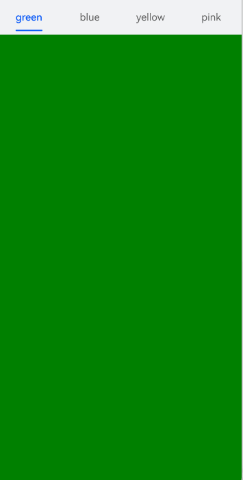
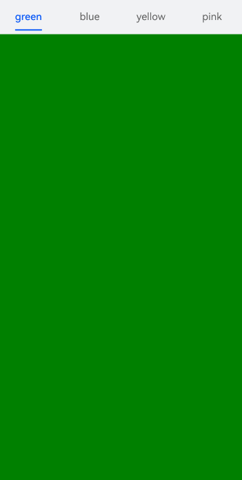
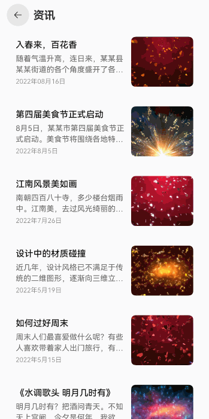
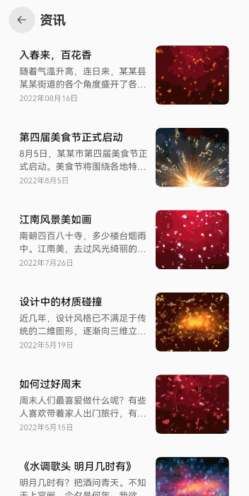

# 应用闪屏问题解决方案

## 概述

在开发调试过程中，有时会遇到应用出现非预期的闪动，这些闪动现象统称为闪屏问题。这些闪屏问题触发原因不同，表现形式不同，但都会对应用的体验性和流畅度产生影响。

本文将概述如下几种常见的闪屏场景，对其成因进行深入分析，并提供针对性解决方案，以帮助开发者有效地应对这些问题。

- 动画过程闪屏
- 刷新过程闪屏

## 常见问题

### 动画过程中，应用连续点击场景下的闪屏问题

**问题现象**

在经过连续点击后，图标大小会出现不正常的放大缩小，产生闪屏问题。


```ts
@Entry
@Component
struct ClickError {
  @State scaleValue: number = 0.5; // 缩放比
  @State animated: boolean = true; // 控制放大缩小

  build() {
    Stack() {
      Stack() {
        Text('click')
          .fontSize(45)
          .fontColor(Color.White)
      }
      .borderRadius(50)
      .width(100)
      .height(100)
      .backgroundColor('#e6cfe6')
      .scale({ x: this.scaleValue, y: this.scaleValue })
      .onClick(() => {
        this.getUIContext().animateTo({
          curve: Curve.EaseInOut,
          duration: 350,
          onFinish: () => {
            // 动画结束判断最后缩放大小
            const EPSILON: number = 1e-6;
            if (Math.abs(this.scaleValue - 0.5) < EPSILON) {
              this.scaleValue = 1;
            } else {
              this.scaleValue = 2;
            }
          }
        }, () => {
          this.animated = !this.animated;
          this.scaleValue = this.animated ? 0.5 : 2.5;
        })
      })
    }
    .height('100%')
    .width('100%')
  }
}
```

**可能原因**

应用在动画结束回调中，修改了属性的值。在图标连续放大缩小过程中，既有动画连续地改变属性的值，又有结束回调直接改变属性的值，造成过程中的值异常，效果不符合预期。一般在所有动画结束后可恢复正常，但会有跳变。

**解决措施**

- 尽量不在动画结束回调中设值，所有的设值都通过动画下发，让系统自动处理动画的衔接；
- 如果一定要在动画结束回调中设值，可以通过计数器等方法，判断属性上是否还有动画。只有属性上最后一个动画结束时，结束回调中才设值，避免因动画打断造成异常。

```ts
@Entry
@Component
struct ClickRight {
  @State scaleValue: number = 0.5; // 缩放比
  @State animated: boolean = true; // 控制放大缩小
  @State cnt: number = 0; // 执行次数计数器

  build() {
    Stack() {
      Stack() {
        Text('click')
          .fontSize(45)
          .fontColor(Color.White)
      }
      .borderRadius(50)
      .width(100)
      .height(100)
      .backgroundColor('#e6cfe6')
      .scale({ x: this.scaleValue, y: this.scaleValue })
      .onClick(() => {
        // 下发动画时，计数加1
        this.cnt = this.cnt + 1;
        this.getUIContext().animateTo({
          curve: Curve.EaseInOut,
          duration: 350,
          onFinish: () => {
            // 动画结束时，计数减1
            this.cnt = this.cnt - 1;
            // 计数为0表示当前最后一次动画结束
            if (this.cnt === 0) {
              // 动画结束判断最后缩放大小
              const EPSILON: number = 1e-6;
              if (Math.abs(this.scaleValue - 0.5) < EPSILON) {
                this.scaleValue = 1;
              } else {
                this.scaleValue = 2;
              }
            }
          }
        }, () => {
          this.animated = !this.animated;
          this.scaleValue = this.animated ? 0.5 : 2.5;
        })
      })
    }
    .height('100%')
    .width('100%')
  }
}
```

运行效果如下图所示。


### 动画过程中，Tabs页签切换场景下的闪屏问题

**问题现象**

滑动Tabs组件时，上方标签不能同步更新，在下方内容完全切换后才会闪动跳转，产生闪屏问题。



```ts
@Entry
@Component
struct TabsError {
  tabsWidth: number = 100;
  @State currentIndex: number = 0;
  @State animationDuration: number = 300;
  @State indicatorLeftMargin: number = 0;
  @State indicatorWidth: number = 0;
  private textInfos: [number, number][] = [];
  private isStartAnimateTo: boolean = false;

  @Builder
  tabBuilder(index: number, name: string) {
    Column() {
      Text(name)
        .fontSize(16)
        .fontColor(this.currentIndex === index ? $r('sys.color.brand') : $r('sys.color.ohos_id_color_text_secondary'))
        .fontWeight(this.currentIndex === index ? 500 : 400)
        .id(index.toString())
        .onAreaChange((_oldValue: Area, newValue: Area) => {
          this.textInfos[index] = [newValue.globalPosition.x as number, newValue.width as number];
          if (this.currentIndex === index && !this.isStartAnimateTo) {
            this.indicatorLeftMargin = this.textInfos[index][0];
            this.indicatorWidth = this.textInfos[index][1];
          }
        })
    }.width('100%')
  }

  build() {
    Stack({ alignContent: Alignment.TopStart }) {
      Tabs({ barPosition: BarPosition.Start }) {
        TabContent() {
          Column()
            .width('100%')
            .height('100%')
            .backgroundColor(Color.Green)
            .expandSafeArea([SafeAreaType.SYSTEM], [SafeAreaEdge.TOP, SafeAreaEdge.BOTTOM])
        }
        .tabBar(this.tabBuilder(0, 'green'))
        .expandSafeArea([SafeAreaType.SYSTEM], [SafeAreaEdge.TOP, SafeAreaEdge.BOTTOM])

        TabContent() {
          Column()
            .width('100%')
            .height('100%')
            .backgroundColor(Color.Blue)
            .expandSafeArea([SafeAreaType.SYSTEM], [SafeAreaEdge.TOP, SafeAreaEdge.BOTTOM])
        }
        .tabBar(this.tabBuilder(1, 'blue'))
        .expandSafeArea([SafeAreaType.SYSTEM], [SafeAreaEdge.TOP, SafeAreaEdge.BOTTOM])

        TabContent() {
          Column()
            .width('100%')
            .height('100%')
            .backgroundColor(Color.Yellow)
            .expandSafeArea([SafeAreaType.SYSTEM], [SafeAreaEdge.TOP, SafeAreaEdge.BOTTOM])
        }
        .tabBar(this.tabBuilder(2, 'yellow'))
        .expandSafeArea([SafeAreaType.SYSTEM], [SafeAreaEdge.TOP, SafeAreaEdge.BOTTOM])

        TabContent() {
          Column()
            .width('100%')
            .height('100%')
            .backgroundColor(Color.Pink)
            .expandSafeArea([SafeAreaType.SYSTEM], [SafeAreaEdge.TOP, SafeAreaEdge.BOTTOM])
        }
        .tabBar(this.tabBuilder(3, 'pink'))
        .expandSafeArea([SafeAreaType.SYSTEM], [SafeAreaEdge.TOP, SafeAreaEdge.BOTTOM])
      }
      .barWidth('100%')
      .barHeight(56)
      .width('100%')
      .backgroundColor('#F1F3F5')
      .animationDuration(this.animationDuration)
      .expandSafeArea([SafeAreaType.SYSTEM], [SafeAreaEdge.TOP, SafeAreaEdge.BOTTOM])
      .onChange((index: number) => {
        this.currentIndex = index; // 监听索引index的变化，实现页签内容的切换。
      })

      Column()
        .height(2)
        .borderRadius(1)
        .width(this.indicatorWidth)
        .margin({ left: this.indicatorLeftMargin, top: 48 })
        .backgroundColor($r('sys.color.brand'))
    }.width('100%')
  }
}
```

**可能原因**

在Tabs左右翻页动画的结束回调中，刷新了选中页面的index值。造成当页面左右转场动画结束时，页签栏中index对应页签的样式（字体大小、下划线等）立刻发生改变，导致产生闪屏。

**解决措施**

在左右跟手翻页过程中，通过TabsAnimationEvent事件获取手指滑动距离，改变下划线在前后两个子页签之间的位置。在离手触发翻页动画时，一并触发下划线动画，保证下划线与页面左右转场动画同步进行。

```ts
build() {
  Stack({ alignContent: Alignment.TopStart }) {
    Tabs({ barPosition: BarPosition.Start }) {
      TabContent() {
        Column()
          .width('100%')
          .height('100%')
          .backgroundColor(Color.Green)
          .expandSafeArea([SafeAreaType.SYSTEM], [SafeAreaEdge.TOP, SafeAreaEdge.BOTTOM])
      }
      .tabBar(this.tabBuilder(0, 'green'))
      .expandSafeArea([SafeAreaType.SYSTEM], [SafeAreaEdge.TOP, SafeAreaEdge.BOTTOM])

      TabContent() {
        Column()
          .width('100%')
          .height('100%')
          .backgroundColor(Color.Blue)
          .expandSafeArea([SafeAreaType.SYSTEM], [SafeAreaEdge.TOP, SafeAreaEdge.BOTTOM])
      }
      .tabBar(this.tabBuilder(1, 'blue'))
      .expandSafeArea([SafeAreaType.SYSTEM], [SafeAreaEdge.TOP, SafeAreaEdge.BOTTOM])

      TabContent() {
        Column()
          .width('100%')
          .height('100%')
          .backgroundColor(Color.Yellow)
          .expandSafeArea([SafeAreaType.SYSTEM], [SafeAreaEdge.TOP, SafeAreaEdge.BOTTOM])
      }
      .tabBar(this.tabBuilder(2, 'yellow'))
      .expandSafeArea([SafeAreaType.SYSTEM], [SafeAreaEdge.TOP, SafeAreaEdge.BOTTOM])

      TabContent() {
        Column()
          .width('100%')
          .height('100%')
          .backgroundColor(Color.Pink)
          .expandSafeArea([SafeAreaType.SYSTEM], [SafeAreaEdge.TOP, SafeAreaEdge.BOTTOM])
      }
      .tabBar(this.tabBuilder(3, 'pink'))
      .expandSafeArea([SafeAreaType.SYSTEM], [SafeAreaEdge.TOP, SafeAreaEdge.BOTTOM])
    }
    .onAreaChange((_oldValue: Area, newValue: Area) => {
      this.tabsWidth = newValue.width as number;
    })
    .barWidth('100%')
    .barHeight(56)
    .width('100%')
    .expandSafeArea([SafeAreaType.SYSTEM], [SafeAreaEdge.TOP, SafeAreaEdge.BOTTOM])
    .backgroundColor('#F1F3F5')
    .animationDuration(this.animationDuration)
    .onChange((index: number) => {
      this.currentIndex = index; // 监听索引index的变化，实现页签内容的切换。
    })
    .onAnimationStart((_index: number, targetIndex: number) => {
      // 切换动画开始时触发该回调。下划线跟着页面一起滑动，同时宽度渐变。
      this.currentIndex = targetIndex;
      this.startAnimateTo(this.animationDuration, this.textInfos[targetIndex][0], this.textInfos[targetIndex][1]);
    })
    .onAnimationEnd((index: number, event: TabsAnimationEvent) => {
      // 切换动画结束时触发该回调。下划线动画停止。
      let currentIndicatorInfo = this.getCurrentIndicatorInfo(index, event);
      this.startAnimateTo(0, currentIndicatorInfo.left, currentIndicatorInfo.width);
    })
    .onGestureSwipe((index: number, event: TabsAnimationEvent) => {
      // 在页面跟手滑动过程中，逐帧触发该回调。
      let currentIndicatorInfo = this.getCurrentIndicatorInfo(index, event);
      this.currentIndex = currentIndicatorInfo.index;
      this.indicatorLeftMargin = currentIndicatorInfo.left;
      this.indicatorWidth = currentIndicatorInfo.width;
    })

    Column()
      .height(2)
      .borderRadius(1)
      .width(this.indicatorWidth)
      .margin({ left: this.indicatorLeftMargin, top: 48 })
      .backgroundColor($r('sys.color.brand'))
  }
  .width('100%')
}
```

TabsAnimationEvent方法如下所示。

```ts
private getCurrentIndicatorInfo(index: number, event: TabsAnimationEvent): Record<string, number> {
  let nextIndex = index;
  if (index > 0 && event.currentOffset > 0) {
    nextIndex--;
  } else if (index < 3 && event.currentOffset < 0) {
    nextIndex++;
  }
  let indexInfo = this.textInfos[index];
  let nextIndexInfo = this.textInfos[nextIndex];
  let swipeRatio = Math.abs(event.currentOffset / this.tabsWidth);
  let currentIndex = swipeRatio > 0.5 ? nextIndex : index; // 页面滑动超过一半，tabBar切换到下一页。
  let currentLeft = indexInfo[0] + (nextIndexInfo[0] - indexInfo[0]) * swipeRatio;
  let currentWidth = indexInfo[1] + (nextIndexInfo[1] - indexInfo[1]) * swipeRatio;
  return { 'index': currentIndex, 'left': currentLeft, 'width': currentWidth };
}
private startAnimateTo(duration: number, leftMargin: number, width: number) {
  this.isStartAnimateTo = true;
  this.getUIContext().animateTo({
    duration: duration, // 动画时长
    curve: Curve.Linear, // 动画曲线
    iterations: 1, // 播放次数
    playMode: PlayMode.Normal, // 动画模式
    onFinish: () => {
      this.isStartAnimateTo = false;
      console.info('play end');
    }
  }, () => {
    this.indicatorLeftMargin = leftMargin;
    this.indicatorWidth = width;
  })
}
```

运行效果如下图所示。



### 刷新过程中，ForEach键值生成函数未设置导致的闪屏问题

**问题现象**

下拉刷新时，应用产生卡顿，出现闪屏问题。



```ts
@Builder
private getListView() {
  List({
    space: 12, scroller: this.scroller
  }) {
    // 使用懒加载组件渲染数据
    ForEach(this.newsData, (item: NewsData) => {
      ListItem() {
        newsItem({
          newsTitle: item.newsTitle,
          newsContent: item.newsContent,
          newsTime: item.newsTime,
          img: item.img
        })
      }
      .backgroundColor(Color.White)
      .borderRadius(16)
    });
  }
  .width('100%')
  .height('100%')
  .padding({
    left: 16,
    right: 16
  })
  .backgroundColor('#F1F3F5')
  // 必须设置列表为滑动到边缘无效果，否则无法触发pullToRefresh组件的上滑下拉方法。
  .edgeEffect(EdgeEffect.None)
}
```

**可能原因**

ForEach提供了一个名为keyGenerator的参数，这是一个函数，开发者可以通过它自定义键值的生成规则。如果开发者没有定义keyGenerator函数，则ArkUI框架会使用默认的键值生成函数，即(item: Object, index: number) => { return index + '__' + JSON.stringify(item); }。可参考[键值生成规则](../ui/rendering-control/arkts-rendering-control-foreach.md#键值生成规则)。

在使用ForEach的过程中，若对于键值生成规则的理解不够充分，可能会出现错误的使用方式。错误使用一方面会导致功能层面问题，例如渲染结果非预期，另一方面会导致性能层面问题，例如渲染性能降低。

**解决措施**

在ForEach第三个参数中定义自定义键值的生成规则，即(item: NewsData, index?: number) => item.id，这样可以在渲染时降低重复组件的渲染开销，从而消除闪屏问题。可参考[ForEach组件使用建议](../ui/rendering-control/arkts-rendering-control-foreach.md#使用建议)。

```ts
@Builder
private getListView() {
  List({
    space: 12, scroller: this.scroller
  }) {
    // 使用懒加载组件渲染数据
    ForEach(this.newsData, (item: NewsData) => {
      ListItem() {
        newsItem({
          newsTitle: item.newsTitle,
          newsContent: item.newsContent,
          newsTime: item.newsTime,
          img: item.img
        })
      }
      .backgroundColor(Color.White)
      .borderRadius(16)
    }, (item: NewsData) => item.newsId);
  }
  .width('100%')
  .height('100%')
  .padding({
    left: 16,
    right: 16
  })
  .backgroundColor('#F1F3F5')
  // 必须设置列表为滑动到边缘无效果，否则无法触发pullToRefresh组件的上滑下拉方法。
  .edgeEffect(EdgeEffect.None)
}
```

运行效果如下图所示。



## 总结

当出现应用闪屏相关问题时，首先定位可能出现的原因，分别测试是否为当前原因导致。定位到问题后尝试使用对应解决方案，从而消除对应问题现象。

- 应用连续点击场景下，通过计数器优化动画逻辑。
- Tabs页签切换场景下，完善动画细粒度，提高流畅表现。
- ForEach刷新内容过程中，根据业务场景调整键值生成函数。
