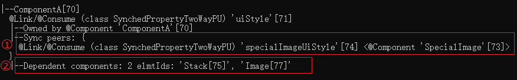
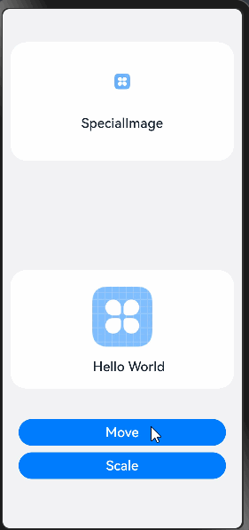
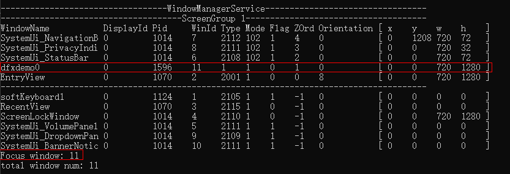

# 状态变量组件定位工具实践

## 概述

自定义组件中的变量被状态装饰器（@State，@Prop等）装饰后成为状态变量，而状态变量的改变会引起使用该变量的UI组件渲染刷新。状态变量的不合理使用可能会带来冗余刷新等性能问题。开发者可以使用状态变量组件定位工具获取状态管理相关信息，例如自定义组件拥有的状态变量、状态变量的同步对象和关联组件等，了解状态变量影响UI的范围，写出高性能应用代码。

本文将通过场景示例为开发者提供状态变量组件定位工具的实践指导，并对工具相关的调试命令和输出结果作解释说明。

## 使用流程

状态变量组件定位工具是通过使用HiDumper工具中特定的命令来获取组件和状态管理相关的信息。开发者可以使用工具查看指定自定义组件拥有的状态变量信息，了解其中各个状态变量影响的组件范围。

工具的使用流程可以分为以下几步：

1、设备上打开组件所在页面。

2、获取应用的窗口Id。

3、基于应用窗口Id获取应用的自定义组件树，找到目标组件和它的节点Id。

4、根据上一步获取的组件节点Id获取组件拥有的状态变量信息。

5、找到目标状态变量，查看它影响的组件范围。

在明确目标组件包含的状态变量和变量影响的组件刷新范围后，开发者可以根据需求分析是否存在状态变量的不合理使用，并对相应代码分析和优化。

## 场景示例

下面通过一个点击按钮更改状态变量引起组件刷新的场景示例，为开发者提供工具的实践指导。场景示例仅展示部分关键代码，完整代码请访问[示例代码](https://gitee.com/openharmony/applications_app_samples/blob/master/code/Performance/PerformanceLibrary/feature/DFXStateManagement/src/main/ets/view/DFXStateBeforeOptimization.ets)。

在以下代码中，创建了自定义组件ComponentA、SpecialImage，每个组件都拥有一些状态变量和UI组件。组件ComponentA中存在Move和Scale两个按钮，在按钮的点击回调中改变状态变量的值刷新相应的组件。
```javascript
// feature/DFXStateManagement/src/main/ets/view/DFXStateBeforeOptimization.ets  

// 常量声明
// ... 
// 样式属性类  
class UIStyle {  
  public translateX: number = 0;  
  public translateY: number = 0;  
  public scaleX: number = 0.3;  
  public scaleY: number = 0.3;  
}  
@Component  
struct ComponentA {  
  @Link uiStyle: UIStyle; // uiStyle的属性被多个组件使用  
  build() {  
    Column() {  
      // 使用状态变量的组件  
      SpecialImage({ specialImageUiStyle: this.uiStyle })  
      Stack() {  
        Column() {  
          Image($r('app.media.icon'))  
            .scale({  
              x: this.uiStyle.scaleX,  
              y: this.uiStyle.scaleY  
            })  
        }  
        Stack() {  
          Text('Hello World')  
        }  
      }  
      .translate({  
        x: this.uiStyle.translateX,  
        y: this.uiStyle.translateY  
      })  
  
      // 通过按钮点击回调修改状态变量的值，引起相应的组件刷新  
      Column() {  
        Button('Move')  
          .onClick(() => {  
            animateTo({ duration: animationDuration }, () => {  
              this.uiStyle.translateY = (this.uiStyle.translateY + translateYChangeValue) % translateYChangeRange;  
            })  
          })  
        Button('Scale')  
          .onClick(() => {  
            this.uiStyle.scaleX = (this.uiStyle.scaleX + scaleXChangeValue) % scaleXChangeRange;  
          })  
      }  
    }  
  }  
}  
@Component  
struct SpecialImage {  
  @Link specialImageUiStyle: UIStyle;  
  private opacityNum: number = 0.5; // 默认透明度  
  private isRenderSpecialImage(): number {  
    // Image每次渲染时透明度增加0.1, 在0-1之间循环  
    this.opacityNum = (this.opacityNum + opacityChangeValue) % opacityChangeRange;  
    return this.opacityNum;  
  }  
  build() {  
    Column() {  
      Image($r('app.media.icon'))  
        .scale({  
          x: this.specialImageUiStyle.scaleX,  
          y: this.specialImageUiStyle.scaleY  
        })  
        .opacity(this.isRenderSpecialImage())  
      Text("SpecialImage")  
    }  
  }  
}  
// 页面根组件，ComponentA的父组件
```

运行上述示例并分别点击按钮，可以看到点击Move按钮和Scale按钮时组件SpecialImage都出现了刷新，运行效果图如下。

 

下面以自定义组件ComponentA和其中的状态变量uiStyle为例介绍工具的使用过程。

1、首先在设备上打开应用，进入ComponentA组件所在的页面。

2、使用以下命令获取示例应用的窗口Id。当前运行的示例应用包名为performancelibrary，可以在输出结果中找到对应窗口名performancelibrary0的WinId，即为应用的窗口Id。或者当应用正处于前台运行时，Focus window的值就是应用的窗口Id。此处示例应用的窗口Id为11，后面的流程中使用的命令都需要指定窗口Id。
```shell
hdc shell "hidumper -s WindowManagerService -a '-a'"
```
 

3、基于上一步获取的窗口Id 11，使用-viewHierarchy命令携带-r 参数递归打印应用的自定义组件树。从结果中找到目标组件ComponentA，后面括号中的内容即为组件ComponentA的节点Id 70。
```shell
hdc shell "hidumper -s WindowManagerService -a '-w 11 -jsdump -viewHierarchy -r'"
```
```shell
-----------------ViewPU Hierarchy-----------------  
[-viewHierarchy, viewId=4, isRecursive=true]  
|--Index[4]  
-----------------ViewPU Hierarchy-----------------  
[-viewHierarchy, viewId=53, isRecursive=true]  
|--DFXStateManagementPage[53]  
  |--DFXStateManagementHome[55]  
-----------------ViewPU Hierarchy-----------------  
[-viewHierarchy, viewId=65, isRecursive=true]  
|--DFXStateBeforeOptimizationPage[65]  
  |--DFXStateBeforeOptimization[67]  
    |--ComponentA[70]  
      |--SpecialImage[73]
```
4、使用命令-stateVariables携带参数-viewId（参数的值为ComponentA的节点Id）获取自定义组件ComponentA中的状态变量信息。结果显示ComponentA拥有@Link/@Consume类型的状态变量uiStyle。每条状态变量的详细信息都包含状态变量的所属组件、同步对象和关联组件。
```shell
hdc shell "hidumper -s WindowManagerService -a '-w 11 -jsdump -stateVariables -viewId=70'"
```
```shell
--------------ViewPU State Variables--------------  
[-stateVariables, viewId=70, isRecursive=false]  
|--ComponentA[70]  
  @Link/@Consume (class SynchedPropertyTwoWayPU) 'uiStyle'[71]  
  |--Owned by @Component 'ComponentA'[70]  
  |--Sync peers: {  
    @Link/@Consume (class SynchedPropertyTwoWayPU) 'specialImageUiStyle'[74] <@Component 'SpecialImage'[73]>  
  }  
  |--Dependent components: 2 elmtIds: 'Stack[75]', 'Image[77]'
```
5、以状态变量uiStyle为例。

① Sync peers表示uiStyle在自定义组件SpecialImage中存在@Link/@Consume类型的状态变量specialImageUiStyle订阅数据变化。

② Dependent components表示在ComponentA组件中存在组件Stack[79]和Image[81]使用了状态变量uiStyle，关联组件的数量为2。

所以当uiStyle变化时，影响的组件范围为自定义组件SpecialImage以及系统组件Stack[79]和Image[81]。

 

示例中组件SpecialImage仅使用了uiStyle传递到specialImageUiStyle中的属性scaleX、scaleY，但是点击Move按钮修改uiStyle中的属性translateY时引起的uiStyle变化也会导致组件SpecialImage的刷新，所以可以将uiStyle中的属性scaleX、scaleY提取到状态变量scaleStyle中，属性translateX和translateY提取到状态变量translateStyle中，仅传递scaleStyle给组件SpecialImage，避免不必要的刷新。

由于提取后存在Class的嵌套，所以需要使用@Observed/@ObjectLink装饰器装饰相应的Class和状态变量。修改后的部分代码如下，完整代码可访问[示例代码](https://gitee.com/openharmony/applications_app_samples/blob/master/code/Performance/PerformanceLibrary/feature/DFXStateManagement/src/main/ets/view/DFXStateAfterOptimization.ets)获取。
```javascript
// feature/DFXStateManagement/src/main/ets/view/DFXStateAfterOptimization.ets

// 常量声明
// ...
// 样式属性类，嵌套ScaleStyle, TranslateStyle  
@Observed  
class UIStyle {  
  translateStyle: TranslateStyle = new TranslateStyle();  
  scaleStyle: ScaleStyle = new ScaleStyle();  
}  
// 缩放属性类  
@Observed  
class ScaleStyle {  
  public scaleX: number = 0.3;  
  public scaleY: number = 0.3;  
}  
// 位移属性类  
@Observed  
class TranslateStyle {  
  public translateX: number = 0;  
  public translateY: number = 0;  
}  
@Component  
struct ComponentA {  
  @ObjectLink scaleStyle: ScaleStyle;  
  @ObjectLink translateStyle: TranslateStyle;  
  
  build() {  
    Column() {  
      SpecialImage({  
        specialImageScaleStyle: this.scaleStyle  
      })  
      // 其他UI组件  
    }  
  }  
}  
  
@Component  
struct SpecialImage {  
  @Link specialImageScaleStyle: ScaleStyle;  
  // isRenderSpecialImage函数  
  build() {  
    Column() {  
      Image($r('app.media.icon'))  
        .scale({  
          x: this.specialImageScaleStyle.scaleX,  
          y: this.specialImageScaleStyle.scaleY  
        })  
        .opacity(this.isRenderSpecialImage())   
      Text("SpecialImage")  
    }
  }  
}
// 页面根组件，ComponentA的父组件
```

修改后的示例运行效果图如下，只有点击Scale按钮时SpecialImage产生刷新现象，点击Move按钮时SpecialImage不会刷新。

 

可以使用上文步骤再次获取ComponentA组件的状态变量信息如下，可以看到ComponentA中状态变量scaleStyle影响组件SpecialImage[74]和Image[78]，状态变量translateStyle影响组件Stack[76]，translateStyle的变化不会再导致SpecialImage的刷新。
```shell
--------------ViewPU State Variables--------------  
[-stateVariables, viewId=70, isRecursive=false]  
  
|--ComponentA[70]  
  @ObjectLink (class SynchedPropertyNestedObjectPU) 'scaleStyle'[71]  
  |--Owned by @Component 'ComponentA'[70]  
  |--Sync peers: {  
    @Link/@Consume (class SynchedPropertyTwoWayPU) 'specialImageScaleStyle'[75] <@Component 'SpecialImage'[74]>  
  }  
  |--Dependent components: 1 elmtIds: 'Image[78]'  
  @ObjectLink (class SynchedPropertyNestedObjectPU) 'translateStyle'[72]  
  |--Owned by @Component 'ComponentA'[70]  
  |--Sync peers: none  
  |--Dependent components: 1 elmtIds: 'Stack[76]'
```
## 调试命令和输出详解

下面通过一个自定义组件三层嵌套的简单示例程序，对工具的调试命令和输出结果作详细说明。
```javascript
@Entry  
@Component  
struct Index {  
  @State indexMessage: string = 'Hello World';  
  build() {  
    Row() {  
      Column() {  
        Text(this.indexMessage)  
        ComponentA({ componentAMessage: this.indexMessage })  
      }  
      .width('100%')  
    }  
    .height('100%')  
  }  
}  
@Component  
struct ComponentA {  
  @Link componentAMessage: string;  
  build() {  
    Column() {  
      ComponentB({ componentBMessage: this.componentAMessage })  
    }  
  }  
}  
@Component  
struct ComponentB {  
  @Link componentBMessage: string;  
  build() {  
    Column() {  
      Text(this.componentBMessage)  
    }  
  }  
}
```
1、查看应用窗口Id。可以通过窗口列表中应用的WindowName（示例应用的包名为dfxdemo，默认的WindowName为dfxdemo0）找到其WinId，即应用窗口Id。结果中的Focus window为当前界面展示的窗口Id。当应用处于前台运行时，Focus window的值即为应用窗口Id。
```shell
hdc shell "hidumper -s WindowManagerService -a '-a'"
```
 

2、打印自定义组件树。

默认只打印根节点和它子级的自定义组件。其中 11 表示查看的窗口Id，可使用查看应用窗口Id命令获取。结果中形如Index[4]格式的，前面为自定义组件的名称，[]中的数字为组件的节点Id。
```shell
hdc shell "hidumper -s WindowManagerService -a '-w 11 -jsdump -viewHierarchy'"
```
```shell
-----------------ViewPU Hierarchy-----------------  
[-viewHierarchy, viewId=4, isRecursive=false]  
|--Index[4]  
  |--ComponentA[9]
```
携带-viewId参数可以打印指定viewId的自定义组件和该组件子级的自定义组件。只有自定义组件的节点Id可以作为参数-viewId的值使用。以-viewId=9为例，可以获取到viewId为9的自定义组件ComponentA和它子级的自定义组件ComponentB。
```shell
hdc shell "hidumper -s WindowManagerService -a '-w 11 -jsdump -viewHierarchy -viewId=9'"
```
```shell
-----------------ViewPU Hierarchy-----------------  
[-viewHierarchy, viewId=9, isRecursive=false]  
|--ComponentA[9]  
  |--ComponentB[12]
```
携带-r参数从根节点开始递归打印自定义组件树。例如下面命令的输出结果为根节点Index和它拥有的每一级自定义组件，以树状结构展示。
```shell
hdc shell "hidumper -s WindowManagerService -a '-w 11 -jsdump -viewHierarchy -r'"
```
```shell
-----------------ViewPU Hierarchy-----------------  
[-viewHierarchy, viewId=4, isRecursive=true]  
|--Index[4]  
  |--ComponentA[9]  
    |--ComponentB[12]
```
3、打印自定义组件的状态变量信息，每条信息包含该变量的所属组件、Sync peers（同步对象）和Dependent components（关联组件）。当该状态变量改变时，它的Dependent components和Sync peers的Dependent components都是脏节点。默认打印根节点。
```shell
hdc shell "hidumper -s WindowManagerService -a '-w 11 -jsdump -stateVariables'"
```
```shell
--------------ViewPU State Variables--------------  
--Index[4]  
  @State/@Provide (class ObservedPropertyPU) 'indexMessage'[5]  
  |--Owned by @Component 'Index'[4]  
  |--Sync peers: {  
    @Link/@Consume (class SynchedPropertyTwoWayPU) 'componentAMessage'[9] <@Component 'ComponentA'[8]>  
  }  
  |--Dependent components: 1 elmtIds: 'Text[8]'
```
- @State/@Provide：状态变量的装饰器类型。
- 'message'[5]：状态变量的名称和节点Id，但是不能使用-viewId=5来获取相应的dump信息。
- Owned by @Component 'Index'[4]：状态变量所属组件。
- Sync peers： 要同步的其他状态变量和其所属的组件。
- Dependent components：当前状态变量在此组件中关联的节点Id，即依赖该变量的系统或自定义组件的节点Id。

**注意：**

-stateVariables只支持打印指定viewId的状态变量信息，不支持递归打印。所以只能获取单个自定义组件的状态变量信息进行逐级分析，目前无法从全局查看某个状态变量影响到的所有组件。

4、打印所有信息，包含自定义组件树和状态变量信息。未指定节点时默认打印根节点，携带-viewId参数打印指定节点信息，携带-r参数递归打印。
```shell
hdc shell "hidumper -s WindowManagerService -a '-w 11 -jsdump -dumpAll'"
```
输出结果如下图：

 

1、自定义组件树，对应命令-viewHierarchy。

2、状态变量信息，对应命令-stateVariables。

dumpAll命令携带-r和-viewId参数时，输出结果中对应各个命令的部分与单独使用该命令携带相应参数时的结果相同。

## 参考资料

[场景示例代码](https://gitee.com/openharmony/applications_app_samples/tree/master/code/Performance/PerformanceLibrary/feature/DFXStateManagement/src/main/ets/view)

[使用HiDumper命令行工具优化性能](performance-optimization-using-hidumper.md)

[精准控制组件的更新范围](precisely-control-render-scope.md)
