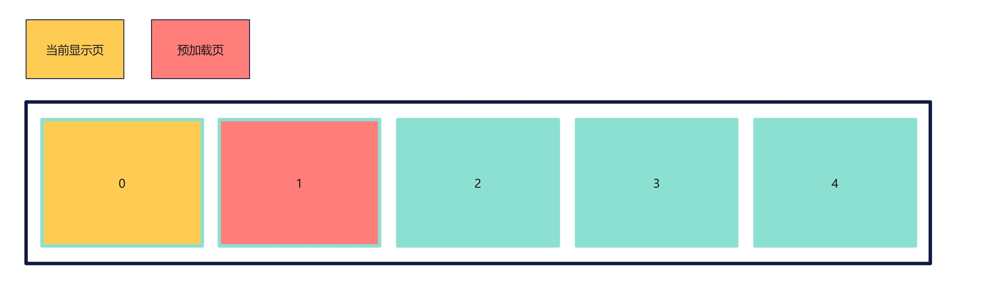
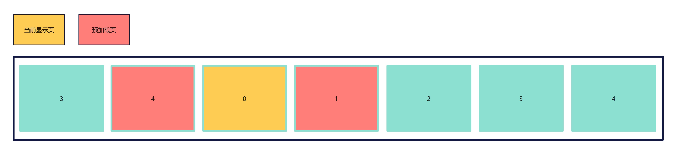

# Swiper高性能开发指导

## 背景

在应用开发中，[Swiper](../reference/apis-arkui/arkui-ts/ts-container-swiper.md) 组件常用于翻页场景，比如：桌面、图库等应用。Swiper 组件滑动切换页面时，基于按需加载原则通常会在下一个页面将要显示时才对该页面进行加载和布局绘制，这个过程包括：

- 如果该页面使用了@Component 装饰的自定义组件，那么自定义组件的 build 函数会被执行并创建内部的 UI 组件；

- 如果使用了[LazyForEach](../ui/state-management/arkts-rendering-control-lazyforeach.md)，会执行 LazyForEach 的 UI 生成函数生成 UI 组件；

- 在 UI 组件构建完成后，会对 UI 组件进行布局测算和绘制。

针对复杂页面场景，该过程可能会持续较长时间，导致滑动过程中出现卡顿，对滑动体验造成负面影响，甚至成为整个应用的性能瓶颈。如在图库大图浏览场景中，若不使用预加载机制，每次都将在滑动开始的首帧去加载下一张图片，会导致首帧耗时过长甚至掉帧，拖慢应用性能。

为了解决上述问题，可以使用 Swiper 组件的预加载机制，利用主线程的空闲时间来提前构建和布局绘制组件，优化滑动体验。

## 使用场景

如果开发者的应用场景属于加载较为耗时的场景时，尤其是下列场景，推荐使用 Swiper 预加载功能。

- Swiper 的子组件大于等于五个；

- Swiper 的子组件具有复杂的动画；

- Swiper 的子组件加载时需要执行网络请求等耗时操作；

- Swiper 的子组件包含大量需要渲染的图像或资源。

## Swiper 预加载机制说明

预加载机制是 Swiper 组件中一个重要的特性，允许 Swiper 滑动到下一个子组件之前提前加载后续页面的内容，其主要目的是提高应用滑动时的流畅性和响应速度。当用户尝试滑动到下一个子组件时，如果下一个子组件的内容已经提前加载完毕，那么滑动就会立即发生，否则 Swiper 组件需要在加载下一个子组件的同时处理滑动事件，对滑动体验造成负面影响。当前 Swiper 组件的预加载在用户滑动离手动效开始时触发，离手动效的计算在渲染线程中进行，因此主线程有空闲的时间可以进行预加载的操作。配合 LazyForEach 的按需加载和销毁能力，可以在优化滑动体验基础上节省内存占用。

## 使用指导

- 预加载子组件的个数在[cachedCount](../reference/apis-arkui/arkui-ts/ts-container-swiper.md#cachedcount8)属性中配置。

Swiper 共 5 页，当开发者设置了 cachedCount 属性为 1 且 loop 属性为 false 时，预加载的结果如下：\
 

\
 Swiper 共 5 页，当开发者设置了 cachedCount 属性为 1 且 loop 属性为 true 时，预加载的结果如下：\
 

- Swiper 组件的子组件使用[LazyForEach](../ui/state-management/arkts-rendering-control-lazyforeach.md)动态加载和销毁组件。

**示例**

```TypeScript
class MyDataSource implements IDataSource { // LazyForEach的数据源
  private list: number[] = [];

  constructor(list: number[]) {
    this.list = list;
  }

  totalCount(): number {
    return this.list.length;
  }

  getData(index: number): number {
    return this.list[index];
  }

  registerDataChangeListener(_: DataChangeListener): void {
  }

  unregisterDataChangeListener(): void {
  }
}

@Component
struct SwiperChildPage { // Swiper的子组件
  @State arr: number[] = [];

  aboutToAppear(): void {
    for (let i = 1; i <= 100; i++) {
      this.arr.push(i);
    }
  }

  build() {
    Column() {
      List({ space: 20 }) {
        ForEach(this.arr, (index: number) => {
          ListItem() {
            Text(index.toString())
              .height('4.5%')
              .fontSize(16)
              .textAlign(TextAlign.Center)
              .backgroundColor(0xFFFFFF)
          }
          .border({ width: 2, color: Color.Green })
        }, (index: number) => index.toString());
      }
      .height("95%")
      .width("95%")
      .border({ width: 3, color: Color.Red })
      .lanes({ minLength: 40, maxLength: 40 })
      .alignListItem(ListItemAlign.Start)
      .scrollBar(BarState.Off)

    }.width('100%').height('100%').padding({ top: 5 });
  }
}

@Entry
@Preview
@Component
struct SwiperExample {
  private dataSrc: MyDataSource = new MyDataSource([]);

  aboutToAppear(): void {
    let list: Array<number> = []
    for (let i = 1; i <= 10; i++) {
      list.push(i);
    }
    this.dataSrc = new MyDataSource(list);
  }

  build() {
    Column({ space: 5 }) {
      Swiper() {
        LazyForEach(this.dataSrc, (_: number) => {
          SwiperChildPage();
        }, (item: number) => item.toString());
      }
      .loop(false)
      .cachedCount(1) // 提前加载后一项的内容
      .indicator(true)
      .duration(100)
      .displayArrow({
        showBackground: true,
        isSidebarMiddle: true,
        backgroundSize: 40,
        backgroundColor: Color.Orange,
        arrowSize: 25,
        arrowColor: Color.Black
      }, false)
      .curve(Curve.Linear)

    }.width('100%')
    .margin({ top: 5 })
  }
}

```

## 验证效果

为了更好地体现 Swiper 预加载机制带来的性能优化效果，用例采用下列前置条件：

- Swiper 的子组件为带有 100 个 ListItem 的 List 组件；

- Swiper 组件共有 10 个 List 子组件。

在该场景下，使用 Swiper 预加载机制可以为每个翻页动作节省约40%的时间，同时保证翻页时不丢帧，保证翻页的流畅度。

## 优化建议

由于组件构建和布局计算需要一定时间，cachedCount 的数量也不是设置得越大越好，过大的 cachedCount 可能会导致应用性能降低。当前 Swiper 组件滑动离手后的动效时间大约是 400ms，如果应用加载一个子组件的时间在 100ms\~200ms 之间，为了在离手动效时间内完成组件的预加载，cachedCount 属性建议设置为 1 或 2，设置过大会导致主线程阻塞而产生卡顿。

那么方案可以继续优化，在抛滑场景时，Swiper 组件有一个[OnAnimationStart](../reference/apis-arkui/arkui-ts/ts-container-swiper.md#事件)回调接口，切换动画开始时触发该回调。此时，主线程空闲，应用可以充分利用这段时间进行图片等资源的预加载，减少后续 cachedCount 范围内的节点预加载耗时；
跟手滑动阶段不会触发[OnAnimationStart](../reference/apis-arkui/arkui-ts/ts-container-swiper.md#事件)回调，只有在离手后做切换动画(也就是抛滑阶段)才会触发。

**示例**

Swiper 子组件页面代码如下：

在子组件首次构建（生命周期执行到[aboutToAppear](../reference/apis-arkui/arkui-ts/ts-custom-component-lifecycle.md#abouttoappear)）时，先判断 dataSource 中该 index 的数据是否有数据，若无数据则先进行资源加载，再构建节点。若有数据，则直接构建节点即可。

```TypeScript
import image from '@ohos.multimedia.image';
import { MyDataSource } from './Index';

@Component
export struct PhotoItem { //Swiper的子组件
  myIndex: number = 0;
  private dataSource: MyDataSource = new MyDataSource([]);
  context = getContext(this);
  @State imageContent: image.PixelMap | undefined = undefined;

  aboutToAppear(): void {
    console.info(`aboutToAppear` + this.myIndex);
    this.imageContent = this.dataSource.getData(this.myIndex)?.image;
    if (!this.imageContent) { // 先判断dataSource中该index的数据是否有数据，若无数据则先进行资源加载
      try {
        // 获取resourceManager资源管理器
        const resourceMgr = this.context.resourceManager;
        // 获取rawfile文件夹下item.jpg的ArrayBuffer
        let str = "item" + (this.myIndex + 1) + ".jpg";
        resourceMgr.getRawFileContent(str).then((value) => {
          // 创建imageSource
          const imageSource = image.createImageSource(value.buffer);
          imageSource.createPixelMap().then((value) => {
            console.info("aboutToAppear push" + this.myIndex)
            this.dataSource.addData(this.myIndex, { description: "" + this.myIndex, image: value })
            this.imageContent = value;
          })
        })
      } catch (err) {
        console.error("error code" + err);
      }
    }
  }

  build() {
    Column() {
      Image(this.imageContent)
        .width("100%")
        .height("100%")
    }
  }
}
```

Swiper 主页面的代码如下：
```TypeScript
import Curves from '@ohos.curves';
import { PhotoItem } from './PhotoItem'
import image from '@ohos.multimedia.image';

interface MyObject {
  description: string,
  image: image.PixelMap,
};

export class MyDataSource implements IDataSource {
  private list: MyObject[] = []

  constructor(list: MyObject[]) {
    this.list = list
  }

  totalCount(): number {
    return this.list.length
  }

  getData(index: number): MyObject {
    return this.list[index]
  }

  registerDataChangeListener(listener: DataChangeListener): void {
  }

  unregisterDataChangeListener(listener: DataChangeListener): void {
  }

  addData(index: number, data: MyObject) {
    this.list[index] = data;
  }
}

@Entry
@Component
struct Index {
  @State currentIndex: number = 0;
  cacheCount: number = 1
  swiperController: SwiperController = new SwiperController();
  private data: MyDataSource = new MyDataSource([]);
  context = getContext(this);

  aboutToAppear() {
    let list: MyObject[] = []
    for (let i = 0; i < 6; i++) {
      list.push({ description: "", image: this.data.getData(this.currentIndex)?.image })
    }
    this.data = new MyDataSource(list)
  }

  build() {
    Swiper(this.swiperController) {
      LazyForEach(this.data, (item: MyObject, index?: number) => {
        PhotoItem({
          myIndex: index,
          dataSource: this.data
        })
      })
    }
    .cachedCount(this.cacheCount)
    .curve(Curves.interpolatingSpring(0, 1, 228, 30))
    .index(this.currentIndex)
    .indicator(true)
    .loop(false)
    // 在OnAnimationStart接口回调中进行预加载资源的操作
    .onAnimationStart((index: number, targetIndex: number) => {
      console.info("onAnimationStart " + index + " " + targetIndex);
      if (targetIndex !== index) {
        try {
          // 获取resourceManager资源管理器
          const resourceMgr = this.context.resourceManager;
          // 获取rawfile文件夹下item.jpg的ArrayBuffer
          let str = "item" + (targetIndex + this.cacheCount + 2) + ".jpg";
          resourceMgr.getRawFileContent(str).then((value) => {
            // 创建imageSource
            const imageSource = image.createImageSource(value.buffer);
            imageSource.createPixelMap().then((value) => {
              this.data.addData(targetIndex + this.cacheCount + 1, {
                description: "" + (targetIndex + this.cacheCount + 1),
                image: value
              })
            })
          })
        } catch (err) {
          console.error("error code" + err);
        }
      }
    })
    .width('100%')
    .height('100%')
  }
}

```

## 总结

- Swiper 组件的预加载机制与 LazyForEach 结合使用，能够达到最佳优化效果。

- 预加载的 cachedCount 并非越大越好，需要结合单个子组件加载耗时来设置。假设一个子组件的加载耗时为 Nms，那么 cachedCount 推荐设置为小于 400/N。

- 如果应用有非常高的性能优化需求，Swiper 预加载机制可搭配 OnAnimationStart 接口回调使用，进一步提升预加载的效率。
