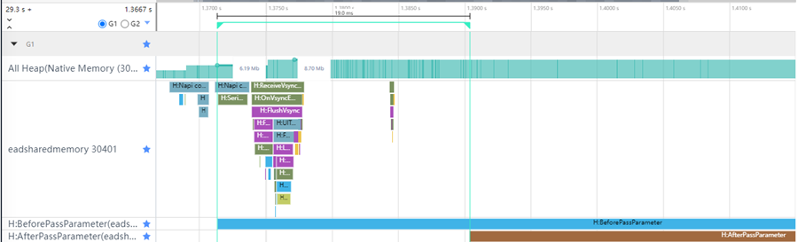
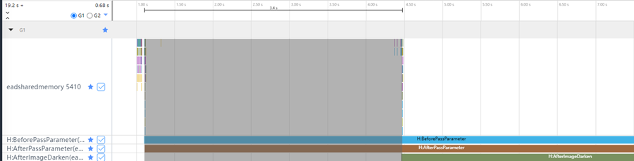

# ArrayBuffer序列化和转移

## 简介

在应用开发中，为了避免主线程阻塞，提高应用性能，需要将一些耗时操作放在子线程中执行。此时，子线程就需要访问主线程中的数据。ArkTS采用了基于[消息通信的Actor并发模型](../arkts-utils/multi-thread-concurrency-overview.md#actor模型)，不需要开发者去面对锁带来的一系列复杂偶发问题，同时并发度也相对较高。由于Actor并发模型具有内存隔离的特性，所以跨线程传输[普通对象](../arkts-utils/normal-object.md)时是使用拷贝的方式进行传递，就会导致这样一种现象：同一份数据，在主线程和子线程内分别占用一份内存。在数据量较小时，对应用性能不会有明显的影响；但是如果数据量较大时（比如传递一个音频或者视频数据），就可能会因为占用内存较多，内存资源不足，影响其他任务的执行。

除了普通对象，ArkTS还支持在线程间传递ArrayBuffer对象。这是一种[可转移对象](../arkts-utils/transferabled-object.md)，传递时不需要进行拷贝，所以不会出现同一份数据占用两份内存的情况。本篇文章将通过示例代码，对比两种数据对象在线程间传递时的性能数据，同时给出优化建议，使开发者可以更好地实现线程间大数据的传输。

关于多线程的使用和原理，可参考[OpenHarmony多线程能力场景化示例实践](multi_thread_capability.md)，本文将不再详细讲述。

## 场景示例

在应用开发中，会遇到需要进行图片处理的场景（比如需要调整一张图片的亮度、饱和度、大小等），为了避免阻塞主线程，可以将图片传递到子线程中执行这些操作。下面将分别通过拷贝和转移的方式，将图片传递到子线程中，并对比两种方式的性能数据。

### 使用拷贝方式传递

在ArkTS中，TaskPool传递ArrayBuffer数据时，默认使用转移的方式，通过调用task.setTransferList([])接口，可以切换成拷贝的方式。

首先，实现一个需要在Task中执行的用于调整饱和度的接口。

```typescript
// code/Performance/PerformanceLibrary/feature/ThreadDataTransfer/src/main/ets/utils/TreadUtil.ets
@Concurrent
function adjustImageValue(arrayBuffer: ArrayBuffer, lastAdjustData: number, currentAdjustData: number): ArrayBuffer {
  return execColorInfo(arrayBuffer, lastAdjustData, currentAdjustData);
}
```

然后，通过拷贝的方式将图片数据传递到Task中，并在Task中将图片进行饱和度调整。

```typescript
// code/Performance/PerformanceLibrary/feature/ThreadDataTransfer/src/main/ets/utils/TreadUtil.ets
// 创建Task，传入数据
function createImageTask(arrayBuffer: ArrayBuffer, lastAdjustData: number, currentAdjustData: number, isParamsByTransfer: boolean): taskpool.Task {
  let task: taskpool.Task = new taskpool.Task(adjustImageValue, arrayBuffer, lastAdjustData, currentAdjustData);
  if (!isParamsByTransfer) { // 是否使用转移方式
    task.setTransferList([]);
  }
  return task;
}
......
// 创建taskNum个Task
for (let i: number = 0; i < taskNum; i++) {
  let arrayBufferSlice: ArrayBuffer = arrayBuffer.slice(arrayBuffer.byteLength / taskNum * i, arrayBuffer.byteLength / taskNum * (i + 1));
  // 使用拷贝方式传入ArrayBuffer，所以isParamsByTransfer是false
  taskPoolGroup.addTask(createImageTask(arrayBufferSlice, lastAdjustData, currentAdjustData, isParamsByTransfer));
}
let start: number = new Date().getTime();
// 执行Task
taskpool.execute(taskPoolGroup).then((data: ArrayBuffer[]) => {
  if (callback !== undefined) {
    let end : number = new Date().getTime();
    AppStorage.set<String>('timeCost', util.format('%s s', ((end - start) / 60).toFixed(2).toString()));
    callback(concatenateArrayBuffers(data));
  }
}).catch((e: BusinessError) => {
  Logger.error(e.message);
})
......
```

最后，主线程接收到Task执行完毕后返回的ArrayBuffer数据，转换为PixelMap后在Image组件上显示。
```typescript
// code/Performance/PerformanceLibrary/feature/ThreadDataTransfer/src/main/ets/view/AdjustImageView.ets
......
// 将处理后的ArrayBuffer转换为PixelMap，并在Image组件上显示
pixelMapProcessByTaskPool(this.pixelMap, this.lastAdjustData, this.currentAdjustData, this.currentTaskNum, 
  this.isParamsByTransfer, (data: ArrayBuffer) => {
    if (this.pixelMap !== undefined) {
    const newPixel: image.PixelMap = this.pixelMap;
    newPixel.writeBufferToPixels(data).then(() => {
      this.pixelMap = newPixel;
      this.lastAdjustData = Math.round(value);
      this.isPixelMapChanged = !this.isPixelMapChanged;
      this.deviceListDialogController.close();
      this.postState = true;
    });
  }
});
......
```
编译运行后，通过脚本工具抓取Trace并在SmartPerf Host中查看，如图1所示。其中，All Heap表示应用占用的内存，BeforePassParameter表示ArrayBuffer开始从主线程传递到子线程，AfterPassParameter表示子线程收到完整的ArrayBuffer数据。

图1 拷贝方式Trace泳道图



图1中可以看到，ArrayBuffer传递到TaskPool时，内存有2.5M的上升，耗时是19ms。

### 使用转移方式传递

在TaskPool中，传递ArrayBuffer数据，是默认使用转移方式的，所以在上面示例的基础上，去除task.setTransferList([])接口就可以实现。
```typescript
// code/Performance/PerformanceLibrary/feature/ThreadDataTransfer/src/main/ets/utils/TreadUtil.ets
// 创建Task，传入数据
function createImageTask(arrayBuffer: ArrayBuffer, lastAdjustData: number, currentAdjustData: number, isParamsByTransfer: boolean): taskpool.Task {
  let task: taskpool.Task = new taskpool.Task(adjustImageValue, arrayBuffer, lastAdjustData, currentAdjustData);
  if (!isParamsByTransfer) { // 是否使用转移方式
    task.setTransferList([]);
  }
  return task;
}
......
// 创建taskNum个Task
for (let i: number = 0; i < taskNum; i++) {
  let arrayBufferSlice: ArrayBuffer = arrayBuffer.slice(arrayBuffer.byteLength / taskNum * i, arrayBuffer.byteLength / taskNum * (i + 1));
  // 使用转移方式传入ArrayBuffer，所以isParamsByTransfer是true
  taskPoolGroup.addTask(createImageTask(arrayBufferSlice, lastAdjustData, currentAdjustData, isParamsByTransfer));
}
let start: number = new Date().getTime();
// 执行Task
taskpool.execute(taskPoolGroup).then((data: ArrayBuffer[]) => {
  if (callback !== undefined) {
    let end : number = new Date().getTime();
    AppStorage.set<String>('timeCost', util.format('%s s', ((end - start) / 60).toFixed(2).toString()));
    callback(concatenateArrayBuffers(data));
  }
}).catch((e: BusinessError) => {
  Logger.error(e.message);
})
......
```

编译运行后，通过脚本工具抓取Trace并在SmartPerf Host中查看，如图2所示。

图2 转移方式Trace泳道图


在图2中可以看到，ArrayBuffer传递到TaskPool时，内存并没有明显的变化，耗时只有5.2ms。

### 性能对比

通过对比上面两个场景中的Trace数据可以发现，相对于拷贝，转移的内存占用明显变少，耗时也减少了72%。

使用拷贝方式传递数据时，会将ArrayBuffer对象拷贝一次。不仅会多占用了一部分内存，还会消耗一定的时间进行拷贝对象的序列化操作。而通过转移的方式传递数据时，并不需要将传递的对象拷贝一次，而是通过地址转移进行序列化，将ArrayBuffer的内存资源从原始的缓冲区分离出来，附加到子线程TaskPool创建的缓冲区对象中，也就是将ArrayBuffer的所有权从主线程移交给了子线程。

所以，使用转移方式，可以减少线程间传递数据时的内存占用和CPU耗时。

## 使用建议

在ArkTS的多线程中传递数据时，应保证线程间的通信数据量尽可能的小，输入输出都要简单，避免传输影响耗时；而且并发任务要相对独立，不要频繁跨线程交互。上一部分的例子中，虽然将图片处理的操作放在了TaskPool子线程中，但是由于图片数据较大，处理时间还是较长，如图3所示。其中，BeforePassParameter表示ArrayBuffer开始从主线程传递到子线程，AfterPassParameter表示子线程收到完整的ArrayBuffer数据，AfterImageDarken表示计算（图片饱和度调节）结束。在图中可以看到，有5.8s的耗时，虽然在这段时间内并不会阻塞主线程中的操作，但是对于用户来说，等待时间依然较长。

图3 子线程计算耗时泳道图


下面将通过示例代码说明如何进一步优化图片处理的时间。详细代码请参考[ThreadDataTransfer](https://gitee.com/openharmony/applications_app_samples/tree/master/code/Performance/PerformanceLibrary/feature/ThreadDataTransfer)。
```typescript
// code/Performance/PerformanceLibrary/feature/ThreadDataTransfer/src/main/ets/utils/TreadUtil.ets
......
// 根据传入的taskNum，创建对应数量的Task
export async function pixelMapProcessByTaskPool(pixelMap: image.PixelMap, lastAdjustData: number, currentAdjustData: number, taskNum: number, isParamsByTransfer: boolean, callback?: Callback<ArrayBuffer>): Promise<void> {
  let arrayBuffer: ArrayBuffer = await convertPixelMapToArrayBuffer(pixelMap);
  let taskPoolGroup: taskpool.TaskGroup = new taskpool.TaskGroup();
  for (let i: number = 0; i < taskNum; i++) {
    let arrayBufferSlice: ArrayBuffer = arrayBuffer.slice(arrayBuffer.byteLength / taskNum * i, arrayBuffer.byteLength / taskNum * (i + 1));
    taskPoolGroup.addTask(createImageTask(arrayBufferSlice, lastAdjustData, currentAdjustData, isParamsByTransfer));
  }
  let start: number = new Date().getTime();
  taskpool.execute(taskPoolGroup).then((data: ArrayBuffer[]) => {
    if (callback !== undefined) {
      let end : number = new Date().getTime();
      AppStorage.set<String>('timeCost', util.format('%s s', ((end - start) / 60).toFixed(2).toString()));
      // 将Task处理完成的数据合并在一个ArrayBuffer中
      callback(concatenateArrayBuffers(data));
    }
  }).catch((e: BusinessError) => {
    Logger.error(e.message);
  })
}
```
在这段代码中，将图片转换为ArrayBuffer后，并没有直接传递到子线程中，而是先进行了切片处理，分成taskNum个独立的ArrayBuffer。之后分别传入到taskNum个Task中，并通过TaskGroup统一管理。在图片饱和度调节完成后，再将taskNum个处理结果拼接成一个ArrayBuffer，并转换为PixelMap在Image组件上显示。此示例代码也是使用了转移方式进行传递，因为上一部分的示例已经说明了转移比拷贝的方式更加高效，所以这里不再进行重复的对比。编译运行代码后，通过脚本工具抓取Trace并在SmartPerf Host中查看，如图4所示。

图4 图片切成3份处理后的泳道图



通过图4可以看到，将原ArrayBuffer切成3段，分别放在3个子线程中处理，图片饱和度调节的操作耗时只有3.4s，计算时间减少了44%。因为有3个线程在同时进行操作，大大减少了计算的耗时。但是，这并不代表可以随意增加Task的数量。由于在TaskPool中，并不是创建了多少个Task，就会有多少个Task在同时执行。随着Task的增多，同时执行的线程也会越多，并发执行的任务就会增多，CPU的占用率就会升高，从而影响到其他需要CPU计算的任务。虽然在硬件配置高的设备上表现不明显，但是对于低配置的设备，影响会较大。下面的表格，列出了示例中不同数量Task时的CPU耗时供开发者参考。

| **任务数** | **实际子线程数** | **序列化时间（ms）** | **计算时间（s）** |
| ---------- | ---------------- | -------------------- | ----------------- |
| 1          | 1                | 3.30792              | 3.967             |
| 2          | 2                | 2.62345              | 2.646             |
| 3          | 3                | 6.11258              | 1.875             |
| 4          | 3                | 7.25295              | 2.579             |
| 5          | 3                | 2.7032               | 2.266             |
| 6          | 3                | 3.213                | 1.970             |
| 7          | 3                | 5.260                | 2.096             |
| 8          | 3                | 2.704                | 2.067             |
| 9          | 3                | 3.986                | 2.116             |
| 10         | 5                | 3.811                | 1.844             |
| 15         | 5                | 2.879                | 2.079             |
| 20         | 5                | 3.526                | 2.015             |

因此，在分段传输大数据时，需要合理调整子线程的数量和传入子线程的数据量，加快子线程处理速度，同时减少对其他功能的影响，提升用户的应用体验。

## 相关示例

[ArrayBuffer序列化和转移示例代码](https://gitee.com/openharmony/applications_app_samples/tree/master/code/Performance/PerformanceLibrary/feature/ThreadDataTransfer)