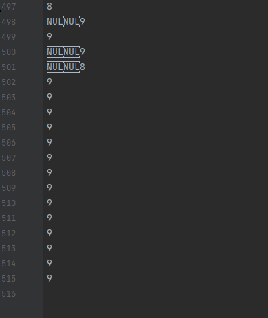

# 合理使用多线程共享内存
<!--Kit: Common-->
<!--Subsystem: Demo&Sample-->
<!--Owner: @mgy917-->
<!--SE: @jiangwensai-->
<!--TSE: @Lyuxin-->

## 概述
在应用开发中，为了避免主线程阻塞，提高应用性能，需要将一些耗时操作放在子线程中执行。此时，子线程就需要访问主线程中的数据。ArkTS采用了基于消息通信的Actor并发模型，具有内存隔离的特性，所以跨线程传输数据时需要将数据序列化，但是AkrTS支持通过可共享对象SharedArrayBuffer实现直接的共享内存。

在开发应用时，如果遇到数据量较大，并且需要多个线程同时操作的情况，推荐使用SharedArrayBuffer共享内存，可以减少数据在线程间传递时需要复制和序列化的额外开销。比如，音视频解码播放、多个线程同时读取写入文件等场景。由于内存是共享的，所以在多个线程同时操作同一块内存时，可能会引起数据的紊乱，这时就需要使用锁来确保数据操作的有序性。本文将基于此具体展开说明。关于多线程的使用和原理，可参考[OpenHarmony多线程能力场景化示例实践](./multi_thread_capability.md)，本文将不再详细讲述。
## 工作原理
可共享对象SharedArrayBuffer，是拥有固定长度的原始二进制数据缓冲区，可以存储任何类型的数据，包括数字、字符串等。它支持在多线程之间传递，传递之后的SharedArrayBuffer对象和原始的SharedArrayBuffer对象可以指向同一块内存，进而达到共享内存的目的。SharedArrayBuffer对象存储的数据在子线程中被修改时，需要通过原子操作保证其同步性，即下个操作开始之前务必需要保证上个操作已经结束。下面将通过示例说明原子操作保证同步性的必要性，详细代码请参考[AtomicsUsage.ets](https://gitcode.com/openharmony/applications_app_samples/blob/master/code/Performance/PerformanceLibrary/feature/memoryShared/src/main/ets/pages/AtomicsUsage.ets)。
### 非原子操作

```javascript
......
// 非原子操作，进行10000次++
@Concurrent
function normalProcess(int32Array: Int32Array) {
  for (let i = 0; i < 10000; i++) {
    int32Array[0]++;
  }
}
// 原子操作，进行10000次++
@Concurrent
function atomicsProcess(int32Array: Int32Array) {
  for (let i = 0; i < 10000; i++) {
    Atomics.add(int32Array, 0, 1);
  }
}
......
@State result: string = "计算结果：";
private taskNum: number = 2;
private scroller: Scroller = new Scroller();
......
Button("非原子操作")
  .width("80%")
  .fontSize(30)
  .fontWeight(FontWeight.Bold)
  .margin({ top: 30 })
  .onClick(async () => {
     this.sharedArrayBufferUsage(false);
  })
Scroll(this.scroller) {
  Column() {
    Text(this.result)
      .width("80%")
      .fontSize(30)
      .fontWeight(FontWeight.Bold)
      .fontColor(Color.Blue)
  }
}.height("60%")
.margin({ top: 30 })
......
// 根据传入的值isAtomics判断是否使用原子操作
sharedArrayBufferUsage(isAtomics: boolean) {
  // 创建长度为4的SharedArrayBuffer对象
  let sab: SharedArrayBuffer = new SharedArrayBuffer(4);
  // 由于SharedArrayBuffer是原始二进制数据缓冲区，无法直接使用，所以这里转换为Int32Array类型进行后续操作
  let int32Array: Int32Array = new Int32Array(sab);
  int32Array[0] = 0;
  let taskGroup: taskpool.TaskGroup = new taskpool.TaskGroup();
  // 创建Task对象，并放入TaskGroup中执行
  for (let i = 0; i < this.taskNum; i++) {
    if (isAtomics) {
      taskGroup.addTask(new taskpool.Task(atomicsProcess, int32Array));
    } else {
      taskGroup.addTask(new taskpool.Task(normalProcess, int32Array));
    }
  }
  taskpool.execute(taskGroup).then(() => {
    // 将结果打印在Text上
    this.result = this.result + "\n" + int32Array;
    // 如果Scroll不在最低端，则滑动到最低端
    if (!this.scroller.isAtEnd()) {
      this.scroller.scrollEdge(Edge.Bottom);
    }
  }).catch((e: BusinessError) => {
    logger.error(e.message);
  })
}

```
在这段代码中，创建了2个task，对SharedArrayBuffer分别进行了10000次自增操作，预期的结果应该是20000。点击按钮查看计算结果，就会发现最后的结果并不一定是20000，并且每次点击后，计算的结果都可能是不同的。
这是因为SharedArrayBuffer是共享内存的，多个线程同时进行自增时，是操作的同一块内存，而自增操作并不是原子操作，需要经过以下三个步骤：
- 第一步，从内存中取值
- 第二步，对取出的值+1
- 第三步，将结果写入内存

当多个线程同时操作时，就会发生这样一种情况：A线程在第一步取值1000，第二步+1操作后是1001，在执行第三步之前，B线程也去取值了，这时由于A线程还没有将结果写入内存，所以B线程取到的值依然是1000，然后A执行第三步将1001写入了内存，而B会对1000进行+1操作并将结果1001写入同一块内存。这样就会导致明明进行了两次+1的操作，但是结果并没有变成预期的1002，而是1001。所以在这个示例中会出现结果不符合预期的情况。
### 原子操作
下面修改一下代码，将自增操作改为使用Atomics.add()方法的原子操作。

```javascript
......
Button("原子操作")
  .width("80%")
  .fontSize(30)
  .fontWeight(FontWeight.Bold)
  .margin({ top: 30 })
  .onClick(async () => {
    this.sharedArrayBufferUsage(true);
  })
......

```
点击按钮查看计算结果，就会发现不论计算多少次，结果一直都是20000。这是因为，原子操作是不可中断的一个或者一系列操作，可以保证在A线程执行完取值、计算、写入内存这三个步骤之前，不会被B线程中断，也就不会发生非原子操作示例中B线程取到旧值的情况，而是每次都能拿到A线程写入内存的新值。所以，在使用SharedArrayBuffer共享内存时，一定要注意使用原子操作保证同步性，否则就可能会造成数据的紊乱。
## 场景示例
在应用开发中使用多线程时，会遇到处理复杂逻辑的情况，是无法保证整个线程都是一个原子操作的，此时就可以使用锁来解决一段代码的原子性问题。
### 锁的实现
并发编程重在解决线程间分工、同步与互斥的问题，而实现互斥的重要方式是通过锁。示例通过Atomics和SharedArrayBuffer简单实现不可重入锁类NonReentrantLock。
constructor()通过传入可共享对象SharedArrayBuffer初始化锁，实现多线程共享同一块内存，以作为共同操作的标志位，从而控制锁的状态。

```javascript
const UNLOCKED = 0;
const LOCKED_SINGLE = 1;
const LOCKED_MULTI = 2;
export class NonReentrantLock {
  flag: Int32Array;
  constructor(sab: SharedArrayBuffer) { // 传入一个4bytes的SharedArrayBuffer
    this.flag= new Int32Array(sab); // 其视图为只有一位的int数组（1 = 4bytes * 8 / 32bit）
  }
   
  lock(): void {...}
  tryLock(): boolean {...}
  unlock(): void {...}
}

```
lock()方法用于获取锁，如果获取锁失败，则线程进入阻塞状态。

```javascript
lock(): void {
  const flag= this.flag;
  let c = UNLOCKED;
  // 如果flag数组的0位置，当前值为UNLOCKED，则改为LOCKED_SINGLE；否则，进入do-while循环，阻塞线程
  if ((c = Atomics.compareExchange(flag, 0, UNLOCKED, LOCKED_SINGLE)) !== UNLOCKED) {
    do {
      // 有线程拿不到锁时，修改标志位为LOCKED_MULTI，并使之进入睡眠阻塞状态
      if (c === LOCKED_MULTI || Atomics.compareExchange(flag, 0, LOCKED_SINGLE, LOCKED_MULTI) !== UNLOCKED) {
        Atomics.wait(flag, 0, LOCKED_MULTI);
      }
    // 被唤醒的线程，如果还是没有拿到锁，就回到循环中，重新进入阻塞状态
    } while ((c = Atomics.compareExchange(flag, 0, UNLOCKED, LOCKED_MULTI)) !== UNLOCKED);
  }
}

```
tryLock()方法用于尝试获取锁，如果获取锁成功则返回true，失败返回false，但不会阻塞线程。

```javascript
tryLock(): boolean {
  const flag= this.flag;
  return Atomics.compareExchange(flag, 0, UNLOCKED, LOCKED_SINGLE) === UNLOCKED;
}

```
unlock()方法用于释放锁。

```javascript
unlock(): void {
  // 局部化flag，保证只有获取锁的线程可以释放锁
  const flag= this.flag;
  let v0 = Atomics.sub(flag, 0, 1);
  if (v0 !== LOCKED_SINGLE) {
    Atomics.store(flag, 0, UNLOCKED);
    // 只唤醒在数组0索引位置等待的其中一个线程，去上方lock()方法while条件中检测，尝试获取锁
    Atomics.notify(flag, 0, 1);
  }
}

```
### 锁的应用
示例通过多线程写入文件的场景，展示多线程不合理操作共享内存时，出现的线程不安全问题，进而导致输出文件乱码的情况。并通过使用上文实现的NonReentrantLock，解决该问题。
主线程通过startWrite(useLock: boolean)方法，开启多线程写入文件，并通过useLock参数控制是否使用锁。

```javascript
@Component
export struct LockUsage {
  taskNum: number = 10; // 任务数，实际并行线程数依设备而定
  baseDir: string = (this.getUIContext().getHostContext() as Context).filesDir + '/TextDir'; // 文件写入的应用沙箱路径
  sabInLock: SharedArrayBuffer = new SharedArrayBuffer(4); // 在主线程，初始化子线程锁标志位，所使用的共享内存
  sabForLine: SharedArrayBuffer = new SharedArrayBuffer(4); // 在主线程，初始化子线程偏移位，所使用的共享内存
  @State result: string = "";
  build() {
    Row() {
      Column() {
        // 不使用锁写入的按钮
        Button($r('app.string.not_use_lock'))
          .width("80%").fontSize(30)
          .fontWeight(FontWeight.Bold)
          .margin({ top: 30 })
          .onClick(async () => {
            this.startWrite(false);
          })
        // 使用锁写入的按钮
        Button($r('app.string.use_lock'))
          .width("80%")
          .fontSize(30)
          .fontWeight(FontWeight.Bold)
          .margin({ top: 30 }) 
          .onClick(async () => {
            this.startWrite(true);
          })
        // 运行状态说明
        Text(this.result)
          .width("80%")
          .fontSize(30)
          .fontWeight(FontWeight.Bold)
          .fontColor(Color.Blue)
          .margin({ top: 30 }) 
      }
      .width('100%')
    }
    .height('100%')
  }
  startWrite(useLock: boolean): void {
    // 指明运行状态为“写入文件开始”
    this.result = (this.getUIContext()
      .getHostContext() as Context).resourceManager.getStringSync($r('app.string.write_file_start').id);  
    // 初始化写入时的偏移量
    let whichLineToWrite: Int32Array = new Int32Array(this.sabForLine);
    Atomics.store(whichLineToWrite, 0, 0);
    // 开启多线程依据偏移量指定位置写入文件
    // 通过主线程的sabInLock：SharedArrayBuffer初始化锁，保证多线程操作同一处锁标志位
    // 通过主线程的sabForLine：SharedArrayBuffer初始化偏移位，保证多线程操作同一处偏移位置
    let taskPoolGroup: taskpool.TaskGroup = new taskpool.TaskGroup();
    for (let i: number = 0; i < this.taskNum; i++) {
      taskPoolGroup.addTask(new taskpool.Task(createWriteTask, this.baseDir, i, this.sabInLock, this.sabForLine, useLock));
    }
    taskpool.execute(taskPoolGroup).then(() => {
      // 指明运行状态为“写入文件成功”
      this.result = (this.getUIContext()
        .getHostContext() as Context).resourceManager.getStringSync($r('app.string.write_file_success').id);
    }).catch(() => {
      // 指明运行状态为“写入文件失败”
      this.result = (this.getUIContext()
        .getHostContext() as Context).resourceManager.getStringSync($r('app.string.write_file_failed').id);
    })
  }
}

```
子线程根据偏移量在指定位置写入文件，并通过偏移量自增，指定下次的写入位置。

```javascript
@Concurrent
async function createWriteTask(baseDir: string, writeText: number, sabInLock: SharedArrayBuffer, sabForLine: SharedArrayBuffer, useLock: boolean): Promise<void> {
  class Option { // 写入文件时的接口方法参数类
    offset: number = 0;
    length: number = 0;
    encoding: string = 'utf-8';
    
    constructor(offset: number, length: number) {
      this.offset = offset;
      this.length = length;
    }
  }
  // 初始化输出文件目录
  let filePath: string | undefined = undefined;
  filePath = baseDir + useLock ? "/useLock.txt" : "/unusedLock.txt";
  if (!fs.accessSync(baseDir)) {
    fs.mkdirSync(baseDir);
  }
  // 利用主线程传入的SharedArrayBuffer初始化锁
  let nrl: NonReentrantLock | undefined = undefined;
  if (useLock) {
    nrl = new NonReentrantLock(sabInLock);
  }
  // 利用主线程传入的SharedArrayBuffer初始化写入文件时的偏移量
  let whichLineToWrite: Int32Array = new Int32Array(sabForLine);
  let str: string = writeText + '\n';
  for (let i: number = 0; i < 100; i++) {
    // 获取锁
    if (useLock && nrl !== undefined) {
      nrl.lock();
    }
    // 写入文件
    let file: fs.File = fs.openSync(filePath, fs.OpenMode.READ_WRITE | fs.OpenMode.CREATE);
    try {
      fs.writeSync(file.fd, str, new Option(whichLineToWrite[0], str.length));
    } catch (err) {
      logger.error(`errorCode : ${err.code},errMessage : ${err.message}`);
    }
    fs.closeSync(file);
    // 修改偏移量，指定下次写入时的位置
    whichLineToWrite[0] += str.length;
    // 释放锁
    if (useLock && nrl !== undefined) {
      nrl.unlock();
    }
  }
}

```
从应用沙箱地址查看写入的文件，可以看到unusedLock.txt文件，所写行数不足1000行，且存在乱码，如图1所示。

图1 不使用锁写入的文件



而usedLock.txt文件，所写行数刚好1000行，且不存在乱码，如图2所示。

图2 使用锁写入的文件


## 总结
综上所述，虽然使用了基于消息通信的Actor并发模型，但是ArkTS依旧支持通过共享内存的方式进行线程间通信。同时，在使用SharedArrayBuffer进行共享内存时，也需要通过原子操作或者锁来解决线程间同步与互斥的问题。合理使用多线程共享内存，才能在保证线程安全的前提下，提升应用的性能。