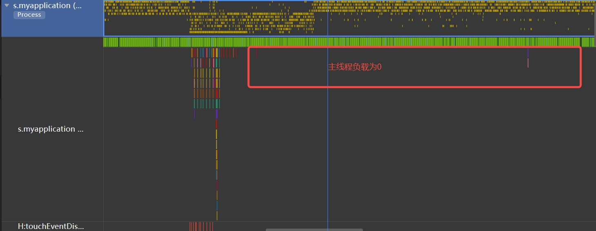
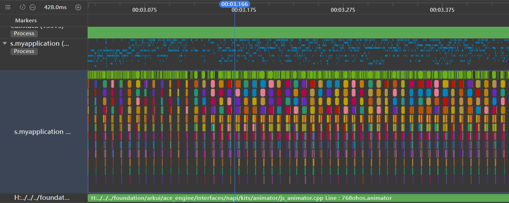

# 使用属性动画替换帧动画

帧动画具备逐帧回调的特性，便于开发者在每一帧中处理需调整的属性。通过向应用提供onFrame逐帧回调，帧动画使开发者能够在应用的每一帧设置属性值，从而实现组件属性值变化的自然过渡，营造出动画效果。帧动画接口详情可参考[@ohos.animator (动画)](../reference/apis-arkui/js-apis-animator.md)。

与属性动画相比，帧动画能让开发者实时感知动画进程，即时调整UI值，具备事件即时响应和可暂停的优势，但在性能上略逊于属性动画。当属性动画能满足需求时，建议优先采用属性动画接口实现。属性动画接口可参考[实现属性动画](../ui/arkts-attribute-animation-apis.md)。

本文对比了属性动画和帧动画实现相同动效在性能上的差异。

**反例：**

```ts
import { AnimatorOptions, AnimatorResult } from '@kit.ArkUI';

@Entry
@Component
struct Index {
  @State animatorOptions: AnimatorResult | undefined = undefined;
  @State animatorStatus: string = '创建';
  begin: number = 0;
  end: number = 100;
  @State widthSize: number = 100;
  @State heightSize: number = 50;
  animatorOption: AnimatorOptions = {
    duration: 2000,
    delay: 0,
    easing: 'linear',
    iterations: 1,
    fill: "forwards",
    direction: 'normal',
    begin: this.begin,
    end: this.end
  };

  onPageShow(): void {
    this.animatorOptions = this.getUIContext().createAnimator(this.animatorOption)
    this.animatorOptions.onFrame = (progress: number) => {
      this.widthSize = 100 + progress
      this.heightSize = 50 + progress/2
    }
  }

  onPageHide(): void {
    this.animatorOptions = undefined;
  }

  build() {
    Column() {
      Column({ space: 30 }) {
        Button('播放').onClick(() => {
          this.animatorOptions?.play();
          this.animatorStatus = '播放中';
        }).width(80).height(35)
      }.width("100%").height('25%')

      Stack() {
        Button()
          .width(this.widthSize).height(this.heightSize)
      }
      .width("100%")
      .height('45%')
      .align(Alignment.Start)

      Text("当前动画状态为:" + this.animatorStatus)
    }.width("100%").height('100%')
  }
}
```

**正例：**

```ts
@Entry
@Component
struct AttrAnimationExample1 {
  @State widthSize: number = 200;
  @State heightSize: number = 100;
  @State flag: boolean = true;

  build() {
    Column() {
      Button('click me')
        .onClick((event?: ClickEvent | undefined) => {
          if (this.flag) {
            this.widthSize = 100;
            this.heightSize = 50;
          } else {
            this.widthSize = 200;
            this.heightSize = 100;
          }
          this.flag = !this.flag;
        })
        .width(this.widthSize).height(this.heightSize).backgroundColor(0x317aff)
        .animation({
          duration: 2000, // 动画时长
          curve: Curve.Linear, // 动画曲线
          delay: 0, // 动画延迟
          iterations: 1, // 播放次数
          playMode: PlayMode.Normal // 动画模式
        }) // 对Button组件的宽高属性进行动画配置
    }.width('100%').margin({ top: 5 })
  }
}
```

更详细的API文档请参考：[属性动画](../reference/apis-arkui/arkui-ts/ts-animatorproperty.md)。

## 优化效果

| 属性动画                                         | 帧动画                                          |   
|----------------------------------------------------|----------------------------------------------------|
|  |  |

上述示例通过使用属性动画将UI应用主线程的负载降为0。