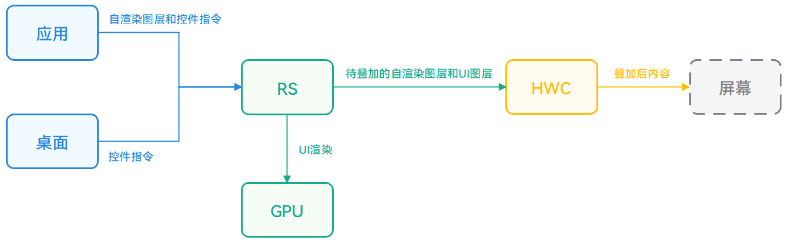
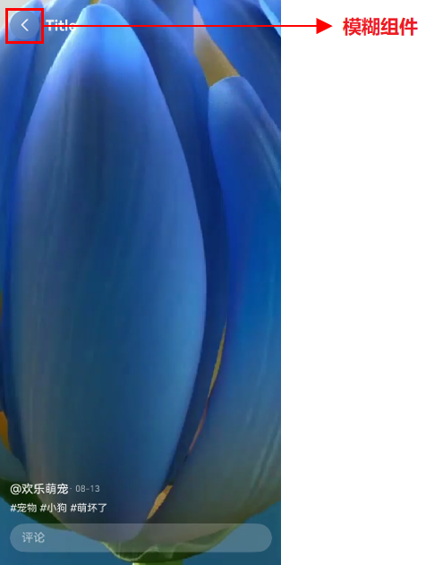
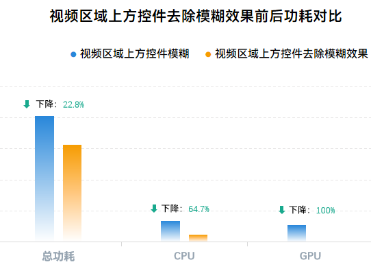
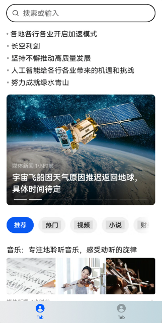
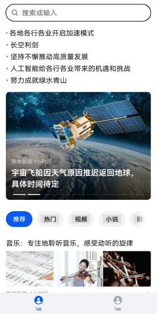
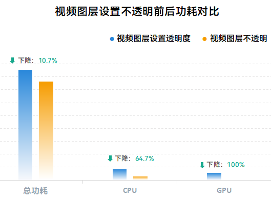

# 高效利用HWC的低功耗设计

## 概述
在应用开发中，开发者可以自由组合ArkUI定义控件、视频、图片、Web网页以及第三方渲染框架生成内容，以满足应用UI界面的需求。同时，系统基于的芯片平台除了通用的CPU/GPU计算单元外，还提供了[Hardware Composer](#图形渲染系统工作流程)（下文简称HWC）专用硬件辅助系统进行图形渲染送显，相对于通用计算单元，在图层叠加场景具有更高的处理效率和更低的能耗。作为专用硬件单元，HWC需要满足一定条件才能充分发挥其硬件能力，降低系统CPU/GPU开销，减少发热和卡顿现象的出现。

因此，在开发类似Web界面、视频播放等多图层叠加场景时，如果其中存在自渲染图层，可以通过以下两种方式调整视效设计，扩大HWC的生效范围：

- 避免非必要高阶视效控件与自渲染内容区域产生交叠。
- 合理调整ArkUI定义控件与自渲染图层间的交叠关系。

开发者可以根据实际业务适当调整界面视效设计，使系统能够充分发挥HWC的能效优势，降低对应操作场景的功耗，提升操作流畅性。

> **说明：**
> 
> 高阶视效是一类视效的统称，该类视效在原理上需要对背景进行采样、取色等操作，如模糊算法需要对背景内容进行采样，反色需要先对背景区域内内容进行颜色的计算等。

## 实现原理
系统接收到应用的UI界面元素由两类组成，一类是直接使用ArkUI提供的现有接口定义的控件，如按钮、进度条、导航栏等，可以称为UI控件。另外一类是应用直接传递已经渲染好的内容，包括视频、图片、Web网页或调用自有或者三方渲染框架已经渲染好的内容（下文统一归类为应用自渲染内容）。对于这两类界面元素，系统在进行处理时的策略有所不同，会结合界面视效的要求综合调用GPU或者HWC进行处理，以达到系统能效最优。

**1. 直接调用ArkUI接口定义的控件，例如Row、Column、Text等。**

```typescript
@Entry
@Component
struct ArkUISample {
  @State message: string = 'Hello World';
  build() {
    Row() {
      Column() {
        Text(this.message)
          .fontSize(50)
          .fontWeight(FontWeight.Bold)
      }
      .width('100%')
    }
    .height('100%')
  }
}
```
  
该内容将由系统根据组件定义及布局进行绘制，用户应用程序不感知具体的绘制过程。

**2. 应用自渲染内容。**

- **Web页面**：此时页面内容将直接替换为url地址传递的内容，使用示例见：[ArkWeb](../web/web-component-overview.md)。

- **视频场景**：该类使用示例见[视频播放](../media/media/video-playback.md)。

- **三方或者自有渲染框架生成内容**：使用Xcomponent组件和接口直接传递内容，使用示例见[自定义渲染 (XComponent)](../ui/napi-xcomponent-guidelines.md)。
  
这类内容在应用进程内进行解码或者调用GPU渲染，再作为整体传递给系统渲染服务进程。

### 图形渲染系统工作流程
下图简要介绍了图形渲染系统当前从应用界面内容至最终屏幕显示的工作流程。



**RenderService (RS)** ：系统渲染服务进程，接收来自于其他系统服务进程（如桌面进程）及用户进程（如应用）的自渲染图层及ArkUI控件绘制指令，进行统一的组合以及渲染控制，其渲染动作会调用CPU/GPU等通用计算器件进行，能力灵活，兼容性强，相对HWC而言，功耗及性能开销较大。

**Hardware Composer (HWC)**：其服务基于专用硬件构建，主要用于多图层的叠加送显，接受来自RS绘制的图层以及应用自渲染图层，将多个图层进行叠加后形成单一图层传递至屏幕。相对于GPU，其功耗及性能优势明显，但除了图层叠加外，并不具备复杂及灵活的渲染能力。

### 图形渲染送显策略
当前系统的整体渲染送显策略简要描述如下：

RS进程会将ArkUI控件统一绘制至UI图层，其UI内容来源于应用定义的ArkUI控件和桌面进程传递的内容（如状态栏、系统导航等）。再基于UI图层和应用自渲染内容的Z序关系，优先使用HWC的图层叠加能力进行后续的送显处理。

在该过程中，UI控件的视效与自渲染图层的Z序关系都将影响HWC的使用。如自渲染图层上方的UI控件使用了模糊等高阶视效，而模糊算法的采样需要实时读取背景自渲染图层的内容，在进行图层叠加时还需要进行额外处理。在这种情况下，无法使能HWC，RS只能采用GPU进行图层间的叠加。

### 如何高效使能HWC
这里结合HWC的特点以及当前系统的渲染送显策略给出如下两点建议，以提升HWC的生效范围，降低应用操作期间可能产生的发热及卡顿概率。

- **在存在自渲染图层的情况下，合理使用高阶视效控件，避免与自渲染内容产生交叠**

    如果UI控件采用模糊等高阶视效，且与自渲染图层区域产生交叠，那么RS在进行该类UI控件绘制时，按照视效算法，需要读取自渲染图层的内容后才能正确的绘制出对应的UI控件。相对于无模糊等高阶视效情况下，会需要额外的内容读取动作，此时会直接使用GPU载入对应自渲染图层并进行渲染动作。

    如上过程，相对于直接使用HWC叠加，会带来额外的CPU/GPU/DDR 开销，造成使用场景的功耗抬升及性能损失。因此建议开发者合理评估UI界面的视效需要，通过UI控件去除模糊等高阶视效或者移动控件位置等方式，避免出现非必要高阶视效控件与自渲染图层交叠的场景。

    > **说明：**
    > 
    >上述优化建议仅从功耗优化角度出发，需要调整界面的视效设计，开发者可根据需要自行选择。

    ***注：典型高阶视效动作列表***

    | 视效类型       | ArkUI接口                  |
    |----------------|----------------------------|
    | 背景模糊       | `.blur()`；`.backdropBlur()` |
    | 提亮           | `.backgroundBrightness()`   |
    | 灰阶           | `.grayscale()`              |
    | 阴影取色       | `.shadow()`                 |
    | 压暗提亮       | `.lightUpEffect()`          |
    | 前景模糊       | `.foregroundEffect()`       |

- **在存在自渲染图层的情况下，合理调整ArkUI定义控件与自渲染图层间的交叠关系**

    这里存在以下两种情况：

    - UI控件定义于自渲染图层下方，且自渲染图层本身设置一定透明度，会导致自渲染图层无法完全遮挡UI控件，在进行渲染处理时，需要进行额外的透明度处理，此时只能使用GPU进行处理而无法使用HWC叠加能力。此时建议开发者评估自渲染图层设定透明度的必要性，如果全透明建议及时下树。或者评估UI控件位于自渲染图层下方的必要性，如一定需要，建议该控件同样使用自渲染形式实现。

    - 两个或以上自渲染图层所在控件设定圆角，且存在区域交叠，此时在进行自渲染图层处理时，需要GPU额外的绘制圆角，此时同样会导致无法使用HWC叠加能力。对此建议评估是否需要多个自渲染图层交叠以及位于底部的自渲染图层圆角是否可以去除。

    典型场景：

    - UI控件上方的视频图层具有一定透明度。
    - 在视频弹幕图层和视频图层间直接用ArkUI控件定义水印控件。
    - 多个视频窗口存在交叠且视频窗口存在圆角。

## 场景案例

### 视频区域上方去除非必要模糊效果

**效果图**



如上图，视频区域左上角的返回按钮控件带有模糊效果，需要进行视频图层的采样动作，无法使用HWC叠加能力。对此可以通过控件去除模糊效果或者移动控件至非视频相交区域来完成对HWC的使能。

此处采用去除控件的模糊效果的方式使能HWC，优化场景功耗。相应对比代码如下：

**视频上方叠加带有模糊效果的Image组件**
```typescript
@Entry
@Component
struct VideoWithBlur {
  build() {
    Stack() {
      // 视频图层
      Video({
        src: $r('app.media.test_video')
      })
        .height('100%')
        .width('100%')
        .loop(true)
        .autoPlay(true)
        .controls(false)

      RelativeContainer() {
        Row() {
          // 返回按钮带有模糊效果
          Image($r('app.media.chevron_left'))
            .padding(12)
            .width(40)
            .height(40)
            .borderRadius('50%')
            .fillColor('rgba(255, 255, 255, 0.9)')
            .backgroundColor('rgba(0, 0, 0, 0.1)')
            .backdropBlur(40) // 组件背景模糊
            .backgroundBlurStyle(BlurStyle.BACKGROUND_REGULAR) // 设置背景模糊材质
          // ...
        }
        // ...
      }
      .height('100%')
      .width('100%')
      .padding({ left: 16, right: 16, top: 36, bottom: 36 })
    }
    .height('100%')
    .width('100%')
  }
}
```

**视频上方Image组件去除模糊效果**
```typescript
@Entry
@Component
struct NormalVideo {
  build() {
    Stack() {
      Video({
        src: $r('app.media.test_video')
      })
        .height('100%')
        .width('100%')
        .loop(true)
        .autoPlay(true)
        .controls(false)

      RelativeContainer() {
        Row() {
          // 返回按钮没有模糊效果
          Image($r('app.media.chevron_left'))
            .padding(12)
            .width(40)
            .height(40)
            .borderRadius('50%')
            .fillColor('rgba(255, 255, 255, 0.9)')
            .backgroundColor('rgba(0, 0, 0, 0.1)')
            // ...
        }
        // ...
      }
      .height('100%')
      .width('100%')
      .padding({ left: 16, right: 16, top: 36, bottom: 36 })
    }
    .height('100%')
    .width('100%')
  }
}
```
去除模糊后的效果图如下所示。


**功耗对比**

同一界面下，测试视频区域上方控件去除模糊效果前后的CPU模块、GPU模块的功耗，以及设备总功耗。测试方式为视频播放30s，以3s为一个节点，取设备从6s运行到21s5个节点的平均功耗。最终，使用DevEco Studio的Profiler工具检测得到的数据如下图所示：



从测试数据可以看出：

1. 视频区域上方控件去除模糊效果后CPU模块的功耗大幅下降，降幅约为64.7%，GPU模块功耗降低至0，降幅为100%。
2. 视频区域上方控件去除模糊效果后总功耗也明显下降，降幅约为22.8%。

测试数据表明，在视频播放场景下，去除视频区域上方控件的模糊效果使能HWC可以大幅度减少GPU模块和CPU模块的功耗，同时对降低设备总体功耗也都有显著效果。

### Web类界面上方去除非必要模糊效果

**效果图**



在该场景下，底部TabBar区域使用模糊，且背景区域使用Web类组件或者Native Xcomponent组件导入自渲染内容，同样导致UI图层与自渲染内容无法使用HWC叠加。对此开发者可以通过去除TabBar区域的模糊视效或者裁剪组件区域避免Web内容与模糊控件相交两种方式进行修改，以达到使用HWC降低功耗的目的。

此处通过去除控件的模糊效果使能HWC，优化场景功耗。相应对比代码如下：

**Web组件上方TabBar控件模糊**
```typescript
import { webview } from '@kit.ArkWeb';

@Entry
@Component
struct WebWithBlur {
  @State currentIndex: number = 0; // 当前选中的Tab页下标
  private webController: webview.WebviewController = new webview.WebviewController();
  private controller: TabsController = new TabsController();

  @Builder
  tabBuilder(title: string, targetIndex: number, selectedImg: Resource, normalImg: Resource) {
    // ...
  }

  build() {
    Tabs({ barPosition: BarPosition.End, index: 0, controller: this.controller }) {
      TabContent() {
        Web({ src: $rawfile('test.html'), controller: this.webController })
      }
      .tabBar(this.tabBuilder('Tab', 0, $r('app.media.tab_icon_activated'), $r('app.media.tab_icon')))
      // ...
    }
    .height('100%')
    .width('100%')
    .barOverlap(true) // 设置TabBar模糊并叠加在TabContent之上
    .barBackgroundColor('rgba(241, 243, 245, 0.3)')
    // ...
  }
}
```
**Web组件上方TabBar控件去除模糊效果**
```typescript
import { webview } from '@kit.ArkWeb';

@Entry
@Component
struct NormalWeb {
  @State currentIndex: number = 0; // 当前选中的Tab页下标
  private webController: webview.WebviewController = new webview.WebviewController();
  private controller: TabsController = new TabsController();

  @Builder
  tabBuilder(title: string, targetIndex: number, selectedImg: Resource, normalImg: Resource) {
    // ...
  }

  build() {
    Tabs({ barPosition: BarPosition.End, index: 0, controller: this.controller }) {
      TabContent() {
        Web({ src: $rawfile('test.html'), controller: this.webController })
      }
      .tabBar(this.tabBuilder('Tab', 0, $r('app.media.tab_icon_activated'), $r('app.media.tab_icon')))
      // ...
    }
    .height('100%')
    .width('100%')
    .barOverlap(true) // 设置TabBar叠加在TabContent之上
    .barBackgroundBlurStyle(BlurStyle.NONE) // 设置TabBar不模糊
    .barBackgroundColor('rgba(241, 243, 245, 1)')
    // ...
  }
}
```
去除模糊后的效果图如下所示。



**功耗对比**

同一界面下，测试Web组件上方控件去除模糊效果前后的CPU模块、GPU模块的功耗，以及设备总功耗。测试方式为同样频率滑动界面30s，以3s为一个节点，取设备从6s运行到21s5个节点的平均功耗。最终，使用DevEco Studio的Profiler工具检测得到的数据如下图所示：


从测试数据可以看出：

1. Web组件上方控件去除模糊效果的主要效用体现在GPU模块，GPU模块降幅约为70.4%。
2. Web组件上方控件去除模糊效果后总功耗和CPU模块均有不同程度的下降，总功耗降幅约为25.5%，CPU模块降幅约为30.7%。

测试数据表明，在Web场景下，去除Web上方控件的模糊效果使能HWC可以大幅度减少GPU模块的功耗，同时对降低CPU模块功耗和设备总体功耗也都有显著效果。

### 避免UI控件上方自渲染图层设置透明度

**效果图**


该场景UI控件上方的视频图层设置有一定透明度，可以一定程度上透视底部UI控件，此时需要使用GPU进行额外的透明度处理，无法使用HWC叠加。对此建议开发者评估视频图层设置透明度的必要性，是否可以调整视频图层为不透明。如果必须设置透明度，也可以通过调整UI控件位置至视频图层上方或者使用自绘制方式实现UI控件来使能HWC。

此处通过调整视频图层为不透明来使能HWC，达到优化功耗的目标。相应对比代码如下：

**视频图层设置透明度**
```typescript
@Entry
@Component
struct TransparentVideo {
  build() {
    RelativeContainer() {
      // 底部UI控件
      Image($r('app.media.watermark'))
        .width(200)
        .height(80)
        .alignRules({
          center: { anchor: '__container__', align: VerticalAlign.Center },
          middle: { anchor: '__container__', align: HorizontalAlign.Center }
        })
      // 视频图层
      Video({
        src: $r('app.media.test_video')
      })
        .height('100%')
        .width('100%')
        .loop(true)
        .autoPlay(true)
        .controls(false)
        .alignRules({
          center: { anchor: '__container__', align: VerticalAlign.Center },
          middle: { anchor: '__container__', align: HorizontalAlign.Center }
        })
        .opacity(0.7) // 视频图层设置透明度
    }
    .height('100%')
    .width('100%')
  }
}
```
**视频图层不透明**
```typescript
@Entry
@Component
struct OpaqueVideo {
  build() {
    RelativeContainer() {
      // 底部UI控件
      Image($r('app.media.watermark'))
        .width(200)
        .height(80)
        .alignRules({
          center: { anchor: '__container__', align: VerticalAlign.Center },
          middle: { anchor: '__container__', align: HorizontalAlign.Center }
        })
      // 视频图层
      Video({
        src: $r('app.media.test_video')
      })
        .height('100%')
        .width('100%')
        .loop(true)
        .autoPlay(true)
        .controls(false)
        .alignRules({
          top: { anchor: '__container__', align: VerticalAlign.Top },
          middle: { anchor: '__container__', align: HorizontalAlign.Center }
        })
        .opacity(1) // 视频图层不透明
    }
    .height('100%')
    .width('100%')
  }
}
```
设置视频不透明后的效果图如下所示：


**功耗对比**

同一界面下，测试视频图层设置不透明前后的CPU模块、GPU模块的功耗，以及设备总功耗。测试方式为视频播放30s，以3s为一个节点，取设备从6s运行到21s5个节点的平均功耗。最终，使用DevEco Studio的Profiler工具检测得到的数据如下图所示：



从测试数据可以看出：

1. 视频图层设置不透明后CPU模块的功耗大幅下降，降幅约为64.7%，GPU模块功耗降低至0，降幅为100%。
2. 视频图层设置不透明后设备总功耗也小幅下降，降幅约为10.7%。

测试数据表明，在视频位于UI控件上方进行播放时，视频设置不透明使能HWC可以大幅度减少GPU模块和CPU模块的功耗，对降低设备总体功耗也都有一定效果。

## 总结

本文基于图形渲染系统的硬件特点以及基本原理，给出了如何更多使用HWC以减少应用使用期间发热及卡顿的方案，并通过常见的Web界面、视频播放等场景的示例给出具体的案例实施及效果。开发者可以应用本文中的优化建议，综合考虑视效、功耗及性能间的诉求来提升应用使用期间的综合体验。